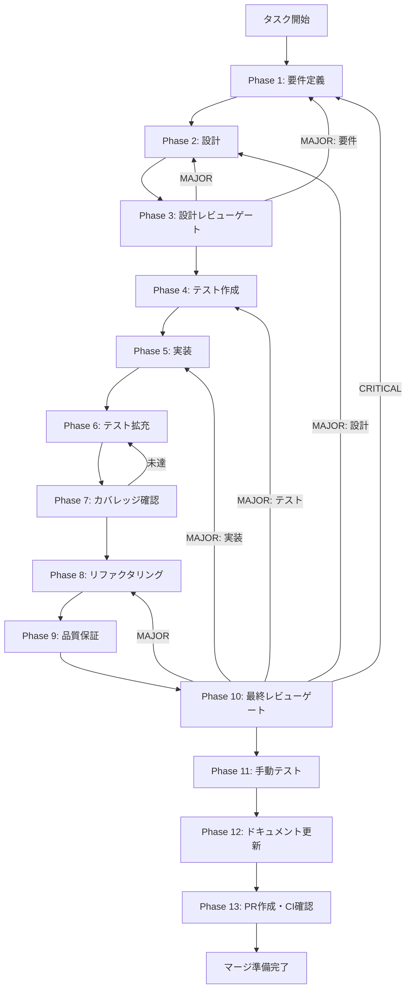

# drizzle-repository-implementation - タスク実行仕様書

## ユーザーからの元の指示

```
Drizzle ORM Repository実装

Clean Architectureで定義されたリポジトリインターフェース（IChatSessionRepository, IChatMessageRepository）を、
Drizzle ORMを使用して実装する。

関連Issue: #400
```

## メタ情報

| 項目         | 内容                              |
| ------------ | --------------------------------- |
| タスクID     | UT-005                            |
| タスク名     | drizzle-repository-implementation |
| 分類         | リファクタリング                  |
| 対象機能     | チャット履歴機能（chat-history）  |
| 優先度       | 高                                |
| 見積もり規模 | 中規模                            |
| ステータス   | 未実施                            |
| 作成日       | 2026-01-22                        |
| 関連Issue    | #400                              |

---

## タスク概要

### 目的

Clean Architectureリファクタリング（ARCH-001）で定義されたリポジトリインターフェースを、本番環境で使用するDrizzle ORMベースで実装する。これにより、テスト用InMemoryRepositoryから本番用永続化層への切り替えが可能となる。

### 背景

ARCH-001 Clean Architectureリファクタリングにてチャット履歴機能のDomain/Application/Infrastructure各層の設計・実装が完了した。現在テスト用としてInMemoryRepositoryが実装されているが、本番環境で使用するDrizzle ORMベースのリポジトリは未実装である。

Repository PatternとDependency Inversion Principleにより、InMemoryからDrizzleへの置換は既存インターフェースに沿った実装で完了する。

### 最終ゴール

- `DrizzleChatSessionRepository` クラスの完全実装
- `DrizzleChatMessageRepository` クラスの完全実装
- 既存DBスキーマ（`packages/shared/src/db/schema/chat-history.ts`）との統合
- 全ユニットテストのパス（カバレッジ ≥ 80%）
- 型エラー・Lintエラー 0件

### 成果物一覧

| 種別         | 成果物                               | 配置先                                                                            |
| ------------ | ------------------------------------ | --------------------------------------------------------------------------------- |
| 機能         | DrizzleChatSessionRepository.ts      | `packages/shared/src/features/chat-history/infrastructure/persistence/`           |
| 機能         | DrizzleChatMessageRepository.ts      | `packages/shared/src/features/chat-history/infrastructure/persistence/`           |
| テスト       | DrizzleChatSessionRepository.test.ts | `packages/shared/src/features/chat-history/infrastructure/persistence/__tests__/` |
| テスト       | DrizzleChatMessageRepository.test.ts | `packages/shared/src/features/chat-history/infrastructure/persistence/__tests__/` |
| ドキュメント | 実装ガイド                           | `outputs/phase-12/implementation-guide.md`                                        |
| PR           | GitHub Pull Request                  | GitHub UI                                                                         |

---

## 参照ファイル

本仕様書のコマンド選定は以下を参照：

- `.claude/skills/aiworkflow-requirements/references/architecture-chat-history.md` - アーキテクチャ仕様
- `.claude/skills/aiworkflow-requirements/references/interfaces-chat-history.md` - インターフェース仕様
- `.claude/skills/aiworkflow-requirements/references/api-chat-history.md` - API仕様
- `packages/shared/src/db/schema/chat-history.ts` - DBスキーマ定義
- `packages/shared/src/features/chat-history/domain/repositories/` - リポジトリインターフェース

---

## タスク分解サマリー

| ID     | フェーズ | サブタスク名                     | 責務                             | 依存 |
| ------ | -------- | -------------------------------- | -------------------------------- | ---- |
| T-01-1 | Phase 1  | 要件定義・スコープ確定           | 機能要件・非機能要件の明確化     | -    |
| T-02-1 | Phase 2  | 詳細設計                         | クラス設計・メソッド仕様の策定   | T-01 |
| T-03-1 | Phase 3  | 設計レビューゲート               | 設計の妥当性検証                 | T-02 |
| T-04-1 | Phase 4  | テスト作成（TDD Red）            | 失敗するテストケースの作成       | T-03 |
| T-05-1 | Phase 5  | 実装（TDD Green）                | テストを通す最小限の実装         | T-04 |
| T-06-1 | Phase 6  | テスト拡充                       | カバレッジ向上のための追加テスト | T-05 |
| T-07-1 | Phase 7  | カバレッジ確認                   | カバレッジ目標達成の検証         | T-06 |
| T-08-1 | Phase 8  | リファクタリング（TDD Refactor） | コード品質改善                   | T-07 |
| T-09-1 | Phase 9  | 品質保証                         | 静的解析・セキュリティチェック   | T-08 |
| T-10-1 | Phase 10 | 最終レビューゲート               | 全体品質・整合性検証             | T-09 |
| T-11-1 | Phase 11 | 手動テスト                       | UX・実環境動作確認               | T-10 |
| T-12-1 | Phase 12 | ドキュメント更新                 | 実装ガイド・システム仕様更新     | T-11 |
| T-13-1 | Phase 13 | PR作成・CI確認                   | コミット・PR作成・CI/CD確認      | T-12 |

**総サブタスク数**: 13個

---

## 実行フロー図



---

## Phase一覧

| Phase | 名称               | 仕様書                                                 | ステータス |
| ----- | ------------------ | ------------------------------------------------------ | ---------- |
| 1     | 要件定義           | [phase-1-requirements.md](phase-1-requirements.md)     | 未実施     |
| 2     | 設計               | [phase-2-design.md](phase-2-design.md)                 | 未実施     |
| 3     | 設計レビューゲート | [phase-3-design-review.md](phase-3-design-review.md)   | 未実施     |
| 4     | テスト作成         | [phase-4-test-creation.md](phase-4-test-creation.md)   | 未実施     |
| 5     | 実装               | [phase-5-implementation.md](phase-5-implementation.md) | 未実施     |
| 6     | テスト拡充         | [phase-6-test-expansion.md](phase-6-test-expansion.md) | 未実施     |
| 7     | カバレッジ確認     | [phase-7-coverage-check.md](phase-7-coverage-check.md) | 未実施     |
| 8     | リファクタリング   | [phase-8-refactoring.md](phase-8-refactoring.md)       | 未実施     |
| 9     | 品質保証           | [phase-9-quality.md](phase-9-quality.md)               | 未実施     |
| 10    | 最終レビューゲート | [phase-10-final-review.md](phase-10-final-review.md)   | 未実施     |
| 11    | 手動テスト         | [phase-11-manual-test.md](phase-11-manual-test.md)     | 未実施     |
| 12    | ドキュメント更新   | [phase-12-documentation.md](phase-12-documentation.md) | 未実施     |
| 13    | PR作成             | [phase-13-pr-creation.md](phase-13-pr-creation.md)     | 未実施     |

---

## テストカバレッジ目標

### ユニットテスト

| 指標              | 最低基準 | 推奨基準 |
| ----------------- | -------- | -------- |
| Line Coverage     | 80%      | 90%      |
| Branch Coverage   | 60%      | 70%      |
| Function Coverage | 80%      | 90%      |

### 結合テスト

| 指標                         | 目標 |
| ---------------------------- | ---- |
| APIエンドポイント            | 100% |
| モジュール間インターフェース | 100% |
| 正常系シナリオ               | 100% |
| 異常系シナリオ               | 80%+ |
| 外部連携ポイント             | 100% |

---

## 統合テスト連携（Phase 1〜11で必須）

各Phaseで以下の統合テスト連携アクションを実施すること:

| Phase | 統合テスト連携アクション                                 |
| ----- | -------------------------------------------------------- |
| 1     | DB接続要件・トランザクション要件を要件に明記             |
| 2     | Repository-DB間インターフェース・Drizzle APIを設計に反映 |
| 3     | 統合テスト観点のレビューゲートを実施                     |
| 4     | DB接続モック・実DBテストシナリオを全カテゴリで作成       |
| 5     | Drizzle接続実装とテスト支援コード整備                    |
| 6     | 統合テストの拡充（全カテゴリのカバレッジ向上）           |
| 7     | 統合テストの再実行とゲート判定                           |
| 8     | リファクタ後の統合テスト継続成功を確認                   |
| 9     | 品質保証で統合テスト結果を確認                           |
| 10    | 最終レビューで統合テスト結果を確認                       |
| 11    | 手動統合テスト（Repository-DB接続）を確認                |

---

## Phase完了時の必須アクション

**各Phase完了時に以下を必ず実行すること:**

1. **タスク100%実行**: Phase内で指定された全タスクを完全に実行
2. **成果物確認**: 全ての必須成果物が生成されていることを検証
3. **実行記録**: 実行タスクの結果を記録
4. **artifacts.json更新**: Phase完了ステータスを更新
5. **Phase末端の実行確認**: 各タスクを100%実行し、各タスクを完遂した旨を必ず明記

```bash
# Phase完了時の検証コマンド
node .claude/skills/task-specification-creator/scripts/validate-phase-output.js \
  docs/30-workflows/drizzle-repository-implementation --phase {{PHASE_NUMBER}}

# Phase完了・成果物登録
node .claude/skills/task-specification-creator/scripts/complete-phase.js \
  --workflow docs/30-workflows/drizzle-repository-implementation \
  --phase {{PHASE_NUMBER}} --artifacts "..."
```

---

## 技術スタック

| 項目           | 技術                  |
| -------------- | --------------------- |
| ORM            | Drizzle ORM           |
| Database       | SQLite (Turso/libSQL) |
| Testing        | Vitest                |
| Language       | TypeScript 5.x        |
| Architecture   | Clean Architecture    |
| Design Pattern | Repository Pattern    |

---

## 関連ドキュメント

| ドキュメント         | パス                                                                             |
| -------------------- | -------------------------------------------------------------------------------- |
| アーキテクチャ仕様   | `.claude/skills/aiworkflow-requirements/references/architecture-chat-history.md` |
| インターフェース仕様 | `.claude/skills/aiworkflow-requirements/references/interfaces-chat-history.md`   |
| API仕様              | `.claude/skills/aiworkflow-requirements/references/api-chat-history.md`          |
| DBスキーマ           | `packages/shared/src/db/schema/chat-history.ts`                                  |
| 元タスク指示書       | `docs/30-workflows/unassigned-task/task-drizzle-repository-implementation.md`    |
