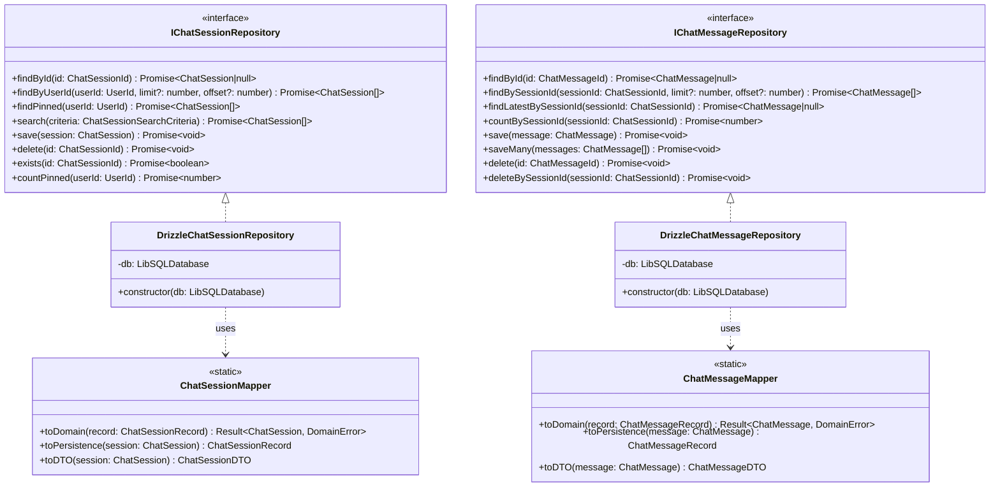
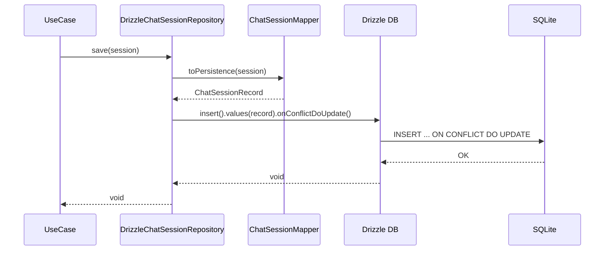
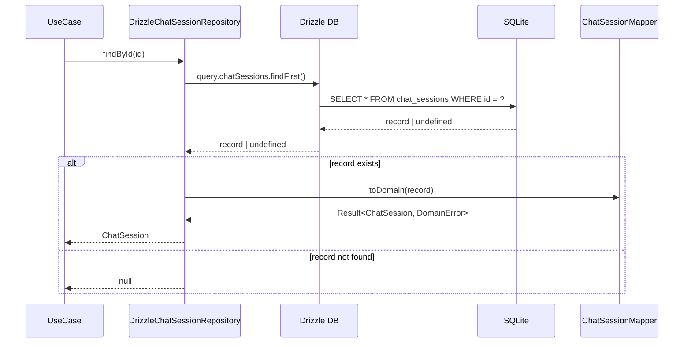
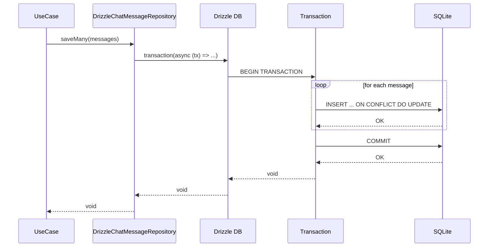

# Phase 2 - タスク6: 詳細設計書（統合版）

## メタ情報

| 項目       | 内容                              |
| ---------- | --------------------------------- |
| Phase      | 2                                 |
| タスク番号 | 6                                 |
| 作成日     | 2026-01-22                        |
| 機能名     | drizzle-repository-implementation |

---

## 設計概要

本設計書は、Drizzle ORMを使用したチャット履歴リポジトリの詳細設計を統合したドキュメントである。

### 設計成果物一覧

| ドキュメント                              | 内容                          |
| ----------------------------------------- | ----------------------------- |
| drizzle-chat-session-repository-design.md | Session Repository クラス設計 |
| drizzle-chat-message-repository-design.md | Message Repository クラス設計 |
| drizzle-query-patterns.md                 | Drizzle クエリパターン設計    |
| error-handling-design.md                  | エラーハンドリング設計        |
| test-strategy.md                          | テスト戦略設計                |

---

## クラス図



---

## シーケンス図

### save（Upsert）フロー



### findById フロー



### saveMany（トランザクション）フロー



---

## 設計判断の根拠

### 1. Mapperの再利用

**判断**: 既存の `ChatSessionMapper`, `ChatMessageMapper` をそのまま再利用

**根拠**:

- Phase 1で型互換性を確認済み
- 変換ロジックが完備されている
- Result型によるエラーハンドリングが実装済み

### 2. エラーハンドリング方針

**判断**: Repository層では `DatabaseError` をスロー、Mapper層では `Result<T, E>` を返却

**根拠**:

- インターフェースが `Promise<T>` を規定
- 既存エラー体系との整合性
- 上位層（UseCase）での統一的なエラー処理

### 3. トランザクション使用箇所

**判断**: `saveMany` でのみトランザクション必須、他メソッドは単一操作で原子的

**根拠**:

- 複数操作の全件成功保証が必要
- SQLiteの単一操作は暗黙的トランザクション

### 4. テスト戦略

**判断**: インメモリSQLiteを使用した実DBテスト

**根拠**:

- クエリの正確性を実環境に近い形で検証
- モックでは検出困難なDB固有の問題を検出
- Vitest + better-sqlite3 で高速なテスト実行

### 5. ソフトデリート対応

**判断**: 現時点では物理削除、deletedAtフィールドは将来対応

**根拠**:

- スコープ定義で将来対応と明記
- 現行インターフェースに影響なし
- フィールドは既に存在するため、後から対応可能

---

## 技術的制約

| 制約                                 | 対応                               |
| ------------------------------------ | ---------------------------------- |
| SQLiteはネストトランザクション非対応 | 単一レベルトランザクションのみ使用 |
| FTS5は別途対応                       | search()はLIKE検索で実装           |
| libSQLのバッチINSERT制限             | ループ内個別INSERTで対応           |

---

## ファイル構成

```
packages/shared/src/features/chat-history/infrastructure/persistence/
├── DrizzleChatSessionRepository.ts    # 新規作成
├── DrizzleChatMessageRepository.ts    # 新規作成
├── mappers/
│   ├── ChatSessionMapper.ts           # 既存（再利用）
│   └── ChatMessageMapper.ts           # 既存（再利用）
└── __tests__/
    ├── DrizzleChatSessionRepository.test.ts    # 新規作成
    ├── DrizzleChatMessageRepository.test.ts    # 新規作成
    ├── DrizzleRepositoryIntegration.test.ts    # 新規作成
    └── helpers/
        ├── testDatabase.ts             # 新規作成
        └── testDataFactory.ts          # 新規作成
```

---

## 実装順序

1. **テストヘルパー作成** - testDatabase.ts, testDataFactory.ts
2. **Session Repository実装** - DrizzleChatSessionRepository.ts
3. **Session Repository テスト** - DrizzleChatSessionRepository.test.ts
4. **Message Repository実装** - DrizzleChatMessageRepository.ts
5. **Message Repository テスト** - DrizzleChatMessageRepository.test.ts
6. **統合テスト** - DrizzleRepositoryIntegration.test.ts

---

## 統合テスト連携

### Phase 2での統合テスト連携アクション

- [x] Repository-DB間インターフェース（LibSQLDatabase型）を設計に反映
- [x] Drizzle API使用パターン（findFirst, findMany, insert, delete）を設計に反映
- [x] DB接続・クエリエラーのハンドリング（DatabaseError）を設計に反映
- [x] テスト環境（インメモリSQLite + better-sqlite3）のセットアップ手順を設計

---

## 完了確認

- [x] DrizzleChatSessionRepository の全メソッド（8メソッド）の実装方針が策定されている
- [x] DrizzleChatMessageRepository の全メソッド（8メソッド）の実装方針が策定されている
- [x] 各クエリパターン（Select/Insert/Update/Delete/FTS5）が設計されている
- [x] エラーハンドリング方針が既存エラー体系と整合している
- [x] テスト戦略（テスト環境、テストカテゴリ、モック戦略）が設計されている
- [x] 詳細設計書（統合版）が作成されている
- [x] クラス図・シーケンス図が作成されている
- [x] 設計判断の根拠が記録されている
