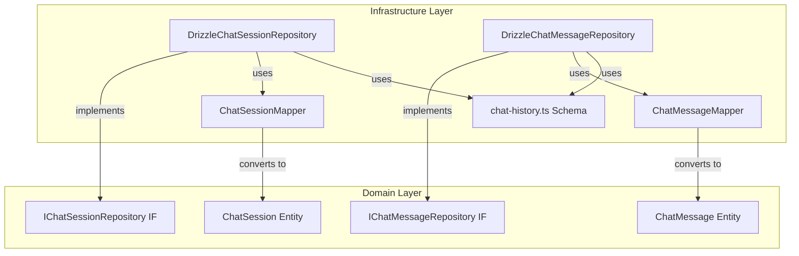

# Phase 3 - タスク3: アーキテクチャ準拠チェック結果

## メタ情報

| 項目       | 内容                              |
| ---------- | --------------------------------- |
| Phase      | 3                                 |
| タスク番号 | 3                                 |
| 作成日     | 2026-01-22                        |
| 機能名     | drizzle-repository-implementation |

---

## Clean Architecture概要

```
┌─────────────────────────────────────────────────────────┐
│                    Presentation Layer                    │
│                    (UI / Controllers)                    │
├─────────────────────────────────────────────────────────┤
│                    Application Layer                     │
│                    (Use Cases / DTOs)                    │
├─────────────────────────────────────────────────────────┤
│                      Domain Layer                        │
│            (Entities / Value Objects / Repositories IF)  │
├─────────────────────────────────────────────────────────┤
│                  Infrastructure Layer                    │
│            (Repository Impl / DB Schema / Mappers)       │
└─────────────────────────────────────────────────────────┘
```

---

## 依存関係ルールのチェック

### チェック結果

| チェック項目                                                 | 結果 | 備考                                       |
| ------------------------------------------------------------ | ---- | ------------------------------------------ |
| Repository実装がDomain層のインターフェースに依存しているか   | ✅   | `implements IChatSessionRepository` で依存 |
| Repository実装がDBスキーマ（Infrastructure）に依存しているか | ✅   | `chatSessions`, `chatMessages` をimport    |
| Domain層への逆依存がないか                                   | ✅   | Infrastructure→Domainの一方向依存のみ      |
| Application層への逆依存がないか                              | ✅   | Repository実装はApplication層に依存しない  |

### 依存関係図



**判定: ✅ PASS** - 依存関係ルールに準拠

---

## 層間境界のチェック

### チェック結果

| チェック項目                             | 結果 | 備考                                |
| ---------------------------------------- | ---- | ----------------------------------- |
| Mapperがレイヤー間の変換を担当しているか | ✅   | toDomain/toPersistence で双方向変換 |
| DTOとEntityが適切に分離されているか      | ✅   | ChatSessionDTO ≠ ChatSession Entity |
| DBレコード型とEntity型が分離されているか | ✅   | ChatSessionRecord ≠ ChatSession     |

### 変換フロー

```
DB Record (Infrastructure)
    ↓ ChatSessionMapper.toDomain()
ChatSession Entity (Domain)
    ↓ sessionToDTO()
ChatSessionDTO (Application)
```

**判定: ✅ PASS** - 層間境界が適切に維持されている

---

## 依存性逆転原則（DIP）のチェック

### チェック結果

| チェック項目                                         | 結果 | 備考                                       |
| ---------------------------------------------------- | ---- | ------------------------------------------ |
| Use CaseがRepositoryインターフェースに依存しているか | ✅   | Use Caseは IChatSessionRepository に依存   |
| 具体実装がインターフェースに依存しているか           | ✅   | DrizzleChatSessionRepository implements IF |
| DIコンテナでの差し替え可能性が確保されているか       | ✅   | 構造上はDI可能（実装は別タスク UT-006）    |

### DIの構造

```typescript
// 依存性逆転の構造
// Domain Layer（抽象）
interface IChatSessionRepository { ... }

// Infrastructure Layer（具体実装）
class DrizzleChatSessionRepository implements IChatSessionRepository { ... }

// Application Layer（Use Case）
class GetSessionUseCase {
  constructor(private readonly sessionRepository: IChatSessionRepository) {}
  // インターフェースに依存、具体実装に依存しない
}
```

**判定: ✅ PASS** - 依存性逆転原則に準拠

---

## 追加チェック項目

### 単一責任原則（SRP）

| チェック項目                                 | 結果 | 備考                                    |
| -------------------------------------------- | ---- | --------------------------------------- |
| Repositoryがデータアクセスのみに責務を持つか | ✅   | ビジネスロジックはEntity/Use Caseが担当 |
| Mapperが変換のみに責務を持つか               | ✅   | toDomain/toPersistence/toDTO のみ       |

### インターフェース分離原則（ISP）

| チェック項目                                                        | 結果 | 備考                         |
| ------------------------------------------------------------------- | ---- | ---------------------------- |
| IChatSessionRepository と IChatMessageRepository が分離されているか | ✅   | 別インターフェースとして定義 |
| 不必要なメソッドを実装クラスに強制していないか                      | ✅   | 全メソッドが必要かつ適切     |

---

## 総合評価

| カテゴリ             | 評価    | 備考                       |
| -------------------- | ------- | -------------------------- |
| 依存関係ルール       | ✅ PASS | 一方向依存が維持されている |
| 層間境界             | ✅ PASS | Mapperが変換を担当         |
| 依存性逆転原則       | ✅ PASS | インターフェース依存が実現 |
| 単一責任原則         | ✅ PASS | 責務が適切に分離           |
| インターフェース分離 | ✅ PASS | Repository IFが分離        |

**総合判定: ✅ PASS**

設計はClean Architecture原則に完全に準拠している。
