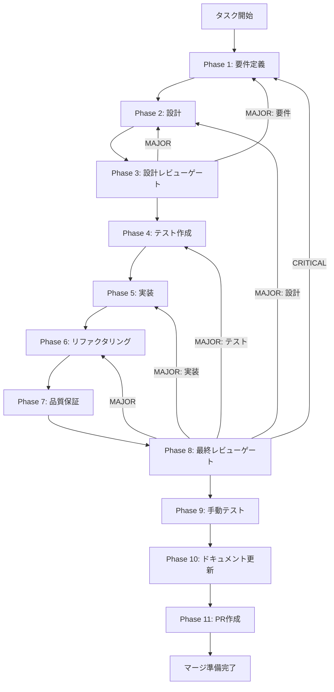

# エンティティ抽出サービス (NER) - タスク実行仕様書

## ユーザーからの元の指示

```
task-06-04-entity-extraction-ner.md のタスクを実装する。
ドキュメントチャンクから重要なエンティティ（人物、組織、概念、技術等）を抽出するサービスを実装する。
Knowledge Graph構築の基盤となる。
```

## メタ情報

| 項目         | 内容                                       |
| ------------ | ------------------------------------------ |
| タスクID     | CONV-06-04                                 |
| タスク名     | エンティティ抽出サービス (NER)             |
| 分類         | 新機能                                     |
| 対象機能     | HybridRAG パイプライン                     |
| 優先度       | 高                                         |
| 見積もり規模 | 中規模                                     |
| ステータス   | 未実施                                     |
| 作成日       | 2026-01-05                                 |
| 依存タスク   | CONV-03-04 (エンティティ・関係スキーマ) ✅ |

---

## タスク概要

### 目的

ドキュメントチャンクから重要なエンティティ（人物、組織、概念、技術等）を抽出するサービスを実装する。Knowledge Graph構築の基盤となる。

### 背景

HybridRAGパイプラインにおいて、エンティティ抽出はKnowledge Graph構築の前提となる重要な機能。LLMベースとルールベースの2つのアプローチを提供し、精度と処理速度のトレードオフに対応する。

### 最終ゴール

1. LLMベースのエンティティ抽出サービスが動作する
2. ルールベースのエンティティ抽出サービスが動作する（フォールバック用）
3. バッチ処理による複数チャンクからの抽出が動作する
4. 重複エンティティのマージが動作する
5. 全テストがパス

### 成果物一覧

| 種別         | 成果物                   | 配置先                                               |
| ------------ | ------------------------ | ---------------------------------------------------- |
| サービス     | LLMEntityExtractor       | `packages/shared/src/services/extraction/`           |
| サービス     | RuleBasedEntityExtractor | `packages/shared/src/services/extraction/`           |
| 型定義       | extraction types         | `packages/shared/src/services/extraction/types.ts`   |
| プロンプト   | entity-extraction-prompt | `packages/shared/src/services/extraction/prompts/`   |
| テスト       | entity-extractor.test.ts | `packages/shared/src/services/extraction/__tests__/` |
| ドキュメント | 実装ガイド               | `outputs/phase-10/implementation-guide.md`           |
| PR           | GitHub Pull Request      | GitHub UI                                            |

---

## 参照ファイル

本仕様書の実装は以下を参照：

- `docs/30-workflows/unassigned-task/task-06-04-entity-extraction-ner.md` - 元タスク指示書
- `docs/30-workflows/completed-tasks/task-03-04-entity-relation-schemas.md` - 依存スキーマ
- `.claude/skills/aiworkflow-requirements/references/` - システム仕様

---

## タスク分解サマリー

| ID     | フェーズ | サブタスク名       | 責務                         | 依存 |
| ------ | -------- | ------------------ | ---------------------------- | ---- |
| T-01-1 | Phase 1  | 要件定義           | 機能要件・非機能要件定義     | -    |
| T-02-1 | Phase 2  | アーキテクチャ設計 | インターフェース・クラス設計 | T-01 |
| T-03-1 | Phase 3  | 設計レビュー       | 設計妥当性検証               | T-02 |
| T-04-1 | Phase 4  | テスト作成         | TDD Red - 失敗テスト作成     | T-03 |
| T-05-1 | Phase 5  | 実装               | TDD Green - 実装             | T-04 |
| T-06-1 | Phase 6  | リファクタリング   | コード品質改善               | T-05 |
| T-07-1 | Phase 7  | 品質保証           | 静的解析・セキュリティ       | T-06 |
| T-08-1 | Phase 8  | 最終レビュー       | 全体品質検証                 | T-07 |
| T-09-1 | Phase 9  | 手動テスト         | 実環境動作確認               | T-08 |
| T-10-1 | Phase 10 | ドキュメント更新   | 実装ガイド・未タスク検出     | T-09 |
| T-11-1 | Phase 11 | PR作成             | コミット・PR・CI確認         | T-10 |

**総サブタスク数**: 11個

---

## 実行フロー図



---

## 選定スキル一覧

| Phase | スキル名                         | 選定理由                   |
| ----- | -------------------------------- | -------------------------- |
| 1     | acceptance-criteria-writing      | 受け入れ基準の明確化       |
| 1     | aiworkflow-requirements          | システム仕様との整合性確認 |
| 2     | clean-architecture-principles    | レイヤー分離・依存関係設計 |
| 2     | type-safety-patterns             | TypeScript型安全性設計     |
| 2     | interface-segregation            | インターフェース設計       |
| 3     | code-smell-detection             | 設計上の問題検出           |
| 4     | tdd-principles                   | テスト駆動開発の原則       |
| 4     | test-doubles                     | モック・スタブ設計         |
| 5     | zod-validation                   | スキーマバリデーション     |
| 5     | clean-code-practices             | 可読性・保守性の高いコード |
| 6     | refactoring-patterns             | リファクタリングパターン   |
| 7     | code-static-analysis-security    | セキュリティ・静的解析     |
| 10    | api-documentation-best-practices | ドキュメント作成           |

---

## Phase一覧

| Phase | ファイル名                | ステータス |
| ----- | ------------------------- | ---------- |
| 1     | phase-1-requirements.md   | 未実施     |
| 2     | phase-2-design.md         | 未実施     |
| 3     | phase-3-design-review.md  | 未実施     |
| 4     | phase-4-test.md           | 未実施     |
| 5     | phase-5-implementation.md | 未実施     |
| 6     | phase-6-refactoring.md    | 未実施     |
| 7     | phase-7-quality.md        | 未実施     |
| 8     | phase-8-final-review.md   | 未実施     |
| 9     | phase-9-manual-test.md    | 未実施     |
| 10    | phase-10-docs.md          | 未実施     |
| 11    | phase-11-pr.md            | 未実施     |

---

## 変更履歴

| Version | Date       | Changes  |
| ------- | ---------- | -------- |
| 1.0.0   | 2026-01-05 | 初版作成 |
