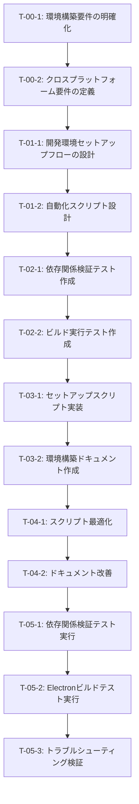

# デスクトップアプリ環境構築 - タスク実行仕様書

## ユーザーからの元の指示

```
環境構築を行いたいです。Macで使えるデスクトップ、将来的にはWindowsアプリも作りたいです。ただし、現状はMacのみでOKです。将来的にこのように対応できるように、Windowsでも対応できる構成として考えておいてください。

あとは、どういうものをインストールすればいいのか、最新の情報を集めてインストール方法も記述するようにしておいてください。まずは環境構築のみ行うようにしたいです。
```

---

## タスク概要

### 目的

Electronデスクトップアプリケーション開発のための完全な開発環境を構築し、Mac環境で即座に開発を開始できる状態にする。将来的なWindows対応を見据えたクロスプラットフォーム互換性を確保する。

### 背景

- 現在のプロジェクトは既にElectronアーキテクチャを持つ（モノレポ構成: `apps/web`, `apps/desktop`, `packages/shared`）
- Mac環境での開発が主体だが、将来的なWindows対応も考慮した設定が必要
- 最新のツールとベストプラクティスに基づいた環境構築を実施
- 開発者がインストール方法を明確に理解し、再現可能な環境を構築できるようにする

### 最終ゴール

- Mac環境でElectronデスクトップアプリの開発・ビルド・実行が可能な状態
- 全ての必要なツールが正しいバージョンでインストールされている
- 環境構築手順が詳細にドキュメント化されている
- Windows対応の準備が整っている（ビルド設定、依存関係）

### 成果物一覧

| 種別         | 成果物                       | 配置先                                                |
| ------------ | ---------------------------- | ----------------------------------------------------- |
| ドキュメント | 環境構築ガイド               | `docs/10-architecture/environment-setup-guide.md`     |
| ドキュメント | インストール手順書           | `docs/10-architecture/installation-instructions.md`   |
| ドキュメント | トラブルシューティングガイド | `docs/10-architecture/troubleshooting-environment.md` |
| スクリプト   | 自動セットアップスクリプト   | `scripts/setup-dev-environment.sh`                    |
| スクリプト   | 依存関係検証スクリプト       | `scripts/verify-dependencies.mjs`                     |
| 設定         | 環境変数テンプレート         | `.env.example`                                        |

---

## 参照ファイル

本仕様書のコマンド・エージェント・スキル選定は以下を参照：

- `docs/00-requirements/master_system_design.md` - システム要件（既存Electronアーキテクチャ確認済み）
- `.claude/agents/agent_list.md` - エージェント定義（Electronチーム: @electron-architect, @electron-builder, @electron-ui-dev, @electron-security, @electron-release）
- `.claude/skills/skill_list.md` - スキル定義（Electron関連スキル、環境構築関連スキル）

---

## タスク分解サマリー

| ID     | フェーズ                  | サブタスク名                     | 責務                                               | 依存   |
| ------ | ------------------------- | -------------------------------- | -------------------------------------------------- | ------ |
| T-00-1 | Phase 0: 要件定義         | 環境構築要件の明確化             | 必要なツール・バージョン・設定の洗い出し           | なし   |
| T-00-2 | Phase 0: 要件定義         | クロスプラットフォーム要件の定義 | Mac/Windows対応要件の明確化                        | T-00-1 |
| T-01-1 | Phase 1: 設計             | 開発環境セットアップフローの設計 | インストール順序・依存関係の設計                   | T-00-2 |
| T-01-2 | Phase 1: 設計             | 自動化スクリプト設計             | セットアップ自動化の設計                           | T-01-1 |
| T-02-1 | Phase 2: テスト作成       | 依存関係検証テスト作成           | インストール確認テストの作成                       | T-01-2 |
| T-02-2 | Phase 2: テスト作成       | ビルド実行テスト作成             | Electronビルド成功確認テストの作成                 | T-02-1 |
| T-03-1 | Phase 3: 実装             | セットアップスクリプト実装       | 自動インストールスクリプトの実装                   | T-02-2 |
| T-03-2 | Phase 3: 実装             | 環境構築ドキュメント作成         | 詳細なインストール手順書の作成                     | T-03-1 |
| T-04-1 | Phase 4: リファクタリング | スクリプト最適化                 | セットアップスクリプトの改善                       | T-03-2 |
| T-04-2 | Phase 4: リファクタリング | ドキュメント改善                 | ドキュメントの読みやすさ向上                       | T-04-1 |
| T-05-1 | Phase 5: 品質保証         | 依存関係検証テスト実行           | 全ての依存関係が正しくインストールされているか確認 | T-04-2 |
| T-05-2 | Phase 5: 品質保証         | Electronビルドテスト実行         | デスクトップアプリがビルド可能か確認               | T-05-1 |
| T-05-3 | Phase 5: 品質保証         | トラブルシューティング検証       | よくあるエラーと解決策の確認                       | T-05-2 |

**総サブタスク数**: 13個

---

## 実行フロー図



---

## Phase 0: 要件定義

### T-00-1: 環境構築要件の明確化

#### 目的

Electronデスクトップアプリ開発に必要な全てのツール、ライブラリ、バージョン、設定を網羅的に洗い出し、明確な要件として定義する。

#### 背景

現在のプロジェクトは既にElectronアーキテクチャを持つが、開発環境のセットアップ手順が明文化されていない。新規開発者が即座に環境を構築できるよう、必要なツールとバージョンを明確にする必要がある。

#### 責務（単一責務）

Electronデスクトップアプリ開発に必要な全ツール・バージョン・設定の要件定義のみを行う。

#### 実行コマンド

```bash
/ai:gather-requirements "Electronデスクトップアプリ開発環境"
```

#### 使用エージェント

- **エージェント**: @req-analyst
- **選定理由**: 要求工学の専門家として、曖昧な要望を検証可能な要件に変換する能力を持つ。Karl Wiegers方法論に基づき、MoSCoW優先度、曖昧性検出、トリアージフレームワークを活用して要件を明確化できる。
- **参照**: `.claude/agents/agent_list.md`

#### 活用スキル

| スキル名                                   | 活用方法                                                                           |
| ------------------------------------------ | ---------------------------------------------------------------------------------- |
| **requirements-engineering**               | MoSCoW優先度で必須ツールと推奨ツールを分類                                         |
| **functional-non-functional-requirements** | 機能要件（インストール対象）と非機能要件（バージョン互換性、パフォーマンス）を分離 |
| **interview-techniques**                   | プロジェクト状況を5W1Hで整理、必要なツールを特定                                   |
| **requirements-documentation**             | 要件文書として構造化、成果物テンプレートに従って記述                               |

- **参照**: `.claude/skills/skill_list.md`

#### 成果物

| 成果物         | パス                                                     | 内容                                                           |
| -------------- | -------------------------------------------------------- | -------------------------------------------------------------- |
| 環境構築要件書 | `docs/00-requirements/environment-setup-requirements.md` | 必須ツール一覧、推奨バージョン、依存関係、環境変数、非機能要件 |

#### 完了条件

- [ ] Node.js、pnpm、PM2、Electronの必須バージョンが明記されている
- [ ] Mac/Windows両対応のツール要件が定義されている
- [ ] 依存関係とインストール順序が明確になっている
- [ ] 非機能要件（パフォーマンス、セキュリティ）が定義されている
- [ ] MoSCoW法で優先度付けされている

#### 依存関係

- **前提**: なし
- **後続**: T-00-2

---

### T-00-2: クロスプラットフォーム要件の定義

#### 目的

Mac環境での開発を主体としつつ、将来的なWindows対応を見据えたクロスプラットフォーム要件を明確に定義する。

#### 背景

ユーザーは現状Mac環境での開発を希望しているが、将来的にWindows対応も視野に入れている。この段階でWindows対応の準備を整えることで、後の移行コストを削減できる。

#### 責務（単一責務）

Mac/Windows両対応のためのクロスプラットフォーム要件定義のみを行う。

#### 実行コマンド

```bash
/ai:write-spec "クロスプラットフォーム環境構築要件"
```

#### 使用エージェント

- **エージェント**: @electron-architect
- **選定理由**: Electronアーキテクチャの専門家として、Mac/Windowsクロスプラットフォーム対応の設計経験を持つ。Main/Renderer分離、IPC設計、プロジェクト構造の最適化により、プラットフォーム間の差異を吸収できる設計を提供できる。
- **参照**: `.claude/agents/agent_list.md`

#### 活用スキル

| スキル名                        | 活用方法                                                            |
| ------------------------------- | ------------------------------------------------------------------- |
| **electron-architecture**       | Main/Renderer/Preloadプロセスモデルによるクロスプラットフォーム設計 |
| **electron-packaging**          | electron-builder設定によるMac/Windows両対応パッケージング設計       |
| **electron-security-hardening** | プラットフォーム固有のセキュリティ設定の分離                        |

- **参照**: `.claude/skills/skill_list.md`

#### 成果物

| 成果物                       | パス                                                  | 内容                                                    |
| ---------------------------- | ----------------------------------------------------- | ------------------------------------------------------- |
| クロスプラットフォーム要件書 | `docs/00-requirements/cross-platform-requirements.md` | Mac/Windows固有要件、共通要件、プラットフォーム分離戦略 |

#### 完了条件

- [ ] Mac固有の要件（Homebrewなど）が明記されている
- [ ] Windows固有の要件（Chocolateyなど）が明記されている
- [ ] プラットフォーム共通の要件が定義されている
- [ ] electron-builder設定でMac/Windows両対応が確認されている
- [ ] パス区切り文字などの差異が考慮されている

#### 依存関係

- **前提**: T-00-1
- **後続**: T-01-1

---

## Phase 1: 設計

### T-01-1: 開発環境セットアップフローの設計

#### 目的

依存関係を考慮した最適なインストール順序と、エラーハンドリングを含む堅牢なセットアップフローを設計する。

#### 背景

ツールのインストール順序や依存関係を誤ると、環境構築に失敗したり、後から問題が発生する。Phase 0で明確化した要件を基に、最適なセットアップフローを設計する。

#### 責務（単一責務）

インストール順序・依存関係・エラーハンドリングを含むセットアップフローの設計のみを行う。

#### 実行コマンド

```bash
/ai:design-architecture workflow
```

#### 使用エージェント

- **エージェント**: @devops-eng
- **選定理由**: Infrastructure as Codeの専門家として、自動化されたセットアップフローの設計に精通。構成管理の自動化、環境変数管理、Secret管理により、再現可能な環境構築を実現できる。
- **参照**: `.claude/agents/agent_list.md`

#### 活用スキル

| スキル名                   | 活用方法                                     |
| -------------------------- | -------------------------------------------- |
| **infrastructure-as-code** | セットアップフローの自動化設計、環境変数管理 |
| **deployment-strategies**  | ロールバック戦略、エラー時の復旧フロー設計   |
| **docker-best-practices**  | コンテナ化が必要な場合の設計（オプション）   |

- **参照**: `.claude/skills/skill_list.md`

#### 成果物

| 成果物                   | パス                                  | 内容                                                       |
| ------------------------ | ------------------------------------- | ---------------------------------------------------------- |
| セットアップフロー設計書 | `docs/10-design/setup-flow-design.md` | インストール順序図、依存関係グラフ、エラーハンドリング戦略 |

#### 完了条件

- [ ] インストール順序が依存関係を考慮して設計されている
- [ ] エラー時のロールバック戦略が定義されている
- [ ] 各ステップの成功/失敗判定基準が明確である
- [ ] Mermaid図でフローが可視化されている

#### 依存関係

- **前提**: T-00-2
- **後続**: T-01-2

---

### T-01-2: 自動化スクリプト設計

#### 目的

開発者がコマンド1つで環境構築を完了できる自動化スクリプトの設計を行う。

#### 背景

手動インストールは時間がかかり、ミスも発生しやすい。自動化スクリプトにより、再現可能で高速な環境構築を実現する。

#### 責務（単一責務）

自動化スクリプトの設計のみを行う（実装はPhase 3）。

#### 実行コマンド

```bash
/ai:design-architecture script
```

#### 使用エージェント

- **エージェント**: @devops-eng
- **選定理由**: CI/CDパイプラインの専門家として、自動化スクリプトの設計に精通。GitHub Actions、デプロイパイプライン設計、ステージング環境の経験により、堅牢なセットアップスクリプトを設計できる。
- **参照**: `.claude/agents/agent_list.md`

#### 活用スキル

| スキル名                   | 活用方法                                   |
| -------------------------- | ------------------------------------------ |
| **ci-cd-pipelines**        | スクリプトの自動実行・検証パイプライン設計 |
| **infrastructure-as-code** | 冪等性のあるスクリプト設計、環境変数管理   |
| **monitoring-alerting**    | インストール進捗の可視化設計               |

- **参照**: `.claude/skills/skill_list.md`

#### 成果物

| 成果物           | パス                              | 内容                                                   |
| ---------------- | --------------------------------- | ------------------------------------------------------ |
| スクリプト設計書 | `docs/10-design/script-design.md` | スクリプト構造、関数設計、エラーハンドリング、進捗表示 |

#### 完了条件

- [ ] 冪等性（何度実行しても同じ結果）が保証されている
- [ ] エラーハンドリングが各ステップで設計されている
- [ ] 進捗表示とログ出力が設計されている
- [ ] Mac/Windowsでの動作が考慮されている

#### 依存関係

- **前提**: T-01-1
- **後続**: T-02-1

---

## Phase 2: テスト作成 (TDD: Red)

### T-02-1: 依存関係検証テスト作成

#### 目的

インストールされた全てのツールが正しいバージョンで存在することを検証するテストを、実装より先に作成する（TDD）。

#### 背景

TDDの原則に従い、期待される動作を検証するテストを先に作成する。これにより、実装の品質が保証される。

#### 責務（単一責務）

依存関係検証テストの作成のみを行う。

#### 実行コマンド

```bash
/ai:generate-unit-tests scripts/verify-dependencies.mjs
```

#### 使用エージェント

- **エージェント**: @unit-tester
- **選定理由**: TDD原則の実践者として、Red-Green-Refactorサイクルに精通。テストファースト、小さなステップでの実装により、品質の高いテストを作成できる。
- **参照**: `.claude/agents/agent_list.md`

#### 活用スキル

| スキル名                    | 活用方法                                         |
| --------------------------- | ------------------------------------------------ |
| **tdd-principles**          | Red-Green-Refactorサイクルでテストを先行作成     |
| **vitest-advanced**         | Vitestによるテスト構造、モッキング、非同期テスト |
| **boundary-value-analysis** | バージョン番号の境界値テスト、エッジケース網羅   |
| **test-naming-conventions** | Given-When-Thenによる明確なテスト命名            |

- **参照**: `.claude/skills/skill_list.md`

#### 成果物

| 成果物             | パス                                             | 内容                                               |
| ------------------ | ------------------------------------------------ | -------------------------------------------------- |
| 依存関係検証テスト | `scripts/__tests__/verify-dependencies.test.mjs` | Node.js、pnpm、PM2、Electronのバージョン検証テスト |

#### TDD検証: Red状態確認

```bash
pnpm test scripts/__tests__/verify-dependencies.test.mjs
```

- [ ] テストが失敗することを確認（Red状態）

#### 完了条件

- [ ] Node.js、pnpm、PM2、Electronのバージョン検証テストが作成されている
- [ ] 存在しない場合のエラーテストが作成されている
- [ ] バージョン不一致のテストが作成されている
- [ ] Given-When-Then形式でテストが記述されている

#### 依存関係

- **前提**: T-01-2
- **後続**: T-02-2

---

### T-02-2: ビルド実行テスト作成

#### 目的

Electronデスクトップアプリが正しくビルド可能であることを検証するテストを作成する。

#### 背景

環境構築の最終的な成功指標は、Electronアプリがビルドできることである。このテストを先に作成し、実装の指針とする。

#### 責務（単一責務）

Electronビルド検証テストの作成のみを行う。

#### 実行コマンド

```bash
/ai:generate-unit-tests scripts/__tests__/build-electron.test.mjs
```

#### 使用エージェント

- **エージェント**: @electron-builder
- **選定理由**: electron-builder設定の専門家として、ビルドプロセスの検証方法を熟知。コード署名、アイコン生成、インストーラー作成の各ステップを検証するテストを設計できる。
- **参照**: `.claude/agents/agent_list.md`

#### 活用スキル

| スキル名               | 活用方法                                   |
| ---------------------- | ------------------------------------------ |
| **electron-packaging** | electron-builder設定の検証、ビルド成功判定 |
| **tdd-principles**     | テストファーストでビルド検証テストを作成   |
| **vitest-advanced**    | 非同期ビルドプロセスのテスト               |

- **参照**: `.claude/skills/skill_list.md`

#### 成果物

| 成果物       | パス                                        | 内容                               |
| ------------ | ------------------------------------------- | ---------------------------------- |
| ビルドテスト | `scripts/__tests__/build-electron.test.mjs` | Electronビルド成功確認、成果物検証 |

#### TDD検証: Red状態確認

```bash
pnpm test scripts/__tests__/build-electron.test.mjs
```

- [ ] テストが失敗することを確認（Red状態）

#### 完了条件

- [ ] Electronビルドが成功することを検証するテストが作成されている
- [ ] ビルド成果物（.app、.exe）の存在確認テストが作成されている
- [ ] ビルド時間の妥当性検証テストが作成されている

#### 依存関係

- **前提**: T-02-1
- **後続**: T-03-1

---

## Phase 3: 実装 (TDD: Green)

### T-03-1: セットアップスクリプト実装

#### 目的

Phase 2で作成したテストを通すための自動セットアップスクリプトを実装する（TDD: Green）。

#### 背景

テストが先に作成されているため、テストを通すことを目標に最小限の実装を行う。これによりテスト駆動で品質が保証される。

#### 責務（単一責務）

自動セットアップスクリプトの実装のみを行う。

#### 実行コマンド

```bash
/ai:implement-business-logic setup-dev-environment
```

#### 使用エージェント

- **エージェント**: @devops-eng
- **選定理由**: Infrastructure as Codeの実装者として、堅牢なセットアップスクリプトを実装できる。環境変数管理、Secret管理、構成管理の自動化により、再現可能な環境構築を実現できる。
- **参照**: `.claude/agents/agent_list.md`

#### 活用スキル

| スキル名                   | 活用方法                                 |
| -------------------------- | ---------------------------------------- |
| **infrastructure-as-code** | 冪等性のあるスクリプト実装               |
| **ci-cd-pipelines**        | 自動化パイプラインとしてのスクリプト実装 |
| **deployment-strategies**  | ロールバック機能の実装                   |

- **参照**: `.claude/skills/skill_list.md`

#### 成果物

| 成果物                 | パス                               | 内容                                                     |
| ---------------------- | ---------------------------------- | -------------------------------------------------------- |
| セットアップスクリプト | `scripts/setup-dev-environment.sh` | Homebrew、Node.js、pnpm、PM2、Electronの自動インストール |
| 検証スクリプト         | `scripts/verify-dependencies.mjs`  | 依存関係検証スクリプト                                   |

#### TDD検証: Green状態確認

```bash
pnpm test scripts/__tests__/verify-dependencies.test.mjs
pnpm test scripts/__tests__/build-electron.test.mjs
```

- [ ] テストが成功することを確認（Green状態）

#### 完了条件

- [ ] Homebrewがインストールされる
- [ ] Node.js 22.x LTSがインストールされる
- [ ] pnpm 9.xがインストールされる
- [ ] PM2 5.xがインストールされる
- [ ] Electron関連の依存関係がインストールされる
- [ ] 全てのテストがパスする

#### 依存関係

- **前提**: T-02-2
- **後続**: T-03-2

---

### T-03-2: 環境構築ドキュメント作成

#### 目的

開発者が環境構築を理解し、トラブルシューティングできる詳細なドキュメントを作成する。

#### 背景

自動化スクリプトが実装されたが、スクリプトに頼らず手動で環境構築する場合や、エラー時のトラブルシューティングのためにドキュメントが必要である。

#### 責務（単一責務）

環境構築ドキュメントの作成のみを行う。

#### 実行コマンド

```bash
/ai:update-all-docs environment-setup
```

#### 使用エージェント

- **エージェント**: @manual-writer
- **選定理由**: ユーザーマニュアル作成の専門家として、ユーザー視点、タスク指向、平易な言葉で環境構築手順を記述できる。ステップバイステップ、スクリーンショット活用により、分かりやすいドキュメントを作成できる。
- **参照**: `.claude/agents/agent_list.md`

#### 活用スキル

| スキル名                     | 活用方法                                     |
| ---------------------------- | -------------------------------------------- |
| **user-centric-writing**     | ユーザー視点、タスク指向、平易な言葉         |
| **tutorial-design**          | ステップバイステップ、スクリーンショット活用 |
| **troubleshooting-guides**   | FAQ、エラーメッセージ解説、解決策提示        |
| **information-architecture** | ドキュメント構造、ナビゲーション設計         |

- **参照**: `.claude/skills/skill_list.md`

#### 成果物

| 成果物                       | パス                                                  | 内容                                           |
| ---------------------------- | ----------------------------------------------------- | ---------------------------------------------- |
| 環境構築ガイド               | `docs/10-architecture/environment-setup-guide.md`     | 環境構築の全体フロー、概要                     |
| インストール手順書           | `docs/10-architecture/installation-instructions.md`   | 詳細なインストール手順、スクリーンショット付き |
| トラブルシューティングガイド | `docs/10-architecture/troubleshooting-environment.md` | よくあるエラーと解決策                         |

#### 完了条件

- [ ] 自動セットアップスクリプトの使用方法が記述されている
- [ ] 手動セットアップの詳細手順が記述されている
- [ ] よくあるエラーと解決策が網羅されている
- [ ] Mac/Windows両対応の手順が記述されている
- [ ] スクリーンショットが適切に配置されている

#### 依存関係

- **前提**: T-03-1
- **後続**: T-04-1

---

## Phase 4: リファクタリング (TDD: Refactor)

### T-04-1: スクリプト最適化

#### 目的

実装されたセットアップスクリプトの動作を変えずに、コード品質を改善する。

#### 背景

Phase 3でテストを通すための最小限の実装を行ったため、コードの可読性や保守性を向上させるリファクタリングが必要である。

#### 責務（単一責務）

セットアップスクリプトの最適化のみを行う。

#### 実行コマンド

```bash
/ai:refactor scripts/setup-dev-environment.sh
```

#### 使用エージェント

- **エージェント**: @refactoring-expert
- **選定理由**: リファクタリング技術の専門家として、コード品質改善と技術的負債削減に精通。Extract Method、Replace Temp with Query、Introduce Parameter Objectなどの技法により、保守性の高いコードを実現できる。
- **参照**: `.claude/agents/agent_list.md`

#### 活用スキル

| スキル名                   | 活用方法                                       |
| -------------------------- | ---------------------------------------------- |
| **refactoring-techniques** | Extract Method、Replace Temp with Query        |
| **clean-code-practices**   | 意味のある命名、小さな関数、DRY原則            |
| **tdd-principles**         | リファクタリング後もテストが成功することを確認 |

- **参照**: `.claude/skills/skill_list.md`

#### 成果物

| 成果物                 | パス                               | 内容                                       |
| ---------------------- | ---------------------------------- | ------------------------------------------ |
| 最適化されたスクリプト | `scripts/setup-dev-environment.sh` | リファクタリング済みセットアップスクリプト |

#### TDD検証: 継続Green確認

```bash
pnpm test scripts/__tests__/verify-dependencies.test.mjs
pnpm test scripts/__tests__/build-electron.test.mjs
```

- [ ] リファクタリング後もテストが成功することを確認

#### 完了条件

- [ ] 関数が適切に分割されている
- [ ] 変数名が意図を表している
- [ ] 重複コードが排除されている
- [ ] コメントが適切に配置されている
- [ ] 全てのテストがパスする

#### 依存関係

- **前提**: T-03-2
- **後続**: T-04-2

---

### T-04-2: ドキュメント改善

#### 目的

作成されたドキュメントの読みやすさ、分かりやすさを向上させる。

#### 背景

Phase 3で作成されたドキュメントの内容を改善し、より分かりやすく、検索しやすく、保守しやすいドキュメントにする。

#### 責務（単一責務）

ドキュメントの改善のみを行う。

#### 実行コマンド

```bash
/ai:update-all-docs --improve environment-setup
```

#### 使用エージェント

- **エージェント**: @manual-writer
- **選定理由**: ドキュメント改善の専門家として、Flesch可読性測定、平易な言葉、情報アーキテクチャの最適化により、分かりやすいドキュメントを実現できる。
- **参照**: `.claude/agents/agent_list.md`

#### 活用スキル

| スキル名                     | 活用方法                              |
| ---------------------------- | ------------------------------------- |
| **user-centric-writing**     | 平易な言葉、Flesch可読性測定          |
| **information-architecture** | ドキュメント階層設計、3クリックルール |
| **tutorial-design**          | 学習パス設計、完了時間見積もり        |

- **参照**: `.claude/skills/skill_list.md`

#### 成果物

| 成果物                 | パス                        | 内容                     |
| ---------------------- | --------------------------- | ------------------------ |
| 改善されたドキュメント | `docs/10-architecture/*.md` | 読みやすさ向上、構造改善 |

#### 完了条件

- [ ] 見出し構造が適切である
- [ ] 目次が整理されている
- [ ] スクリーンショットが最新である
- [ ] 内部リンクが整合している
- [ ] Flesch可読性スコアが向上している

#### 依存関係

- **前提**: T-04-1
- **後続**: T-05-1

---

## Phase 5: 品質保証

### T-05-1: 依存関係検証テスト実行

#### 目的

全ての依存関係が正しくインストールされ、正しいバージョンであることを検証する。

#### 背景

環境構築の品質を保証するため、全ての依存関係が期待通りインストールされていることを確認する。

#### 責務（単一責務）

依存関係検証テストの実行のみを行う。

#### 実行コマンド

```bash
/ai:run-all-tests --coverage
```

#### 使用エージェント

- **エージェント**: @quality-engineer
- **選定理由**: ソフトウェア品質保証の専門家として、包括的テスト戦略と体系的エッジケース検出により、品質ゲートを確実に通過させる能力を持つ。
- **参照**: `.claude/agents/agent_list.md`

#### 活用スキル

| スキル名                    | 活用方法                           |
| --------------------------- | ---------------------------------- |
| **test-coverage-analysis**  | カバレッジ測定、未テスト箇所の特定 |
| **boundary-value-analysis** | バージョン番号の境界値テスト       |
| **test-data-management**    | テストデータの準備と管理           |

- **参照**: `.claude/skills/skill_list.md`

#### 成果物

| 成果物             | パス                                        | 内容                   |
| ------------------ | ------------------------------------------- | ---------------------- |
| テスト実行レポート | `test-results/dependency-verification.html` | 依存関係検証テスト結果 |

#### 完了条件

- [ ] 全ての依存関係検証テストがパスする
- [ ] Node.js、pnpm、PM2、Electronが正しいバージョンでインストールされている
- [ ] カバレッジが80%以上である

#### 依存関係

- **前提**: T-04-2
- **後続**: T-05-2

---

### T-05-2: Electronビルドテスト実行

#### 目的

Electronデスクトップアプリが正しくビルド可能であることを実環境で検証する。

#### 背景

環境構築の最終的な成功指標は、Electronアプリがビルドできることである。実際にビルドを実行し、成功することを確認する。

#### 責務（単一責務）

Electronビルドテストの実行のみを行う。

#### 実行コマンド

```bash
/ai:build-electron-app mac
```

#### 使用エージェント

- **エージェント**: @electron-builder
- **選定理由**: electron-builderの専門家として、ビルドプロセスの検証と成果物の品質確認に精通。コード署名、アイコン生成、インストーラー作成の各ステップを確実に実行できる。
- **参照**: `.claude/agents/agent_list.md`

#### 活用スキル

| スキル名                        | 活用方法                         |
| ------------------------------- | -------------------------------- |
| **electron-packaging**          | electron-builder設定、ビルド実行 |
| **electron-security-hardening** | ビルド成果物のセキュリティ検証   |

- **参照**: `.claude/skills/skill_list.md`

#### 成果物

| 成果物         | パス                               | 内容                |
| -------------- | ---------------------------------- | ------------------- |
| ビルド成果物   | `apps/desktop/dist/*.app`          | Macアプリケーション |
| ビルドレポート | `test-results/electron-build.html` | ビルド実行結果      |

#### 完了条件

- [ ] Electronビルドが成功する
- [ ] ビルド成果物（.app）が正しく生成される
- [ ] アプリケーションが起動する
- [ ] ビルド時間が許容範囲内である

#### 依存関係

- **前提**: T-05-1
- **後続**: T-05-3

---

### T-05-3: トラブルシューティング検証

#### 目的

よくあるエラーと解決策が正しく機能することを検証し、トラブルシューティングガイドの品質を確保する。

#### 背景

環境構築時に発生しやすいエラーに対して、トラブルシューティングガイドが有効であることを確認する必要がある。

#### 責務（単一責務）

トラブルシューティングガイドの検証のみを行う。

#### 実行コマンド

```bash
/ai:debug-error "環境構築エラー"
```

#### 使用エージェント

- **エージェント**: @root-cause-analyst
- **選定理由**: 根本原因分析の専門家として、体系的調査と証拠ベース分析により、エラーの根本原因を特定し、効果的な解決策を提供できる。
- **参照**: `.claude/agents/agent_list.md`

#### 活用スキル

| スキル名                   | 活用方法                           |
| -------------------------- | ---------------------------------- |
| **root-cause-analysis**    | エラーの根本原因特定、仮説検証     |
| **troubleshooting-guides** | トラブルシューティングガイドの検証 |
| **error-message-design**   | エラーメッセージの分かりやすさ検証 |

- **参照**: `.claude/skills/skill_list.md`

#### 成果物

| 成果物                             | パス                                           | 内容                             |
| ---------------------------------- | ---------------------------------------------- | -------------------------------- |
| トラブルシューティング検証レポート | `test-results/troubleshooting-verification.md` | よくあるエラーと解決策の検証結果 |

#### 完了条件

- [ ] よくあるエラーが実際に再現できる
- [ ] 提示された解決策が有効である
- [ ] エラーメッセージが分かりやすい
- [ ] トラブルシューティングガイドが最新である

#### 依存関係

- **前提**: T-05-2
- **後続**: なし

---

## 品質ゲートチェックリスト

Phase 6に進む前に、以下をすべて満たすこと：

### 機能検証

- [ ] 全依存関係検証テスト成功
- [ ] Electronビルドテスト成功
- [ ] トラブルシューティング検証成功

### コード品質

- [ ] Lintエラーなし
- [ ] スクリプトが冪等性を持つ
- [ ] コードフォーマット適用済み

### ドキュメント品質

- [ ] 環境構築ガイドが完成している
- [ ] インストール手順書が完成している
- [ ] トラブルシューティングガイドが完成している
- [ ] スクリーンショットが最新である

### セキュリティ

- [ ] 環境変数が適切に管理されている
- [ ] Secret情報が.gitignoreに含まれている

---

## リスクと対策

| リスク                    | 影響度 | 発生確率 | 対策                                             | 対応サブタスク |
| ------------------------- | ------ | -------- | ------------------------------------------------ | -------------- |
| Homebrewインストール失敗  | 高     | 中       | トラブルシューティングガイドに詳細な解決策を記載 | T-03-2         |
| Node.jsバージョン不一致   | 高     | 中       | nvmによるバージョン管理を推奨                    | T-00-1         |
| pnpmインストール失敗      | 中     | 低       | npm経由の代替インストール方法を提供              | T-03-2         |
| Electronビルド失敗        | 高     | 中       | ビルドエラーの原因別解決策を提供                 | T-05-3         |
| Windows環境での動作未検証 | 中     | 高       | Windows環境でのテストを別タスクで実施            | 別途計画       |

---

## 前提条件

- macOS Catalina (10.15) 以降
- インターネット接続（パッケージダウンロードのため）
- 管理者権限（一部インストールで必要）
- 10GB以上の空きディスク容量

---

## 備考

### 技術的制約

- Homebrewのインストールには時間がかかる（初回インストール時）
- Node.jsのLTSバージョンは定期的に更新されるため、バージョン番号は適宜更新が必要
- Electronのビルドには高スペックなマシンが推奨される

### 参考資料

- [Electron公式ドキュメント](https://www.electronjs.org/docs/latest/)
- [electron-builder公式ドキュメント](https://www.electron.build/)
- [pnpm公式ドキュメント](https://pnpm.io/)
- [PM2公式ドキュメント](https://pm2.keymetrics.io/)
- [Homebrew公式サイト](https://brew.sh/)
