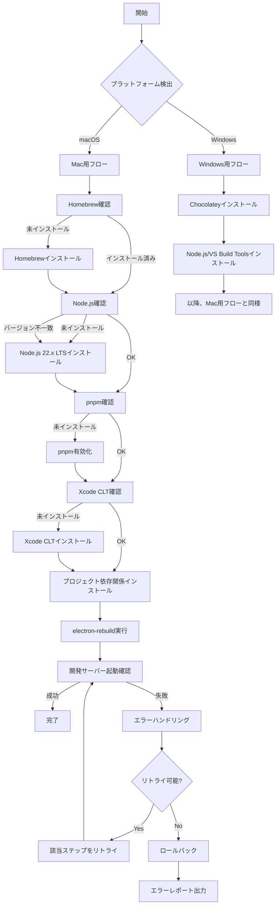
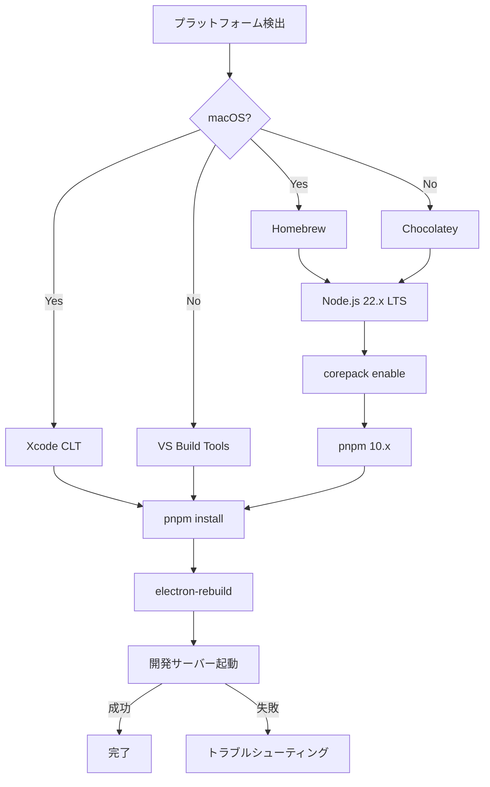

# 開発環境セットアップフロー設計書

## 1. 設計概要

### 1.1 目的

Phase 0で定義した要件を基に、開発者が迷わず環境構築できる最適なセットアップフローを設計する。エラーハンドリング、ロールバック、検証を含む堅牢なフローを確立する。

### 1.2 設計方針

- **冪等性**: 何度実行しても同じ結果
- **段階的検証**: 各ステップで成功/失敗を確認
- **エラー時のロールバック**: 失敗時は前の状態に復帰
- **進捗可視化**: ユーザーに現在の状態を明示
- **プラットフォーム自動検出**: Mac/Windowsを自動判定

### 1.3 前提条件

- インターネット接続
- 管理者権限（一部ツールインストールで必要）
- 10GB以上の空きディスク容量

---

## 2. セットアップフロー全体図



---

## 3. Mac用セットアップフロー詳細

### Step 1: プラットフォーム検出

- **目的**: 実行環境がmacOSであることを確認
- **検証方法**: `uname -s` で "Darwin" を確認
- **失敗時**: エラーメッセージ表示、処理中断

### Step 2: Homebrew確認・インストール

- **目的**: パッケージマネージャーの準備
- **確認方法**: `which brew`
- **インストール方法**: 公式スクリプト実行
- **検証**: `brew --version` で バージョン確認
- **所要時間**: 5-10分
- **失敗時**: 手動インストール手順を表示

### Step 3: Node.js確認・インストール

- **目的**: JavaScriptランタイムの準備
- **確認方法**: `node --version`
- **必須バージョン**: v22.x.x または v24.x.x
- **インストール方法**: `brew install node@22`
- **検証**: `node --version` でバージョン確認
- **所要時間**: 3-5分
- **失敗時**: nvm経由の代替インストール方法を提示

### Step 4: pnpm確認・有効化

- **目的**: パッケージマネージャーの準備
- **確認方法**: `pnpm --version`
- **必須バージョン**: 10.x.x
- **有効化方法**: `corepack enable`
- **検証**: `pnpm --version` でバージョン確認
- **所要時間**: 1分
- **失敗時**: `npm install -g pnpm` での代替インストール

### Step 5: Xcode Command Line Tools確認・インストール

- **目的**: ネイティブモジュールビルドツールの準備
- **確認方法**: `xcode-select -p`
- **インストール方法**: `xcode-select --install`
- **検証**: コンパイラ実行確認 `gcc --version`
- **所要時間**: 5-15分（ダウンロード速度に依存）
- **失敗時**: App StoreからXcodeフルインストールを提案

### Step 6: プロジェクト依存関係インストール

- **目的**: npm パッケージのインストール
- **実行方法**: `pnpm install --frozen-lockfile`
- **検証**: `node_modules/` ディレクトリ存在確認
- **所要時間**: 3-5分
- **失敗時**: `pnpm-lock.yaml` の削除後に再実行

### Step 7: electron-rebuild実行

- **目的**: ネイティブモジュールの再ビルド（better-sqlite3）
- **実行方法**: `pnpm exec electron-rebuild`
- **検証**: better-sqlite3が読み込み可能か確認
- **所要時間**: 1-2分
- **失敗時**: Xcode CLTの再インストール

### Step 8: 開発サーバー起動確認

- **目的**: 環境構築の最終検証
- **実行方法**: `pnpm dev`
- **検証**: Electronウィンドウが表示されるか
- **所要時間**: 10-30秒
- **成功**: 環境構築完了
- **失敗時**: ログ分析、トラブルシューティングガイド表示

---

## 4. Windows用セットアップフロー詳細（将来対応）

### Step 1: プラットフォーム検出

- **検証方法**: `uname -s` で "MINGW" または `ver` コマンド

### Step 2: Chocolatey確認・インストール

- **確認方法**: `choco --version`
- **インストール方法**: PowerShellスクリプト（管理者権限）

### Step 3: Node.js + VS Build Toolsインストール

- **インストール方法**: `choco install nodejs-lts visualstudio2022buildtools`

### Step 4-8: Mac用フローと同様

- pnpm有効化
- プロジェクト依存関係インストール
- electron-rebuild実行
- 開発サーバー起動確認

---

## 5. エラーハンドリング戦略

### 5.1 エラー分類

| レベル       | 説明                 | 対応                   |
| ------------ | -------------------- | ---------------------- |
| **Critical** | 環境構築が続行不可能 | 処理中断、ロールバック |
| **Warning**  | 一部機能が制限される | 警告表示、処理継続     |
| **Info**     | 情報提供のみ         | ログ記録、処理継続     |

### 5.2 リトライ戦略

**リトライ対象**:

- ネットワークエラー（パッケージダウンロード）
- 一時的なリソース不足
- ロックファイル競合

**リトライ設定**:

- 最大リトライ回数: 3回
- 待機時間: 指数バックオフ（1秒、2秒、4秒）
- タイムアウト: 各ステップ5分

**リトライ不可**:

- バージョン不一致
- 権限エラー
- ディスク容量不足

### 5.3 ロールバック戦略

**ロールバック対象**:

- Homebrewインストール失敗 → アンインストールスクリプト実行
- Node.jsインストール失敗 → 既存バージョンを維持
- 依存関係インストール失敗 → node_modules削除

**ロールバック不可**:

- Xcode CLTインストール（手動削除が必要）

---

## 6. 進捗可視化設計

### 6.1 進捗表示

```
━━━━━━━━━━━━━━━━━━━━━━━━━━━━━━━━━━━━━━━
Electronデスクトップアプリ環境構築
━━━━━━━━━━━━━━━━━━━━━━━━━━━━━━━━━━━━━━━

[1/8] ✅ プラットフォーム検出: macOS
[2/8] ⏳ Homebrewインストール中...
      進捗: ダウンロード中 (3.2MB/5.8MB)
```

### 6.2 ログ出力

**ログレベル**:

- `INFO`: 各ステップの開始・完了
- `WARN`: 警告（非推奨バージョン使用など）
- `ERROR`: エラー詳細、スタックトレース
- `DEBUG`: デバッグ情報（開発時のみ）

**ログ出力先**:

- 標準出力（リアルタイム）
- ログファイル（`logs/setup-YYYYMMDD-HHmmss.log`）

---

## 7. 検証ポイント

### 7.1 各ステップの検証基準

| ステップ             | 検証方法                              | 成功基準               | 失敗時のアクション |
| -------------------- | ------------------------------------- | ---------------------- | ------------------ |
| プラットフォーム検出 | `uname -s`                            | "Darwin"               | エラー表示、中断   |
| Homebrew             | `brew --version`                      | バージョン表示         | インストール実行   |
| Node.js              | `node --version`                      | v22.x.x または v24.x.x | インストール実行   |
| pnpm                 | `pnpm --version`                      | 10.x.x                 | 有効化実行         |
| Xcode CLT            | `xcode-select -p`                     | パス表示               | インストール実行   |
| pnpm install         | `ls node_modules`                     | ディレクトリ存在       | リトライ           |
| electron-rebuild     | `node -e "require('better-sqlite3')"` | エラーなし             | リトライ           |
| 開発サーバー         | `pnpm dev`                            | ウィンドウ表示         | ログ分析           |

### 7.2 最終検証チェックリスト

- [ ] Node.js 22.x LTS がインストールされている
- [ ] pnpm 10.x がインストールされている
- [ ] すべての依存関係がインストールされている
- [ ] better-sqlite3が動作する
- [ ] TypeScript型チェックが通る
- [ ] ESLintエラーがない
- [ ] ユニットテストが成功する
- [ ] 開発サーバーが起動する
- [ ] Electronウィンドウが表示される

---

## 8. 依存関係グラフ（インストール順序）



---

## 9. タイムライン設計

### 9.1 所要時間見積もり

| ステップ              | 最小     | 平均     | 最大     | 備考                 |
| --------------------- | -------- | -------- | -------- | -------------------- |
| Homebrewインストール  | 3分      | 7分      | 15分     | 初回のみ             |
| Node.jsインストール   | 2分      | 4分      | 10分     | -                    |
| pnpm有効化            | 10秒     | 30秒     | 1分      | -                    |
| Xcode CLTインストール | 5分      | 10分     | 20分     | ダウンロード速度依存 |
| pnpm install          | 2分      | 4分      | 10分     | キャッシュ有無で変動 |
| electron-rebuild      | 30秒     | 1分      | 3分      | -                    |
| 開発サーバー起動      | 10秒     | 20秒     | 1分      | -                    |
| **合計**              | **13分** | **27分** | **60分** | -                    |

**目標**: 平均30分以内（NFR-003準拠）

### 9.2 並列化の可能性

**並列化不可**（順次実行必須）:

- すべてのステップが依存関係を持つため、並列化は不可能

**並列化可能**（将来的な最適化）:

- 複数の依存関係のダウンロード（pnpm installの内部処理）

---

## 10. 状態管理設計

### 10.1 セットアップ状態

```
状態ファイル: .setup-state.json

{
  "platform": "darwin",
  "steps": {
    "homebrew": "completed",
    "nodejs": "completed",
    "pnpm": "completed",
    "xcode-clt": "in_progress",
    "pnpm-install": "pending",
    "electron-rebuild": "pending",
    "dev-server": "pending"
  },
  "timestamp": "2025-12-03T10:30:00Z",
  "version": "1.0.0"
}
```

### 10.2 状態遷移

```
pending → in_progress → completed
                ↓
              failed → retry → completed
                         ↓
                    rollback
```

---

## 11. エラーハンドリング詳細

### 11.1 エラーコード体系

| コード | エラー                   | 原因                     | 解決策                           |
| ------ | ------------------------ | ------------------------ | -------------------------------- |
| E001   | Homebrewインストール失敗 | 権限不足                 | 管理者権限で再実行               |
| E002   | Node.jsバージョン不一致  | 古いバージョン           | Node.js 22.x を再インストール    |
| E003   | pnpm not found           | corepack未有効化         | `corepack enable` 実行           |
| E004   | Xcode CLT未インストール  | 未インストール           | `xcode-select --install` 実行    |
| E005   | pnpm install失敗         | ネットワークエラー       | リトライまたは手動インストール   |
| E006   | electron-rebuild失敗     | ビルドツール不足         | Xcode CLT確認                    |
| E007   | better-sqlite3エラー     | ネイティブバインディング | electron-rebuild再実行           |
| E008   | 開発サーバー起動失敗     | ポート競合               | ポート変更または既存プロセス終了 |

### 11.2 エラーメッセージ設計

**構造**:

```
❌ エラー: [エラーコード] [エラー概要]

原因:
  [詳細な原因説明]

解決策:
  1. [解決策1]
  2. [解決策2]

詳細ログ:
  [ログファイルパス]

関連ドキュメント:
  - [トラブルシューティングガイド]
```

---

## 12. ロールバック設計

### 12.1 ロールバックポイント

| ステップ             | ロールバック方法               | 備考                                                                                                |
| -------------------- | ------------------------------ | --------------------------------------------------------------------------------------------------- |
| Homebrewインストール | アンインストールスクリプト実行 | `/bin/bash -c "$(curl -fsSL https://raw.githubusercontent.com/Homebrew/install/HEAD/uninstall.sh)"` |
| Node.jsインストール  | `brew uninstall node@22`       | Homebrew経由の場合                                                                                  |
| pnpm有効化           | `corepack disable`             | -                                                                                                   |
| Xcode CLT            | 手動削除が必要                 | `/Library/Developer/CommandLineTools`                                                               |
| pnpm install         | `rm -rf node_modules`          | -                                                                                                   |
| electron-rebuild     | 再実行で上書き                 | -                                                                                                   |

### 12.2 ロールバック実行条件

- ユーザーが明示的にキャンセルした場合
- Critical エラーが3回連続で発生した場合
- ディスク容量不足が検出された場合

---

## 13. 自動化スクリプト要件

### 13.1 スクリプト構造

```
scripts/setup-dev-environment.sh
├── 関数定義
│   ├── detect_platform()
│   ├── check_homebrew()
│   ├── install_homebrew()
│   ├── check_nodejs()
│   ├── install_nodejs()
│   ├── check_pnpm()
│   ├── enable_pnpm()
│   ├── check_xcode_clt()
│   ├── install_xcode_clt()
│   ├── install_dependencies()
│   ├── rebuild_native_modules()
│   ├── verify_setup()
│   └── rollback()
├── メイン処理
│   ├── プラットフォーム検出
│   ├── 各ステップ実行
│   └── 最終検証
└── エラーハンドリング
```

### 13.2 スクリプト要件

- **言語**: Bash（Mac）、PowerShell（Windows）
- **冪等性**: 何度実行しても安全
- **進捗表示**: リアルタイムで進捗を表示
- **ログ記録**: すべての操作をログファイルに記録
- **エラーハンドリング**: 適切なエラーメッセージと解決策を表示
- **ロールバック機能**: 失敗時に前の状態に復帰

---

## 14. 検証スクリプト要件

### 14.1 依存関係検証スクリプト

**ファイル**: `scripts/verify-dependencies.mjs`

**検証項目**:

- Node.jsバージョン（22.x または 24.x）
- pnpmバージョン（10.x）
- Electronバージョン（39.x）
- TypeScriptバージョン（5.x）
- better-sqlite3の動作確認
- すべての必須パッケージの存在確認

**出力**:

```
✅ Node.js: v22.12.0 (OK)
✅ pnpm: 10.24.0 (OK)
✅ Electron: 39.2.4 (OK)
✅ TypeScript: 5.7.0 (OK)
✅ better-sqlite3: 動作確認 OK
━━━━━━━━━━━━━━━━━━━━━━━━━━
環境構築: 完了
━━━━━━━━━━━━━━━━━━━━━━━━━━
```

---

## 15. パフォーマンス最適化

### 15.1 キャッシュ戦略

- **Homebrewキャッシュ**: `~/Library/Caches/Homebrew/`
- **pnpmストア**: `~/.local/share/pnpm/store/`
- **electron-builderキャッシュ**: `~/Library/Caches/electron-builder/`

**最適化**:

- 2回目以降のセットアップでキャッシュを活用
- ネットワーク帯域の節約

### 15.2 並列ダウンロード

- pnpm install は内部で並列ダウンロードを実行
- 設定不要（デフォルトで最適化済み）

---

## 16. セキュリティ考慮事項

### 16.1 インストールスクリプトの検証

- Homebrewインストールスクリプト: 公式URLのみ使用
- 証明書検証: HTTPS接続を必須化
- スクリプト実行権限: 最小限の権限で実行

### 16.2 環境変数管理

- `.env.example` をテンプレートとして提供
- `.env` ファイルは `.gitignore` に含める
- Secret情報は環境変数で管理

---

## 17. ドキュメント連携

### 17.1 作成ドキュメント

- `docs/10-architecture/environment-setup-guide.md`: 環境構築の全体フロー
- `docs/10-architecture/installation-instructions.md`: 詳細なインストール手順
- `docs/10-architecture/troubleshooting-environment.md`: トラブルシューティング

### 17.2 README統合

- README.mdに環境構築セクションを追加
- クイックスタートガイドへのリンク

---

## 18. CI/CD統合（将来対応）

### 18.1 GitHub Actions統合

**ワークフロー**:

- `setup-dev-environment.yml`: 環境構築の自動化
- Mac/Windowsランナーで並列実行
- キャッシュ戦略の適用

---

## 更新履歴

| バージョン | 日付       | 変更内容 | 作成者      |
| ---------- | ---------- | -------- | ----------- |
| 1.0.0      | 2025-12-03 | 初版作成 | .claude/agents/devops-eng.md |
