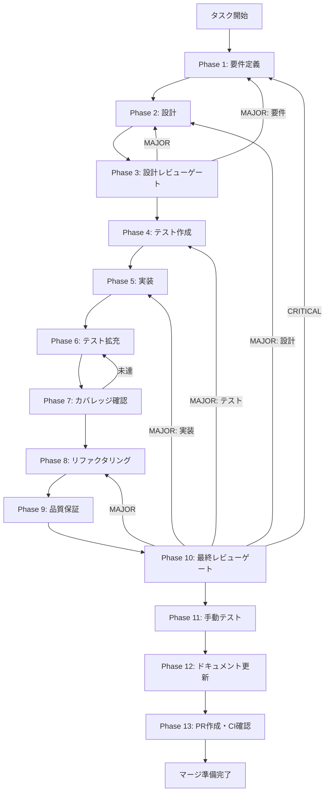

# esbuild-arch-mismatch-fix - タスク実行仕様書

## ユーザーからの元の指示

```
UT-RT-06-ESBUILD-ARCH-MISMATCH-001: esbuild darwin アーキテクチャ不整合の解消。
RT-06 の vitest 実行において @esbuild/darwin-arm64 と @esbuild/darwin-x64 のアーキテクチャ不整合が
発生し pnpm vitest が完走できない状態を解消する。再発防止手順を標準化する。
```

## メタ情報

| 項目         | 内容                                                                     |
| ------------ | ------------------------------------------------------------------------ |
| タスクID     | UT-RT-06-ESBUILD-ARCH-MISMATCH-001                                       |
| タスク名     | esbuild-darwin-arch-mismatch-fix                                         |
| 分類         | バグ修正 / 環境設定                                                      |
| 対象機能     | vitest / esbuild ビルドバイナリ / Node.js アーキテクチャ管理             |
| 優先度       | 高                                                                       |
| 見積もり規模 | 小規模                                                                   |
| ステータス   | Phase 12 完了 / Phase 13 pending                                         |
| 作成日       | 2026-03-30                                                               |
| Issue        | [#1710](https://github.com/daishiman/AIWorkflowOrchestrator/issues/1710) |
| 起票元       | TASK-RT-06 Phase 10 / Phase 11 / Phase 12                                |

---

## タスク概要

### 目的

esbuild の darwin アーキテクチャ不整合を解消し、TASK-RT-06 対象テストを arm64 Native Node 環境で 1 回完走させる。併せて再発防止手順を文書化する。

### 背景

TASK-RT-06 では `sdkMessageUtils.ts` の新設や `sdkMessageNormalizer.ts` へのリファクタリングを実施した。その品質保証ステップ（Phase 9）で `pnpm vitest run` を実行したところ、esbuild のネイティブバイナリがプラットフォームに合致しないエラーが発生し、テスト実行が完全にブロックされた。

Apple Silicon（M1/M2）Mac において Rosetta 2（x86_64 エミュレーション）経由の Node.js で `pnpm install` を行った後、native arm64 Node.js でテストを実行しようとした場合に発生する。`node_modules/@esbuild/darwin-x64` のバイナリのみがインストールされ、`@esbuild/darwin-arm64` が存在しないためにロードに失敗する。

### 最終ゴール

- `pnpm vitest run` が esbuild エラーなく起動し、RT-06 対象テストが全件 PASS または FAIL の判定が得られること
- アーキテクチャ統一手順が `docs/` または CLAUDE.md に記録されていること
- 同環境で同じ問題を再現・解消できる再現手順が残っていること

### 成果物一覧

| 種別         | 成果物                  | 配置先                         |
| ------------ | ----------------------- | ------------------------------ |
| 環境修正     | arm64 統一 node_modules | `node_modules/`                |
| 検証結果     | vitest 実行結果レポート | `outputs/phase-5/`             |
| ドキュメント | 再発防止手順書          | `outputs/phase-5/` / CLAUDE.md |
| ドキュメント | 実装ガイド（Phase 12）  | `outputs/phase-12/`            |
| PR           | GitHub Pull Request     | GitHub UI                      |

---

## 参照ファイル

本仕様書のコマンド選定は以下を参照：

- `.claude/skills/aiworkflow-requirements/references/technology-core.md` - Node.js 22.x LTS 仕様
- `.claude/skills/aiworkflow-requirements/references/technology-devops-core.md` - pnpm / tsup / esbuild 構成
- `.claude/skills/aiworkflow-requirements/references/deployment-core.md` - CI パイプライン仕様
- `.claude/skills/aiworkflow-requirements/references/development-guidelines-core.md` - 開発環境ガイドライン
- `docs/30-workflows/completed-tasks/UT-RT-06-ESBUILD-ARCH-MISMATCH-001.md` - 元タスク定義

---

## タスク分解サマリー

| ID     | フェーズ | サブタスク名       | 責務                                    | 依存 |
| ------ | -------- | ------------------ | --------------------------------------- | ---- |
| T-01-1 | Phase 1  | 環境診断・要件定義 | arch 状態確認、スコープ・受入条件の固定 | -    |
| T-02-1 | Phase 2  | 修正アプローチ設計 | arm64 統一手順・再発防止策の設計        | T-01 |
| T-03-1 | Phase 3  | 設計レビューゲート | Phase 4 へ進めるかを判定                | T-02 |
| T-04-1 | Phase 4  | 検証コマンド作成   | 環境検証・テスト実行コマンドの定義      | T-03 |
| T-05-1 | Phase 5  | 環境修正実行       | arm64 統一 + pnpm install + テスト実行  | T-04 |
| T-06-1 | Phase 6  | 追加検証シナリオ   | エッジケース検証・CI 環境考慮           | T-05 |
| T-07-1 | Phase 7  | 検証結果確認       | 全検証コマンドの PASS 確認              | T-06 |
| T-08-1 | Phase 8  | ドキュメント整理   | 重複排除・手順の明確化                  | T-07 |
| T-09-1 | Phase 9  | 品質保証           | lint / typecheck / テスト全件確認       | T-08 |
| T-10-1 | Phase 10 | 最終レビューゲート | 受入条件判定・blocker 確認              | T-09 |
| T-11-1 | Phase 11 | 手動テスト         | 実環境での vitest 実行・再現手順確認    | T-10 |
| T-12-1 | Phase 12 | ドキュメント更新   | 実装ガイド・仕様同期・未タスク検出      | T-11 |
| T-13-1 | Phase 13 | PR 作成            | user 承認後に commit + PR               | T-12 |

**総サブタスク数**: 13 個

---

## 実行フロー図



---

## Phase 一覧

| Phase | 名称               | 仕様書                                                       | ステータス |
| ----- | ------------------ | ------------------------------------------------------------ | ---------- |
| 1     | 要件定義           | [phase-1-requirements.md](phase-1-requirements.md)           | completed  |
| 2     | 設計               | [phase-2-design.md](phase-2-design.md)                       | completed  |
| 3     | 設計レビューゲート | [phase-3-design-review.md](phase-3-design-review.md)         | completed  |
| 4     | テスト作成         | [phase-4-test-creation.md](phase-4-test-creation.md)         | completed  |
| 5     | 実装               | [phase-5-implementation.md](phase-5-implementation.md)       | completed  |
| 6     | テスト拡充         | [phase-6-test-expansion.md](phase-6-test-expansion.md)       | completed  |
| 7     | カバレッジ確認     | [phase-7-coverage-check.md](phase-7-coverage-check.md)       | completed  |
| 8     | リファクタリング   | [phase-8-refactoring.md](phase-8-refactoring.md)             | completed  |
| 9     | 品質保証           | [phase-9-quality-assurance.md](phase-9-quality-assurance.md) | completed  |
| 10    | 最終レビューゲート | [phase-10-final-review.md](phase-10-final-review.md)         | completed  |
| 11    | 手動テスト         | [phase-11-manual-test.md](phase-11-manual-test.md)           | completed  |
| 12    | ドキュメント更新   | [phase-12-documentation.md](phase-12-documentation.md)       | completed  |
| 13    | PR 作成            | [phase-13-pr-creation.md](phase-13-pr-creation.md)           | pending    |

---

## テストカバレッジ目標

> 本タスクは環境修正系のため、新規コードのカバレッジ目標は適用外。
> 代わりに以下の検証コマンドの全件 PASS を目標とする。

| 検証項目                 | コマンド                                  | 期待結果                  |
| ------------------------ | ----------------------------------------- | ------------------------- |
| Node アーキテクチャ確認  | `node -e "console.log(process.arch)"`     | `arm64`                   |
| esbuild バイナリ存在確認 | `ls node_modules/@esbuild/`               | `darwin-arm64` が含まれる |
| vitest 起動確認          | `pnpm vitest run --reporter=verbose 2>&1` | エラーなく起動            |
| RT-06 対象テスト実行     | `pnpm --filter @repo/desktop test:run`    | PASS/FAIL 判定が得られる  |
| TypeScript 型チェック    | `pnpm typecheck`                          | エラーなし                |
| ESLint                   | `pnpm lint`                               | エラーなし                |

---

## 統合テスト連携（Phase 1〜11 で必須）

| Phase | 統合テスト連携アクション                                          |
| ----- | ----------------------------------------------------------------- |
| 1     | esbuild バイナリの接続要件（arm64/x64 判定ロジック）を要件に明記  |
| 2     | pnpm install → esbuild binary → vitest の依存チェーンを設計に反映 |
| 3     | アーキテクチャ統一手順のレビューゲートを実施                      |
| 4     | 環境検証コマンドスイートを作成                                    |
| 5     | arm64 環境統一 + pnpm install 再実行                              |
| 6     | CI 環境（GitHub Actions macos-latest）での再現シナリオを追加      |
| 7     | 全検証コマンドの PASS 確認                                        |
| 8     | 手順書の重複排除・明確化                                          |
| 9     | lint / typecheck / vitest 全件確認                                |
| 10    | 最終レビューで全検証結果を確認                                    |
| 11    | 実環境での手動 vitest 実行確認                                    |

---

## Phase 完了時の必須アクション

**各 Phase 完了時に以下を必ず実行すること:**

1. **タスク 100% 実行**: Phase 内で指定された全タスクを完全に実行
2. **成果物確認**: 全ての必須成果物が生成されていることを検証
3. **実行記録**: 実行タスクの結果を記録
4. **artifacts.json 更新**: Phase 完了ステータスを更新
5. **Phase 末端の実行確認**: 各タスクを 100% 実行し、各タスクを完遂した旨を必ず明記

```bash
# Phase完了時の検証コマンド
node .claude/skills/task-specification-creator/scripts/validate-phase-output.js docs/30-workflows/esbuild-arch-mismatch-fix --phase {{PHASE_NUMBER}}

# Phase完了・成果物登録
node .claude/skills/task-specification-creator/scripts/complete-phase.js \
  --workflow docs/30-workflows/esbuild-arch-mismatch-fix --phase {{PHASE_NUMBER}} --artifacts "..."
```
