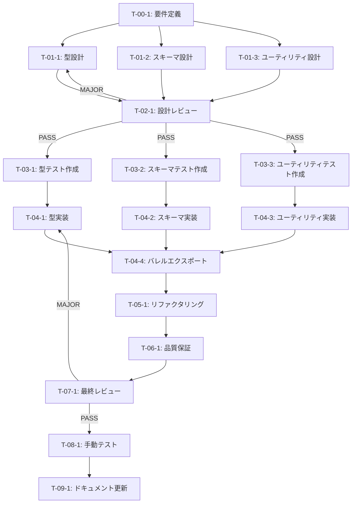

# ファイル・変換スキーマ定義 - タスク実行仕様書

## ユーザーからの元の指示

```
@docs/30-workflows/unassigned-task/task-03-02-file-conversion-schemas.md このタスクを実行するために次のプロンプトを使ってタスク仕様書を作成してください。
```

## メタ情報

| 項目             | 内容                                           |
| ---------------- | ---------------------------------------------- |
| タスクID         | CONV-03-02                                     |
| タスク名         | ファイル・変換スキーマ定義                     |
| 分類             | 新規機能                                       |
| 対象機能         | HybridRAGパイプライン - ファイル選択・変換基盤 |
| 優先度           | 高                                             |
| 見積もり規模     | 小規模                                         |
| ステータス       | 未実施                                         |
| 発見元           | 初期設計                                       |
| 発見日           | 2025-12-16                                     |
| 発見エージェント | @product-manager                               |

---

## タスク概要

### 目的

ファイル選択・変換処理に関する型定義とZodスキーマを作成し、CONV-01（ファイル選択）、CONV-02（変換エンジン）の基盤となる型安全な構造を提供する。

### 背景

HybridRAGパイプラインでは、様々なファイル形式（テキスト、Markdown、PDF、DOCX等）を統一的に処理する必要がある。ファイルタイプの判定、変換状態の追跡、メタデータの抽出を型安全に行うための基盤が必要。CONV-03-01で定義された基本型・共通インターフェースを継承し、ファイル・変換ドメイン固有の型を定義する。

### 最終ゴール

- `FileType`, `FileCategory` 型によるファイル分類の型安全性確保
- `FileEntity`, `ConversionEntity` 型によるドメインモデルの明確化
- `ExtractedMetadata` 型による抽出情報の構造化
- 全型に対応するZodスキーマによるランタイムバリデーション
- ファイルタイプ推定・ハッシュ計算等のユーティリティ関数

### 成果物一覧

| 種別         | 成果物                        | 配置先                                          |
| ------------ | ----------------------------- | ----------------------------------------------- |
| 機能         | 型定義 (types.ts)             | `packages/shared/src/types/rag/file/types.ts`   |
| 機能         | Zodスキーマ (schemas.ts)      | `packages/shared/src/types/rag/file/schemas.ts` |
| 機能         | ユーティリティ (utils.ts)     | `packages/shared/src/types/rag/file/utils.ts`   |
| 機能         | バレルエクスポート (index.ts) | `packages/shared/src/types/rag/file/index.ts`   |
| 品質         | 単体テスト                    | `packages/shared/src/types/rag/file/__tests__/` |
| ドキュメント | タスク完了レポート            | `docs/30-workflows/file-conversion-schemas/`    |

---

## 参照ファイル

本仕様書のコマンド・エージェント・スキル選定は以下を参照：

- `docs/00-requirements/master_system_design.md` - システム要件
- `.claude/commands/ai/command_list.md` - /ai:コマンド定義
- `.claude/agents/agent_list.md` - エージェント定義
- `.claude/skills/skill_list.md` - スキル定義
- `docs/30-workflows/unassigned-task/task-03-01-base-types.md` - 依存タスク仕様

---

## タスク分解サマリー

| ID     | フェーズ | サブタスク名             | 責務                     | 依存                   |
| ------ | -------- | ------------------------ | ------------------------ | ---------------------- |
| T-00-1 | Phase 0  | ファイル・変換要件定義   | 型・スキーマの要件明確化 | -                      |
| T-01-1 | Phase 1  | 型設計                   | TypeScript型定義の設計   | T-00-1                 |
| T-01-2 | Phase 1  | スキーマ設計             | Zodスキーマの設計        | T-00-1                 |
| T-01-3 | Phase 1  | ユーティリティ設計       | ヘルパー関数の設計       | T-00-1                 |
| T-02-1 | Phase 2  | 設計レビュー             | 設計の妥当性検証         | T-01-1, T-01-2, T-01-3 |
| T-03-1 | Phase 3  | 型テスト作成             | types.ts のテスト        | T-02-1                 |
| T-03-2 | Phase 3  | スキーマテスト作成       | schemas.ts のテスト      | T-02-1                 |
| T-03-3 | Phase 3  | ユーティリティテスト作成 | utils.ts のテスト        | T-02-1                 |
| T-04-1 | Phase 4  | 型実装                   | types.ts の実装          | T-03-1                 |
| T-04-2 | Phase 4  | スキーマ実装             | schemas.ts の実装        | T-03-2                 |
| T-04-3 | Phase 4  | ユーティリティ実装       | utils.ts の実装          | T-03-3                 |
| T-04-4 | Phase 4  | バレルエクスポート実装   | index.ts の実装          | T-04-1, T-04-2, T-04-3 |
| T-05-1 | Phase 5  | リファクタリング         | コード品質改善           | T-04-4                 |
| T-06-1 | Phase 6  | 品質保証                 | テスト・Lint・型チェック | T-05-1                 |
| T-07-1 | Phase 7  | 最終レビュー             | 品質・整合性検証         | T-06-1                 |
| T-08-1 | Phase 8  | 手動テスト               | インポート・型推論検証   | T-07-1                 |
| T-09-1 | Phase 9  | ドキュメント更新         | ドキュメント反映         | T-08-1                 |

**総サブタスク数**: 17個

---

## 実行フロー図



---

## Phase 0: 要件定義

### T-00-1: ファイル・変換要件定義

#### 目的

CONV-03-02で定義すべき型・スキーマ・ユーティリティの要件を明確化し、CONV-03-01との整合性を確認する。

#### 背景

型定義は実装の基盤となるため、要件を明確にしてから設計に進む必要がある。

#### 責務（単一責務）

ファイル・変換ドメインの型要件を定義する。

#### Claude Code スラッシュコマンド

> ⚠️ 以下はターミナルコマンドではなく、Claude Code内で実行するスラッシュコマンドです

```
/ai:write-spec file-conversion-types
```

- **参照**: `.claude/commands/ai/command_list.md`

#### 使用エージェント

- **エージェント**: @schema-def
- **選定理由**: Zod スキーマ定義と型安全性に特化したエージェントであり、データ構造の設計に最適
- **参照**: `.claude/agents/agent_list.md`

#### 活用スキル

| スキル名             | 活用方法                                |
| -------------------- | --------------------------------------- |
| zod-validation       | Zodスキーマ設計のベストプラクティス適用 |
| type-safety-patterns | TypeScript型設計パターンの適用          |

- **参照**: `.claude/skills/skill_list.md`

#### 成果物

| 成果物           | パス                                                                    | 内容                   |
| ---------------- | ----------------------------------------------------------------------- | ---------------------- |
| 要件ドキュメント | `docs/30-workflows/file-conversion-schemas/task-step00-requirements.md` | 型・スキーマ要件定義書 |

#### 完了条件

- [ ] FileType, FileCategory の定義要件が明確化されている
- [ ] FileEntity, ConversionEntity の定義要件が明確化されている
- [ ] ExtractedMetadata の定義要件が明確化されている
- [ ] CONV-03-01との依存関係が整理されている

#### 依存関係

- **前提**: CONV-03-01（基本型・共通インターフェース）が完了していること
- **後続**: T-01-1, T-01-2, T-01-3

---

## Phase 1: 設計

### T-01-1: 型設計

#### 目的

types.ts に定義する型の詳細設計を行う。

#### 背景

ドメインモデルを正確に表現する型を設計する必要がある。

#### 責務（単一責務）

TypeScript型の設計。

#### Claude Code スラッシュコマンド

> ⚠️ 以下はターミナルコマンドではなく、Claude Code内で実行するスラッシュコマンドです

```
/ai:design-domain-model file-conversion
```

- **参照**: `.claude/commands/ai/command_list.md`

#### 使用エージェント

- **エージェント**: @domain-modeler
- **選定理由**: DDD に基づくドメインモデル設計の専門家であり、エンティティと値オブジェクトの適切な境界定義に最適
- **参照**: `.claude/agents/agent_list.md`

#### 活用スキル

| スキル名              | 活用方法                          |
| --------------------- | --------------------------------- |
| domain-driven-design  | Entity, Value Object の適切な設計 |
| value-object-patterns | 不変性と型安全性の確保            |

- **参照**: `.claude/skills/skill_list.md`

#### 成果物

| 成果物   | パス                                                                   | 内容         |
| -------- | ---------------------------------------------------------------------- | ------------ |
| 型設計書 | `docs/30-workflows/file-conversion-schemas/task-step01-type-design.md` | 型の詳細設計 |

#### 完了条件

- [ ] FileTypes 定数オブジェクトの設計が完了
- [ ] FileCategories 定数オブジェクトの設計が完了
- [ ] FileEntity インターフェースの設計が完了
- [ ] ConversionEntity インターフェースの設計が完了
- [ ] ExtractedMetadata インターフェースの設計が完了
- [ ] ConversionResult インターフェースの設計が完了

#### 依存関係

- **前提**: T-00-1
- **後続**: T-02-1

---

### T-01-2: スキーマ設計

#### 目的

schemas.ts に定義するZodスキーマの詳細設計を行う。

#### 背景

ランタイムバリデーションのためのスキーマを設計する。

#### 責務（単一責務）

Zodスキーマの設計。

#### Claude Code スラッシュコマンド

> ⚠️ 以下はターミナルコマンドではなく、Claude Code内で実行するスラッシュコマンドです

```
/ai:create-schema file-conversion
```

- **参照**: `.claude/commands/ai/command_list.md`

#### 使用エージェント

- **エージェント**: @schema-def
- **選定理由**: Zodスキーマ定義の専門家であり、バリデーションルールの設計に最適
- **参照**: `.claude/agents/agent_list.md`

#### 活用スキル

| スキル名           | 活用方法                        |
| ------------------ | ------------------------------- |
| zod-validation     | Zodスキーマのベストプラクティス |
| input-sanitization | 入力値の安全性確保              |

- **参照**: `.claude/skills/skill_list.md`

#### 成果物

| 成果物         | パス                                                                     | 内容               |
| -------------- | ------------------------------------------------------------------------ | ------------------ |
| スキーマ設計書 | `docs/30-workflows/file-conversion-schemas/task-step01-schema-design.md` | スキーマの詳細設計 |

#### 完了条件

- [ ] fileTypeSchema の設計が完了
- [ ] fileCategorySchema の設計が完了
- [ ] fileEntitySchema の設計が完了
- [ ] conversionEntitySchema の設計が完了
- [ ] extractedMetadataSchema の設計が完了
- [ ] fileSelectionInputSchema の設計が完了
- [ ] fileSelectionResultSchema の設計が完了

#### 依存関係

- **前提**: T-00-1
- **後続**: T-02-1

---

### T-01-3: ユーティリティ設計

#### 目的

utils.ts に定義するユーティリティ関数の詳細設計を行う。

#### 背景

ファイルタイプ推定、ハッシュ計算などの共通処理を設計する。

#### 責務（単一責務）

ユーティリティ関数の設計。

#### Claude Code スラッシュコマンド

> ⚠️ 以下はターミナルコマンドではなく、Claude Code内で実行するスラッシュコマンドです

```
/ai:write-spec file-utilities
```

- **参照**: `.claude/commands/ai/command_list.md`

#### 使用エージェント

- **エージェント**: @logic-dev
- **選定理由**: ビジネスロジック・ユーティリティ関数の実装に特化したエージェント
- **参照**: `.claude/agents/agent_list.md`

#### 活用スキル

| スキル名               | 活用方法                       |
| ---------------------- | ------------------------------ |
| clean-code-practices   | 読みやすく保守性の高い関数設計 |
| refactoring-techniques | 単一責務の関数設計             |

- **参照**: `.claude/skills/skill_list.md`

#### 成果物

| 成果物               | パス                                                                    | 内容           |
| -------------------- | ----------------------------------------------------------------------- | -------------- |
| ユーティリティ設計書 | `docs/30-workflows/file-conversion-schemas/task-step01-utils-design.md` | 関数の詳細設計 |

#### 完了条件

- [ ] getFileTypeFromExtension 関数の設計が完了
- [ ] getFileCategoryFromType 関数の設計が完了
- [ ] calculateFileHash 関数の設計が完了
- [ ] formatFileSize 関数の設計が完了

#### 依存関係

- **前提**: T-00-1
- **後続**: T-02-1

---

## Phase 2: 設計レビューゲート

### T-02-1: 設計レビュー

#### 目的

実装開始前に型・スキーマ・ユーティリティ設計の妥当性を検証する。

#### 背景

設計段階での問題検出により、実装フェーズでの手戻りを防ぐ。

#### レビュー参加エージェント

| エージェント    | レビュー観点         | 選定理由                                    |
| --------------- | -------------------- | ------------------------------------------- |
| @arch-police    | アーキテクチャ整合性 | クリーンアーキテクチャ・SOLID原則の遵守確認 |
| @schema-def     | スキーマ設計品質     | Zodスキーマのベストプラクティス確認         |
| @domain-modeler | ドメインモデル妥当性 | DDDパターンの適切な適用確認                 |

- **参照**: `.claude/agents/agent_list.md`

#### レビューチェックリスト

**アーキテクチャ整合性** (@arch-police)

- [ ] CONV-03-01の基本型を適切にインポート・活用しているか
- [ ] レイヤー構造に違反していないか
- [ ] 依存関係逆転の原則に従っているか

**スキーマ設計品質** (@schema-def)

- [ ] Zodスキーマが型定義と一致しているか
- [ ] バリデーションルールが適切か
- [ ] エラーメッセージが明確か

**ドメインモデル妥当性** (@domain-modeler)

- [ ] エンティティと値オブジェクトの境界が適切か
- [ ] ユビキタス言語が一貫しているか
- [ ] ビジネスルールが型で表現されているか

#### レビュー結果

- **判定**: （実行時に記入）
- **指摘事項**: （実行時に記入）
- **対応方針**: （実行時に記入）

#### 戻り先決定（MAJORの場合）

| 問題の種類 | 戻り先                |
| ---------- | --------------------- |
| 要件の問題 | Phase 0（T-00-1）     |
| 設計の問題 | Phase 1（T-01-1/2/3） |

#### 完了条件

- [ ] 全レビュー観点でチェック完了
- [ ] PASS または MINOR 判定

#### 依存関係

- **前提**: T-01-1, T-01-2, T-01-3
- **後続**: T-03-1, T-03-2, T-03-3

---

## Phase 3: テスト作成 (TDD: Red)

### T-03-1: 型テスト作成

#### 目的

types.ts の型定義に対するテストを作成する。

#### 背景

型の正確性をテストで保証する（TDD Red Phase）。

#### 責務（単一責務）

types.ts のテストコード作成。

#### Claude Code スラッシュコマンド

> ⚠️ 以下はターミナルコマンドではなく、Claude Code内で実行するスラッシュコマンドです

```
/ai:generate-unit-tests packages/shared/src/types/rag/file/types.ts
```

- **参照**: `.claude/commands/ai/command_list.md`

#### 使用エージェント

- **エージェント**: @unit-tester
- **選定理由**: TDD原則に基づくユニットテスト作成の専門家
- **参照**: `.claude/agents/agent_list.md`

#### 活用スキル

| スキル名                | 活用方法                          |
| ----------------------- | --------------------------------- |
| tdd-principles          | Red-Green-Refactor サイクルの適用 |
| boundary-value-analysis | 境界値テストの設計                |
| vitest-advanced         | Vitestによる効率的なテスト作成    |

- **参照**: `.claude/skills/skill_list.md`

#### 成果物

| 成果物         | パス                                                         | 内容           |
| -------------- | ------------------------------------------------------------ | -------------- |
| テストファイル | `packages/shared/src/types/rag/file/__tests__/types.test.ts` | 型定義のテスト |

#### TDD検証: Red状態確認

```bash
pnpm --filter @repo/shared test:run -- types.test.ts
```

- [ ] テストが失敗することを確認（Red状態）

#### 完了条件

- [ ] FileTypes 定数のテストが作成されている
- [ ] FileCategories 定数のテストが作成されている
- [ ] 型のエクスポートテストが作成されている
- [ ] テストが失敗する（Red状態）

#### 依存関係

- **前提**: T-02-1
- **後続**: T-04-1

---

### T-03-2: スキーマテスト作成

#### 目的

schemas.ts のZodスキーマに対するテストを作成する。

#### 背景

スキーマのバリデーション動作をテストで保証する。

#### 責務（単一責務）

schemas.ts のテストコード作成。

#### Claude Code スラッシュコマンド

> ⚠️ 以下はターミナルコマンドではなく、Claude Code内で実行するスラッシュコマンドです

```
/ai:generate-unit-tests packages/shared/src/types/rag/file/schemas.ts
```

- **参照**: `.claude/commands/ai/command_list.md`

#### 使用エージェント

- **エージェント**: @unit-tester
- **選定理由**: バリデーションテストの作成に適切
- **参照**: `.claude/agents/agent_list.md`

#### 活用スキル

| スキル名       | 活用方法                   |
| -------------- | -------------------------- |
| tdd-principles | TDDサイクルの適用          |
| test-doubles   | モックを使用したテスト分離 |

- **参照**: `.claude/skills/skill_list.md`

#### 成果物

| 成果物         | パス                                                           | 内容             |
| -------------- | -------------------------------------------------------------- | ---------------- |
| テストファイル | `packages/shared/src/types/rag/file/__tests__/schemas.test.ts` | スキーマのテスト |

#### TDD検証: Red状態確認

```bash
pnpm --filter @repo/shared test:run -- schemas.test.ts
```

- [ ] テストが失敗することを確認（Red状態）

#### 完了条件

- [ ] 正常系バリデーションテストが作成されている
- [ ] 異常系バリデーションテストが作成されている
- [ ] エッジケーステストが作成されている
- [ ] テストが失敗する（Red状態）

#### 依存関係

- **前提**: T-02-1
- **後続**: T-04-2

---

### T-03-3: ユーティリティテスト作成

#### 目的

utils.ts のユーティリティ関数に対するテストを作成する。

#### 背景

ユーティリティ関数の正確性をテストで保証する。

#### 責務（単一責務）

utils.ts のテストコード作成。

#### Claude Code スラッシュコマンド

> ⚠️ 以下はターミナルコマンドではなく、Claude Code内で実行するスラッシュコマンドです

```
/ai:generate-unit-tests packages/shared/src/types/rag/file/utils.ts
```

- **参照**: `.claude/commands/ai/command_list.md`

#### 使用エージェント

- **エージェント**: @unit-tester
- **選定理由**: 関数テストの作成に適切
- **参照**: `.claude/agents/agent_list.md`

#### 活用スキル

| スキル名                | 活用方法                   |
| ----------------------- | -------------------------- |
| tdd-principles          | TDDサイクルの適用          |
| boundary-value-analysis | 境界値・エッジケースの網羅 |

- **参照**: `.claude/skills/skill_list.md`

#### 成果物

| 成果物         | パス                                                         | 内容                   |
| -------------- | ------------------------------------------------------------ | ---------------------- |
| テストファイル | `packages/shared/src/types/rag/file/__tests__/utils.test.ts` | ユーティリティのテスト |

#### TDD検証: Red状態確認

```bash
pnpm --filter @repo/shared test:run -- utils.test.ts
```

- [ ] テストが失敗することを確認（Red状態）

#### 完了条件

- [ ] getFileTypeFromExtension のテストが作成されている
- [ ] getFileCategoryFromType のテストが作成されている
- [ ] calculateFileHash のテストが作成されている
- [ ] formatFileSize のテストが作成されている
- [ ] テストが失敗する（Red状態）

#### 依存関係

- **前提**: T-02-1
- **後続**: T-04-3

---

## Phase 4: 実装 (TDD: Green)

### T-04-1: 型実装

#### 目的

types.ts の型定義を実装し、テストを通す。

#### 背景

TDD Green Phase - テストを通すための最小限の実装。

#### 責務（単一責務）

types.ts の実装。

#### Claude Code スラッシュコマンド

> ⚠️ 以下はターミナルコマンドではなく、Claude Code内で実行するスラッシュコマンドです

```
/ai:create-entity FileEntity
```

- **参照**: `.claude/commands/ai/command_list.md`

#### 使用エージェント

- **エージェント**: @schema-def
- **選定理由**: 型定義とスキーマの整合性を保つ実装に最適
- **参照**: `.claude/agents/agent_list.md`

#### 活用スキル

| スキル名             | 活用方法             |
| -------------------- | -------------------- |
| type-safety-patterns | 型安全な実装パターン |
| zod-validation       | Zodとの整合性確保    |

- **参照**: `.claude/skills/skill_list.md`

#### 成果物

| 成果物         | パス                                          | 内容         |
| -------------- | --------------------------------------------- | ------------ |
| 型定義ファイル | `packages/shared/src/types/rag/file/types.ts` | 型定義の実装 |

#### TDD検証: Green状態確認

```bash
pnpm --filter @repo/shared test:run -- types.test.ts
```

- [ ] テストが成功することを確認（Green状態）

#### 完了条件

- [ ] FileTypes 定数が実装されている
- [ ] FileCategories 定数が実装されている
- [ ] FileEntity インターフェースが実装されている
- [ ] ConversionEntity インターフェースが実装されている
- [ ] ExtractedMetadata インターフェースが実装されている
- [ ] ConversionResult インターフェースが実装されている
- [ ] テストが成功する（Green状態）

#### 依存関係

- **前提**: T-03-1
- **後続**: T-04-4

---

### T-04-2: スキーマ実装

#### 目的

schemas.ts のZodスキーマを実装し、テストを通す。

#### 背景

TDD Green Phase - スキーマの実装。

#### 責務（単一責務）

schemas.ts の実装。

#### Claude Code スラッシュコマンド

> ⚠️ 以下はターミナルコマンドではなく、Claude Code内で実行するスラッシュコマンドです

```
/ai:create-schema file-conversion-schemas
```

- **参照**: `.claude/commands/ai/command_list.md`

#### 使用エージェント

- **エージェント**: @schema-def
- **選定理由**: Zodスキーマ実装の専門家
- **参照**: `.claude/agents/agent_list.md`

#### 活用スキル

| スキル名           | 活用方法             |
| ------------------ | -------------------- |
| zod-validation     | Zodスキーマの実装    |
| input-sanitization | 安全なバリデーション |

- **参照**: `.claude/skills/skill_list.md`

#### 成果物

| 成果物           | パス                                            | 内容              |
| ---------------- | ----------------------------------------------- | ----------------- |
| スキーマファイル | `packages/shared/src/types/rag/file/schemas.ts` | Zodスキーマの実装 |

#### TDD検証: Green状態確認

```bash
pnpm --filter @repo/shared test:run -- schemas.test.ts
```

- [ ] テストが成功することを確認（Green状態）

#### 完了条件

- [ ] fileTypeSchema が実装されている
- [ ] fileCategorySchema が実装されている
- [ ] fileEntitySchema が実装されている
- [ ] conversionEntitySchema が実装されている
- [ ] extractedMetadataSchema が実装されている
- [ ] fileSelectionInputSchema が実装されている
- [ ] fileSelectionResultSchema が実装されている
- [ ] conversionResultSchema が実装されている
- [ ] テストが成功する（Green状態）

#### 依存関係

- **前提**: T-03-2
- **後続**: T-04-4

---

### T-04-3: ユーティリティ実装

#### 目的

utils.ts のユーティリティ関数を実装し、テストを通す。

#### 背景

TDD Green Phase - ユーティリティ関数の実装。

#### 責務（単一責務）

utils.ts の実装。

#### Claude Code スラッシュコマンド

> ⚠️ 以下はターミナルコマンドではなく、Claude Code内で実行するスラッシュコマンドです

```
/ai:implement-business-logic file-utilities
```

- **参照**: `.claude/commands/ai/command_list.md`

#### 使用エージェント

- **エージェント**: @logic-dev
- **選定理由**: ビジネスロジック実装の専門家
- **参照**: `.claude/agents/agent_list.md`

#### 活用スキル

| スキル名               | 活用方法                |
| ---------------------- | ----------------------- |
| clean-code-practices   | 可読性の高い実装        |
| tdd-red-green-refactor | TDDサイクルに従った実装 |

- **参照**: `.claude/skills/skill_list.md`

#### 成果物

| 成果物                 | パス                                          | 内容                 |
| ---------------------- | --------------------------------------------- | -------------------- |
| ユーティリティファイル | `packages/shared/src/types/rag/file/utils.ts` | ユーティリティの実装 |

#### TDD検証: Green状態確認

```bash
pnpm --filter @repo/shared test:run -- utils.test.ts
```

- [ ] テストが成功することを確認（Green状態）

#### 完了条件

- [ ] getFileTypeFromExtension が実装されている
- [ ] getFileCategoryFromType が実装されている
- [ ] calculateFileHash が実装されている
- [ ] formatFileSize が実装されている
- [ ] テストが成功する（Green状態）

#### 依存関係

- **前提**: T-03-3
- **後続**: T-04-4

---

### T-04-4: バレルエクスポート実装

#### 目的

index.ts でのバレルエクスポートを実装する。

#### 背景

モジュールの公開APIを整理する。

#### 責務（単一責務）

index.ts の実装。

#### Claude Code スラッシュコマンド

> ⚠️ 以下はターミナルコマンドではなく、Claude Code内で実行するスラッシュコマンドです

```
/ai:refactor packages/shared/src/types/rag/file/index.ts
```

- **参照**: `.claude/commands/ai/command_list.md`

#### 使用エージェント

- **エージェント**: @logic-dev
- **選定理由**: モジュール構造の整理に適切
- **参照**: `.claude/agents/agent_list.md`

#### 活用スキル

| スキル名             | 活用方法               |
| -------------------- | ---------------------- |
| clean-code-practices | 明確なエクスポート構造 |

- **参照**: `.claude/skills/skill_list.md`

#### 成果物

| 成果物         | パス                                          | 内容             |
| -------------- | --------------------------------------------- | ---------------- |
| バレルファイル | `packages/shared/src/types/rag/file/index.ts` | エクスポート定義 |

#### TDD検証: Green状態確認

```bash
pnpm --filter @repo/shared test:run
```

- [ ] 全テストが成功することを確認

#### 完了条件

- [ ] types.ts のエクスポートが定義されている
- [ ] schemas.ts のエクスポートが定義されている
- [ ] utils.ts のエクスポートが定義されている
- [ ] 全テストが成功する

#### 依存関係

- **前提**: T-04-1, T-04-2, T-04-3
- **後続**: T-05-1

---

## Phase 5: リファクタリング (TDD: Refactor)

### T-05-1: リファクタリング

#### 目的

実装したコードの品質を改善する（動作を変えずに）。

#### 背景

TDD Refactor Phase - コード品質の向上。

#### 責務（単一責務）

コード品質の改善。

#### Claude Code スラッシュコマンド

> ⚠️ 以下はターミナルコマンドではなく、Claude Code内で実行するスラッシュコマンドです

```
/ai:refactor packages/shared/src/types/rag/file/
```

- **参照**: `.claude/commands/ai/command_list.md`

#### 使用エージェント

- **エージェント**: @code-quality
- **選定理由**: コード品質管理の専門家
- **参照**: `.claude/agents/agent_list.md`

#### 活用スキル

| スキル名             | 活用方法                 |
| -------------------- | ------------------------ |
| eslint-configuration | リンティングルールの適用 |
| prettier-integration | コードフォーマットの統一 |
| static-analysis      | 複雑度・保守性の確認     |

- **参照**: `.claude/skills/skill_list.md`

#### 成果物

| 成果物                     | パス                                  | 内容                 |
| -------------------------- | ------------------------------------- | -------------------- |
| リファクタリング済みコード | `packages/shared/src/types/rag/file/` | 品質改善されたコード |

#### TDD検証: 継続Green確認

```bash
pnpm --filter @repo/shared test:run
```

- [ ] リファクタリング後もテストが成功することを確認

#### 完了条件

- [ ] 命名規則が統一されている
- [ ] 重複コードが排除されている
- [ ] 関数の責務が明確である
- [ ] コメントが適切である
- [ ] テストが成功する

#### 依存関係

- **前提**: T-04-4
- **後続**: T-06-1

---

## Phase 6: 品質保証

### T-06-1: 品質保証

#### 目的

定義された品質基準をすべて満たすことを検証する。

#### 背景

品質ゲート通過が次フェーズ進行の条件。

#### 責務（単一責務）

品質基準の検証。

#### Claude Code スラッシュコマンド

> ⚠️ 以下はターミナルコマンドではなく、Claude Code内で実行するスラッシュコマンドです

```
/ai:run-all-tests --coverage
```

- **参照**: `.claude/commands/ai/command_list.md`

#### 使用エージェント

- **エージェント**: @code-quality
- **選定理由**: 品質検証の専門家
- **参照**: `.claude/agents/agent_list.md`

#### 活用スキル

| スキル名        | 活用方法             |
| --------------- | -------------------- |
| vitest-advanced | テストカバレッジ確認 |
| static-analysis | 静的解析の実行       |

- **参照**: `.claude/skills/skill_list.md`

#### 成果物

| 成果物       | パス                                                                      | 内容         |
| ------------ | ------------------------------------------------------------------------- | ------------ |
| 品質レポート | `docs/30-workflows/file-conversion-schemas/task-step06-quality-report.md` | 品質検証結果 |

#### 完了条件

- [ ] 全ユニットテスト成功
- [ ] Lintエラーなし
- [ ] 型エラーなし
- [ ] カバレッジ80%以上達成

#### 依存関係

- **前提**: T-05-1
- **後続**: T-07-1

---

## 品質ゲートチェックリスト

### 機能検証

- [ ] 全ユニットテスト成功
- [ ] 型テスト成功
- [ ] スキーマテスト成功
- [ ] ユーティリティテスト成功

### コード品質

- [ ] Lintエラーなし
- [ ] 型エラーなし
- [ ] コードフォーマット適用済み

### テスト網羅性

- [ ] カバレッジ80%以上達成

### セキュリティ

- [ ] 入力バリデーションが適切
- [ ] 危険な操作の防止

---

## Phase 7: 最終レビューゲート

### T-07-1: 最終レビュー

#### 目的

実装完了後、全体的な品質・整合性を検証する。

#### 背景

多角的なレビューで見落としを防ぐ。

#### レビュー参加エージェント

| エージェント  | レビュー観点       | 選定理由                     |
| ------------- | ------------------ | ---------------------------- |
| @arch-police  | アーキテクチャ遵守 | レイヤー構造の確認           |
| @code-quality | コード品質         | 可読性・保守性の確認         |
| @schema-def   | スキーマ品質       | Zodスキーマの品質確認        |
| @unit-tester  | テスト品質         | テストカバレッジ・設計の確認 |

- **参照**: `.claude/agents/agent_list.md`

#### レビューチェックリスト

**コード品質** (@code-quality)

- [ ] コーディング規約への準拠
- [ ] 可読性・保守性の確保
- [ ] 適切なエラーハンドリング

**アーキテクチャ遵守** (@arch-police)

- [ ] CONV-03-01との整合性
- [ ] レイヤー間の依存関係が適切
- [ ] SOLID原則への準拠

**テスト品質** (@unit-tester)

- [ ] テストカバレッジが十分
- [ ] テストケースが適切に設計されている
- [ ] 境界値・異常系のテストがある

**スキーマ品質** (@schema-def)

- [ ] 型とスキーマの一致
- [ ] バリデーションルールの適切性
- [ ] エラーメッセージの明確性

#### レビュー結果

- **判定**: （実行時に記入）
- **指摘事項**: （実行時に記入）
- **対応方針**: （実行時に記入）
- **未完了タスク数**: 0件

#### 戻り先決定（MAJOR/CRITICALの場合）

| 問題の種類       | 戻り先                      |
| ---------------- | --------------------------- |
| 設計の問題       | Phase 1（設計）             |
| テスト設計の問題 | Phase 3（テスト作成）       |
| 実装の問題       | Phase 4（実装）             |
| コード品質の問題 | Phase 5（リファクタリング） |

#### エスカレーション条件

- 戻り先の判断が困難な場合
- 複数フェーズにまたがる問題の場合
- 要件自体の見直しが必要な場合

#### 完了条件

- [ ] 全レビュー観点でチェック完了
- [ ] PASS または MINOR 判定

#### 依存関係

- **前提**: T-06-1
- **後続**: T-08-1

---

## Phase 8: 手動テスト検証

### T-08-1: 手動テスト

#### 目的

自動テストでは検証できない型推論・インポートの動作を確認する。

#### 背景

TypeScript の型推論や IDE 補完が正しく機能することを確認。

#### テスト分類

機能テスト / 統合テスト

#### 使用エージェント

- **エージェント**: @frontend-tester
- **選定理由**: TypeScript コードのテストに精通
- **参照**: `.claude/agents/agent_list.md`

#### 手動テストケース

| No  | カテゴリ       | テスト項目             | 前提条件   | 操作手順                                                          | 期待結果                 | 実行結果 | 備考 |
| --- | -------------- | ---------------------- | ---------- | ----------------------------------------------------------------- | ------------------------ | -------- | ---- |
| 1   | インポート     | バレルエクスポート確認 | ビルド成功 | `import { FileEntity } from '@repo/shared/types/rag/file'` を記述 | エラーなくインポート可能 |          |      |
| 2   | 型推論         | FileType 型推論        | VSCode使用 | FileType 型の変数にホバー                                         | 正しい型情報が表示       |          |      |
| 3   | 型推論         | FileEntity 型推論      | VSCode使用 | FileEntity 型の変数にホバー                                       | 全プロパティが表示       |          |      |
| 4   | バリデーション | 正常値のパース         | ビルド成功 | 正常なデータを fileEntitySchema.parse() に渡す                    | パース成功               |          |      |
| 5   | バリデーション | 異常値のパース         | ビルド成功 | 異常なデータを fileEntitySchema.parse() に渡す                    | ZodError 発生            |          |      |
| 6   | ユーティリティ | 拡張子からタイプ推定   | ビルド成功 | getFileTypeFromExtension('.ts') を実行                            | 'text/typescript' 返却   |          |      |
| 7   | ユーティリティ | ハッシュ計算           | ビルド成功 | calculateFileHash() を実行                                        | 64文字の16進文字列       |          |      |

#### テスト実行手順

1. `pnpm --filter @repo/shared build` でビルド
2. 各テストケースを手動で実行
3. 結果を記録

#### 成果物

| 成果物     | パス                                                                   | 内容           |
| ---------- | ---------------------------------------------------------------------- | -------------- |
| テスト結果 | `docs/30-workflows/file-conversion-schemas/task-step08-manual-test.md` | 手動テスト結果 |

#### 完了条件

- [ ] すべての手動テストケースが実行済み
- [ ] すべてのテストケースがPASS

#### 依存関係

- **前提**: T-07-1
- **後続**: T-09-1

---

## Phase 9: ドキュメント更新・未完了タスク記録

### T-09-1: ドキュメント更新

#### 目的

1. 実装した内容をシステム要件ドキュメントに反映
2. 未完了タスクがあれば記録

#### 前提条件

- [ ] Phase 6の品質ゲートをすべて通過
- [ ] Phase 7の最終レビューゲートを通過
- [ ] Phase 8の手動テストが完了
- [ ] すべてのテストが成功

---

#### サブタスク 9.1: システムドキュメント更新

##### 更新対象ドキュメント

- `docs/00-requirements/06-core-interfaces.md` - 新規型定義の追加
- `docs/00-requirements/04-directory-structure.md` - rag/file/ ディレクトリの追加

##### Claude Code スラッシュコマンド

> ⚠️ 以下はターミナルコマンドではなく、Claude Code内で実行するスラッシュコマンドです

```
/ai:update-all-docs
```

- **参照**: `.claude/commands/ai/command_list.md`

##### 使用エージェント

- **エージェント**: @spec-writer
- **選定理由**: ドキュメント更新の専門家
- **参照**: `.claude/agents/agent_list.md`

##### 更新原則

- 概要のみ記載（詳細な実装説明は不要）
- システム構築に必要十分な情報のみ追記
- 既存ドキュメントの構造・フォーマットを維持
- Single Source of Truth原則を遵守

---

#### サブタスク 9.2: 未完了タスク・追加タスク記録

##### 出力先

`docs/30-workflows/unassigned-task/`

##### 記録対象タスク一覧

（レビューで発見された場合に記録）

##### ファイル命名規則

- 要件系: `requirements-{{機能領域}}.md`
- 改善系: `task-{{改善領域}}-improvements.md`

##### Claude Code スラッシュコマンド

> ⚠️ 以下はターミナルコマンドではなく、Claude Code内で実行するスラッシュコマンドです

```
/ai:write-spec unassigned-tasks
```

- **参照**: `.claude/commands/ai/command_list.md`

##### 使用エージェント

- **エージェント**: @spec-writer
- **選定理由**: 仕様書作成の専門家
- **参照**: `.claude/agents/agent_list.md`

##### 活用スキル

| スキル名                          | 活用方法                     |
| --------------------------------- | ---------------------------- |
| markdown-advanced-syntax          | 構造化されたドキュメント作成 |
| technical-documentation-standards | 標準化されたドキュメント     |

- **参照**: `.claude/skills/skill_list.md`

---

#### 完了条件

- [ ] docs/00-requirements/ の関連ドキュメントが更新されている
- [ ] 未完了タスクがある場合、unassigned-task/ に記録されている
- [ ] タスク完了レポートが作成されている

---

## リスクと対策

| リスク                            | 影響度 | 発生確率 | 対策                                       | 対応サブタスク |
| --------------------------------- | ------ | -------- | ------------------------------------------ | -------------- |
| CONV-03-01が未完了                | 高     | 中       | 依存タスクの完了を待つか、スタブ型で仮実装 | T-00-1         |
| Zodスキーマと型の不一致           | 中     | 低       | テストで検証、型推論の活用                 | T-03-2, T-04-2 |
| ブラウザ環境でのcrypto.subtle使用 | 中     | 中       | ポリフィルの検討、環境判定                 | T-04-3         |
| カバレッジ不足                    | 低     | 低       | テスト追加、境界値テスト強化               | T-06-1         |

---

## 前提条件

- CONV-03-01（基本型・共通インターフェース定義）が完了していること
- packages/shared がビルド可能な状態であること
- Vitest テスト環境がセットアップされていること
- Zod ライブラリがインストールされていること

---

## 備考

### 技術的制約

- すべての型は `readonly` 修飾子を使用し、イミュータブル設計を徹底
- SHA-256 ハッシュ計算には Web Crypto API を使用
- ファイルサイズの上限は 10MB をデフォルトとする

### 参考資料

- `docs/30-workflows/unassigned-task/task-03-01-base-types.md` - 依存タスク仕様
- `docs/30-workflows/unassigned-task/task-03-02-file-conversion-schemas.md` - 元タスク定義
- Zod 公式ドキュメント: https://zod.dev/
