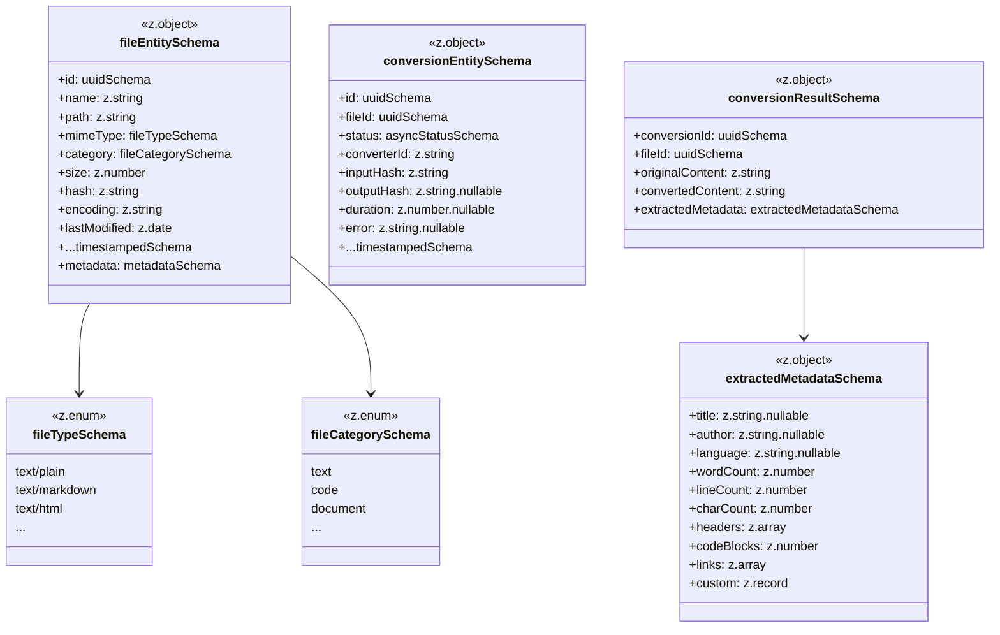

# T-01-2: ファイル・変換ドメインZodスキーマ設計書

## 概要

| 項目             | 内容                                       |
| ---------------- | ------------------------------------------ |
| タスクID         | T-01-2                                     |
| フェーズ         | Phase 1: 設計                              |
| 目的             | schemas.ts に定義するZodスキーマの詳細設計 |
| 成果物           | Zodスキーマの詳細設計書                    |
| 担当エージェント | @schema-def                                |

---

## 1. スキーマ設計方針

### 1.1 設計原則

1. **型との整合性**: T-01-1で定義した型と完全に一致するスキーマを定義
2. **ランタイム検証**: 外部入力（API、ファイル読み込み）に対するバリデーション
3. **エラーメッセージ**: 日本語で明確なエラーメッセージを提供
4. **再利用性**: CONV-03-01の基盤スキーマを継承・組み合わせ
5. **型推論**: `z.infer<typeof schema>` で型を導出可能に設計

### 1.2 CONV-03-01からのインポート

```typescript
// packages/shared/src/types/rag/file/schemas.ts

import { z } from "zod";
import {
  uuidSchema,
  timestampedSchema,
  metadataSchema,
  asyncStatusSchema,
} from "../schemas";
```

---

## 2. 列挙型スキーマ

### 2.1 fileTypeSchema（ファイルタイプスキーマ）

```typescript
/**
 * ファイルタイプスキーマ
 *
 * @description MIMEタイプに基づくファイル種別のバリデーション
 * @validation 定義済みのMIMEタイプのいずれかであること
 */
export const fileTypeSchema = z.enum(
  [
    // テキスト系
    "text/plain",
    "text/markdown",
    "text/html",
    "text/csv",
    "text/tab-separated-values",
    // コード系
    "text/javascript",
    "text/typescript",
    "application/x-python",
    "application/json",
    "application/x-yaml",
    "application/xml",
    // ドキュメント系
    "application/pdf",
    "application/vnd.openxmlformats-officedocument.wordprocessingml.document",
    "application/vnd.openxmlformats-officedocument.spreadsheetml.sheet",
    "application/vnd.openxmlformats-officedocument.presentationml.presentation",
    // その他
    "application/octet-stream",
  ],
  {
    errorMap: () => ({
      message:
        "無効なファイルタイプです。サポートされているMIMEタイプを指定してください。",
    }),
  },
);

/** 型推論用エクスポート */
export type FileTypeSchema = z.infer<typeof fileTypeSchema>;
```

**バリデーションルール**:

- 定義済みMIMEタイプのいずれかに一致すること

---

### 2.2 fileCategorySchema（ファイルカテゴリスキーマ）

```typescript
/**
 * ファイルカテゴリスキーマ
 *
 * @description ファイルの用途に基づく分類のバリデーション
 */
export const fileCategorySchema = z.enum(
  ["text", "code", "document", "spreadsheet", "presentation", "other"],
  {
    errorMap: () => ({
      message:
        "無効なファイルカテゴリです。text, code, document, spreadsheet, presentation, other のいずれかを指定してください。",
    }),
  },
);

/** 型推論用エクスポート */
export type FileCategorySchema = z.infer<typeof fileCategorySchema>;
```

---

## 3. エンティティスキーマ

### 3.1 fileEntitySchema（ファイルエンティティスキーマ）

```typescript
/**
 * ファイルエンティティスキーマ
 *
 * @description RAGパイプラインで処理対象となるファイルのバリデーション
 */
export const fileEntitySchema = z
  .object({
    /** ファイルID（UUID形式） */
    id: uuidSchema.describe("ファイルの一意識別子"),

    /** ファイル名 */
    name: z
      .string()
      .min(1, "ファイル名は1文字以上である必要があります")
      .max(255, "ファイル名は255文字以下である必要があります")
      .describe("ファイル名（拡張子を含む）"),

    /** ファイルパス */
    path: z
      .string()
      .min(1, "ファイルパスは必須です")
      .describe("ファイルの絶対パスまたは相対パス"),

    /** MIMEタイプ */
    mimeType: fileTypeSchema.describe("MIMEタイプに基づくファイル種別"),

    /** ファイルカテゴリ */
    category: fileCategorySchema.describe("ファイルの用途に基づくカテゴリ"),

    /** ファイルサイズ */
    size: z
      .number()
      .int("ファイルサイズは整数である必要があります")
      .nonnegative("ファイルサイズは0以上である必要があります")
      .max(10 * 1024 * 1024, "ファイルサイズは10MB以下である必要があります")
      .describe("ファイルサイズ（バイト単位）"),

    /** SHA-256ハッシュ */
    hash: z
      .string()
      .length(64, "ハッシュは64文字（SHA-256形式）である必要があります")
      .regex(/^[0-9a-f]{64}$/, "ハッシュは16進数文字列である必要があります")
      .describe("重複検出用SHA-256ハッシュ"),

    /** 文字エンコーディング */
    encoding: z
      .string()
      .min(1, "エンコーディングは必須です")
      .default("utf-8")
      .describe("文字エンコーディング"),

    /** 最終更新日時 */
    lastModified: z.date().describe("ファイルの最終更新日時"),
  })
  .merge(timestampedSchema)
  .extend({
    metadata: metadataSchema.describe("拡張可能なメタデータ"),
  });

/** 型推論用エクスポート */
export type FileEntitySchema = z.infer<typeof fileEntitySchema>;
```

**バリデーションルール**:

| フィールド   | ルール                          |
| ------------ | ------------------------------- |
| id           | UUID形式                        |
| name         | 1-255文字                       |
| path         | 1文字以上                       |
| mimeType     | 定義済みMIMEタイプ              |
| category     | 定義済みカテゴリ                |
| size         | 0以上、10MB以下の整数           |
| hash         | 64文字の16進数文字列（SHA-256） |
| encoding     | 1文字以上（デフォルト: utf-8）  |
| lastModified | Date型                          |

---

### 3.2 conversionEntitySchema（変換エンティティスキーマ）

```typescript
/**
 * 変換エンティティスキーマ
 *
 * @description ファイル変換処理の状態と結果のバリデーション
 */
export const conversionEntitySchema = z
  .object({
    /** 変換ID */
    id: uuidSchema.describe("変換処理の一意識別子"),

    /** ファイルID参照 */
    fileId: uuidSchema.describe("変換対象ファイルへの参照"),

    /** 変換状態 */
    status: asyncStatusSchema.describe("変換処理の状態"),

    /** コンバーターID */
    converterId: z
      .string()
      .min(1, "コンバーターIDは必須です")
      .describe("使用されたコンバーターの識別子"),

    /** 入力ハッシュ */
    inputHash: z
      .string()
      .length(64, "ハッシュは64文字である必要があります")
      .regex(/^[0-9a-f]{64}$/, "ハッシュは16進数文字列である必要があります")
      .describe("入力ファイルのハッシュ（キャッシュキー用）"),

    /** 出力ハッシュ（変換成功時のみ） */
    outputHash: z
      .string()
      .length(64, "ハッシュは64文字である必要があります")
      .regex(/^[0-9a-f]{64}$/, "ハッシュは16進数文字列である必要があります")
      .nullable()
      .describe("出力コンテンツのハッシュ（変換成功時）"),

    /** 処理時間（変換完了時のみ） */
    duration: z
      .number()
      .int("処理時間は整数である必要があります")
      .nonnegative("処理時間は0以上である必要があります")
      .nullable()
      .describe("処理時間（ミリ秒、変換完了時）"),

    /** エラーメッセージ（変換失敗時のみ） */
    error: z.string().nullable().describe("エラーメッセージ（変換失敗時）"),
  })
  .merge(timestampedSchema);

/** 型推論用エクスポート */
export type ConversionEntitySchema = z.infer<typeof conversionEntitySchema>;
```

**ビジネスルール検証**:

```typescript
/**
 * 変換エンティティの状態整合性検証スキーマ
 *
 * @description 状態に応じた必須フィールドの検証
 */
export const conversionEntityWithValidationSchema = conversionEntitySchema
  .refine(
    (data) => {
      // completed 状態では outputHash と duration が必須
      if (data.status === "completed") {
        return data.outputHash !== null && data.duration !== null;
      }
      return true;
    },
    {
      message: "完了状態では outputHash と duration が必須です",
      path: ["status"],
    },
  )
  .refine(
    (data) => {
      // failed 状態では error が必須
      if (data.status === "failed") {
        return data.error !== null;
      }
      return true;
    },
    {
      message: "失敗状態では error が必須です",
      path: ["status"],
    },
  );
```

---

## 4. 値オブジェクトスキーマ

### 4.1 extractedMetadataSchema（抽出メタデータスキーマ）

````typescript
/**
 * 抽出メタデータスキーマ
 *
 * @description ファイル変換時に抽出される付随情報のバリデーション
 */
export const extractedMetadataSchema = z.object({
  /** ドキュメントタイトル */
  title: z
    .string()
    .max(500, "タイトルは500文字以下である必要があります")
    .nullable()
    .describe("ドキュメントタイトル（Markdownの#等から抽出）"),

  /** 作成者 */
  author: z
    .string()
    .max(200, "作成者名は200文字以下である必要があります")
    .nullable()
    .describe("作成者（PDFメタデータ等から抽出）"),

  /** 言語コード */
  language: z
    .string()
    .length(2, "言語コードはISO 639-1形式（2文字）である必要があります")
    .regex(/^[a-z]{2}$/, "言語コードは小文字のアルファベット2文字です")
    .nullable()
    .describe("言語コード（ISO 639-1形式、例: ja, en）"),

  /** 単語数 */
  wordCount: z
    .number()
    .int("単語数は整数である必要があります")
    .nonnegative("単語数は0以上である必要があります")
    .describe("単語数"),

  /** 行数 */
  lineCount: z
    .number()
    .int("行数は整数である必要があります")
    .nonnegative("行数は0以上である必要があります")
    .describe("行数"),

  /** 文字数 */
  charCount: z
    .number()
    .int("文字数は整数である必要があります")
    .nonnegative("文字数は0以上である必要があります")
    .describe("文字数"),

  /** 見出し一覧 */
  headers: z
    .array(z.string().max(500, "見出しは500文字以下である必要があります"))
    .describe("見出し一覧（階層構造のフラット化）"),

  /** コードブロック数 */
  codeBlocks: z
    .number()
    .int("コードブロック数は整数である必要があります")
    .nonnegative("コードブロック数は0以上である必要があります")
    .describe("コードブロック数（Markdownの```等）"),

  /** リンク一覧 */
  links: z
    .array(z.string().url("有効なURL形式である必要があります"))
    .describe("抽出されたリンクURL一覧"),

  /** カスタムメタデータ */
  custom: z.record(z.unknown()).describe("コンバーター固有の追加メタデータ"),
});

/** 型推論用エクスポート */
export type ExtractedMetadataSchema = z.infer<typeof extractedMetadataSchema>;
````

---

### 4.2 conversionResultSchema（変換結果スキーマ）

```typescript
/**
 * 変換結果スキーマ
 *
 * @description ファイル変換処理の出力のバリデーション
 */
export const conversionResultSchema = z.object({
  /** 変換ID参照 */
  conversionId: uuidSchema.describe("変換処理のID参照"),

  /** ファイルID参照 */
  fileId: uuidSchema.describe("変換対象ファイルのID参照"),

  /** 元コンテンツ */
  originalContent: z.string().describe("変換前の元コンテンツ"),

  /** 変換後コンテンツ */
  convertedContent: z
    .string()
    .describe("変換後のコンテンツ（プレーンテキストまたはMarkdown）"),

  /** 抽出メタデータ */
  extractedMetadata: extractedMetadataSchema.describe("抽出されたメタデータ"),
});

/** 型推論用エクスポート */
export type ConversionResultSchema = z.infer<typeof conversionResultSchema>;
```

---

## 5. 入出力スキーマ

### 5.1 fileSelectionInputSchema（ファイル選択入力スキーマ）

```typescript
/**
 * ファイル選択入力スキーマ
 *
 * @description ファイル選択処理のパラメータバリデーション
 */
export const fileSelectionInputSchema = z.object({
  /** 選択対象パス */
  paths: z
    .array(z.string().min(1, "パスは空文字列にできません"))
    .min(1, "少なくとも1つのパスを指定してください")
    .describe("選択対象のパス（ファイルまたはディレクトリ）"),

  /** 再帰検索フラグ */
  recursive: z
    .boolean()
    .default(false)
    .describe("サブディレクトリを再帰的に検索するか"),

  /** 隠しファイル含有フラグ */
  includeHidden: z
    .boolean()
    .default(false)
    .describe("隠しファイル（.で始まる）を含めるか"),

  /** 最大ファイルサイズ */
  maxFileSize: z
    .number()
    .int("最大ファイルサイズは整数である必要があります")
    .positive("最大ファイルサイズは正の整数である必要があります")
    .default(10 * 1024 * 1024) // 10MB
    .describe("最大ファイルサイズ（バイト）"),

  /** 許可ファイルタイプ */
  allowedTypes: z
    .array(fileTypeSchema)
    .optional()
    .describe("許可するファイルタイプ（指定なしは全許可）"),

  /** 除外パターン */
  excludePatterns: z
    .array(z.string())
    .default([])
    .describe("除外パターン（glob形式）"),
});

/** 型推論用エクスポート */
export type FileSelectionInputSchema = z.infer<typeof fileSelectionInputSchema>;
```

---

### 5.2 skippedFileSchema（スキップファイルスキーマ）

```typescript
/**
 * スキップファイルスキーマ
 *
 * @description スキップされたファイル情報のバリデーション
 */
export const skippedFileSchema = z.object({
  /** ファイルパス */
  path: z.string().min(1, "パスは必須です").describe("ファイルパス"),

  /** スキップ理由 */
  reason: z.string().min(1, "スキップ理由は必須です").describe("スキップ理由"),
});

/** 型推論用エクスポート */
export type SkippedFileSchema = z.infer<typeof skippedFileSchema>;
```

---

### 5.3 fileSelectionResultSchema（ファイル選択結果スキーマ）

```typescript
/**
 * ファイル選択結果スキーマ
 *
 * @description ファイル選択処理の結果バリデーション
 */
export const fileSelectionResultSchema = z.object({
  /** 選択されたファイル一覧 */
  selectedFiles: z.array(fileEntitySchema).describe("選択されたファイル一覧"),

  /** スキップされたファイル一覧 */
  skippedFiles: z
    .array(skippedFileSchema)
    .describe("スキップされたファイル一覧（理由付き）"),

  /** 合計サイズ */
  totalSize: z
    .number()
    .int("合計サイズは整数である必要があります")
    .nonnegative("合計サイズは0以上である必要があります")
    .describe("選択されたファイルの合計サイズ"),
});

/** 型推論用エクスポート */
export type FileSelectionResultSchema = z.infer<
  typeof fileSelectionResultSchema
>;
```

---

## 6. パーシャルスキーマ（更新用）

### 6.1 partialFileEntitySchema（部分更新用）

```typescript
/**
 * ファイルエンティティ部分更新スキーマ
 *
 * @description ファイルエンティティの部分更新用バリデーション
 */
export const partialFileEntitySchema = fileEntitySchema.partial().omit({
  id: true,
  createdAt: true,
});

/** 型推論用エクスポート */
export type PartialFileEntitySchema = z.infer<typeof partialFileEntitySchema>;
```

### 6.2 partialConversionEntitySchema（部分更新用）

```typescript
/**
 * 変換エンティティ部分更新スキーマ
 *
 * @description 変換エンティティの部分更新用バリデーション
 */
export const partialConversionEntitySchema = conversionEntitySchema
  .partial()
  .omit({
    id: true,
    fileId: true,
    createdAt: true,
  });

/** 型推論用エクスポート */
export type PartialConversionEntitySchema = z.infer<
  typeof partialConversionEntitySchema
>;
```

---

## 7. 作成用スキーマ（ID自動生成）

### 7.1 createFileEntitySchema（ファイル作成用）

```typescript
/**
 * ファイルエンティティ作成スキーマ
 *
 * @description 新規ファイル作成時のバリデーション（ID, timestamp自動生成）
 */
export const createFileEntitySchema = fileEntitySchema.omit({
  id: true,
  createdAt: true,
  updatedAt: true,
});

/** 型推論用エクスポート */
export type CreateFileEntitySchema = z.infer<typeof createFileEntitySchema>;
```

### 7.2 createConversionEntitySchema（変換作成用）

```typescript
/**
 * 変換エンティティ作成スキーマ
 *
 * @description 新規変換処理作成時のバリデーション
 */
export const createConversionEntitySchema = conversionEntitySchema
  .omit({
    id: true,
    createdAt: true,
    updatedAt: true,
    outputHash: true,
    duration: true,
    error: true,
  })
  .extend({
    status: z.literal("pending").default("pending"),
  });

/** 型推論用エクスポート */
export type CreateConversionEntitySchema = z.infer<
  typeof createConversionEntitySchema
>;
```

---

## 8. スキーマ関連図



---

## 9. CONV-03-01 との依存関係

### 9.1 インポートスキーマ一覧

| スキーマ名          | 用途               | インポート元 |
| ------------------- | ------------------ | ------------ |
| `uuidSchema`        | ID検証             | `../schemas` |
| `timestampedSchema` | タイムスタンプ検証 | `../schemas` |
| `metadataSchema`    | メタデータ検証     | `../schemas` |
| `asyncStatusSchema` | 変換状態検証       | `../schemas` |

### 9.2 スキーマ合成パターン

```typescript
// merge: 2つのスキーマを結合
fileEntitySchema.merge(timestampedSchema)

// extend: 追加フィールドを定義
fileEntitySchema.extend({ metadata: metadataSchema })

// omit: 特定フィールドを除外（作成用スキーマ）
fileEntitySchema.omit({ id: true, createdAt: true })

// partial: 全フィールドをオプショナルに（更新用スキーマ）
fileEntitySchema.partial()

// refine: カスタムバリデーションルールを追加
conversionEntitySchema.refine(...)
```

---

## 10. 設計検証チェックリスト

### 10.1 完了条件

- [x] fileTypeSchema の設計が完了
- [x] fileCategorySchema の設計が完了
- [x] fileEntitySchema の設計が完了
- [x] conversionEntitySchema の設計が完了
- [x] extractedMetadataSchema の設計が完了
- [x] fileSelectionInputSchema の設計が完了
- [x] fileSelectionResultSchema の設計が完了

### 10.2 Zodベストプラクティスチェック

- [x] 全スキーマにdescribeでドキュメント付与
- [x] エラーメッセージが日本語で明確
- [x] 適切なデフォルト値を設定
- [x] nullable/optional を正確に区別
- [x] refine で複合バリデーションを実装
- [x] 型推論用のexportを提供

### 10.3 T-01-1との整合性チェック

- [x] 全てのインターフェースに対応するスキーマが存在
- [x] フィールド名が完全に一致
- [x] 型の制約がスキーマに反映されている
- [x] CONV-03-01のスキーマを適切に活用

---

## 11. 次のステップ

| 次タスク                   | 内容                 | 依存                   |
| -------------------------- | -------------------- | ---------------------- |
| T-01-3: ユーティリティ設計 | 変換・判定関数の設計 | 本タスク               |
| T-02-1: 設計レビュー       | 設計の妥当性検証     | T-01-1, T-01-2, T-01-3 |
