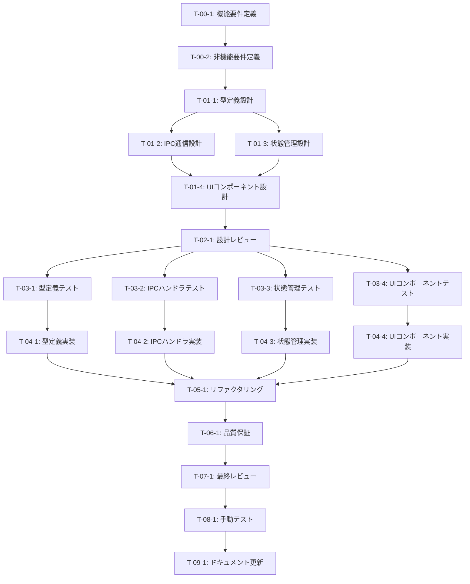

# ファイル選択機能 - タスク実行仕様書

## ユーザーからの元の指示

```
ファイル選択機能（CONV-01）を実装する。
ユーザーがファイルを選択し、選択されたファイル情報を取得できるUIとロジックを実装する。
Electron IPCによるネイティブダイアログ呼び出し、ファイルメタ情報の取得、
ファイル情報の状態管理を含む。
```

## メタ情報

| 項目             | 内容                 |
| ---------------- | -------------------- |
| タスクID         | CONV-01              |
| タスク名         | ファイル選択機能     |
| 分類             | 新規機能             |
| 対象機能         | ファイル変換システム |
| 優先度           | 高                   |
| 見積もり規模     | 中規模               |
| ステータス       | 未実施               |
| 発見元           | 初期要件定義         |
| 発見日           | 2025-12-15           |
| 発見エージェント | .claude/agents/req-analyst.md         |

---

## タスク概要

### 目的

ユーザーがファイルを選択し、選択されたファイルの情報（パス、名前、サイズ、拡張子など）を取得できるUIとロジックを実装する。Electronのネイティブダイアログを使用し、セキュアなIPC通信を介してファイル情報を取得する。

### 背景

ファイル変換システムの最初のステップとして、ユーザーが対象ファイルを選択できる機能が必要。Electronアプリケーションでのファイル選択UIとネイティブダイアログの統合、選択されたファイルの情報を後続の変換処理に渡す仕組みが必要となる。

### 最終ゴール

- ファイル選択ダイアログを開くボタンがUIに存在する
- ネイティブのファイル選択ダイアログが開く
- 選択されたファイルのパス、名前、サイズ、拡張子などのメタ情報が取得できる
- 選択されたファイル情報が状態管理に保存される
- 選択キャンセル時の適切なハンドリング

### 成果物一覧

| 種別              | 成果物                     | 配置先                                                                 |
| ----------------- | -------------------------- | ---------------------------------------------------------------------- |
| 型定義            | ファイル関連型定義         | `packages/shared/src/types/file.ts`                                    |
| IPC ハンドラ      | ファイルダイアログハンドラ | `apps/desktop/src/main/handlers/file-dialog.ts`                        |
| 状態管理          | ファイル情報ストア         | `apps/desktop/src/renderer/store/file-store.ts`                        |
| UI コンポーネント | ファイル選択コンポーネント | `apps/desktop/src/renderer/components/FileSelector.tsx`                |
| テスト            | ユニットテスト             | `apps/desktop/src/renderer/components/__tests__/FileSelector.test.tsx` |
| テスト            | IPC ハンドラテスト         | `apps/desktop/src/main/handlers/__tests__/file-dialog.test.ts`         |
| ドキュメント      | 設計ドキュメント           | `docs/30-workflows/file-selection/`                                    |

---

## 参照ファイル

本仕様書のコマンド・エージェント・スキル選定は以下を参照：

- `docs/00-requirements/master_system_design.md` - システム要件
- `.claude/commands/ai/command_list.md` - /ai:コマンド定義
- `.claude/agents/agent_list.md` - エージェント定義
- `.claude/skills/skill_list.md` - スキル定義

---

## タスク分解サマリー

| ID     | フェーズ | サブタスク名                | 責務                                 | 依存   |
| ------ | -------- | --------------------------- | ------------------------------------ | ------ |
| T-00-1 | Phase 0  | 機能要件定義                | ファイル選択機能の機能要件を明確化   | なし   |
| T-00-2 | Phase 0  | 非機能要件定義              | パフォーマンス・セキュリティ要件定義 | T-00-1 |
| T-01-1 | Phase 1  | 型定義設計                  | ファイル関連の型定義設計             | T-00-2 |
| T-01-2 | Phase 1  | IPC 通信設計                | Main-Renderer 間の IPC 設計          | T-01-1 |
| T-01-3 | Phase 1  | 状態管理設計                | Zustand ストア設計                   | T-01-1 |
| T-01-4 | Phase 1  | UI コンポーネント設計       | FileSelector コンポーネント設計      | T-01-3 |
| T-02-1 | Phase 2  | 設計レビュー                | 要件・設計の妥当性検証               | T-01-4 |
| T-03-1 | Phase 3  | 型定義テスト作成            | 型定義のユニットテスト               | T-02-1 |
| T-03-2 | Phase 3  | IPC ハンドラテスト作成      | IPC ハンドラのユニットテスト         | T-02-1 |
| T-03-3 | Phase 3  | 状態管理テスト作成          | Zustand ストアのユニットテスト       | T-02-1 |
| T-03-4 | Phase 3  | UI コンポーネントテスト作成 | FileSelector のコンポーネントテスト  | T-02-1 |
| T-04-1 | Phase 4  | 型定義実装                  | ファイル関連型定義の実装             | T-03-1 |
| T-04-2 | Phase 4  | IPC ハンドラ実装            | ファイルダイアログハンドラの実装     | T-03-2 |
| T-04-3 | Phase 4  | 状態管理実装                | Zustand ストアの実装                 | T-03-3 |
| T-04-4 | Phase 4  | UI コンポーネント実装       | FileSelector コンポーネントの実装    | T-03-4 |
| T-05-1 | Phase 5  | コードリファクタリング      | コード品質の改善                     | T-04-4 |
| T-06-1 | Phase 6  | 品質保証                    | テスト実行・品質チェック             | T-05-1 |
| T-07-1 | Phase 7  | 最終レビュー                | 全体品質・整合性検証                 | T-06-1 |
| T-08-1 | Phase 8  | 手動テスト                  | ユーザー視点での動作確認             | T-07-1 |
| T-09-1 | Phase 9  | ドキュメント更新            | システムドキュメント更新             | T-08-1 |

**総サブタスク数**: 19個

---

## 実行フロー図



---

## Phase 0: 要件定義

### T-00-1: 機能要件定義

#### 目的

ファイル選択機能の機能要件を明確に定義し、実装の基盤となる仕様を策定する。

#### 背景

ファイル変換システムの最初のステップであり、後続のすべてのタスクの基盤となるため、要件を明確にしておく必要がある。

#### 責務（単一責務）

ファイル選択機能の機能要件の定義と文書化

#### Claude Code スラッシュコマンド

> ⚠️ 以下はターミナルコマンドではなく、Claude Code内で実行するスラッシュコマンドです

```
/ai:gather-requirements file-selection
```

- **参照**: `.claude/commands/ai/command_list.md`

#### 使用エージェント

- **エージェント**: .claude/agents/req-analyst.md
- **選定理由**: 要件の抽出・整理・明確化に特化したエージェントであり、Karl Wiegersの要求工学手法に基づいた体系的な要件定義が可能
- **参照**: `.claude/agents/agent_list.md`

#### 活用スキル

| スキル名                               | 活用方法                         |
| -------------------------------------- | -------------------------------- |
| .claude/skills/functional-non-functional-requirements/SKILL.md | 機能要件・非機能要件の分類と整理 |
| .claude/skills/use-case-modeling/SKILL.md                      | ユーザー視点でのユースケース特定 |
| .claude/skills/acceptance-criteria-writing/SKILL.md            | 受け入れ基準の明確化             |

- **参照**: `.claude/skills/skill_list.md`

#### 成果物

| 成果物     | パス                                                      | 内容                     |
| ---------- | --------------------------------------------------------- | ------------------------ |
| 要件定義書 | `docs/30-workflows/file-selection/step01-requirements.md` | 機能要件定義ドキュメント |

#### 完了条件

- [ ] ファイル選択UIの要件が定義されている
- [ ] 対応ファイル形式（拡張子フィルタ）が決定されている
- [ ] 単一/複数ファイル選択の要件が決定されている
- [ ] ファイルサイズ制限が定義されている
- [ ] ユースケースが文書化されている

#### 依存関係

- **前提**: なし
- **後続**: T-00-2

---

### T-00-2: 非機能要件定義

#### 目的

ファイル選択機能のパフォーマンス・セキュリティ・ユーザビリティに関する非機能要件を定義する。

#### 背景

Electronアプリケーションでのファイル操作は、セキュリティ上の配慮が特に重要。IPC通信のセキュリティ、ファイルパスの検証など、安全な実装のための要件を明確にする必要がある。

#### 責務（単一責務）

非機能要件（セキュリティ・パフォーマンス・アクセシビリティ）の定義

#### Claude Code スラッシュコマンド

> ⚠️ 以下はターミナルコマンドではなく、Claude Code内で実行するスラッシュコマンドです

```
/ai:write-spec file-selection-nfr
```

- **参照**: `.claude/commands/ai/command_list.md`

#### 使用エージェント

- **エージェント**: .claude/agents/req-analyst.md
- **選定理由**: 非機能要件の体系的な整理・定義に精通
- **補助エージェント**: .claude/agents/electron-security.md（セキュリティ観点）
- **参照**: `.claude/agents/agent_list.md`

#### 活用スキル

| スキル名                               | 活用方法                    |
| -------------------------------------- | --------------------------- |
| .claude/skills/functional-non-functional-requirements/SKILL.md | NFR分類と測定可能な目標定義 |
| .claude/skills/electron-security-hardening/SKILL.md            | Electronセキュリティ要件    |

- **参照**: `.claude/skills/skill_list.md`

#### 成果物

| 成果物         | パス                                             | 内容                       |
| -------------- | ------------------------------------------------ | -------------------------- |
| 非機能要件定義 | `docs/30-workflows/file-selection/step02-nfr.md` | 非機能要件定義ドキュメント |

#### 完了条件

- [ ] IPC通信のセキュリティ要件が定義されている
- [ ] ファイルパス検証要件が定義されている
- [ ] パフォーマンス要件（応答時間等）が定義されている
- [ ] アクセシビリティ要件が定義されている
- [ ] エラーハンドリング要件が定義されている

#### 依存関係

- **前提**: T-00-1
- **後続**: T-01-1

---

## Phase 1: 設計

### T-01-1: 型定義設計

#### 目的

ファイル選択機能で使用する型定義を設計する。sharedパッケージに配置し、Main/Renderer間で共有できるようにする。

#### 背景

TypeScriptの型安全性を最大限活用し、ファイル情報の構造を明確に定義することで、実装時のエラーを防ぐ。

#### 責務（単一責務）

ファイル関連の型定義設計

#### Claude Code スラッシュコマンド

> ⚠️ 以下はターミナルコマンドではなく、Claude Code内で実行するスラッシュコマンドです

```
/ai:create-schema file-info
```

- **参照**: `.claude/commands/ai/command_list.md`

#### 使用エージェント

- **エージェント**: .claude/agents/schema-def.md
- **選定理由**: Zodスキーマ定義と型安全な設計に特化したエージェント
- **参照**: `.claude/agents/agent_list.md`

#### 活用スキル

| スキル名             | 活用方法                       |
| -------------------- | ------------------------------ |
| .claude/skills/zod-validation/SKILL.md       | Zodスキーマによる型定義        |
| .claude/skills/type-safety-patterns/SKILL.md | TypeScript厳格モードでの型設計 |

- **参照**: `.claude/skills/skill_list.md`

#### 成果物

| 成果物     | パス                                                     | 内容         |
| ---------- | -------------------------------------------------------- | ------------ |
| 型定義設計 | `docs/30-workflows/file-selection/step03-type-design.md` | 型定義設計書 |

#### 完了条件

- [ ] FileInfo型が設計されている
- [ ] FileSelectionResult型が設計されている
- [ ] FileFilter型が設計されている
- [ ] Zodスキーマが設計されている
- [ ] 型の共有方法が決定されている

#### 依存関係

- **前提**: T-00-2
- **後続**: T-01-2, T-01-3

---

### T-01-2: IPC通信設計

#### 目的

Main-Renderer間のIPC通信を設計する。contextBridgeを使用したセキュアな通信パターンを定義する。

#### 背景

Electronのセキュリティベストプラクティスに従い、contextBridgeを介したセキュアなIPC通信を設計する必要がある。

#### 責務（単一責務）

IPC通信の設計（チャネル名、リクエスト/レスポンス形式）

#### Claude Code スラッシュコマンド

> ⚠️ 以下はターミナルコマンドではなく、Claude Code内で実行するスラッシュコマンドです

```
/ai:design-electron-app file-dialog-ipc
```

- **参照**: `.claude/commands/ai/command_list.md`

#### 使用エージェント

- **エージェント**: .claude/agents/electron-architect.md
- **選定理由**: Electron固有のMain/Renderer分離、IPC設計に精通したエージェント
- **参照**: `.claude/agents/agent_list.md`

#### 活用スキル

| スキル名                    | 活用方法                           |
| --------------------------- | ---------------------------------- |
| .claude/skills/electron-architecture/SKILL.md       | Main/Renderer分離、IPC通信パターン |
| .claude/skills/electron-security-hardening/SKILL.md | contextBridge、CSP設定             |

- **参照**: `.claude/skills/skill_list.md`

#### 成果物

| 成果物    | パス                                                    | 内容          |
| --------- | ------------------------------------------------------- | ------------- |
| IPC設計書 | `docs/30-workflows/file-selection/step04-ipc-design.md` | IPC通信設計書 |

#### 完了条件

- [ ] IPCチャネル名が定義されている
- [ ] リクエスト/レスポンス形式が定義されている
- [ ] contextBridge APIが設計されている
- [ ] エラーハンドリングが設計されている
- [ ] セキュリティ考慮が文書化されている

#### 依存関係

- **前提**: T-01-1
- **後続**: T-01-4

---

### T-01-3: 状態管理設計

#### 目的

Zustandを使用したファイル情報の状態管理ストアを設計する。

#### 背景

選択されたファイル情報をReactコンポーネント間で共有し、後続の変換処理に渡すための状態管理が必要。

#### 責務（単一責務）

Zustandストアの設計（状態、アクション、セレクタ）

#### Claude Code スラッシュコマンド

> ⚠️ 以下はターミナルコマンドではなく、Claude Code内で実行するスラッシュコマンドです

```
/ai:setup-state-management file-store
```

- **参照**: `.claude/commands/ai/command_list.md`

#### 使用エージェント

- **エージェント**: .claude/agents/state-manager.md
- **選定理由**: React状態管理（Zustand/SWR/React Query）に特化したエージェント
- **参照**: `.claude/agents/agent_list.md`

#### 活用スキル

| スキル名                 | 活用方法                         |
| ------------------------ | -------------------------------- |
| .claude/skills/data-fetching-strategies/SKILL.md | 非同期データフェッチ戦略         |
| .claude/skills/custom-hooks-patterns/SKILL.md    | カスタムフックによるロジック分離 |

- **参照**: `.claude/skills/skill_list.md`

#### 成果物

| 成果物         | パス                                                      | 内容              |
| -------------- | --------------------------------------------------------- | ----------------- |
| 状態管理設計書 | `docs/30-workflows/file-selection/step05-store-design.md` | Zustandストア設計 |

#### 完了条件

- [ ] ストアの状態構造が設計されている
- [ ] アクション（selectFile, clearSelection等）が設計されている
- [ ] セレクタが設計されている
- [ ] 永続化の要否が決定されている

#### 依存関係

- **前提**: T-01-1
- **後続**: T-01-4

---

### T-01-4: UIコンポーネント設計

#### 目的

FileSelectorコンポーネントのUI設計を行う。アクセシビリティとユーザビリティを考慮した設計。

#### 背景

ユーザーが直接操作するUIコンポーネントであり、使いやすさとアクセシビリティが重要。

#### 責務（単一責務）

FileSelectorコンポーネントのUI/UX設計

#### Claude Code スラッシュコマンド

> ⚠️ 以下はターミナルコマンドではなく、Claude Code内で実行するスラッシュコマンドです

```
/ai:create-component FileSelector molecule
```

- **参照**: `.claude/commands/ai/command_list.md`

#### 使用エージェント

- **エージェント**: .claude/agents/ui-designer.md
- **選定理由**: UIコンポーネント設計、アクセシビリティ、デザインシステムに特化
- **参照**: `.claude/agents/agent_list.md`

#### 活用スキル

| スキル名                       | 活用方法                     |
| ------------------------------ | ---------------------------- |
| .claude/skills/component-composition-patterns/SKILL.md | Composition パターンでの設計 |
| .claude/skills/accessibility-wcag/SKILL.md             | WCAG準拠のアクセシビリティ   |
| .claude/skills/tailwind-css-patterns/SKILL.md          | Tailwind CSSでのスタイリング |

- **参照**: `.claude/skills/skill_list.md`

#### 成果物

| 成果物               | パス                                                   | 内容                 |
| -------------------- | ------------------------------------------------------ | -------------------- |
| UIコンポーネント設計 | `docs/30-workflows/file-selection/step06-ui-design.md` | コンポーネント設計書 |

#### 完了条件

- [ ] コンポーネントのPropsが設計されている
- [ ] 状態遷移（未選択、選択中、選択済み、エラー）が設計されている
- [ ] アクセシビリティ属性が定義されている
- [ ] スタイリング方針が決定されている
- [ ] レスポンシブ対応が考慮されている

#### 依存関係

- **前提**: T-01-2, T-01-3
- **後続**: T-02-1

---

## Phase 2: 設計レビューゲート

### T-02-1: 設計レビュー

#### 目的

実装開始前に要件・設計の妥当性を複数エージェントで検証し、問題を早期発見する。

#### 背景

設計ミスが実装後に発見されると修正コストが大幅に増加するため、「Shift Left」原則に基づき問題を早期検出する。

#### レビュー参加エージェント

| エージェント       | レビュー観点          | 選定理由                               |
| ------------------ | --------------------- | -------------------------------------- |
| .claude/agents/arch-police.md       | アーキテクチャ整合性  | クリーンアーキテクチャ準拠の検証       |
| .claude/agents/electron-security.md | Electron セキュリティ | IPC通信のセキュリティ検証              |
| .claude/agents/ui-designer.md       | UI/UX設計             | アクセシビリティ・ユーザビリティの検証 |

- **参照**: `.claude/agents/agent_list.md`

#### レビューチェックリスト

**アーキテクチャ整合性** (.claude/agents/arch-police.md)

- [ ] クリーンアーキテクチャのレイヤー違反がないか
- [ ] 依存関係逆転の原則(DIP)が守られているか
- [ ] 既存設計との整合性があるか

**Electronセキュリティ** (.claude/agents/electron-security.md)

- [ ] contextBridgeを適切に使用しているか
- [ ] IPC通信が安全か
- [ ] ファイルパス検証が考慮されているか

**UI/UX設計** (.claude/agents/ui-designer.md)

- [ ] アクセシビリティが考慮されているか
- [ ] ユーザビリティが確保されているか
- [ ] デザインシステムとの整合性があるか

#### レビュー結果

- **判定**: （実行時に記入）
- **指摘事項**: （実行時に記入）
- **対応方針**: （実行時に記入）

#### 戻り先決定（MAJORの場合）

| 問題の種類 | 戻り先              |
| ---------- | ------------------- |
| 要件の問題 | Phase 0（要件定義） |
| 設計の問題 | Phase 1（設計）     |
| 両方の問題 | Phase 0（要件定義） |

#### 完了条件

- [ ] 全レビュー観点でチェックが完了
- [ ] 指摘事項への対応方針が決定
- [ ] PASS/MINOR判定で次フェーズへ進行可能

#### 依存関係

- **前提**: T-01-4
- **後続**: T-03-1, T-03-2, T-03-3, T-03-4

---

## Phase 3: テスト作成 (TDD: Red)

### T-03-1: 型定義テスト作成

#### 目的

ファイル関連の型定義のユニットテストを作成する。

#### 背景

TDDの原則に従い、実装前にテストを作成することで、期待される動作を明確にする。

#### 責務（単一責務）

型定義・Zodスキーマのユニットテスト作成

#### Claude Code スラッシュコマンド

> ⚠️ 以下はターミナルコマンドではなく、Claude Code内で実行するスラッシュコマンドです

```
/ai:generate-unit-tests packages/shared/src/types/file.ts
```

- **参照**: `.claude/commands/ai/command_list.md`

#### 使用エージェント

- **エージェント**: .claude/agents/unit-tester.md
- **選定理由**: TDD原則に基づくユニットテスト設計・実装に特化
- **参照**: `.claude/agents/agent_list.md`

#### 活用スキル

| スキル名                | 活用方法                   |
| ----------------------- | -------------------------- |
| .claude/skills/tdd-principles/SKILL.md          | Red-Green-Refactorサイクル |
| .claude/skills/boundary-value-analysis/SKILL.md | 境界値テスト               |

- **参照**: `.claude/skills/skill_list.md`

#### 成果物

| 成果物       | パス                                               | 内容                |
| ------------ | -------------------------------------------------- | ------------------- |
| 型定義テスト | `packages/shared/src/types/__tests__/file.test.ts` | Zodスキーマのテスト |

#### TDD検証: Red状態確認

```bash
pnpm --filter @repo/shared test:run
```

- [ ] テストが失敗することを確認（Red状態）

#### 完了条件

- [ ] FileInfoスキーマのバリデーションテストがある
- [ ] FileSelectionResultのテストがある
- [ ] エッジケース（空文字、不正な拡張子等）のテストがある

#### 依存関係

- **前提**: T-02-1
- **後続**: T-04-1

---

### T-03-2: IPCハンドラテスト作成

#### 目的

ファイルダイアログIPCハンドラのユニットテストを作成する。

#### 背景

Main プロセスのIPCハンドラは、Electronのdialog APIをモック化してテストする必要がある。

#### 責務（単一責務）

IPCハンドラのユニットテスト作成

#### Claude Code スラッシュコマンド

> ⚠️ 以下はターミナルコマンドではなく、Claude Code内で実行するスラッシュコマンドです

```
/ai:generate-unit-tests apps/desktop/src/main/handlers/file-dialog.ts
```

- **参照**: `.claude/commands/ai/command_list.md`

#### 使用エージェント

- **エージェント**: .claude/agents/unit-tester.md
- **選定理由**: モック・スタブを活用したユニットテストに精通
- **参照**: `.claude/agents/agent_list.md`

#### 活用スキル

| スキル名        | 活用方法                      |
| --------------- | ----------------------------- |
| .claude/skills/test-doubles/SKILL.md    | Electron dialog APIのモック化 |
| .claude/skills/vitest-advanced/SKILL.md | Vitestでの非同期テスト        |

- **参照**: `.claude/skills/skill_list.md`

#### 成果物

| 成果物            | パス                                                           | 内容                |
| ----------------- | -------------------------------------------------------------- | ------------------- |
| IPCハンドラテスト | `apps/desktop/src/main/handlers/__tests__/file-dialog.test.ts` | IPCハンドラのテスト |

#### TDD検証: Red状態確認

```bash
pnpm --filter @repo/desktop test:run
```

- [ ] テストが失敗することを確認（Red状態）

#### 完了条件

- [ ] ファイル選択成功時のテストがある
- [ ] キャンセル時のテストがある
- [ ] エラー時のテストがある
- [ ] dialog APIがモック化されている

#### 依存関係

- **前提**: T-02-1
- **後続**: T-04-2

---

### T-03-3: 状態管理テスト作成

#### 目的

Zustandファイルストアのユニットテストを作成する。

#### 背景

状態管理のテストにより、アクションによる状態遷移が正しく行われることを保証する。

#### 責務（単一責務）

Zustandストアのユニットテスト作成

#### Claude Code スラッシュコマンド

> ⚠️ 以下はターミナルコマンドではなく、Claude Code内で実行するスラッシュコマンドです

```
/ai:generate-unit-tests apps/desktop/src/renderer/store/file-store.ts
```

- **参照**: `.claude/commands/ai/command_list.md`

#### 使用エージェント

- **エージェント**: .claude/agents/unit-tester.md
- **選定理由**: 状態管理ライブラリのテストパターンに精通
- **参照**: `.claude/agents/agent_list.md`

#### 活用スキル

| スキル名       | 活用方法           |
| -------------- | ------------------ |
| .claude/skills/tdd-principles/SKILL.md | 状態遷移のテスト   |
| .claude/skills/test-doubles/SKILL.md   | ストアの分離テスト |

- **参照**: `.claude/skills/skill_list.md`

#### 成果物

| 成果物       | パス                                                           | 内容                  |
| ------------ | -------------------------------------------------------------- | --------------------- |
| ストアテスト | `apps/desktop/src/renderer/store/__tests__/file-store.test.ts` | Zustandストアのテスト |

#### TDD検証: Red状態確認

```bash
pnpm --filter @repo/desktop test:run
```

- [ ] テストが失敗することを確認（Red状態）

#### 完了条件

- [ ] 初期状態のテストがある
- [ ] selectFile アクションのテストがある
- [ ] clearSelection アクションのテストがある
- [ ] セレクタのテストがある

#### 依存関係

- **前提**: T-02-1
- **後続**: T-04-3

---

### T-03-4: UIコンポーネントテスト作成

#### 目的

FileSelectorコンポーネントのコンポーネントテストを作成する。

#### 背景

ユーザーインタラクションをシミュレートし、コンポーネントの動作を検証する。

#### 責務（単一責務）

FileSelectorのコンポーネントテスト作成

#### Claude Code スラッシュコマンド

> ⚠️ 以下はターミナルコマンドではなく、Claude Code内で実行するスラッシュコマンドです

```
/ai:generate-component-tests apps/desktop/src/renderer/components/FileSelector.tsx
```

- **参照**: `.claude/commands/ai/command_list.md`

#### 使用エージェント

- **エージェント**: .claude/agents/frontend-tester.md
- **選定理由**: コンポーネントテスト（React Testing Library）に特化
- **参照**: `.claude/agents/agent_list.md`

#### 活用スキル

| スキル名           | 活用方法                     |
| ------------------ | ---------------------------- |
| .claude/skills/playwright-testing/SKILL.md | コンポーネントテストパターン |
| .claude/skills/test-doubles/SKILL.md       | IPCモック化                  |
| .claude/skills/accessibility-wcag/SKILL.md | アクセシビリティテスト       |

- **参照**: `.claude/skills/skill_list.md`

#### 成果物

| 成果物               | パス                                                                   | 内容                 |
| -------------------- | ---------------------------------------------------------------------- | -------------------- |
| コンポーネントテスト | `apps/desktop/src/renderer/components/__tests__/FileSelector.test.tsx` | FileSelectorのテスト |

#### TDD検証: Red状態確認

```bash
pnpm --filter @repo/desktop test:run
```

- [ ] テストが失敗することを確認（Red状態）

#### 完了条件

- [ ] レンダリングテストがある
- [ ] ボタンクリックのテストがある
- [ ] ファイル選択後の表示テストがある
- [ ] キャンセル時のテストがある
- [ ] アクセシビリティテストがある

#### 依存関係

- **前提**: T-02-1
- **後続**: T-04-4

---

## Phase 4: 実装 (TDD: Green)

### T-04-1: 型定義実装

#### 目的

ファイル関連の型定義を実装し、テストを成功させる。

#### 背景

TDDのGreenフェーズとして、テストを通すための最小限の実装を行う。

#### 責務（単一責務）

ファイル関連型定義の実装

#### Claude Code スラッシュコマンド

> ⚠️ 以下はターミナルコマンドではなく、Claude Code内で実行するスラッシュコマンドです

```
/ai:create-schema file
```

- **参照**: `.claude/commands/ai/command_list.md`

#### 使用エージェント

- **エージェント**: .claude/agents/schema-def.md
- **選定理由**: Zodスキーマ定義と型推論に特化
- **参照**: `.claude/agents/agent_list.md`

#### 活用スキル

| スキル名             | 活用方法        |
| -------------------- | --------------- |
| .claude/skills/zod-validation/SKILL.md       | Zodスキーマ実装 |
| .claude/skills/type-safety-patterns/SKILL.md | 型安全な実装    |

- **参照**: `.claude/skills/skill_list.md`

#### 成果物

| 成果物 | パス                                | 内容           |
| ------ | ----------------------------------- | -------------- |
| 型定義 | `packages/shared/src/types/file.ts` | ファイル型定義 |

#### TDD検証: Green状態確認

```bash
pnpm --filter @repo/shared test:run
```

- [ ] テストが成功することを確認（Green状態）

#### 完了条件

- [ ] FileInfo型が実装されている
- [ ] FileSelectionResult型が実装されている
- [ ] Zodスキーマが実装されている
- [ ] 全テストがパス

#### 依存関係

- **前提**: T-03-1
- **後続**: T-05-1

---

### T-04-2: IPCハンドラ実装

#### 目的

ファイルダイアログのIPCハンドラを実装し、テストを成功させる。

#### 背景

Electronのdialog APIを使用してネイティブダイアログを呼び出し、セキュアにファイル情報を返す。

#### 責務（単一責務）

IPCハンドラの実装

#### Claude Code スラッシュコマンド

> ⚠️ 以下はターミナルコマンドではなく、Claude Code内で実行するスラッシュコマンドです

```
/ai:create-electron-window file-dialog
```

- **参照**: `.claude/commands/ai/command_list.md`

#### 使用エージェント

- **エージェント**: .claude/agents/electron-ui-dev.md
- **選定理由**: Electron UIコンポーネント・ダイアログ実装に特化
- **参照**: `.claude/agents/agent_list.md`

#### 活用スキル

| スキル名                    | 活用方法               |
| --------------------------- | ---------------------- |
| .claude/skills/electron-ui-patterns/SKILL.md        | ダイアログ実装パターン |
| .claude/skills/electron-security-hardening/SKILL.md | IPC通信のセキュリティ  |

- **参照**: `.claude/skills/skill_list.md`

#### 成果物

| 成果物      | パス                                            | 内容            |
| ----------- | ----------------------------------------------- | --------------- |
| IPCハンドラ | `apps/desktop/src/main/handlers/file-dialog.ts` | IPCハンドラ実装 |

#### TDD検証: Green状態確認

```bash
pnpm --filter @repo/desktop test:run
```

- [ ] テストが成功することを確認（Green状態）

#### 完了条件

- [ ] dialog.showOpenDialog が呼び出される
- [ ] ファイルメタ情報が取得される
- [ ] エラーハンドリングが実装されている
- [ ] 全テストがパス

#### 依存関係

- **前提**: T-03-2
- **後続**: T-05-1

---

### T-04-3: 状態管理実装

#### 目的

Zustandファイルストアを実装し、テストを成功させる。

#### 背景

ファイル選択状態をアプリケーション全体で共有するための状態管理を実装する。

#### 責務（単一責務）

Zustandストアの実装

#### Claude Code スラッシュコマンド

> ⚠️ 以下はターミナルコマンドではなく、Claude Code内で実行するスラッシュコマンドです

```
/ai:create-custom-hook useFileStore
```

- **参照**: `.claude/commands/ai/command_list.md`

#### 使用エージェント

- **エージェント**: .claude/agents/state-manager.md
- **選定理由**: Zustand状態管理の実装に精通
- **参照**: `.claude/agents/agent_list.md`

#### 活用スキル

| スキル名              | 活用方法           |
| --------------------- | ------------------ |
| .claude/skills/custom-hooks-patterns/SKILL.md | カスタムフック実装 |
| .claude/skills/state-lifting/SKILL.md         | 状態の適切な配置   |

- **参照**: `.claude/skills/skill_list.md`

#### 成果物

| 成果物 | パス                                            | 内容          |
| ------ | ----------------------------------------------- | ------------- |
| ストア | `apps/desktop/src/renderer/store/file-store.ts` | Zustandストア |

#### TDD検証: Green状態確認

```bash
pnpm --filter @repo/desktop test:run
```

- [ ] テストが成功することを確認（Green状態）

#### 完了条件

- [ ] 状態構造が実装されている
- [ ] selectFile アクションが実装されている
- [ ] clearSelection アクションが実装されている
- [ ] 全テストがパス

#### 依存関係

- **前提**: T-03-3
- **後続**: T-05-1

---

### T-04-4: UIコンポーネント実装

#### 目的

FileSelectorコンポーネントを実装し、テストを成功させる。

#### 背景

ユーザーがファイルを選択するためのUIコンポーネントを実装する。

#### 責務（単一責務）

FileSelectorコンポーネントの実装

#### Claude Code スラッシュコマンド

> ⚠️ 以下はターミナルコマンドではなく、Claude Code内で実行するスラッシュコマンドです

```
/ai:create-component FileSelector molecule
```

- **参照**: `.claude/commands/ai/command_list.md`

#### 使用エージェント

- **エージェント**: .claude/agents/electron-ui-dev.md
- **選定理由**: Electron UIコンポーネント実装に特化
- **参照**: `.claude/agents/agent_list.md`

#### 活用スキル

| スキル名                       | 活用方法                 |
| ------------------------------ | ------------------------ |
| .claude/skills/component-composition-patterns/SKILL.md | Compositionパターン実装  |
| .claude/skills/accessibility-wcag/SKILL.md             | ARIA属性の実装           |
| .claude/skills/tailwind-css-patterns/SKILL.md          | Tailwindでのスタイリング |

- **参照**: `.claude/skills/skill_list.md`

#### 成果物

| 成果物           | パス                                                    | 内容                       |
| ---------------- | ------------------------------------------------------- | -------------------------- |
| UIコンポーネント | `apps/desktop/src/renderer/components/FileSelector.tsx` | FileSelectorコンポーネント |

#### TDD検証: Green状態確認

```bash
pnpm --filter @repo/desktop test:run
```

- [ ] テストが成功することを確認（Green状態）

#### 完了条件

- [ ] ファイル選択ボタンが表示される
- [ ] クリックでダイアログが開く
- [ ] 選択後にファイル情報が表示される
- [ ] アクセシビリティ属性が実装されている
- [ ] 全テストがパス

#### 依存関係

- **前提**: T-03-4
- **後続**: T-05-1

---

## Phase 5: リファクタリング (TDD: Refactor)

### T-05-1: コードリファクタリング

#### 目的

動作を変えずにコード品質を改善する。

#### 背景

TDDのRefactorフェーズとして、テストが通る状態を維持しながらコード品質を向上させる。

#### 責務（単一責務）

コード品質の改善（命名、構造、重複排除）

#### Claude Code スラッシュコマンド

> ⚠️ 以下はターミナルコマンドではなく、Claude Code内で実行するスラッシュコマンドです

```
/ai:refactor apps/desktop/src/renderer/components/FileSelector.tsx
/ai:refactor apps/desktop/src/main/handlers/file-dialog.ts
```

- **参照**: `.claude/commands/ai/command_list.md`

#### 使用エージェント

- **エージェント**: .claude/agents/code-quality.md
- **選定理由**: コード品質改善、リファクタリングに特化
- **参照**: `.claude/agents/agent_list.md`

#### 活用スキル

| スキル名               | 活用方法             |
| ---------------------- | -------------------- |
| .claude/skills/refactoring-techniques/SKILL.md | リファクタリング手法 |
| .claude/skills/clean-code-practices/SKILL.md   | クリーンコード原則   |

- **参照**: `.claude/skills/skill_list.md`

#### 成果物

| 成果物                     | パス             | 内容                 |
| -------------------------- | ---------------- | -------------------- |
| リファクタリング済みコード | 各ソースファイル | 品質改善されたコード |

#### TDD検証: 継続Green確認

```bash
pnpm --filter @repo/desktop test:run
pnpm --filter @repo/shared test:run
```

- [ ] リファクタリング後もテストが成功することを確認

#### 完了条件

- [ ] 命名が適切である
- [ ] 重複コードが排除されている
- [ ] 関数/メソッドが適切なサイズである
- [ ] 全テストがパス

#### 依存関係

- **前提**: T-04-1, T-04-2, T-04-3, T-04-4
- **後続**: T-06-1

---

## Phase 6: 品質保証

### T-06-1: 品質保証

#### 目的

定義された品質基準をすべて満たすことを検証する。

#### 背景

実装完了後、テスト・Lint・型チェック・セキュリティスキャンを実行し、品質を保証する。

#### 責務（単一責務）

品質基準の検証

#### Claude Code スラッシュコマンド

> ⚠️ 以下はターミナルコマンドではなく、Claude Code内で実行するスラッシュコマンドです

```
/ai:run-all-tests --coverage
/ai:lint --fix
/ai:security-audit auth
```

- **参照**: `.claude/commands/ai/command_list.md`

#### 使用エージェント

- **エージェント**: .claude/agents/code-quality.md
- **選定理由**: コード品質検証に特化
- **補助エージェント**: .claude/agents/sec-auditor.md（セキュリティ検証）
- **参照**: `.claude/agents/agent_list.md`

#### 活用スキル

| スキル名             | 活用方法 |
| -------------------- | -------- |
| .claude/skills/eslint-configuration/SKILL.md | Lint検証 |
| .claude/skills/static-analysis/SKILL.md      | 静的解析 |

- **参照**: `.claude/skills/skill_list.md`

#### 成果物

| 成果物       | パス                                                        | 内容         |
| ------------ | ----------------------------------------------------------- | ------------ |
| 品質レポート | `docs/30-workflows/file-selection/step07-quality-report.md` | 品質検証結果 |

#### 完了条件

- [ ] 全ユニットテスト成功
- [ ] Lintエラーなし
- [ ] 型エラーなし
- [ ] テストカバレッジ80%以上
- [ ] セキュリティスキャン完了

#### 依存関係

- **前提**: T-05-1
- **後続**: T-07-1

---

## Phase 7: 最終レビューゲート

### T-07-1: 最終レビュー

#### 目的

全成果物の最終確認とマージ準備を行う。

#### 背景

すべての実装・テスト・品質検証が完了した後、最終確認を行いマージ可能状態にする。

#### 責務（単一責務）

最終品質確認とマージ準備

#### Claude Code スラッシュコマンド

> ⚠️ 以下はターミナルコマンドではなく、Claude Code内で実行するスラッシュコマンドです

```
/ai:code-review-complete apps/desktop/src
/ai:create-pr main
```

- **参照**: `.claude/commands/ai/command_list.md`

#### 使用エージェント

- **エージェント**: .claude/agents/arch-police.md
- **選定理由**: アーキテクチャ準拠の最終確認
- **補助エージェント**: .claude/agents/sec-auditor.md（セキュリティ最終確認）
- **参照**: `.claude/agents/agent_list.md`

#### 活用スキル

| スキル名                   | 活用方法               |
| -------------------------- | ---------------------- |
| .claude/skills/architectural-patterns/SKILL.md     | アーキテクチャ準拠確認 |
| code-review-best-practices | レビューチェックリスト |

- **参照**: `.claude/skills/skill_list.md`

#### 成果物

| 成果物               | パス                                                      | 内容         |
| -------------------- | --------------------------------------------------------- | ------------ |
| 最終レビューレポート | `docs/30-workflows/file-selection/step08-final-review.md` | 最終確認結果 |
| Pull Request         | GitHub PR                                                 | マージ用PR   |

#### 完了条件

- [ ] 全成果物が完成
- [ ] 品質基準を満たす
- [ ] PRが作成済み
- [ ] レビュー指摘事項なし

#### 依存関係

- **前提**: T-06-1
- **後続**: T-08-1

---

## Phase 8: 手動テスト

### T-08-1: 手動テスト実施

#### 目的

実機での動作確認を行い、ユーザー体験を検証する。

#### 背景

自動テストでは検証できないUI/UXや実際のファイルダイアログ動作を確認する。

#### 責務（単一責務）

手動での動作確認

#### Claude Code スラッシュコマンド

> ⚠️ 以下はターミナルコマンドではなく、Claude Code内で実行するスラッシュコマンドです

```
/ai:generate-e2e-tests file-selection
```

- **参照**: `.claude/commands/ai/command_list.md`

#### 使用エージェント

- **エージェント**: .claude/agents/e2e-tester.md
- **選定理由**: E2Eテストとユーザー体験検証に特化
- **参照**: `.claude/agents/agent_list.md`

#### 活用スキル

| スキル名           | 活用方法             |
| ------------------ | -------------------- |
| .claude/skills/playwright-testing/SKILL.md | E2Eテスト実行        |
| .claude/skills/accessibility-wcag/SKILL.md | アクセシビリティ確認 |

- **参照**: `.claude/skills/skill_list.md`

#### 成果物

| 成果物             | パス                                                     | 内容               |
| ------------------ | -------------------------------------------------------- | ------------------ |
| 手動テストレポート | `docs/30-workflows/file-selection/step09-manual-test.md` | テスト結果         |
| テスト動画/SS      | `docs/30-workflows/file-selection/evidence/`             | 動作確認エビデンス |

#### テスト項目

| テスト項目             | 確認内容                                 |
| ---------------------- | ---------------------------------------- |
| ファイル選択ボタン表示 | UIに正しく表示されること                 |
| ダイアログ起動         | ネイティブダイアログが開くこと           |
| ファイル選択           | 選択したファイル情報が取得できること     |
| キャンセル処理         | ダイアログキャンセル時にエラーにならない |
| ファイルフィルター     | 対応形式のみ選択可能であること           |
| 複数ファイル選択       | 複数ファイル選択時の動作確認             |
| エラー表示             | 不正操作時に適切なエラーが表示されること |
| クロスプラットフォーム | macOS/Windows両方での動作確認            |

#### 完了条件

- [ ] 全テスト項目が成功
- [ ] エビデンスが記録済み
- [ ] 不具合が0件

#### 依存関係

- **前提**: T-07-1
- **後続**: T-09-1

---

## Phase 9: ドキュメント更新

### T-09-1: ドキュメント作成

#### 目的

開発者向けドキュメントとAPI仕様書を作成する。

#### 背景

保守性と継続的開発のため、実装したコンポーネントとAPIの仕様を文書化する。

#### 責務（単一責務）

ドキュメント作成

#### Claude Code スラッシュコマンド

> ⚠️ 以下はターミナルコマンドではなく、Claude Code内で実行するスラッシュコマンドです

```
/ai:generate-api-docs apps/desktop/src/main/handlers
/ai:update-readme
```

- **参照**: `.claude/commands/ai/command_list.md`

#### 使用エージェント

- **エージェント**: .claude/agents/api-doc-writer.md
- **選定理由**: API仕様書作成に特化
- **補助エージェント**: .claude/agents/manual-writer.md（ユーザードキュメント）
- **参照**: `.claude/agents/agent_list.md`

#### 活用スキル

| スキル名                         | 活用方法         |
| -------------------------------- | ---------------- |
| .claude/skills/api-documentation-best-practices/SKILL.md | API仕様書作成    |
| .claude/skills/markdown-advanced-syntax/SKILL.md         | ドキュメント記述 |

- **参照**: `.claude/skills/skill_list.md`

#### 成果物

| 成果物             | パス                                                          | 内容               |
| ------------------ | ------------------------------------------------------------- | ------------------ |
| API仕様書          | `docs/30-workflows/file-selection/api-specification.md`       | IPC API仕様        |
| コンポーネント仕様 | `docs/30-workflows/file-selection/component-specification.md` | コンポーネント仕様 |
| 使用ガイド         | `docs/30-workflows/file-selection/usage-guide.md`             | 使用方法           |

#### 完了条件

- [ ] API仕様書が完成
- [ ] コンポーネント仕様が完成
- [ ] 使用ガイドが完成
- [ ] JSDocがコードに記述済み

#### 依存関係

- **前提**: T-08-1
- **後続**: なし（最終タスク）

---

## 品質ゲートチェックリスト

### 機能要件

- [ ] ファイル選択ボタンがUIに表示される
- [ ] クリックでネイティブダイアログが開く
- [ ] ファイル選択後、ファイル情報が取得できる
- [ ] 選択キャンセル時のハンドリングが正常
- [ ] 対応ファイル形式のみ選択可能

### 品質要件

- [ ] 全ユニットテストがパス
- [ ] TypeScript型エラーなし
- [ ] ESLint警告なし
- [ ] テストカバレッジ80%以上
- [ ] セキュリティスキャンクリア

### ドキュメント要件

- [ ] コンポーネントのJSDocが記述されている
- [ ] IPC通信のAPI仕様が文書化されている
- [ ] 使用ガイドが作成されている

---

## リスクと対策

| リスク                                   | 影響度 | 発生確率 | 対策                        |
| ---------------------------------------- | ------ | -------- | --------------------------- |
| IPC通信のセキュリティ問題                | 高     | 中       | contextBridge使用、入力検証 |
| ファイルパスのクロスプラットフォーム対応 | 中     | 中       | path.normalize使用          |
| 大量ファイル選択時のパフォーマンス       | 中     | 低       | 選択数制限の実装            |
| Electronバージョン互換性                 | 中     | 低       | 最新安定版使用、APIテスト   |

---

## 前提条件

- Electron + React の開発環境がセットアップ済み
- IPC通信の基盤（contextBridge）が整備済み
- 状態管理（Zustand）が導入済み
- pnpm モノレポ構成が完了済み

---

## 備考

### 補足事項

- このタスク（CONV-01）は後続タスク（CONV-02〜CONV-05）の前提条件となる
- ファイル形式のフィルタリングは変換エンジン（CONV-02）の対応形式に依存
- 本タスク完了後、変換処理タスクと並行して進行可能

### 参照情報

- `docs/00-requirements/master_system_design.md` - システム設計書
- `docs/00-requirements/05-architecture.md` - アーキテクチャ設計
- Electron Dialog API: https://www.electronjs.org/docs/latest/api/dialog
- Zustand Documentation: https://docs.pmnd.rs/zustand
- Zod Documentation: https://zod.dev
