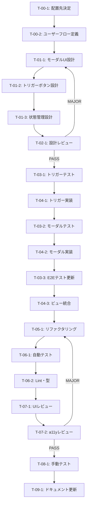

# FileSelector ビュー統合 - タスク実行仕様書

## ユーザーからの元の指示

```
FileSelectorコンポーネントをビューに統合し、ユーザーがファイル選択機能を利用できるようにする。
```

## メタ情報

| 項目             | 内容                                   |
| ---------------- | -------------------------------------- |
| タスクID         | TASK-UI-FILESELECTOR-INT-001           |
| タスク名         | FileSelectorコンポーネントのビュー統合 |
| 分類             | 機能追加                               |
| 対象機能         | ファイル選択UI                         |
| 優先度           | 高                                     |
| 見積もり規模     | 小規模                                 |
| ステータス       | 未実施                                 |
| 発見元           | Phase 7（最終レビューゲート）          |
| 発見日           | 2025-12-16                             |
| 発見エージェント | @ui-designer                           |

---

## タスク概要

### 目的

FileSelectorコンポーネント（`apps/desktop/src/renderer/components/organisms/FileSelector/FileSelector.tsx`）を適切なビューに配置し、ユーザーがUI上からファイル選択機能にアクセスできるようにする。

### 背景

ファイル選択機能（CONV-01）の実装において、FileSelectorコンポーネントは完成しているが、どのビュー（画面）に配置するかが未定義のままである。コンポーネントの単体テストやE2Eテスト（APIモック）は存在するが、実際のユーザーフローでの動作確認ができない状態となっている。

### 最終ゴール

- ユーザーがUIからファイル選択機能にアクセスできる
- ファイル選択の完全なユーザーフローが動作する
- E2Eテストでファイル選択の実際のユーザーフローをテストできる

### 成果物一覧

| 種別         | 成果物                         | 配置先                                                    |
| ------------ | ------------------------------ | --------------------------------------------------------- |
| 機能         | FileSelectorトリガーボタン     | `src/renderer/components/molecules/FileSelectorTrigger/`  |
| 機能         | FileSelectorモーダル           | `src/renderer/components/organisms/FileSelectorModal/`    |
| 機能         | 更新されたワークスペースビュー | `src/renderer/pages/workspace/`                           |
| テスト       | コンポーネントテスト           | `src/renderer/components/**/__tests__/`                   |
| テスト       | E2Eテスト更新                  | `e2e/file-selection.spec.ts`                              |
| ドキュメント | 手動テスト結果                 | `docs/30-workflows/file-selector-integration/step08-*.md` |
| ドキュメント | 設計ドキュメント               | `docs/30-workflows/file-selector-integration/step01-*.md` |

---

## 参照ファイル

本仕様書のコマンド・エージェント・スキル選定は以下を参照：

- `docs/00-requirements/master_system_design.md` - システム要件
- `.claude/commands/ai/command_list.md` - /ai:コマンド定義
- `.claude/agents/agent_list.md` - エージェント定義
- `.claude/skills/skill_list.md` - スキル定義

---

## タスク分解サマリー

| ID     | フェーズ         | サブタスク名             | 責務                       | 依存   |
| ------ | ---------------- | ------------------------ | -------------------------- | ------ |
| T-00-1 | 要件定義         | 配置先ビューの決定       | UI配置要件の明確化         | -      |
| T-00-2 | 要件定義         | ユーザーフロー定義       | 操作フローの定義           | T-00-1 |
| T-01-1 | 設計             | モーダルUI設計           | FileSelectorモーダル設計   | T-00-2 |
| T-01-2 | 設計             | トリガーボタン設計       | トリガーコンポーネント設計 | T-01-1 |
| T-01-3 | 設計             | 状態管理設計             | モーダル状態管理の設計     | T-01-2 |
| T-02-1 | 設計レビュー     | UI/UX設計レビュー        | 設計の妥当性検証           | T-01-3 |
| T-03-1 | テスト作成       | トリガーボタンテスト     | Redテスト作成              | T-02-1 |
| T-03-2 | テスト作成       | モーダルテスト           | Redテスト作成              | T-03-1 |
| T-03-3 | テスト作成       | E2Eテスト更新            | E2Eシナリオ追加            | T-03-2 |
| T-04-1 | 実装             | トリガーボタン実装       | Green実装                  | T-03-1 |
| T-04-2 | 実装             | モーダル実装             | Green実装                  | T-03-2 |
| T-04-3 | 実装             | ビュー統合               | ワークスペースへの統合     | T-04-2 |
| T-05-1 | リファクタリング | コード品質改善           | 重複排除・命名整理         | T-04-3 |
| T-06-1 | 品質保証         | 自動テスト実行           | テスト網羅性確認           | T-05-1 |
| T-06-2 | 品質保証         | Lint・型チェック         | コード品質確認             | T-06-1 |
| T-07-1 | 最終レビュー     | UI/UXレビュー            | UI品質確認                 | T-06-2 |
| T-07-2 | 最終レビュー     | アクセシビリティレビュー | WCAG準拠確認               | T-07-1 |
| T-08-1 | 手動テスト       | 機能テスト実行           | 手動テスト検証             | T-07-2 |
| T-09-1 | ドキュメント     | 要件ドキュメント更新     | docs/00-requirements更新   | T-08-1 |

**総サブタスク数**: 19個

---

## 実行フロー図



---

## Phase 0: 要件定義

### T-00-1: 配置先ビューの決定

#### 目的

FileSelectorコンポーネントを配置する適切なビュー（画面）を決定する。

#### 背景

FileSelectorは複数のファイルを選択する機能を提供する。ユーザーがどの画面からこの機能にアクセスするかを明確にする必要がある。

#### 責務（単一責務）

UI配置先の決定と根拠の文書化

#### Claude Code スラッシュコマンド

> ⚠️ 以下はターミナルコマンドではなく、Claude Code内で実行するスラッシュコマンドです

```
/ai:gather-requirements file-selector-integration
```

- **参照**: `.claude/commands/ai/command_list.md`

#### 使用エージェント

- **エージェント**: @ui-designer, @product-manager
- **選定理由**: UI配置の決定にはユーザー体験設計の専門知識が必要。プロダクトマネージャーはビジネス価値の観点から配置先を評価。
- **参照**: `.claude/agents/agent_list.md`

#### 活用スキル

| スキル名             | 活用方法                     |
| -------------------- | ---------------------------- |
| electron-ui-patterns | デスクトップUIパターンの参照 |
| user-story-mapping   | ユーザーストーリーの整理     |

- **参照**: `.claude/skills/skill_list.md`

#### 成果物

| 成果物     | パス                                                                 | 内容             |
| ---------- | -------------------------------------------------------------------- | ---------------- |
| 要件定義書 | `docs/30-workflows/file-selector-integration/step00-requirements.md` | 配置先決定と根拠 |

#### 完了条件

- [ ] 配置先ビューが決定されている（推奨：ワークスペース画面）
- [ ] 配置の根拠が文書化されている
- [ ] ステークホルダーの合意が得られている

#### 依存関係

- **前提**: なし
- **後続**: T-00-2

---

### T-00-2: ユーザーフロー定義

#### 目的

ファイル選択機能のユーザー操作フローを定義する。

#### 背景

ユーザーがどのような操作手順でファイルを選択するかを明確にすることで、UI設計の指針となる。

#### 責務（単一責務）

ユーザーフローの定義と図解

#### Claude Code スラッシュコマンド

```
/ai:define-use-cases file-selector
```

- **参照**: `.claude/commands/ai/command_list.md`

#### 使用エージェント

- **エージェント**: @req-analyst
- **選定理由**: ユースケースとユーザーフローの定義は要件分析の専門領域
- **参照**: `.claude/agents/agent_list.md`

#### 活用スキル

| スキル名                    | 活用方法             |
| --------------------------- | -------------------- |
| use-case-modeling           | ユースケース図の作成 |
| acceptance-criteria-writing | 受け入れ基準の定義   |

- **参照**: `.claude/skills/skill_list.md`

#### 成果物

| 成果物           | パス                                                                 | 内容         |
| ---------------- | -------------------------------------------------------------------- | ------------ |
| ユーザーフロー図 | `docs/30-workflows/file-selector-integration/step00-requirements.md` | 操作フロー図 |

#### 完了条件

- [ ] ユーザーフロー図が作成されている
- [ ] 受け入れ基準が定義されている
- [ ] エッジケースが特定されている

#### 依存関係

- **前提**: T-00-1
- **後続**: T-01-1

---

## Phase 1: 設計

### T-01-1: モーダルUI設計

#### 目的

FileSelectorをモーダルダイアログとして表示するためのUI設計を行う。

#### 背景

FileSelectorコンポーネントは既に実装済み。これをモーダルとしてラップし、開閉制御を追加する設計が必要。

#### 責務（単一責務）

FileSelectorモーダルのUI設計

#### Claude Code スラッシュコマンド

```
/ai:create-component FileSelectorModal organism
```

- **参照**: `.claude/commands/ai/command_list.md`

#### 使用エージェント

- **エージェント**: @ui-designer
- **選定理由**: UIコンポーネント設計の専門エージェント
- **参照**: `.claude/agents/agent_list.md`

#### 活用スキル

| スキル名                       | 活用方法                 |
| ------------------------------ | ------------------------ |
| component-composition-patterns | Composition パターン適用 |
| headless-ui-principles         | ロジックとUIの分離       |
| accessibility-wcag             | アクセシビリティ考慮     |

- **参照**: `.claude/skills/skill_list.md`

#### 成果物

| 成果物         | パス                                                           | 内容               |
| -------------- | -------------------------------------------------------------- | ------------------ |
| モーダル設計書 | `docs/30-workflows/file-selector-integration/step01-design.md` | コンポーネント設計 |

#### 完了条件

- [ ] モーダルのProps定義が完了している
- [ ] 開閉アニメーションが設計されている
- [ ] オーバーレイ動作が定義されている
- [ ] キーボード操作（Escape閉じ）が考慮されている

#### 依存関係

- **前提**: T-00-2
- **後続**: T-01-2

---

### T-01-2: トリガーボタン設計

#### 目的

モーダルを開くためのトリガーボタンコンポーネントを設計する。

#### 背景

ワークスペース画面のサイドバーまたはヘッダーに配置する「ファイル追加」ボタンの設計。

#### 責務（単一責務）

トリガーボタンコンポーネントの設計

#### Claude Code スラッシュコマンド

```
/ai:create-component FileSelectorTrigger molecule
```

- **参照**: `.claude/commands/ai/command_list.md`

#### 使用エージェント

- **エージェント**: @ui-designer
- **選定理由**: UIコンポーネント設計の専門エージェント
- **参照**: `.claude/agents/agent_list.md`

#### 活用スキル

| スキル名              | 活用方法           |
| --------------------- | ------------------ |
| tailwind-css-patterns | スタイリング設計   |
| accessibility-wcag    | aria-label等の設定 |

- **参照**: `.claude/skills/skill_list.md`

#### 成果物

| 成果物         | パス                                                           | 内容       |
| -------------- | -------------------------------------------------------------- | ---------- |
| トリガー設計書 | `docs/30-workflows/file-selector-integration/step01-design.md` | ボタン設計 |

#### 完了条件

- [ ] ボタンのバリエーション（サイズ、状態）が定義されている
- [ ] アイコンとラベルが決定されている
- [ ] hover/focus/active状態が設計されている

#### 依存関係

- **前提**: T-01-1
- **後続**: T-01-3

---

### T-01-3: 状態管理設計

#### 目的

モーダルの開閉状態と選択ファイルの状態管理方針を設計する。

#### 背景

モーダルの開閉はローカル状態で管理し、選択ファイルは親コンポーネントにリフトアップする設計が適切。

#### 責務（単一責務）

状態管理アーキテクチャの設計

#### Claude Code スラッシュコマンド

```
/ai:setup-state-management
```

- **参照**: `.claude/commands/ai/command_list.md`

#### 使用エージェント

- **エージェント**: @state-manager
- **選定理由**: 状態管理設計の専門エージェント
- **参照**: `.claude/agents/agent_list.md`

#### 活用スキル

| スキル名              | 活用方法             |
| --------------------- | -------------------- |
| state-lifting         | 状態リフトアップ設計 |
| custom-hooks-patterns | カスタムフック設計   |

- **参照**: `.claude/skills/skill_list.md`

#### 成果物

| 成果物         | パス                                                           | 内容         |
| -------------- | -------------------------------------------------------------- | ------------ |
| 状態管理設計書 | `docs/30-workflows/file-selector-integration/step01-design.md` | 状態フロー図 |

#### 完了条件

- [ ] 状態管理の方針が定義されている
- [ ] カスタムフック（useFileSelectorModal）が設計されている
- [ ] 親子間のデータフローが明確

#### 依存関係

- **前提**: T-01-2
- **後続**: T-02-1

---

## Phase 2: 設計レビューゲート

### T-02-1: UI/UX設計レビュー

#### 目的

実装開始前に設計の妥当性を検証し、手戻りを防止する。

#### 背景

設計ミスが実装後に発見されると修正コストが大幅に増加する。「Shift Left」原則に基づき、問題を早期に検出する。

#### レビュー参加エージェント

| エージェント       | レビュー観点         | 選定理由                       |
| ------------------ | -------------------- | ------------------------------ |
| @arch-police       | アーキテクチャ整合性 | コンポーネント構造の妥当性確認 |
| @ui-designer       | UI/UX設計品質        | デザインシステムとの整合性     |
| @electron-security | セキュリティ設計     | モーダルのセキュリティ考慮     |

- **参照**: `.claude/agents/agent_list.md`

#### レビューチェックリスト

**アーキテクチャ整合性** (@arch-police)

- [ ] コンポーネント配置がAtomic Design原則に従っている
- [ ] 依存関係が適切（organisms → molecules → atoms）
- [ ] 単一責務原則が守られている

**UI/UX設計品質** (@ui-designer)

- [ ] デザイントークンが適切に使用されている
- [ ] アクセシビリティ（WCAG 2.1 AA）が考慮されている
- [ ] レスポンシブデザインが考慮されている
- [ ] キーボード操作が完全にサポートされている

**セキュリティ設計** (@electron-security)

- [ ] モーダル内でのIPC通信が安全
- [ ] ファイルパス表示にセキュリティリスクがない

#### レビュー結果

- **判定**: （レビュー時に記入）
- **指摘事項**: （レビュー時に記入）
- **対応方針**: （レビュー時に記入）

#### 戻り先決定（MAJORの場合）

| 問題の種類 | 戻り先             |
| ---------- | ------------------ |
| 要件の問題 | T-00-1（要件定義） |
| 設計の問題 | T-01-1（設計）     |

#### 完了条件

- [ ] 全レビュー観点でチェック完了
- [ ] PASS または MINOR 判定を取得
- [ ] MINOR指摘は対応完了

#### 依存関係

- **前提**: T-01-3
- **後続**: T-03-1

---

## Phase 3: テスト作成 (TDD: Red)

### T-03-1: トリガーボタンテスト

#### 目的

FileSelectorTriggerコンポーネントの期待動作を検証するテストを作成する。

#### 背景

TDDの原則に従い、実装前にテストを作成してRedを確認する。

#### 責務（単一責務）

トリガーボタンのユニットテスト作成

#### Claude Code スラッシュコマンド

```
/ai:generate-unit-tests src/renderer/components/molecules/FileSelectorTrigger/FileSelectorTrigger.tsx
```

- **参照**: `.claude/commands/ai/command_list.md`

#### 使用エージェント

- **エージェント**: @frontend-tester
- **選定理由**: フロントエンドテストの専門エージェント
- **参照**: `.claude/agents/agent_list.md`

#### 活用スキル

| スキル名        | 活用方法            |
| --------------- | ------------------- |
| vitest-advanced | Vitestテスト作成    |
| test-doubles    | モック/スタブの活用 |

- **参照**: `.claude/skills/skill_list.md`

#### 成果物

| 成果物         | パス                                                                                           | 内容           |
| -------------- | ---------------------------------------------------------------------------------------------- | -------------- |
| テストファイル | `src/renderer/components/molecules/FileSelectorTrigger/__tests__/FileSelectorTrigger.test.tsx` | ユニットテスト |

#### TDD検証: Red状態確認

```bash
pnpm --filter @repo/desktop test:run -- --testPathPattern="FileSelectorTrigger"
```

- [ ] テストが失敗することを確認（Red状態）

#### 完了条件

- [ ] クリック時のonClick呼び出しテスト
- [ ] disabled状態のテスト
- [ ] aria-label属性のテスト
- [ ] キーボード操作（Enter/Space）のテスト

#### 依存関係

- **前提**: T-02-1
- **後続**: T-04-1

---

### T-03-2: モーダルテスト

#### 目的

FileSelectorModalコンポーネントの期待動作を検証するテストを作成する。

#### 背景

モーダルの開閉動作、オーバーレイクリック、Escapeキー処理をテストする。

#### 責務（単一責務）

モーダルコンポーネントのユニットテスト作成

#### Claude Code スラッシュコマンド

```
/ai:generate-unit-tests src/renderer/components/organisms/FileSelectorModal/FileSelectorModal.tsx
```

- **参照**: `.claude/commands/ai/command_list.md`

#### 使用エージェント

- **エージェント**: @frontend-tester
- **選定理由**: フロントエンドテストの専門エージェント
- **参照**: `.claude/agents/agent_list.md`

#### 活用スキル

| スキル名        | 活用方法            |
| --------------- | ------------------- |
| vitest-advanced | Vitestテスト作成    |
| test-doubles    | モック/スタブの活用 |

- **参照**: `.claude/skills/skill_list.md`

#### 成果物

| 成果物         | パス                                                                                       | 内容           |
| -------------- | ------------------------------------------------------------------------------------------ | -------------- |
| テストファイル | `src/renderer/components/organisms/FileSelectorModal/__tests__/FileSelectorModal.test.tsx` | ユニットテスト |

#### TDD検証: Red状態確認

```bash
pnpm --filter @repo/desktop test:run -- --testPathPattern="FileSelectorModal"
```

- [ ] テストが失敗することを確認（Red状態）

#### 完了条件

- [ ] isOpen=trueで表示されるテスト
- [ ] isOpen=falseで非表示のテスト
- [ ] onCloseコールバックのテスト
- [ ] Escapeキーでの閉じるテスト
- [ ] オーバーレイクリックでの閉じるテスト
- [ ] フォーカストラップのテスト

#### 依存関係

- **前提**: T-04-1（トリガー実装完了後）
- **後続**: T-04-2

---

### T-03-3: E2Eテスト更新

#### 目的

既存のE2Eテストを更新し、実際のユーザーフローをテストできるようにする。

#### 背景

現在のE2EテストはモックAPIのみをテストしている。実際のUI操作フローを追加する。

#### 責務（単一責務）

E2Eテストシナリオの追加

#### Claude Code スラッシュコマンド

```
/ai:generate-e2e-tests file-selector-ui-flow
```

- **参照**: `.claude/commands/ai/command_list.md`

#### 使用エージェント

- **エージェント**: @e2e-tester
- **選定理由**: E2Eテストの専門エージェント
- **参照**: `.claude/agents/agent_list.md`

#### 活用スキル

| スキル名              | 活用方法             |
| --------------------- | -------------------- |
| playwright-testing    | Playwrightテスト作成 |
| flaky-test-prevention | 安定したテスト設計   |

- **参照**: `.claude/skills/skill_list.md`

#### 成果物

| 成果物         | パス                         | 内容                    |
| -------------- | ---------------------------- | ----------------------- |
| テストファイル | `e2e/file-selection.spec.ts` | E2Eテスト（UI操作追加） |

#### TDD検証: Red状態確認

```bash
pnpm --filter @repo/desktop test:e2e
```

- [ ] 新規テストケースが失敗することを確認（Red状態）

#### 完了条件

- [ ] トリガーボタンクリックテスト
- [ ] モーダル表示テスト
- [ ] ファイル選択フローテスト
- [ ] モーダル閉じるテスト

#### 依存関係

- **前提**: T-04-2（モーダル実装完了後）
- **後続**: T-04-3

---

## Phase 4: 実装 (TDD: Green)

### T-04-1: トリガーボタン実装

#### 目的

FileSelectorTriggerコンポーネントを実装し、テストをパスさせる。

#### 背景

設計書とテストに基づいて、最小限の実装でテストを通す。

#### 責務（単一責務）

トリガーボタンコンポーネントの実装

#### Claude Code スラッシュコマンド

```
/ai:create-component FileSelectorTrigger molecule
```

- **参照**: `.claude/commands/ai/command_list.md`

#### 使用エージェント

- **エージェント**: @ui-designer
- **選定理由**: UIコンポーネント実装の専門エージェント
- **参照**: `.claude/agents/agent_list.md`

#### 活用スキル

| スキル名              | 活用方法             |
| --------------------- | -------------------- |
| tailwind-css-patterns | Tailwindスタイリング |
| accessibility-wcag    | アクセシビリティ実装 |

- **参照**: `.claude/skills/skill_list.md`

#### 成果物

| 成果物         | パス                                                                            | 内容         |
| -------------- | ------------------------------------------------------------------------------- | ------------ |
| コンポーネント | `src/renderer/components/molecules/FileSelectorTrigger/FileSelectorTrigger.tsx` | 実装コード   |
| index.ts       | `src/renderer/components/molecules/FileSelectorTrigger/index.ts`                | エクスポート |

#### TDD検証: Green状態確認

```bash
pnpm --filter @repo/desktop test:run -- --testPathPattern="FileSelectorTrigger"
```

- [ ] テストが成功することを確認（Green状態）

#### 完了条件

- [ ] 全テストケースがパス
- [ ] TypeScript型エラーなし
- [ ] コンポーネントが正しくエクスポートされている

#### 依存関係

- **前提**: T-03-1
- **後続**: T-03-2

---

### T-04-2: モーダル実装

#### 目的

FileSelectorModalコンポーネントを実装し、テストをパスさせる。

#### 背景

既存のFileSelectorコンポーネントをラップするモーダルを実装する。

#### 責務（単一責務）

モーダルコンポーネントの実装

#### Claude Code スラッシュコマンド

```
/ai:create-component FileSelectorModal organism
```

- **参照**: `.claude/commands/ai/command_list.md`

#### 使用エージェント

- **エージェント**: @ui-designer, @state-manager
- **選定理由**: UI実装と状態管理の専門エージェント
- **参照**: `.claude/agents/agent_list.md`

#### 活用スキル

| スキル名               | 活用方法                |
| ---------------------- | ----------------------- |
| headless-ui-principles | Headless UIパターン適用 |
| state-lifting          | 状態管理実装            |

- **参照**: `.claude/skills/skill_list.md`

#### 成果物

| 成果物         | パス                                                                        | 内容             |
| -------------- | --------------------------------------------------------------------------- | ---------------- |
| コンポーネント | `src/renderer/components/organisms/FileSelectorModal/FileSelectorModal.tsx` | 実装コード       |
| カスタムフック | `src/renderer/hooks/useFileSelectorModal.ts`                                | モーダル状態管理 |
| index.ts       | `src/renderer/components/organisms/FileSelectorModal/index.ts`              | エクスポート     |

#### TDD検証: Green状態確認

```bash
pnpm --filter @repo/desktop test:run -- --testPathPattern="FileSelectorModal"
```

- [ ] テストが成功することを確認（Green状態）

#### 完了条件

- [ ] 全テストケースがパス
- [ ] モーダルの開閉が正常動作
- [ ] フォーカストラップが機能
- [ ] Escapeキー・オーバーレイクリックで閉じる

#### 依存関係

- **前提**: T-03-2
- **後続**: T-03-3

---

### T-04-3: ビュー統合

#### 目的

ワークスペース画面にFileSelectorトリガーとモーダルを統合する。

#### 背景

実装したコンポーネントを実際の画面に配置し、ユーザーがアクセスできるようにする。

#### 責務（単一責務）

ワークスペースビューへの統合

#### Claude Code スラッシュコマンド

```
/ai:create-page /workspace
```

- **参照**: `.claude/commands/ai/command_list.md`

#### 使用エージェント

- **エージェント**: @router-dev, @ui-designer
- **選定理由**: ページ実装とUI統合の専門エージェント
- **参照**: `.claude/agents/agent_list.md`

#### 活用スキル

| スキル名                       | 活用方法           |
| ------------------------------ | ------------------ |
| component-composition-patterns | コンポーネント合成 |

- **参照**: `.claude/skills/skill_list.md`

#### 成果物

| 成果物           | パス                                             | 内容           |
| ---------------- | ------------------------------------------------ | -------------- |
| 更新されたビュー | `src/renderer/pages/workspace/WorkspacePage.tsx` | 統合済みページ |

#### TDD検証: Green状態確認

```bash
pnpm --filter @repo/desktop test:e2e
```

- [ ] E2Eテストが成功することを確認（Green状態）

#### 完了条件

- [ ] トリガーボタンがワークスペースに表示される
- [ ] ボタンクリックでモーダルが開く
- [ ] ファイル選択フローが完了まで動作する
- [ ] E2Eテストがパス

#### 依存関係

- **前提**: T-03-3
- **後続**: T-05-1

---

## Phase 5: リファクタリング (TDD: Refactor)

### T-05-1: コード品質改善

#### 目的

動作を変えずにコード品質を改善する。

#### 背景

TDDのRefactorフェーズとして、テストを維持しながらコードを整理する。

#### 責務（単一責務）

コードリファクタリング

#### Claude Code スラッシュコマンド

```
/ai:refactor src/renderer/components/organisms/FileSelectorModal/
```

- **参照**: `.claude/commands/ai/command_list.md`

#### 使用エージェント

- **エージェント**: @code-quality
- **選定理由**: コード品質改善の専門エージェント
- **参照**: `.claude/agents/agent_list.md`

#### 活用スキル

| スキル名               | 活用方法                 |
| ---------------------- | ------------------------ |
| refactoring-techniques | リファクタリング手法適用 |
| clean-code-practices   | クリーンコード原則適用   |

- **参照**: `.claude/skills/skill_list.md`

#### 成果物

| 成果物             | パス                     | 内容         |
| ------------------ | ------------------------ | ------------ |
| リファクタ済コード | 各コンポーネントファイル | 品質改善済み |

#### TDD検証: 継続Green確認

```bash
pnpm --filter @repo/desktop test:run
```

- [ ] リファクタリング後もテストが成功することを確認

#### 完了条件

- [ ] 重複コードの排除
- [ ] 命名の統一
- [ ] 不要なコメントの削除
- [ ] 全テストが継続してパス

#### 依存関係

- **前提**: T-04-3
- **後続**: T-06-1

---

## Phase 6: 品質保証

### T-06-1: 自動テスト実行

#### 目的

全テストスイートを実行し、品質を保証する。

#### 背景

実装完了後、全体的なテスト網羅性を確認する。

#### 責務（単一責務）

テスト実行と結果確認

#### Claude Code スラッシュコマンド

```
/ai:run-all-tests --coverage
```

- **参照**: `.claude/commands/ai/command_list.md`

#### 使用エージェント

- **エージェント**: @unit-tester, @e2e-tester
- **選定理由**: テスト実行と品質確認の専門エージェント
- **参照**: `.claude/agents/agent_list.md`

#### 成果物

| 成果物             | パス           | 内容       |
| ------------------ | -------------- | ---------- |
| テスト結果         | コンソール出力 | テスト結果 |
| カバレッジレポート | `coverage/`    | カバレッジ |

#### 完了条件

- [ ] 全ユニットテスト成功
- [ ] 全E2Eテスト成功
- [ ] カバレッジが基準（80%）を達成

#### 依存関係

- **前提**: T-05-1
- **後続**: T-06-2

---

### T-06-2: Lint・型チェック

#### 目的

コード品質とTypescript型安全性を確認する。

#### 背景

静的解析でバグを予防する。

#### 責務（単一責務）

静的解析の実行

#### Claude Code スラッシュコマンド

```
/ai:lint --fix
```

- **参照**: `.claude/commands/ai/command_list.md`

#### 使用エージェント

- **エージェント**: @code-quality
- **選定理由**: コード品質管理の専門エージェント
- **参照**: `.claude/agents/agent_list.md`

#### 成果物

| 成果物   | パス           | 内容             |
| -------- | -------------- | ---------------- |
| Lint結果 | コンソール出力 | Lintチェック結果 |

#### 完了条件

- [ ] Lintエラーなし
- [ ] 型エラーなし
- [ ] コードフォーマット適用済み

#### 依存関係

- **前提**: T-06-1
- **後続**: T-07-1

---

## 品質ゲートチェックリスト

### 機能検証

- [ ] 全ユニットテスト成功
- [ ] 全E2Eテスト成功

### コード品質

- [ ] Lintエラーなし
- [ ] 型エラーなし
- [ ] コードフォーマット適用済み

### テスト網羅性

- [ ] カバレッジ基準達成（80%以上）

### セキュリティ

- [ ] 脆弱性スキャン完了
- [ ] 重大な脆弱性なし

---

## Phase 7: 最終レビューゲート

### T-07-1: UI/UXレビュー

#### 目的

実装完了後のUI品質を検証する。

#### 背景

自動テストでは検出できないUI/UX品質を人間の目で確認する。

#### レビュー参加エージェント

| エージェント     | レビュー観点 | 選定理由                   |
| ---------------- | ------------ | -------------------------- |
| @ui-designer     | UI品質       | デザインシステム整合性確認 |
| @frontend-tester | テスト品質   | テストカバレッジ・品質確認 |

- **参照**: `.claude/agents/agent_list.md`

#### レビューチェックリスト

**UI品質** (@ui-designer)

- [ ] デザイントークンが正しく適用されている
- [ ] アニメーションが滑らか
- [ ] レスポンシブ対応が正常

**テスト品質** (@frontend-tester)

- [ ] テストカバレッジが十分
- [ ] エッジケースがカバーされている

#### レビュー結果

- **判定**: （レビュー時に記入）
- **指摘事項**: （レビュー時に記入）
- **対応方針**: （レビュー時に記入）

#### 完了条件

- [ ] 全レビュー観点でチェック完了
- [ ] PASS または MINOR 判定を取得

#### 依存関係

- **前提**: T-06-2
- **後続**: T-07-2

---

### T-07-2: アクセシビリティレビュー

#### 目的

WCAG 2.1 AA準拠を確認する。

#### 背景

アクセシビリティは自動テストで完全にカバーできないため、専門的なレビューが必要。

#### レビュー参加エージェント

| エージェント | レビュー観点     | 選定理由     |
| ------------ | ---------------- | ------------ |
| @ui-designer | アクセシビリティ | WCAG準拠確認 |

- **参照**: `.claude/agents/agent_list.md`

#### レビューチェックリスト

**アクセシビリティ** (@ui-designer)

- [ ] キーボード操作が完全にサポートされている
- [ ] フォーカス順序が論理的
- [ ] スクリーンリーダーで適切に読み上げられる
- [ ] コントラスト比が基準を満たす
- [ ] aria属性が適切に設定されている

#### レビュー結果

- **判定**: （レビュー時に記入）
- **指摘事項**: （レビュー時に記入）
- **対応方針**: （レビュー時に記入）

#### 完了条件

- [ ] 全アクセシビリティチェック完了
- [ ] PASS または MINOR 判定を取得

#### 依存関係

- **前提**: T-07-1
- **後続**: T-08-1

---

## Phase 8: 手動テスト検証

### T-08-1: 機能テスト実行

#### 目的

自動テストでは検証できないユーザー体験を手動で確認する。

#### 背景

実際のユーザー操作フローでの動作確認が必要。

#### テスト分類

機能テスト / UI・UXテスト

#### 使用エージェント

- **エージェント**: @e2e-tester
- **選定理由**: テスト設計・実行の専門エージェント
- **参照**: `.claude/agents/agent_list.md`

#### 手動テストケース

| No  | カテゴリ   | テスト項目                     | 前提条件               | 操作手順                           | 期待結果                         | 実行結果 | 備考 |
| --- | ---------- | ------------------------------ | ---------------------- | ---------------------------------- | -------------------------------- | -------- | ---- |
| 1   | 基本機能   | トリガーボタン表示             | アプリ起動済み         | ワークスペース画面に遷移           | トリガーボタンが表示される       |          |      |
| 2   | 基本機能   | モーダル開閉                   | ワークスペース表示     | トリガーボタンをクリック           | モーダルが開く                   |          |      |
| 3   | 基本機能   | ファイル選択                   | モーダル開いている     | 「ファイルを選択」ボタンをクリック | ネイティブダイアログが開く       |          |      |
| 4   | 基本機能   | 選択ファイル表示               | ファイル選択完了       | ファイルを選択して確定             | 選択ファイルがリストに表示される |          |      |
| 5   | 基本機能   | 選択ファイル削除               | ファイルがリストにある | 削除ボタンをクリック               | ファイルがリストから削除される   |          |      |
| 6   | 基本機能   | モーダル閉じる（ボタン）       | モーダル開いている     | 閉じるボタンをクリック             | モーダルが閉じる                 |          |      |
| 7   | 基本機能   | モーダル閉じる（Escape）       | モーダル開いている     | Escapeキーを押す                   | モーダルが閉じる                 |          |      |
| 8   | 基本機能   | モーダル閉じる（オーバーレイ） | モーダル開いている     | オーバーレイ部分をクリック         | モーダルが閉じる                 |          |      |
| 9   | キーボード | Tab移動                        | モーダル開いている     | Tabキーを繰り返し押す              | フォーカスがモーダル内で循環する |          |      |
| 10  | キーボード | Enter/Space操作                | ボタンにフォーカス     | Enter/Spaceキーを押す              | ボタンがアクティベートされる     |          |      |

#### テスト実行手順

1. 開発サーバーを起動（`pnpm --filter @repo/desktop dev`）
2. アプリケーションを操作して上記テストケースを実行
3. 結果を「実行結果」列に記入（PASS/FAIL）
4. FAILの場合は「備考」列に詳細を記入

#### 成果物

| 成果物     | パス                                                                       | 内容           |
| ---------- | -------------------------------------------------------------------------- | -------------- |
| テスト結果 | `docs/30-workflows/file-selector-integration/step08-manual-test-result.md` | 手動テスト結果 |

#### 完了条件

- [ ] すべての手動テストケースが実行済み
- [ ] すべてのテストケースがPASS
- [ ] 発見された不具合が修正済みまたは記録済み

#### 依存関係

- **前提**: T-07-2
- **後続**: T-09-1

---

## Phase 9: ドキュメント更新・未完了タスク記録

### T-09-1: システムドキュメント更新

#### 目的

実装した内容をシステム要件ドキュメントに反映する。

#### 前提条件

- [ ] Phase 6の品質ゲートをすべて通過
- [ ] Phase 7の最終レビューゲートを通過
- [ ] Phase 8の手動テストが完了
- [ ] すべてのテストが成功

---

#### サブタスク 9.1: システムドキュメント更新

##### 更新対象ドキュメント

| ドキュメント                                  | 更新内容                         |
| --------------------------------------------- | -------------------------------- |
| `docs/00-requirements/16-ui-ux-guidelines.md` | FileSelectorモーダルのUI仕様追加 |

##### Claude Code スラッシュコマンド

```
/ai:update-all-docs
```

- **参照**: `.claude/commands/ai/command_list.md`

##### 使用エージェント

- **エージェント**: @spec-writer
- **選定理由**: ドキュメント作成の専門エージェント
- **参照**: `.claude/agents/agent_list.md`

##### 更新原則

- 概要のみ記載（詳細な実装説明は不要）
- システム構築に必要十分な情報のみ追記
- 既存ドキュメントの構造・フォーマットを維持
- Single Source of Truth原則を遵守

---

#### 完了条件

- [ ] UI/UXガイドラインにFileSelectorモーダル仕様が追加
- [ ] ドキュメントの整合性が確認済み

---

## リスクと対策

| リスク                   | 影響度 | 発生確率 | 対策                       | 対応サブタスク |
| ------------------------ | ------ | -------- | -------------------------- | -------------- |
| 既存UIとの競合           | 中     | 中       | 設計レビューで事前確認     | T-02-1         |
| アクセシビリティ要件漏れ | 高     | 低       | WCAGチェックリストでの検証 | T-07-2         |
| モーダルのフォーカス管理 | 中     | 中       | focus-trapライブラリの検討 | T-04-2         |
| E2Eテストのフレーキー化  | 低     | 中       | 明示的待機の実装           | T-03-3         |

---

## 前提条件

- FileSelectorコンポーネントが実装済み（`apps/desktop/src/renderer/components/organisms/FileSelector/`）
- ファイル選択IPC通信が動作確認済み
- Electronアプリケーションが起動できる状態

---

## 備考

### 技術的制約

- Electronのモーダルはブラウザモーダルと異なり、OSネイティブダイアログとの連携が必要
- フォーカストラップはRadix UIまたはカスタム実装を検討

### 参考資料

- [Radix UI Dialog](https://www.radix-ui.com/docs/primitives/components/dialog)
- [WAI-ARIA Dialog Pattern](https://www.w3.org/WAI/ARIA/apg/patterns/dialog-modal/)
- [Electron BrowserWindow](https://www.electronjs.org/docs/latest/api/browser-window)
