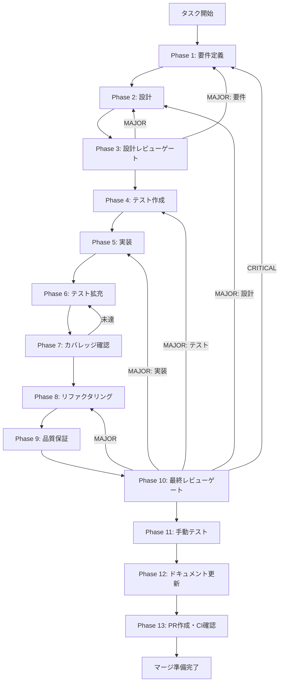

# fix-macos-build-ci - タスク実行仕様書

## ユーザーからの元の指示

```
GitHub Actions CI で macOS (Apple Silicon) ビルドが失敗する問題を修正する。
エラー内容: build/entitlements.mac.plist: cannot read entitlement data
```

## メタ情報

| 項目         | 内容                                  |
| ------------ | ------------------------------------- |
| タスクID     | fix-macos-build-ci                    |
| タスク名     | GitHub Actions macOS ビルドエラー修正 |
| 分類         | バグ修正                              |
| 対象機能     | Electron ビルド / GitHub Actions CI   |
| 優先度       | 高（CIが通らないため）                |
| 見積もり規模 | 小規模                                |
| ステータス   | 未実施                                |
| 作成日       | 2026-01-13                            |
| 関連Issue    | #212, #230, #221                      |

---

## タスク概要

### 目的

GitHub Actions CI で macOS (Apple Silicon) ビルドが `entitlements.mac.plist` ファイル不足により失敗する問題を解決し、CIパイプラインを安定化する。

### 背景

GitHub Actions の `build-electron.yml` ワークフローにおいて、macOS ビルド時に以下のエラーが発生している：

```
⨯ Command failed: codesign --sign - --force --timestamp --options runtime --entitlements build/entitlements.mac.plist ...
build/entitlements.mac.plist: cannot read entitlement data
```

**根本原因**:

1. `electron-builder.yml` で `entitlements: build/entitlements.mac.plist` が設定されている
2. しかし、`apps/desktop/build/` ディレクトリに `entitlements.mac.plist` ファイルが存在しない
3. ad-hoc署名（`CSC_IDENTITY_AUTO_DISCOVERY: false`）でもentitlementsファイルが必要

### 最終ゴール

1. `apps/desktop/build/entitlements.mac.plist` ファイルが作成されている
2. GitHub Actions CI で macOS ビルドが成功する
3. 生成されたアプリが正常に動作する（署名なしでも起動可能）

### 成果物一覧

| 種別         | 成果物                 | 配置先                                      |
| ------------ | ---------------------- | ------------------------------------------- |
| 設定ファイル | entitlements.mac.plist | `apps/desktop/build/entitlements.mac.plist` |
| ドキュメント | 各Phase成果物          | `outputs/phase-*/`                          |
| PR           | GitHub Pull Request    | GitHub UI                                   |

---

## 参照ファイル

本仕様書の作成は以下を参照：

- `apps/desktop/electron-builder.yml` - Electronビルド設定
- `.github/workflows/build-electron.yml` - GitHub Actions ワークフロー

### システム仕様（aiworkflow-requirements）

> 実装前に必ず以下のシステム仕様を確認し、既存設計との整合性を確保してください。

| 参照資料             | パス                                                                       | 内容                              |
| -------------------- | -------------------------------------------------------------------------- | --------------------------------- |
| Electronデプロイ仕様 | `.claude/skills/aiworkflow-requirements/references/deployment-electron.md` | macOSビルド要件、コードサイニング |
| GitHub Actions仕様   | `.claude/skills/aiworkflow-requirements/references/deployment-gha.md`      | CI/CDパイプライン仕様             |

**仕様検索**: `node .claude/skills/aiworkflow-requirements/scripts/search-spec.mjs "electron"`

---

## 問題分析

### エラー詳細

```
⨯ Command failed: codesign --sign - --force --timestamp --options runtime
  --entitlements build/entitlements.mac.plist
  /path/to/app.asar.unpacked/node_modules/@anthropic-ai/claude-agent-sdk/vendor/ripgrep/arm64-darwin/rg
build/entitlements.mac.plist: cannot read entitlement data
```

### 原因の特定

| 原因             | 詳細                                                                                |
| ---------------- | ----------------------------------------------------------------------------------- |
| 設定ファイル不足 | `electron-builder.yml` で参照されている `build/entitlements.mac.plist` が存在しない |
| ディレクトリ不在 | `apps/desktop/build/` ディレクトリ自体が存在しない                                  |
| 署名設定の矛盾   | 署名を無効化しても `hardenedRuntime: true` が設定されているためentitlementsが必要   |

### 解決策

1. `apps/desktop/build/entitlements.mac.plist` ファイルを作成
2. macOS Hardened Runtimeに必要な基本的なentitlementsを定義

---

## タスク分解サマリー

| ID     | フェーズ | サブタスク名     | 責務                           | 依存 |
| ------ | -------- | ---------------- | ------------------------------ | ---- |
| T-01-1 | Phase 1  | 要件抽出         | エラー要件・修正要件の定義     | -    |
| T-02-1 | Phase 2  | 設計             | entitlements.plist構造設計     | T-01 |
| T-03-1 | Phase 3  | 設計レビュー     | 設計妥当性確認                 | T-02 |
| T-04-1 | Phase 4  | テスト作成       | CIワークフローテスト設計       | T-03 |
| T-05-1 | Phase 5  | 実装             | entitlements.plistファイル作成 | T-04 |
| T-06-1 | Phase 6  | テスト拡充       | CIテスト拡充                   | T-05 |
| T-07-1 | Phase 7  | カバレッジ確認   | カバレッジ検証                 | T-06 |
| T-08-1 | Phase 8  | リファクタリング | 不要（設定ファイルのみ）       | T-07 |
| T-09-1 | Phase 9  | 品質保証         | CI実行・品質確認               | T-08 |
| T-10-1 | Phase 10 | 最終レビュー     | 全体確認                       | T-09 |
| T-11-1 | Phase 11 | 手動テスト       | ローカルビルド確認             | T-10 |
| T-12-1 | Phase 12 | ドキュメント更新 | 仕様書更新                     | T-11 |
| T-13-1 | Phase 13 | PR作成           | PR作成・CI確認                 | T-12 |

**総サブタスク数**: 13個

---

## 実行フロー図



---

## Phase一覧

| Phase | 名称               | 仕様書                                                 | ステータス |
| ----- | ------------------ | ------------------------------------------------------ | ---------- |
| 1     | 要件定義           | [phase-1-requirements.md](phase-1-requirements.md)     | 未実施     |
| 2     | 設計               | [phase-2-design.md](phase-2-design.md)                 | 未実施     |
| 3     | 設計レビューゲート | [phase-3-design-review.md](phase-3-design-review.md)   | 未実施     |
| 4     | テスト作成         | [phase-4-test-creation.md](phase-4-test-creation.md)   | 未実施     |
| 5     | 実装               | [phase-5-implementation.md](phase-5-implementation.md) | 未実施     |
| 6     | テスト拡充         | [phase-6-test-expansion.md](phase-6-test-expansion.md) | 未実施     |
| 7     | カバレッジ確認     | [phase-7-coverage-check.md](phase-7-coverage-check.md) | 未実施     |
| 8     | リファクタリング   | [phase-8-refactoring.md](phase-8-refactoring.md)       | 未実施     |
| 9     | 品質保証           | [phase-9-quality.md](phase-9-quality.md)               | 未実施     |
| 10    | 最終レビューゲート | [phase-10-final-review.md](phase-10-final-review.md)   | 未実施     |
| 11    | 手動テスト         | [phase-11-manual-test.md](phase-11-manual-test.md)     | 未実施     |
| 12    | ドキュメント更新   | [phase-12-documentation.md](phase-12-documentation.md) | 未実施     |
| 13    | PR作成             | [phase-13-pr-creation.md](phase-13-pr-creation.md)     | 未実施     |

---

## テストカバレッジ目標

### ユニットテスト

本タスクは設定ファイルの追加であり、ユニットテストの対象コードはありません。

| 指標              | 最低基準 | 推奨基準 | 本タスク |
| ----------------- | -------- | -------- | -------- |
| Line Coverage     | 80%      | 90%      | N/A      |
| Branch Coverage   | 60%      | 70%      | N/A      |
| Function Coverage | 80%      | 90%      | N/A      |

### 結合テスト

| 指標               | 目標 | 本タスク           |
| ------------------ | ---- | ------------------ |
| CIワークフロー実行 | 100% | ✅ CI成功を確認    |
| ビルド成功         | 100% | ✅ macOSビルド成功 |

---

## 統合テスト連携（Phase 1〜11で必須）

本タスクはCI/CDパイプラインの修正であり、統合テストは以下の観点で実施：

| Phase | 統合テスト連携アクション                           |
| ----- | -------------------------------------------------- |
| 1     | CI/CD要件（ビルド成功条件）を要件に明記            |
| 2     | entitlements.plistの設計をビルド設定と整合させる   |
| 3     | 設計がelectron-builder.ymlと整合しているかレビュー |
| 4     | CIワークフローのテストシナリオを設計               |
| 5     | entitlements.plistを作成し、ローカルビルドを確認   |
| 6     | 追加のCI確認シナリオを検討                         |
| 7     | CI実行結果を確認                                   |
| 8     | 設定ファイルの最適化（必要に応じて）               |
| 9     | 品質保証でCI結果を確認                             |
| 10    | 最終レビューでCI結果を確認                         |
| 11    | ローカルでのmacOSビルドを手動確認                  |

---

## Phase完了時の必須アクション

**各Phase完了時に以下を必ず実行すること:**

1. **タスク100%実行**: Phase内で指定された全タスクを完全に実行
2. **成果物確認**: 全ての必須成果物が生成されていることを検証
3. **実行記録**: 実行タスクの結果を記録
4. **artifacts.json更新**: Phase完了ステータスを更新
5. **Phase末端の実行確認**: 各タスクを100%実行し、各タスクを完遂した旨を必ず明記

```bash
# Phase完了時の検証コマンド
node .claude/skills/task-specification-creator/scripts/validate-phase-output.mjs docs/30-workflows/fix-macos-build-ci --phase {{PHASE_NUMBER}}

# Phase完了・成果物登録
node .claude/skills/task-specification-creator/scripts/complete-phase.mjs \
  --workflow docs/30-workflows/fix-macos-build-ci --phase {{PHASE_NUMBER}} --artifacts "..."
```

---

## 関連ドキュメント

- [electron-builder.yml](/apps/desktop/electron-builder.yml)
- [build-electron.yml](/.github/workflows/build-electron.yml)
- [Electronデプロイメント仕様](/.claude/skills/aiworkflow-requirements/references/deployment-electron.md)
- [GitHub Actions仕様](/.claude/skills/aiworkflow-requirements/references/deployment-gha.md)
