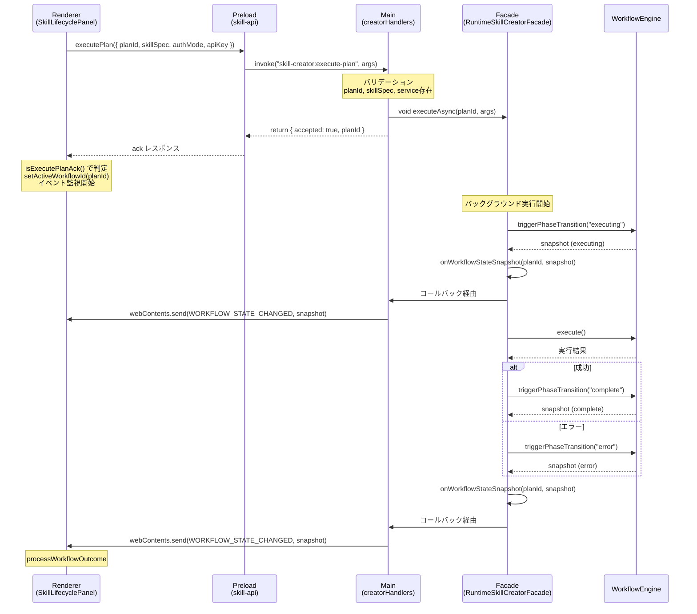

# アーキテクチャ設計書 - TASK-FIX-EP-01

## メタ情報

```yaml
task_id: TASK-FIX-EP-01
formal_task_id: TASK-FIX-EXECUTE-PLAN-FF-001
document_type: アーキテクチャ設計書
created_date: 2026-04-04
```

## シーケンス図



## コンポーネント責務マトリクス

| コンポーネント                           | ファイル                      | 責務                                                            |
| ---------------------------------------- | ----------------------------- | --------------------------------------------------------------- |
| `creatorHandlers.ts`                     | Main IPC ハンドラー           | バリデーション -> fire-and-forget 起動 -> ack 返却              |
| `RuntimeSkillCreatorFacade.executeAsync` | Main サービス                 | バックグラウンド実行 -> phase 遷移 -> snapshot コールバック呼出 |
| `workflowEngine`                         | Main 内部                     | phase 状態管理 -> snapshot 生成                                 |
| `emitWorkflowStateChanged()`             | Main ヘルパー関数             | snapshot -> renderer へ送信（`isDestroyed` チェック付き）       |
| `onWorkflowStateSnapshot`                | Facade コールバックプロパティ | executeAsync から emitWorkflowStateChanged への橋渡し           |
| `SkillLifecyclePanel.handleExecutePlan`  | Renderer コンポーネント       | ack 判定 -> activeWorkflowId 設定 -> イベント監視               |
| `isExecutePlanAck()`                     | Renderer 型ガード             | ack レスポンス (`{ accepted: true, planId }`) の型判定          |

## データフロー

```
[Renderer] -- invoke --> [Main Handler]
                            |
                            +-- validate(args)
                            +-- void executeAsync(planId, args)  // fire-and-forget
                            +-- return { accepted: true, planId } // 即時返却

[Main Background]
  executeAsync
    +-- triggerPhaseTransition("executing")
    +-- execute(planId, args)
    +-- triggerPhaseTransition("complete" | "error")
    +-- onWorkflowStateSnapshot(planId, snapshot)
          |
          +-- emitWorkflowStateChanged(mainWindow, snapshot)
                |
                +-- isDestroyed() チェック
                +-- webContents.send(WORKFLOW_STATE_CHANGED, snapshot)

[Renderer]
  onWorkflowStateChanged listener
    +-- processWorkflowOutcome(snapshot)
```

## エラーハンドリング方針

| 箇所                      | エラー種別              | 対処                                          |
| ------------------------- | ----------------------- | --------------------------------------------- |
| ハンドラー バリデーション | planId/skillSpec 未指定 | `{ success: false, error: "..." }` を同期返却 |
| executeAsync 内部         | Agent SDK エラー等      | catch -> console.error + error snapshot 通知  |
| emitWorkflowStateChanged  | ウィンドウ破棄済み      | `isDestroyed()` で早期 return                 |
| Renderer 側               | ack 以外のレスポンス    | 従来の同期エラーハンドリングにフォールバック  |
