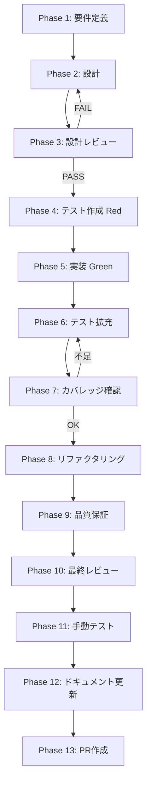

# fix-step5-seq-lifecycle-panel-error - タスク実行仕様書

## ユーザーからの元の指示

SkillLifecyclePanel の `onWorkflowStateChanged` コールバックが `setWorkflowError(null)` を無条件に呼ぶバグを修正し、`currentPhase: 'handoff'` 時にエラーが消去されないようにする

## メタ情報

| 項目         | 内容                                    |
| ------------ | --------------------------------------- |
| タスクID     | TASK-FIX-LIFECYCLE-PANEL-ERROR-001      |
| タスク名     | fix-step5-seq-lifecycle-panel-error     |
| 分類         | バグ修正                                |
| 対象機能     | スキル生成UI エラー表示（Renderer 側）  |
| 優先度       | 高                                      |
| 見積もり規模 | 小規模（2-3 行の条件分岐追加 + テスト） |
| ステータス   | 完了                                    |
| 作成日       | 2026-04-01                              |

## タスク概要

### 目的

`SkillLifecyclePanel.tsx` の `onWorkflowStateChanged` コールバックが `setWorkflowError(null)` を無条件に呼び出すため、`currentPhase: 'handoff'` 状態のスナップショットを受け取った直後にエラーが消去されてしまう問題を修正する。

### 背景

TASK-FIX-EXECUTE-PLAN-FF-001（fix-step3）の完了により、`SKILL_CREATOR_WORKFLOW_STATE_CHANGED` イベントがバックグラウンド処理から随時配信されるようになった。その結果、`currentPhase: 'handoff'` スナップショットが届いた後にも `onWorkflowStateChanged` コールバックが呼ばれ続け、エラー状態が即座にクリアされてしまう問題が顕在化した。

修正箇所は `SkillLifecyclePanel.tsx:539` の 1 行を `if` ブロックで囲む小規模変更であり、インターフェース変更なし・他コンポーネント影響なし。

### 最終ゴール

スキル生成が `currentPhase: 'handoff'` で終了したとき、UI 上のエラーメッセージが消えずに表示されたままになること。

### 成果物一覧

| 成果物                       | パス                                                                                                  | 種別       |
| ---------------------------- | ----------------------------------------------------------------------------------------------------- | ---------- |
| SkillLifecyclePanel.tsx 修正 | `apps/desktop/src/renderer/components/skill/SkillLifecyclePanel.tsx`                                  | コード修正 |
| エラー永続化テスト           | `apps/desktop/src/renderer/components/skill/__tests__/SkillLifecyclePanel.error-persistence.test.tsx` | テスト追加 |

## 参照ファイル

| 参照資料               | パス                                                                           | 内容                              |
| ---------------------- | ------------------------------------------------------------------------------ | --------------------------------- |
| 修正対象コンポーネント | `apps/desktop/src/renderer/components/skill/SkillLifecyclePanel.tsx`           | `onWorkflowStateChanged` バグ箇所 |
| アーキテクチャ仕様     | `.claude/skills/aiworkflow-requirements/references/architecture-overview.md`   | システム全体像                    |
| タスクワークフロー     | `.claude/skills/aiworkflow-requirements/references/task-workflow-completed.md` | 完了タスク記録                    |

## タスク分解サマリー

| Phase | 名称                  | 主な作業                                      |
| ----- | --------------------- | --------------------------------------------- |
| 1     | 要件定義              | P50チェック、インベントリ、受入条件（AC）定義 |
| 2     | 設計                  | 1 concern 変更設計、変更前後コード比較        |
| 3     | 設計レビュー          | AC 充足確認、Phase 4 進行判定                 |
| 4     | テスト作成（TDD Red） | テストファイル 1 本作成（Red 状態）           |
| 5     | 実装                  | 修正ファイル 1 本、テスト Green 化            |
| 6     | テスト拡充            | エッジケース・回帰テスト追加                  |
| 7     | カバレッジ確認        | コールバック全体のカバレッジ目標達成確認      |
| 8     | リファクタリング      | コメント改善、定数化の検討                    |
| 9     | 品質保証              | 全体テスト実行、ESLint、型チェック            |
| 10    | 最終レビュー          | AC-1〜AC-5 充足確認、PR 可否判定              |
| 11    | 手動テスト            | エラー表示の有無による確認（NON_VISUAL）      |
| 12    | ドキュメント更新      | 実装ガイド・仕様書同期                        |
| 13    | PR作成                | ユーザー明示承認後のみ実施                    |

## 実行フロー図

## Phase一覧

| Phase | 名称             | 仕様書                                                         |
| ----- | ---------------- | -------------------------------------------------------------- |
| 1     | 要件定義         | [phase-1-requirements.md](./phase-1-requirements.md)           |
| 2     | 設計             | [phase-2-design.md](./phase-2-design.md)                       |
| 3     | 設計レビュー     | [phase-3-design-review.md](./phase-3-design-review.md)         |
| 4     | テスト作成       | [phase-4-test-creation.md](./phase-4-test-creation.md)         |
| 5     | 実装             | [phase-5-implementation.md](./phase-5-implementation.md)       |
| 6     | テスト拡充       | [phase-6-test-expansion.md](./phase-6-test-expansion.md)       |
| 7     | カバレッジ確認   | [phase-7-coverage-check.md](./phase-7-coverage-check.md)       |
| 8     | リファクタリング | [phase-8-refactoring.md](./phase-8-refactoring.md)             |
| 9     | 品質保証         | [phase-9-quality-assurance.md](./phase-9-quality-assurance.md) |
| 10    | 最終レビュー     | [phase-10-final-review.md](./phase-10-final-review.md)         |
| 11    | 手動テスト       | [phase-11-manual-test.md](./phase-11-manual-test.md)           |
| 12    | ドキュメント更新 | [phase-12-documentation.md](./phase-12-documentation.md)       |
| 13    | PR作成           | [phase-13-pr-creation.md](./phase-13-pr-creation.md)           |

## テストカバレッジ目標

| 対象ファイル                                                       | 行カバレッジ | ブランチカバレッジ | 備考                                          |
| ------------------------------------------------------------------ | ------------ | ------------------ | --------------------------------------------- |
| `SkillLifecyclePanel.tsx`（`onWorkflowStateChanged` コールバック） | 90% 以上     | 90% 以上           | `currentPhase` 条件分岐・`handoffBundle` 処理 |

## 依存関係

### 前提タスク

| タスクID                     | 内容                                                     |
| ---------------------------- | -------------------------------------------------------- |
| TASK-FIX-ENV-STRIPPING       | SDK が動作する状態（`SkillExecutor.ts` env 修正済み）    |
| TASK-FIX-EXECUTE-PLAN-FF-001 | `WORKFLOW_STATE_CHANGED` が fire-and-forget から届く状態 |

### 後続タスク

なし

## Phase完了時の必須アクション

各 Phase 完了時に以下を実施すること:

1. `outputs/phase-N/` に成果物ファイルを配置する
2. 完了条件チェックリストの全項目にチェックを入れる
3. 「タスク100%実行確認【必須】」セクションを確認する
4. 次 Phase へ進む前に成果物の存在を確認する
