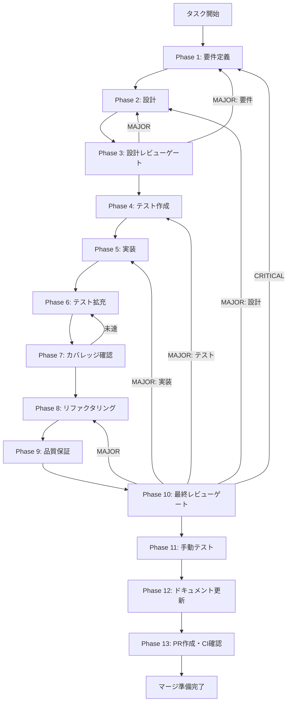

# fix-lifecycle-panel-error - タスク実行仕様書

## ユーザーからの元の指示

```
Issue #1844: SkillLifecyclePanel currentPhase:handoff 時エラー消去バグ修正
onWorkflowStateChanged コールバックが currentPhase:'handoff' 時に setWorkflowError(null) を
無条件呼び出しており、直後に別スナップショットが届くとエラーメッセージが即座に消える問題を修正する。
```

## メタ情報

| 項目         | 内容                                                        |
| ------------ | ----------------------------------------------------------- |
| タスクID     | TASK-FIX-LIFECYCLE-PANEL-ERROR-001                          |
| タスク名     | fix-lifecycle-panel-error                                   |
| 分類         | バグ修正                                                    |
| 対象機能     | スキル生成UI エラー表示（Renderer 側）                      |
| 優先度       | 高                                                          |
| 見積もり規模 | 小規模（1行の条件分岐追加 + テスト追加）                    |
| ステータス   | phase_12_completed                                          |
| 作成日       | 2026-04-02                                                  |
| Issue        | #1844                                                       |
| 依存タスク   | TASK-FIX-EXECUTE-PLAN-FF-001, TASK-NOTIFICATION-SERVICE-001 |

---

## タスク概要

### 目的

スキル生成が `currentPhase: 'handoff'` のスナップショットを受け取ったとき、UI 上のエラーメッセージが消えずに表示されたままになること。

### 背景

`SkillLifecyclePanel.tsx` の `onWorkflowStateChanged` コールバックは、IPC 経由で届くワークフロー状態スナップショットを受け取るたびに `setWorkflowError(null)` を無条件呼び出していた。現在のコードは `currentPhase: 'handoff'` を除外する方向へ寄せているが、仕様書側も current fact に合わせる必要がある。

TASK-FIX-EXECUTE-PLAN-FF-001（step3）の完了により、`SKILL_CREATOR_WORKFLOW_STATE_CHANGED` イベントが fire-and-forget 方式でバックグラウンドから随時配信されるようになる。その結果、`currentPhase: 'handoff'` スナップショットが届いた直後に別のスナップショットが届き、エラー状態がゼロクリアされてしまう問題が発現する。

### 最終ゴール

1. `onWorkflowStateChanged` コールバックが `currentPhase: 'handoff'` 時に `setWorkflowError(null)` を呼ばないようにする
2. エラー永続化のテストを追加し、回帰を防止する

### 成果物一覧

| 種別         | 成果物                              | 配置先                                                                                                |
| ------------ | ----------------------------------- | ----------------------------------------------------------------------------------------------------- |
| コード修正   | SkillLifecyclePanel.tsx 修正（1行） | `apps/desktop/src/renderer/components/skill/SkillLifecyclePanel.tsx`                                  |
| テスト追加   | エラー永続化テスト                  | `apps/desktop/src/renderer/components/skill/__tests__/SkillLifecyclePanel.error-persistence.test.tsx` |
| ドキュメント | Phase 12 成果物一式                 | `docs/30-workflows/completed-tasks/fix-step5-seq-lifecycle-panel-error/outputs/phase-12/`             |
| PR           | GitHub Pull Request                 | GitHub UI                                                                                             |

## 実行方針

| Agent   | 役割             | 実行形態       | 出力                  |
| ------- | ---------------- | -------------- | --------------------- |
| Agent 1 | skill準拠検証    | Agent 2 と並列 | 差分一覧 / 不整合一覧 |
| Agent 2 | 30種の思考法分析 | Agent 1 と並列 | 分析クラスタ / 改善案 |
| Agent 3 | 改善統合         | 1・2 の後続    | パッチ方針 / 破棄判断 |

## 分析原則

- 30種の思考法は Phase 2 の分析で全件適用する
- 変更が最小パッチより再構成の方がエレガントなら、破棄判断を明示してユーザー承認を得る
- 独立タスクは並列、依存タスクは直列で進める

---

## 参照ファイル

本仕様書のコマンド選定は以下を参照：

- `docs/00-requirements/master_system_design.md` - システム要件
- `.claude/skills/aiworkflow-requirements/references/` - システム仕様
- `apps/desktop/src/renderer/components/skill/SkillLifecyclePanel.tsx` - 修正対象ファイル

---

## タスク分解サマリー

| ID     | フェーズ | サブタスク名             | 責務                               | 依存 |
| ------ | -------- | ------------------------ | ---------------------------------- | ---- |
| T-01-1 | Phase 1  | 要件定義・AC定義         | AC-1〜AC-5定義、P50チェック        | -    |
| T-02-1 | Phase 2  | 設計・変更箇所特定       | Before/After比較、1行変更設計確定  | T-01 |
| T-03-1 | Phase 3  | 設計レビューゲート       | AC充足確認、Phase 4進行判定        | T-02 |
| T-04-1 | Phase 4  | テスト作成（TDD Red）    | テストファイル作成、Red状態確認    | T-03 |
| T-05-1 | Phase 5  | 実装・テストGreen化      | 1行条件分岐追加、テストGreen確認   | T-04 |
| T-06-1 | Phase 6  | テスト拡充               | エッジケース・回帰テスト追加       | T-05 |
| T-07-1 | Phase 7  | カバレッジ確認           | onWorkflowStateChanged 90%+確認    | T-06 |
| T-08-1 | Phase 8  | リファクタリング         | コメント改善、定数化検討           | T-07 |
| T-09-1 | Phase 9  | 品質保証                 | 全テスト・ESLint・型チェック実行   | T-08 |
| T-10-1 | Phase 10 | 最終レビューゲート       | AC-1〜AC-5充足確認、PR可否判定     | T-09 |
| T-11-1 | Phase 11 | 手動テスト（NON_VISUAL） | エラー表示有無の自動テスト代替確認 | T-10 |
| T-12-1 | Phase 12 | ドキュメント更新         | 実装ガイド・仕様書同期・6ファイル  | T-11 |
| T-13-1 | Phase 13 | PR作成                   | ユーザー明示承認後のみ実施         | T-12 |

**総サブタスク数**: 13個

---

## 実行フロー図



---

## Phase一覧

| Phase | 名称               | 仕様書                                                       | ステータス |
| ----- | ------------------ | ------------------------------------------------------------ | ---------- |
| 1     | 要件定義           | [phase-1-requirements.md](phase-1-requirements.md)           | 完了       |
| 2     | 設計               | [phase-2-design.md](phase-2-design.md)                       | 完了       |
| 3     | 設計レビューゲート | [phase-3-design-review.md](phase-3-design-review.md)         | 完了       |
| 4     | テスト作成         | [phase-4-test-creation.md](phase-4-test-creation.md)         | 完了       |
| 5     | 実装               | [phase-5-implementation.md](phase-5-implementation.md)       | 完了       |
| 6     | テスト拡充         | [phase-6-test-expansion.md](phase-6-test-expansion.md)       | 完了       |
| 7     | カバレッジ確認     | [phase-7-coverage-check.md](phase-7-coverage-check.md)       | 完了       |
| 8     | リファクタリング   | [phase-8-refactoring.md](phase-8-refactoring.md)             | 完了       |
| 9     | 品質保証           | [phase-9-quality-assurance.md](phase-9-quality-assurance.md) | 完了       |
| 10    | 最終レビューゲート | [phase-10-final-review.md](phase-10-final-review.md)         | 完了       |
| 11    | 手動テスト         | [phase-11-manual-test.md](phase-11-manual-test.md)           | 完了       |
| 12    | ドキュメント更新   | [phase-12-documentation.md](phase-12-documentation.md)       | 完了       |
| 13    | PR作成             | [phase-13-pr-creation.md](phase-13-pr-creation.md)           | 未実施     |

---

## テストカバレッジ目標

| 対象ファイル                                                       | 行カバレッジ | ブランチカバレッジ | 備考                                        |
| ------------------------------------------------------------------ | ------------ | ------------------ | ------------------------------------------- |
| `SkillLifecyclePanel.tsx`（`onWorkflowStateChanged` コールバック） | 90% 以上     | 90% 以上           | `currentPhase` 条件分岐・handoffBundle 処理 |

---

## 統合テスト連携（Phase 1〜11は必須）

| Phase | 統合テスト連携アクション                                                                          |
| ----- | ------------------------------------------------------------------------------------------------- |
| 1     | `SKILL_CREATOR_WORKFLOW_STATE_CHANGED` IPC イベントペイロード構造と `currentPhase` 値を要件に明記 |
| 2     | IPC コールバック設計とモック戦略を設計に反映                                                      |
| 3     | IPC イベント連続配信シナリオのレビューゲートを実施                                                |
| 4     | IPC モックを使ったエラー永続化テストシナリオを作成                                                |
| 5     | React 状態管理の setWorkflowError 動作との接続実装を確認                                          |
| 6     | 複数スナップショット連続配信シナリオのテストを拡充                                                |
| 7     | onWorkflowStateChanged コールバック全体のカバレッジを確認                                         |
| 8     | リファクタ後もテストが継続成功することを確認                                                      |
| 9     | 品質保証でテスト結果を確認                                                                        |
| 10    | 最終レビューでテスト結果を確認                                                                    |
| 11    | NON_VISUAL タスクのため自動テスト代替で確認                                                       |

---

## Phase完了時の必須アクション

**各Phase完了時に以下を必ず実行すること:**

1. **タスク100%実行**: Phase内で指定された全タスクを完全に実行
2. **成果物確認**: 全ての必須成果物が生成されていることを検証
3. **実行記録**: 実行タスクの結果を記録
4. **artifacts.json更新**: Phase完了ステータスを更新
5. **Phase末端の実行確認**: 各タスクを100%実行し、各タスクを完遂した旨を必ず明記

```bash
# Phase完了時の検証コマンド
node .claude/skills/task-specification-creator/scripts/validate-phase-output.js docs/30-workflows/completed-tasks/fix-step5-seq-lifecycle-panel-error --phase {{PHASE_NUMBER}}

# Phase完了・成果物登録
node .claude/skills/task-specification-creator/scripts/complete-phase.js \
  --workflow docs/30-workflows/completed-tasks/fix-step5-seq-lifecycle-panel-error --phase {{PHASE_NUMBER}} --artifacts "..."
```
