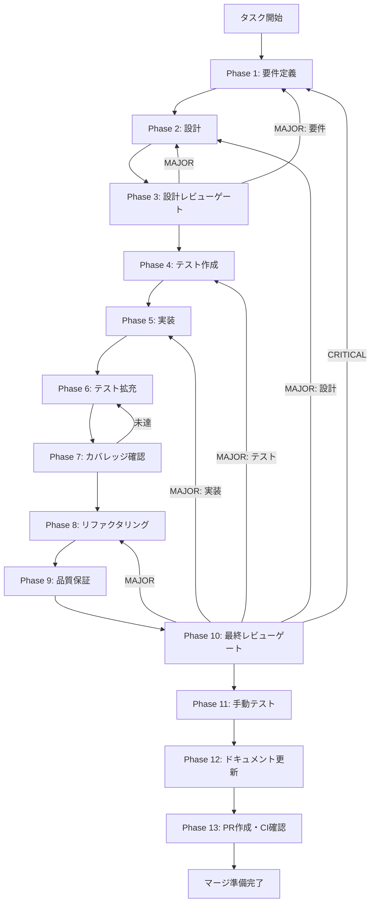

# graphrag-query-integration - タスク実行仕様書

## ユーザーからの元の指示

```
GraphRAGクエリへのコミュニティ要約統合
```

## メタ情報

| 項目         | 内容                        |
| ------------ | --------------------------- |
| タスクID     | CONV-08-04                  |
| タスク名     | graphrag-query-integration  |
| 分類         | 改善                        |
| 対象機能     | RAGパイプライン・クエリ処理 |
| 優先度       | 高                          |
| 見積もり規模 | 中規模                      |
| ステータス   | 未実施                      |
| 作成日       | 2026-01-11                  |
| 発見元       | Phase 12（CONV-08-03）      |

---

## タスク概要

### 目的

GraphRAGのクエリ処理において、コミュニティ要約を活用して回答品質を向上させる。CONV-08-03で実装されたコミュニティ要約生成機能を、実際のクエリ処理フローに統合し、より質の高い回答を生成できるようにする。

### 背景

CONV-08-03でコミュニティ要約生成機能を実装した。この機能により、Knowledge Graph内のコミュニティ（意味的に関連するエンティティのクラスタ）に対して、LLMを使用した要約とセマンティック検索用の埋め込みベクトルが生成されるようになった。

現状では、要約は生成・保存されているが、実際のクエリ処理（GraphRAG Query Handler）ではまだ活用されていない。これにより以下の課題がある：

1. **クエリ応答の品質制限**: コミュニティ要約を活用していないため、広範なトピックに関する質問への回答が限定的
2. **階層的情報の未活用**: コミュニティの階層構造（詳細→概要）が回答生成に活かされていない
3. **セマンティック検索の未統合**: 要約の埋め込みベクトルが検索に使用されていない

### 最終ゴール

1. ユーザーのクエリに対して、関連するコミュニティ要約がセマンティック検索で取得される
2. 取得したコミュニティ要約がLLM回答生成のコンテキストに含まれる
3. 階層レベルに応じた適切な粒度の情報が回答に反映される
4. 検索結果のスコアリング・ランキングが適切に動作する

### 成果物一覧

| 種別         | 成果物                         | 配置先                                           |
| ------------ | ------------------------------ | ------------------------------------------------ |
| 機能         | GraphRAG Query Handler更新     | `packages/shared/src/services/search/`           |
| 機能         | 回答生成プロンプトテンプレート | `packages/shared/src/services/search/prompts/`   |
| テスト       | ユニットテスト・統合テスト     | `packages/shared/src/services/search/__tests__/` |
| ドキュメント | 実装ガイド                     | `outputs/phase-12/implementation-guide.md`       |
| PR           | GitHub Pull Request            | GitHub UI                                        |

---

## 参照ファイル

本仕様書のコマンド選定は以下を参照：

- `.claude/skills/aiworkflow-requirements/references/interfaces-rag-community-summarization.md` - コミュニティ要約インターフェース仕様
- `.claude/skills/aiworkflow-requirements/references/interfaces-rag-community-detection.md` - コミュニティ検出インターフェース仕様
- `.claude/skills/aiworkflow-requirements/references/architecture-rag.md` - RAGアーキテクチャ設計
- `.claude/skills/aiworkflow-requirements/references/interfaces-rag-search.md` - 検索クエリ・結果型定義

---

## タスク分解サマリー

| ID     | フェーズ | サブタスク名                 | 責務                                   | 依存 |
| ------ | -------- | ---------------------------- | -------------------------------------- | ---- |
| T-01-1 | Phase 1  | 要件定義・受け入れ基準策定   | 機能要件・非機能要件の明確化           | -    |
| T-02-1 | Phase 2  | アーキテクチャ設計・詳細設計 | Query Handler統合設計                  | T-01 |
| T-03-1 | Phase 3  | 設計レビューゲート           | 設計妥当性の検証                       | T-02 |
| T-04-1 | Phase 4  | テスト作成（Red）            | 失敗するテストの作成                   | T-03 |
| T-05-1 | Phase 5  | 実装（Green）                | テストを通す実装                       | T-04 |
| T-06-1 | Phase 6  | テスト拡充                   | カバレッジ目標達成のためのテスト追加   | T-05 |
| T-07-1 | Phase 7  | テストカバレッジ確認         | カバレッジ基準の検証                   | T-06 |
| T-08-1 | Phase 8  | リファクタリング（Refactor） | コード品質の改善                       | T-07 |
| T-09-1 | Phase 9  | 品質保証                     | 静的解析・セキュリティ・パフォーマンス | T-08 |
| T-10-1 | Phase 10 | 最終レビューゲート           | 全体品質・整合性検証                   | T-09 |
| T-11-1 | Phase 11 | 手動テスト検証               | UX・実環境動作確認                     | T-10 |
| T-12-1 | Phase 12 | ドキュメント更新             | 実装ガイド・仕様書更新・未タスク検出   | T-11 |
| T-13-1 | Phase 13 | PR作成                       | コミット・PR・CI確認                   | T-12 |

**総サブタスク数**: 13個

---

## 実行フロー図



---

## Phase一覧

| Phase | 名称               | 仕様書                                                 | ステータス |
| ----- | ------------------ | ------------------------------------------------------ | ---------- |
| 1     | 要件定義           | [phase-1-requirements.md](phase-1-requirements.md)     | 未実施     |
| 2     | 設計               | [phase-2-design.md](phase-2-design.md)                 | 未実施     |
| 3     | 設計レビューゲート | [phase-3-design-review.md](phase-3-design-review.md)   | 未実施     |
| 4     | テスト作成         | [phase-4-test-creation.md](phase-4-test-creation.md)   | 未実施     |
| 5     | 実装               | [phase-5-implementation.md](phase-5-implementation.md) | 未実施     |
| 6     | テスト拡充         | [phase-6-test-expansion.md](phase-6-test-expansion.md) | 未実施     |
| 7     | カバレッジ確認     | [phase-7-coverage-check.md](phase-7-coverage-check.md) | 未実施     |
| 8     | リファクタリング   | [phase-8-refactoring.md](phase-8-refactoring.md)       | 未実施     |
| 9     | 品質保証           | [phase-9-quality.md](phase-9-quality.md)               | 未実施     |
| 10    | 最終レビューゲート | [phase-10-final-review.md](phase-10-final-review.md)   | 未実施     |
| 11    | 手動テスト         | [phase-11-manual-test.md](phase-11-manual-test.md)     | 未実施     |
| 12    | ドキュメント更新   | [phase-12-documentation.md](phase-12-documentation.md) | 未実施     |
| 13    | PR作成             | [phase-13-pr-creation.md](phase-13-pr-creation.md)     | 未実施     |

---

## テストカバレッジ目標

### ユニットテスト

| 指標              | 最低基準 | 推奨基準 |
| ----------------- | -------- | -------- |
| Line Coverage     | 80%      | 90%      |
| Branch Coverage   | 60%      | 70%      |
| Function Coverage | 80%      | 90%      |

### 結合テスト

| 指標                         | 目標 |
| ---------------------------- | ---- |
| APIエンドポイント            | 100% |
| モジュール間インターフェース | 100% |
| 正常系シナリオ               | 100% |
| 異常系シナリオ               | 80%+ |
| 外部連携ポイント             | 100% |

---

## 統合テスト連携（Phase 1〜11で必須）

各Phaseで以下の統合テスト連携アクションを実施すること:

| Phase | 統合テスト連携アクション                                   |
| ----- | ---------------------------------------------------------- |
| 1     | 接続要件（ICommunitySummarizer/Query Handler）を要件に明記 |
| 2     | 統合ポイント（searchSummaries API）を設計に反映            |
| 3     | 統合テスト観点のレビューゲートを実施                       |
| 4     | 統合テストシナリオを全カテゴリで作成                       |
| 5     | Query Handler ↔ CommunitySummarizer接続の実装              |
| 6     | 統合テストの拡充（全カテゴリのカバレッジ向上）             |
| 7     | 統合テストの再実行とゲート判定                             |
| 8     | リファクタ後の統合テスト継続成功を確認                     |
| 9     | 品質保証で統合テスト結果を確認                             |
| 10    | 最終レビューで統合テスト結果を確認                         |
| 11    | 手動統合テスト（クエリ→コミュニティ要約→回答）を確認       |

---

## Phase完了時の必須アクション

**各Phase完了時に以下を必ず実行すること:**

1. **タスク100%実行**: Phase内で指定された全タスクを完全に実行
2. **成果物確認**: 全ての必須成果物が生成されていることを検証
3. **実行記録**: 実行タスクの結果を記録
4. **artifacts.json更新**: Phase完了ステータスを更新
5. **Phase末端の実行確認**: 各タスクを100%実行し、各タスクを完遂した旨を必ず明記

```bash
# Phase完了時の検証コマンド
node .claude/skills/task-specification-creator/scripts/validate-phase-output.mjs docs/30-workflows/graphrag-query-integration --phase ${PHASE_NUMBER}

# Phase完了・成果物登録
node .claude/skills/task-specification-creator/scripts/complete-phase.mjs \
  --workflow docs/30-workflows/graphrag-query-integration --phase ${PHASE_NUMBER} --artifacts "..."
```

---

## 関連タスク

### 前提タスク

| タスクID   | タスク名               | 状態 |
| ---------- | ---------------------- | ---- |
| CONV-08-02 | Leidenコミュニティ検出 | 完了 |
| CONV-08-03 | コミュニティ要約生成   | 完了 |

### 後続タスク

| タスクID   | タスク名                     | 状態   |
| ---------- | ---------------------------- | ------ |
| CONV-08-05 | コミュニティ可視化UI（予定） | 未実施 |

---

## 変更履歴

| 日付       | バージョン | 変更内容 |
| ---------- | ---------- | -------- |
| 2026-01-11 | 1.0.0      | 初版作成 |
