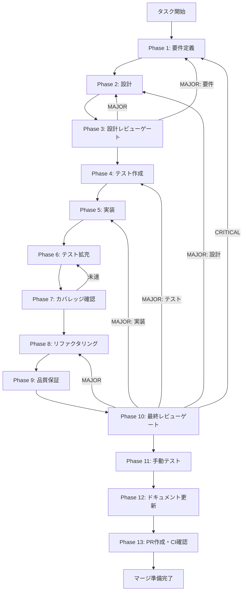

# history-ipc-handlers - タスク実行仕様書

## ユーザーからの元の指示

```
IPCハンドラーの登録実装

レンダラープロセスからのIPC呼び出しを処理するために、メインプロセスでハンドラーを登録する。
CONV-05-02で実装したHistoryServiceを呼び出し、結果をレンダラーに返却する橋渡し役となる。
```

## メタ情報

| 項目         | 内容                       |
| ------------ | -------------------------- |
| タスクID     | task-req-history-ipc-001   |
| タスク名     | history-ipc-handlers       |
| 分類         | 要件                       |
| 対象機能     | 履歴/ログ表示UI            |
| 優先度       | 高                         |
| 見積もり規模 | 小規模（S）                |
| ステータス   | 未実施                     |
| 作成日       | 2026-01-11                 |
| 発見元       | Phase 11（手動テスト検証） |

---

## タスク概要

### 目的

メインプロセスに4つのIPCハンドラーを登録し、HistoryServiceと連携させる。レンダラープロセスからのIPC呼び出しを適切に処理し、Result型で統一された形式で結果を返却する。

### 背景

履歴/ログ表示UIを実現するために、フロントエンド（レンダラープロセス）からバックエンド（メインプロセス）への通信が必要となる。Electronのセキュリティベストプラクティスに従い、contextBridgeを通じて限定的なAPIのみを公開し、IPCハンドラーで安全にデータを取得・操作する。

### 最終ゴール

すべてのIPC呼び出しが正常に処理され、以下の4つの機能が動作すること:

1. 履歴一覧の取得（history:getFileHistory）
2. バージョン詳細の取得（history:getVersionDetail）
3. 変換ログの取得（history:getConversionLogs）
4. バージョン復元（history:restoreVersion）

### 成果物一覧

| 種別         | 成果物                  | 配置先                                 |
| ------------ | ----------------------- | -------------------------------------- |
| 機能         | historyHandlers.ts      | `apps/desktop/src/main/ipc/`           |
| 機能         | main.ts更新             | `apps/desktop/src/main/main.ts`        |
| テスト       | historyHandlers.test.ts | `apps/desktop/src/main/ipc/__tests__/` |
| ドキュメント | 各Phase出力             | `outputs/phase-*/`                     |
| PR           | GitHub Pull Request     | GitHub UI                              |

---

## 参照ファイル

本仕様書のコマンド選定は以下を参照:

- `.claude/skills/aiworkflow-requirements/references/ui-ux-history-panel.md` - 履歴/ログ表示UI仕様
- `.claude/skills/aiworkflow-requirements/references/security-api-electron.md` - Electronセキュリティ
- `.claude/skills/aiworkflow-requirements/references/architecture-patterns.md` - アーキテクチャパターン

---

## タスク分解サマリー

| ID     | フェーズ | サブタスク名       | 責務                           | 依存 |
| ------ | -------- | ------------------ | ------------------------------ | ---- |
| T-01-1 | Phase 1  | 要件分析・仕様確認 | IPC要件・仕様を確認            | -    |
| T-02-1 | Phase 2  | IPCハンドラー設計  | チャンネル設計・Result型定義   | T-01 |
| T-03-1 | Phase 3  | 設計レビュー       | 設計の妥当性検証               | T-02 |
| T-04-1 | Phase 4  | テストケース作成   | ユニットテスト・統合テスト作成 | T-03 |
| T-05-1 | Phase 5  | IPCハンドラー実装  | 4つのハンドラー実装            | T-04 |
| T-06-1 | Phase 6  | テスト拡充         | エッジケース・異常系テスト追加 | T-05 |
| T-07-1 | Phase 7  | カバレッジ確認     | カバレッジ基準達成確認         | T-06 |
| T-08-1 | Phase 8  | リファクタリング   | コード品質改善                 | T-07 |
| T-09-1 | Phase 9  | 品質保証           | 静的解析・セキュリティ確認     | T-08 |
| T-10-1 | Phase 10 | 最終レビュー       | 全体品質・整合性検証           | T-09 |
| T-11-1 | Phase 11 | 手動テスト         | UI/IPC接続の動作確認           | T-10 |
| T-12-1 | Phase 12 | ドキュメント更新   | 実装ガイド・仕様更新           | T-11 |
| T-13-1 | Phase 13 | PR作成             | コミット・PR・CI確認           | T-12 |

**総サブタスク数**: 13個

---

## 実行フロー図



---

## Phase一覧

| Phase | 名称               | 仕様書                                                 | ステータス |
| ----- | ------------------ | ------------------------------------------------------ | ---------- |
| 1     | 要件定義           | [phase-1-requirements.md](phase-1-requirements.md)     | 未実施     |
| 2     | 設計               | [phase-2-design.md](phase-2-design.md)                 | 未実施     |
| 3     | 設計レビューゲート | [phase-3-design-review.md](phase-3-design-review.md)   | 未実施     |
| 4     | テスト作成         | [phase-4-test-creation.md](phase-4-test-creation.md)   | 未実施     |
| 5     | 実装               | [phase-5-implementation.md](phase-5-implementation.md) | 未実施     |
| 6     | テスト拡充         | [phase-6-test-expansion.md](phase-6-test-expansion.md) | 未実施     |
| 7     | カバレッジ確認     | [phase-7-coverage-check.md](phase-7-coverage-check.md) | 未実施     |
| 8     | リファクタリング   | [phase-8-refactoring.md](phase-8-refactoring.md)       | 未実施     |
| 9     | 品質保証           | [phase-9-quality.md](phase-9-quality.md)               | 未実施     |
| 10    | 最終レビューゲート | [phase-10-final-review.md](phase-10-final-review.md)   | 未実施     |
| 11    | 手動テスト         | [phase-11-manual-test.md](phase-11-manual-test.md)     | 未実施     |
| 12    | ドキュメント更新   | [phase-12-documentation.md](phase-12-documentation.md) | 未実施     |
| 13    | PR作成             | [phase-13-pr-creation.md](phase-13-pr-creation.md)     | 未実施     |

---

## テストカバレッジ目標

### ユニットテスト

| 指標              | 最低基準 | 推奨基準 |
| ----------------- | -------- | -------- |
| Line Coverage     | 80%      | 90%      |
| Branch Coverage   | 60%      | 70%      |
| Function Coverage | 80%      | 90%      |

### 結合テスト

| 指標                         | 目標 |
| ---------------------------- | ---- |
| APIエンドポイント            | 100% |
| モジュール間インターフェース | 100% |
| 正常系シナリオ               | 100% |
| 異常系シナリオ               | 80%+ |
| 外部連携ポイント             | 100% |

---

## 統合テスト連携（Phase 1〜11で必須）

各Phaseで以下の統合テスト連携アクションを実施すること:

| Phase | 統合テスト連携アクション                                  |
| ----- | --------------------------------------------------------- |
| 1     | IPC通信要件（チャンネル名/データフロー）を要件に明記      |
| 2     | IPC契約（チャンネル・パラメータ・戻り値型）を設計に反映   |
| 3     | IPC統合テスト観点のレビューゲートを実施                   |
| 4     | IPC統合テストシナリオを作成（正常系/異常系/タイムアウト） |
| 5     | IPCハンドラー実装とHistoryService接続                     |
| 6     | IPC統合テストの拡充（エラーハンドリング・境界値）         |
| 7     | IPC統合テストの再実行とカバレッジ確認                     |
| 8     | リファクタ後のIPC統合テスト継続成功を確認                 |
| 9     | 品質保証でIPC統合テスト結果を確認                         |
| 10    | 最終レビューでIPC統合テスト結果を確認                     |
| 11    | 手動IPC統合テスト（UI→IPC→HistoryService→DB）を確認       |

---

## Phase完了時の必須アクション

**各Phase完了時に以下を必ず実行すること:**

1. **タスク100%実行**: Phase内で指定された全タスクを完全に実行
2. **成果物確認**: 全ての必須成果物が生成されていることを検証
3. **実行記録**: 実行タスクの結果を記録
4. **artifacts.json更新**: Phase完了ステータスを更新
5. **Phase末端の実行確認**: 各タスクを100%実行し、各タスクを完遂した旨を必ず明記

```bash
# Phase完了時の検証コマンド
node .claude/skills/task-specification-creator/scripts/validate-phase-output.mjs docs/30-workflows/history-ipc-handlers --phase {{PHASE_NUMBER}}

# Phase完了・成果物登録
node .claude/skills/task-specification-creator/scripts/complete-phase.mjs \
  --workflow docs/30-workflows/history-ipc-handlers --phase {{PHASE_NUMBER}} --artifacts "..."
```

---

## 依存関係

### 前提条件

| タスク/機能 | 説明                  | ステータス |
| ----------- | --------------------- | ---------- |
| CONV-05-02  | HistoryService実装    | 完了       |
| preload設定 | preloadスクリプト更新 | 同時実施   |

### 関連タスク

| タスク                           | 関係     | パス                                                        |
| -------------------------------- | -------- | ----------------------------------------------------------- |
| task-req-history-integration-001 | 親タスク | `docs/30-workflows/unassigned-task/`                        |
| task-req-history-preload-001     | 同時実施 | `docs/30-workflows/unassigned-task/task-history-preload.md` |

---

## IPCチャンネル一覧

| チャンネル                  | メソッド          | 引数                   | 戻り値                         |
| --------------------------- | ----------------- | ---------------------- | ------------------------------ |
| `history:getFileHistory`    | getFileHistory    | fileId, options?       | `Result<PaginatedResult<...>>` |
| `history:getVersionDetail`  | getVersionDetail  | conversionId           | `Result<VersionDetailData>`    |
| `history:getConversionLogs` | getConversionLogs | conversionId, options? | `Result<PaginatedResult<...>>` |
| `history:restoreVersion`    | restoreVersion    | fileId, conversionId   | `Result<VersionHistoryItem>`   |

---

## 変更履歴

| Version | Date       | Changes                             |
| ------- | ---------- | ----------------------------------- |
| 1.0.0   | 2026-01-11 | 初版作成（Phase 1〜13形式で再構成） |
