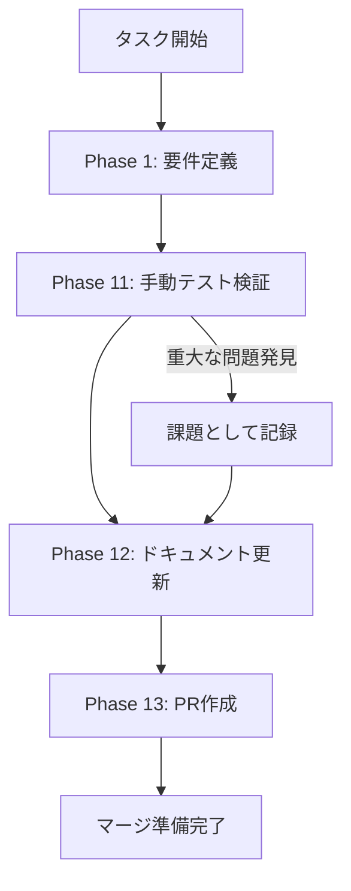

# history-manual-testing - タスク実行仕様書

## ユーザーからの元の指示

```
統合後の手動テスト実施 - 履歴/ログ表示UI
```

## メタ情報

| 項目         | 内容                             |
| ------------ | -------------------------------- |
| タスクID     | task-req-history-manual-test-001 |
| タスク名     | history-manual-testing           |
| 分類         | 要件（手動テスト検証）           |
| 対象機能     | 履歴/ログ表示UI                  |
| 優先度       | 中                               |
| 見積もり規模 | 小規模（S）                      |
| ステータス   | 未実施                           |
| 作成日       | 2026-01-16                       |
| 発見元       | Phase 11（手動テスト検証）       |
| 発見日       | 2026-01-10                       |

---

## タスク概要

### 目的

履歴UIコンポーネントの統合（task-req-history-integration-001, task-req-history-preload-001, task-req-history-ipc-001）が完了した後、実際のアプリケーション環境での動作確認を行い、単体テストでは検証できない実環境特有の問題を発見する。

### 背景

- 履歴UIコンポーネントの統合が完了している
- 統合後の動作が未検証の状態
- 実環境特有のバグが潜在している可能性がある
- ユーザー体験（UX）の問題が発見されていない

### 最終ゴール

- すべての機能が正常に動作することを確認
- エラーハンドリングが適切に機能することを確認
- アクセシビリティ要件（WCAG 2.1 AA準拠）を満たしていることを確認
- テスト結果レポートが作成されている

### 成果物一覧

| 種別         | 成果物               | 配置先                                         |
| ------------ | -------------------- | ---------------------------------------------- |
| ドキュメント | テスト結果レポート   | `outputs/phase-11/manual-test-result.md`       |
| ドキュメント | 発見課題リスト       | `outputs/phase-11/discovered-issues.md`        |
| ドキュメント | 実装ガイド           | `outputs/phase-12/implementation-guide.md`     |
| ドキュメント | ドキュメント更新履歴 | `outputs/phase-12/documentation-update-log.md` |
| ドキュメント | 未タスク検出レポート | `outputs/phase-12/unassigned-task-report.md`   |

---

## 参照ファイル

本仕様書の実行は以下を参照：

- `.claude/skills/aiworkflow-requirements/references/ui-ux-history-panel.md` - 履歴/ログ表示UI仕様
- `.claude/skills/aiworkflow-requirements/references/ui-ux-advanced.md` - アクセシビリティ要件
- `docs/30-workflows/history-ui-components/outputs/phase-12/implementation-guide.md` - 実装ガイド
- `docs/30-workflows/history-ui-components/outputs/phase-12/integration-guide.md` - 統合ガイド

---

## タスク分解サマリー

| ID     | フェーズ | サブタスク名             | 責務                      | 依存   |
| ------ | -------- | ------------------------ | ------------------------- | ------ |
| T-01-1 | Phase 1  | テスト要件整理           | テスト対象・範囲の確認    | -      |
| T-11-1 | Phase 11 | 環境準備                 | テスト環境セットアップ    | T-01   |
| T-11-2 | Phase 11 | 機能テスト実施           | 正常系テスト実行          | T-11-1 |
| T-11-3 | Phase 11 | エラーハンドリングテスト | 異常系テスト実行          | T-11-2 |
| T-11-4 | Phase 11 | アクセシビリティテスト   | WCAG準拠確認              | T-11-3 |
| T-11-5 | Phase 11 | テスト結果記録           | 結果のドキュメント化      | T-11-4 |
| T-12-1 | Phase 12 | 実装ガイド作成           | 概念的+技術的ドキュメント | T-11   |
| T-12-2 | Phase 12 | 未タスク検出             | 残課題の検出と記録        | T-12-1 |
| T-13-1 | Phase 13 | PR作成準備               | 変更サマリー・許可確認    | T-12   |

**総サブタスク数**: 9個

---

## 実行フロー図



---

## Phase一覧

| Phase | 名称             | 仕様書                                                 | ステータス |
| ----- | ---------------- | ------------------------------------------------------ | ---------- |
| 1     | 要件定義         | [phase-1-requirements.md](phase-1-requirements.md)     | 未実施     |
| 11    | 手動テスト検証   | [phase-11-manual-test.md](phase-11-manual-test.md)     | 未実施     |
| 12    | ドキュメント更新 | [phase-12-documentation.md](phase-12-documentation.md) | 未実施     |
| 13    | PR作成           | [phase-13-pr-creation.md](phase-13-pr-creation.md)     | 未実施     |

**注記**: このタスクは手動テスト専用タスクのため、Phase 2-10（設計・実装・品質保証）はスキップします。

---

## 前提条件

以下のタスクが完了していることが前提：

| タスク                           | 説明          | ステータス |
| -------------------------------- | ------------- | ---------- |
| task-req-history-integration-001 | UI統合        | 完了       |
| task-req-history-preload-001     | preload設定   | 完了       |
| task-req-history-ipc-001         | IPCハンドラー | 完了       |
| history-service-db-integration   | DB統合        | 完了       |

---

## テストカテゴリ

### 機能テスト

| TC-ID  | 機能             | 操作                       | 期待結果                   |
| ------ | ---------------- | -------------------------- | -------------------------- |
| TC-001 | 履歴一覧表示     | 履歴ページに遷移           | 履歴一覧が表示される       |
| TC-002 | ローディング表示 | 履歴ページに遷移（初回）   | スケルトンが表示される     |
| TC-003 | 空状態表示       | 履歴のないファイルを選択   | 「履歴がありません」が表示 |
| TC-004 | バージョン選択   | 履歴アイテムをクリック     | 詳細パネルが表示される     |
| TC-005 | 詳細表示         | バージョンを選択           | バージョン情報が表示される |
| TC-006 | ログ表示         | 詳細パネルでログを確認     | 変換ログが表示される       |
| TC-007 | ログフィルタ     | ログレベルを変更           | フィルタ結果が表示される   |
| TC-008 | 追加読み込み     | 「もっと見る」をクリック   | 追加データが読み込まれる   |
| TC-009 | 復元ダイアログ   | 復元ボタンをクリック       | 確認ダイアログが表示される |
| TC-010 | 復元実行         | ダイアログで確認をクリック | バージョンが復元される     |
| TC-011 | 復元キャンセル   | ダイアログでキャンセル     | ダイアログが閉じる         |

### エラーハンドリングテスト

| TC-ID  | 状況               | 操作                 | 期待結果                 |
| ------ | ------------------ | -------------------- | ------------------------ |
| TC-101 | API利用不可        | historyAPIを無効化   | エラーメッセージが表示   |
| TC-102 | ネットワークエラー | メインプロセスを停止 | 再試行ボタンが表示       |
| TC-103 | データなし         | 存在しないIDを指定   | NotFoundエラーが表示     |
| TC-104 | 復元失敗           | 復元中にエラー発生   | ダイアログにエラーが表示 |

### アクセシビリティテスト

| TC-ID  | 要件                     | 操作                | 期待結果                     |
| ------ | ------------------------ | ------------------- | ---------------------------- |
| TC-201 | キーボードナビゲーション | Tab/Enter/Escで操作 | すべての機能にアクセス可能   |
| TC-202 | スクリーンリーダー       | VoiceOverで読み上げ | 適切なラベルが読み上げられる |
| TC-203 | フォーカス管理           | ダイアログを開閉    | フォーカスが適切に移動       |
| TC-204 | ARIA属性                 | DevToolsで確認      | role/aria属性が正しい        |

---

## Phase完了時の必須アクション

**各Phase完了時に以下を必ず実行すること:**

1. **タスク100%実行**: Phase内で指定された全タスクを完全に実行
2. **成果物確認**: 全ての必須成果物が生成されていることを検証
3. **実行記録**: 実行タスクの結果を記録
4. **artifacts.json更新**: Phase完了ステータスを更新
5. **Phase末端の実行確認**: 各タスクを100%実行し、各タスクを完遂した旨を必ず明記

```bash
# Phase完了時の検証コマンド
node .claude/skills/task-specification-creator/scripts/validate-phase-output.mjs docs/30-workflows/history-manual-testing --phase {{PHASE_NUMBER}}

# Phase完了・成果物登録
node .claude/skills/task-specification-creator/scripts/complete-phase.mjs \
  --workflow docs/30-workflows/history-manual-testing --phase {{PHASE_NUMBER}} --artifacts "..."
```

---

## 使用方法

1. Phase 1から順番に実行
2. 各Phaseの仕様書に従ってタスクを実行
3. 成果物を指定の配置先に出力
4. Phase完了時にartifacts.jsonを更新
5. 全Phase完了後、PR作成

---

## 出力ファイル構成

```
docs/30-workflows/history-manual-testing/
├── index.md                      # メインタスク仕様書
├── artifacts.json                # 成果物管理JSON
├── phase-1-requirements.md       # Phase 1: 要件定義
├── phase-11-manual-test.md       # Phase 11: 手動テスト検証
├── phase-12-documentation.md     # Phase 12: ドキュメント更新
├── phase-13-pr-creation.md       # Phase 13: PR作成
└── outputs/                      # 各Phase出力ディレクトリ
    ├── phase-1/
    ├── phase-11/
    ├── phase-12/
    └── phase-13/
```
