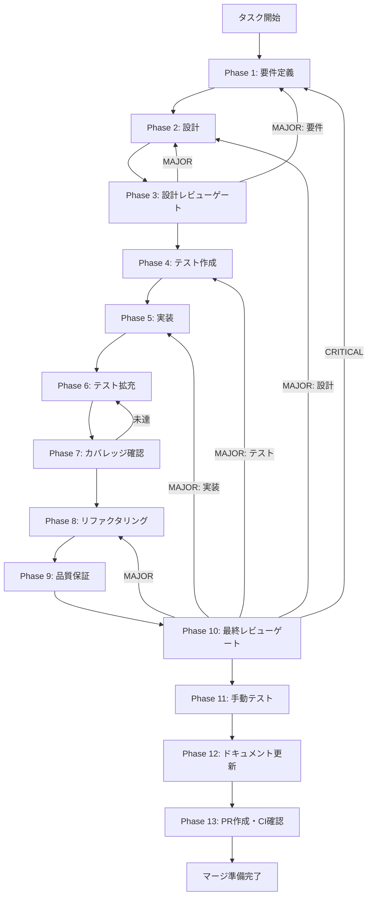

# history-preload-setup - タスク実行仕様書

## ユーザーからの元の指示

```
preloadスクリプトへのhistoryAPI追加 - ElectronアプリケーションでcontextIsolation有効下で
レンダラープロセスからメインプロセスのAPIにアクセスするため、preloadスクリプトで
historyAPIをwindowオブジェクトに公開する。
```

## メタ情報

| 項目         | 内容                         |
| ------------ | ---------------------------- |
| タスクID     | task-req-history-preload-001 |
| タスク名     | history-preload-setup        |
| 分類         | 要件                         |
| 対象機能     | 履歴/ログ表示UI              |
| 優先度       | 高                           |
| 見積もり規模 | 小規模（S）                  |
| ステータス   | 未実施                       |
| 作成日       | 2026-01-12                   |
| 発見元       | Phase 11（手動テスト検証）   |
| 発見日       | 2026-01-10                   |

---

## タスク概要

### 目的

ElectronアプリケーションでcontextIsolationが有効な環境において、レンダラープロセスからメインプロセスの履歴関連APIにアクセスできるようにするため、preloadスクリプトでhistoryAPIをwindowオブジェクトに公開する。

### 背景

CONV-05-03で開発した履歴UIコンポーネントは`window.historyAPI`を通じてIPC通信を行う設計だが、現在このAPIはpreloadスクリプトで公開されていない。ElectronアプリケーションではセキュリティのためcontextIsolationが有効になっており、レンダラープロセスからメインプロセスのAPIに直接アクセスできないため、contextBridgeを使用してAPIを公開する必要がある。

### 最終ゴール

`window.historyAPI`が利用可能になり、以下の4メソッドが呼び出せる状態を達成する：

- `getFileHistory`: ファイルの履歴一覧を取得
- `getVersionDetail`: 特定バージョンの詳細を取得
- `getConversionLogs`: 変換ログを取得
- `restoreVersion`: 特定バージョンを復元

### 成果物一覧

| 種別         | 成果物              | 配置先                                  |
| ------------ | ------------------- | --------------------------------------- |
| 機能         | preload.ts更新      | `apps/desktop/src/main/preload.ts`      |
| 型定義       | global.d.ts         | `apps/desktop/src/renderer/global.d.ts` |
| テスト       | preload.test.ts     | `apps/desktop/src/main/__tests__/`      |
| ドキュメント | Phase別成果物       | `outputs/phase-*/`                      |
| PR           | GitHub Pull Request | GitHub UI                               |

---

## 参照ファイル

本仕様書のコマンド選定は以下を参照：

- `docs/00-requirements/master_system_design.md` - システム要件
- `.claude/skills/aiworkflow-requirements/references/` - システム仕様

### システム仕様（aiworkflow-requirements）

> 実装前に必ず以下のシステム仕様を確認し、既存設計との整合性を確保してください。

| 参照資料                  | パス                                                                         | 内容                               |
| ------------------------- | ---------------------------------------------------------------------------- | ---------------------------------- |
| 履歴/ログ表示UI仕様       | `.claude/skills/aiworkflow-requirements/references/ui-ux-history-panel.md`   | HistoryAPI仕様・IPCチャンネル名    |
| APIセキュリティ・Electron | `.claude/skills/aiworkflow-requirements/references/security-api-electron.md` | contextBridge・IPC通信セキュリティ |

**仕様検索**: `node .claude/skills/aiworkflow-requirements/scripts/search-spec.mjs "historyAPI"`

---

## タスク分解サマリー

| ID     | フェーズ | サブタスク名     | 責務                               | 依存 |
| ------ | -------- | ---------------- | ---------------------------------- | ---- |
| T-01-1 | Phase 1  | 要件抽出         | APIメソッド・IPCチャンネル要件抽出 | -    |
| T-02-1 | Phase 2  | preload設計      | contextBridge公開設計              | T-01 |
| T-03-1 | Phase 3  | 設計レビュー     | セキュリティ観点のレビュー         | T-02 |
| T-04-1 | Phase 4  | テスト作成       | preload API存在確認テスト          | T-03 |
| T-05-1 | Phase 5  | 実装             | preload.ts・global.d.ts実装        | T-04 |
| T-06-1 | Phase 6  | テスト拡充       | カバレッジ向上                     | T-05 |
| T-07-1 | Phase 7  | カバレッジ確認   | 基準達成確認                       | T-06 |
| T-08-1 | Phase 8  | リファクタリング | コード品質改善                     | T-07 |
| T-09-1 | Phase 9  | 品質保証         | Lint・型チェック・セキュリティ     | T-08 |
| T-10-1 | Phase 10 | 最終レビュー     | 全体品質確認                       | T-09 |
| T-11-1 | Phase 11 | 手動テスト       | DevToolsでのAPI確認                | T-10 |
| T-12-1 | Phase 12 | ドキュメント更新 | 実装ガイド・仕様更新               | T-11 |
| T-13-1 | Phase 13 | PR作成           | コミット・PR・CI確認               | T-12 |

**総サブタスク数**: 13個

---

## 実行フロー図



---

## Phase一覧

| Phase | 名称               | 仕様書                                                 | ステータス |
| ----- | ------------------ | ------------------------------------------------------ | ---------- |
| 1     | 要件定義           | [phase-1-requirements.md](phase-1-requirements.md)     | 未実施     |
| 2     | 設計               | [phase-2-design.md](phase-2-design.md)                 | 未実施     |
| 3     | 設計レビューゲート | [phase-3-design-review.md](phase-3-design-review.md)   | 未実施     |
| 4     | テスト作成         | [phase-4-test-creation.md](phase-4-test-creation.md)   | 未実施     |
| 5     | 実装               | [phase-5-implementation.md](phase-5-implementation.md) | 未実施     |
| 6     | テスト拡充         | [phase-6-test-expansion.md](phase-6-test-expansion.md) | 未実施     |
| 7     | カバレッジ確認     | [phase-7-coverage-check.md](phase-7-coverage-check.md) | 未実施     |
| 8     | リファクタリング   | [phase-8-refactoring.md](phase-8-refactoring.md)       | 未実施     |
| 9     | 品質保証           | [phase-9-quality.md](phase-9-quality.md)               | 未実施     |
| 10    | 最終レビューゲート | [phase-10-final-review.md](phase-10-final-review.md)   | 未実施     |
| 11    | 手動テスト         | [phase-11-manual-test.md](phase-11-manual-test.md)     | 未実施     |
| 12    | ドキュメント更新   | [phase-12-documentation.md](phase-12-documentation.md) | 未実施     |
| 13    | PR作成             | [phase-13-pr-creation.md](phase-13-pr-creation.md)     | 未実施     |

---

## テストカバレッジ目標

### ユニットテスト

| 指標              | 最低基準 | 推奨基準 |
| ----------------- | -------- | -------- |
| Line Coverage     | 80%      | 90%      |
| Branch Coverage   | 60%      | 70%      |
| Function Coverage | 80%      | 90%      |

### 結合テスト

| 指標                         | 目標 |
| ---------------------------- | ---- |
| APIエンドポイント            | 100% |
| モジュール間インターフェース | 100% |
| 正常系シナリオ               | 100% |
| 異常系シナリオ               | 80%+ |
| 外部連携ポイント             | 100% |

---

## 統合テスト連携（Phase 1〜11で必須）

各Phaseで以下の統合テスト連携アクションを実施すること:

| Phase | 統合テスト連携アクション                                   |
| ----- | ---------------------------------------------------------- |
| 1     | IPC接続要件（チャンネル名・型定義）を要件に明記            |
| 2     | contextBridge API公開設計を設計に反映                      |
| 3     | セキュリティ観点（contextIsolation）のレビューゲートを実施 |
| 4     | preload API存在確認テストシナリオを作成                    |
| 5     | preload.ts・global.d.ts実装とDevToolsでの疎通確認          |
| 6     | API呼び出しテスト・型チェックテストの拡充                  |
| 7     | カバレッジ基準達成確認                                     |
| 8     | リファクタ後のテスト継続成功を確認                         |
| 9     | 品質保証（Lint・型チェック・セキュリティ）確認             |
| 10    | 最終レビューでAPI公開状態を確認                            |
| 11    | DevToolsでwindow.historyAPIの手動確認                      |

---

## Phase完了時の必須アクション

**各Phase完了時に以下を必ず実行すること:**

1. **タスク100%実行**: Phase内で指定された全タスクを完全に実行
2. **成果物確認**: 全ての必須成果物が生成されていることを検証
3. **実行記録**: 実行タスクの結果を記録
4. **artifacts.json更新**: Phase完了ステータスを更新
5. **Phase末端の実行確認**: 各タスクを100%実行し、各タスクを完遂した旨を必ず明記

```bash
# Phase完了時の検証コマンド
node .claude/skills/task-specification-creator/scripts/validate-phase-output.mjs docs/30-workflows/history-preload-setup --phase {{PHASE_NUMBER}}

# Phase完了・成果物登録
node .claude/skills/task-specification-creator/scripts/complete-phase.mjs \
  --workflow docs/30-workflows/history-preload-setup --phase {{PHASE_NUMBER}} --artifacts "..."
```

---

## 依存タスク

| タスク                           | 説明                   | 関係     | ステータス |
| -------------------------------- | ---------------------- | -------- | ---------- |
| task-req-history-integration-001 | 統合タスク（親タスク） | 親タスク | 完了       |
| task-req-history-ipc-001         | IPCハンドラー登録      | 前提     | 完了       |
| history-service-db-integration   | DB統合                 | 前提     | 完了       |

---

## リスクと対策

| リスク               | 影響度 | 発生確率 | 対策                        |
| -------------------- | ------ | -------- | --------------------------- |
| APIが公開されない    | 高     | 中       | webPreferences設定を確認    |
| 型定義の不一致       | 中     | 中       | types.tsとの整合性を確認    |
| チャンネル名の不一致 | 高     | 低       | IPCハンドラーと同一名を使用 |
| セキュリティ違反     | 高     | 低       | contextIsolation有効を維持  |

---

## 変更履歴

| Version | Date       | Changes  |
| ------- | ---------- | -------- |
| 1.0.0   | 2026-01-12 | 初版作成 |
