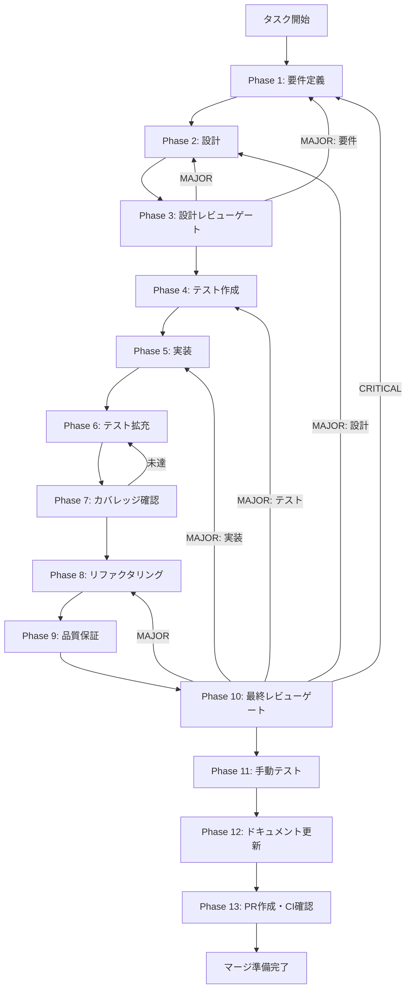

# history-service-db-integration - タスク実行仕様書

## ユーザーからの元の指示

```
HistoryServiceのスタブ実装をCONV-05-02で実装されたデータベースサービスと統合し、
実際の履歴データを取得・表示できるようにする。
```

## メタ情報

| 項目         | 内容                            |
| ------------ | ------------------------------- |
| タスクID     | history-service-db-integration  |
| タスク名     | HistoryService データベース統合 |
| 分類         | 改善                            |
| 対象機能     | 履歴/ログ表示UI                 |
| 優先度       | 高                              |
| 見積もり規模 | 中規模                          |
| ステータス   | 未実施                          |
| 作成日       | 2026-01-12                      |
| 発見元       | Phase 12（未タスク検出）        |
| 依存タスク   | CONV-05-02（履歴取得サービス）  |

---

## タスク概要

### 目的

ElectronアプリのHistoryService（`apps/desktop/src/main/services/HistoryService.ts`）をCONV-05-02で実装されたsharedパッケージのHistoryService（`packages/shared/src/services/history/history-service.ts`）と統合し、実際のデータベースから履歴データを取得できるようにする。

### 背景

履歴UIコンポーネント統合タスク（history-ui-integration）において、UIコンポーネントとIPCハンドラーの統合は完了したが、HistoryServiceはスタブ実装のままである。現在のHistoryServiceは空のデータを返すダミー実装となっており、実際のデータベースとは接続されていない。

**現在のスタブ実装の問題点：**

1. `getFileHistory`: 常に `{ items: [], total: 0, hasMore: false }` を返す
2. `getVersionDetail`: 常に空のダミーデータを返す
3. `getConversionLogs`: 常に空配列を返す
4. `restoreVersion`: 復元処理が実装されていない
5. 5つのTODOコメントが残存

### 最終ゴール

1. 履歴UIで実際のファイル履歴データが表示される
2. バージョン詳細が正しく取得・表示される
3. 変換ログがフィルタリング可能な状態で表示される
4. バージョン復元機能が正常に動作する
5. DEFERRED項目（MT-06, IT-03）がVERIFIED状態になる

### 成果物一覧

| 種別         | 成果物                             | 配置先                                             |
| ------------ | ---------------------------------- | -------------------------------------------------- |
| 機能         | HistoryService実装                 | `apps/desktop/src/main/services/HistoryService.ts` |
| テスト       | HistoryServiceテスト               | `apps/desktop/src/main/services/__tests__/`        |
| ドキュメント | 設計書・レビュー結果・検証レポート | `outputs/phase-*/`                                 |
| PR           | GitHub Pull Request                | GitHub UI                                          |

---

## 参照ファイル

本仕様書のコマンド選定は以下を参照：

| 参照資料                | パス                                                                       | 説明                                    |
| ----------------------- | -------------------------------------------------------------------------- | --------------------------------------- |
| 履歴UI仕様              | `.claude/skills/aiworkflow-requirements/references/ui-ux-history-panel.md` | 履歴パネルUI仕様                        |
| データベーススキーマ    | `.claude/skills/aiworkflow-requirements/references/database-schema.md`     | conversions/conversion_logsテーブル定義 |
| sharedパッケージ実装    | `packages/shared/src/services/history/history-service.ts`                  | CONV-05-02実装済みHistoryService        |
| Electron HistoryService | `apps/desktop/src/main/services/HistoryService.ts`                         | 現在のスタブ実装                        |
| IPCハンドラー           | `apps/desktop/src/main/ipc/historyHandlers.ts`                             | 履歴IPCハンドラー                       |
| 未タスク指示書          | `docs/30-workflows/unassigned-task/task-history-service-db-integration.md` | 元の未タスク指示書                      |

---

## タスク分解サマリー

| ID     | フェーズ | サブタスク名       | 責務                                   | 依存 |
| ------ | -------- | ------------------ | -------------------------------------- | ---- |
| T-01-1 | Phase 1  | 要件定義           | 統合要件・インターフェース互換性確認   | -    |
| T-02-1 | Phase 2  | 統合設計           | DI設計・データ変換・エラーハンドリング | T-01 |
| T-03-1 | Phase 3  | 設計レビューゲート | 設計の妥当性検証                       | T-02 |
| T-04-1 | Phase 4  | テスト作成（Red）  | 統合テストケース作成                   | T-03 |
| T-05-1 | Phase 5  | 実装（Green）      | HistoryService DB統合実装              | T-04 |
| T-06-1 | Phase 6  | テスト拡充         | 統合テスト・カバレッジ向上             | T-05 |
| T-07-1 | Phase 7  | カバレッジ確認     | テストカバレッジ基準達成確認           | T-06 |
| T-08-1 | Phase 8  | リファクタリング   | コード品質改善                         | T-07 |
| T-09-1 | Phase 9  | 品質保証           | 静的解析・型チェック                   | T-08 |
| T-10-1 | Phase 10 | 最終レビューゲート | 全体品質・整合性検証                   | T-09 |
| T-11-1 | Phase 11 | 手動テスト         | GUI環境での動作確認                    | T-10 |
| T-12-1 | Phase 12 | ドキュメント更新   | 実装ガイド・仕様更新                   | T-11 |
| T-13-1 | Phase 13 | PR作成             | コミット・PR・CI確認                   | T-12 |

**総サブタスク数**: 13個

---

## 実行フロー図



---

## Phase一覧

| Phase | 名称               | 仕様書                                                 | ステータス |
| ----- | ------------------ | ------------------------------------------------------ | ---------- |
| 1     | 要件定義           | [phase-1-requirements.md](phase-1-requirements.md)     | 未実施     |
| 2     | 設計               | [phase-2-design.md](phase-2-design.md)                 | 未実施     |
| 3     | 設計レビューゲート | [phase-3-design-review.md](phase-3-design-review.md)   | 未実施     |
| 4     | テスト作成         | [phase-4-test-creation.md](phase-4-test-creation.md)   | 未実施     |
| 5     | 実装               | [phase-5-implementation.md](phase-5-implementation.md) | 未実施     |
| 6     | テスト拡充         | [phase-6-test-expansion.md](phase-6-test-expansion.md) | 未実施     |
| 7     | カバレッジ確認     | [phase-7-coverage-check.md](phase-7-coverage-check.md) | 未実施     |
| 8     | リファクタリング   | [phase-8-refactoring.md](phase-8-refactoring.md)       | 未実施     |
| 9     | 品質保証           | [phase-9-quality.md](phase-9-quality.md)               | 未実施     |
| 10    | 最終レビューゲート | [phase-10-final-review.md](phase-10-final-review.md)   | 未実施     |
| 11    | 手動テスト         | [phase-11-manual-test.md](phase-11-manual-test.md)     | 未実施     |
| 12    | ドキュメント更新   | [phase-12-documentation.md](phase-12-documentation.md) | 未実施     |
| 13    | PR作成             | [phase-13-pr-creation.md](phase-13-pr-creation.md)     | 未実施     |

---

## テストカバレッジ目標

### ユニットテスト

| 指標              | 最低基準 | 推奨基準 |
| ----------------- | -------- | -------- |
| Line Coverage     | 80%      | 90%      |
| Branch Coverage   | 60%      | 70%      |
| Function Coverage | 80%      | 90%      |

### 結合テスト

| 指標                         | 目標 |
| ---------------------------- | ---- |
| APIエンドポイント            | 100% |
| モジュール間インターフェース | 100% |
| 正常系シナリオ               | 100% |
| 異常系シナリオ               | 80%+ |
| 外部連携ポイント             | 100% |

---

## 統合テスト連携（Phase 1〜11で必須）

各Phaseで以下の統合テスト連携アクションを実施すること:

| Phase | 統合テスト連携アクション                                          |
| ----- | ----------------------------------------------------------------- |
| 1     | DB接続要件、shared HistoryServiceとのインターフェース互換性を確認 |
| 2     | DI設計、型変換ロジック、エラーハンドリング設計を反映              |
| 3     | 統合テスト観点のレビューゲートを実施                              |
| 4     | HistoryService-DB統合テストシナリオを作成                         |
| 5     | shared HistoryService統合、ConversionRepository接続実装           |
| 6     | 統合テストの拡充（全4メソッドのカバレッジ向上）                   |
| 7     | 統合テストの再実行とゲート判定                                    |
| 8     | リファクタ後の統合テスト継続成功を確認                            |
| 9     | 品質保証で統合テスト結果を確認                                    |
| 10    | 最終レビューで統合テスト結果を確認                                |
| 11    | GUI環境でのDB接続・データ表示手動テスト                           |

---

## Phase完了時の必須アクション

**各Phase完了時に以下を必ず実行すること:**

1. **タスク100%実行**: Phase内で指定された全タスクを完全に実行
2. **成果物確認**: 全ての必須成果物が生成されていることを検証
3. **実行記録**: 実行タスクの結果を記録
4. **artifacts.json更新**: Phase完了ステータスを更新
5. **Phase末端の実行確認**: 各タスクを100%実行し、各タスクを完遂した旨を必ず明記

```bash
# Phase完了時の検証コマンド
node .claude/skills/task-specification-creator/scripts/validate-phase-output.mjs docs/30-workflows/history-service-db-integration --phase {{PHASE_NUMBER}}

# Phase完了・成果物登録
node .claude/skills/task-specification-creator/scripts/complete-phase.mjs \
  --workflow docs/30-workflows/history-service-db-integration --phase {{PHASE_NUMBER}} --artifacts "..."
```

---

## リスクと対策

| リスク                            | 影響度 | 発生確率 | 対策                           |
| --------------------------------- | ------ | -------- | ------------------------------ |
| shared HistoryServiceとの型不一致 | 高     | 中       | アダプターパターンで型を変換   |
| ConversionRepository未実装        | 高     | 低       | 依存タスクの完了を確認         |
| パフォーマンス低下                | 中     | 低       | インデックス最適化、クエリ改善 |
| 既存テストの破損                  | 中     | 中       | モック戦略の維持、段階的移行   |

---

## 出力ファイル構成

```
docs/30-workflows/history-service-db-integration/
├── index.md                      # メインタスク仕様書（本ファイル）
├── artifacts.json                # 成果物管理JSON
├── phase-1-requirements.md       # Phase 1: 要件定義
├── phase-2-design.md             # Phase 2: 設計
├── phase-3-design-review.md      # Phase 3: 設計レビューゲート
├── phase-4-test-creation.md      # Phase 4: テスト作成
├── phase-5-implementation.md     # Phase 5: 実装
├── phase-6-test-expansion.md     # Phase 6: テスト拡充
├── phase-7-coverage-check.md     # Phase 7: カバレッジ確認
├── phase-8-refactoring.md        # Phase 8: リファクタリング
├── phase-9-quality.md            # Phase 9: 品質保証
├── phase-10-final-review.md      # Phase 10: 最終レビューゲート
├── phase-11-manual-test.md       # Phase 11: 手動テスト
├── phase-12-documentation.md     # Phase 12: ドキュメント更新
├── phase-13-pr-creation.md       # Phase 13: PR作成
└── outputs/                      # 各Phase出力ディレクトリ
    ├── phase-1/
    ├── phase-2/
    └── ...
```
