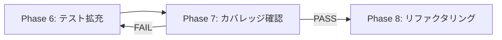

# Phase 7: テストカバレッジ確認 - タスク仕様書

## メタ情報

| 項目       | 内容                   |
| ---------- | ---------------------- |
| Phase      | 7                      |
| Phase名    | テストカバレッジ確認   |
| 前提Phase  | Phase 6                |
| 後続Phase  | Phase 8                |
| ステータス | 未実施                 |
| 作成日     | 2026-01-10             |
| 機能名     | history-ui-integration |

---

## 目的

Phase 6で拡充したテスト結果を検証し、カバレッジ基準を満たすことを確認する。基準未達の場合はPhase 6へ戻る。

## 背景

テストカバレッジはコード品質の重要な指標。Phase 6で追加したテストが十分なカバレッジを達成しているか検証し、リファクタリングフェーズに進む準備を整える。

---

## 実行タスク

> 以下のタスクを順番に実行してください。

### タスク1: カバレッジ再測定

**目的**: テストカバレッジを再計測し、基準達成を確認

**実行手順**:

1. カバレッジ測定を実行
2. 各指標が基準を満たすか確認
3. 未達の場合は不足領域を特定

**実行コマンド**:

```bash
pnpm --filter @repo/desktop test:coverage
```

**期待される成果物**:

- カバレッジレポート

---

### タスク2: 統合テスト実行

**目的**: 統合テストの成功を確認

**実行手順**:

1. 統合テストを実行
2. 全テストがパスすることを確認
3. 失敗がある場合は原因を特定

**実行コマンド**:

```bash
pnpm --filter @repo/desktop test
```

**期待される成果物**:

- 統合テスト実行結果

---

### タスク3: ゲート判定

**目的**: カバレッジ基準を満たすか判定

**判定基準**:

| 判定項目          | 基準 | 結果 | 判定 |
| ----------------- | ---- | ---- | ---- |
| Line Coverage     | 80%+ |      |      |
| Branch Coverage   | 60%+ |      |      |
| Function Coverage | 80%+ |      |      |
| IPC接続テスト     | 100% |      |      |
| 正常系シナリオ    | 100% |      |      |
| 異常系シナリオ    | 80%+ |      |      |
| 全テストパス      | 100% |      |      |

**判定結果**:

- PASS: 全基準達成 → Phase 8へ
- FAIL: 基準未達 → Phase 6へ戻る

**期待される成果物**:

- ゲート判定結果

---

## 統合テスト連携【必須】

統合テストの再実行とゲート判定:

| 判定項目                 | 基準 | 結果 |
| ------------------------ | ---- | ---- |
| ユニットテストLine       | 80%+ |      |
| ユニットテストBranch     | 60%+ |      |
| ユニットテストFunction   | 80%+ |      |
| 結合テストIPC            | 100% |      |
| 結合テストシナリオ正常系 | 100% |      |
| 結合テストシナリオ異常系 | 80%+ |      |

---

## 参照資料

| 参照資料                  | パス                                    | 内容         |
| ------------------------- | --------------------------------------- | ------------ |
| Phase 6カバレッジレポート | `outputs/phase-6/coverage-report.md`    | 前回測定結果 |
| テスト仕様書              | `outputs/phase-4/test-specification.md` | テスト設計   |

---

## 成果物

| 成果物             | パス                                  | 内容               |
| ------------------ | ------------------------------------- | ------------------ |
| カバレッジレポート | `outputs/phase-7/coverage-report.md`  | 再測定結果         |
| 統合テスト結果     | `outputs/phase-7/integration-test.md` | 統合テスト実行結果 |
| ゲート判定結果     | `outputs/phase-7/gate-result.md`      | 合否判定           |

---

## 完了条件

- [ ] カバレッジ再測定が完了している
- [ ] ユニットテストカバレッジ基準を達成（Line 80%+, Branch 60%+, Function 80%+）
- [ ] 結合テストカバレッジ基準を達成（IPC 100%, シナリオ 100%/80%）
- [ ] 統合テストが全て成功
- [ ] ゲート判定結果がPASS
- [ ] カバレッジレポートが出力されている
- [ ] **本Phase内の全タスクを100%実行完了**

---

## Phase末端アクション【必須】

- [ ] 本Phase内の全タスクを100%実行完了
- [ ] 各タスクを100%完了し、完了を明記
- [ ] 成果物が全て生成されていることを確認
- [ ] artifacts.jsonが更新されている

---

## サブタスク管理

Phase実行開始時に、TodoWriteツールで以下のサブタスクを作成すること:

1. カバレッジ再測定
2. 統合テスト実行
3. ゲート判定
4. 成果物の作成・配置
5. 完了条件の検証

**重要**: 各サブタスクは実行完了後すぐにcompletedに更新すること。

---

## タスク100%実行確認【必須】

Phase完了前に以下を確認:

- [ ] 本Phase内の全タスクを100%実行完了
- [ ] 各タスクの成果物が生成されている
- [ ] artifacts.jsonが更新されている
- [ ] Phase末端で各タスクを100%完了し、完了を明記している

```bash
# Phase完了時の検証コマンド
node .claude/skills/task-specification-creator/scripts/validate-phase-output.mjs docs/30-workflows/history-ui-integration --phase 7
```

---

## 未達時の対応

カバレッジ基準未達の場合:

1. 不足領域を特定
2. Phase 6へ戻り、追加テストを作成
3. 再度Phase 7を実行



---

## 依存関係

- **前提**: Phase 6 が完了していること
- **後続**: Phase 8（リファクタリング）へ進む

---

## 次のPhase

完了後、以下のファイルを実行してください:

`docs/30-workflows/history-ui-integration/phase-8-refactoring.md`
