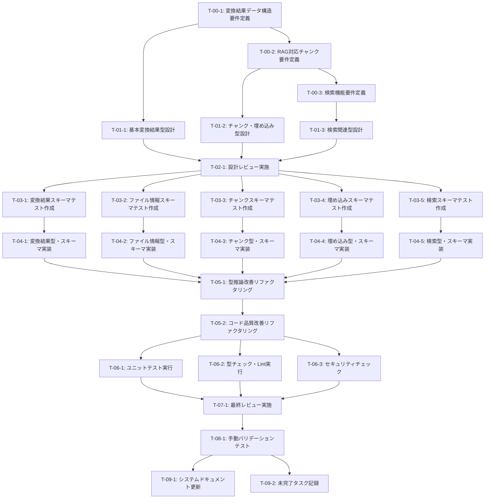

# JSONスキーマ/データ構造定義 - タスク実行仕様書

## ユーザーからの元の指示

```
@docs/30-workflows/unassigned-task/task-03-json-schema-definition.md このタスクを実行するために次のプロンプトを使ってタスク仕様書を作成してください。タスク仕様書以外のステップは実行しないでください。タスク仕様書のみ作成するようにしてください。 @.kamui/prompt/custom-prompt.txt
```

## メタ情報

| 項目             | 内容                         |
| ---------------- | ---------------------------- |
| タスクID         | CONV-03                      |
| タスク名         | JSONスキーマ/データ構造定義  |
| 分類             | 要件/設計                    |
| 対象機能         | ファイル変換システム         |
| 優先度           | 高                           |
| 見積もり規模     | 中規模                       |
| ステータス       | 未実施                       |
| 発見元           | 初期要件定義                 |
| 発見日           | 2025-12-15                   |
| 発見エージェント | .claude/agents/schema-def.md |

---

## タスク概要

### 目的

ファイル変換結果を格納するための統一JSONスキーマとTypeScript型定義を策定する。変換結果の統一フォーマットを定義し、データベーススキーマの基盤を構築する。さらに、RAG（Retrieval-Augmented Generation）対応のチャンク構造、埋め込みメタデータ、ハイブリッド検索（キーワード+セマンティック）に対応したスキーマを設計する。

### 背景

ファイル変換結果をデータベースに保存するためには、統一されたデータ構造（JSONスキーマ）が必要である。このスキーマは変換エンジンの出力形式を決定し、データベーススキーマの基盤となる。現状では以下の問題が存在する：

- 変換結果の統一フォーマットが未定義
- データベースに保存する際の構造が決まっていない
- バージョン管理に必要なメタデータの項目が未整理
- 将来の拡張を見据えたスキーマ設計が必要
- RAG対応のベクトル埋め込み・チャンク構造の定義が未実装
- ハイブリッド検索（キーワード+セマンティック）に対応したスキーマが必要

放置した場合、変換エンジンの出力形式が不統一になり、データベーススキーマの設計が進められず、バージョン管理・履歴管理の仕組みが構築できない。

### 最終ゴール

- 変換結果のJSONスキーマが定義されている
- TypeScript型定義が整備されている（`packages/shared/src/types/`）
- バリデーション用のZodスキーマが作成されている
- バージョン管理用のメタデータ構造が定義されている
- チャンク構造（RAGパイプライン用）が定義されている
- 埋め込みベクトルのメタデータ構造が定義されている
- 検索結果の型定義が整備されている
- スキーマのドキュメントが整備されている

### 成果物一覧

| 種別         | 成果物                    | 配置先                                                          |
| ------------ | ------------------------- | --------------------------------------------------------------- |
| 型定義       | conversion.ts             | packages/shared/src/types/conversion.ts                         |
| 型定義       | file-info.ts              | packages/shared/src/types/file-info.ts                          |
| 型定義       | chunk.ts                  | packages/shared/src/types/chunk.ts                              |
| 型定義       | embedding.ts              | packages/shared/src/types/embedding.ts                          |
| 型定義       | search.ts                 | packages/shared/src/types/search.ts                             |
| Zodスキーマ  | conversion.schema.ts      | packages/shared/src/schemas/conversion.schema.ts                |
| Zodスキーマ  | file-info.schema.ts       | packages/shared/src/schemas/file-info.schema.ts                 |
| Zodスキーマ  | chunk.schema.ts           | packages/shared/src/schemas/chunk.schema.ts                     |
| Zodスキーマ  | embedding.schema.ts       | packages/shared/src/schemas/embedding.schema.ts                 |
| Zodスキーマ  | search.schema.ts          | packages/shared/src/schemas/search.schema.ts                    |
| テスト       | conversion.schema.test.ts | packages/shared/src/schemas/**tests**/conversion.schema.test.ts |
| テスト       | file-info.schema.test.ts  | packages/shared/src/schemas/**tests**/file-info.schema.test.ts  |
| テスト       | chunk.schema.test.ts      | packages/shared/src/schemas/**tests**/chunk.schema.test.ts      |
| テスト       | embedding.schema.test.ts  | packages/shared/src/schemas/**tests**/embedding.schema.test.ts  |
| テスト       | search.schema.test.ts     | packages/shared/src/schemas/**tests**/search.schema.test.ts     |
| ドキュメント | JSONスキーマ定義書        | docs/30-workflows/json-schema-definition/schema-design.md       |

---

## 参照ファイル

本仕様書のコマンド・エージェント・スキル選定は以下を参照：

- `docs/00-requirements/master_system_design.md` - システム要件
- `.claude/commands/ai/command_list.md` - /ai:コマンド定義
- `.claude/agents/agent_list.md` - エージェント定義
- `.claude/skills/skill_list.md` - スキル定義

---

## タスク分解サマリー

| ID     | フェーズ | サブタスク名                   | 責務                                                               | 依存                                   |
| ------ | -------- | ------------------------------ | ------------------------------------------------------------------ | -------------------------------------- |
| T-00-1 | Phase 0  | 変換結果データ構造要件定義     | 変換結果の基本データ項目とメタデータ要件を明確化                   | -                                      |
| T-00-2 | Phase 0  | RAG対応チャンク要件定義        | セマンティックチャンキング、埋め込みベクトルの要件を定義           | T-00-1                                 |
| T-00-3 | Phase 0  | 検索機能要件定義               | ハイブリッド検索、リランキングの要件を定義                         | T-00-2                                 |
| T-01-1 | Phase 1  | 基本変換結果型設計             | ConversionResult、ConversionContent、ConversionMetadata型の設計    | T-00-1                                 |
| T-01-2 | Phase 1  | チャンク・埋め込み型設計       | ContentChunk、ChunkMetadata、EmbeddingMetadata型の設計             | T-00-2                                 |
| T-01-3 | Phase 1  | 検索関連型設計                 | SearchQuery、SearchFilters、SearchResult型の設計                   | T-00-3                                 |
| T-02-1 | Phase 2  | 設計レビュー実施               | アーキテクチャ整合性、ドメインモデル妥当性、型安全性をレビュー     | T-01-1, T-01-2, T-01-3                 |
| T-03-1 | Phase 3  | 変換結果スキーマテスト作成     | conversion.schema.tsのバリデーションテスト作成                     | T-02-1                                 |
| T-03-2 | Phase 3  | ファイル情報スキーマテスト作成 | file-info.schema.tsのバリデーションテスト作成                      | T-02-1                                 |
| T-03-3 | Phase 3  | チャンクスキーマテスト作成     | chunk.schema.tsのバリデーションテスト作成                          | T-02-1                                 |
| T-03-4 | Phase 3  | 埋め込みスキーマテスト作成     | embedding.schema.tsのバリデーションテスト作成                      | T-02-1                                 |
| T-03-5 | Phase 3  | 検索スキーマテスト作成         | search.schema.tsのバリデーションテスト作成                         | T-02-1                                 |
| T-04-1 | Phase 4  | 変換結果型・スキーマ実装       | conversion.ts、conversion.schema.tsの実装                          | T-03-1                                 |
| T-04-2 | Phase 4  | ファイル情報型・スキーマ実装   | file-info.ts、file-info.schema.tsの実装                            | T-03-2                                 |
| T-04-3 | Phase 4  | チャンク型・スキーマ実装       | chunk.ts、chunk.schema.tsの実装                                    | T-03-3                                 |
| T-04-4 | Phase 4  | 埋め込み型・スキーマ実装       | embedding.ts、embedding.schema.tsの実装                            | T-03-4                                 |
| T-04-5 | Phase 4  | 検索型・スキーマ実装           | search.ts、search.schema.tsの実装                                  | T-03-5                                 |
| T-05-1 | Phase 5  | 型推論改善リファクタリング     | z.infer<>による型推論の最大化、型安全性の向上                      | T-04-1, T-04-2, T-04-3, T-04-4, T-04-5 |
| T-05-2 | Phase 5  | コード品質改善リファクタリング | JSDocコメント追加、命名改善、重複コード削減                        | T-05-1                                 |
| T-06-1 | Phase 6  | ユニットテスト実行             | 全テストの実行とカバレッジ検証                                     | T-05-2                                 |
| T-06-2 | Phase 6  | 型チェック・Lint実行           | TypeScript型エラー、ESLint警告の解消                               | T-05-2                                 |
| T-06-3 | Phase 6  | セキュリティチェック           | Zodスキーマの入力検証、XSS/インジェクション対策の確認              | T-05-2                                 |
| T-07-1 | Phase 7  | 最終レビュー実施               | コード品質、アーキテクチャ遵守、テスト品質、セキュリティをレビュー | T-06-1, T-06-2, T-06-3                 |
| T-08-1 | Phase 8  | 手動バリデーションテスト       | サンプルデータでのスキーマバリデーションを手動確認                 | T-07-1                                 |
| T-09-1 | Phase 9  | システムドキュメント更新       | docs/00-requirements/配下の関連ドキュメントを更新                  | T-08-1                                 |
| T-09-2 | Phase 9  | 未完了タスク記録               | レビューで発見された課題をdocs/30-workflows/unassigned-task/に記録 | T-08-1                                 |

**総サブタスク数**: 25個

---

## 実行フロー図



---

## Phase 0: 要件定義

### T-00-1: 変換結果データ構造要件定義

#### 目的

変換結果の基本データ項目（ConversionResult、ConversionContent、ConversionMetadata）とバージョン管理用のメタデータ要件を明確化する。

#### 背景

変換結果を統一フォーマットで保存するためには、含めるべきデータ項目を明確に定義する必要がある。特に、バージョン管理（is_latest、version番号）、論理削除（deletedAt）、ファイル情報（originalFileName、mimeType等）の要件を整理する必要がある。

#### 責務（単一責務）

変換結果の基本データ構造と保存すべきメタデータ項目を要件として定義する。

#### Claude Code スラッシュコマンド

> ⚠️ 以下はターミナルコマンドではなく、Claude Code内で実行するスラッシュコマンドです

```
/ai:gather-requirements conversion-result-structure
```

- **参照**: `.claude/commands/ai/command_list.md`

#### 使用エージェント

- **エージェント**: .claude/agents/domain-modeler.md
- **選定理由**: ドメインモデルの設計、データ構造の設計に特化しており、変換結果という中核ドメインの要件定義に最適
- **代替候補**: .claude/agents/req-analyst.md（要件分析が主目的の場合）
- **参照**: `.claude/agents/agent_list.md`

#### 活用スキル

| スキル名                                    | 活用方法                                                   | 選定理由                                     |
| ------------------------------------------- | ---------------------------------------------------------- | -------------------------------------------- |
| .claude/skills/ubiquitous-language/SKILL.md | 変換、メタデータ、バージョン等の用語を統一                 | チーム間の認識齟齬防止、ドメイン用語の明確化 |
| .claude/skills/bounded-context/SKILL.md     | 変換ドメインのコンテキスト境界を明確化                     | 責務の明確化、他ドメインとの境界定義         |
| .claude/skills/domain-services/SKILL.md     | バージョン管理ロジックをドメインサービスとして切り出し検討 | ビジネスルールの適切な配置                   |

- **参照**: `.claude/skills/skill_list.md`

#### 成果物

| 成果物             | パス                                                                       | 内容                                                              |
| ------------------ | -------------------------------------------------------------------------- | ----------------------------------------------------------------- |
| 変換結果要件定義書 | docs/30-workflows/json-schema-definition/requirements-conversion-result.md | ConversionResult、ConversionContent、ConversionMetadataの要件定義 |
| 用語集             | docs/30-workflows/json-schema-definition/glossary.md                       | 変換・ファイル関連の用語定義                                      |

#### 完了条件

- [ ] ConversionResultに含めるデータ項目が決定されている
- [ ] バージョン管理用メタデータ（version、isLatest）が定義されている
- [ ] 論理削除フィールド（deletedAt）が定義されている
- [ ] ファイル情報フィールド（originalFileName、originalFileSize、originalMimeType等）が定義されている
- [ ] 用語が統一されている（変換、コンテンツ、メタデータ等）

#### 依存関係

- **前提**: なし
- **後続**: T-00-2（RAG対応チャンク要件定義）、T-01-1（基本変換結果型設計）

---

### T-00-2: RAG対応チャンク要件定義

#### 目的

セマンティックチャンキング、埋め込みベクトル、Contextual Retrievalに必要なチャンク構造とメタデータの要件を定義する。

#### 背景

RAG（Retrieval-Augmented Generation）パイプラインでは、ドキュメントをチャンクに分割し、各チャンクに埋め込みベクトルを付与する。2025年の最新研究（NVIDIAベンチマーク等）では、セマンティックチャンキングが最適であり、Contextual Retrieval（チャンクにコンテキストヘッダーを付与）により検索精度が向上することが示されている。これらの要件を明確化する必要がある。

#### 責務（単一責務）

RAGパイプライン用のチャンク構造、埋め込みメタデータ、チャンキング戦略の要件を定義する。

#### Claude Code スラッシュコマンド

> ⚠️ 以下はターミナルコマンドではなく、Claude Code内で実行するスラッシュコマンドです

```
/ai:gather-requirements rag-chunk-structure
```

- **参照**: `.claude/commands/ai/command_list.md`

#### 使用エージェント

- **エージェント**: .claude/agents/domain-modeler.md
- **選定理由**: チャンク、埋め込みというドメイン概念のモデリングに特化
- **参照**: `.claude/agents/agent_list.md`

#### 活用スキル

| スキル名                                    | 活用方法                                               | 選定理由                 |
| ------------------------------------------- | ------------------------------------------------------ | ------------------------ |
| .claude/skills/ubiquitous-language/SKILL.md | チャンク、埋め込み、Contextual Retrieval等の用語を統一 | 最新研究用語の正確な定義 |
| .claude/skills/bounded-context/SKILL.md     | RAGドメインのコンテキスト境界を明確化                  | 変換ドメインとの境界定義 |

- **参照**: `.claude/skills/skill_list.md`

#### 成果物

| 成果物             | パス                                                               | 内容                                                    |
| ------------------ | ------------------------------------------------------------------ | ------------------------------------------------------- |
| チャンク要件定義書 | docs/30-workflows/json-schema-definition/requirements-rag-chunk.md | ContentChunk、ChunkMetadata、ChunkingStrategyの要件定義 |
| 埋め込み要件定義書 | docs/30-workflows/json-schema-definition/requirements-embedding.md | EmbeddingMetadata、EmbeddingModelの要件定義             |

#### 完了条件

- [ ] ContentChunkに含めるデータ項目が決定されている
- [ ] チャンキング戦略（semantic、hierarchical、fixed、sentence）が定義されている
- [ ] Contextual Retrieval用のcontextualHeaderフィールドが定義されている
- [ ] 埋め込みモデル（voyage-3-large、text-embedding-3-large等）が選定されている
- [ ] トークン数、オーバーラップの要件が定義されている

#### 依存関係

- **前提**: T-00-1（変換結果データ構造要件定義）
- **後続**: T-00-3（検索機能要件定義）、T-01-2（チャンク・埋め込み型設計）

---

### T-00-3: 検索機能要件定義

#### 目的

ハイブリッド検索（キーワード+セマンティック）、リランキング、検索フィルタの要件を定義する。

#### 背景

最新のRAGシステムでは、キーワード検索（BM25/FTS5）とセマンティック検索（ベクトル類似度）を組み合わせたハイブリッド検索が標準となっている。さらに、リランキングモデル（cohere/rerank-v3等）を使用して検索結果の精度を向上させる。これらの要件を明確化する必要がある。

#### 責務（単一責務）

検索クエリ、検索フィルタ、検索結果、リランキングの要件を定義する。

#### Claude Code スラッシュコマンド

> ⚠️ 以下はターミナルコマンドではなく、Claude Code内で実行するスラッシュコマンドです

```
/ai:gather-requirements hybrid-search
```

- **参照**: `.claude/commands/ai/command_list.md`

#### 使用エージェント

- **エージェント**: .claude/agents/req-analyst.md
- **選定理由**: 検索機能という機能要件の分析・整理に特化
- **参照**: `.claude/agents/agent_list.md`

#### 活用スキル

| スキル名                                                       | 活用方法                           | 選定理由                     |
| -------------------------------------------------------------- | ---------------------------------- | ---------------------------- |
| .claude/skills/functional-non-functional-requirements/SKILL.md | 検索速度、精度等の非機能要件も整理 | 機能要件と非機能要件の明確化 |
| .claude/skills/use-case-modeling/SKILL.md                      | 検索ユースケースのモデリング       | 検索シナリオの可視化         |

- **参照**: `.claude/skills/skill_list.md`

#### 成果物

| 成果物         | パス                                                            | 内容                                                              |
| -------------- | --------------------------------------------------------------- | ----------------------------------------------------------------- |
| 検索要件定義書 | docs/30-workflows/json-schema-definition/requirements-search.md | SearchQuery、SearchFilters、SearchResult、HybridWeightsの要件定義 |

#### 完了条件

- [ ] 検索モード（keyword、semantic、hybrid）が定義されている
- [ ] ハイブリッド検索の重み配分（HybridWeights）が定義されている
- [ ] リランキングモデル（cohere/rerank-v3等）が選定されている
- [ ] 検索フィルタ（fileIds、dateRange、contentTypes等）が定義されている
- [ ] 検索結果メタデータ（keywordScore、semanticScore、rerankScore等）が定義されている

#### 依存関係

- **前提**: T-00-2（RAG対応チャンク要件定義）
- **後続**: T-01-3（検索関連型設計）

---

## Phase 1: 設計

### T-01-1: 基本変換結果型設計

#### 目的

ConversionResult、ConversionContent、ConversionMetadata、FileInfo、VersionInfo等の基本型のTypeScript型定義とZodスキーマを設計する。

#### 背景

Phase 0で定義した要件に基づき、実装可能な構造に落とし込む。特に、型安全性を確保しつつ、Zodスキーマとの型推論が正しく機能するように設計する必要がある。

#### 責務（単一責務）

基本変換結果型のTypeScript型定義とZodスキーマを設計する。

#### Claude Code スラッシュコマンド

> ⚠️ 以下はターミナルコマンドではなく、Claude Code内で実行するスラッシュコマンドです

```
/ai:create-schema conversion-result
```

- **参照**: `.claude/commands/ai/command_list.md`

#### 使用エージェント

- **エージェント**: .claude/agents/schema-def.md
- **選定理由**: スキーマ定義・型設計に特化したエージェントであり、TypeScript型とZodスキーマの一貫性を保つ設計に最適
- **参照**: `.claude/agents/agent_list.md`

#### 活用スキル

| スキル名                                     | 活用方法                                      | 選定理由                           |
| -------------------------------------------- | --------------------------------------------- | ---------------------------------- |
| .claude/skills/zod-validation/SKILL.md       | Zodスキーマの設計、バリデーションルールの定義 | ランタイムバリデーションの実装基盤 |
| .claude/skills/type-safety-patterns/SKILL.md | z.infer<>による型推論の最大化、型ガードの設計 | 型安全性の確保、型推論の活用       |

- **参照**: `.claude/skills/skill_list.md`

#### 成果物

| 成果物       | パス                                                                | 内容                                                                                   |
| ------------ | ------------------------------------------------------------------- | -------------------------------------------------------------------------------------- |
| 基本型設計書 | docs/30-workflows/json-schema-definition/design-conversion-types.md | ConversionResult、ConversionContent、ConversionMetadata、FileInfo、VersionInfoの型設計 |

#### 完了条件

- [ ] ConversionResult型の設計が完了している
- [ ] ConversionContent型の設計が完了している
- [ ] ConversionMetadata型の設計が完了している
- [ ] FileInfo型の設計が完了している
- [ ] VersionInfo型の設計が完了している
- [ ] 各型に対応するZodスキーマの設計が完了している
- [ ] 型推論（z.infer<>）の設計が完了している

#### 依存関係

- **前提**: T-00-1（変換結果データ構造要件定義）
- **後続**: T-02-1（設計レビュー実施）

---

### T-01-2: チャンク・埋め込み型設計

#### 目的

ContentChunk、ChunkMetadata、ChunkingStrategy、EmbeddingMetadata、EmbeddingModel等のRAG関連型のTypeScript型定義とZodスキーマを設計する。

#### 背景

Phase 0で定義したRAG要件に基づき、チャンク構造と埋め込みメタデータを実装可能な型として設計する。特に、チャンキング戦略（union型）や埋め込みモデル（union型）を型安全に扱う設計が必要。

#### 責務（単一責務）

RAG関連型のTypeScript型定義とZodスキーマを設計する。

#### Claude Code スラッシュコマンド

> ⚠️ 以下はターミナルコマンドではなく、Claude Code内で実行するスラッシュコマンドです

```
/ai:create-schema rag-chunk-embedding
```

- **参照**: `.claude/commands/ai/command_list.md`

#### 使用エージェント

- **エージェント**: .claude/agents/schema-def.md
- **選定理由**: スキーマ定義・型設計に特化したエージェントであり、複雑なunion型の設計に最適
- **参照**: `.claude/agents/agent_list.md`

#### 活用スキル

| スキル名                                     | 活用方法                                                  | 選定理由                                         |
| -------------------------------------------- | --------------------------------------------------------- | ------------------------------------------------ |
| .claude/skills/zod-validation/SKILL.md       | union型のZodスキーマ設計（z.union、z.discriminatedUnion） | ChunkingStrategy、EmbeddingModelのバリデーション |
| .claude/skills/type-safety-patterns/SKILL.md | discriminated union型の設計                               | 型安全な戦略・モデル切り替え                     |

- **参照**: `.claude/skills/skill_list.md`

#### 成果物

| 成果物           | パス                                                               | 内容                                                  |
| ---------------- | ------------------------------------------------------------------ | ----------------------------------------------------- |
| チャンク型設計書 | docs/30-workflows/json-schema-definition/design-chunk-types.md     | ContentChunk、ChunkMetadata、ChunkingStrategyの型設計 |
| 埋め込み型設計書 | docs/30-workflows/json-schema-definition/design-embedding-types.md | EmbeddingMetadata、EmbeddingModelの型設計             |

#### 完了条件

- [ ] ContentChunk型の設計が完了している
- [ ] ChunkMetadata型の設計が完了している
- [ ] ChunkingStrategy型（union型）の設計が完了している
- [ ] EmbeddingMetadata型の設計が完了している
- [ ] EmbeddingModel型（union型）の設計が完了している
- [ ] 各型に対応するZodスキーマの設計が完了している

#### 依存関係

- **前提**: T-00-2（RAG対応チャンク要件定義）
- **後続**: T-02-1（設計レビュー実施）

---

### T-01-3: 検索関連型設計

#### 目的

SearchQuery、SearchFilters、SearchOptions、SearchMode、HybridWeights、SearchResult、SearchResultMetadata等の検索関連型のTypeScript型定義とZodスキーマを設計する。

#### 背景

Phase 0で定義したハイブリッド検索要件に基づき、検索クエリと検索結果を実装可能な型として設計する。特に、検索モード（union型）やハイブリッド検索の重み配分を型安全に扱う設計が必要。

#### 責務（単一責務）

検索関連型のTypeScript型定義とZodスキーマを設計する。

#### Claude Code スラッシュコマンド

> ⚠️ 以下はターミナルコマンドではなく、Claude Code内で実行するスラッシュコマンドです

```
/ai:create-schema search-types
```

- **参照**: `.claude/commands/ai/command_list.md`

#### 使用エージェント

- **エージェント**: .claude/agents/schema-def.md
- **選定理由**: スキーマ定義・型設計に特化したエージェントであり、複雑な検索クエリ型の設計に最適
- **参照**: `.claude/agents/agent_list.md`

#### 活用スキル

| スキル名                                     | 活用方法                                              | 選定理由                                        |
| -------------------------------------------- | ----------------------------------------------------- | ----------------------------------------------- |
| .claude/skills/zod-validation/SKILL.md       | オプショナルフィールドのZodスキーマ設計（z.optional） | SearchFilters、SearchResultMetadataの柔軟な設計 |
| .claude/skills/type-safety-patterns/SKILL.md | union型、オプショナル型の設計                         | 型安全な検索クエリ構築                          |

- **参照**: `.claude/skills/skill_list.md`

#### 成果物

| 成果物       | パス                                                            | 内容                                                                                  |
| ------------ | --------------------------------------------------------------- | ------------------------------------------------------------------------------------- |
| 検索型設計書 | docs/30-workflows/json-schema-definition/design-search-types.md | SearchQuery、SearchFilters、SearchOptions、SearchResult、SearchResultMetadataの型設計 |

#### 完了条件

- [ ] SearchQuery型の設計が完了している
- [ ] SearchFilters型の設計が完了している
- [ ] SearchOptions型の設計が完了している
- [ ] SearchMode型（union型）の設計が完了している
- [ ] HybridWeights型の設計が完了している
- [ ] SearchResult型の設計が完了している
- [ ] SearchResultMetadata型の設計が完了している
- [ ] 各型に対応するZodスキーマの設計が完了している

#### 依存関係

- **前提**: T-00-3（検索機能要件定義）
- **後続**: T-02-1（設計レビュー実施）

---

## Phase 2: 設計レビューゲート

### T-02-1: 設計レビュー実施

#### 目的

実装開始前に要件・設計の妥当性を複数エージェントで検証する。問題を早期発見し、実装フェーズでの手戻りを最小化する。

#### 背景

設計ミスが実装後に発見されると修正コストが大幅に増加する。「Shift Left」原則に基づき、問題を可能な限り早期に検出する。特に、型設計の整合性、ドメインモデルの妥当性、セキュリティの考慮漏れを確認する。

#### レビュー参加エージェント

| エージェント                     | レビュー観点         | 選定理由                                                                    |
| -------------------------------- | -------------------- | --------------------------------------------------------------------------- |
| .claude/agents/arch-police.md    | アーキテクチャ整合性 | クリーンアーキテクチャのレイヤー違反、依存関係逆転の原則（DIP）の検証に特化 |
| .claude/agents/domain-modeler.md | ドメインモデル妥当性 | ユビキタス言語の適切な使用、エンティティ・値オブジェクトの境界の検証に特化  |
| .claude/agents/sec-auditor.md    | セキュリティ設計     | Zodスキーマによる入力検証の妥当性、XSS/インジェクション対策の確認に特化     |
| .claude/agents/schema-def.md     | 型定義品質           | TypeScript型とZodスキーマの一貫性、型推論の正しさの検証に特化               |

- **参照**: `.claude/agents/agent_list.md`

#### レビューチェックリスト

**アーキテクチャ整合性** (.claude/agents/arch-police.md)

- [ ] クリーンアーキテクチャのレイヤー違反がないか
- [ ] 依存関係逆転の原則（DIP）が守られているか
- [ ] 既存設計との整合性があるか
- [ ] packages/shared/がプレゼンテーション層に依存していないか

**ドメインモデル妥当性** (.claude/agents/domain-modeler.md)

- [ ] ユビキタス言語が適切に使用されているか（変換、チャンク、埋め込み等）
- [ ] エンティティ・値オブジェクトの境界が適切か
- [ ] ドメインルールが正しく表現されているか（バージョン管理、論理削除等）
- [ ] bounded contextの境界が明確か（変換ドメイン、RAGドメイン、検索ドメイン）

**セキュリティ設計** (.claude/agents/sec-auditor.md)

- [ ] Zodスキーマによる入力検証が適切か
- [ ] XSS対策（文字列フィールドのサニタイズ）が考慮されているか
- [ ] インジェクション対策（特殊文字のエスケープ）が考慮されているか
- [ ] 機密情報（認証トークン等）の取り扱いが適切か

**型定義品質** (.claude/agents/schema-def.md)

- [ ] TypeScript型とZodスキーマの一貫性があるか
- [ ] z.infer<>による型推論が正しく機能するか
- [ ] union型、discriminated union型が適切に設計されているか
- [ ] オプショナルフィールドの設計が適切か

#### レビュー結果

- **判定**: {{PASS / MINOR / MAJOR}}
- **指摘事項**: {{レビューで発見された問題点}}
- **対応方針**: {{問題の修正方針}}

#### 戻り先決定（MAJORの場合）

| 問題の種類 | 戻り先                    |
| ---------- | ------------------------- |
| 要件の問題 | Phase 0（要件定義）へ戻る |
| 設計の問題 | Phase 1（設計）へ戻る     |
| 両方の問題 | Phase 0（要件定義）へ戻る |

#### 完了条件

- [ ] 全レビュー観点でチェックリストが完了している
- [ ] 発見された問題がすべて記録されている
- [ ] PASS判定またはMINOR判定で対応完了している
- [ ] MAJOR判定の場合は戻り先が決定している

#### 依存関係

- **前提**: T-01-1（基本変換結果型設計）、T-01-2（チャンク・埋め込み型設計）、T-01-3（検索関連型設計）
- **後続**: T-03-1〜T-03-5（テスト作成）

---

## Phase 3: テスト作成 (TDD: Red)

### T-03-1: 変換結果スキーマテスト作成

#### 目的

conversion.schema.tsのバリデーションテストを実装より先に作成する。期待される動作を検証するテストをRed状態で用意する。

#### 背景

TDD（テスト駆動開発）では、実装前にテストを作成し、テストが失敗することを確認する（Red）。これにより、実装の仕様が明確になり、過剰実装を防ぐことができる。

#### 責務（単一責務）

conversion.schema.tsのバリデーションテストを作成する。

#### Claude Code スラッシュコマンド

> ⚠️ 以下はターミナルコマンドではなく、Claude Code内で実行するスラッシュコマンドです

```
/ai:generate-unit-tests packages/shared/src/schemas/conversion.schema.ts
```

- **参照**: `.claude/commands/ai/command_list.md`

#### 使用エージェント

- **エージェント**: .claude/agents/unit-tester.md
- **選定理由**: ユニットテストの設計・実装に特化したエージェントであり、Zodスキーマのバリデーションテストに最適
- **参照**: `.claude/agents/agent_list.md`

#### 活用スキル

| スキル名                                        | 活用方法                                       | 選定理由                    |
| ----------------------------------------------- | ---------------------------------------------- | --------------------------- |
| .claude/skills/boundary-value-analysis/SKILL.md | 境界値のテスト設計（空文字列、最大長、null等） | エッジケースの検証          |
| .claude/skills/test-data-management/SKILL.md    | 有効/無効データのセット管理                    | テストデータの体系的管理    |
| .claude/skills/tdd-principles/SKILL.md          | Red→Green→Refactorサイクルの遵守               | TDDのベストプラクティス適用 |

- **参照**: `.claude/skills/skill_list.md`

#### 成果物

| 成果物                    | パス                                                            | 内容                                           |
| ------------------------- | --------------------------------------------------------------- | ---------------------------------------------- |
| conversion.schema.test.ts | packages/shared/src/schemas/**tests**/conversion.schema.test.ts | ConversionResultスキーマのバリデーションテスト |

#### TDD検証: Red状態確認

```bash
pnpm --filter @repo/shared test:run conversion.schema.test.ts
```

- [ ] テストが失敗することを確認（Red状態）

#### 完了条件

- [ ] 有効なConversionResultのバリデーション成功テストが作成されている
- [ ] 必須フィールド欠落時のバリデーション失敗テストが作成されている
- [ ] 不正な型のフィールドでのバリデーション失敗テストが作成されている
- [ ] オプショナルフィールドの省略時の成功テストが作成されている
- [ ] テストが失敗することを確認している（Red状態）

#### 依存関係

- **前提**: T-02-1（設計レビュー実施）
- **後続**: T-04-1（変換結果型・スキーマ実装）

---

### T-03-2: ファイル情報スキーマテスト作成

#### 目的

file-info.schema.tsのバリデーションテストを実装より先に作成する。

#### 背景

ファイル情報（FileInfo）のバリデーションテストを作成し、テストが失敗することを確認する（Red）。

#### 責務（単一責務）

file-info.schema.tsのバリデーションテストを作成する。

#### Claude Code スラッシュコマンド

> ⚠️ 以下はターミナルコマンドではなく、Claude Code内で実行するスラッシュコマンドです

```
/ai:generate-unit-tests packages/shared/src/schemas/file-info.schema.ts
```

- **参照**: `.claude/commands/ai/command_list.md`

#### 使用エージェント

- **エージェント**: .claude/agents/unit-tester.md
- **選定理由**: ユニットテストの設計・実装に特化したエージェント
- **参照**: `.claude/agents/agent_list.md`

#### 活用スキル

| スキル名                                        | 活用方法                                    | 選定理由                 |
| ----------------------------------------------- | ------------------------------------------- | ------------------------ |
| .claude/skills/boundary-value-analysis/SKILL.md | ファイルサイズの境界値テスト（0、最大値等） | エッジケースの検証       |
| .claude/skills/test-data-management/SKILL.md    | MIMEタイプの有効/無効データセット管理       | テストデータの体系的管理 |

- **参照**: `.claude/skills/skill_list.md`

#### 成果物

| 成果物                   | パス                                                           | 内容                                   |
| ------------------------ | -------------------------------------------------------------- | -------------------------------------- |
| file-info.schema.test.ts | packages/shared/src/schemas/**tests**/file-info.schema.test.ts | FileInfoスキーマのバリデーションテスト |

#### TDD検証: Red状態確認

```bash
pnpm --filter @repo/shared test:run file-info.schema.test.ts
```

- [ ] テストが失敗することを確認（Red状態）

#### 完了条件

- [ ] 有効なFileInfoのバリデーション成功テストが作成されている
- [ ] 必須フィールド欠落時のバリデーション失敗テストが作成されている
- [ ] 不正なMIMEタイプでのバリデーション失敗テストが作成されている
- [ ] テストが失敗することを確認している（Red状態）

#### 依存関係

- **前提**: T-02-1（設計レビュー実施）
- **後続**: T-04-2（ファイル情報型・スキーマ実装）

---

### T-03-3: チャンクスキーマテスト作成

#### 目的

chunk.schema.tsのバリデーションテストを実装より先に作成する。

#### 背景

チャンク（ContentChunk）のバリデーションテストを作成し、テストが失敗することを確認する（Red）。特に、チャンキング戦略のunion型バリデーションを検証する。

#### 責務（単一責務）

chunk.schema.tsのバリデーションテストを作成する。

#### Claude Code スラッシュコマンド

> ⚠️ 以下はターミナルコマンドではなく、Claude Code内で実行するスラッシュコマンドです

```
/ai:generate-unit-tests packages/shared/src/schemas/chunk.schema.ts
```

- **参照**: `.claude/commands/ai/command_list.md`

#### 使用エージェント

- **エージェント**: .claude/agents/unit-tester.md
- **選定理由**: ユニットテストの設計・実装に特化したエージェント
- **参照**: `.claude/agents/agent_list.md`

#### 活用スキル

| スキル名                                        | 活用方法                                    | 選定理由              |
| ----------------------------------------------- | ------------------------------------------- | --------------------- |
| .claude/skills/boundary-value-analysis/SKILL.md | トークン数の境界値テスト（0、最大値等）     | エッジケースの検証    |
| .claude/skills/test-data-management/SKILL.md    | チャンキング戦略の有効/無効データセット管理 | union型の網羅的テスト |

- **参照**: `.claude/skills/skill_list.md`

#### 成果物

| 成果物               | パス                                                       | 内容                                       |
| -------------------- | ---------------------------------------------------------- | ------------------------------------------ |
| chunk.schema.test.ts | packages/shared/src/schemas/**tests**/chunk.schema.test.ts | ContentChunkスキーマのバリデーションテスト |

#### TDD検証: Red状態確認

```bash
pnpm --filter @repo/shared test:run chunk.schema.test.ts
```

- [ ] テストが失敗することを確認（Red状態）

#### 完了条件

- [ ] 有効なContentChunkのバリデーション成功テストが作成されている
- [ ] ChunkingStrategy（semantic、hierarchical、fixed、sentence）の各値のテストが作成されている
- [ ] 不正なChunkingStrategyでのバリデーション失敗テストが作成されている
- [ ] テストが失敗することを確認している（Red状態）

#### 依存関係

- **前提**: T-02-1（設計レビュー実施）
- **後続**: T-04-3（チャンク型・スキーマ実装）

---

### T-03-4: 埋め込みスキーマテスト作成

#### 目的

embedding.schema.tsのバリデーションテストを実装より先に作成する。

#### 背景

埋め込みメタデータ（EmbeddingMetadata）のバリデーションテストを作成し、テストが失敗することを確認する（Red）。特に、EmbeddingModelのunion型バリデーションを検証する。

#### 責務（単一責務）

embedding.schema.tsのバリデーションテストを作成する。

#### Claude Code スラッシュコマンド

> ⚠️ 以下はターミナルコマンドではなく、Claude Code内で実行するスラッシュコマンドです

```
/ai:generate-unit-tests packages/shared/src/schemas/embedding.schema.ts
```

- **参照**: `.claude/commands/ai/command_list.md`

#### 使用エージェント

- **エージェント**: .claude/agents/unit-tester.md
- **選定理由**: ユニットテストの設計・実装に特化したエージェント
- **参照**: `.claude/agents/agent_list.md`

#### 活用スキル

| スキル名                                        | 活用方法                                  | 選定理由              |
| ----------------------------------------------- | ----------------------------------------- | --------------------- |
| .claude/skills/boundary-value-analysis/SKILL.md | ベクトル次元数の境界値テスト              | エッジケースの検証    |
| .claude/skills/test-data-management/SKILL.md    | EmbeddingModelの有効/無効データセット管理 | union型の網羅的テスト |

- **参照**: `.claude/skills/skill_list.md`

#### 成果物

| 成果物                   | パス                                                           | 内容                                            |
| ------------------------ | -------------------------------------------------------------- | ----------------------------------------------- |
| embedding.schema.test.ts | packages/shared/src/schemas/**tests**/embedding.schema.test.ts | EmbeddingMetadataスキーマのバリデーションテスト |

#### TDD検証: Red状態確認

```bash
pnpm --filter @repo/shared test:run embedding.schema.test.ts
```

- [ ] テストが失敗することを確認（Red状態）

#### 完了条件

- [ ] 有効なEmbeddingMetadataのバリデーション成功テストが作成されている
- [ ] EmbeddingModel（voyage-3-large、text-embedding-3-large等）の各値のテストが作成されている
- [ ] 不正なEmbeddingModelでのバリデーション失敗テストが作成されている
- [ ] テストが失敗することを確認している（Red状態）

#### 依存関係

- **前提**: T-02-1（設計レビュー実施）
- **後続**: T-04-4（埋め込み型・スキーマ実装）

---

### T-03-5: 検索スキーマテスト作成

#### 目的

search.schema.tsのバリデーションテストを実装より先に作成する。

#### 背景

検索クエリ（SearchQuery）、検索結果（SearchResult）のバリデーションテストを作成し、テストが失敗することを確認する（Red）。特に、SearchModeのunion型バリデーションを検証する。

#### 責務（単一責務）

search.schema.tsのバリデーションテストを作成する。

#### Claude Code スラッシュコマンド

> ⚠️ 以下はターミナルコマンドではなく、Claude Code内で実行するスラッシュコマンドです

```
/ai:generate-unit-tests packages/shared/src/schemas/search.schema.ts
```

- **参照**: `.claude/commands/ai/command_list.md`

#### 使用エージェント

- **エージェント**: .claude/agents/unit-tester.md
- **選定理由**: ユニットテストの設計・実装に特化したエージェント
- **参照**: `.claude/agents/agent_list.md`

#### 活用スキル

| スキル名                                        | 活用方法                              | 選定理由              |
| ----------------------------------------------- | ------------------------------------- | --------------------- |
| .claude/skills/boundary-value-analysis/SKILL.md | limitの境界値テスト（0、最大値等）    | エッジケースの検証    |
| .claude/skills/test-data-management/SKILL.md    | SearchModeの有効/無効データセット管理 | union型の網羅的テスト |

- **参照**: `.claude/skills/skill_list.md`

#### 成果物

| 成果物                | パス                                                        | 内容                                                    |
| --------------------- | ----------------------------------------------------------- | ------------------------------------------------------- |
| search.schema.test.ts | packages/shared/src/schemas/**tests**/search.schema.test.ts | SearchQuery、SearchResultスキーマのバリデーションテスト |

#### TDD検証: Red状態確認

```bash
pnpm --filter @repo/shared test:run search.schema.test.ts
```

- [ ] テストが失敗することを確認（Red状態）

#### 完了条件

- [ ] 有効なSearchQueryのバリデーション成功テストが作成されている
- [ ] SearchMode（keyword、semantic、hybrid）の各値のテストが作成されている
- [ ] 不正なSearchModeでのバリデーション失敗テストが作成されている
- [ ] HybridWeightsのバリデーションテストが作成されている
- [ ] テストが失敗することを確認している（Red状態）

#### 依存関係

- **前提**: T-02-1（設計レビュー実施）
- **後続**: T-04-5（検索型・スキーマ実装）

---

## Phase 4: 実装 (TDD: Green)

### T-04-1: 変換結果型・スキーマ実装

#### 目的

テストを通すためのconversion.ts、conversion.schema.tsを実装する。

#### 背景

Phase 3で作成したテストが成功するように、最小限の実装を行う。過剰実装を避け、テストを通すことに集中する。

#### 責務（単一責務）

conversion.ts、conversion.schema.tsを実装する。

#### Claude Code スラッシュコマンド

> ⚠️ 以下はターミナルコマンドではなく、Claude Code内で実行するスラッシュコマンドです

```
/ai:create-schema conversion
```

- **参照**: `.claude/commands/ai/command_list.md`

#### 使用エージェント

- **エージェント**: .claude/agents/schema-def.md
- **選定理由**: スキーマ定義の実装に特化したエージェント
- **参照**: `.claude/agents/agent_list.md`

#### 活用スキル

| スキル名                                     | 活用方法                                            | 選定理由                          |
| -------------------------------------------- | --------------------------------------------------- | --------------------------------- |
| .claude/skills/zod-validation/SKILL.md       | Zodスキーマの実装（z.object、z.string、z.number等） | バリデーションの実装              |
| .claude/skills/type-safety-patterns/SKILL.md | z.infer<>による型推論の活用                         | TypeScript型とZodスキーマの一貫性 |

- **参照**: `.claude/skills/skill_list.md`

#### 成果物

| 成果物               | パス                                             | 内容                                                          |
| -------------------- | ------------------------------------------------ | ------------------------------------------------------------- |
| conversion.ts        | packages/shared/src/types/conversion.ts          | ConversionResult、ConversionContent、ConversionMetadata型定義 |
| conversion.schema.ts | packages/shared/src/schemas/conversion.schema.ts | ConversionResultスキーマ                                      |

#### TDD検証: Green状態確認

```bash
pnpm --filter @repo/shared test:run conversion.schema.test.ts
```

- [ ] テストが成功することを確認（Green状態）

#### 完了条件

- [ ] conversion.tsが実装されている
- [ ] conversion.schema.tsが実装されている
- [ ] z.infer<>による型推論が機能している
- [ ] テストが成功することを確認している（Green状態）

#### 依存関係

- **前提**: T-03-1（変換結果スキーマテスト作成）
- **後続**: T-05-1（型推論改善リファクタリング）

---

### T-04-2: ファイル情報型・スキーマ実装

#### 目的

テストを通すためのfile-info.ts、file-info.schema.tsを実装する。

#### 背景

Phase 3で作成したテストが成功するように、最小限の実装を行う。

#### 責務（単一責務）

file-info.ts、file-info.schema.tsを実装する。

#### Claude Code スラッシュコマンド

> ⚠️ 以下はターミナルコマンドではなく、Claude Code内で実行するスラッシュコマンドです

```
/ai:create-schema file-info
```

- **参照**: `.claude/commands/ai/command_list.md`

#### 使用エージェント

- **エージェント**: .claude/agents/schema-def.md
- **選定理由**: スキーマ定義の実装に特化したエージェント
- **参照**: `.claude/agents/agent_list.md`

#### 活用スキル

| スキル名                                     | 活用方法                    | 選定理由                          |
| -------------------------------------------- | --------------------------- | --------------------------------- |
| .claude/skills/zod-validation/SKILL.md       | Zodスキーマの実装           | バリデーションの実装              |
| .claude/skills/type-safety-patterns/SKILL.md | z.infer<>による型推論の活用 | TypeScript型とZodスキーマの一貫性 |

- **参照**: `.claude/skills/skill_list.md`

#### 成果物

| 成果物              | パス                                            | 内容             |
| ------------------- | ----------------------------------------------- | ---------------- |
| file-info.ts        | packages/shared/src/types/file-info.ts          | FileInfo型定義   |
| file-info.schema.ts | packages/shared/src/schemas/file-info.schema.ts | FileInfoスキーマ |

#### TDD検証: Green状態確認

```bash
pnpm --filter @repo/shared test:run file-info.schema.test.ts
```

- [ ] テストが成功することを確認（Green状態）

#### 完了条件

- [ ] file-info.tsが実装されている
- [ ] file-info.schema.tsが実装されている
- [ ] テストが成功することを確認している（Green状態）

#### 依存関係

- **前提**: T-03-2（ファイル情報スキーマテスト作成）
- **後続**: T-05-1（型推論改善リファクタリング）

---

### T-04-3: チャンク型・スキーマ実装

#### 目的

テストを通すためのchunk.ts、chunk.schema.tsを実装する。

#### 背景

Phase 3で作成したテストが成功するように、最小限の実装を行う。特に、ChunkingStrategyのunion型実装に注意する。

#### 責務（単一責務）

chunk.ts、chunk.schema.tsを実装する。

#### Claude Code スラッシュコマンド

> ⚠️ 以下はターミナルコマンドではなく、Claude Code内で実行するスラッシュコマンドです

```
/ai:create-schema chunk
```

- **参照**: `.claude/commands/ai/command_list.md`

#### 使用エージェント

- **エージェント**: .claude/agents/schema-def.md
- **選定理由**: スキーマ定義の実装に特化したエージェント
- **参照**: `.claude/agents/agent_list.md`

#### 活用スキル

| スキル名                                     | 活用方法                                       | 選定理由                         |
| -------------------------------------------- | ---------------------------------------------- | -------------------------------- |
| .claude/skills/zod-validation/SKILL.md       | union型のZodスキーマ実装（z.union、z.literal） | ChunkingStrategyのバリデーション |
| .claude/skills/type-safety-patterns/SKILL.md | discriminated union型の実装                    | 型安全な戦略切り替え             |

- **参照**: `.claude/skills/skill_list.md`

#### 成果物

| 成果物          | パス                                        | 内容                                                |
| --------------- | ------------------------------------------- | --------------------------------------------------- |
| chunk.ts        | packages/shared/src/types/chunk.ts          | ContentChunk、ChunkMetadata、ChunkingStrategy型定義 |
| chunk.schema.ts | packages/shared/src/schemas/chunk.schema.ts | ContentChunkスキーマ                                |

#### TDD検証: Green状態確認

```bash
pnpm --filter @repo/shared test:run chunk.schema.test.ts
```

- [ ] テストが成功することを確認（Green状態）

#### 完了条件

- [ ] chunk.tsが実装されている
- [ ] chunk.schema.tsが実装されている
- [ ] ChunkingStrategy union型が実装されている
- [ ] テストが成功することを確認している（Green状態）

#### 依存関係

- **前提**: T-03-3（チャンクスキーマテスト作成）
- **後続**: T-05-1（型推論改善リファクタリング）

---

### T-04-4: 埋め込み型・スキーマ実装

#### 目的

テストを通すためのembedding.ts、embedding.schema.tsを実装する。

#### 背景

Phase 3で作成したテストが成功するように、最小限の実装を行う。特に、EmbeddingModelのunion型実装に注意する。

#### 責務（単一責務）

embedding.ts、embedding.schema.tsを実装する。

#### Claude Code スラッシュコマンド

> ⚠️ 以下はターミナルコマンドではなく、Claude Code内で実行するスラッシュコマンドです

```
/ai:create-schema embedding
```

- **参照**: `.claude/commands/ai/command_list.md`

#### 使用エージェント

- **エージェント**: .claude/agents/schema-def.md
- **選定理由**: スキーマ定義の実装に特化したエージェント
- **参照**: `.claude/agents/agent_list.md`

#### 活用スキル

| スキル名                                     | 活用方法                                       | 選定理由                       |
| -------------------------------------------- | ---------------------------------------------- | ------------------------------ |
| .claude/skills/zod-validation/SKILL.md       | union型のZodスキーマ実装（z.union、z.literal） | EmbeddingModelのバリデーション |
| .claude/skills/type-safety-patterns/SKILL.md | union型の実装                                  | 型安全なモデル切り替え         |

- **参照**: `.claude/skills/skill_list.md`

#### 成果物

| 成果物              | パス                                            | 内容                                    |
| ------------------- | ----------------------------------------------- | --------------------------------------- |
| embedding.ts        | packages/shared/src/types/embedding.ts          | EmbeddingMetadata、EmbeddingModel型定義 |
| embedding.schema.ts | packages/shared/src/schemas/embedding.schema.ts | EmbeddingMetadataスキーマ               |

#### TDD検証: Green状態確認

```bash
pnpm --filter @repo/shared test:run embedding.schema.test.ts
```

- [ ] テストが成功することを確認（Green状態）

#### 完了条件

- [ ] embedding.tsが実装されている
- [ ] embedding.schema.tsが実装されている
- [ ] EmbeddingModel union型が実装されている
- [ ] テストが成功することを確認している（Green状態）

#### 依存関係

- **前提**: T-03-4（埋め込みスキーマテスト作成）
- **後続**: T-05-1（型推論改善リファクタリング）

---

### T-04-5: 検索型・スキーマ実装

#### 目的

テストを通すためのsearch.ts、search.schema.tsを実装する。

#### 背景

Phase 3で作成したテストが成功するように、最小限の実装を行う。特に、SearchModeのunion型実装に注意する。

#### 責務（単一責務）

search.ts、search.schema.tsを実装する。

#### Claude Code スラッシュコマンド

> ⚠️ 以下はターミナルコマンドではなく、Claude Code内で実行するスラッシュコマンドです

```
/ai:create-schema search
```

- **参照**: `.claude/commands/ai/command_list.md`

#### 使用エージェント

- **エージェント**: .claude/agents/schema-def.md
- **選定理由**: スキーマ定義の実装に特化したエージェント
- **参照**: `.claude/agents/agent_list.md`

#### 活用スキル

| スキル名                                     | 活用方法                                               | 選定理由                                  |
| -------------------------------------------- | ------------------------------------------------------ | ----------------------------------------- |
| .claude/skills/zod-validation/SKILL.md       | union型、オプショナル型のZodスキーマ実装（z.optional） | SearchMode、SearchFiltersのバリデーション |
| .claude/skills/type-safety-patterns/SKILL.md | union型、オプショナル型の実装                          | 型安全な検索クエリ構築                    |

- **参照**: `.claude/skills/skill_list.md`

#### 成果物

| 成果物           | パス                                         | 内容                                                          |
| ---------------- | -------------------------------------------- | ------------------------------------------------------------- |
| search.ts        | packages/shared/src/types/search.ts          | SearchQuery、SearchFilters、SearchOptions、SearchResult型定義 |
| search.schema.ts | packages/shared/src/schemas/search.schema.ts | SearchQuery、SearchResultスキーマ                             |

#### TDD検証: Green状態確認

```bash
pnpm --filter @repo/shared test:run search.schema.test.ts
```

- [ ] テストが成功することを確認（Green状態）

#### 完了条件

- [ ] search.tsが実装されている
- [ ] search.schema.tsが実装されている
- [ ] SearchMode union型が実装されている
- [ ] テストが成功することを確認している（Green状態）

#### 依存関係

- **前提**: T-03-5（検索スキーマテスト作成）
- **後続**: T-05-1（型推論改善リファクタリング）

---

## Phase 5: リファクタリング (TDD: Refactor)

### T-05-1: 型推論改善リファクタリング

#### 目的

動作を変えずに、z.infer<>による型推論を最大化し、型安全性を向上させる。

#### 背景

実装完了後、TypeScript型定義を直接記述せず、Zodスキーマからz.infer<>で型を推論することで、型定義とバリデーションの一貫性を保つ。これにより、スキーマ変更時の型定義更新漏れを防ぐ。

#### 責務（単一責務）

z.infer<>による型推論を最大化し、型安全性を向上させる。

#### Claude Code スラッシュコマンド

> ⚠️ 以下はターミナルコマンドではなく、Claude Code内で実行するスラッシュコマンドです

```
/ai:refactor type-inference-improvement
```

- **参照**: `.claude/commands/ai/command_list.md`

#### 使用エージェント

- **エージェント**: .claude/agents/code-quality.md
- **選定理由**: コード品質改善、リファクタリングに特化したエージェント
- **参照**: `.claude/agents/agent_list.md`

#### 活用スキル

| スキル名                                       | 活用方法                      | 選定理由                           |
| ---------------------------------------------- | ----------------------------- | ---------------------------------- |
| .claude/skills/type-safety-patterns/SKILL.md   | z.infer<>による型推論の最大化 | 型定義とバリデーションの一貫性確保 |
| .claude/skills/refactoring-techniques/SKILL.md | 動作を変えずに内部構造を改善  | 安全なリファクタリング             |

- **参照**: `.claude/skills/skill_list.md`

#### 成果物

| 成果物                     | パス                       | 内容                      |
| -------------------------- | -------------------------- | ------------------------- |
| リファクタリング済み型定義 | packages/shared/src/types/ | z.infer<>を活用した型定義 |

#### TDD検証: 継続Green確認

```bash
pnpm --filter @repo/shared test:run
```

- [ ] リファクタリング後もテストが成功することを確認

#### 完了条件

- [ ] すべての型定義がz.infer<>で推論されている
- [ ] TypeScript型定義とZodスキーマの一貫性が確保されている
- [ ] テストが継続して成功することを確認している

#### 依存関係

- **前提**: T-04-1（変換結果型・スキーマ実装）、T-04-2（ファイル情報型・スキーマ実装）、T-04-3（チャンク型・スキーマ実装）、T-04-4（埋め込み型・スキーマ実装）、T-04-5（検索型・スキーマ実装）
- **後続**: T-05-2（コード品質改善リファクタリング）

---

### T-05-2: コード品質改善リファクタリング

#### 目的

動作を変えずに、JSDocコメント追加、命名改善、重複コード削減を行う。

#### 背景

実装完了後、コードの可読性・保守性を向上させる。特に、各型のJSDocコメントを追加し、スキーマの各フィールドに説明を付与する。

#### 責務（単一責務）

JSDocコメント追加、命名改善、重複コード削減を行う。

#### Claude Code スラッシュコマンド

> ⚠️ 以下はターミナルコマンドではなく、Claude Code内で実行するスラッシュコマンドです

```
/ai:refactor code-quality-improvement
```

- **参照**: `.claude/commands/ai/command_list.md`

#### 使用エージェント

- **エージェント**: .claude/agents/code-quality.md
- **選定理由**: コード品質改善、リファクタリングに特化したエージェント
- **参照**: `.claude/agents/agent_list.md`

#### 活用スキル

| スキル名                                       | 活用方法               | 選定理由             |
| ---------------------------------------------- | ---------------------- | -------------------- |
| .claude/skills/clean-code-practices/SKILL.md   | 命名改善、コメント追加 | 可読性・保守性の向上 |
| .claude/skills/refactoring-techniques/SKILL.md | 重複コード削減         | DRY原則の適用        |

- **参照**: `.claude/skills/skill_list.md`

#### 成果物

| 成果物         | パス                                                     | 内容                                            |
| -------------- | -------------------------------------------------------- | ----------------------------------------------- |
| 改善済みコード | packages/shared/src/types/, packages/shared/src/schemas/ | JSDocコメント追加、命名改善、重複削減済みコード |

#### TDD検証: 継続Green確認

```bash
pnpm --filter @repo/shared test:run
```

- [ ] リファクタリング後もテストが成功することを確認

#### 完了条件

- [ ] すべての型にJSDocコメントが追加されている
- [ ] すべてのスキーマフィールドに説明が付与されている
- [ ] 命名が改善されている
- [ ] 重複コードが削減されている
- [ ] テストが継続して成功することを確認している

#### 依存関係

- **前提**: T-05-1（型推論改善リファクタリング）
- **後続**: T-06-1（ユニットテスト実行）

---

## Phase 6: 品質保証

### T-06-1: ユニットテスト実行

#### 目的

全テストの実行とカバレッジ検証を行い、テスト網羅性を確認する。

#### 背景

実装完了後、すべてのテストが成功し、カバレッジ基準を達成していることを確認する。

#### 責務（単一責務）

全テストの実行とカバレッジ検証を行う。

#### Claude Code スラッシュコマンド

> ⚠️ 以下はターミナルコマンドではなく、Claude Code内で実行するスラッシュコマンドです

```
/ai:code-review-complete test-coverage
```

- **参照**: `.claude/commands/ai/command_list.md`

#### 使用エージェント

- **エージェント**: .claude/agents/unit-tester.md
- **選定理由**: ユニットテストの実行・検証に特化したエージェント
- **参照**: `.claude/agents/agent_list.md`

#### 活用スキル

| スキル名                                     | 活用方法                           | 選定理由           |
| -------------------------------------------- | ---------------------------------- | ------------------ |
| .claude/skills/test-data-management/SKILL.md | テストデータの管理、カバレッジ分析 | テスト網羅性の確認 |

- **参照**: `.claude/skills/skill_list.md`

#### 成果物

| 成果物         | パス                      | 内容               |
| -------------- | ------------------------- | ------------------ |
| テストレポート | packages/shared/coverage/ | カバレッジレポート |

#### 完了条件

- [ ] 全ユニットテストが成功している
- [ ] カバレッジ基準を達成している（80%以上推奨）
- [ ] テストレポートが生成されている

#### 依存関係

- **前提**: T-05-2（コード品質改善リファクタリング）
- **後続**: T-07-1（最終レビュー実施）

---

### T-06-2: 型チェック・Lint実行

#### 目的

TypeScript型エラー、ESLint警告の解消を行い、コード品質を確認する。

#### 背景

実装完了後、TypeScriptコンパイルエラー、ESLint警告がないことを確認する。

#### 責務（単一責務）

TypeScript型エラー、ESLint警告の解消を行う。

#### Claude Code スラッシュコマンド

> ⚠️ 以下はターミナルコマンドではなく、Claude Code内で実行するスラッシュコマンドです

```
/ai:code-review-complete type-lint
```

- **参照**: `.claude/commands/ai/command_list.md`

#### 使用エージェント

- **エージェント**: .claude/agents/code-quality.md
- **選定理由**: コード品質チェックに特化したエージェント
- **参照**: `.claude/agents/agent_list.md`

#### 活用スキル

| スキル名                                     | 活用方法       | 選定理由         |
| -------------------------------------------- | -------------- | ---------------- |
| .claude/skills/clean-code-practices/SKILL.md | Lint警告の解消 | コード品質の確保 |

- **参照**: `.claude/skills/skill_list.md`

#### 成果物

| 成果物                   | パス | 内容                                 |
| ------------------------ | ---- | ------------------------------------ |
| 型チェック・Lintレポート | -    | TypeScript型エラー、ESLint警告の有無 |

#### 完了条件

- [ ] TypeScript型エラーがない
- [ ] ESLint警告がない
- [ ] Prettierフォーマットが適用されている

#### 依存関係

- **前提**: T-05-2（コード品質改善リファクタリング）
- **後続**: T-07-1（最終レビュー実施）

---

### T-06-3: セキュリティチェック

#### 目的

Zodスキーマの入力検証、XSS/インジェクション対策の確認を行い、セキュリティを確保する。

#### 背景

実装完了後、Zodスキーマによる入力検証が適切に機能し、XSS/インジェクション攻撃への対策が施されていることを確認する。

#### 責務（単一責務）

Zodスキーマの入力検証、XSS/インジェクション対策の確認を行う。

#### Claude Code スラッシュコマンド

> ⚠️ 以下はターミナルコマンドではなく、Claude Code内で実行するスラッシュコマンドです

```
/ai:code-review-complete security
```

- **参照**: `.claude/commands/ai/command_list.md`

#### 使用エージェント

- **エージェント**: .claude/agents/sec-auditor.md
- **選定理由**: セキュリティ監査に特化したエージェント
- **参照**: `.claude/agents/agent_list.md`

#### 活用スキル

| スキル名                                              | 活用方法                      | 選定理由             |
| ----------------------------------------------------- | ----------------------------- | -------------------- |
| .claude/skills/security-configuration-review/SKILL.md | Zodスキーマのセキュリティ検証 | 入力検証の妥当性確認 |

- **参照**: `.claude/skills/skill_list.md`

#### 成果物

| 成果物                       | パス | 内容                                                      |
| ---------------------------- | ---- | --------------------------------------------------------- |
| セキュリティチェックレポート | -    | Zodスキーマの入力検証、XSS/インジェクション対策の確認結果 |

#### 完了条件

- [ ] Zodスキーマによる入力検証が適切に機能している
- [ ] XSS対策が施されている（文字列フィールドのサニタイズ）
- [ ] インジェクション対策が施されている（特殊文字のエスケープ）
- [ ] 重大な脆弱性が存在しない

#### 依存関係

- **前提**: T-05-2（コード品質改善リファクタリング）
- **後続**: T-07-1（最終レビュー実施）

---

## 品質ゲートチェックリスト

### 機能検証

- [ ] 全ユニットテスト成功（T-06-1）
- [ ] ConversionResultスキーマのバリデーションが正常に動作
- [ ] FileInfoスキーマのバリデーションが正常に動作
- [ ] ContentChunkスキーマのバリデーションが正常に動作
- [ ] EmbeddingMetadataスキーマのバリデーションが正常に動作
- [ ] SearchQueryスキーマのバリデーションが正常に動作

### コード品質

- [ ] Lintエラーなし（T-06-2）
- [ ] 型エラーなし（T-06-2）
- [ ] コードフォーマット適用済み（T-06-2）
- [ ] JSDocコメントが全型に付与されている
- [ ] 命名規則が統一されている

### テスト網羅性

- [ ] カバレッジ基準達成（80%以上推奨）（T-06-1）
- [ ] 境界値テストが実装されている
- [ ] 異常系テストが実装されている

### セキュリティ

- [ ] 脆弱性スキャン完了（T-06-3）
- [ ] 重大な脆弱性なし（T-06-3）
- [ ] Zodスキーマによる入力検証が適切に機能している（T-06-3）

---

## Phase 7: 最終レビューゲート

### T-07-1: 最終レビュー実施

#### 目的

実装完了後、ドキュメント更新前に全体的な品質・整合性を検証する。複数の専門エージェントによる多角的レビューで見落としを防ぐ。

#### 背景

Phase 6の自動検証だけでは検出できない設計判断やベストプラクティス違反を人間的視点で確認する。

#### レビュー参加エージェント

| エージェント                   | レビュー観点       | 選定理由                                                                         |
| ------------------------------ | ------------------ | -------------------------------------------------------------------------------- |
| .claude/agents/code-quality.md | コード品質         | コーディング規約への準拠、可読性・保守性の確保の検証に特化                       |
| .claude/agents/arch-police.md  | アーキテクチャ遵守 | 実装がアーキテクチャ設計に従っているか、レイヤー間の依存関係が適切かの検証に特化 |
| .claude/agents/unit-tester.md  | テスト品質         | テストカバレッジ、テストケース設計、境界値・異常系テストの検証に特化             |
| .claude/agents/sec-auditor.md  | セキュリティ       | OWASP Top 10への対応、入力検証・サニタイズの実装の検証に特化                     |

- **参照**: `.claude/agents/agent_list.md`

#### レビューチェックリスト

**コード品質** (.claude/agents/code-quality.md)

- [ ] コーディング規約への準拠
- [ ] 可読性・保守性の確保
- [ ] 適切なエラーハンドリング（該当する場合）
- [ ] 過度な複雑性の有無

**アーキテクチャ遵守** (.claude/agents/arch-police.md)

- [ ] 実装がアーキテクチャ設計に従っているか
- [ ] レイヤー間の依存関係が適切か（packages/shared/がプレゼンテーション層に依存していないか）
- [ ] SOLID原則への準拠

**テスト品質** (.claude/agents/unit-tester.md)

- [ ] テストカバレッジが十分か（80%以上推奨）
- [ ] テストケースが適切に設計されているか
- [ ] 境界値・異常系のテストがあるか
- [ ] テストの可読性・保守性

**セキュリティ** (.claude/agents/sec-auditor.md)

- [ ] OWASP Top 10への対応（該当する場合）
- [ ] 入力検証・サニタイズの実装（Zodスキーマによる検証）
- [ ] XSS/インジェクション対策の実装

#### 未完了タスク指示書作成（該当する場合）

レビューで発見された課題がある場合、課題の性質に応じて最適なエージェントを動的に選定し、指示書を作成する。

##### 発見された課題と担当エージェント

| 課題ID     | 課題名     | 分類     | 担当エージェント     | 選定理由     |
| ---------- | ---------- | -------- | -------------------- | ------------ |
| {{課題ID}} | {{課題名}} | {{分類}} | {{担当エージェント}} | {{選定理由}} |

##### 指示書作成フロー

1. 各担当エージェントが課題に対する指示書を作成
2. .claude/agents/spec-writer.mdが指示書の品質を検証
3. 品質基準を満たさない場合は担当エージェントが修正

##### 指示書出力先

`docs/30-workflows/unassigned-task/`

#### レビュー結果

- **判定**: {{PASS / MINOR / MAJOR / CRITICAL}}
- **指摘事項**: {{レビューで発見された問題点}}
- **対応方針**: {{問題の修正方針}}
- **未完了タスク数**: {{未完了タスク数}}件

#### 戻り先決定（MAJOR/CRITICALの場合）

| 問題の種類       | 戻り先                            |
| ---------------- | --------------------------------- |
| 要件の問題       | Phase 0（要件定義）へ戻る         |
| 設計の問題       | Phase 1（設計）へ戻る             |
| テスト設計の問題 | Phase 3（テスト作成）へ戻る       |
| 実装の問題       | Phase 4（実装）へ戻る             |
| コード品質の問題 | Phase 5（リファクタリング）へ戻る |

#### エスカレーション条件

- 戻り先の判断が困難な場合
- 複数フェーズにまたがる問題の場合
- 要件自体の見直しが必要な場合

#### 完了条件

- [ ] 全レビュー観点でチェックリストが完了している
- [ ] 発見された問題がすべて記録されている
- [ ] PASS判定またはMINOR判定で対応完了している
- [ ] MAJOR/CRITICAL判定の場合は戻り先が決定している
- [ ] 未完了タスクがある場合は指示書が作成されている

#### 依存関係

- **前提**: T-06-1（ユニットテスト実行）、T-06-2（型チェック・Lint実行）、T-06-3（セキュリティチェック）
- **後続**: T-08-1（手動バリデーションテスト）

---

## Phase 8: 手動テスト検証

### T-08-1: 手動バリデーションテスト

#### 目的

サンプルデータでのスキーマバリデーションを手動確認し、実際のユーザー視点での品質を担保する。

#### 背景

自動テストはロジックの正しさを検証するが、実際のサンプルデータでのバリデーションが正常に動作するかを手動で確認する必要がある。

#### テスト分類

機能テスト

#### 使用エージェント

- **エージェント**: .claude/agents/unit-tester.md
- **選定理由**: テストケースの設計・実行に特化したエージェント
- **参照**: `.claude/agents/agent_list.md`

#### 手動テストケース

| No  | カテゴリ | テスト項目                                   | 前提条件                                 | 操作手順                                     | 期待結果                                 | 実行結果 | 備考 |
| --- | -------- | -------------------------------------------- | ---------------------------------------- | -------------------------------------------- | ---------------------------------------- | -------- | ---- |
| 1   | 正常系   | ConversionResultのバリデーション成功         | サンプルデータを用意                     | ConversionResultスキーマでバリデーション実行 | バリデーション成功                       |          |      |
| 2   | 異常系   | 必須フィールド欠落時のバリデーション失敗     | 必須フィールドを欠落させたデータを用意   | ConversionResultスキーマでバリデーション実行 | バリデーション失敗、エラーメッセージ表示 |          |      |
| 3   | 正常系   | ContentChunkのバリデーション成功             | サンプルチャンクデータを用意             | ContentChunkスキーマでバリデーション実行     | バリデーション成功                       |          |      |
| 4   | 異常系   | 不正なChunkingStrategyでのバリデーション失敗 | 不正なChunkingStrategyを含むデータを用意 | ContentChunkスキーマでバリデーション実行     | バリデーション失敗、エラーメッセージ表示 |          |      |
| 5   | 正常系   | SearchQueryのバリデーション成功              | サンプル検索クエリを用意                 | SearchQueryスキーマでバリデーション実行      | バリデーション成功                       |          |      |
| 6   | 異常系   | 不正なSearchModeでのバリデーション失敗       | 不正なSearchModeを含むデータを用意       | SearchQueryスキーマでバリデーション実行      | バリデーション失敗、エラーメッセージ表示 |          |      |

#### テスト実行手順

1. サンプルデータを作成する（`packages/shared/src/schemas/__tests__/sample-data/`）
2. 各スキーマのバリデーションを実行する
3. バリデーション結果を確認する
4. エラーが発生した場合はエラーメッセージを記録する
5. テスト結果を実行結果列に記入する

#### 成果物

| 成果物             | パス                                                           | 内容                 |
| ------------------ | -------------------------------------------------------------- | -------------------- |
| 手動テストレポート | docs/30-workflows/json-schema-definition/manual-test-report.md | 手動テストの実行結果 |

#### 完了条件

- [ ] すべての手動テストケースが実行済み
- [ ] すべてのテストケースがPASS（または既知の問題として記録）
- [ ] 発見された不具合が修正済みまたは未完了タスクとして記録済み

#### 依存関係

- **前提**: T-07-1（最終レビュー実施）
- **後続**: T-09-1（システムドキュメント更新）、T-09-2（未完了タスク記録）

---

## Phase 9: ドキュメント更新・未完了タスク記録

### T-09-1: システムドキュメント更新

#### 目的

タスク完了後、実装した内容をシステム要件ドキュメントに反映する。

#### 前提条件

- [ ] Phase 6の品質ゲートをすべて通過
- [ ] Phase 7の最終レビューゲートを通過
- [ ] Phase 8の手動テストが完了
- [ ] すべてのテストが成功

#### サブタスク: システムドキュメント更新

##### 更新対象ドキュメント

- `docs/00-requirements/master_system_design.md` - システム全体設計（型定義・スキーマ情報の追加）
- `docs/00-requirements/05-architecture.md` - アーキテクチャ（packages/shared/の型定義構造の追加）
- `docs/00-requirements/06-core-interfaces.md` - コアインターフェース（ConversionResult等の型定義の追加）
- `docs/00-requirements/15-database-design.md` - データベース設計（スキーマ定義への参照追加）
- `docs/00-requirements/99-glossary.md` - 用語集（変換、チャンク、埋め込み等の用語追加）

##### Claude Code スラッシュコマンド

> ⚠️ 以下はターミナルコマンドではなく、Claude Code内で実行するスラッシュコマンドです

```
/ai:update-all-docs
```

- **参照**: `.claude/commands/ai/command_list.md`

##### 使用エージェント

- **エージェント**: .claude/agents/spec-writer.md
- **選定理由**: 技術仕様書の作成・更新に特化したエージェント
- **参照**: `.claude/agents/agent_list.md`

##### 更新原則

- 概要のみ記載（詳細な実装説明は不要）
- システム構築に必要十分な情報のみ追記
- 既存ドキュメントの構造・フォーマットを維持
- Single Source of Truth原則を遵守

---

### T-09-2: 未完了タスク・追加タスク記録

#### 目的

レビューで発見された未対応の課題や、スコープ外だが将来対応が必要なタスクを、誰でも実行可能な粒度でドキュメント化する。

#### 出力先

`docs/30-workflows/unassigned-task/`

#### 記録対象タスク一覧

{{Phase 7レビューで発見された未完了タスクのリスト}}

#### ファイル命名規則

- 要件系: `requirements-{{機能領域}}.md`
- 改善系: `task-{{改善領域}}-improvements.md`

#### Claude Code スラッシュコマンド

> ⚠️ 以下はターミナルコマンドではなく、Claude Code内で実行するスラッシュコマンドです

```
# /ai:create-task-spec (手動作成推奨) {{課題ID}}
```

- **参照**: `.claude/commands/ai/command_list.md`

#### 使用エージェント

{{課題の性質に応じて動的に選定されたエージェント}}

- **参照**: `.claude/agents/agent_list.md`

#### 活用スキル

{{課題の性質に応じて動的に選定されたスキル}}

- **参照**: `.claude/skills/skill_list.md`

#### 指示書としての品質基準

生成されるタスク指示書は以下を満たすこと：

**Why（なぜ必要か）**

- [ ] 背景が明確に記述されている
- [ ] 問題点・課題が具体的に説明されている
- [ ] 放置した場合の影響が記載されている

**What（何を達成するか）**

- [ ] 目的が明確に定義されている
- [ ] 最終ゴールが具体的に記述されている
- [ ] スコープ（含む/含まない）が明記されている
- [ ] 成果物が一覧化されている

**How（どのように実行するか）**

- [ ] 前提条件が明記されている
- [ ] 依存タスクが特定されている
- [ ] 必要な知識・スキルが記載されている
- [ ] 推奨アプローチが説明されている

**実行手順**

- [ ] フェーズ構成が明確である
- [ ] 各フェーズにClaude Codeスラッシュコマンド（/ai:xxx形式）が記載されている
- [ ] 使用エージェント・スキルが選定されている
- [ ] 各フェーズの成果物・完了条件が定義されている

**検証・完了**

- [ ] 完了条件チェックリストがある
- [ ] テストケース/検証方法が記載されている
- [ ] リスクと対策が検討されている

#### 完了条件

- [ ] すべての未完了タスクが記録されている
- [ ] 各タスクが100人中100人が実行可能な粒度で記述されている
- [ ] 指示書品質基準をすべて満たしている

---

## リスクと対策

| リスク                               | 影響度 | 発生確率 | 対策                                                                      | 対応サブタスク         |
| ------------------------------------ | ------ | -------- | ------------------------------------------------------------------------- | ---------------------- |
| スキーマ変更時の後方互換性が失われる | 高     | 中       | バージョニング戦略の導入（version、isLatestフィールド）                   | T-01-1                 |
| 過度に複雑なスキーマになる           | 中     | 中       | シンプルさを優先、段階的拡張の方針を採用                                  | T-01-1, T-01-2, T-01-3 |
| TypeScript型とZodスキーマの不一致    | 中     | 低       | z.infer<>による型推論の活用、Phase 2レビューで検証                        | T-05-1, T-02-1         |
| RAGの最新研究に追従できない          | 中     | 中       | union型で拡張可能な設計、EmbeddingModel・ChunkingStrategyを柔軟に追加可能 | T-01-2                 |
| テストカバレッジが不足する           | 中     | 低       | Phase 3でTDD実施、Phase 6でカバレッジ検証                                 | T-03-1〜T-03-5, T-06-1 |

---

## 前提条件

- TypeScript環境がセットアップ済み（TypeScript 5.x）
- Zodライブラリが導入済み（`pnpm --filter @repo/shared add zod`）
- packages/shared/パッケージの構造が整備済み
- Vitestが導入済み（`pnpm --filter @repo/shared add -D vitest`）

---

## 備考

### 技術的制約

- TypeScript 5.x以上を使用する
- Zodライブラリのバージョンは3.x系を使用する
- packages/shared/はプレゼンテーション層に依存しないこと（クリーンアーキテクチャ遵守）
- 型定義はz.infer<>で推論すること（型定義とZodスキーマの一貫性確保）

### 参考資料

- Zod Documentation: https://zod.dev/
- TypeScript Handbook: https://www.typescriptlang.org/docs/handbook/
- NVIDIA RAG Benchmarking: https://developer.nvidia.com/blog/finding-the-best-chunking-strategy-for-accurate-ai-responses/
- Voyage AI Embedding Model: https://blog.voyageai.com/2025/01/07/voyage-3-large/
- Anthropic Contextual Retrieval: https://www.anthropic.com/news/contextual-retrieval
- タスク指示書（元ドキュメント）: docs/30-workflows/unassigned-task/task-03-json-schema-definition.md

### 推奨スキーマ構造（詳細）

タスク指示書の「9. 備考 > 推奨スキーマ構造（2025年12月版 - RAG対応）」を参照してください。

### チャンキング戦略ガイドライン

タスク指示書の「9. 備考 > チャンキング戦略ガイドライン（2025年最新研究に基づく）」を参照してください。

### 埋め込みモデル選定ガイドライン

タスク指示書の「9. 備考 > 埋め込みモデル選定ガイドライン（2025年12月時点）」を参照してください。

---

**重要な注意事項**:

- このドキュメントは「タスク実行仕様書」であり、実際の実装は行いません
- 各フェーズのスラッシュコマンド（/ai:xxx形式）は、Claude Code内で実行するコマンドです（ターミナルコマンドではありません）
- エージェント・スキルは参照ファイル（`.claude/agents/agent_list.md`、`.claude/skills/skill_list.md`）から選定されています
- すべてのフェーズは単一責務の原則に基づいて分解されています
- Phase 0→1→2→3→4→5→6→7→8→9の順序を厳守してください
