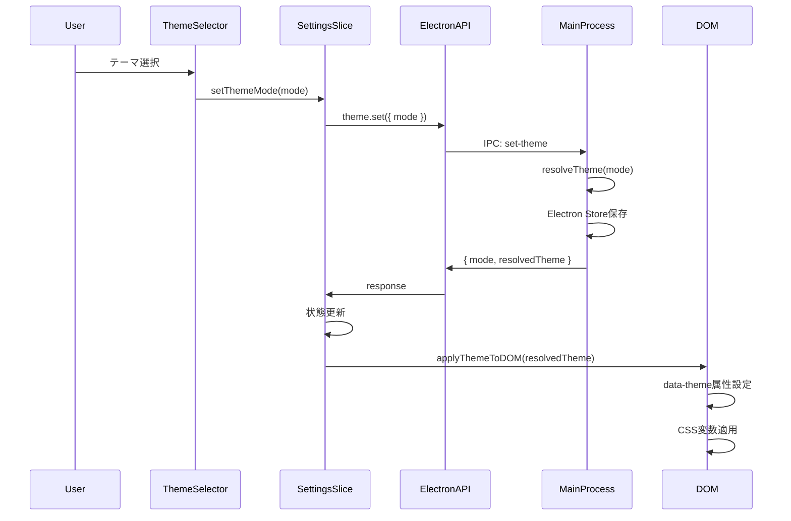

# 状態管理設計書

## メタ情報

| 項目         | 内容           |
| ------------ | -------------- |
| サブタスクID | T-01-3         |
| フェーズ     | Phase 1: 設計  |
| 作成日       | 2025-12-12     |
| 担当         | @state-manager |

---

## 1. 概要

### 1.1 目的

ThemeMode型を拡張し、Kanagawa Dragon/Wave/Lotusテーマをサポートする状態管理設計を行う。

### 1.2 現状分析

**現在の型定義** (`store/types.ts`):

```typescript
export type ThemeMode = "light" | "dark" | "system";
export type ResolvedTheme = "light" | "dark";
```

**課題**:

- Kanagawaテーマを表現できない
- ResolvedThemeが"light" | "dark"のみで、具体的なテーマバリエーションを識別できない

---

## 2. 型定義更新

### 2.1 ThemeMode型拡張

```typescript
/**
 * テーマモード
 * - kanagawa-dragon: Kanagawa Dragon（濃いダーク、デフォルト）
 * - kanagawa-wave: Kanagawa Wave（標準ダーク）
 * - kanagawa-lotus: Kanagawa Lotus（ライト）
 * - light: システムライトテーマ
 * - dark: システムダークテーマ
 * - system: OSの設定に追従
 */
export type ThemeMode =
  | "kanagawa-dragon"
  | "kanagawa-wave"
  | "kanagawa-lotus"
  | "light"
  | "dark"
  | "system";
```

### 2.2 ResolvedTheme型拡張

```typescript
/**
 * 解決済みテーマ（実際にDOMに適用されるテーマ）
 * systemモードの場合、OSの設定に基づいてkanagawa-dragonまたはkanagawa-lotusに解決
 */
export type ResolvedTheme =
  | "kanagawa-dragon"
  | "kanagawa-wave"
  | "kanagawa-lotus"
  | "light"
  | "dark";
```

### 2.3 テーマカテゴリ型（補助）

```typescript
/**
 * テーマのカラースキーム（CSS color-scheme用）
 */
export type ThemeColorScheme = "light" | "dark";

/**
 * テーマからカラースキームを取得
 */
export function getThemeColorScheme(theme: ResolvedTheme): ThemeColorScheme {
  switch (theme) {
    case "kanagawa-lotus":
    case "light":
      return "light";
    case "kanagawa-dragon":
    case "kanagawa-wave":
    case "dark":
    default:
      return "dark";
  }
}
```

---

## 3. 状態管理更新

### 3.1 settingsSlice更新

```typescript
export interface SettingsSlice {
  // 既存フィールド維持
  themeMode: ThemeMode;
  resolvedTheme: ResolvedTheme;

  // 既存アクション維持
  setThemeMode: (mode: ThemeMode) => Promise<void>;
  setResolvedTheme: (theme: ResolvedTheme) => void;
  initializeTheme: () => Promise<void>;
}
```

### 3.2 デフォルト値更新

```typescript
// 変更前
themeMode: "system",
resolvedTheme: "dark",

// 変更後
themeMode: "kanagawa-dragon",  // デフォルトをKanagawa Dragonに
resolvedTheme: "kanagawa-dragon",
```

### 3.3 applyThemeToDOM更新

```typescript
function applyThemeToDOM(resolvedTheme: ResolvedTheme): void {
  if (typeof document !== "undefined") {
    // Add transition class for smooth animation
    document.documentElement.classList.add("theme-transition");

    // Set data-theme attribute
    document.documentElement.setAttribute("data-theme", resolvedTheme);

    // Set color-scheme for native elements
    const colorScheme = getThemeColorScheme(resolvedTheme);
    document.documentElement.style.colorScheme = colorScheme;

    // Remove transition class after animation completes
    setTimeout(() => {
      document.documentElement.classList.remove("theme-transition");
    }, 300);
  }
}
```

### 3.4 systemモード解決ロジック更新

```typescript
// setThemeMode内のsystem解決ロジック
if (mode === "system") {
  // OSの設定に基づいてKanagawaテーマを選択
  const prefersDark =
    window.matchMedia?.("(prefers-color-scheme: dark)").matches ?? true;
  resolvedTheme = prefersDark ? "kanagawa-dragon" : "kanagawa-lotus";
}
```

---

## 4. Electron IPC更新

### 4.1 Main Process（theme.ts）更新

```typescript
// 型定義更新
interface ThemeData {
  mode: ThemeMode;
  resolvedTheme: ResolvedTheme;
}

// resolveTheme関数更新
function resolveTheme(mode: ThemeMode): ResolvedTheme {
  switch (mode) {
    case "kanagawa-dragon":
    case "kanagawa-wave":
    case "kanagawa-lotus":
    case "light":
    case "dark":
      return mode;
    case "system":
      // Electronのネイティブテーマ検出
      const isDark = nativeTheme.shouldUseDarkColors;
      return isDark ? "kanagawa-dragon" : "kanagawa-lotus";
    default:
      return "kanagawa-dragon";
  }
}
```

### 4.2 Preload API更新

型定義は自動的に更新されるため、変更不要。

---

## 5. 永続化戦略

### 5.1 Electron Store構造

```typescript
interface ThemeStore {
  themeMode: ThemeMode; // ユーザーが選択したモード
  // resolvedThemeは永続化しない（起動時に再計算）
}
```

### 5.2 永続化フロー

```
1. ユーザーがテーマを選択
2. setThemeMode(mode)が呼ばれる
3. Electron Store に themeMode を保存
4. resolvedTheme を計算
5. DOM に適用
6. 状態を更新
```

### 5.3 起動時復元フロー

```
1. アプリ起動
2. Electron Store から themeMode を読み込み
3. resolvedTheme を計算
4. DOM に適用
5. 状態を初期化
```

---

## 6. テーマ切り替えフロー

### 6.1 シーケンス図



### 6.2 フォールバック

```typescript
// ElectronAPIが利用不可の場合（ブラウザモード）
if (!window.electronAPI?.theme?.set) {
  // ローカル状態のみ更新
  const resolvedTheme = resolveThemeLocal(mode);
  set({ themeMode: mode, resolvedTheme });
  applyThemeToDOM(resolvedTheme);
  // localStorageに保存（オプション）
  localStorage.setItem("themeMode", mode);
}
```

---

## 7. ThemeSelector更新

### 7.1 オプション一覧

```typescript
const themeOptions: { value: ThemeMode; label: string; description: string }[] =
  [
    {
      value: "kanagawa-dragon",
      label: "Kanagawa Dragon",
      description: "濃いダークテーマ（デフォルト）",
    },
    {
      value: "kanagawa-wave",
      label: "Kanagawa Wave",
      description: "標準ダークテーマ",
    },
    {
      value: "kanagawa-lotus",
      label: "Kanagawa Lotus",
      description: "ライトテーマ",
    },
    {
      value: "light",
      label: "Light",
      description: "システムライト",
    },
    {
      value: "dark",
      label: "Dark",
      description: "システムダーク",
    },
    {
      value: "system",
      label: "System",
      description: "OSの設定に追従",
    },
  ];
```

### 7.2 UI設計

- ラジオボタングループでテーマを選択
- 各オプションにプレビューカラー表示（オプション）
- キーボードナビゲーション対応
- スクリーンリーダー対応

---

## 8. 完了条件チェックリスト

- [x] ThemeMode型拡張が設計されている
- [x] ResolvedTheme型拡張が設計されている
- [x] テーマ切り替えフローが定義されている
- [x] 永続化戦略が明確化されている
- [x] Electron IPC更新が設計されている
- [x] ThemeSelector更新が設計されている
- [x] フォールバック処理が設計されている
