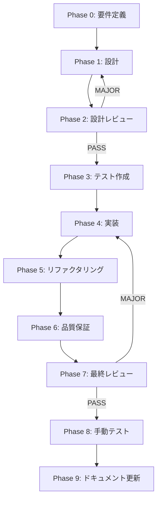

# Kanagawa Dragonテーマ システム全体適用 - タスク実行仕様書

## ユーザーからの元の指示

```
@docs/30-workflows/unassigned-task/task-kanagawa-theme-default.md これをシステム全体で実装してほしいです。
設定ファイルやら、今回のシステムである全ての画面、ログイン画面も含めて、これのテーマで実装してほしいです。
@.kamui/prompt/custom-prompt.txt この手順通りに進めてタスク仕様書を作成してから実装を進めてください。
dragonを設定してほしい。UI／UXとして最適な構成として。
```

## メタ情報

| 項目             | 内容                                   |
| ---------------- | -------------------------------------- |
| タスクID         | TASK-THEME-KANAGAWA-DRAGON-001         |
| タスク名         | Kanagawa Dragonテーマ システム全体適用 |
| 分類             | 改善                                   |
| 対象機能         | エディター・UI全体                     |
| 優先度           | 中                                     |
| 見積もり規模     | 中規模                                 |
| ステータス       | 実施中                                 |
| 発見元           | ユーザー要望                           |
| 発見日           | 2025-12-12                             |
| 発見エージェント | .claude/agents/product-manager.md                       |

---

## タスク概要

### 目的

Kanagawa Dragon配色テーマをデスクトップアプリケーションのデフォルトテーマとして実装し、システム全体（全画面、ログイン画面含む）の視認性と美しさを向上させる。

### 背景

Kanagawaは、Neovim発祥の人気配色テーマで、日本の浮世絵画家・葛飾北斎の「神奈川沖浪裏」にインスピレーションを受けた美しい配色が特徴。Dragonバリエーションはより濃い色調で、長時間のコーディングでも目に優しい。

**現状分析**:

- `packages/shared/ui/tokens/kanagawa.ts` にカラーパレットは定義済み
- CSS変数（`tokens.css`）への統合が未完了
- コンポーネントにハードコードされた色が存在（`bg-[#0a0a0a]`等）
- ThemeSelectorがWave/Dragon/Lotusをサポートしていない

### 最終ゴール

- Kanagawa DragonがデフォルトテーマとしてCSS変数に適用される
- 全画面（AuthView、Dashboard、Editor、Settings等）にテーマが適用される
- ハードコードされた色がCSS変数に置換される
- テーマ切り替え機能が正常に動作する（Dragon/Wave/Lotus/Light/System）
- WCAGコントラスト基準を満たす

### 成果物一覧

| 種別           | 成果物                           | 配置先                                                          |
| -------------- | -------------------------------- | --------------------------------------------------------------- |
| 設定           | CSS変数（Kanagawa Dragon）       | `apps/desktop/src/renderer/styles/tokens.css`                   |
| 設定           | Tailwind CSS拡張                 | `apps/desktop/tailwind.config.js`                               |
| コンポーネント | ThemeSelector更新                | `apps/desktop/src/renderer/components/molecules/ThemeSelector/` |
| 状態管理       | settingsSlice更新                | `apps/desktop/src/renderer/store/slices/settingsSlice.ts`       |
| 画面           | 各View更新（ハードコード色除去） | `apps/desktop/src/renderer/views/*/`                            |
| テスト         | テーマ切り替えテスト             | `apps/desktop/src/renderer/__tests__/`                          |
| ドキュメント   | 技術ドキュメント更新             | `docs/00-requirements/16-ui-ux-guidelines.md`                   |

---

## 参照ファイル

本仕様書のコマンド・エージェント・スキル選定は以下を参照：

- `docs/00-requirements/master_system_design.md` - システム要件
- `.claude/commands/ai/command_list.md` - /ai:コマンド定義
- `.claude/agents/agent_list.md` - エージェント定義
- `.claude/skills/skill_list.md` - スキル定義

---

## タスク分解サマリー

| ID     | フェーズ         | サブタスク名               | 責務                         | 依存   |
| ------ | ---------------- | -------------------------- | ---------------------------- | ------ |
| T-00-1 | 要件定義         | テーマ要件定義             | UI/UX要件の明確化            | なし   |
| T-01-1 | 設計             | CSS変数設計                | CSS変数体系の設計            | T-00-1 |
| T-01-2 | 設計             | コンポーネント適用設計     | 各コンポーネントの色置換計画 | T-01-1 |
| T-01-3 | 設計             | 状態管理設計               | テーマ切り替えロジック設計   | T-01-1 |
| T-02-1 | 設計レビュー     | 設計レビューゲート         | 設計の妥当性検証             | T-01-3 |
| T-03-1 | テスト作成       | テーマ切り替えテスト       | テーマ切り替え動作検証       | T-02-1 |
| T-03-2 | テスト作成       | コントラストテスト         | WCAG準拠検証                 | T-02-1 |
| T-04-1 | 実装             | CSS変数・tokens.css更新    | CSS変数の実装                | T-03-1 |
| T-04-2 | 実装             | Tailwind CSS設定更新       | Tailwind拡張                 | T-04-1 |
| T-04-3 | 実装             | settingsSlice更新          | 状態管理の実装               | T-04-2 |
| T-04-4 | 実装             | ThemeSelector更新          | テーマ選択UI実装             | T-04-3 |
| T-04-5 | 実装             | AuthView更新               | ログイン画面テーマ適用       | T-04-4 |
| T-04-6 | 実装             | 各View・コンポーネント更新 | 全画面テーマ適用             | T-04-5 |
| T-05-1 | リファクタリング | ハードコード色の完全除去   | コード品質改善               | T-04-6 |
| T-06-1 | 品質保証         | 自動テスト実行             | テスト成功確認               | T-05-1 |
| T-06-2 | 品質保証         | Lint・型チェック           | コード品質確認               | T-06-1 |
| T-07-1 | 最終レビュー     | 最終レビューゲート         | 全体品質検証                 | T-06-2 |
| T-08-1 | 手動テスト       | 手動テスト検証             | 実際のUI確認                 | T-07-1 |
| T-09-1 | ドキュメント     | ドキュメント更新           | 仕様書更新                   | T-08-1 |

**総サブタスク数**: 19個

---

## 実行フロー図



---

## Phase 0: 要件定義

### T-00-1: テーマ要件定義

#### 目的

Kanagawa Dragonテーマの適用範囲、カラーパレット、アクセシビリティ要件を明確化する。

#### 背景

既存の`kanagawa.ts`にカラーパレットは定義済みだが、システム全体への適用要件を整理する必要がある。

#### 責務（単一責務）

テーマ適用の要件定義のみを担当。

#### Claude Code スラッシュコマンド

> ⚠️ 以下はターミナルコマンドではなく、Claude Code内で実行するスラッシュコマンドです

```
/ai:gather-requirements kanagawa-dragon-theme
```

- **参照**: `.claude/commands/ai/command_list.md`

#### 使用エージェント

- **エージェント**: .claude/agents/req-analyst.md, .claude/agents/ui-designer.md
- **選定理由**: 要件定義には要求分析の専門性が必要、UIデザインの観点も重要
- **参照**: `.claude/agents/agent_list.md`

#### 活用スキル

| スキル名             | 活用方法                       |
| -------------------- | ------------------------------ |
| .claude/skills/accessibility-wcag/SKILL.md   | WCAGコントラスト基準の要件定義 |
| .claude/skills/apple-hig-guidelines/SKILL.md | デスクトップアプリのUI規約確認 |

- **参照**: `.claude/skills/skill_list.md`

#### 成果物

| 成果物     | パス                                                      | 内容           |
| ---------- | --------------------------------------------------------- | -------------- |
| 要件定義書 | `docs/30-workflows/kanagawa-dragon-theme/requirements.md` | テーマ要件文書 |

#### 完了条件

- [ ] カラーパレット要件が文書化されている
- [ ] 適用対象画面一覧が定義されている
- [ ] アクセシビリティ要件が明記されている

#### 依存関係

- **前提**: なし
- **後続**: T-01-1, T-01-2, T-01-3

---

## Phase 1: 設計

### T-01-1: CSS変数設計

#### 目的

Kanagawa Dragonカラーパレットを`tokens.css`のCSS変数として体系化する。

#### 背景

`kanagawa.ts`のTypeScript定義をCSS変数に変換し、`[data-theme="kanagawa-dragon"]`セレクタで適用できるようにする。

#### 責務（単一責務）

CSS変数の設計のみを担当。

#### Claude Code スラッシュコマンド

```
/ai:setup-design-system
```

- **参照**: `.claude/commands/ai/command_list.md`

#### 使用エージェント

- **エージェント**: .claude/agents/ui-designer.md
- **選定理由**: デザイントークンとCSS変数設計の専門性
- **参照**: `.claude/agents/agent_list.md`

#### 活用スキル

| スキル名                   | 活用方法                 |
| -------------------------- | ------------------------ |
| .claude/skills/tailwind-css-patterns/SKILL.md      | Tailwind CSS変数統合     |
| .claude/skills/design-system-architecture/SKILL.md | デザイントークン体系設計 |

- **参照**: `.claude/skills/skill_list.md`

#### 成果物

| 成果物        | パス                                                              | 内容                  |
| ------------- | ----------------------------------------------------------------- | --------------------- |
| CSS変数設計書 | `docs/30-workflows/kanagawa-dragon-theme/css-variables-design.md` | CSS変数マッピング設計 |

#### 完了条件

- [ ] 全カラー変数のマッピングが定義されている
- [ ] セマンティックカラー体系が設計されている
- [ ] 既存CSS変数との互換性が確認されている

#### 依存関係

- **前提**: T-00-1
- **後続**: T-01-2, T-01-3

---

### T-01-2: コンポーネント適用設計

#### 目的

各コンポーネントのハードコード色を特定し、CSS変数への置換計画を策定する。

#### 背景

AuthView、GlassPanel等にハードコードされた色（`bg-[#0a0a0a]`等）が存在する。

#### 責務（単一責務）

コンポーネント色置換の設計のみを担当。

#### Claude Code スラッシュコマンド

```
/ai:review-architecture src/renderer
```

- **参照**: `.claude/commands/ai/command_list.md`

#### 使用エージェント

- **エージェント**: .claude/agents/ui-designer.md, .claude/agents/arch-police.md
- **選定理由**: UIコンポーネント設計とアーキテクチャ整合性の検証
- **参照**: `.claude/agents/agent_list.md`

#### 活用スキル

| スキル名                       | 活用方法                   |
| ------------------------------ | -------------------------- |
| .claude/skills/component-composition-patterns/SKILL.md | コンポーネント設計パターン |
| .claude/skills/code-smell-detection/SKILL.md           | ハードコード色の検出       |

- **参照**: `.claude/skills/skill_list.md`

#### 成果物

| 成果物             | パス                                                           | 内容                 |
| ------------------ | -------------------------------------------------------------- | -------------------- |
| コンポーネント設計 | `docs/30-workflows/kanagawa-dragon-theme/component-mapping.md` | 色置換マッピング一覧 |

#### 完了条件

- [ ] ハードコード色一覧が作成されている
- [ ] 各色のCSS変数マッピングが定義されている
- [ ] 置換優先順位が決定されている

#### 依存関係

- **前提**: T-01-1
- **後続**: T-02-1

---

### T-01-3: 状態管理設計

#### 目的

ThemeMode型の拡張とテーマ切り替えロジックを設計する。

#### 背景

現在のThemeModeは`"light" | "dark" | "system"`のみ。Kanagawaバリエーションを追加する。

#### 責務（単一責務）

テーマ状態管理の設計のみを担当。

#### Claude Code スラッシュコマンド

```
/ai:setup-state-management
```

- **参照**: `.claude/commands/ai/command_list.md`

#### 使用エージェント

- **エージェント**: .claude/agents/state-manager.md
- **選定理由**: React状態管理の専門性
- **参照**: `.claude/agents/agent_list.md`

#### 活用スキル

| スキル名             | 活用方法         |
| -------------------- | ---------------- |
| .claude/skills/state-lifting/SKILL.md        | 状態管理設計     |
| .claude/skills/type-safety-patterns/SKILL.md | TypeScript型定義 |

- **参照**: `.claude/skills/skill_list.md`

#### 成果物

| 成果物         | パス                                                                 | 内容         |
| -------------- | -------------------------------------------------------------------- | ------------ |
| 状態管理設計書 | `docs/30-workflows/kanagawa-dragon-theme/state-management-design.md` | 状態管理設計 |

#### 完了条件

- [ ] ThemeMode型拡張が設計されている
- [ ] テーマ切り替えフローが定義されている
- [ ] 永続化戦略が明確化されている

#### 依存関係

- **前提**: T-01-1
- **後続**: T-02-1

---

## Phase 2: 設計レビューゲート

### T-02-1: 設計レビューゲート

#### 目的

実装開始前に設計の妥当性を検証する。

#### 背景

設計ミスが実装後に発見されると修正コストが大幅に増加する。

#### レビュー参加エージェント

| エージェント  | レビュー観点         | 選定理由                   |
| ------------- | -------------------- | -------------------------- |
| .claude/agents/arch-police.md  | アーキテクチャ整合性 | Clean Architecture準拠確認 |
| .claude/agents/ui-designer.md  | UI/UX設計            | デザインシステム整合性     |
| .claude/agents/code-quality.md | コード品質           | 保守性・可読性確認         |

- **参照**: `.claude/agents/agent_list.md`

#### レビューチェックリスト

**アーキテクチャ整合性** (.claude/agents/arch-police.md)

- [ ] CSS変数設計がレイヤー構造に違反していないか
- [ ] 依存関係が適切か

**UI/UX設計** (.claude/agents/ui-designer.md)

- [ ] WCAGコントラスト基準を満たしているか
- [ ] デザイントークン体系が一貫しているか

**コード品質** (.claude/agents/code-quality.md)

- [ ] 命名規則が統一されているか
- [ ] 重複がないか

#### レビュー結果

- **判定**: PASS / MINOR / MAJOR
- **指摘事項**: （レビュー時に記載）
- **対応方針**: （レビュー時に記載）

#### 戻り先決定（MAJORの場合）

| 問題の種類 | 戻り先  |
| ---------- | ------- |
| 要件の問題 | Phase 0 |
| 設計の問題 | Phase 1 |

#### 完了条件

- [ ] 全レビュー観点でPASSまたはMINOR
- [ ] MINOR指摘は対応済み

#### 依存関係

- **前提**: T-01-3
- **後続**: T-03-1, T-03-2

---

## Phase 3: テスト作成 (TDD: Red)

### T-03-1: テーマ切り替えテスト

#### 目的

テーマ切り替え機能のテストを実装より先に作成する。

#### 背景

TDD原則に基づき、期待動作を先に定義する。

#### 責務（単一責務）

テーマ切り替えテストの作成のみを担当。

#### Claude Code スラッシュコマンド

```
/ai:generate-unit-tests apps/desktop/src/renderer/store/slices/settingsSlice.ts
```

- **参照**: `.claude/commands/ai/command_list.md`

#### 使用エージェント

- **エージェント**: .claude/agents/unit-tester.md
- **選定理由**: ユニットテスト作成の専門性
- **参照**: `.claude/agents/agent_list.md`

#### 活用スキル

| スキル名        | 活用方法           |
| --------------- | ------------------ |
| .claude/skills/tdd-principles/SKILL.md  | Red-Green-Refactor |
| .claude/skills/vitest-advanced/SKILL.md | Vitestテスト作成   |

- **参照**: `.claude/skills/skill_list.md`

#### 成果物

| 成果物         | パス                                                | 内容                 |
| -------------- | --------------------------------------------------- | -------------------- |
| テストファイル | `apps/desktop/src/renderer/__tests__/theme.test.ts` | テーマ切り替えテスト |

#### TDD検証: Red状態確認

```bash
pnpm --filter @repo/desktop test:run
```

- [ ] テストが失敗することを確認（Red状態）

#### 完了条件

- [ ] テーマ切り替えテストが作成されている
- [ ] テストが失敗することを確認

#### 依存関係

- **前提**: T-02-1
- **後続**: T-04-1

---

### T-03-2: コントラストテスト

#### 目的

WCAGコントラスト基準のテストを作成する。

#### 背景

アクセシビリティ要件を自動検証できるようにする。

#### 責務（単一責務）

コントラストテストの作成のみを担当。

#### Claude Code スラッシュコマンド

```
/ai:run-accessibility-audit --scope all --wcag-level AA
```

- **参照**: `.claude/commands/ai/command_list.md`

#### 使用エージェント

- **エージェント**: .claude/agents/frontend-tester.md
- **選定理由**: アクセシビリティテストの専門性
- **参照**: `.claude/agents/agent_list.md`

#### 活用スキル

| スキル名           | 活用方法       |
| ------------------ | -------------- |
| .claude/skills/accessibility-wcag/SKILL.md | WCAG準拠テスト |

- **参照**: `.claude/skills/skill_list.md`

#### 成果物

| 成果物         | パス                                                   | 内容               |
| -------------- | ------------------------------------------------------ | ------------------ |
| テストファイル | `apps/desktop/src/renderer/__tests__/contrast.test.ts` | コントラストテスト |

#### TDD検証: Red状態確認

```bash
pnpm --filter @repo/desktop test:run
```

- [ ] テストが失敗することを確認（Red状態）

#### 完了条件

- [ ] コントラストテストが作成されている
- [ ] テストが失敗することを確認

#### 依存関係

- **前提**: T-02-1
- **後続**: T-04-1

---

## Phase 4: 実装 (TDD: Green)

### T-04-1: CSS変数・tokens.css更新

#### 目的

Kanagawa DragonのCSS変数を`tokens.css`に実装する。

#### 背景

設計に基づき、CSS変数を追加する。

#### 責務（単一責務）

CSS変数の実装のみを担当。

#### Claude Code スラッシュコマンド

```
/ai:setup-design-system
```

- **参照**: `.claude/commands/ai/command_list.md`

#### 使用エージェント

- **エージェント**: .claude/agents/ui-designer.md
- **選定理由**: デザイントークン実装の専門性
- **参照**: `.claude/agents/agent_list.md`

#### 活用スキル

| スキル名              | 活用方法    |
| --------------------- | ----------- |
| .claude/skills/tailwind-css-patterns/SKILL.md | CSS変数実装 |

- **参照**: `.claude/skills/skill_list.md`

#### 成果物

| 成果物  | パス                                          | 内容        |
| ------- | --------------------------------------------- | ----------- |
| CSS更新 | `apps/desktop/src/renderer/styles/tokens.css` | CSS変数追加 |

#### TDD検証: Green状態確認

```bash
pnpm --filter @repo/desktop test:run
```

- [ ] テストが成功することを確認（Green状態）

#### 完了条件

- [ ] `[data-theme="kanagawa-dragon"]`セレクタが追加されている
- [ ] 全カラー変数が定義されている

#### 依存関係

- **前提**: T-03-1, T-03-2
- **後続**: T-04-2

---

### T-04-2: Tailwind CSS設定更新

#### 目的

Tailwind CSSにKanagawaカラーを拡張する。

#### 背景

Tailwindユーティリティクラスでもテーマカラーを使用できるようにする。

#### 責務（単一責務）

Tailwind設定の更新のみを担当。

#### Claude Code スラッシュコマンド

```
/ai:setup-design-system
```

- **参照**: `.claude/commands/ai/command_list.md`

#### 使用エージェント

- **エージェント**: .claude/agents/ui-designer.md
- **選定理由**: Tailwind CSS設定の専門性
- **参照**: `.claude/agents/agent_list.md`

#### 成果物

| 成果物       | パス                              | 内容       |
| ------------ | --------------------------------- | ---------- |
| Tailwind設定 | `apps/desktop/tailwind.config.js` | カラー拡張 |

#### TDD検証: Green状態確認

```bash
pnpm --filter @repo/desktop test:run
```

- [ ] テストが成功することを確認（Green状態）

#### 完了条件

- [ ] Kanagawaカラーが拡張されている
- [ ] ビルドが成功する

#### 依存関係

- **前提**: T-04-1
- **後続**: T-04-3

---

### T-04-3: settingsSlice更新

#### 目的

ThemeMode型を拡張し、Kanagawaテーマをサポートする。

#### 背景

状態管理にKanagawaバリエーションを追加する。

#### 責務（単一責務）

状態管理の更新のみを担当。

#### Claude Code スラッシュコマンド

```
/ai:setup-state-management
```

- **参照**: `.claude/commands/ai/command_list.md`

#### 使用エージェント

- **エージェント**: .claude/agents/state-manager.md
- **選定理由**: Zustand状態管理の専門性
- **参照**: `.claude/agents/agent_list.md`

#### 成果物

| 成果物       | パス                                                      | 内容          |
| ------------ | --------------------------------------------------------- | ------------- |
| 状態管理更新 | `apps/desktop/src/renderer/store/slices/settingsSlice.ts` | ThemeMode拡張 |

#### TDD検証: Green状態確認

```bash
pnpm --filter @repo/desktop test:run
```

- [ ] テストが成功することを確認（Green状態）

#### 完了条件

- [ ] ThemeModeにkanagawa-dragonが追加されている
- [ ] applyThemeToDOMが新テーマをサポートしている
- [ ] デフォルトテーマがkanagawa-dragonに設定されている

#### 依存関係

- **前提**: T-04-2
- **後続**: T-04-4

---

### T-04-4: ThemeSelector更新

#### 目的

ThemeSelectorコンポーネントにKanagawaバリエーションを追加する。

#### 背景

ユーザーがテーマを選択できるUIを提供する。

#### 責務（単一責務）

ThemeSelectorの更新のみを担当。

#### Claude Code スラッシュコマンド

```
/ai:create-component ThemeSelector molecule
```

- **参照**: `.claude/commands/ai/command_list.md`

#### 使用エージェント

- **エージェント**: .claude/agents/ui-designer.md
- **選定理由**: UIコンポーネント実装の専門性
- **参照**: `.claude/agents/agent_list.md`

#### 成果物

| 成果物         | パス                                                                     | 内容             |
| -------------- | ------------------------------------------------------------------------ | ---------------- |
| コンポーネント | `apps/desktop/src/renderer/components/molecules/ThemeSelector/index.tsx` | テーマ選択UI更新 |

#### TDD検証: Green状態確認

```bash
pnpm --filter @repo/desktop test:run
```

- [ ] テストが成功することを確認（Green状態）

#### 完了条件

- [ ] Kanagawa Wave/Dragon/Lotusオプションが追加されている
- [ ] キーボードナビゲーションが動作する
- [ ] アクセシビリティが確保されている

#### 依存関係

- **前提**: T-04-3
- **後続**: T-04-5

---

### T-04-5: AuthView更新

#### 目的

ログイン画面にKanagawa Dragonテーマを適用する。

#### 背景

AuthViewにハードコードされた色（`bg-[#0a0a0a]`等）をCSS変数に置換する。

#### 責務（単一責務）

AuthViewのテーマ適用のみを担当。

#### Claude Code スラッシュコマンド

```
/ai:refactor apps/desktop/src/renderer/views/AuthView/index.tsx
```

- **参照**: `.claude/commands/ai/command_list.md`

#### 使用エージェント

- **エージェント**: .claude/agents/ui-designer.md
- **選定理由**: UIコンポーネントリファクタリングの専門性
- **参照**: `.claude/agents/agent_list.md`

#### 成果物

| 成果物   | パス                                                 | 内容       |
| -------- | ---------------------------------------------------- | ---------- |
| View更新 | `apps/desktop/src/renderer/views/AuthView/index.tsx` | テーマ適用 |

#### TDD検証: Green状態確認

```bash
pnpm --filter @repo/desktop test:run
```

- [ ] テストが成功することを確認（Green状態）

#### 完了条件

- [ ] ハードコード色がCSS変数に置換されている
- [ ] テーマ切り替えで正しく色が変わる

#### 依存関係

- **前提**: T-04-4
- **後続**: T-04-6

---

### T-04-6: 各View・コンポーネント更新

#### 目的

全画面・コンポーネントにKanagawa Dragonテーマを適用する。

#### 背景

Dashboard、Editor、Settings、GlassPanel等すべてにテーマを適用する。

#### 責務（単一責務）

各View・コンポーネントのテーマ適用のみを担当。

#### Claude Code スラッシュコマンド

```
/ai:refactor apps/desktop/src/renderer/views
```

- **参照**: `.claude/commands/ai/command_list.md`

#### 使用エージェント

- **エージェント**: .claude/agents/ui-designer.md
- **選定理由**: UIコンポーネント一括リファクタリングの専門性
- **参照**: `.claude/agents/agent_list.md`

#### 成果物

| 成果物             | パス                                              | 内容                   |
| ------------------ | ------------------------------------------------- | ---------------------- |
| View更新           | `apps/desktop/src/renderer/views/*/`              | 全画面テーマ適用       |
| コンポーネント更新 | `apps/desktop/src/renderer/components/organisms/` | GlassPanel等テーマ適用 |
| App.tsx更新        | `apps/desktop/src/renderer/App.tsx`               | ルート背景テーマ適用   |

#### TDD検証: Green状態確認

```bash
pnpm --filter @repo/desktop test:run
```

- [ ] テストが成功することを確認（Green状態）

#### 完了条件

- [ ] 全ViewがCSS変数を使用している
- [ ] GlassPanelがテーマ対応している
- [ ] App.tsxの背景がCSS変数を使用している

#### 依存関係

- **前提**: T-04-5
- **後続**: T-05-1

---

## Phase 5: リファクタリング (TDD: Refactor)

### T-05-1: ハードコード色の完全除去

#### 目的

残存するハードコード色を完全に除去する。

#### 背景

Phase 4で対応漏れがないか最終確認し、コード品質を改善する。

#### 責務（単一責務）

ハードコード色の完全除去のみを担当。

#### Claude Code スラッシュコマンド

```
/ai:analyze-code-quality apps/desktop/src/renderer
```

- **参照**: `.claude/commands/ai/command_list.md`

#### 使用エージェント

- **エージェント**: .claude/agents/code-quality.md
- **選定理由**: コード品質分析の専門性
- **参照**: `.claude/agents/agent_list.md`

#### 活用スキル

| スキル名             | 活用方法         |
| -------------------- | ---------------- |
| .claude/skills/code-smell-detection/SKILL.md | ハードコード検出 |
| .claude/skills/clean-code-practices/SKILL.md | リファクタリング |

- **参照**: `.claude/skills/skill_list.md`

#### 成果物

| 成果物         | パス                         | 内容             |
| -------------- | ---------------------------- | ---------------- |
| リファクタ完了 | `apps/desktop/src/renderer/` | ハードコード除去 |

#### TDD検証: 継続Green確認

```bash
pnpm --filter @repo/desktop test:run
```

- [ ] リファクタリング後もテストが成功することを確認

#### 完了条件

- [ ] `#[0-9a-fA-F]{3,8}`パターンのハードコードがないか確認
- [ ] `rgba()`のハードコードがないか確認
- [ ] テストが継続して成功する

#### 依存関係

- **前提**: T-04-6
- **後続**: T-06-1

---

## Phase 6: 品質保証

### T-06-1: 自動テスト実行

#### 目的

全テストスイートを実行し、品質を確認する。

#### Claude Code スラッシュコマンド

```
/ai:run-all-tests --coverage
```

- **参照**: `.claude/commands/ai/command_list.md`

#### 使用エージェント

- **エージェント**: .claude/agents/unit-tester.md, .claude/agents/frontend-tester.md
- **選定理由**: テスト実行の専門性
- **参照**: `.claude/agents/agent_list.md`

#### 成果物

| 成果物     | パス        | 内容               |
| ---------- | ----------- | ------------------ |
| テスト結果 | `coverage/` | カバレッジレポート |

#### 完了条件

- [ ] 全テストがPASS
- [ ] カバレッジ基準達成

#### 依存関係

- **前提**: T-05-1
- **後続**: T-06-2

---

### T-06-2: Lint・型チェック

#### 目的

ESLint/TypeScriptエラーがないことを確認する。

#### Claude Code スラッシュコマンド

```
/ai:lint --fix
```

- **参照**: `.claude/commands/ai/command_list.md`

#### 使用エージェント

- **エージェント**: .claude/agents/code-quality.md
- **選定理由**: コード品質確認の専門性
- **参照**: `.claude/agents/agent_list.md`

#### 成果物

| 成果物     | パス | 内容           |
| ---------- | ---- | -------------- |
| Lintクリア | -    | エラーなし確認 |

#### 完了条件

- [ ] Lintエラーなし
- [ ] 型エラーなし

#### 依存関係

- **前提**: T-06-1
- **後続**: T-07-1

---

## 品質ゲートチェックリスト

### 機能検証

- [ ] 全ユニットテスト成功
- [ ] 全統合テスト成功
- [ ] 全E2Eテスト成功

### コード品質

- [ ] Lintエラーなし
- [ ] 型エラーなし
- [ ] コードフォーマット適用済み

### テスト網羅性

- [ ] カバレッジ基準達成

### セキュリティ

- [ ] 脆弱性スキャン完了
- [ ] 重大な脆弱性なし

---

## Phase 7: 最終レビューゲート

### T-07-1: 最終レビューゲート

#### 目的

実装完了後の全体的な品質・整合性を検証する。

#### レビュー参加エージェント

| エージェント     | レビュー観点       | 選定理由                 |
| ---------------- | ------------------ | ------------------------ |
| .claude/agents/code-quality.md    | コード品質         | コーディング規約準拠確認 |
| .claude/agents/arch-police.md     | アーキテクチャ遵守 | 設計との整合性確認       |
| .claude/agents/ui-designer.md     | UI/UX品質          | デザイン整合性確認       |
| .claude/agents/frontend-tester.md | テスト品質         | テストカバレッジ確認     |

- **参照**: `.claude/agents/agent_list.md`

#### レビューチェックリスト

**コード品質** (.claude/agents/code-quality.md)

- [ ] コーディング規約への準拠
- [ ] 可読性・保守性の確保
- [ ] 適切なエラーハンドリング

**アーキテクチャ遵守** (.claude/agents/arch-police.md)

- [ ] 実装がアーキテクチャ設計に従っているか
- [ ] レイヤー間の依存関係が適切か

**UI/UX品質** (.claude/agents/ui-designer.md)

- [ ] アクセシビリティ(WCAG)への準拠
- [ ] デザインシステムとの整合性

**テスト品質** (.claude/agents/frontend-tester.md)

- [ ] テストカバレッジが十分か
- [ ] テストケースが適切に設計されているか

#### レビュー結果

- **判定**: PASS / MINOR / MAJOR / CRITICAL
- **指摘事項**: （レビュー時に記載）
- **対応方針**: （レビュー時に記載）

#### 戻り先決定（MAJOR/CRITICALの場合）

| 問題の種類       | 戻り先  |
| ---------------- | ------- |
| 要件の問題       | Phase 0 |
| 設計の問題       | Phase 1 |
| テスト設計の問題 | Phase 3 |
| 実装の問題       | Phase 4 |
| コード品質の問題 | Phase 5 |

#### 完了条件

- [ ] 全レビュー観点でPASSまたはMINOR
- [ ] MINOR指摘は対応済み

#### 依存関係

- **前提**: T-06-2
- **後続**: T-08-1

---

## Phase 8: 手動テスト検証

### T-08-1: 手動テスト検証

#### 目的

自動テストでは検証できないユーザー体験・UI/UXを手動で確認する。

#### テスト分類

機能テスト / UI・UXテスト

#### 使用エージェント

- **エージェント**: .claude/agents/frontend-tester.md
- **選定理由**: フロントエンドテストの専門性
- **参照**: `.claude/agents/agent_list.md`

#### 手動テストケース

| No  | カテゴリ   | テスト項目       | 前提条件       | 操作手順           | 期待結果                    | 実行結果 | 備考 |
| --- | ---------- | ---------------- | -------------- | ------------------ | --------------------------- | -------- | ---- |
| 1   | 背景       | エディター背景色 | アプリ起動済み | エディターを開く   | Dragon背景色(#12120F)が適用 |          |      |
| 2   | テキスト   | メインテキスト色 | アプリ起動済み | テキストを確認     | Dragon白(#C5C9C5)が適用     |          |      |
| 3   | UI         | ログイン画面配色 | 未ログイン状態 | ログイン画面を表示 | Dragonテーマが適用          |          |      |
| 4   | UI         | GlassPanel配色   | アプリ起動済み | GlassPanelを確認   | Dragonガラス効果が適用      |          |      |
| 5   | UI         | サイドバー配色   | アプリ起動済み | サイドバーを確認   | テーマに沿った配色          |          |      |
| 6   | テーマ切替 | Dragon → Wave    | 設定画面       | 設定でWaveに切替   | Wave配色に変更              |          |      |
| 7   | テーマ切替 | Dragon → Lotus   | 設定画面       | 設定でLotusに切替  | Lotus（ライト）配色に変更   |          |      |
| 8   | テーマ切替 | テーマ永続化     | テーマ変更後   | アプリを再起動     | 選択したテーマが維持        |          |      |
| 9   | 視認性     | コントラスト     | アプリ起動済み | 各テキストを確認   | 文字が読みやすい            |          |      |
| 10  | ステータス | エラー表示       | エラー発生時   | エラーを発生させる | samuraiRed(#E82424)で表示   |          |      |
| 11  | ステータス | 成功表示         | 成功時         | 成功操作を実行     | dragonGreen(#87A987)で表示  |          |      |
| 12  | ボタン     | ホバー状態       | アプリ起動済み | ボタンにホバー     | 適切なホバー色が表示        |          |      |

#### 成果物

| 成果物     | パス                                                             | 内容           |
| ---------- | ---------------------------------------------------------------- | -------------- |
| テスト結果 | `docs/30-workflows/kanagawa-dragon-theme/manual-test-results.md` | 手動テスト結果 |

#### 完了条件

- [ ] すべての手動テストケースが実行済み
- [ ] すべてのテストケースがPASS
- [ ] 発見された不具合が修正済み

#### 依存関係

- **前提**: T-07-1
- **後続**: T-09-1

---

## Phase 9: ドキュメント更新・未完了タスク記録

### T-09-1: ドキュメント更新

#### 目的

タスク完了後、実装した内容をシステム要件ドキュメントに反映する。

#### 前提条件

- [ ] Phase 6の品質ゲートをすべて通過
- [ ] Phase 7の最終レビューゲートを通過
- [ ] Phase 8の手動テストが完了
- [ ] すべてのテストが成功

---

#### サブタスク 9.1: システムドキュメント更新

##### 更新対象ドキュメント

- `docs/00-requirements/16-ui-ux-guidelines.md` - Kanagawa Dragonテーマの追記

##### Claude Code スラッシュコマンド

```
/ai:update-all-docs
```

- **参照**: `.claude/commands/ai/command_list.md`

##### 使用エージェント

- **エージェント**: .claude/agents/spec-writer.md
- **選定理由**: 技術ドキュメント作成の専門性
- **参照**: `.claude/agents/agent_list.md`

##### 更新原則

- 概要のみ記載（詳細な実装説明は不要）
- システム構築に必要十分な情報のみ追記
- 既存ドキュメントの構造・フォーマットを維持
- Single Source of Truth原則を遵守

---

#### 完了条件

- [ ] UI/UXガイドラインにKanagawa Dragonテーマが記載されている
- [ ] CSS変数体系が文書化されている
- [ ] テーマ切り替え方法が文書化されている

---

## リスクと対策

| リスク               | 影響度 | 発生確率 | 対策                         | 対応サブタスク |
| -------------------- | ------ | -------- | ---------------------------- | -------------- |
| コントラスト不足     | 高     | 中       | WCAGガイドラインに基づく検証 | T-03-2         |
| 既存UIとの整合性問題 | 中     | 中       | 段階的な適用、レビュー       | T-02-1, T-07-1 |
| ハードコード色の漏れ | 中     | 中       | grep検索で網羅的確認         | T-05-1         |
| テーマ永続化の不具合 | 中     | 低       | 単体テストで検証             | T-03-1         |

---

## 前提条件

- プロジェクトの開発環境がセットアップ済み
- Tailwind CSSが設定済み
- `packages/shared/ui/tokens/kanagawa.ts`が存在
- Zustand状態管理が実装済み

---

## 備考

### 技術的制約

- CSS変数は`[data-theme="xxx"]`セレクタで切り替え
- Electron safeStorageでテーマ設定を永続化
- Tailwind JITモードでCSS変数を参照

### 参考資料

- [Kanagawa VSCode Theme](https://github.com/metapho-re/kanagawa-vscode-theme)
- [Kanagawa Neovim](https://github.com/rebelot/kanagawa.nvim)
- [WCAG Color Contrast](https://www.w3.org/WAI/WCAG21/Understanding/contrast-minimum.html)
