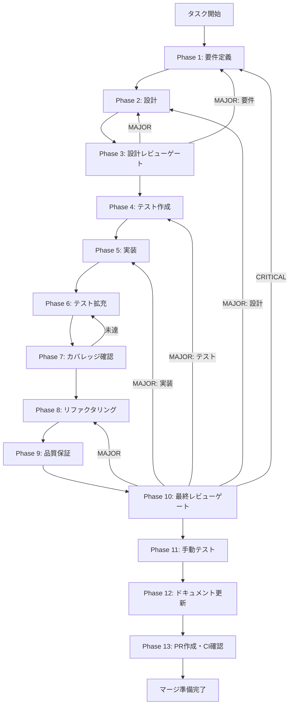

# knowledge-graph-migration - タスク実行仕様書

## ユーザーからの元の指示

```
Knowledge Graph マイグレーション生成・適用
```

## メタ情報

| 項目         | 内容                                        |
| ------------ | ------------------------------------------- |
| タスクID     | CONV-04-06                                  |
| タスク名     | knowledge-graph-migration                   |
| 分類         | 要件                                        |
| 対象機能     | Knowledge Graph テーブル群                  |
| 優先度       | 高                                          |
| 見積もり規模 | 小規模                                      |
| ステータス   | 未実施                                      |
| 作成日       | 2026-01-12                                  |
| 発見元       | Phase 8 最終レビュー                        |
| 前提タスク   | CONV-04-05（Knowledge Graphテーブル群実装） |

---

## タスク概要

### 目的

Knowledge Graphテーブル群のマイグレーションファイルを生成し、データベースに適用可能な状態にする。

### 背景

CONV-04-05でKnowledge Graphテーブル群のDrizzle ORMスキーマ定義が完了した。
スキーマ定義は完了しているが、実際のデータベースにテーブルを作成するためのマイグレーションファイルがまだ生成されていない。
後続のKnowledge Graph Store実装（CONV-08-01）がブロックされている状態。

### 最終ゴール

- Drizzle Kitによるマイグレーションファイルが生成されている
- マイグレーションがローカル開発環境に適用されている
- 全6テーブル（entities, relations, relation_evidence, communities, entity_communities, chunk_entities）がSQLiteデータベースに存在することが確認されている
- 外部キー制約が正しく設定されている

### 成果物一覧

| 種別             | 成果物                      | 配置先                                    |
| ---------------- | --------------------------- | ----------------------------------------- |
| マイグレーション | マイグレーションSQLファイル | `packages/shared/src/db/migrations/*.sql` |
| テスト           | マイグレーション検証テスト  | `packages/shared/src/db/**/*.test.ts`     |
| ドキュメント     | 各Phase成果物               | `outputs/phase-*/`                        |
| PR               | GitHub Pull Request         | GitHub UI                                 |

---

## 参照ファイル

本仕様書の作成は以下を参照：

| 資料名         | パス                                                                           | 内容                         |
| -------------- | ------------------------------------------------------------------------------ | ---------------------------- |
| システム仕様書 | `.claude/skills/aiworkflow-requirements/references/database-implementation.md` | DB実装・マイグレーション仕様 |
| スキーマ仕様   | `.claude/skills/aiworkflow-requirements/references/database-schema.md`         | Knowledge Graphテーブル定義  |
| 元タスク指示書 | `docs/30-workflows/unassigned-task/task-knowledge-graph-migration.md`          | 元の未タスク指示書           |

---

## タスク分解サマリー

| ID     | フェーズ | サブタスク名     | 責務                           | 依存 |
| ------ | -------- | ---------------- | ------------------------------ | ---- |
| T-01-1 | Phase 1  | 要件抽出         | マイグレーション要件の明確化   | -    |
| T-02-1 | Phase 2  | 設計             | drizzle.config.ts確認・設計    | T-01 |
| T-03-1 | Phase 3  | 設計レビュー     | 設計の妥当性検証               | T-02 |
| T-04-1 | Phase 4  | テスト作成       | マイグレーション検証テスト作成 | T-03 |
| T-05-1 | Phase 5  | 実装             | マイグレーション生成・適用     | T-04 |
| T-06-1 | Phase 6  | テスト拡充       | テストカバレッジ拡充           | T-05 |
| T-07-1 | Phase 7  | カバレッジ確認   | テストカバレッジ確認           | T-06 |
| T-08-1 | Phase 8  | リファクタリング | コード品質改善                 | T-07 |
| T-09-1 | Phase 9  | 品質保証         | 品質ゲートクリア確認           | T-08 |
| T-10-1 | Phase 10 | 最終レビュー     | 全体品質・整合性検証           | T-09 |
| T-11-1 | Phase 11 | 手動テスト       | 手動検証                       | T-10 |
| T-12-1 | Phase 12 | ドキュメント更新 | 実装ガイド・仕様更新           | T-11 |
| T-13-1 | Phase 13 | PR作成           | コミット・PR・CI確認           | T-12 |

**総サブタスク数**: 13個

---

## 実行フロー図



---

## Phase一覧

| Phase | 名称               | 仕様書                                                 | ステータス |
| ----- | ------------------ | ------------------------------------------------------ | ---------- |
| 1     | 要件定義           | [phase-1-requirements.md](phase-1-requirements.md)     | 未実施     |
| 2     | 設計               | [phase-2-design.md](phase-2-design.md)                 | 未実施     |
| 3     | 設計レビューゲート | [phase-3-design-review.md](phase-3-design-review.md)   | 未実施     |
| 4     | テスト作成         | [phase-4-test-creation.md](phase-4-test-creation.md)   | 未実施     |
| 5     | 実装               | [phase-5-implementation.md](phase-5-implementation.md) | 未実施     |
| 6     | テスト拡充         | [phase-6-test-expansion.md](phase-6-test-expansion.md) | 未実施     |
| 7     | カバレッジ確認     | [phase-7-coverage-check.md](phase-7-coverage-check.md) | 未実施     |
| 8     | リファクタリング   | [phase-8-refactoring.md](phase-8-refactoring.md)       | 未実施     |
| 9     | 品質保証           | [phase-9-quality.md](phase-9-quality.md)               | 未実施     |
| 10    | 最終レビューゲート | [phase-10-final-review.md](phase-10-final-review.md)   | 未実施     |
| 11    | 手動テスト         | [phase-11-manual-test.md](phase-11-manual-test.md)     | 未実施     |
| 12    | ドキュメント更新   | [phase-12-documentation.md](phase-12-documentation.md) | 未実施     |
| 13    | PR作成             | [phase-13-pr-creation.md](phase-13-pr-creation.md)     | 未実施     |

---

## テストカバレッジ目標

### ユニットテスト

| 指標              | 最低基準 | 推奨基準 |
| ----------------- | -------- | -------- |
| Line Coverage     | 80%      | 90%      |
| Branch Coverage   | 60%      | 70%      |
| Function Coverage | 80%      | 90%      |

### 結合テスト

| 指標                 | 目標 |
| -------------------- | ---- |
| マイグレーション適用 | 100% |
| テーブル作成確認     | 100% |
| 外部キー制約確認     | 100% |
| インデックス確認     | 100% |

---

## 統合テスト連携（Phase 1〜11で必須）

各Phaseで以下の統合テスト連携アクションを実施すること:

| Phase | 統合テスト連携アクション                                       |
| ----- | -------------------------------------------------------------- |
| 1     | 接続要件（DB接続・マイグレーション適用）を要件に明記           |
| 2     | 統合ポイント/契約（drizzle.config.ts設定）を設計に反映         |
| 3     | 統合テスト観点のレビューゲートを実施                           |
| 4     | 統合テストシナリオを作成（マイグレーション適用・テーブル確認） |
| 5     | マイグレーション生成・適用の実装                               |
| 6     | 統合テストの拡充（外部キー・インデックス検証）                 |
| 7     | 統合テストの再実行とゲート判定                                 |
| 8     | リファクタ後の統合テスト継続成功を確認                         |
| 9     | 品質保証で統合テスト結果を確認                                 |
| 10    | 最終レビューで統合テスト結果を確認                             |
| 11    | 手動統合テスト（SQLiteスキーマ確認）を実施                     |

---

## Phase完了時の必須アクション

**各Phase完了時に以下を必ず実行すること:**

1. **タスク100%実行**: Phase内で指定された全タスクを完全に実行
2. **成果物確認**: 全ての必須成果物が生成されていることを検証
3. **実行記録**: 実行タスクの結果を記録
4. **artifacts.json更新**: Phase完了ステータスを更新
5. **Phase末端の実行確認**: 各タスクを100%実行し、各タスクを完遂した旨を必ず明記

```bash
# Phase完了時の検証コマンド
node .claude/skills/task-specification-creator/scripts/validate-phase-output.mjs docs/30-workflows/knowledge-graph-migration --phase <PHASE_NUMBER>

# Phase完了・成果物登録
node .claude/skills/task-specification-creator/scripts/complete-phase.mjs \
  --workflow docs/30-workflows/knowledge-graph-migration --phase <PHASE_NUMBER> --artifacts "..."
```

---

## 対象テーブル一覧

Knowledge Graphテーブル群（6テーブル）:

| テーブル名         | 用途                          | 外部キー                              |
| ------------------ | ----------------------------- | ------------------------------------- |
| entities           | Knowledge Graphノード         | -                                     |
| relations          | Knowledge Graphエッジ         | entities(id) CASCADE                  |
| relation_evidence  | 関係の証拠チャンク            | relations(id), chunks(id) CASCADE     |
| communities        | Leidenクラスター              | communities(id) SET NULL              |
| entity_communities | エンティティ-コミュニティ中間 | entities(id), communities(id) CASCADE |
| chunk_entities     | チャンク-エンティティ中間     | chunks(id), entities(id) CASCADE      |

---

## リスクと対策

| リスク                       | 影響度 | 発生確率 | 対策                           |
| ---------------------------- | ------ | -------- | ------------------------------ |
| 既存テーブルとの競合         | 中     | 低       | 事前にスキーマ確認             |
| 外部キー制約エラー           | 中     | 低       | 依存順序を確認してから適用     |
| マイグレーションファイル重複 | 低     | 低       | 既存ファイルを確認してから生成 |

---

## 変更履歴

| バージョン | 日付       | 変更内容 |
| ---------- | ---------- | -------- |
| 1.0.0      | 2026-01-12 | 初版作成 |
