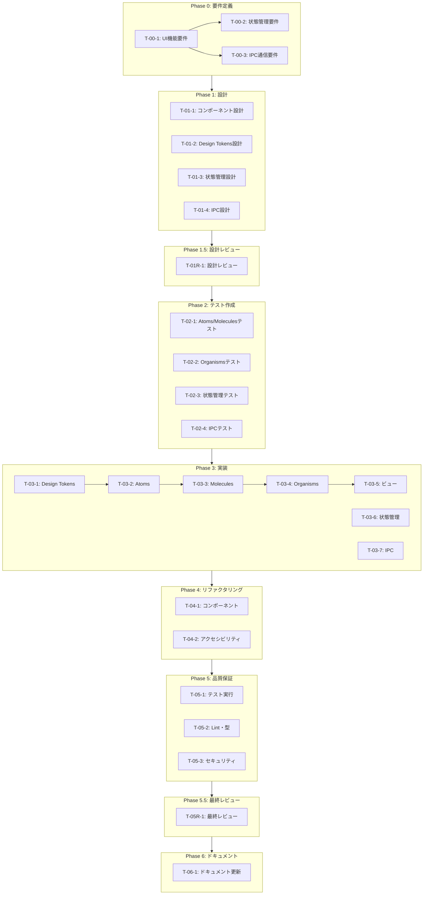

# Knowledge Studio - タスク実行仕様書

## ユーザーからの元の指示

```
次の内容はHTMLで書いている内容です。これをNext.jsで変更容易性の高いような実装で、今回の仕様に基づいて実装を進めたいです。これをNext.js版に変換してコードを管理してほしいです。ただし、これはNext.jsではなくローカルアプリで使うので、ローカルアプリで使えるように、デスクトップアプリで使えるようにしてください。
```

---

## タスク概要

### 目的

HTMLで実装された「Knowledge Studio」UIをElectronデスクトップアプリケーションとして再実装する。
Reactコンポーネントベースの変更容易性の高いアーキテクチャを採用し、プロジェクトの既存構造（apps/desktop/）に統合する。

### 背景

現在のHTMLは単一ファイルでGoogle Apps Scriptと連携する設計となっている。
これをElectronアプリとして再構築することで、ローカルファイル操作、オフライン対応、ネイティブUI統合を実現する。
プロジェクトのUI/UXガイドライン（16-ui-ux-guidelines.md）とディレクトリ構造（04-directory-structure.md）に準拠する。

### 最終ゴール

- Electronデスクトップアプリとして動作するKnowledge Studio
- 5つのビュー（Dashboard、Editor、Chat、Graph、Settings）の実装
- Spatial Design System（ガラスパネル、グラデーション）の再現
- IPC通信によるMain ProcessとRenderer Process間の連携

### 成果物一覧

| 種別         | 成果物                   | 配置先                                |
| ------------ | ------------------------ | ------------------------------------- |
| 機能         | Rendererコンポーネント群 | apps/desktop/src/renderer/components/ |
| 機能         | IPCハンドラー            | apps/desktop/src/main/ipc/handlers/   |
| 機能         | 状態管理                 | apps/desktop/src/renderer/store/      |
| 機能         | Design Tokens            | packages/shared/ui/tokens/            |
| ドキュメント | 設計仕様書               | docs/30-workflows/knowledge-studio/   |
| 品質         | テストスイート           | apps/desktop/src/test/                |

---

## 参照ファイル

本仕様書のコマンド・エージェント・スキル選定は以下を参照：

- `docs/00-requirements/master_system_design.md` - システム要件
- `docs/00-requirements/16-ui-ux-guidelines.md` - UI/UXガイドライン
- `docs/00-requirements/04-directory-structure.md` - ディレクトリ構造
- `.claude/commands/ai/command_list.md` - /ai:コマンド定義
- `.claude/agents/agent_list.md` - エージェント定義
- `.claude/skills/skill_list.md` - スキル定義

---

## タスク分解サマリー

| ID      | フェーズ  | サブタスク名                   | 責務                               | 依存           |
| ------- | --------- | ------------------------------ | ---------------------------------- | -------------- |
| T-00-1  | Phase 0   | UI機能要件定義                 | 5ビューの機能要件を明文化          | -              |
| T-00-2  | Phase 0   | 状態管理要件定義               | グローバル状態とビュー間連携の定義 | T-00-1         |
| T-00-3  | Phase 0   | IPC通信要件定義                | Main/Renderer間通信の定義          | T-00-1         |
| T-01-1  | Phase 1   | コンポーネント設計             | Atomic Designに基づく分解          | T-00-1         |
| T-01-2  | Phase 1   | Design Tokens設計              | Spatial Designのトークン化         | T-00-1         |
| T-01-3  | Phase 1   | 状態管理設計                   | Zustandストア設計                  | T-00-2         |
| T-01-4  | Phase 1   | IPC設計                        | チャネル定義とハンドラー設計       | T-00-3         |
| T-01R-1 | Phase 1.5 | 設計レビュー                   | 要件・設計の妥当性検証             | T-01-1〜4      |
| T-02-1  | Phase 2   | Atoms/Moleculesテスト作成      | 基本コンポーネントのテスト         | T-01-1         |
| T-02-2  | Phase 2   | Organismsテスト作成            | 複合コンポーネントのテスト         | T-01-1         |
| T-02-3  | Phase 2   | 状態管理テスト作成             | Zustandストアのテスト              | T-01-3         |
| T-02-4  | Phase 2   | IPCテスト作成                  | IPC通信のテスト                    | T-01-4         |
| T-03-1  | Phase 3   | Design Tokens実装              | CSS変数とTailwind設定              | T-02-1         |
| T-03-2  | Phase 3   | Atoms実装                      | Button, Input, Icon等              | T-02-1         |
| T-03-3  | Phase 3   | Molecules実装                  | NavIcon, DynamicIsland等           | T-02-1, T-03-2 |
| T-03-4  | Phase 3   | Organisms実装                  | AppDock, ViewContainer等           | T-02-2, T-03-3 |
| T-03-5  | Phase 3   | ビュー実装                     | 5つのビューコンポーネント          | T-03-4         |
| T-03-6  | Phase 3   | 状態管理実装                   | Zustandストア                      | T-02-3         |
| T-03-7  | Phase 3   | IPC実装                        | ハンドラーとpreload API            | T-02-4         |
| T-04-1  | Phase 4   | コンポーネントリファクタリング | 重複排除とパフォーマンス最適化     | T-03-1〜7      |
| T-04-2  | Phase 4   | アクセシビリティ改善           | WCAG 2.1 AA準拠                    | T-03-1〜7      |
| T-05-1  | Phase 5   | 全テスト実行                   | Vitest + Playwright                | T-04-1〜2      |
| T-05-2  | Phase 5   | Lint・型チェック               | ESLint + TypeScript                | T-04-1〜2      |
| T-05-3  | Phase 5   | セキュリティ監査               | IPC安全性・CSP確認                 | T-04-1〜2      |
| T-05R-1 | Phase 5.5 | 最終レビュー                   | 品質・整合性の総合検証             | T-05-1〜3      |
| T-06-1  | Phase 6   | ドキュメント更新               | 要件ドキュメント反映               | T-05R-1        |

**総サブタスク数**: 25個

---

## 実行フロー図



---

## Phase 0: 要件定義

### T-00-1: UI機能要件定義

#### 目的

HTMLから抽出した5つのビュー（Dashboard、Editor、Chat、Graph、Settings）の機能要件を明文化し、Electron実装に必要な仕様を確定する。

#### 背景

元のHTMLはGoogle Apps Scriptと連携する設計だが、Electron版ではローカルファイル操作やIPC通信に置き換える必要がある。

#### 責務（単一責務）

5つのビューの機能要件・UI仕様を詳細に定義する

#### 実行コマンド

```bash
/ai:gather-requirements knowledge-studio-ui
```

#### 使用エージェント

- **エージェント**: .claude/agents/req-analyst.md
- **選定理由**: 曖昧な要望を検証可能な要件に変換する専門家
- **参照**: `.claude/agents/agent_list.md`

#### 活用スキル

| スキル名                 | 活用方法                   |
| ------------------------ | -------------------------- |
| .claude/skills/requirements-engineering/SKILL.md | 要件の完全性・曖昧性排除   |
| .claude/skills/use-case-modeling/SKILL.md        | ユーザー操作シナリオの定義 |

- **参照**: `.claude/skills/skill_list.md`

#### 成果物

| 成果物       | パス                                                            | 内容              |
| ------------ | --------------------------------------------------------------- | ----------------- |
| UI機能要件書 | docs/30-workflows/knowledge-studio/requirements-ui-functions.md | 5ビューの詳細要件 |

#### 完了条件

- [ ] 5つのビュー（Dashboard、Editor、Chat、Graph、Settings）の機能が定義されている
- [ ] 各ビューのUI要素とインタラクションが明確化されている
- [ ] レスポンシブ対応（ウィンドウサイズ変更時）の挙動が定義されている
- [ ] Electron固有の要件（メニューバー、ショートカット）が定義されている

#### 依存関係

- **前提**: なし
- **後続**: T-00-2, T-00-3, T-01-1, T-01-2

---

### T-00-2: 状態管理要件定義

#### 目的

ビュー間で共有する状態、永続化が必要な状態、一時的な状態を分類し、状態管理の要件を定義する。

#### 背景

元のHTMLでは`app`オブジェクトでグローバル状態を管理しているが、React/Zustandによる適切な状態管理設計が必要。

#### 責務（単一責務）

グローバル状態とビュー間連携の要件を定義する

#### 実行コマンド

```bash
/ai:write-spec state-management
```

#### 使用エージェント

- **エージェント**: .claude/agents/state-manager.md
- **選定理由**: 複雑な状態を予測可能に管理する専門家
- **参照**: `.claude/agents/agent_list.md`

#### 活用スキル

| スキル名      | 活用方法       |
| ------------- | -------------- |
| .claude/skills/state-lifting/SKILL.md | 状態の配置判断 |

- **参照**: `.claude/skills/skill_list.md`

#### 成果物

| 成果物         | パス                                                                | 内容                 |
| -------------- | ------------------------------------------------------------------- | -------------------- |
| 状態管理要件書 | docs/30-workflows/knowledge-studio/requirements-state-management.md | 状態分類と永続化方針 |

#### 完了条件

- [ ] グローバル状態の一覧が定義されている
- [ ] ビューローカル状態の一覧が定義されている
- [ ] 永続化が必要な状態（electron-store）が特定されている
- [ ] 状態更新のトリガーが明確化されている

#### 依存関係

- **前提**: T-00-1
- **後続**: T-01-3

---

### T-00-3: IPC通信要件定義

#### 目的

Main ProcessとRenderer Process間で必要な通信を洗い出し、IPCチャネルとデータ構造を定義する。

#### 背景

元のHTMLでは`google.script.run`でサーバー通信しているが、Electron版ではIPCに置き換える。セキュリティを考慮したcontextBridge設計が必須。

#### 責務（単一責務）

IPC通信チャネルと型定義の要件を定義する

#### 実行コマンド

```bash
/ai:design-architecture ipc-communication
```

#### 使用エージェント

- **エージェント**: .claude/agents/electron-architect.md
- **選定理由**: ElectronのIPC設計に精通した専門家
- **参照**: `.claude/agents/agent_list.md`

#### 活用スキル

| スキル名                    | 活用方法      |
| --------------------------- | ------------- |
| .claude/skills/electron-security-hardening/SKILL.md | IPC安全性設計 |

- **参照**: `.claude/skills/skill_list.md`

#### 成果物

| 成果物        | パス                                                   | 内容                   |
| ------------- | ------------------------------------------------------ | ---------------------- |
| IPC通信要件書 | docs/30-workflows/knowledge-studio/requirements-ipc.md | チャネル定義とデータ型 |

#### 完了条件

- [ ] IPCチャネル一覧が定義されている
- [ ] 各チャネルのリクエスト/レスポンス型が定義されている
- [ ] contextBridgeで公開するAPI一覧が定義されている
- [ ] セキュリティ考慮事項が明記されている

#### 依存関係

- **前提**: T-00-1
- **後続**: T-01-4

---

## Phase 1: 設計

### T-01-1: コンポーネント設計

#### 目的

HTML要素をAtomic Designに基づいてAtoms/Molecules/Organismsに分解し、コンポーネント構造を設計する。

#### 背景

元のHTMLは構造化されておらず、保守性が低い。React/Tailwind CSSによるコンポーネント化で再利用性と変更容易性を向上させる。

#### 責務（単一責務）

UIコンポーネントのAtomic Design分解を行う

#### 実行コマンド

```bash
/ai:design-architecture component-structure
```

#### 使用エージェント

- **エージェント**: .claude/agents/ui-designer.md
- **選定理由**: スケーラブルなUIコンポーネント設計の専門家
- **参照**: `.claude/agents/agent_list.md`

#### 活用スキル

| スキル名             | 活用方法              |
| -------------------- | --------------------- |
| .claude/skills/apple-hig-guidelines/SKILL.md | macOSネイティブUI準拠 |
| .claude/skills/accessibility-wcag/SKILL.md   | アクセシビリティ設計  |

- **参照**: `.claude/skills/skill_list.md`

#### 成果物

| 成果物               | パス                                                    | 内容                           |
| -------------------- | ------------------------------------------------------- | ------------------------------ |
| コンポーネント設計書 | docs/30-workflows/knowledge-studio/design-components.md | Atomic Design分解図とProps定義 |

#### 完了条件

- [ ] Atoms一覧（Button, Input, Icon, Badge等）が定義されている
- [ ] Molecules一覧（NavIcon, DynamicIsland, FormField等）が定義されている
- [ ] Organisms一覧（AppDock, ViewContainer, Sidebar等）が定義されている
- [ ] 各コンポーネントのProps型が定義されている

#### 依存関係

- **前提**: T-00-1
- **後続**: T-02-1, T-02-2

---

### T-01-2: Design Tokens設計

#### 目的

Spatial Design System（ガラスパネル、グラデーション、ぼかし効果）をDesign Tokensとして定義し、Tailwind CSS設定に統合する。

#### 背景

元のHTMLではCSS変数で定義されているが、プロジェクトのUI/UXガイドライン（16-ui-ux-guidelines.md）の3層構造（Primitive/Semantic/Component）に準拠させる。

#### 責務（単一責務）

Spatial DesignのDesign Tokens定義を行う

#### 実行コマンド

```bash
/ai:setup-design-system spatial
```

#### 使用エージェント

- **エージェント**: .claude/agents/ui-designer.md
- **選定理由**: デザイントークン設計の専門家
- **参照**: `.claude/agents/agent_list.md`

#### 活用スキル

| スキル名             | 活用方法            |
| -------------------- | ------------------- |
| .claude/skills/apple-hig-guidelines/SKILL.md | macOSビジュアル準拠 |

- **参照**: `.claude/skills/skill_list.md`

#### 成果物

| 成果物              | パス                                                | 内容                       |
| ------------------- | --------------------------------------------------- | -------------------------- |
| Design Tokens設計書 | docs/30-workflows/knowledge-studio/design-tokens.md | トークン定義とTailwind設定 |

#### 完了条件

- [ ] Primitive Tokens（色、スペーシング、シャドウ等）が定義されている
- [ ] Semantic Tokens（glass-bg, accent-glow等）が定義されている
- [ ] Component Tokens（dock-width, view-radius等）が定義されている
- [ ] Tailwind CSS設定への統合方法が定義されている

#### 依存関係

- **前提**: T-00-1
- **後続**: T-03-1

---

### T-01-3: 状態管理設計

#### 目的

Zustandストアの構造を設計し、スライス分割と永続化戦略を定義する。

#### 背景

5つのビューで共有する状態（現在のビュー、選択中のファイル等）とビュー固有の状態を適切に管理する設計が必要。

#### 責務（単一責務）

Zustandストア構造の設計を行う

#### 実行コマンド

```bash
/ai:setup-state-management zustand
```

#### 使用エージェント

- **エージェント**: .claude/agents/state-manager.md
- **選定理由**: React状態管理の専門家
- **参照**: `.claude/agents/agent_list.md`

#### 活用スキル

| スキル名      | 活用方法         |
| ------------- | ---------------- |
| .claude/skills/state-lifting/SKILL.md | 状態の適切な配置 |

- **参照**: `.claude/skills/skill_list.md`

#### 成果物

| 成果物         | パス                                                          | 内容                     |
| -------------- | ------------------------------------------------------------- | ------------------------ |
| 状態管理設計書 | docs/30-workflows/knowledge-studio/design-state-management.md | ストア構造とスライス定義 |

#### 完了条件

- [ ] グローバルストアのスライス構造が定義されている
- [ ] 各スライスの状態型とアクションが定義されている
- [ ] electron-storeとの永続化連携が設計されている
- [ ] DevToolsデバッグ設定が考慮されている

#### 依存関係

- **前提**: T-00-2
- **後続**: T-02-3, T-03-6

---

### T-01-4: IPC設計

#### 目的

IPCチャネル定義、型定義、contextBridge API設計を行い、セキュアなMain/Renderer通信を設計する。

#### 背景

Electronのセキュリティベストプラクティスに従い、nodeIntegration無効、contextIsolation有効の環境でのIPC設計が必要。

#### 責務（単一責務）

IPC通信の詳細設計を行う

#### 実行コマンド

```bash
/ai:design-architecture ipc-handlers
```

#### 使用エージェント

- **エージェント**: .claude/agents/electron-architect.md
- **選定理由**: ElectronアーキテクチャとIPC設計の専門家
- **参照**: `.claude/agents/agent_list.md`

#### 活用スキル

| スキル名                    | 活用方法        |
| --------------------------- | --------------- |
| .claude/skills/electron-security-hardening/SKILL.md | セキュアIPC設計 |

- **参照**: `.claude/skills/skill_list.md`

#### 成果物

| 成果物    | パス                                             | 内容                         |
| --------- | ------------------------------------------------ | ---------------------------- |
| IPC設計書 | docs/30-workflows/knowledge-studio/design-ipc.md | チャネル定義とハンドラー設計 |

#### 完了条件

- [ ] IPCチャネル一覧と型定義が完成している
- [ ] preload/api.tsの公開API設計が完成している
- [ ] main/ipc/handlers/の構造が設計されている
- [ ] エラーハンドリング方針が定義されている

#### 依存関係

- **前提**: T-00-3
- **後続**: T-02-4, T-03-7

---

## Phase 1.5: 設計レビューゲート

### T-01R-1: 設計レビュー

#### 目的

実装開始前に要件・設計の妥当性を複数エージェントで検証し、問題を早期発見する。

#### 背景

設計ミスが実装後に発見されると修正コストが大幅に増加する。「Shift Left」原則に基づき早期検出を行う。

#### レビュー参加エージェント

| エージェント       | レビュー観点         | 選定理由                   |
| ------------------ | -------------------- | -------------------------- |
| .claude/agents/req-analyst.md       | 要件充足性           | 要件工学の権威             |
| .claude/agents/arch-police.md       | アーキテクチャ整合性 | Clean Architecture専門家   |
| .claude/agents/electron-security.md | Electronセキュリティ | Electronセキュリティ専門家 |
| .claude/agents/ui-designer.md       | UI設計妥当性         | デザインシステム専門家     |

- **参照**: `.claude/agents/agent_list.md`

#### レビューチェックリスト

**要件充足性** (.claude/agents/req-analyst.md)

- [ ] 要件が明確かつ検証可能か
- [ ] 5つのビュー全ての機能が網羅されているか
- [ ] 受け入れ基準が具体的か

**アーキテクチャ整合性** (.claude/agents/arch-police.md)

- [ ] ディレクトリ構造がプロジェクト規約に準拠しているか
- [ ] 依存関係の方向が正しいか
- [ ] 責務分離が適切か

**Electronセキュリティ** (.claude/agents/electron-security.md)

- [ ] contextIsolation有効でIPC設計されているか
- [ ] nodeIntegration無効が前提になっているか
- [ ] CSP設定が考慮されているか

**UI設計妥当性** (.claude/agents/ui-designer.md)

- [ ] UI/UXガイドラインに準拠しているか
- [ ] アクセシビリティが考慮されているか
- [ ] レスポンシブ対応が考慮されているか

#### レビュー結果

- **判定**: （レビュー実施後に記入）
- **指摘事項**: （レビュー実施後に記入）
- **対応方針**: （レビュー実施後に記入）

#### 戻り先決定（MAJORの場合）

| 問題の種類 | 戻り先              |
| ---------- | ------------------- |
| 要件の問題 | Phase 0（要件定義） |
| 設計の問題 | Phase 1（設計）     |

#### 完了条件

- [ ] 全レビュー観点で検証が完了している
- [ ] 指摘事項への対応方針が決定している
- [ ] PASS/MINORの判定で次フェーズに進行可能

#### 依存関係

- **前提**: T-01-1, T-01-2, T-01-3, T-01-4
- **後続**: T-02-1, T-02-2, T-02-3, T-02-4

---

## Phase 2: テスト作成 (TDD: Red)

### T-02-1: Atoms/Moleculesテスト作成

#### 目的

基本コンポーネント（Atoms/Molecules）のテストを実装より先に作成し、期待される動作を定義する。

#### 背景

TDDの原則に従い、テストを先に書くことで仕様を明確化し、実装品質を担保する。

#### 責務（単一責務）

Atoms/Moleculesコンポーネントのテストを作成する

#### 実行コマンド

```bash
/ai:generate-unit-tests apps/desktop/src/renderer/components/atoms
/ai:generate-unit-tests apps/desktop/src/renderer/components/molecules
```

#### 使用エージェント

- **エージェント**: .claude/agents/frontend-tester.md
- **選定理由**: フロントエンドテスト戦略の専門家
- **参照**: `.claude/agents/agent_list.md`

#### 活用スキル

| スキル名       | 活用方法                   |
| -------------- | -------------------------- |
| .claude/skills/tdd-principles/SKILL.md | Red-Green-Refactorサイクル |
| .claude/skills/test-doubles/SKILL.md   | モック/スタブの活用        |

- **参照**: `.claude/skills/skill_list.md`

#### 成果物

| 成果物          | パス                                                          | 内容                             |
| --------------- | ------------------------------------------------------------- | -------------------------------- |
| Atomsテスト     | apps/desktop/src/renderer/components/atoms/\*_/_.test.tsx     | Button, Input, Icon等のテスト    |
| Moleculesテスト | apps/desktop/src/renderer/components/molecules/\*_/_.test.tsx | NavIcon, DynamicIsland等のテスト |

#### TDD検証: Red状態確認

```bash
pnpm --filter @repo/desktop test:run
```

- [ ] テストが失敗することを確認（Red状態）

#### 完了条件

- [ ] 各Atomコンポーネントのレンダリングテストが作成されている
- [ ] 各Atomコンポーネントのインタラクションテストが作成されている
- [ ] 各Moleculeコンポーネントのテストが作成されている
- [ ] テスト実行でRed状態（失敗）が確認されている

#### 依存関係

- **前提**: T-01-1
- **後続**: T-03-2, T-03-3

---

### T-02-2: Organismsテスト作成

#### 目的

複合コンポーネント（Organisms）のテストを作成し、コンポーネント間連携の期待動作を定義する。

#### 背景

Organismsは複数のMoleculesを組み合わせた複雑なコンポーネントであり、統合的なテストが必要。

#### 責務（単一責務）

Organismsコンポーネントのテストを作成する

#### 実行コマンド

```bash
/ai:generate-unit-tests apps/desktop/src/renderer/components/organisms
```

#### 使用エージェント

- **エージェント**: .claude/agents/frontend-tester.md
- **選定理由**: フロントエンドテスト戦略の専門家
- **参照**: `.claude/agents/agent_list.md`

#### 活用スキル

| スキル名       | 活用方法                   |
| -------------- | -------------------------- |
| .claude/skills/tdd-principles/SKILL.md | Red-Green-Refactorサイクル |

- **参照**: `.claude/skills/skill_list.md`

#### 成果物

| 成果物          | パス                                                          | 内容                             |
| --------------- | ------------------------------------------------------------- | -------------------------------- |
| Organismsテスト | apps/desktop/src/renderer/components/organisms/\*_/_.test.tsx | AppDock, ViewContainer等のテスト |

#### TDD検証: Red状態確認

```bash
pnpm --filter @repo/desktop test:run
```

- [ ] テストが失敗することを確認（Red状態）

#### 完了条件

- [ ] AppDockコンポーネントのテストが作成されている
- [ ] ViewContainerコンポーネントのテストが作成されている
- [ ] Sidebarコンポーネントのテストが作成されている
- [ ] テスト実行でRed状態（失敗）が確認されている

#### 依存関係

- **前提**: T-01-1
- **後続**: T-03-4

---

### T-02-3: 状態管理テスト作成

#### 目的

Zustandストアのテストを作成し、状態遷移の期待動作を定義する。

#### 背景

状態管理のバグは画面全体に波及するため、テストによる品質担保が重要。

#### 責務（単一責務）

Zustandストアのテストを作成する

#### 実行コマンド

```bash
/ai:generate-unit-tests apps/desktop/src/renderer/store
```

#### 使用エージェント

- **エージェント**: .claude/agents/unit-tester.md
- **選定理由**: TDD再発見者の専門性
- **参照**: `.claude/agents/agent_list.md`

#### 活用スキル

| スキル名       | 活用方法       |
| -------------- | -------------- |
| .claude/skills/tdd-principles/SKILL.md | 状態遷移テスト |

- **参照**: `.claude/skills/skill_list.md`

#### 成果物

| 成果物       | パス                                          | 内容               |
| ------------ | --------------------------------------------- | ------------------ |
| ストアテスト | apps/desktop/src/renderer/store/\*_/_.test.ts | 各スライスのテスト |

#### TDD検証: Red状態確認

```bash
pnpm --filter @repo/desktop test:run
```

- [ ] テストが失敗することを確認（Red状態）

#### 完了条件

- [ ] ビュー切り替え状態のテストが作成されている
- [ ] ファイル選択状態のテストが作成されている
- [ ] 設定状態のテストが作成されている
- [ ] テスト実行でRed状態（失敗）が確認されている

#### 依存関係

- **前提**: T-01-3
- **後続**: T-03-6

---

### T-02-4: IPCテスト作成

#### 目的

IPC通信のテストを作成し、Main/Renderer間通信の期待動作を定義する。

#### 背景

IPC通信のエラーは深刻な障害に繋がるため、テストによる品質担保が必須。

#### 責務（単一責務）

IPC通信のテストを作成する

#### 実行コマンド

```bash
/ai:generate-unit-tests apps/desktop/src/main/ipc
/ai:generate-unit-tests apps/desktop/src/preload
```

#### 使用エージェント

- **エージェント**: .claude/agents/unit-tester.md
- **選定理由**: TDD再発見者の専門性
- **参照**: `.claude/agents/agent_list.md`

#### 活用スキル

| スキル名     | 活用方法  |
| ------------ | --------- |
| .claude/skills/test-doubles/SKILL.md | IPCモック |

- **参照**: `.claude/skills/skill_list.md`

#### 成果物

| 成果物              | パス                                             | 内容                 |
| ------------------- | ------------------------------------------------ | -------------------- |
| IPCハンドラーテスト | apps/desktop/src/main/ipc/handlers/\*_/_.test.ts | 各ハンドラーのテスト |
| Preloadテスト       | apps/desktop/src/preload/\*_/_.test.ts           | API公開のテスト      |

#### TDD検証: Red状態確認

```bash
pnpm --filter @repo/desktop test:run
```

- [ ] テストが失敗することを確認（Red状態）

#### 完了条件

- [ ] ファイル操作IPCのテストが作成されている
- [ ] 設定読み書きIPCのテストが作成されている
- [ ] AI通信IPCのテストが作成されている
- [ ] テスト実行でRed状態（失敗）が確認されている

#### 依存関係

- **前提**: T-01-4
- **後続**: T-03-7

---

## Phase 3: 実装 (TDD: Green)

### T-03-1: Design Tokens実装

#### 目的

設計したDesign TokensをCSS変数とTailwind CSS設定として実装する。

#### 背景

Spatial Design System（ガラスパネル、グラデーション、ぼかし効果）をプロジェクト全体で一貫して使用するための基盤。

#### 責務（単一責務）

Design TokensのCSS/Tailwind実装を行う

#### 実行コマンド

```bash
/ai:setup-design-system spatial
```

#### 使用エージェント

- **エージェント**: .claude/agents/ui-designer.md
- **選定理由**: デザインシステム実装の専門家
- **参照**: `.claude/agents/agent_list.md`

#### 活用スキル

| スキル名             | 活用方法              |
| -------------------- | --------------------- |
| .claude/skills/apple-hig-guidelines/SKILL.md | macOS準拠のビジュアル |

- **参照**: `.claude/skills/skill_list.md`

#### 成果物

| 成果物       | パス                                        | 内容                      |
| ------------ | ------------------------------------------- | ------------------------- |
| CSS変数定義  | apps/desktop/src/renderer/styles/tokens.css | Primitive/Semantic Tokens |
| Tailwind設定 | apps/desktop/tailwind.config.ts             | トークン拡張設定          |

#### TDD検証: Green状態確認

```bash
pnpm --filter @repo/desktop test:run
```

- [ ] テストが成功することを確認（Green状態）

#### 完了条件

- [ ] CSS変数が定義されている
- [ ] Tailwind設定が拡張されている
- [ ] ダークモード対応が実装されている
- [ ] 関連テストが成功している

#### 依存関係

- **前提**: T-02-1
- **後続**: T-03-2

---

### T-03-2: Atoms実装

#### 目的

基本コンポーネント（Button, Input, Icon, Badge等）を実装し、テストを通す。

#### 背景

Atomsは全てのコンポーネントの基盤となるため、高品質な実装が必要。

#### 責務（単一責務）

Atomsコンポーネントの実装を行う

#### 実行コマンド

```bash
/ai:create-component Button atom
/ai:create-component Input atom
/ai:create-component Icon atom
/ai:create-component Badge atom
/ai:create-component Spinner atom
```

#### 使用エージェント

- **エージェント**: .claude/agents/electron-ui-dev.md
- **選定理由**: Electron UIコンポーネント実装の専門家
- **参照**: `.claude/agents/agent_list.md`

#### 活用スキル

| スキル名           | 活用方法     |
| ------------------ | ------------ |
| .claude/skills/accessibility-wcag/SKILL.md | WCAG準拠実装 |

- **参照**: `.claude/skills/skill_list.md`

#### 成果物

| 成果物              | パス                                        | 内容                                |
| ------------------- | ------------------------------------------- | ----------------------------------- |
| Atomsコンポーネント | apps/desktop/src/renderer/components/atoms/ | Button, Input, Icon, Badge, Spinner |

#### TDD検証: Green状態確認

```bash
pnpm --filter @repo/desktop test:run
```

- [ ] テストが成功することを確認（Green状態）

#### 完了条件

- [ ] 全Atomsコンポーネントが実装されている
- [ ] Props型が正しく定義されている
- [ ] アクセシビリティ属性が設定されている
- [ ] 関連テストが成功している

#### 依存関係

- **前提**: T-02-1, T-03-1
- **後続**: T-03-3

---

### T-03-3: Molecules実装

#### 目的

複合コンポーネント（NavIcon, DynamicIsland, FormField等）を実装し、テストを通す。

#### 背景

MoleculesはAtomsを組み合わせた機能単位であり、UIの再利用性を高める。

#### 責務（単一責務）

Moleculesコンポーネントの実装を行う

#### 実行コマンド

```bash
/ai:create-component NavIcon molecule
/ai:create-component DynamicIsland molecule
/ai:create-component FormField molecule
/ai:create-component Tooltip molecule
```

#### 使用エージェント

- **エージェント**: .claude/agents/electron-ui-dev.md
- **選定理由**: Electron UIコンポーネント実装の専門家
- **参照**: `.claude/agents/agent_list.md`

#### 活用スキル

| スキル名           | 活用方法     |
| ------------------ | ------------ |
| .claude/skills/accessibility-wcag/SKILL.md | WCAG準拠実装 |

- **参照**: `.claude/skills/skill_list.md`

#### 成果物

| 成果物                  | パス                                            | 内容                                       |
| ----------------------- | ----------------------------------------------- | ------------------------------------------ |
| Moleculesコンポーネント | apps/desktop/src/renderer/components/molecules/ | NavIcon, DynamicIsland, FormField, Tooltip |

#### TDD検証: Green状態確認

```bash
pnpm --filter @repo/desktop test:run
```

- [ ] テストが成功することを確認（Green状態）

#### 完了条件

- [ ] 全Moleculesコンポーネントが実装されている
- [ ] Atomsとの連携が正しく動作している
- [ ] 関連テストが成功している

#### 依存関係

- **前提**: T-02-1, T-03-2
- **後続**: T-03-4

---

### T-03-4: Organisms実装

#### 目的

大規模コンポーネント（AppDock, ViewContainer, Sidebar等）を実装し、テストを通す。

#### 背景

OrganismsはUIの主要構造を形成し、ビューの基盤となる。

#### 責務（単一責務）

Organismsコンポーネントの実装を行う

#### 実行コマンド

```bash
/ai:create-component AppDock organism
/ai:create-component ViewContainer organism
/ai:create-component Sidebar organism
/ai:create-component GlassPanel organism
```

#### 使用エージェント

- **エージェント**: .claude/agents/electron-ui-dev.md
- **選定理由**: Electron UIコンポーネント実装の専門家
- **参照**: `.claude/agents/agent_list.md`

#### 活用スキル

| スキル名             | 活用方法              |
| -------------------- | --------------------- |
| .claude/skills/apple-hig-guidelines/SKILL.md | macOSネイティブUI準拠 |

- **参照**: `.claude/skills/skill_list.md`

#### 成果物

| 成果物                  | パス                                            | 内容                                        |
| ----------------------- | ----------------------------------------------- | ------------------------------------------- |
| Organismsコンポーネント | apps/desktop/src/renderer/components/organisms/ | AppDock, ViewContainer, Sidebar, GlassPanel |

#### TDD検証: Green状態確認

```bash
pnpm --filter @repo/desktop test:run
```

- [ ] テストが成功することを確認（Green状態）

#### 完了条件

- [ ] 全Organismsコンポーネントが実装されている
- [ ] レスポンシブ対応が動作している
- [ ] 関連テストが成功している

#### 依存関係

- **前提**: T-02-2, T-03-3
- **後続**: T-03-5

---

### T-03-5: ビュー実装

#### 目的

5つのビュー（Dashboard, Editor, Chat, Graph, Settings）を実装し、アプリケーション全体を構築する。

#### 背景

ビューは全コンポーネントを統合したページレベルのコンポーネントであり、ユーザーが直接操作する画面。

#### 責務（単一責務）

5つのビューコンポーネントの実装を行う

#### 実行コマンド

```bash
/ai:create-component DashboardView page
/ai:create-component EditorView page
/ai:create-component ChatView page
/ai:create-component GraphView page
/ai:create-component SettingsView page
```

#### 使用エージェント

- **エージェント**: .claude/agents/electron-ui-dev.md
- **選定理由**: Electron UIコンポーネント実装の専門家
- **参照**: `.claude/agents/agent_list.md`

#### 活用スキル

| スキル名             | 活用方法              |
| -------------------- | --------------------- |
| .claude/skills/apple-hig-guidelines/SKILL.md | macOSネイティブUI準拠 |

- **参照**: `.claude/skills/skill_list.md`

#### 成果物

| 成果物               | パス                             | 内容                                                         |
| -------------------- | -------------------------------- | ------------------------------------------------------------ |
| ビューコンポーネント | apps/desktop/src/renderer/pages/ | DashboardView, EditorView, ChatView, GraphView, SettingsView |

#### TDD検証: Green状態確認

```bash
pnpm --filter @repo/desktop test:run
```

- [ ] テストが成功することを確認（Green状態）

#### 完了条件

- [ ] 5つのビューが実装されている
- [ ] ビュー切り替えが動作している
- [ ] 関連テストが成功している

#### 依存関係

- **前提**: T-03-4
- **後続**: T-04-1

---

### T-03-6: 状態管理実装

#### 目的

Zustandストアを実装し、グローバル状態管理を機能させる。

#### 背景

ビュー間の状態共有と永続化のためのストア実装。

#### 責務（単一責務）

Zustandストアの実装を行う

#### 実行コマンド

```bash
/ai:setup-state-management zustand
```

#### 使用エージェント

- **エージェント**: .claude/agents/state-manager.md
- **選定理由**: React状態管理の専門家
- **参照**: `.claude/agents/agent_list.md`

#### 活用スキル

| スキル名      | 活用方法         |
| ------------- | ---------------- |
| .claude/skills/state-lifting/SKILL.md | 状態の適切な配置 |

- **参照**: `.claude/skills/skill_list.md`

#### 成果物

| 成果物     | パス                             | 内容                    |
| ---------- | -------------------------------- | ----------------------- |
| ストア実装 | apps/desktop/src/renderer/store/ | useAppStore, スライス群 |

#### TDD検証: Green状態確認

```bash
pnpm --filter @repo/desktop test:run
```

- [ ] テストが成功することを確認（Green状態）

#### 完了条件

- [ ] グローバルストアが実装されている
- [ ] 永続化が動作している
- [ ] 関連テストが成功している

#### 依存関係

- **前提**: T-02-3
- **後続**: T-04-1

---

### T-03-7: IPC実装

#### 目的

IPCハンドラーとpreload APIを実装し、Main/Renderer間通信を機能させる。

#### 背景

ファイル操作、設定読み書き、AI通信などのバックエンド機能をRenderer Processから利用可能にする。

#### 責務（単一責務）

IPC通信の実装を行う

#### 実行コマンド

```bash
/ai:create-electron-window main
```

#### 使用エージェント

- **エージェント**: .claude/agents/electron-architect.md
- **選定理由**: ElectronアーキテクチャとIPC実装の専門家
- **参照**: `.claude/agents/agent_list.md`

#### 活用スキル

| スキル名                    | 活用方法        |
| --------------------------- | --------------- |
| .claude/skills/electron-security-hardening/SKILL.md | セキュアIPC実装 |

- **参照**: `.claude/skills/skill_list.md`

#### 成果物

| 成果物        | パス                                | 内容                        |
| ------------- | ----------------------------------- | --------------------------- |
| IPCハンドラー | apps/desktop/src/main/ipc/handlers/ | file.ts, settings.ts, ai.ts |
| Preload API   | apps/desktop/src/preload/api.ts     | contextBridge公開API        |

#### TDD検証: Green状態確認

```bash
pnpm --filter @repo/desktop test:run
```

- [ ] テストが成功することを確認（Green状態）

#### 完了条件

- [ ] IPCハンドラーが実装されている
- [ ] Preload APIが実装されている
- [ ] 型安全なIPC通信が動作している
- [ ] 関連テストが成功している

#### 依存関係

- **前提**: T-02-4
- **後続**: T-04-1

---

## Phase 4: リファクタリング (TDD: Refactor)

### T-04-1: コンポーネントリファクタリング

#### 目的

動作を変えずにコード品質を改善し、重複排除とパフォーマンス最適化を行う。

#### 背景

実装フェーズで発生した技術的負債を解消し、保守性を向上させる。

#### 責務（単一責務）

コンポーネントのリファクタリングを行う

#### 実行コマンド

```bash
/ai:refactor apps/desktop/src/renderer/components
```

#### 使用エージェント

- **エージェント**: .claude/agents/code-quality.md
- **選定理由**: コード品質管理の専門家
- **参照**: `.claude/agents/agent_list.md`

#### 活用スキル

| スキル名               | 活用方法               |
| ---------------------- | ---------------------- |
| .claude/skills/refactoring-techniques/SKILL.md | 安全なリファクタリング |
| .claude/skills/clean-code-practices/SKILL.md   | 可読性向上             |

- **参照**: `.claude/skills/skill_list.md`

#### 成果物

| 成果物                     | パス                       | 内容                       |
| -------------------------- | -------------------------- | -------------------------- |
| リファクタリング済みコード | apps/desktop/src/renderer/ | 品質改善済みコンポーネント |

#### TDD検証: 継続Green確認

```bash
pnpm --filter @repo/desktop test:run
```

- [ ] リファクタリング後もテストが成功することを確認

#### 完了条件

- [ ] 重複コードが排除されている
- [ ] パフォーマンス最適化が適用されている
- [ ] 命名が統一されている
- [ ] テストが継続成功している

#### 依存関係

- **前提**: T-03-1〜7
- **後続**: T-05-1

---

### T-04-2: アクセシビリティ改善

#### 目的

WCAG 2.1 AA準拠のアクセシビリティを確保する。

#### 背景

プロジェクトのUI/UXガイドライン（16-ui-ux-guidelines.md）に定義されたアクセシビリティ要件への準拠。

#### 責務（単一責務）

アクセシビリティの改善を行う

#### 実行コマンド

```bash
/ai:run-accessibility-audit --scope all --wcag-level AA
```

#### 使用エージェント

- **エージェント**: .claude/agents/frontend-tester.md
- **選定理由**: アクセシビリティテストの専門家
- **参照**: `.claude/agents/agent_list.md`

#### 活用スキル

| スキル名           | 活用方法     |
| ------------------ | ------------ |
| .claude/skills/accessibility-wcag/SKILL.md | WCAG準拠監査 |

- **参照**: `.claude/skills/skill_list.md`

#### 成果物

| 成果物         | パス                       | 内容                               |
| -------------- | -------------------------- | ---------------------------------- |
| 改善済みコード | apps/desktop/src/renderer/ | アクセシビリティ対応コンポーネント |

#### TDD検証: 継続Green確認

```bash
pnpm --filter @repo/desktop test:run
```

- [ ] リファクタリング後もテストが成功することを確認

#### 完了条件

- [ ] キーボードナビゲーションが動作している
- [ ] スクリーンリーダー対応が実装されている
- [ ] フォーカス管理が適切に動作している
- [ ] コントラスト比が基準を満たしている

#### 依存関係

- **前提**: T-03-1〜7
- **後続**: T-05-1

---

## Phase 5: 品質保証

### T-05-1: 全テスト実行

#### 目的

全テストスイートを実行し、機能の正常動作を確認する。

#### 背景

品質ゲートとして、全テストの成功が必須。

#### 責務（単一責務）

全テストの実行と結果確認を行う

#### 実行コマンド

```bash
/ai:run-all-tests --coverage
```

#### 使用エージェント

- **エージェント**: .claude/agents/unit-tester.md
- **選定理由**: テスト実行の専門家
- **参照**: `.claude/agents/agent_list.md`

#### 活用スキル

| スキル名       | 活用方法       |
| -------------- | -------------- |
| .claude/skills/tdd-principles/SKILL.md | テスト品質確認 |

- **参照**: `.claude/skills/skill_list.md`

#### 成果物

| 成果物         | パス                   | 内容               |
| -------------- | ---------------------- | ------------------ |
| テストレポート | apps/desktop/coverage/ | カバレッジレポート |

#### 完了条件

- [ ] 全ユニットテストが成功している
- [ ] カバレッジが80%以上である
- [ ] テストレポートが生成されている

#### 依存関係

- **前提**: T-04-1, T-04-2
- **後続**: T-05R-1

---

### T-05-2: Lint・型チェック

#### 目的

ESLintとTypeScriptによるコード品質チェックを実行する。

#### 背景

品質ゲートとして、Lint/型エラーがゼロであることが必須。

#### 責務（単一責務）

Lint・型チェックの実行と結果確認を行う

#### 実行コマンド

```bash
/ai:lint --fix
/ai:fix-type-errors apps/desktop
```

#### 使用エージェント

- **エージェント**: .claude/agents/code-quality.md
- **選定理由**: コード品質管理の専門家
- **参照**: `.claude/agents/agent_list.md`

#### 活用スキル

| スキル名                      | 活用方法 |
| ----------------------------- | -------- |
| .claude/skills/linting-formatting-automation/SKILL.md | 自動修正 |

- **参照**: `.claude/skills/skill_list.md`

#### 成果物

| 成果物         | パス              | 内容                  |
| -------------- | ----------------- | --------------------- |
| 修正済みコード | apps/desktop/src/ | Lint/型エラー解消済み |

#### 完了条件

- [ ] ESLintエラーがゼロである
- [ ] TypeScript型エラーがゼロである
- [ ] コードフォーマットが統一されている

#### 依存関係

- **前提**: T-04-1, T-04-2
- **後続**: T-05R-1

---

### T-05-3: セキュリティ監査

#### 目的

Electronセキュリティベストプラクティスへの準拠を確認する。

#### 背景

Electronはセキュリティリスクが高いため、セキュリティ監査が必須。

#### 責務（単一責務）

セキュリティ監査の実行と結果確認を行う

#### 実行コマンド

```bash
/ai:secure-electron-app full
```

#### 使用エージェント

- **エージェント**: .claude/agents/electron-security.md
- **選定理由**: Electronセキュリティの専門家
- **参照**: `.claude/agents/agent_list.md`

#### 活用スキル

| スキル名                    | 活用方法         |
| --------------------------- | ---------------- |
| .claude/skills/electron-security-hardening/SKILL.md | セキュリティ監査 |

- **参照**: `.claude/skills/skill_list.md`

#### 成果物

| 成果物               | パス                                                 | 内容     |
| -------------------- | ---------------------------------------------------- | -------- |
| セキュリティレポート | docs/30-workflows/knowledge-studio/security-audit.md | 監査結果 |

#### 完了条件

- [ ] contextIsolationが有効である
- [ ] nodeIntegrationが無効である
- [ ] CSPが適切に設定されている
- [ ] IPC通信がセキュアである

#### 依存関係

- **前提**: T-04-1, T-04-2
- **後続**: T-05R-1

---

## 品質ゲートチェックリスト

### 機能検証

- [ ] 全ユニットテスト成功
- [ ] 全統合テスト成功
- [ ] 全E2Eテスト成功

### コード品質

- [ ] Lintエラーなし
- [ ] 型エラーなし
- [ ] コードフォーマット適用済み

### テスト網羅性

- [ ] カバレッジ80%以上達成

### セキュリティ

- [ ] 脆弱性スキャン完了
- [ ] 重大な脆弱性なし
- [ ] Electronセキュリティベストプラクティス準拠

---

## Phase 5.5: 最終レビューゲート

### T-05R-1: 最終レビュー

#### 目的

実装完了後、ドキュメント更新前に全体的な品質・整合性を検証する。

#### 背景

Phase 5の自動検証だけでは検出できない設計判断やベストプラクティス違反を確認する。

#### レビュー参加エージェント

| エージェント       | レビュー観点       | 選定理由                    |
| ------------------ | ------------------ | --------------------------- |
| .claude/agents/code-quality.md      | コード品質         | ESLint作者の専門性          |
| .claude/agents/arch-police.md       | アーキテクチャ遵守 | Clean Architecture専門家    |
| .claude/agents/frontend-tester.md   | テスト品質         | Testing Library作者の専門性 |
| .claude/agents/electron-security.md | セキュリティ       | Electronセキュリティ専門家  |

- **参照**: `.claude/agents/agent_list.md`

#### 対象領域別追加レビュー

| 対象領域       | エージェント                   | レビュー観点                     |
| -------------- | ------------------------------ | -------------------------------- |
| フロントエンド | .claude/agents/ui-designer.md, .claude/agents/frontend-tester.md | アクセシビリティ、ユーザビリティ |
| Electron       | .claude/agents/electron-security.md             | IPC通信セキュリティ、CSP         |

#### レビューチェックリスト

**コード品質** (.claude/agents/code-quality.md)

- [ ] コーディング規約への準拠
- [ ] 可読性・保守性の確保
- [ ] 適切なエラーハンドリング
- [ ] 過度な複雑性の有無

**アーキテクチャ遵守** (.claude/agents/arch-police.md)

- [ ] 実装がアーキテクチャ設計に従っているか
- [ ] レイヤー間の依存関係が適切か
- [ ] SOLID原則への準拠

**テスト品質** (.claude/agents/frontend-tester.md)

- [ ] テストカバレッジが十分か
- [ ] テストケースが適切に設計されているか
- [ ] 境界値・異常系のテストがあるか

**セキュリティ** (.claude/agents/electron-security.md)

- [ ] IPC通信のセキュリティ
- [ ] CSP設定の適切性
- [ ] contextIsolation/nodeIntegration設定

#### レビュー結果

- **判定**: （レビュー実施後に記入）
- **指摘事項**: （レビュー実施後に記入）
- **対応方針**: （レビュー実施後に記入）

#### 戻り先決定（MAJOR/CRITICALの場合）

| 問題の種類       | 戻り先                      |
| ---------------- | --------------------------- |
| 要件の問題       | Phase 0（要件定義）         |
| 設計の問題       | Phase 1（設計）             |
| テスト設計の問題 | Phase 2（テスト作成）       |
| 実装の問題       | Phase 3（実装）             |
| コード品質の問題 | Phase 4（リファクタリング） |

#### エスカレーション条件

- 戻り先の判断が困難な場合
- 複数フェーズにまたがる問題の場合
- 要件自体の見直しが必要な場合

#### 完了条件

- [ ] 全レビュー観点で検証が完了している
- [ ] 指摘事項への対応が完了している
- [ ] PASS/MINORの判定でPhase 6に進行可能

#### 依存関係

- **前提**: T-05-1, T-05-2, T-05-3
- **後続**: T-06-1

---

## Phase 6: ドキュメント更新

### T-06-1: ドキュメント更新

#### 目的

タスク完了後、実装した内容をシステム要件ドキュメントに反映する。

#### 前提条件

- [ ] Phase 5の品質ゲートをすべて通過
- [ ] Phase 5.5の最終レビューゲートを通過
- [ ] すべてのテストが成功

#### 更新対象ドキュメント

| ドキュメント                                   | 更新内容（概要のみ）                     |
| ---------------------------------------------- | ---------------------------------------- |
| docs/00-requirements/04-directory-structure.md | Knowledge Studioコンポーネント構造の追記 |
| docs/00-requirements/16-ui-ux-guidelines.md    | Spatial Design Tokensの追記              |

#### 実行コマンド

```bash
/ai:update-all-docs
```

#### 使用エージェント

- **エージェント**: .claude/agents/spec-writer.md
- **選定理由**: ドキュメント作成の専門家
- **参照**: `.claude/agents/agent_list.md`

#### 更新原則

- 概要のみ記載（詳細な実装説明は不要）
- システム構築に必要十分な情報のみ追記
- 既存ドキュメントの構造・フォーマットを維持
- Single Source of Truth原則を遵守

#### 完了条件

- [ ] 関連ドキュメントが更新されている
- [ ] 更新内容が概要レベルである（詳細すぎない）
- [ ] 既存ドキュメントとの整合性が保たれている

---

## リスクと対策

| リスク                           | 影響度 | 発生確率 | 対策                                    | 対応サブタスク |
| -------------------------------- | ------ | -------- | --------------------------------------- | -------------- |
| Canvas API（グラフ描画）の複雑性 | 中     | 高       | ライブラリ（react-konvaなど）の活用検討 | T-03-5         |
| IPC通信の型安全性確保            | 高     | 中       | Zodスキーマによる型生成                 | T-01-4, T-03-7 |
| Spatial Designの再現精度         | 中     | 中       | Design Tokensの段階的調整               | T-01-2, T-03-1 |
| 状態永続化の複雑性               | 中     | 低       | electron-storeの活用                    | T-01-3, T-03-6 |

---

## 前提条件

- pnpmがインストールされていること
- Node.js 18+がインストールされていること
- apps/desktop/の基本構造が存在すること
- packages/shared/が存在すること
- Electron開発環境が構築されていること

---

## 備考

### 技術的制約

- ElectronのcontextIsolation必須
- nodeIntegration無効必須
- React 19.xを使用
- Tailwind CSS 4.xを使用

### 参考資料

- docs/00-requirements/16-ui-ux-guidelines.md
- docs/00-requirements/04-directory-structure.md
- Electron Security Best Practices
- Apple Human Interface Guidelines
