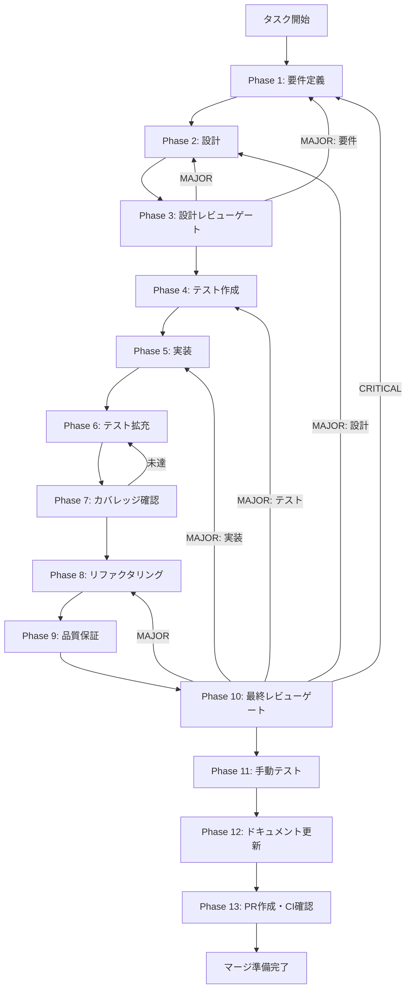

# llm-conversation-history-persistence - タスク実行仕様書

## ユーザーからの元の指示

```
会話履歴の永続化 - GitHub Issue #463
現在のチャット機能では、会話履歴がメモリ上のRedux Storeにのみ保持されている。
アプリケーションを再起動すると全ての会話履歴が失われる。
システム仕様書（interfaces-llm.md）のAIChatRequest型にはconversationIdフィールドが定義されており、
会話の継続をサポートするインターフェースは設計済みだが、永続化機能が未実装。
```

## メタ情報

| 項目         | 内容                                 |
| ------------ | ------------------------------------ |
| タスクID     | UT-LLM-HISTORY-001                   |
| タスク名     | llm-conversation-history-persistence |
| 分類         | 改善                                 |
| 対象機能     | LLM API統合 / チャット機能           |
| 優先度       | 高                                   |
| 見積もり規模 | 中規模                               |
| ステータス   | 未実施                               |
| 作成日       | 2026-01-24                           |
| Issue番号    | #463                                 |

---

## タスク概要

### 目的

会話履歴をローカルストレージ（SQLite）に永続化し、アプリ再起動後も会話を継続できるようにする。

### 背景

現在のチャット機能では、会話履歴がメモリ上のRedux Storeにのみ保持されている。アプリケーションを再起動すると全ての会話履歴が失われ、ユーザー体験を損なっている。システム仕様書（interfaces-llm.md）の`AIChatRequest`型には`conversationId`フィールドが定義されており、会話の継続をサポートするインターフェースは設計済みだが、永続化機能が未実装。

### 最終ゴール

1. 全ての会話履歴がSQLiteに自動保存される
2. アプリ再起動後に会話履歴が復元される
3. 過去の会話を一覧表示・検索・選択できる
4. 会話の削除・アーカイブが可能

### 成果物一覧

| 種別         | 成果物                   | 配置先                                       |
| ------------ | ------------------------ | -------------------------------------------- |
| 機能         | ConversationRepository   | `apps/desktop/src/main/repositories/`        |
| 機能         | IPC ハンドラー           | `apps/desktop/src/main/handlers/`            |
| 機能         | 会話一覧UIコンポーネント | `apps/desktop/src/renderer/components/chat/` |
| テスト       | ユニット・統合テスト     | `apps/desktop/src/**/*.test.ts`              |
| ドキュメント | 実装ガイド               | `outputs/phase-12/`                          |
| PR           | GitHub Pull Request      | GitHub UI                                    |

---

## 参照ファイル

本仕様書のコマンド選定は以下を参照：

- `docs/00-requirements/master_system_design.md` - システム要件
- `.claude/skills/aiworkflow-requirements/references/` - システム仕様

### システム仕様（aiworkflow-requirements）

> 実装前に必ず以下のシステム仕様を確認し、既存設計との整合性を確保してください。

| 参照資料                 | パス                                                                         | 内容                                                  |
| ------------------------ | ---------------------------------------------------------------------------- | ----------------------------------------------------- |
| interfaces-llm.md        | `.claude/skills/aiworkflow-requirements/references/interfaces-llm.md`        | LLMインターフェース仕様                               |
| database-schema.md       | `.claude/skills/aiworkflow-requirements/references/database-schema.md`       | DBスキーマ設計（chat_sessions/chat_messages定義済み） |
| architecture-database.md | `.claude/skills/aiworkflow-requirements/references/architecture-database.md` | DB設計原則・トランザクション管理                      |

---

## タスク分解サマリー

| ID     | フェーズ | サブタスク名                   | 責務                            | 依存 |
| ------ | -------- | ------------------------------ | ------------------------------- | ---- |
| T-01-1 | Phase 1  | 要件定義                       | 永続化要件・受け入れ基準定義    | -    |
| T-02-1 | Phase 2  | DBスキーマ・アーキテクチャ設計 | テーブル設計・Repository設計    | T-01 |
| T-03-1 | Phase 3  | 設計レビューゲート             | 要件・設計の妥当性検証          | T-02 |
| T-04-1 | Phase 4  | テスト作成（TDD: Red）         | Repository・IPC・統合テスト作成 | T-03 |
| T-05-1 | Phase 5  | 実装（TDD: Green）             | Repository・IPC・UI実装         | T-04 |
| T-06-1 | Phase 6  | テスト拡充                     | カバレッジ目標達成              | T-05 |
| T-07-1 | Phase 7  | カバレッジ確認                 | 基準達成検証                    | T-06 |
| T-08-1 | Phase 8  | リファクタリング               | コード品質改善                  | T-07 |
| T-09-1 | Phase 9  | 品質保証                       | 静的解析・セキュリティ・性能    | T-08 |
| T-10-1 | Phase 10 | 最終レビューゲート             | 全体品質・整合性検証            | T-09 |
| T-11-1 | Phase 11 | 手動テスト                     | UX・実環境動作確認              | T-10 |
| T-12-1 | Phase 12 | ドキュメント更新               | 実装ガイド・システム仕様更新    | T-11 |
| T-13-1 | Phase 13 | PR作成                         | コミット・PR・CI確認            | T-12 |

**総サブタスク数**: 13個

---

## 実行フロー図



---

## Phase一覧

| Phase | 名称               | 仕様書                                                 | ステータス |
| ----- | ------------------ | ------------------------------------------------------ | ---------- |
| 1     | 要件定義           | [phase-1-requirements.md](phase-1-requirements.md)     | 未実施     |
| 2     | 設計               | [phase-2-design.md](phase-2-design.md)                 | 未実施     |
| 3     | 設計レビューゲート | [phase-3-design-review.md](phase-3-design-review.md)   | 未実施     |
| 4     | テスト作成         | [phase-4-test-creation.md](phase-4-test-creation.md)   | 未実施     |
| 5     | 実装               | [phase-5-implementation.md](phase-5-implementation.md) | 未実施     |
| 6     | テスト拡充         | [phase-6-test-expansion.md](phase-6-test-expansion.md) | 未実施     |
| 7     | カバレッジ確認     | [phase-7-coverage-check.md](phase-7-coverage-check.md) | 未実施     |
| 8     | リファクタリング   | [phase-8-refactoring.md](phase-8-refactoring.md)       | 未実施     |
| 9     | 品質保証           | [phase-9-quality.md](phase-9-quality.md)               | 未実施     |
| 10    | 最終レビューゲート | [phase-10-final-review.md](phase-10-final-review.md)   | 未実施     |
| 11    | 手動テスト         | [phase-11-manual-test.md](phase-11-manual-test.md)     | 未実施     |
| 12    | ドキュメント更新   | [phase-12-documentation.md](phase-12-documentation.md) | 未実施     |
| 13    | PR作成             | [phase-13-pr-creation.md](phase-13-pr-creation.md)     | 未実施     |

---

## テストカバレッジ目標

### ユニットテスト

| 指標              | 最低基準 | 推奨基準 |
| ----------------- | -------- | -------- |
| Line Coverage     | 80%      | 90%      |
| Branch Coverage   | 60%      | 70%      |
| Function Coverage | 80%      | 90%      |

### 結合テスト

| 指標                         | 目標 |
| ---------------------------- | ---- |
| APIエンドポイント（IPC）     | 100% |
| モジュール間インターフェース | 100% |
| 正常系シナリオ               | 100% |
| 異常系シナリオ               | 80%+ |
| 外部連携ポイント             | 100% |

---

## 統合テスト連携（Phase 1〜11で必須）

各Phaseで以下の統合テスト連携アクションを実施すること:

| Phase | 統合テスト連携アクション                          |
| ----- | ------------------------------------------------- |
| 1     | IPC接続要件・データフロー要件を要件に明記         |
| 2     | IPC契約・DBスキーマ・Repository設計を反映         |
| 3     | 統合テスト観点のレビューゲートを実施              |
| 4     | IPC統合テスト・Repository統合テストシナリオを作成 |
| 5     | Main-Renderer間IPC接続実装とテスト支援コード整備  |
| 6     | 統合テストの拡充（全カテゴリのカバレッジ向上）    |
| 7     | 統合テストの再実行とゲート判定                    |
| 8     | リファクタ後の統合テスト継続成功を確認            |
| 9     | 品質保証で統合テスト結果を確認                    |
| 10    | 最終レビューで統合テスト結果を確認                |
| 11    | 手動統合テスト（会話作成→再起動→復元）を確認      |

---

## Phase完了時の必須アクション

**各Phase完了時に以下を必ず実行すること:**

1. **タスク100%実行**: Phase内で指定された全タスクを完全に実行
2. **成果物確認**: 全ての必須成果物が生成されていることを検証
3. **実行記録**: 実行タスクの結果を記録
4. **artifacts.json更新**: Phase完了ステータスを更新
5. **Phase末端の実行確認**: 各タスクを100%実行し、完了を明記

```bash
# Phase完了時の検証コマンド
node .claude/skills/task-specification-creator/scripts/validate-phase-output.js docs/30-workflows/llm-conversation-history-persistence --phase {{PHASE_NUMBER}}

# Phase完了・成果物登録
node .claude/skills/task-specification-creator/scripts/complete-phase.js \
  --workflow docs/30-workflows/llm-conversation-history-persistence --phase {{PHASE_NUMBER}} --artifacts "..."
```

---

## 技術的制約・前提条件

### 前提条件

- システムプロンプトLLM API統合が完了している（TASK-CHAT-SYSPROMPT-LLM-001）
- SQLiteがMain Processで利用可能（better-sqlite3）
- Redux Store（llmSlice）が実装済み
- chat_sessions/chat_messagesテーブル設計が仕様書に定義済み

### 技術スタック

| 技術           | 用途                       |
| -------------- | -------------------------- |
| better-sqlite3 | SQLiteデータベースアクセス |
| Electron IPC   | Main-Renderer間通信        |
| Redux Toolkit  | Renderer側状態管理         |
| TypeScript     | 型安全なリポジトリパターン |
| Vitest         | ユニット・統合テスト       |

### 推奨アプローチ

1. **Repository パターン**: データアクセス層の抽象化
2. **楽観的更新**: UIの即座更新 + バックグラウンド保存
3. **遅延読み込み**: 会話一覧は軽量データ、メッセージは選択時に読み込み
