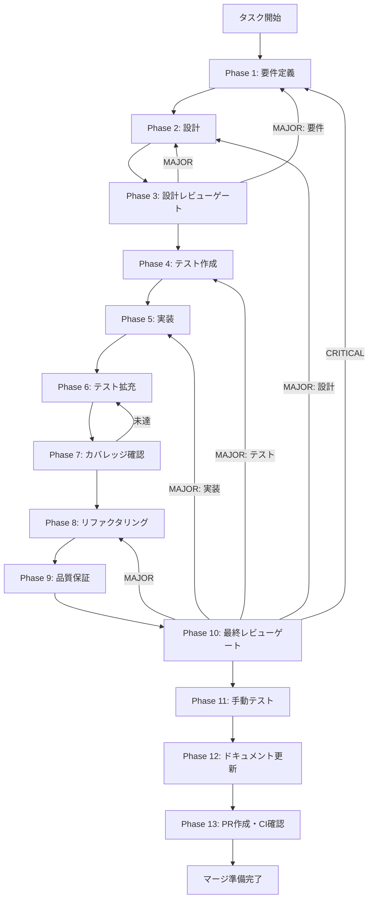

# llm-streaming-response - タスク実行仕様書

## ユーザーからの元の指示

```
GitHub Issue #465: [UT-LLM-STREAM-001] LLMストリーミングレスポンス実装

LLM APIからのレスポンスをリアルタイムでストリーミング表示し、ユーザー体験を向上させる。
システム仕様書で定義済みのllm:stream-chatチャンネルを実装し、
4プロバイダー（OpenAI、Anthropic、Google、xAI）のストリーミング対応を完了させる。
```

## メタ情報

| 項目         | 内容                                                                   |
| ------------ | ---------------------------------------------------------------------- |
| タスクID     | UT-LLM-STREAM-001                                                      |
| タスク名     | llm-streaming-response                                                 |
| 分類         | 改善                                                                   |
| 対象機能     | LLM API統合                                                            |
| 優先度       | 高                                                                     |
| 見積もり規模 | 中規模                                                                 |
| ステータス   | 未実施                                                                 |
| 作成日       | 2026-01-23                                                             |
| 発見経緯     | Phase 12（システムプロンプトLLM API統合）の未タスク検出                |
| GitHub Issue | [#465](https://github.com/daishiman/AIWorkflowOrchestrator/issues/465) |

---

## タスク概要

### 目的

LLM APIからのレスポンスをリアルタイムでストリーミング表示し、ユーザー体験を向上させる。現在の一括受信方式から、チャンク単位でのリアルタイム表示に変更することで、特に長文応答時の体感速度を改善する。

### 背景

現在のLLM API統合では、レスポンスを一括で受信してから表示する実装になっている。システム仕様書（interfaces-llm.md）には`llm:stream-chat`チャンネルが定義されており、ストリーミング対応のインターフェースは設計済みだが、チャットUIでの実装が完了していない。

**問題点**:

1. **UX問題**: 長い応答の場合、ユーザーは応答完了まで何も表示されず待機する必要がある
2. **体感速度**: 実際のレスポンス時間は同じでも、ストリーミング表示により体感速度が向上する
3. **インタラクティブ性**: リアルタイムで応答が表示されることで、対話的な体験が向上する

### 最終ゴール

1. チャットUIでLLM応答がリアルタイムに1文字ずつ（またはチャンク単位で）表示される
2. ストリーミング中の視覚的インジケーター（タイピングアニメーション等）が表示される
3. ストリーミング中のキャンセル機能が利用可能
4. 4プロバイダー（OpenAI、Anthropic、Google、xAI）でストリーミングが動作

### 成果物一覧

| 種別         | 成果物                            | 配置先                                           |
| ------------ | --------------------------------- | ------------------------------------------------ |
| 機能         | BaseLLMAdapter streamChat拡張     | `apps/desktop/src/main/adapters/llm/base.ts`     |
| 機能         | 各プロバイダーストリーミング実装  | `apps/desktop/src/main/adapters/llm/*Adapter.ts` |
| 機能         | llm:stream-chat IPCハンドラー     | `apps/desktop/src/main/handlers/llm-stream.ts`   |
| 機能         | StreamingMessage UIコンポーネント | `apps/desktop/src/renderer/components/chat/`     |
| テスト       | ユニット・統合テスト              | `apps/desktop/src/**/*.test.ts`                  |
| ドキュメント | 実装ガイド                        | `outputs/phase-12/implementation-guide.md`       |
| PR           | GitHub Pull Request               | GitHub UI                                        |

---

## 参照ファイル

本仕様書のコマンド選定は以下を参照：

| 参照資料                     | パス                                                                                               | 説明                            |
| ---------------------------- | -------------------------------------------------------------------------------------------------- | ------------------------------- |
| LLMインターフェース仕様      | `.claude/skills/aiworkflow-requirements/references/interfaces-llm.md`                              | IPC通信・型定義                 |
| システムプロンプト実装ガイド | `docs/30-workflows/completed-tasks/system-prompt-llm-api/outputs/phase-12/implementation-guide.md` | 既存LLM実装の参照               |
| エラーハンドリング仕様       | `.claude/skills/aiworkflow-requirements/references/error-handling.md`                              | エラー処理パターン              |
| アーキテクチャパターン       | `.claude/skills/aiworkflow-requirements/references/architecture-patterns.md`                       | Adapter/Factory/Template Method |

---

## スコープ定義

### 含むもの

- `llm:stream-chat` IPCチャンネルの実装
- 4プロバイダー（OpenAI、Anthropic、Google、xAI）のストリーミング対応
- チャットUIでのストリーミング表示
- ストリーミング中のキャンセル機能
- `isStreaming`フラグを使用した状態管理
- エラーハンドリング（途中切断、タイムアウト、APIエラー）

### 含まないもの

- RAGのストリーミング対応（別タスク）
- 音声合成との連携
- マークダウンのリアルタイムレンダリング最適化（基本対応のみ）

---

## タスク分解サマリー

| ID     | フェーズ | サブタスク名       | 責務                           | 依存   |
| ------ | -------- | ------------------ | ------------------------------ | ------ |
| T-01-1 | Phase 1  | 要件抽出           | ストリーミング要件の明確化     | -      |
| T-02-1 | Phase 2  | アーキテクチャ設計 | Adapter拡張・IPC設計           | T-01-1 |
| T-03-1 | Phase 3  | 設計レビュー       | 設計の妥当性検証               | T-02-1 |
| T-04-1 | Phase 4  | テスト作成         | ストリーミングテスト設計・実装 | T-03-1 |
| T-05-1 | Phase 5  | コア実装           | Adapter・IPC・UI実装           | T-04-1 |
| T-06-1 | Phase 6  | テスト拡充         | カバレッジ向上                 | T-05-1 |
| T-07-1 | Phase 7  | カバレッジ確認     | 基準達成確認                   | T-06-1 |
| T-08-1 | Phase 8  | リファクタリング   | コード品質改善                 | T-07-1 |
| T-09-1 | Phase 9  | 品質保証           | 全品質ゲートクリア             | T-08-1 |
| T-10-1 | Phase 10 | 最終レビュー       | 全体整合性検証                 | T-09-1 |
| T-11-1 | Phase 11 | 手動テスト         | UX・実環境動作確認             | T-10-1 |
| T-12-1 | Phase 12 | ドキュメント更新   | 実装ガイド・仕様書更新         | T-11-1 |
| T-13-1 | Phase 13 | PR作成             | コミット・PR・CI確認           | T-12-1 |

**総サブタスク数**: 13個

---

## 実行フロー図



---

## Phase一覧

| Phase | 名称               | 仕様書                                                 | ステータス |
| ----- | ------------------ | ------------------------------------------------------ | ---------- |
| 1     | 要件定義           | [phase-1-requirements.md](phase-1-requirements.md)     | 未実施     |
| 2     | 設計               | [phase-2-design.md](phase-2-design.md)                 | 未実施     |
| 3     | 設計レビューゲート | [phase-3-design-review.md](phase-3-design-review.md)   | 未実施     |
| 4     | テスト作成         | [phase-4-test-creation.md](phase-4-test-creation.md)   | 未実施     |
| 5     | 実装               | [phase-5-implementation.md](phase-5-implementation.md) | 未実施     |
| 6     | テスト拡充         | [phase-6-test-expansion.md](phase-6-test-expansion.md) | 未実施     |
| 7     | カバレッジ確認     | [phase-7-coverage-check.md](phase-7-coverage-check.md) | 未実施     |
| 8     | リファクタリング   | [phase-8-refactoring.md](phase-8-refactoring.md)       | 未実施     |
| 9     | 品質保証           | [phase-9-quality.md](phase-9-quality.md)               | 未実施     |
| 10    | 最終レビューゲート | [phase-10-final-review.md](phase-10-final-review.md)   | 未実施     |
| 11    | 手動テスト         | [phase-11-manual-test.md](phase-11-manual-test.md)     | 未実施     |
| 12    | ドキュメント更新   | [phase-12-documentation.md](phase-12-documentation.md) | 未実施     |
| 13    | PR作成             | [phase-13-pr-creation.md](phase-13-pr-creation.md)     | 未実施     |

---

## テストカバレッジ目標

### ユニットテスト

| 指標              | 最低基準 | 推奨基準 |
| ----------------- | -------- | -------- |
| Line Coverage     | 80%      | 90%      |
| Branch Coverage   | 60%      | 70%      |
| Function Coverage | 80%      | 90%      |

### 結合テスト

| 指標                         | 目標 |
| ---------------------------- | ---- |
| APIエンドポイント            | 100% |
| モジュール間インターフェース | 100% |
| 正常系シナリオ               | 100% |
| 異常系シナリオ               | 80%+ |
| 外部連携ポイント             | 100% |

---

## 統合テスト連携（Phase 1〜11で必須）

各Phaseで以下の統合テスト連携アクションを実施すること:

| Phase | 統合テスト連携アクション                                   |
| ----- | ---------------------------------------------------------- |
| 1     | IPC通信要件・ストリームイベント仕様を要件に明記            |
| 2     | IPC設計・Adapter拡張設計・UIイベントハンドリング設計を反映 |
| 3     | ストリーミング通信設計のレビューゲートを実施               |
| 4     | ストリーミング統合テストシナリオを全カテゴリで作成         |
| 5     | IPC→Adapter→Provider→Adapter→IPC→UIの接続実装              |
| 6     | 各プロバイダー統合テストの拡充                             |
| 7     | 統合テストの再実行とゲート判定                             |
| 8     | リファクタ後の統合テスト継続成功を確認                     |
| 9     | 品質保証で統合テスト結果を確認                             |
| 10    | 最終レビューで統合テスト結果を確認                         |
| 11    | 手動統合テスト（実際のAPI接続）を確認                      |

---

## Phase完了時の必須アクション

**各Phase完了時に以下を必ず実行すること:**

1. **タスク100%実行**: Phase内で指定された全タスクを完全に実行
2. **成果物確認**: 全ての必須成果物が生成されていることを検証
3. **実行記録**: 実行タスクの結果を記録
4. **artifacts.json更新**: Phase完了ステータスを更新
5. **Phase末端の実行確認**: 各タスクを100%実行し、各タスクを完遂した旨を必ず明記

```bash
# Phase完了時の検証コマンド
node .claude/skills/task-specification-creator/scripts/validate-phase-output.js docs/30-workflows/llm-streaming-response --phase {{PHASE_NUMBER}}

# Phase完了・成果物登録
node .claude/skills/task-specification-creator/scripts/complete-phase.js \
  --workflow docs/30-workflows/llm-streaming-response --phase {{PHASE_NUMBER}} --artifacts "..."
```

---

## 技術スタック

| カテゴリ          | 技術                                                                                              |
| ----------------- | ------------------------------------------------------------------------------------------------- |
| 言語              | TypeScript 5.x                                                                                    |
| フレームワーク    | Electron, React                                                                                   |
| 状態管理          | Redux Toolkit                                                                                     |
| IPC通信           | ipcMain.handle/on, ipcRenderer.invoke/on                                                          |
| ストリーミングAPI | OpenAI (stream: true), Anthropic (stream: true), Google (generateContentStream), xAI (OpenAI互換) |
| テスト            | Vitest, @testing-library/react                                                                    |

---

## 依存タスク

| タスクID                    | タスク名                      | ステータス |
| --------------------------- | ----------------------------- | ---------- |
| TASK-CHAT-SYSPROMPT-LLM-001 | システムプロンプトLLM API統合 | 完了       |

---

## リスクと対策

| リスク                         | 影響度 | 発生確率 | 対策                                |
| ------------------------------ | ------ | -------- | ----------------------------------- |
| プロバイダー間のAPI差異        | 中     | 高       | 共通インターフェースで抽象化        |
| ストリーミング中のメモリリーク | 高     | 中       | クリーンアップ処理の徹底            |
| UIパフォーマンス低下           | 中     | 中       | requestAnimationFrameでの描画最適化 |
| ネットワーク切断時のエラー     | 中     | 中       | 適切なエラーハンドリング・リトライ  |

---

## 変更履歴

| Version | Date       | Changes                           |
| ------- | ---------- | --------------------------------- |
| 1.0.0   | 2026-01-23 | 初版作成（GitHub Issue #465より） |
