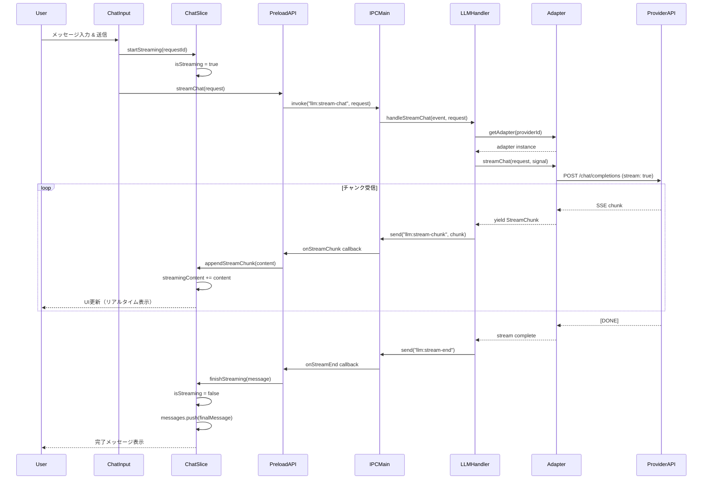
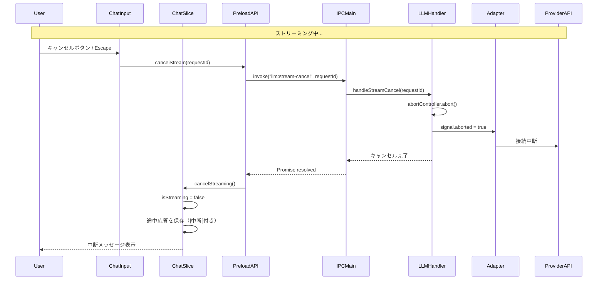
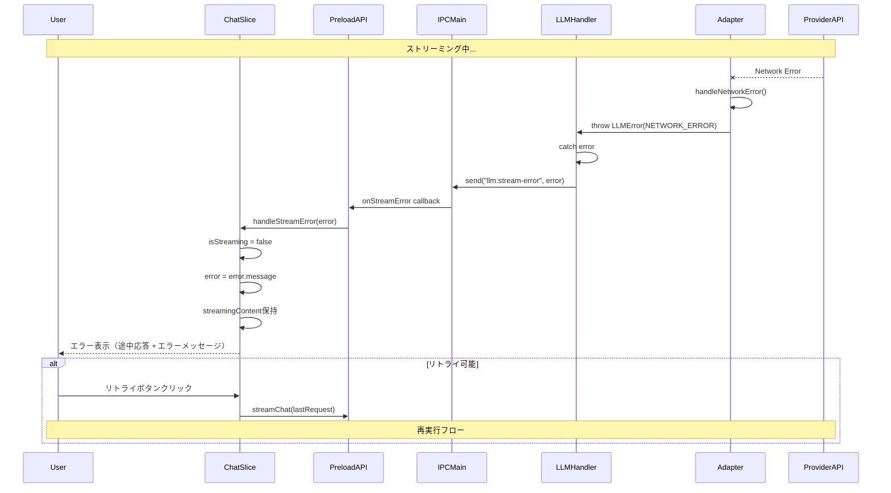
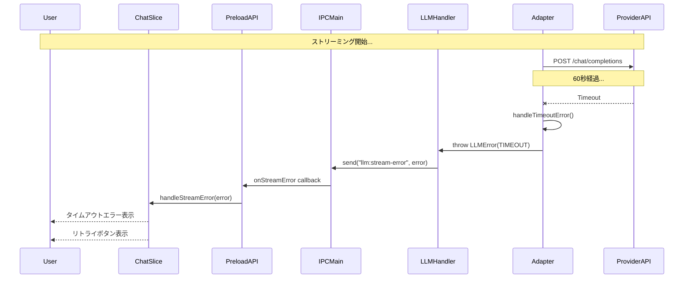
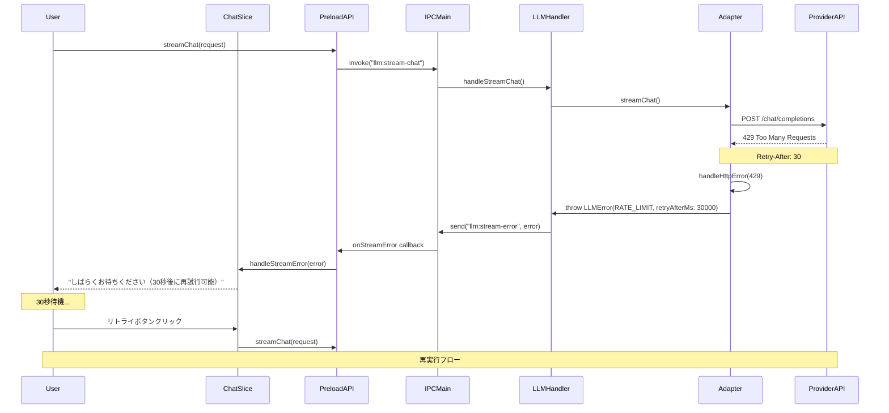
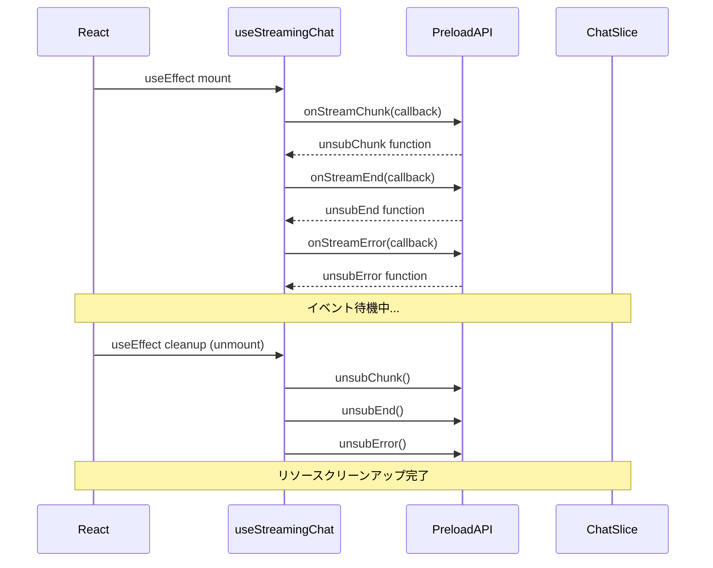
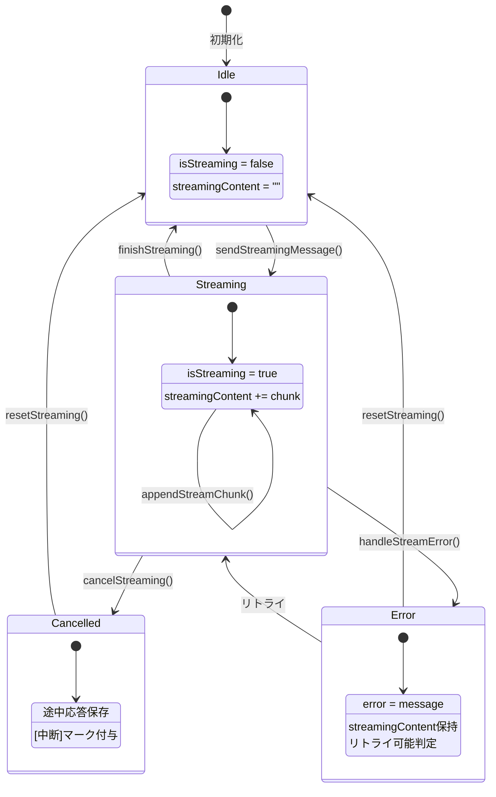

# Phase 2: シーケンス図

## メタ情報

| 項目       | 内容              |
| ---------- | ----------------- |
| タスクID   | UT-LLM-STREAM-001 |
| Phase      | 2                 |
| 作成日     | 2026-01-23        |
| ステータス | 完了              |

---

## 1. 正常系: ストリーミングチャット



---

## 2. キャンセル: ストリーミング中断



---

## 3. エラー系: ネットワークエラー



---

## 4. エラー系: タイムアウト



---

## 5. エラー系: レート制限



---

## 6. 初期化: イベント購読



---

## 7. 状態遷移図



---

## 8. データフローサマリー

### 8.1 送信方向（Renderer → Main → Provider）

```
User Action
    │
    ▼
ChatInput.onSend()
    │
    ▼
useStreamingChat.sendStreamingMessage()
    │
    ▼
window.llmAPI.streamChat(request)
    │
    ▼ IPC invoke
ipcMain.handle("llm:stream-chat")
    │
    ▼
handleStreamChat()
    │
    ▼
LLMAdapterFactory.getAdapter()
    │
    ▼
adapter.streamChat(request, signal)
    │
    ▼ HTTP POST (SSE)
Provider API
```

### 8.2 受信方向（Provider → Main → Renderer）

```
Provider API (SSE)
    │
    ▼
adapter.streamChat() yield chunk
    │
    ▼
handleStreamChat() for await
    │
    ▼ IPC send
event.sender.send("llm:stream-chunk", chunk)
    │
    ▼
preload.safeOn() callback
    │
    ▼
useStreamingChat() handler
    │
    ▼
ChatSlice.appendStreamChunk()
    │
    ▼
React re-render
    │
    ▼
StreamingMessage UI更新
```

---

## 変更履歴

| Version | Date       | Changes  |
| ------- | ---------- | -------- |
| 1.0.0   | 2026-01-23 | 初版作成 |
