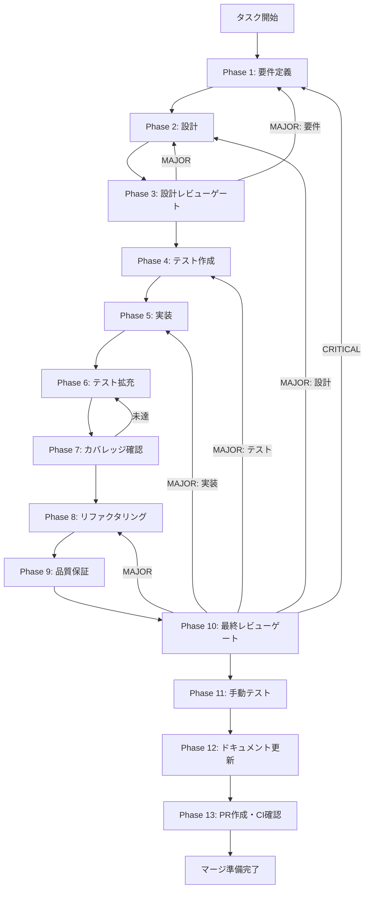

# logging-service - タスク実行仕様書

## ユーザーからの元の指示

```
ファイル変換処理のログを構造化して記録するサービスを実装する。
（docs/30-workflows/unassigned-task/task-05-01-logging-service.md より）
```

## メタ情報

| 項目         | 内容                                    |
| ------------ | --------------------------------------- |
| タスクID     | CONV-05-01                              |
| タスク名     | logging-service                         |
| 分類         | 新機能                                  |
| 対象機能     | ログ記録サービス                        |
| 親タスク     | CONV-05 (履歴/ログ管理)                 |
| 依存タスク   | CONV-04-02 (files/conversions テーブル) |
| 優先度       | 中                                      |
| 見積もり規模 | 小規模                                  |
| ステータス   | 未実施                                  |
| 作成日       | 2026-01-07                              |

---

## タスク概要

### 目的

ファイル変換処理のログを構造化して記録するサービスを実装する。変換処理のイベント情報（開始、完了、エラー）をログレベル別に記録し、バッファリングと自動フラッシュ機能を持つ効率的なロギングシステムを構築する。

### 背景

- 変換処理のトレーサビリティ確保が必要
- 処理履歴の可視化と分析への対応
- デバッグやトラブルシューティングの効率化
- CONV-04-02で作成されたfiles/conversionsテーブルとの連携

### 最終ゴール

- `ConversionLogger`クラスが実装され、INFO/WARN/ERRORレベルのログ記録が可能
- バッファリングと自動フラッシュ機能が動作
- バッチログ記録機能が利用可能
- 全テストがパスし、カバレッジ基準を達成

### 成果物一覧

| 種別         | 成果物                                   | 配置先                                                                     |
| ------------ | ---------------------------------------- | -------------------------------------------------------------------------- |
| 型定義       | ConversionLog型, LogLevel型, LogAction型 | `packages/shared/src/services/logging/types.ts`                            |
| サービス     | ConversionLoggerクラス                   | `packages/shared/src/services/logging/conversion-logger.ts`                |
| テスト       | ConversionLogger テストスイート          | `packages/shared/src/services/logging/__tests__/conversion-logger.test.ts` |
| ドキュメント | Phase 1-12 成果物                        | `outputs/phase-*/`                                                         |
| PR           | GitHub Pull Request                      | GitHub UI                                                                  |

---

## 参照ファイル

本仕様書の作成は以下を参照：

- `docs/30-workflows/unassigned-task/task-05-01-logging-service.md` - 元タスク指示書
- `.claude/skills/task-specification-creator/SKILL.md` - タスク仕様書作成スキル
- `.claude/skills/aiworkflow-requirements/references/` - システム仕様

---

## タスク分解サマリー

| ID     | フェーズ | サブタスク名         | 責務                                     | 依存 |
| ------ | -------- | -------------------- | ---------------------------------------- | ---- |
| T-01-1 | Phase 1  | 要件定義             | 目的・スコープ・受け入れ基準定義         | -    |
| T-02-1 | Phase 2  | 設計                 | アーキテクチャ・詳細設計                 | T-01 |
| T-03-1 | Phase 3  | 設計レビューゲート   | 要件・設計の妥当性検証                   | T-02 |
| T-04-1 | Phase 4  | テスト作成           | TDD: Red（失敗するテスト作成）           | T-03 |
| T-05-1 | Phase 5  | 実装                 | TDD: Green（テストを通す実装）           | T-04 |
| T-06-1 | Phase 6  | テスト拡充           | カバレッジ目標達成に向けた追加テスト     | T-05 |
| T-07-1 | Phase 7  | テストカバレッジ確認 | カバレッジ目標検証                       | T-06 |
| T-08-1 | Phase 8  | リファクタリング     | TDD: Refactor（品質改善）                | T-07 |
| T-09-1 | Phase 9  | 品質保証             | 静的解析・セキュリティ・性能             | T-08 |
| T-10-1 | Phase 10 | 最終レビューゲート   | 全体品質・整合性検証                     | T-09 |
| T-11-1 | Phase 11 | 手動テスト検証       | UX・実環境動作確認                       | T-10 |
| T-12-1 | Phase 12 | ドキュメント更新     | ドキュメント更新・仕様反映・未タスク検出 | T-11 |
| T-13-1 | Phase 13 | PR作成               | `/ai:diff-to-pr` でコミット・PR・CI確認  | T-12 |

**総サブタスク数**: 13個

---

## 実行フロー図



---

## Phase一覧

| Phase | 名称               | 仕様書                                                 | ステータス |
| ----- | ------------------ | ------------------------------------------------------ | ---------- |
| 1     | 要件定義           | [phase-1-requirements.md](phase-1-requirements.md)     | 未実施     |
| 2     | 設計               | [phase-2-design.md](phase-2-design.md)                 | 未実施     |
| 3     | 設計レビューゲート | [phase-3-design-review.md](phase-3-design-review.md)   | 未実施     |
| 4     | テスト作成         | [phase-4-test-creation.md](phase-4-test-creation.md)   | 未実施     |
| 5     | 実装               | [phase-5-implementation.md](phase-5-implementation.md) | 未実施     |
| 6     | テスト拡充         | [phase-6-test-expansion.md](phase-6-test-expansion.md) | 未実施     |
| 7     | カバレッジ確認     | [phase-7-coverage-check.md](phase-7-coverage-check.md) | 未実施     |
| 8     | リファクタリング   | [phase-8-refactoring.md](phase-8-refactoring.md)       | 未実施     |
| 9     | 品質保証           | [phase-9-quality.md](phase-9-quality.md)               | 未実施     |
| 10    | 最終レビューゲート | [phase-10-final-review.md](phase-10-final-review.md)   | 未実施     |
| 11    | 手動テスト         | [phase-11-manual-test.md](phase-11-manual-test.md)     | 未実施     |
| 12    | ドキュメント更新   | [phase-12-documentation.md](phase-12-documentation.md) | 未実施     |
| 13    | PR作成             | [phase-13-pr-creation.md](phase-13-pr-creation.md)     | 未実施     |

---

## テストカバレッジ目標

### ユニットテスト

| 指標              | 最低基準 | 推奨基準 |
| ----------------- | -------- | -------- |
| Line Coverage     | 80%      | 90%      |
| Branch Coverage   | 60%      | 70%      |
| Function Coverage | 80%      | 90%      |

### 結合テスト

| 指標                         | 目標 |
| ---------------------------- | ---- |
| APIエンドポイント            | N/A  |
| モジュール間インターフェース | 100% |
| 正常系シナリオ               | 100% |
| 異常系シナリオ               | 80%+ |
| 外部連携ポイント             | 100% |

---

## 統合テスト連携（Phase 1〜11で必須）

各Phaseで以下の統合テスト連携アクションを実施すること:

| Phase | 統合テスト連携アクション                                  |
| ----- | --------------------------------------------------------- |
| 1     | LogRepository/DB接続要件を要件に明記                      |
| 2     | ConversionLogger → LogRepository統合ポイントを設計に反映  |
| 3     | 統合テスト観点のレビューゲートを実施                      |
| 4     | 統合テストシナリオを全カテゴリで作成（モック/スタブ使用） |
| 5     | LogRepository接続の実装とテスト支援コード整備             |
| 6     | 統合テストの拡充（全カテゴリのカバレッジ向上）            |
| 7     | 統合テストの再実行とゲート判定                            |
| 8     | リファクタ後の統合テスト継続成功を確認                    |
| 9     | 品質保証で統合テスト結果を確認                            |
| 10    | 最終レビューで統合テスト結果を確認                        |
| 11    | 手動統合テスト（ログ出力確認）を確認                      |

---

## Phase完了時の必須アクション

**各Phase完了時に以下を必ず実行すること:**

1. **スキル100%実行**: Phase内で指定された全スキルを完全に実行
2. **成果物確認**: 全ての必須成果物が生成されていることを検証
3. **フィードバック記録**: 使用スキルの結果をLOGS.mdに記録
4. **artifacts.json更新**: Phase完了ステータスを更新
5. **Phase末端の実行確認**: 各スキルを100%実行し、各タスクを完遂した旨を必ず明記

```bash
# Phase完了時の検証コマンド
node .claude/skills/task-specification-creator/scripts/validate-phase-output.mjs docs/30-workflows/logging-service --phase {{PHASE_NUMBER}}

# Phase完了・成果物登録
node .claude/skills/task-specification-creator/scripts/complete-phase.mjs \
  --workflow docs/30-workflows/logging-service --phase {{PHASE_NUMBER}} --artifacts "..."
```

---

## 使用スキル一覧（Phase別）

| Phase | 使用スキル                                                          |
| ----- | ------------------------------------------------------------------- |
| 1     | requirements-engineering, acceptance-criteria-writing               |
| 2     | architectural-patterns, domain-modeling, zod-validation             |
| 3     | (レビューゲート)                                                    |
| 4     | tdd-principles, test-doubles, boundary-value-analysis               |
| 5     | clean-code-practices, error-handling-patterns, type-safety-patterns |
| 6     | test-coverage-analysis, integration-testing                         |
| 7     | test-coverage-analysis                                              |
| 8     | refactoring-patterns, code-smell-detection, solid-principles        |
| 9     | static-analysis, security-scanning                                  |
| 10    | (最終レビューゲート)                                                |
| 11    | (手動テスト)                                                        |
| 12    | documentation-architecture, user-centric-writing                    |
| 13    | `/ai:diff-to-pr`                                                    |
