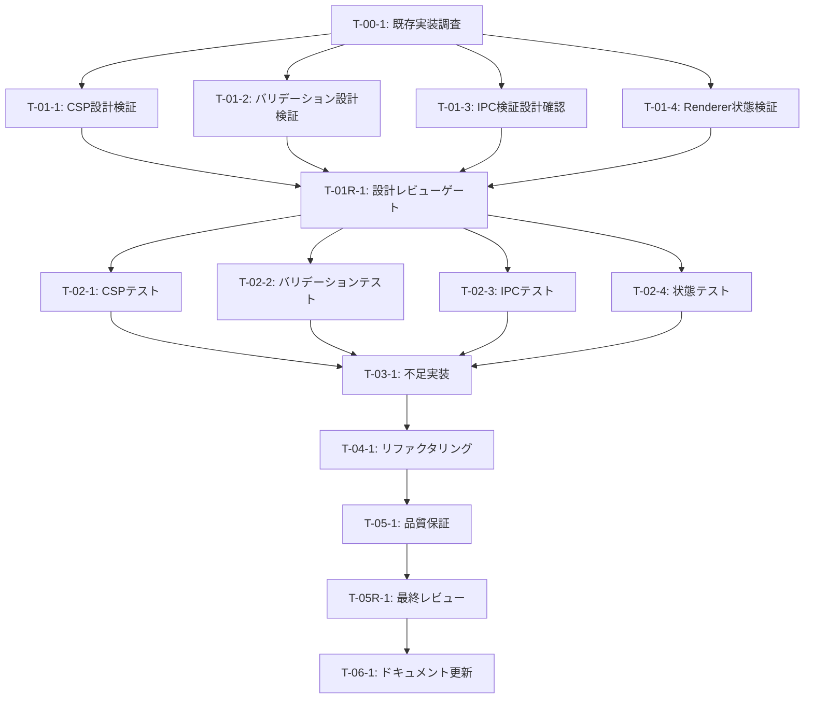

# login-only-auth セキュリティ強化 - タスク実行仕様書

## ユーザーからの元の指示

```
login-only-auth セキュリティ強化
Phase 5.5 Final Review Gate において、@electron-security エージェントによるセキュリティレビューで
以下の改善点が指摘された：
1. Content Security Policy (CSP) 未設定
2. 入力値バリデーション不足
3. IPC sender検証未実装
4. Renderer側での機密情報保持リスク
```

---

## タスク概要

### 目的

Electronアプリケーションのセキュリティベストプラクティスに準拠し、Phase 5.5のセキュリティレビュー指摘事項を解消する。CSP設定、入力値バリデーション、IPC sender検証、Renderer状態最小化の4つの観点で既存実装を検証し、不足があれば強化を行う。

### 背景

認証機能（AuthView/AuthGuard）実装後のセキュリティレビューにおいて、Electronアプリケーション特有のセキュリティ強化が必要と判断された。既存実装の有無を確認し、不足部分の補完と品質検証を行う。

### 最終ゴール

- CSPが本番環境で適切に設定されている
- すべての入力値がZodスキーマで検証されている
- IPC呼び出し元の検証が実装されている
- Renderer側で機密トークンが保持されていない
- セキュリティテストがすべてパスしている
- `@electron-security` レビューでPASS評価

### 成果物一覧

| 種別         | 成果物                       | 配置先                                                   |
| ------------ | ---------------------------- | -------------------------------------------------------- |
| 検証レポート | セキュリティ検証レポート     | docs/30-workflows/login-only-auth-security/              |
| テスト       | セキュリティテスト           | apps/desktop/src/main/infrastructure/security/\*.test.ts |
| ドキュメント | セキュリティガイドライン更新 | docs/00-requirements/17-security-guidelines.md           |

---

## 参照ファイル

本仕様書のコマンド・エージェント・スキル選定は以下を参照：

- `docs/00-requirements/master_system_design.md` - システム要件
- `.claude/commands/ai/command_list.md` - /ai:コマンド定義
- `.claude/agents/agent_list.md` - エージェント定義
- `.claude/skills/skill_list.md` - スキル定義

---

## タスク分解サマリー

| ID      | フェーズ  | サブタスク名                   | 責務                     | 依存      |
| ------- | --------- | ------------------------------ | ------------------------ | --------- |
| T-00-1  | Phase 0   | 既存実装状況の調査             | 現状把握                 | なし      |
| T-01-1  | Phase 1   | CSP設計の検証                  | CSP設計確認              | T-00-1    |
| T-01-2  | Phase 1   | 入力バリデーション設計の検証   | バリデーション設計確認   | T-00-1    |
| T-01-3  | Phase 1   | IPC検証設計の確認              | IPC検証設計確認          | T-00-1    |
| T-01-4  | Phase 1   | Renderer状態設計の検証         | 状態設計確認             | T-00-1    |
| T-01R-1 | Phase 1.5 | 設計レビューゲート             | 設計妥当性検証           | T-01-1〜4 |
| T-02-1  | Phase 2   | CSPテスト作成                  | CSPテスト追加            | T-01R-1   |
| T-02-2  | Phase 2   | 入力バリデーションテスト作成   | バリデーションテスト追加 | T-01R-1   |
| T-02-3  | Phase 2   | IPC検証テスト作成              | IPC検証テスト追加        | T-01R-1   |
| T-02-4  | Phase 2   | Renderer状態テスト作成         | 状態テスト追加           | T-01R-1   |
| T-03-1  | Phase 3   | 不足機能の実装（該当する場合） | 実装補完                 | T-02-1〜4 |
| T-04-1  | Phase 4   | コード品質改善                 | リファクタリング         | T-03-1    |
| T-05-1  | Phase 5   | 品質保証・セキュリティスキャン | 品質検証                 | T-04-1    |
| T-05R-1 | Phase 5.5 | 最終レビューゲート             | 最終検証                 | T-05-1    |
| T-06-1  | Phase 6   | ドキュメント更新               | ドキュメント反映         | T-05R-1   |

**総サブタスク数**: 15個

---

## 実行フロー図



---

## Phase 0: 要件定義

### T-00-1: 既存実装状況の調査

#### 目的

セキュリティ強化の対象となる既存実装の有無と実装状況を正確に把握する。

#### 背景

Phase 5.5レビューで指摘された4項目について、既に実装済みの可能性があるため、まず現状を調査する。

#### 責務（単一責務）

既存実装状況の調査と整理のみ

#### Claude Code スラッシュコマンド

> 以下はターミナルコマンドではなく、Claude Code内で実行するスラッシュコマンドです

```
/ai:review-architecture scope: security
```

- **参照**: `.claude/commands/ai/command_list.md`

#### 使用エージェント

- **エージェント**: @sec-auditor
- **選定理由**: セキュリティ観点での既存実装調査に最適
- **参照**: `.claude/agents/agent_list.md`

#### 活用スキル

| スキル名                      | 活用方法                   |
| ----------------------------- | -------------------------- |
| security-configuration-review | 既存セキュリティ設定の確認 |
| code-smell-detection          | セキュリティ上の問題検出   |

- **参照**: `.claude/skills/skill_list.md`

#### 成果物

| 成果物   | パス                                                               | 内容                 |
| -------- | ------------------------------------------------------------------ | -------------------- |
| 調査結果 | docs/30-workflows/login-only-auth-security/step01-investigation.md | 既存実装状況レポート |

#### 完了条件

- [ ] CSP設定の実装有無が確認できた
- [ ] Zodスキーマの実装有無が確認できた
- [ ] IPC validator の実装有無が確認できた
- [ ] authSliceでのトークン管理状況が確認できた

#### 依存関係

- **前提**: なし
- **後続**: T-01-1, T-01-2, T-01-3, T-01-4

---

## Phase 1: 設計

### T-01-1: CSP設計の検証

#### 目的

既存CSP設定が要件を満たしているかを検証する。

#### 背景

CSPはXSS攻撃を防御する重要なセキュリティメカニズムであり、本番環境と開発環境で適切に分離されている必要がある。

#### 責務（単一責務）

CSP設定の設計妥当性検証のみ

#### Claude Code スラッシュコマンド

> 以下はターミナルコマンドではなく、Claude Code内で実行するスラッシュコマンドです

```
/ai:secure-electron-app scope: csp
```

- **参照**: `.claude/commands/ai/command_list.md`

#### 使用エージェント

- **エージェント**: @electron-security
- **選定理由**: Electron固有のCSP設定に精通
- **参照**: `.claude/agents/agent_list.md`

#### 活用スキル

| スキル名                    | 活用方法                        |
| --------------------------- | ------------------------------- |
| electron-security-hardening | CSP設定のベストプラクティス確認 |

- **参照**: `.claude/skills/skill_list.md`

#### 成果物

| 成果物      | パス                                                            | 内容                |
| ----------- | --------------------------------------------------------------- | ------------------- |
| CSP検証結果 | docs/30-workflows/login-only-auth-security/step02-csp-review.md | CSP設計検証レポート |

#### 完了条件

- [ ] 本番環境でunsafe-evalが含まれていないことを確認
- [ ] 開発環境でHMR対応のためunsafe-evalが許可されていることを確認
- [ ] Supabase URLがconnect-srcに含まれることを確認
- [ ] frame-ancestorsが'none'に設定されていることを確認

#### 依存関係

- **前提**: T-00-1
- **後続**: T-01R-1

---

### T-01-2: 入力バリデーション設計の検証

#### 目的

既存Zodスキーマが要件を満たしているかを検証する。

#### 背景

入力値バリデーションはXSS・SQLインジェクション等を防ぐ最前線であり、型安全性とランタイム検証の両方が必要。

#### 責務（単一責務）

入力バリデーションスキーマの設計妥当性検証のみ

#### Claude Code スラッシュコマンド

> 以下はターミナルコマンドではなく、Claude Code内で実行するスラッシュコマンドです

```
/ai:security-audit scope: validation
```

- **参照**: `.claude/commands/ai/command_list.md`

#### 使用エージェント

- **エージェント**: @sec-auditor
- **選定理由**: 入力検証のセキュリティ観点レビューに最適
- **参照**: `.claude/agents/agent_list.md`

#### 活用スキル

| スキル名             | 活用方法                            |
| -------------------- | ----------------------------------- |
| zod-validation       | Zodスキーマのベストプラクティス確認 |
| type-safety-patterns | 型安全性の検証                      |

- **参照**: `.claude/skills/skill_list.md`

#### 成果物

| 成果物                 | パス                                                                   | 内容                           |
| ---------------------- | ---------------------------------------------------------------------- | ------------------------------ |
| バリデーション検証結果 | docs/30-workflows/login-only-auth-security/step03-validation-review.md | バリデーション設計検証レポート |

#### 完了条件

- [ ] displayNameスキーマがXSS対策を含むことを確認
- [ ] oauthProviderスキーマがホワイトリストで検証されることを確認
- [ ] avatarUrlスキーマがHTTPSのみ許可することを確認
- [ ] IPC引数スキーマが定義されていることを確認

#### 依存関係

- **前提**: T-00-1
- **後続**: T-01R-1

---

### T-01-3: IPC検証設計の確認

#### 目的

既存IPC validator が要件を満たしているかを検証する。

#### 背景

IPC sender検証は、DevToolsや不正スクリプトからの攻撃を防ぐElectron固有のセキュリティ対策。

#### 責務（単一責務）

IPC検証メカニズムの設計妥当性検証のみ

#### Claude Code スラッシュコマンド

> 以下はターミナルコマンドではなく、Claude Code内で実行するスラッシュコマンドです

```
/ai:secure-electron-app scope: ipc
```

- **参照**: `.claude/commands/ai/command_list.md`

#### 使用エージェント

- **エージェント**: @electron-security
- **選定理由**: Electron IPCセキュリティの専門家
- **参照**: `.claude/agents/agent_list.md`

#### 活用スキル

| スキル名                    | 活用方法                        |
| --------------------------- | ------------------------------- |
| electron-security-hardening | IPC検証のベストプラクティス確認 |

- **参照**: `.claude/skills/skill_list.md`

#### 成果物

| 成果物      | パス                                                            | 内容                |
| ----------- | --------------------------------------------------------------- | ------------------- |
| IPC検証結果 | docs/30-workflows/login-only-auth-security/step04-ipc-review.md | IPC検証設計レポート |

#### 完了条件

- [ ] webContentsからBrowserWindowが取得できることを検証していることを確認
- [ ] DevToolsからの呼び出しが拒否されることを確認
- [ ] 許可ウィンドウリストとの照合が行われることを確認
- [ ] セキュリティログが出力されることを確認

#### 依存関係

- **前提**: T-00-1
- **後続**: T-01R-1

---

### T-01-4: Renderer状態設計の検証

#### 目的

authSliceでトークンが保持されていないことを検証する。

#### 背景

Renderer側で機密トークンを保持すると、XSS攻撃によりトークンが漏洩するリスクがある。

#### 責務（単一責務）

Renderer状態の機密情報管理状況の検証のみ

#### Claude Code スラッシュコマンド

> 以下はターミナルコマンドではなく、Claude Code内で実行するスラッシュコマンドです

```
/ai:code-review-complete target-path: apps/desktop/src/renderer/store/slices/authSlice.ts
```

- **参照**: `.claude/commands/ai/command_list.md`

#### 使用エージェント

- **エージェント**: @sec-auditor
- **選定理由**: 機密情報管理のセキュリティレビューに最適
- **参照**: `.claude/agents/agent_list.md`

#### 活用スキル

| スキル名      | 活用方法           |
| ------------- | ------------------ |
| state-manager | 状態管理の設計確認 |

- **参照**: `.claude/skills/skill_list.md`

#### 成果物

| 成果物       | パス                                                              | 内容                     |
| ------------ | ----------------------------------------------------------------- | ------------------------ |
| 状態検証結果 | docs/30-workflows/login-only-auth-security/step05-state-review.md | Renderer状態設計レポート |

#### 完了条件

- [ ] access_tokenがRenderer状態に含まれていないことを確認
- [ ] refresh_tokenがRenderer状態に含まれていないことを確認
- [ ] sessionExpiresAtのみが保持されていることを確認
- [ ] トークンはMain Processでのみ管理されていることを確認

#### 依存関係

- **前提**: T-00-1
- **後続**: T-01R-1

---

## Phase 1.5: 設計レビューゲート

### T-01R-1: 設計レビューゲート

#### 目的

Phase 2（テスト作成）に進む前に、設計の妥当性を複数エージェントで検証する。

#### 背景

設計ミスが実装後に発見されると修正コストが大幅に増加する。「Shift Left」原則に基づき、問題を可能な限り早期に検出する。

#### レビュー参加エージェント

| エージェント       | レビュー観点         | 選定理由               |
| ------------------ | -------------------- | ---------------------- |
| @electron-security | Electronセキュリティ | CSP、IPC検証の専門性   |
| @sec-auditor       | 一般セキュリティ     | OWASP観点での検証      |
| @arch-police       | アーキテクチャ整合性 | 既存設計との整合性確認 |

- **参照**: `.claude/agents/agent_list.md`

#### レビューチェックリスト

**CSP設計** (@electron-security)

- [ ] CSP設定が環境別に分離されているか
- [ ] 本番環境で厳格なポリシーが適用されるか
- [ ] Supabase接続が適切に許可されているか

**入力バリデーション** (@sec-auditor)

- [ ] XSS対策が十分か
- [ ] ホワイトリスト方式が採用されているか
- [ ] エラーメッセージが適切か

**IPC検証** (@electron-security)

- [ ] sender検証が全認証IPCに適用されているか
- [ ] ログ出力が適切か
- [ ] エラーハンドリングが適切か

**Renderer状態** (@sec-auditor)

- [ ] 機密情報が保持されていないか
- [ ] セッション管理が適切か

#### レビュー結果

- **判定**: 未実施
- **指摘事項**: -
- **対応方針**: -

#### 戻り先決定（MAJORの場合）

| 問題の種類               | 戻り先 |
| ------------------------ | ------ |
| CSP設計の問題            | T-01-1 |
| バリデーション設計の問題 | T-01-2 |
| IPC検証設計の問題        | T-01-3 |
| 状態設計の問題           | T-01-4 |

#### 完了条件

- [ ] 全レビュー観点でPASS判定
- [ ] MINOR指摘があれば対応完了

#### 依存関係

- **前提**: T-01-1, T-01-2, T-01-3, T-01-4
- **後続**: T-02-1, T-02-2, T-02-3, T-02-4

---

## Phase 2: テスト作成 (TDD: Red)

### T-02-1: CSPテスト作成

#### 目的

CSP設定が期待通りに生成されることを検証するテストを作成する。

#### 背景

TDD原則に基づき、テストを先に作成して期待動作を明確にする。

#### 責務（単一責務）

CSP生成のテストコード作成のみ

#### Claude Code スラッシュコマンド

> 以下はターミナルコマンドではなく、Claude Code内で実行するスラッシュコマンドです

```
/ai:generate-unit-tests target-file: apps/desktop/src/main/infrastructure/security/csp.ts
```

- **参照**: `.claude/commands/ai/command_list.md`

#### 使用エージェント

- **エージェント**: @unit-tester
- **選定理由**: ユニットテスト作成の専門家
- **参照**: `.claude/agents/agent_list.md`

#### 活用スキル

| スキル名       | 活用方法                         |
| -------------- | -------------------------------- |
| tdd-principles | Red-Green-Refactorサイクルの適用 |
| test-doubles   | モック・スタブの活用             |

- **参照**: `.claude/skills/skill_list.md`

#### 成果物

| 成果物    | パス                                                      | 内容          |
| --------- | --------------------------------------------------------- | ------------- |
| CSPテスト | apps/desktop/src/main/infrastructure/security/csp.test.ts | CSP生成テスト |

#### TDD検証: Red状態確認

```bash
pnpm --filter @repo/desktop test:run csp.test.ts
```

- [ ] テストが失敗することを確認（Red状態）

#### 完了条件

- [ ] 本番環境CSP生成テストが作成されている
- [ ] 開発環境CSP生成テストが作成されている
- [ ] Supabase URL含有テストが作成されている
- [ ] frame-ancestors設定テストが作成されている

#### 依存関係

- **前提**: T-01R-1
- **後続**: T-03-1

---

### T-02-2: 入力バリデーションテスト作成

#### 目的

Zodスキーマが期待通りに検証を行うことを確認するテストを作成する。

#### 背景

バリデーションの境界値テストは特に重要であり、XSS攻撃パターンを含むテストケースが必要。

#### 責務（単一責務）

バリデーションスキーマのテストコード作成のみ

#### Claude Code スラッシュコマンド

> 以下はターミナルコマンドではなく、Claude Code内で実行するスラッシュコマンドです

```
/ai:generate-unit-tests target-file: packages/shared/schemas/auth.ts
```

- **参照**: `.claude/commands/ai/command_list.md`

#### 使用エージェント

- **エージェント**: @unit-tester
- **選定理由**: ユニットテスト作成の専門家
- **参照**: `.claude/agents/agent_list.md`

#### 活用スキル

| スキル名                | 活用方法                         |
| ----------------------- | -------------------------------- |
| boundary-value-analysis | 境界値テストの作成               |
| tdd-principles          | Red-Green-Refactorサイクルの適用 |

- **参照**: `.claude/skills/skill_list.md`

#### 成果物

| 成果物               | パス                                 | 内容                         |
| -------------------- | ------------------------------------ | ---------------------------- |
| バリデーションテスト | packages/shared/schemas/auth.test.ts | スキーマバリデーションテスト |

#### TDD検証: Red状態確認

```bash
pnpm --filter @repo/shared test:run auth.test.ts
```

- [ ] テストが失敗することを確認（Red状態）

#### 完了条件

- [ ] displayName有効値テストが作成されている
- [ ] displayName無効値テストが作成されている（XSS攻撃パターン含む）
- [ ] oauthProviderホワイトリストテストが作成されている
- [ ] avatarUrl HTTPSテストが作成されている

#### 依存関係

- **前提**: T-01R-1
- **後続**: T-03-1

---

### T-02-3: IPC検証テスト作成

#### 目的

IPC validator が不正な呼び出しを適切に拒否することを検証するテストを作成する。

#### 背景

IPC検証はElectronセキュリティの要であり、様々な攻撃パターンに対するテストが必要。

#### 責務（単一責務）

IPC検証のテストコード作成のみ

#### Claude Code スラッシュコマンド

> 以下はターミナルコマンドではなく、Claude Code内で実行するスラッシュコマンドです

```
/ai:generate-unit-tests target-file: apps/desktop/src/main/infrastructure/security/ipc-validator.ts
```

- **参照**: `.claude/commands/ai/command_list.md`

#### 使用エージェント

- **エージェント**: @unit-tester
- **選定理由**: ユニットテスト作成の専門家
- **参照**: `.claude/agents/agent_list.md`

#### 活用スキル

| スキル名       | 活用方法                         |
| -------------- | -------------------------------- |
| test-doubles   | Electronモックの活用             |
| tdd-principles | Red-Green-Refactorサイクルの適用 |

- **参照**: `.claude/skills/skill_list.md`

#### 成果物

| 成果物        | パス                                                                | 内容          |
| ------------- | ------------------------------------------------------------------- | ------------- |
| IPC検証テスト | apps/desktop/src/main/infrastructure/security/ipc-validator.test.ts | IPC検証テスト |

#### TDD検証: Red状態確認

```bash
pnpm --filter @repo/desktop test:run ipc-validator.test.ts
```

- [ ] テストが失敗することを確認（Red状態）

#### 完了条件

- [ ] 有効なwebContentsテストが作成されている
- [ ] 無効なwebContentsテストが作成されている
- [ ] DevTools拒否テストが作成されている
- [ ] ログ出力テストが作成されている

#### 依存関係

- **前提**: T-01R-1
- **後続**: T-03-1

---

### T-02-4: Renderer状態テスト作成

#### 目的

authSliceが機密トークンを保持しないことを検証するテストを作成する。

#### 背景

状態管理の型レベルでの保証だけでなく、ランタイムでの検証も必要。

#### 責務（単一責務）

Renderer状態のテストコード作成のみ

#### Claude Code スラッシュコマンド

> 以下はターミナルコマンドではなく、Claude Code内で実行するスラッシュコマンドです

```
/ai:generate-unit-tests target-file: apps/desktop/src/renderer/store/slices/authSlice.ts
```

- **参照**: `.claude/commands/ai/command_list.md`

#### 使用エージェント

- **エージェント**: @unit-tester
- **選定理由**: ユニットテスト作成の専門家
- **参照**: `.claude/agents/agent_list.md`

#### 活用スキル

| スキル名       | 活用方法                              |
| -------------- | ------------------------------------- |
| state-manager  | Zustand状態テストのベストプラクティス |
| tdd-principles | Red-Green-Refactorサイクルの適用      |

- **参照**: `.claude/skills/skill_list.md`

#### 成果物

| 成果物     | パス                                                     | 内容           |
| ---------- | -------------------------------------------------------- | -------------- |
| 状態テスト | apps/desktop/src/renderer/store/slices/authSlice.test.ts | 状態管理テスト |

#### TDD検証: Red状態確認

```bash
pnpm --filter @repo/desktop test:run authSlice.test.ts
```

- [ ] テストが失敗することを確認（Red状態）

#### 完了条件

- [ ] トークン非保持テストが作成されている
- [ ] sessionExpiresAt保持テストが作成されている
- [ ] clearAuth後の状態テストが作成されている

#### 依存関係

- **前提**: T-01R-1
- **後続**: T-03-1

---

## Phase 3: 実装 (TDD: Green)

### T-03-1: 不足機能の実装（該当する場合）

#### 目的

Phase 2で作成したテストをパスさせるための最小限の実装を行う。

#### 背景

既存実装が十分な場合、このフェーズは確認のみとなる。不足があれば補完実装を行う。

#### 責務（単一責務）

テストをパスさせるための実装補完のみ

#### Claude Code スラッシュコマンド

> 以下はターミナルコマンドではなく、Claude Code内で実行するスラッシュコマンドです

```
/ai:tdd-cycle feature-name: security-enhancement
```

- **参照**: `.claude/commands/ai/command_list.md`

#### 使用エージェント

- **エージェント**: @electron-security
- **選定理由**: Electronセキュリティ実装の専門家
- **参照**: `.claude/agents/agent_list.md`

#### 活用スキル

| スキル名                    | 活用方法                             |
| --------------------------- | ------------------------------------ |
| electron-security-hardening | セキュリティ実装のベストプラクティス |
| clean-code-practices        | 可読性の高いコード作成               |

- **参照**: `.claude/skills/skill_list.md`

#### 成果物

| 成果物     | パス                                           | 内容                 |
| ---------- | ---------------------------------------------- | -------------------- |
| 実装コード | apps/desktop/src/main/infrastructure/security/ | セキュリティ機能実装 |

#### TDD検証: Green状態確認

```bash
pnpm --filter @repo/desktop test:run
```

- [ ] テストが成功することを確認（Green状態）

#### 完了条件

- [ ] 全テストがパスしている
- [ ] 既存機能が壊れていない

#### 依存関係

- **前提**: T-02-1, T-02-2, T-02-3, T-02-4
- **後続**: T-04-1

---

## Phase 4: リファクタリング (TDD: Refactor)

### T-04-1: コード品質改善

#### 目的

動作を変えずにコード品質を改善する。

#### 背景

TDDの Refactor フェーズとして、テストが通っている状態で品質を向上させる。

#### 責務（単一責務）

コード品質改善のみ

#### Claude Code スラッシュコマンド

> 以下はターミナルコマンドではなく、Claude Code内で実行するスラッシュコマンドです

```
/ai:refactor target-file: apps/desktop/src/main/infrastructure/security/
```

- **参照**: `.claude/commands/ai/command_list.md`

#### 使用エージェント

- **エージェント**: @code-quality
- **選定理由**: コード品質改善の専門家
- **参照**: `.claude/agents/agent_list.md`

#### 活用スキル

| スキル名               | 活用方法                       |
| ---------------------- | ------------------------------ |
| refactoring-techniques | リファクタリングパターンの適用 |
| clean-code-practices   | コード可読性の向上             |

- **参照**: `.claude/skills/skill_list.md`

#### 成果物

| 成果物                     | パス                                           | 内容               |
| -------------------------- | ---------------------------------------------- | ------------------ |
| リファクタリング済みコード | apps/desktop/src/main/infrastructure/security/ | 品質改善済みコード |

#### TDD検証: 継続Green確認

```bash
pnpm --filter @repo/desktop test:run
```

- [ ] リファクタリング後もテストが成功することを確認

#### 完了条件

- [ ] コード重複が解消されている
- [ ] 命名が適切である
- [ ] コメントが適切に追加されている

#### 依存関係

- **前提**: T-03-1
- **後続**: T-05-1

---

## Phase 5: 品質保証

### T-05-1: 品質保証・セキュリティスキャン

#### 目的

定義された品質基準をすべて満たすことを検証する。

#### 背景

セキュリティ機能は特に高い品質基準が求められる。

#### 責務（単一責務）

品質検証の実施のみ

#### Claude Code スラッシュコマンド

> 以下はターミナルコマンドではなく、Claude Code内で実行するスラッシュコマンドです

```
/ai:run-all-tests --coverage
/ai:scan-vulnerabilities
```

- **参照**: `.claude/commands/ai/command_list.md`

#### 使用エージェント

- **エージェント**: @sec-auditor
- **選定理由**: セキュリティ品質検証の専門家
- **参照**: `.claude/agents/agent_list.md`

#### 活用スキル

| スキル名                     | 活用方法                 |
| ---------------------------- | ------------------------ |
| dependency-security-scanning | 依存関係の脆弱性スキャン |

- **参照**: `.claude/skills/skill_list.md`

#### 成果物

| 成果物       | パス                                                                | 内容             |
| ------------ | ------------------------------------------------------------------- | ---------------- |
| 品質レポート | docs/30-workflows/login-only-auth-security/step06-quality-report.md | 品質保証レポート |

#### 完了条件

- [ ] 全ユニットテスト成功
- [ ] Lintエラーなし
- [ ] 型エラーなし
- [ ] 脆弱性スキャンで重大な問題なし

#### 依存関係

- **前提**: T-04-1
- **後続**: T-05R-1

---

## 品質ゲートチェックリスト

### 機能検証

- [ ] 全ユニットテスト成功
- [ ] 全統合テスト成功
- [ ] 全E2Eテスト成功

### コード品質

- [ ] Lintエラーなし
- [ ] 型エラーなし
- [ ] コードフォーマット適用済み

### テスト網羅性

- [ ] カバレッジ基準達成

### セキュリティ

- [ ] 脆弱性スキャン完了
- [ ] 重大な脆弱性なし

---

## Phase 5.5: 最終レビューゲート

### T-05R-1: 最終レビューゲート

#### 目的

実装完了後、ドキュメント更新前に全体的な品質・整合性を検証する。

#### 背景

Phase 5の自動検証だけでは検出できない設計判断やベストプラクティス違反を人間的視点で確認する。

#### レビュー参加エージェント

| エージェント       | レビュー観点         | 選定理由                 |
| ------------------ | -------------------- | ------------------------ |
| @electron-security | Electronセキュリティ | CSP、IPC検証の最終確認   |
| @sec-auditor       | 一般セキュリティ     | OWASP Top 10への対応確認 |
| @code-quality      | コード品質           | 保守性・可読性の確認     |
| @arch-police       | アーキテクチャ遵守   | 設計との整合性確認       |

- **参照**: `.claude/agents/agent_list.md`

#### 対象領域別追加レビュー（該当する場合のみ）

| 対象領域 | エージェント       | レビュー観点                           |
| -------- | ------------------ | -------------------------------------- |
| Electron | @electron-security | IPC通信のセキュリティ、CSP設定の適切性 |

#### レビューチェックリスト

**コード品質** (@code-quality)

- [ ] コーディング規約への準拠
- [ ] 可読性・保守性の確保
- [ ] 適切なエラーハンドリング
- [ ] 過度な複雑性の有無

**アーキテクチャ遵守** (@arch-police)

- [ ] 実装がアーキテクチャ設計に従っているか
- [ ] レイヤー間の依存関係が適切か
- [ ] SOLID原則への準拠

**テスト品質** (@unit-tester)

- [ ] テストカバレッジが十分か
- [ ] テストケースが適切に設計されているか
- [ ] 境界値・異常系のテストがあるか
- [ ] テストの可読性・保守性

**セキュリティ** (@sec-auditor, @electron-security)

- [ ] OWASP Top 10への対応
- [ ] 入力検証・サニタイズの実装
- [ ] 認証・認可の適切な実装
- [ ] 機密情報の適切な取り扱い

#### 未完了タスク指示書作成（該当する場合）

レビューで発見された課題は `docs/30-workflows/unassigned-task/` に記録する。

#### レビュー結果

- **判定**: 未実施
- **指摘事項**: -
- **対応方針**: -
- **未完了タスク数**: -件

#### 戻り先決定（MAJOR/CRITICALの場合）

| 問題の種類       | 戻り先  |
| ---------------- | ------- |
| 要件の問題       | Phase 0 |
| 設計の問題       | Phase 1 |
| テスト設計の問題 | Phase 2 |
| 実装の問題       | Phase 3 |
| コード品質の問題 | Phase 4 |

#### エスカレーション条件

- 戻り先の判断が困難な場合
- 複数フェーズにまたがる問題の場合
- 要件自体の見直しが必要な場合

#### 完了条件

- [ ] 全レビュー観点でPASS判定
- [ ] MINOR指摘があれば対応完了
- [ ] 未完了タスク指示書が作成されている（該当する場合）

#### 依存関係

- **前提**: T-05-1
- **後続**: T-06-1

---

## Phase 6: ドキュメント更新・未完了タスク記録

### T-06-1: ドキュメント更新

#### 目的

1. タスク完了後、実装した内容をシステム要件ドキュメントに反映する
2. レビューで発見された未完了タスク・追加タスクを記録する

#### 前提条件

- [ ] Phase 5の品質ゲートをすべて通過
- [ ] Phase 5.5の最終レビューゲートを通過
- [ ] すべてのテストが成功

---

#### サブタスク 6.1: システムドキュメント更新

##### 更新対象ドキュメント

- `docs/00-requirements/17-security-guidelines.md` - セキュリティガイドライン

##### Claude Code スラッシュコマンド

> 以下はターミナルコマンドではなく、Claude Code内で実行するスラッシュコマンドです

```
/ai:update-all-docs
```

- **参照**: `.claude/commands/ai/command_list.md`

##### 使用エージェント

- **エージェント**: @manual-writer
- **選定理由**: ドキュメント作成の専門家
- **参照**: `.claude/agents/agent_list.md`

##### 更新原則

- 概要のみ記載（詳細な実装説明は不要）
- システム構築に必要十分な情報のみ追記
- 既存ドキュメントの構造・フォーマットを維持
- Single Source of Truth原則を遵守

---

#### サブタスク 6.2: 未完了タスク・追加タスク記録

##### 出力先

`docs/30-workflows/unassigned-task/`

##### 記録対象タスク一覧

Phase 5.5レビューで発見された未対応項目をここに記録

##### ファイル命名規則

- 要件系: `requirements-{{機能領域}}.md`
- 改善系: `task-{{改善領域}}-improvements.md`

---

#### 完了条件

- [ ] セキュリティガイドラインが更新されている
- [ ] 未完了タスクが記録されている（該当する場合）
- [ ] すべてのドキュメントがSingle Source of Truth原則を遵守している

---

## リスクと対策

| リスク                      | 影響度 | 発生確率 | 対策                             | 対応サブタスク |
| --------------------------- | ------ | -------- | -------------------------------- | -------------- |
| 既存テストが不十分          | 中     | 中       | テスト追加で対応                 | T-02-1〜4      |
| CSP設定がアプリ動作に影響   | 高     | 低       | 開発環境での十分なテスト         | T-02-1, T-03-1 |
| IPC検証が正規操作をブロック | 高     | 低       | 許可ウィンドウリストの適切な管理 | T-02-3, T-03-1 |

---

## 前提条件

- Node.js 20.x以上がインストールされている
- pnpmがインストールされている
- プロジェクトの依存関係がインストールされている
- Supabase環境変数が設定されている

---

## 備考

### 技術的制約

- Electronのセキュリティ設定はBrowserWindow作成時に適用される
- CSPはHTTPヘッダーまたはmetaタグで設定可能だが、Electronではwebpreferencesで設定
- IPC検証はMain Process側で実施する必要がある

### 参考資料

- [Electron Security Best Practices](https://www.electronjs.org/docs/latest/tutorial/security)
- [OWASP Top 10](https://owasp.org/www-project-top-ten/)
- [Supabase Auth Documentation](https://supabase.com/docs/guides/auth)
