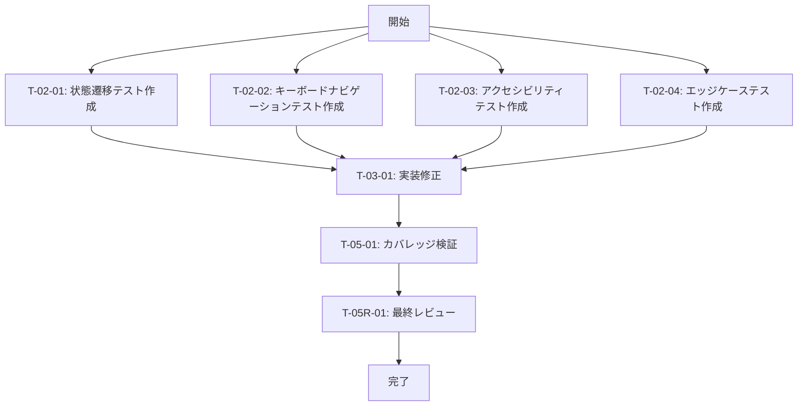

# login-only-auth テスト品質強化 - タスク実行仕様書

## ユーザーからの元の指示

```
Phase 5.5 Final Review Gate において、`@frontend-tester` エージェントによるテスト品質レビューで以下の改善点が指摘された：
1. 状態遷移テストの不足
2. キーボードナビゲーションテストの不足
3. ARIA live region テストの不足
4. エッジケーステストの不足

これらのテストを追加し、テストカバレッジと品質を向上させる。
```

## メタ情報

| 項目             | 内容                                                      |
| ---------------- | --------------------------------------------------------- |
| タスクID         | TEST-IMP-001                                              |
| タスク名         | login-only-auth テスト品質強化                            |
| 分類             | 改善                                                      |
| 対象機能         | 認証画面（AuthView/AuthGuard/AccountSection）のテスト拡充 |
| 優先度           | 中                                                        |
| 見積もり規模     | 小規模                                                    |
| ステータス       | 完了                                                      |
| 発見元           | Phase 5.5 最終レビューゲート                              |
| 発見日           | 2025-12-09                                                |
| 発見エージェント | @frontend-tester                                          |

---

## タスク概要

### 目的

認証関連コンポーネント（AuthGuard、AuthView、AccountSection）のテスト品質を向上させ、以下の観点でのテストカバレッジを強化する：

1. 状態遷移の正確な検証
2. キーボードによる操作の検証
3. アクセシビリティ（ARIA）の検証
4. エッジケース（境界値、異常系）の検証

### 背景

Phase 5.5 Final Review Gate において、`@frontend-tester` エージェントが既存テストを分析した結果、以下の改善点が指摘された：

- 状態遷移テストが rerender によるシミュレーションのみで、実際の状態変更フローを十分に検証していない
- キーボードナビゲーション（Tab, Enter, Space, Escape）のテストが存在しない
- ARIA live region による通知のテストが不十分
- 長いテキスト、画像エラー、ネットワークエラーなどのエッジケーステストが不足

### 最終ゴール

- 全対象コンポーネントで状態遷移テストが追加されている
- キーボードナビゲーションテストが追加されている
- ARIA/アクセシビリティテストが追加されている
- エッジケーステストが追加されている
- カバレッジ目標を達成している（AuthGuard: 90%+, AuthView: 90%+, AccountSection: 85%+）

### 成果物一覧

| 種別         | 成果物                         | 配置先                                                                                             |
| ------------ | ------------------------------ | -------------------------------------------------------------------------------------------------- |
| テストコード | 状態遷移テスト                 | `apps/desktop/src/renderer/components/AuthGuard/AuthGuard.state-transitions.test.tsx`              |
| テストコード | キーボードナビゲーションテスト | `apps/desktop/src/renderer/views/AuthView/AuthView.keyboard.test.tsx`                              |
| テストコード | アクセシビリティテスト         | `apps/desktop/src/renderer/components/organisms/AccountSection/AccountSection.a11y.test.tsx`       |
| テストコード | エッジケーステスト             | `apps/desktop/src/renderer/components/organisms/AccountSection/AccountSection.edge-cases.test.tsx` |
| 品質レポート | カバレッジレポート             | `coverage/lcov-report/index.html`                                                                  |

---

## 参照ファイル

本仕様書のコマンド・エージェント・スキル選定は以下を参照：

- `docs/00-requirements/master_system_design.md` - システム要件
- `.claude/commands/ai/command_list.md` - /ai:コマンド定義
- `.claude/agents/agent_list.md` - エージェント定義
- `.claude/skills/skill_list.md` - スキル定義

---

## タスク分解サマリー

| ID       | フェーズ          | サブタスク名                       | 責務                       | 依存    |
| -------- | ----------------- | ---------------------------------- | -------------------------- | ------- |
| T-02-01  | Phase 2 (TDD Red) | 状態遷移テスト作成                 | AuthGuard状態遷移検証      | -       |
| T-02-02  | Phase 2 (TDD Red) | キーボードナビゲーションテスト作成 | AuthViewキーボード操作検証 | -       |
| T-02-03  | Phase 2 (TDD Red) | アクセシビリティテスト作成         | ARIA属性・通知検証         | -       |
| T-02-04  | Phase 2 (TDD Red) | エッジケーステスト作成             | 境界値・異常系検証         | -       |
| T-03-01  | Phase 3 (Green)   | 必要に応じた実装修正               | テスト成功のための修正     | T-02-\* |
| T-05-01  | Phase 5           | カバレッジ検証                     | 目標カバレッジ達成確認     | T-03-\* |
| T-05R-01 | Phase 5.5         | 最終レビュー                       | 品質確認                   | T-05-\* |

**総サブタスク数**: 7個

---

## 実行フロー図



---

## Phase 2: テスト作成 (TDD: Red)

### T-02-01: 状態遷移テスト作成

#### 目的

AuthGuard コンポーネントの認証状態遷移を検証するテストを作成する。

#### 背景

既存テストでは `rerender` による単純な状態変更のみをテストしている。より詳細な状態遷移パターン（checking → authenticated、authenticated → unauthenticated など）と高速な状態変更時の挙動を検証する必要がある。

#### 責務（単一責務）

AuthGuard の状態遷移ロジックの検証テスト作成

#### Claude Code スラッシュコマンド

> ⚠️ 以下はターミナルコマンドではなく、Claude Code内で実行するスラッシュコマンドです

```
/ai:generate-unit-tests apps/desktop/src/renderer/components/AuthGuard/index.tsx
```

- **参照**: `.claude/commands/ai/command_list.md`

#### 使用エージェント

- **エージェント**: @frontend-tester
- **選定理由**: フロントエンドテスト戦略の統合管理と高品質なテスト自動化の専門家
- **参照**: `.claude/agents/agent_list.md`

#### 活用スキル

| スキル名                | 活用方法                          |
| ----------------------- | --------------------------------- |
| tdd-principles          | Red-Green-Refactor サイクルの実践 |
| vitest-advanced         | Vitest でのモック、非同期テスト   |
| boundary-value-analysis | 状態境界のテストケース設計        |
| test-doubles            | useAppStore のモック設計          |

- **参照**: `.claude/skills/skill_list.md`

#### 成果物

| 成果物         | パス                                                                                  | 内容                   |
| -------------- | ------------------------------------------------------------------------------------- | ---------------------- |
| テストファイル | `apps/desktop/src/renderer/components/AuthGuard/AuthGuard.state-transitions.test.tsx` | 状態遷移テストスイート |

#### テストケース一覧

| テストID   | シナリオ                        | 期待結果             |
| ---------- | ------------------------------- | -------------------- |
| TEST-ST-01 | checking → authenticated        | children 表示        |
| TEST-ST-02 | checking → unauthenticated      | AuthView 表示        |
| TEST-ST-03 | authenticated → unauthenticated | AuthView 表示        |
| TEST-ST-04 | unauthenticated → authenticated | children 表示        |
| TEST-ST-05 | 高速状態変更                    | 最終状態が正しく反映 |

#### TDD検証: Red状態確認

```bash
pnpm --filter @repo/desktop test:run -- AuthGuard.state-transitions
```

- [ ] テストが失敗することを確認（Red状態）

#### 完了条件

- [ ] 5つの状態遷移テストケースが実装されている
- [ ] テストファイルが正しいパスに配置されている
- [ ] テストが Red 状態であることを確認

#### 依存関係

- **前提**: なし
- **後続**: T-03-01

---

### T-02-02: キーボードナビゲーションテスト作成

#### 目的

AuthView コンポーネントのキーボード操作を検証するテストを作成する。

#### 背景

WCAG 2.1 準拠のために、マウスを使わないユーザーでも完全に操作できることを保証する必要がある。Tab キーによるフォーカス移動、Enter/Space キーによるボタン操作を検証する。

#### 責務（単一責務）

AuthView のキーボードナビゲーションテスト作成

#### Claude Code スラッシュコマンド

> ⚠️ 以下はターミナルコマンドではなく、Claude Code内で実行するスラッシュコマンドです

```
/ai:generate-unit-tests apps/desktop/src/renderer/views/AuthView/index.tsx
```

- **参照**: `.claude/commands/ai/command_list.md`

#### 使用エージェント

- **エージェント**: @frontend-tester
- **選定理由**: アクセシビリティテスト（axe-core + WCAG 2.1 AA）の専門知識
- **参照**: `.claude/agents/agent_list.md`

#### 活用スキル

| スキル名           | 活用方法                       |
| ------------------ | ------------------------------ |
| accessibility-wcag | WCAG キーボード操作要件の実装  |
| playwright-testing | userEvent によるキーボード操作 |
| tdd-principles     | テストファーストアプローチ     |

- **参照**: `.claude/skills/skill_list.md`

#### 成果物

| 成果物         | パス                                                                  | 内容                           |
| -------------- | --------------------------------------------------------------------- | ------------------------------ |
| テストファイル | `apps/desktop/src/renderer/views/AuthView/AuthView.keyboard.test.tsx` | キーボードナビゲーションテスト |

#### テストケース一覧

| テストID   | シナリオ               | 期待結果           |
| ---------- | ---------------------- | ------------------ |
| TEST-KB-01 | Tab でフォーカス移動   | 正しい順序で移動   |
| TEST-KB-02 | Shift+Tab で逆方向移動 | 正しい逆順で移動   |
| TEST-KB-03 | Enter でボタン操作     | ハンドラー呼び出し |
| TEST-KB-04 | Space でボタン操作     | ハンドラー呼び出し |

#### TDD検証: Red状態確認

```bash
pnpm --filter @repo/desktop test:run -- AuthView.keyboard
```

- [ ] テストが失敗することを確認（Red状態）

#### 完了条件

- [ ] 4つのキーボードナビゲーションテストケースが実装されている
- [ ] userEvent を使用したキーボード操作が正しく実装されている
- [ ] テストが Red 状態であることを確認

#### 依存関係

- **前提**: なし
- **後続**: T-03-01

---

### T-02-03: アクセシビリティテスト作成

#### 目的

AccountSection コンポーネントの ARIA 属性と live region 通知を検証するテストを作成する。

#### 背景

スクリーンリーダーユーザーに適切な情報を伝えるため、aria-live region による通知、role 属性の正確性、aria-label の適切性を検証する必要がある。

#### 責務（単一責務）

AccountSection の ARIA/アクセシビリティテスト作成

#### Claude Code スラッシュコマンド

> ⚠️ 以下はターミナルコマンドではなく、Claude Code内で実行するスラッシュコマンドです

```
/ai:run-accessibility-audit --scope component --wcag-level AA
```

- **参照**: `.claude/commands/ai/command_list.md`

#### 使用エージェント

- **エージェント**: @frontend-tester
- **選定理由**: アクセシビリティテスト（axe-core + WCAG 2.1 AA）の専門知識
- **参照**: `.claude/agents/agent_list.md`

#### 活用スキル

| スキル名           | 活用方法                   |
| ------------------ | -------------------------- |
| accessibility-wcag | ARIA 属性要件の検証        |
| tdd-principles     | テストファーストアプローチ |

- **参照**: `.claude/skills/skill_list.md`

#### 成果物

| 成果物         | パス                                                                                         | 内容                   |
| -------------- | -------------------------------------------------------------------------------------------- | ---------------------- |
| テストファイル | `apps/desktop/src/renderer/components/organisms/AccountSection/AccountSection.a11y.test.tsx` | アクセシビリティテスト |

#### テストケース一覧

| テストID     | シナリオ             | 期待結果                     |
| ------------ | -------------------- | ---------------------------- |
| TEST-A11Y-01 | 成功メッセージ通知   | aria-live で通知             |
| TEST-A11Y-02 | エラーメッセージ通知 | role="alert" で通知          |
| TEST-A11Y-03 | region ラベル        | 適切な aria-label            |
| TEST-A11Y-04 | sr-only テキスト     | 視覚的に非表示、読み上げ可能 |

#### TDD検証: Red状態確認

```bash
pnpm --filter @repo/desktop test:run -- AccountSection.a11y
```

- [ ] テストが失敗することを確認（Red状態）

#### 完了条件

- [ ] 4つのアクセシビリティテストケースが実装されている
- [ ] aria-live, role, aria-label の検証が含まれている
- [ ] テストが Red 状態であることを確認

#### 依存関係

- **前提**: なし
- **後続**: T-03-01

---

### T-02-04: エッジケーステスト作成

#### 目的

AccountSection コンポーネントのエッジケース（長いテキスト、画像エラー、ネットワークエラー、空データ）を検証するテストを作成する。

#### 背景

実運用環境では、想定外のデータや状態が発生する可能性がある。これらのエッジケースに対する堅牢性を検証する必要がある。

#### 責務（単一責務）

AccountSection のエッジケーステスト作成

#### Claude Code スラッシュコマンド

> ⚠️ 以下はターミナルコマンドではなく、Claude Code内で実行するスラッシュコマンドです

```
/ai:generate-unit-tests apps/desktop/src/renderer/components/organisms/AccountSection/index.tsx
```

- **参照**: `.claude/commands/ai/command_list.md`

#### 使用エージェント

- **エージェント**: @frontend-tester
- **選定理由**: テストカバレッジ80%+達成、境界値・異常系テストの専門知識
- **参照**: `.claude/agents/agent_list.md`

#### 活用スキル

| スキル名                | 活用方法                   |
| ----------------------- | -------------------------- |
| boundary-value-analysis | 境界値・エッジケース設計   |
| test-doubles            | エラー状態のモック         |
| tdd-principles          | テストファーストアプローチ |

- **参照**: `.claude/skills/skill_list.md`

#### 成果物

| 成果物         | パス                                                                                               | 内容               |
| -------------- | -------------------------------------------------------------------------------------------------- | ------------------ |
| テストファイル | `apps/desktop/src/renderer/components/organisms/AccountSection/AccountSection.edge-cases.test.tsx` | エッジケーステスト |

#### テストケース一覧

| テストID     | シナリオ               | 期待結果                     |
| ------------ | ---------------------- | ---------------------------- |
| TEST-EDGE-01 | 100文字の表示名        | truncate クラス適用          |
| TEST-EDGE-02 | 無効なアバターURL      | フォールバックアイコン表示   |
| TEST-EDGE-03 | オフライン状態         | オフラインインジケーター表示 |
| TEST-EDGE-04 | 空のプロバイダーリスト | 全て「連携する」表示         |

#### TDD検証: Red状態確認

```bash
pnpm --filter @repo/desktop test:run -- AccountSection.edge-cases
```

- [ ] テストが失敗することを確認（Red状態）

#### 完了条件

- [ ] 4つのエッジケーステストが実装されている
- [ ] 長いテキスト、画像エラー、オフライン、空データの検証が含まれている
- [ ] テストが Red 状態であることを確認

#### 依存関係

- **前提**: なし
- **後続**: T-03-01

---

## Phase 3: 実装 (TDD: Green)

### T-03-01: 必要に応じた実装修正

#### 目的

Phase 2 で作成したテストを通過させるために、必要に応じてコンポーネントを修正する。

#### 背景

TDD の Green フェーズとして、テストが失敗している原因を分析し、最小限の修正でテストを通過させる。

#### 責務（単一責務）

テスト成功のための実装修正

#### Claude Code スラッシュコマンド

> ⚠️ 以下はターミナルコマンドではなく、Claude Code内で実行するスラッシュコマンドです

```
/ai:tdd-cycle test-improvements
```

- **参照**: `.claude/commands/ai/command_list.md`

#### 使用エージェント

- **エージェント**: @ui-designer
- **選定理由**: UIコンポーネント設計、アクセシビリティ基準（WCAG）の専門家
- **参照**: `.claude/agents/agent_list.md`

#### 活用スキル

| スキル名              | 活用方法                  |
| --------------------- | ------------------------- |
| accessibility-wcag    | ARIA 属性の正しい実装     |
| tailwind-css-patterns | truncate クラスなどの適用 |
| error-boundary        | エラーハンドリングの実装  |

- **参照**: `.claude/skills/skill_list.md`

#### TDD検証: Green状態確認

```bash
pnpm --filter @repo/desktop test:run
```

- [ ] テストが成功することを確認（Green状態）

#### 完了条件

- [ ] 全ての新規テストが通過している
- [ ] 既存テストが破壊されていない
- [ ] コンポーネントの修正が最小限である

#### 依存関係

- **前提**: T-02-01, T-02-02, T-02-03, T-02-04
- **後続**: T-05-01

---

## Phase 5: 品質保証

### T-05-01: カバレッジ検証

#### 目的

テストカバレッジが目標値を達成していることを検証する。

#### 背景

テスト品質の定量的指標として、コードカバレッジを測定し、目標達成を確認する。

#### 責務（単一責務）

カバレッジ目標達成の検証

#### Claude Code スラッシュコマンド

> ⚠️ 以下はターミナルコマンドではなく、Claude Code内で実行するスラッシュコマンドです

```
/ai:run-all-tests --coverage
```

- **参照**: `.claude/commands/ai/command_list.md`

#### 使用エージェント

- **エージェント**: @frontend-tester
- **選定理由**: テストカバレッジ80%+達成の責務を持つ
- **参照**: `.claude/agents/agent_list.md`

#### カバレッジ目標

| コンポーネント | 目標カバレッジ | 検証コマンド                                |
| -------------- | -------------- | ------------------------------------------- |
| AuthGuard      | 90%+           | `pnpm --filter @repo/desktop test:coverage` |
| AuthView       | 90%+           | 同上                                        |
| AccountSection | 85%+           | 同上                                        |

#### 完了条件

- [ ] AuthGuard のカバレッジが 90% 以上
- [ ] AuthView のカバレッジが 90% 以上
- [ ] AccountSection のカバレッジが 85% 以上

#### 依存関係

- **前提**: T-03-01
- **後続**: T-05R-01

---

## Phase 5.5: 最終レビューゲート

### T-05R-01: 最終レビュー

#### 目的

実装完了後、テスト品質が十分であることを @frontend-tester エージェントがレビューする。

#### 背景

自動テストだけでは検出できない設計判断やベストプラクティス違反を確認する。

#### レビュー参加エージェント

| エージェント     | レビュー観点     | 選定理由                           |
| ---------------- | ---------------- | ---------------------------------- |
| @frontend-tester | テスト品質       | フロントエンドテスト戦略の統合管理 |
| @code-quality    | コード品質       | ESLint/Prettier 設定、静的解析     |
| @ui-designer     | アクセシビリティ | WCAG 準拠、アクセシビリティ基準    |

- **参照**: `.claude/agents/agent_list.md`

#### レビューチェックリスト

**テスト品質** (@frontend-tester)

- [ ] テストケースが適切に設計されているか
- [ ] 境界値・異常系のテストがあるか
- [ ] テストの可読性・保守性
- [ ] テストカバレッジが十分か

**コード品質** (@code-quality)

- [ ] コーディング規約への準拠
- [ ] 可読性・保守性の確保
- [ ] 過度な複雑性の有無

**アクセシビリティ** (@ui-designer)

- [ ] WCAG 2.1 AA への準拠
- [ ] キーボード操作の完全対応
- [ ] スクリーンリーダー対応

#### レビュー結果判定

- **PASS**: 全レビュー観点で問題なし → 完了
- **MINOR**: 軽微な指摘あり → 指摘対応後完了
- **MAJOR**: 重大な問題あり → Phase 2 へ戻る

#### 完了条件

- [ ] 全レビュー観点で PASS または MINOR 判定
- [ ] MINOR 指摘がある場合は対応完了

#### 依存関係

- **前提**: T-05-01
- **後続**: 完了

---

## 品質ゲートチェックリスト

### 機能検証

- [ ] 全状態遷移テスト成功
- [ ] 全キーボードナビゲーションテスト成功
- [ ] 全アクセシビリティテスト成功
- [ ] 全エッジケーステスト成功

### コード品質

- [ ] Lintエラーなし
- [ ] 型エラーなし
- [ ] コードフォーマット適用済み

### テスト網羅性

- [ ] AuthGuard カバレッジ 90%+ 達成
- [ ] AuthView カバレッジ 90%+ 達成
- [ ] AccountSection カバレッジ 85%+ 達成

---

## リスクと対策

| リスク              | 影響度 | 発生確率 | 対策                              | 対応サブタスク |
| ------------------- | ------ | -------- | --------------------------------- | -------------- |
| 既存テストとの競合  | 中     | 低       | 既存テストを先に実行して確認      | T-02-\*        |
| モック設計の複雑化  | 中     | 中       | 共通のテストユーティリティを作成  | T-02-\*        |
| ARIA 属性の実装漏れ | 高     | 中       | @ui-designer によるレビューを追加 | T-03-01        |

---

## 前提条件

- `@testing-library/react` がインストールされている
- `@testing-library/user-event` がインストールされている
- Vitest が正しく設定されている
- 既存のテストが全て通過している

---

## 備考

### 技術的制約

- Electron 環境での DOM 操作制約に注意
- Vitest の jsdom 環境の制限を考慮

### 参考資料

- `docs/30-workflows/login-only-auth/design-auth-guard.md`
- `docs/30-workflows/login-only-auth/design-auth-view.md`
- WCAG 2.1 ガイドライン
