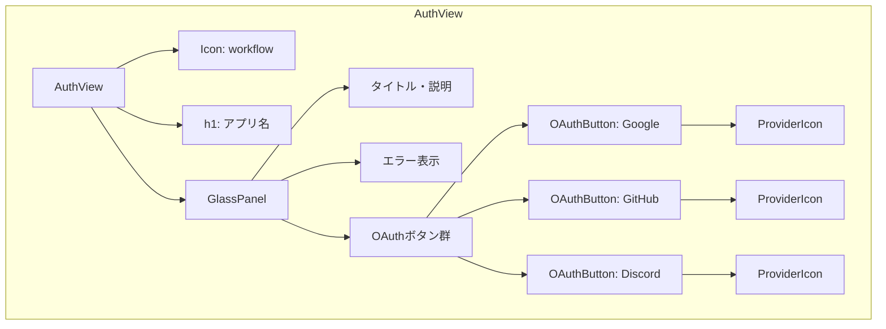
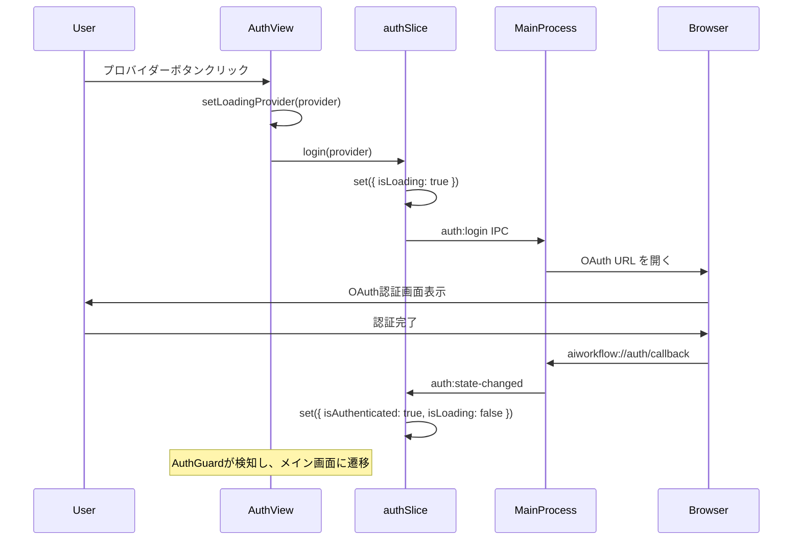

# AuthView 設計書

## コンポーネント概要

AuthViewは、未認証ユーザーに表示されるログイン画面コンポーネントである。OAuth認証（Google/GitHub/Discord）のUIを提供する。

## ファイル構成

```
apps/desktop/src/renderer/views/AuthView/
├── index.tsx           # メインコンポーネント
├── AuthView.test.tsx   # テストファイル
├── OAuthButton.tsx     # OAuthプロバイダーボタン
├── ProviderIcon.tsx    # プロバイダーアイコン
└── types.ts            # 型定義
```

## 型定義

```typescript
// types.ts
import type { OAuthProvider } from "../../../preload/types";

/**
 * AuthViewのProps
 */
export interface AuthViewProps {
  /** クラス名（スタイル拡張用） */
  className?: string;
}

/**
 * OAuthボタンのProps
 */
export interface OAuthButtonProps {
  /** OAuthプロバイダー */
  provider: OAuthProvider;

  /** クリックハンドラー */
  onClick: () => void;

  /** ローディング中か */
  isLoading?: boolean;

  /** 無効化するか */
  disabled?: boolean;
}

/**
 * プロバイダー設定
 */
export interface ProviderConfig {
  id: OAuthProvider;
  name: string;
  label: string;
}

/**
 * プロバイダー一覧
 */
export const PROVIDERS: ProviderConfig[] = [
  { id: "google", name: "Google", label: "Googleで続ける" },
  { id: "github", name: "GitHub", label: "GitHubで続ける" },
  { id: "discord", name: "Discord", label: "Discordで続ける" },
];
```

## コンポーネント実装設計

### index.tsx

```typescript
import React, { useState, useCallback } from "react";
import clsx from "clsx";
import { useAppStore } from "../../store";
import { GlassPanel } from "../../components/organisms/GlassPanel";
import { Icon } from "../../components/atoms/Icon";
import { Button } from "../../components/atoms/Button";
import { OAuthButton } from "./OAuthButton";
import { PROVIDERS } from "./types";
import type { AuthViewProps } from "./types";
import type { OAuthProvider } from "../../../preload/types";

/**
 * ログイン画面コンポーネント
 *
 * OAuth認証（Google/GitHub/Discord）のUIを提供
 */
export const AuthView: React.FC<AuthViewProps> = ({ className }) => {
  // 認証状態
  const isLoading = useAppStore((state) => state.isLoading);
  const authError = useAppStore((state) => state.authError);
  const login = useAppStore((state) => state.login);
  const setAuthError = useAppStore((state) => state.setAuthError);

  // クリック中のプロバイダー（スピナー表示用）
  const [loadingProvider, setLoadingProvider] = useState<OAuthProvider | null>(
    null
  );

  // ログインハンドラー
  const handleLogin = useCallback(
    async (provider: OAuthProvider) => {
      setLoadingProvider(provider);
      setAuthError(null);
      await login(provider);
      // 注: ログイン後の状態更新はauth:state-changedイベント経由
      // setLoadingProviderはauthSliceのisLoadingで制御
    },
    [login, setAuthError]
  );

  // エラークローズハンドラー
  const handleCloseError = useCallback(() => {
    setAuthError(null);
  }, [setAuthError]);

  return (
    <div
      className={clsx(
        "h-screen w-screen flex flex-col items-center justify-center bg-[#0a0a0a]",
        className
      )}
    >
      {/* ロゴ */}
      <div className="mb-6">
        <Icon name="workflow" size={64} className="text-blue-400" />
      </div>

      {/* アプリ名 */}
      <h1 className="text-2xl font-bold text-white mb-8">
        AIWorkflowOrchestrator
      </h1>

      {/* ログインカード */}
      <GlassPanel radius="lg" blur="md" className="p-8 w-full max-w-sm">
        {/* タイトル */}
        <div className="text-center mb-6">
          <Icon name="user" size={48} className="mx-auto text-white/40 mb-4" />
          <h2 className="text-lg font-semibold text-white">
            アカウント登録・ログイン
          </h2>
          <p className="text-white/60 text-sm mt-1">
            アカウントを連携してデータを同期しましょう
          </p>
        </div>

        {/* エラー表示 */}
        {authError && (
          <div className="mb-4 p-3 rounded-lg bg-red-500/20 border border-red-500/30">
            <div className="flex items-center justify-between">
              <span className="text-red-400 text-sm">{authError}</span>
              <Button
                variant="ghost"
                size="sm"
                onClick={handleCloseError}
                aria-label="閉じる"
              >
                <Icon name="x" size={16} />
              </Button>
            </div>
          </div>
        )}

        {/* OAuthボタン */}
        <div className="space-y-3">
          {PROVIDERS.map((provider) => (
            <OAuthButton
              key={provider.id}
              provider={provider.id}
              onClick={() => handleLogin(provider.id)}
              isLoading={isLoading && loadingProvider === provider.id}
              disabled={isLoading}
            />
          ))}
        </div>
      </GlassPanel>
    </div>
  );
};

AuthView.displayName = "AuthView";
```

### OAuthButton.tsx

```typescript
import React from "react";
import { Button } from "../../components/atoms/Button";
import { Spinner } from "../../components/atoms/Spinner";
import { ProviderIcon } from "./ProviderIcon";
import { PROVIDERS } from "./types";
import type { OAuthButtonProps } from "./types";

/**
 * OAuthプロバイダーボタン
 */
export const OAuthButton: React.FC<OAuthButtonProps> = ({
  provider,
  onClick,
  isLoading = false,
  disabled = false,
}) => {
  const config = PROVIDERS.find((p) => p.id === provider);
  const label = config?.label ?? `${provider}で続ける`;

  return (
    <Button
      variant="secondary"
      fullWidth
      onClick={onClick}
      disabled={disabled}
      aria-label={label}
    >
      <span className="flex items-center justify-center gap-3">
        {isLoading ? (
          <Spinner size="sm" />
        ) : (
          <ProviderIcon provider={provider} />
        )}
        <span className="text-sm font-medium">{label}</span>
      </span>
    </Button>
  );
};

OAuthButton.displayName = "OAuthButton";
```

### ProviderIcon.tsx

```typescript
import React from "react";
import type { OAuthProvider } from "../../../preload/types";

interface ProviderIconProps {
  provider: OAuthProvider;
  className?: string;
}

/**
 * OAuthプロバイダーアイコン
 *
 * AccountSectionから移植・共通化
 */
export const ProviderIcon: React.FC<ProviderIconProps> = ({
  provider,
  className = "w-5 h-5",
}) => {
  switch (provider) {
    case "google":
      return (
        <svg
          className={className}
          viewBox="0 0 24 24"
          fill="currentColor"
          aria-hidden="true"
        >
          <path d="M22.56 12.25c0-.78-.07-1.53-.2-2.25H12v4.26h5.92c-.26 1.37-1.04 2.53-2.21 3.31v2.77h3.57c2.08-1.92 3.28-4.74 3.28-8.09z" />
          <path d="M12 23c2.97 0 5.46-.98 7.28-2.66l-3.57-2.77c-.98.66-2.23 1.06-3.71 1.06-2.86 0-5.29-1.93-6.16-4.53H2.18v2.84C3.99 20.53 7.7 23 12 23z" />
          <path d="M5.84 14.09c-.22-.66-.35-1.36-.35-2.09s.13-1.43.35-2.09V7.07H2.18C1.43 8.55 1 10.22 1 12s.43 3.45 1.18 4.93l2.85-2.22.81-.62z" />
          <path d="M12 5.38c1.62 0 3.06.56 4.21 1.64l3.15-3.15C17.45 2.09 14.97 1 12 1 7.7 1 3.99 3.47 2.18 7.07l3.66 2.84c.87-2.6 3.3-4.53 6.16-4.53z" />
        </svg>
      );
    case "github":
      return (
        <svg
          className={className}
          viewBox="0 0 24 24"
          fill="currentColor"
          aria-hidden="true"
        >
          <path d="M12 0c-6.626 0-12 5.373-12 12 0 5.302 3.438 9.8 8.207 11.387.599.111.793-.261.793-.577v-2.234c-3.338.726-4.033-1.416-4.033-1.416-.546-1.387-1.333-1.756-1.333-1.756-1.089-.745.083-.729.083-.729 1.205.084 1.839 1.237 1.839 1.237 1.07 1.834 2.807 1.304 3.492.997.107-.775.418-1.305.762-1.604-2.665-.305-5.467-1.334-5.467-5.931 0-1.311.469-2.381 1.236-3.221-.124-.303-.535-1.524.117-3.176 0 0 1.008-.322 3.301 1.23.957-.266 1.983-.399 3.003-.404 1.02.005 2.047.138 3.006.404 2.291-1.552 3.297-1.23 3.297-1.23.653 1.653.242 2.874.118 3.176.77.84 1.235 1.911 1.235 3.221 0 4.609-2.807 5.624-5.479 5.921.43.372.823 1.102.823 2.222v3.293c0 .319.192.694.801.576 4.765-1.589 8.199-6.086 8.199-11.386 0-6.627-5.373-12-12-12z" />
        </svg>
      );
    case "discord":
      return (
        <svg
          className={className}
          viewBox="0 0 24 24"
          fill="currentColor"
          aria-hidden="true"
        >
          <path d="M20.317 4.3698a19.7913 19.7913 0 00-4.8851-1.5152.0741.0741 0 00-.0785.0371c-.211.3753-.4447.8648-.6083 1.2495-1.8447-.2762-3.68-.2762-5.4868 0-.1636-.3933-.4058-.8742-.6177-1.2495a.077.077 0 00-.0785-.037 19.7363 19.7363 0 00-4.8852 1.515.0699.0699 0 00-.0321.0277C.5334 9.0458-.319 13.5799.0992 18.0578a.0824.0824 0 00.0312.0561c2.0528 1.5076 4.0413 2.4228 5.9929 3.0294a.0777.0777 0 00.0842-.0276c.4616-.6304.8731-1.2952 1.226-1.9942a.076.076 0 00-.0416-.1057c-.6528-.2476-1.2743-.5495-1.8722-.8923a.077.077 0 01-.0076-.1277c.1258-.0943.2517-.1923.3718-.2914a.0743.0743 0 01.0776-.0105c3.9278 1.7933 8.18 1.7933 12.0614 0a.0739.0739 0 01.0785.0095c.1202.099.246.1981.3728.2924a.077.077 0 01-.0066.1276 12.2986 12.2986 0 01-1.873.8914.0766.0766 0 00-.0407.1067c.3604.698.7719 1.3628 1.225 1.9932a.076.076 0 00.0842.0286c1.961-.6067 3.9495-1.5219 6.0023-3.0294a.077.077 0 00.0313-.0552c.5004-5.177-.8382-9.6739-3.5485-13.6604a.061.061 0 00-.0312-.0286zM8.02 15.3312c-1.1825 0-2.1569-1.0857-2.1569-2.419 0-1.3332.9555-2.4189 2.157-2.4189 1.2108 0 2.1757 1.0952 2.1568 2.419 0 1.3332-.9555 2.4189-2.1569 2.4189zm7.9748 0c-1.1825 0-2.1569-1.0857-2.1569-2.419 0-1.3332.9554-2.4189 2.1569-2.4189 1.2108 0 2.1757 1.0952 2.1568 2.419 0 1.3332-.946 2.4189-2.1568 2.4189Z" />
        </svg>
      );
  }
};

ProviderIcon.displayName = "ProviderIcon";
```

## コンポーネント構成図



## 状態管理フロー



## 既存実装との関係

### AccountSectionからの移植

| 機能                 | AccountSection     | AuthView             |
| -------------------- | ------------------ | -------------------- |
| ProviderIcon         | 内部定義           | 独立コンポーネント化 |
| OAuthボタンUI        | 直接実装           | OAuthButton化        |
| エラー表示           | 実装あり           | 同様の実装           |
| プロバイダー連携表示 | あり（認証後のみ） | なし                 |
| プロフィール編集     | あり（認証後のみ） | なし                 |

### 共通化の検討

将来的にProviderIconをAccountSectionと共有する場合:

```
apps/desktop/src/renderer/components/atoms/ProviderIcon/
├── index.tsx
└── ProviderIcon.test.tsx
```

## テスト設計

### テストケース

| テストID | シナリオ                   | 期待結果                     |
| -------- | -------------------------- | ---------------------------- |
| AV-01    | 初期表示                   | 3つのOAuthボタン表示         |
| AV-02    | Googleボタンクリック       | login('google')呼び出し      |
| AV-03    | GitHubボタンクリック       | login('github')呼び出し      |
| AV-04    | Discordボタンクリック      | login('discord')呼び出し     |
| AV-05    | isLoading=true             | ボタンdisabled, スピナー表示 |
| AV-06    | authError存在              | エラーメッセージ表示         |
| AV-07    | エラー閉じるボタンクリック | setAuthError(null)呼び出し   |

### モック設計

```typescript
// テスト用モック
const mockLogin = vi.fn();
const mockSetAuthError = vi.fn();

vi.mock("../../store", () => ({
  useAppStore: (selector: (state: unknown) => unknown) =>
    selector({
      isLoading: false,
      authError: null,
      login: mockLogin,
      setAuthError: mockSetAuthError,
    }),
}));

describe("AuthView", () => {
  it("renders OAuth buttons", () => {
    render(<AuthView />);

    expect(screen.getByText("Googleで続ける")).toBeInTheDocument();
    expect(screen.getByText("GitHubで続ける")).toBeInTheDocument();
    expect(screen.getByText("Discordで続ける")).toBeInTheDocument();
  });

  it("calls login when OAuth button clicked", async () => {
    render(<AuthView />);

    await userEvent.click(screen.getByText("Googleで続ける"));
    expect(mockLogin).toHaveBeenCalledWith("google");
  });
});
```

## 完了条件チェックリスト

- [x] OAuthプロバイダーボタンのコンポーネント構成が設計されている
- [x] 既存authSlice（login）との連携が設計されている
- [x] エラー表示・ローディング表示が設計されている
- [x] 既存AtomicDesignコンポーネントの活用が設計されている

## 参照

- `docs/30-workflows/login-only-auth/requirements-auth-view.md` - 要件定義
- `apps/desktop/src/renderer/components/organisms/AccountSection/index.tsx` - 既存OAuth UI
- `apps/desktop/src/renderer/store/slices/authSlice.ts` - 認証状態管理
