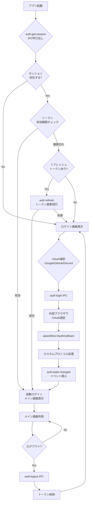
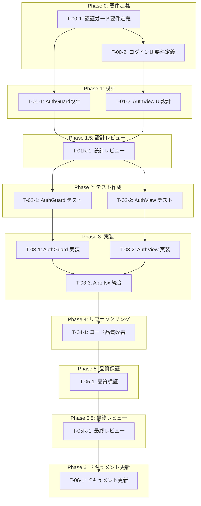

# ログイン画面のみ表示機能 - タスク実行仕様書

## ユーザーからの元の指示

```
ログイン画面のみ表示するようにしてほしいです。新規作成の場合は、ログイン画面のみアカウント登録やログイン画面。ログイン画面のみ表示するようにしてほしいです。新規作成の場合はログイン画面のみ登録できるようにしてほしいです。それ以外の画面に入れないようにしてほしいです。

【追加要件】
2回目以降に関しては一定期間ログインがない場合のみログイン画面に遷移する。
（セッション有効期限内であれば自動ログインする）
```

---

## 現状分析

### 既存実装状況

メインブランチには以下の認証機能が**既に実装済み**です：

| 機能                        | ファイル                                                 | 実装状況    |
| --------------------------- | -------------------------------------------------------- | ----------- |
| IPC認証ハンドラー           | `apps/desktop/src/main/ipc/authHandlers.ts`              | ✅ 完全実装 |
| 認証状態管理（authSlice）   | `apps/desktop/src/renderer/store/slices/authSlice.ts`    | ✅ 完全実装 |
| セキュアストレージ          | `apps/desktop/src/main/infrastructure/secureStorage.ts`  | ✅ 完全実装 |
| Supabaseクライアント        | `apps/desktop/src/main/infrastructure/supabaseClient.ts` | ✅ 基本実装 |
| カスタムプロトコル（OAuth） | `apps/desktop/src/main/protocol/customProtocol.ts`       | ✅ 完全実装 |
| IPCチャネル定義             | `apps/desktop/src/preload/channels.ts`                   | ✅ 完全実装 |
| 型定義                      | `packages/shared/types/auth.ts`                          | ✅ 完全実装 |
| E2Eテスト                   | `apps/desktop/e2e/auth.spec.ts`                          | ✅ 基本実装 |

### 未実装・改善が必要な機能

| 機能                                 | 状況        | 優先度 |
| ------------------------------------ | ----------- | ------ |
| **AuthGuard（認証ガード）**          | ❌ 未実装   | **高** |
| **AuthView（ログイン画面UI）**       | ❌ 未実装   | **高** |
| **App.tsx統合**                      | ❌ 未実装   | **高** |
| アイドルタイムアウト                 | ❌ 未実装   | 中     |
| トークン自動更新（インターセプター） | ⚠️ 部分実装 | 中     |
| プロバイダー連携（link-provider）    | ⚠️ TODO     | 低     |

---

## タスク概要

### 目的

既存の認証バックエンド実装を活用し、**フロントエンド側の認証ガード機能**を実装する：

1. **初回利用時**: ログイン画面のみ表示、認証後にメイン画面へ
2. **2回目以降**: セッションが有効であれば自動ログイン、期限切れ時のみログイン画面へ

### 背景

認証のバックエンド処理（IPC、Supabase連携、トークン管理）は実装済みだが、フロントエンドで認証状態に基づく画面制御（AuthGuard）とログインUI（AuthView）が未実装。

### 最終ゴール

1. **初回アクセス**: ログイン画面のみ表示される
2. **認証後**: すべての画面（ダッシュボード、エディタ、チャット、グラフ、設定）にアクセス可能
3. **2回目以降のアクセス**:
   - セッション有効期限内 → 自動ログイン（ログイン画面スキップ）
   - セッション有効期限切れ → ログイン画面表示
4. **ログアウト機能**: 手動でセッションを終了できる

### 成果物一覧

| 種別 | 成果物                          | 配置先                                                | 状況         |
| ---- | ------------------------------- | ----------------------------------------------------- | ------------ |
| 機能 | AuthGuard（認証ガード）         | `apps/desktop/src/renderer/components/AuthGuard/`     | **新規作成** |
| 機能 | AuthView（ログイン画面）        | `apps/desktop/src/renderer/views/AuthView/`           | **新規作成** |
| 機能 | App.tsx統合                     | `apps/desktop/src/renderer/App.tsx`                   | **修正**     |
| 機能 | authSlice（セッション確認強化） | `apps/desktop/src/renderer/store/slices/authSlice.ts` | **修正**     |

---

## 既存認証アーキテクチャ

### 認証フロー図（既存実装）



### 既存IPCチャネル一覧

| チャネル             | 用途                                       | 実装状況    |
| -------------------- | ------------------------------------------ | ----------- |
| `auth:login`         | OAuthログイン開始（Google/GitHub/Discord） | ✅ 実装済み |
| `auth:logout`        | ログアウト                                 | ✅ 実装済み |
| `auth:get-session`   | セッション取得（起動時）                   | ✅ 実装済み |
| `auth:refresh`       | トークン更新                               | ✅ 実装済み |
| `auth:check-online`  | オンライン確認                             | ✅ 実装済み |
| `auth:state-changed` | 認証状態変更通知（イベント）               | ✅ 実装済み |

### 既存型定義

```typescript
// packages/shared/types/auth.ts

interface AuthUser {
  id: string; // Supabase User ID
  email: string; // メールアドレス
  displayName: string | null; // 表示名
  avatarUrl: string | null; // アバターURL
  provider: OAuthProvider; // "google" | "github" | "discord"
  createdAt: string; // ISO 8601
  lastSignInAt: string; // ISO 8601
}

interface AuthSession {
  user: AuthUser; // ユーザー情報
  accessToken: string; // API認証用（1時間有効）
  refreshToken: string; // トークン更新用（30日有効）
  expiresAt: number; // Unix timestamp（秒）
  isOffline: boolean; // オフラインモード判定
}

interface AuthState {
  authenticated: boolean; // ログイン済みか
  user?: AuthUser; // ユーザー情報
  error?: string; // エラーメッセージ
  isOffline?: boolean; // オフラインモード
}
```

### セッション管理仕様（既存実装）

| 項目                         | 値    | 説明                                 |
| ---------------------------- | ----- | ------------------------------------ |
| アクセストークン有効期限     | 1時間 | Supabaseデフォルト                   |
| リフレッシュトークン有効期限 | 30日  | SafeStorageで暗号化保存              |
| オフライン対応               | あり  | リフレッシュトークンでセッション復元 |

---

## 参照ファイル

### 既存実装（参照用）

- `apps/desktop/src/main/ipc/authHandlers.ts` - 認証IPCハンドラー
- `apps/desktop/src/renderer/store/slices/authSlice.ts` - 認証状態管理
- `apps/desktop/src/preload/channels.ts` - IPCチャネル定義
- `packages/shared/types/auth.ts` - 認証型定義
- `docs/30-workflows/user-auth/` - 既存ドキュメント

### 本仕様書の参照

- `.claude/commands/ai/command_list.md` - /ai:コマンド定義
- `.claude/agents/agent_list.md` - エージェント定義
- `.claude/skills/skill_list.md` - スキル定義

---

## タスク分解サマリー

| ID      | フェーズ  | サブタスク名         | 責務                           | 依存           |
| ------- | --------- | -------------------- | ------------------------------ | -------------- |
| T-00-1  | Phase 0   | 認証ガード要件定義   | AuthGuardの動作要件明文化      | なし           |
| T-00-2  | Phase 0   | ログインUI要件定義   | AuthViewのUI/UX要件定義        | T-00-1         |
| T-01-1  | Phase 1   | AuthGuard設計        | 認証ガードコンポーネント設計   | T-00-1         |
| T-01-2  | Phase 1   | AuthView UI設計      | ログイン画面コンポーネント設計 | T-00-2         |
| T-01R-1 | Phase 1.5 | 設計レビュー         | 要件・設計の妥当性検証         | T-01-1, T-01-2 |
| T-02-1  | Phase 2   | AuthGuard テスト作成 | ガードロジックのテスト         | T-01R-1        |
| T-02-2  | Phase 2   | AuthView テスト作成  | UIコンポーネントのテスト       | T-01R-1        |
| T-03-1  | Phase 3   | AuthGuard 実装       | 認証ガードコンポーネント実装   | T-02-1         |
| T-03-2  | Phase 3   | AuthView 実装        | ログイン画面実装               | T-02-2         |
| T-03-3  | Phase 3   | App.tsx 統合         | 認証フローの統合               | T-03-1, T-03-2 |
| T-04-1  | Phase 4   | コード品質改善       | リファクタリング               | T-03-3         |
| T-05-1  | Phase 5   | 品質検証             | テスト実行・Lint・型チェック   | T-04-1         |
| T-05R-1 | Phase 5.5 | 最終レビュー         | 全体品質・整合性検証           | T-05-1         |
| T-06-1  | Phase 6   | ドキュメント更新     | システム要件ドキュメント更新   | T-05R-1        |

**総サブタスク数**: 14個（既存実装活用により大幅削減）

---

## 実行フロー図



---

## Phase 0: 要件定義

### T-00-1: 認証ガード要件定義

#### 目的

AuthGuardコンポーネントの動作要件を定義する。

#### 背景

既存のauthSliceには認証状態管理が実装済みだが、Reactコンポーネントレベルでのアクセス制御（AuthGuard）が未実装。

#### 責務（単一責務）

認証ガードの機能要件定義

#### 実行コマンド

```bash
/ai:gather-requirements auth-guard
```

#### 使用エージェント

- **エージェント**: `.claude/agents/req-analyst.md`
- **選定理由**: 要求工学の専門家として、既存実装を踏まえた要件整理ができる
- **参照**: `.claude/agents/agent_list.md`

#### 成果物

| 成果物           | パス                                                           | 内容              |
| ---------------- | -------------------------------------------------------------- | ----------------- |
| 認証ガード要件書 | `docs/30-workflows/login-only-auth/requirements-auth-guard.md` | AuthGuard動作要件 |

#### 完了条件

- [ ] 既存authSliceとの連携方法が定義されている
- [ ] 認証状態による画面遷移が明確に定義されている
- [ ] 自動ログイン判定ロジックが定義されている
- [ ] ローディング状態の扱いが定義されている

#### 依存関係

- **前提**: なし
- **後続**: T-00-2, T-01-1

---

### T-00-2: ログインUI要件定義

#### 目的

AuthView（ログイン画面）のUI/UX要件を定義する。

#### 背景

OAuth認証（Google/GitHub/Discord）のバックエンドは実装済み。フロントエンドのログインUIが必要。

#### 責務（単一責務）

ログイン画面のUI/UX要件定義

#### 実行コマンド

```bash
/ai:create-user-stories auth-view
```

#### 使用エージェント

- **エージェント**: `.claude/agents/ui-designer.md`
- **選定理由**: UI/UXデザインの専門家として、既存デザインシステムとの整合性を保てる
- **参照**: `.claude/agents/agent_list.md`

#### 成果物

| 成果物       | パス                                                          | 内容                   |
| ------------ | ------------------------------------------------------------- | ---------------------- |
| UI要件定義書 | `docs/30-workflows/login-only-auth/requirements-auth-view.md` | 画面構成・デザイン要件 |

#### 完了条件

- [ ] OAuthプロバイダー選択UIが定義されている
- [ ] ローディング状態のUI仕様が定義されている
- [ ] エラー表示のUI仕様が定義されている
- [ ] 既存デザインシステムとの整合性が確認されている

#### 依存関係

- **前提**: T-00-1
- **後続**: T-01-2

---

## Phase 1: 設計

### T-01-1: AuthGuard設計

#### 目的

認証ガードコンポーネントの設計を行う。

#### 背景

既存のauthSlice（`checkSession`, `isAuthenticated`, `isLoading`等）を活用して、認証状態に基づく画面制御を実装する。

#### 責務（単一責務）

AuthGuardコンポーネントの設計

#### 実行コマンド

```bash
/ai:create-component AuthGuard organism
```

#### 使用エージェント

- **エージェント**: `.claude/agents/router-dev.md`
- **選定理由**: 画面遷移・ガードパターンの設計専門家
- **参照**: `.claude/agents/agent_list.md`

#### 設計内容（概要）

```typescript
// AuthGuardの状態遷移
type AuthGuardState =
  | "checking" // セッション確認中（checkSession呼び出し中）
  | "authenticated" // 認証済み → 子コンポーネント表示
  | "unauthenticated"; // 未認証 → AuthView表示

interface AuthGuardProps {
  children: React.ReactNode;
  fallback?: React.ReactNode; // ローディング中の表示
}

// 既存authSliceとの連携
const useAuthGuard = () => {
  const { isAuthenticated, isLoading, checkSession } = useAppStore();

  useEffect(() => {
    // アプリ起動時にセッション確認
    checkSession();
  }, []);

  // auth:state-changed イベントのリスニング
  useEffect(() => {
    const unsubscribe = window.electronAPI.auth.onStateChanged((state) => {
      // 認証状態変更時の処理
    });
    return unsubscribe;
  }, []);

  return { isAuthenticated, isLoading };
};
```

#### 成果物

| 成果物          | パス                                                     | 内容               |
| --------------- | -------------------------------------------------------- | ------------------ |
| AuthGuard設計書 | `docs/30-workflows/login-only-auth/design-auth-guard.md` | ガードロジック設計 |

#### 完了条件

- [ ] AuthGuardのコンポーネントインターフェースが定義されている
- [ ] 既存authSliceとの連携方法が設計されている
- [ ] 認証状態によるレンダリング分岐が設計されている
- [ ] auth:state-changedイベントのハンドリングが設計されている

#### 依存関係

- **前提**: T-00-1
- **後続**: T-01R-1, T-02-1

---

### T-01-2: AuthView UI設計

#### 目的

ログイン画面のUIコンポーネント設計を行う。

#### 背景

既存のauthSlice（`loginWithOAuth`）とIPCハンドラー（`auth:login`）を活用して、OAuthログインUIを実装する。

#### 責務（単一責務）

ログイン画面のUI設計

#### 実行コマンド

```bash
/ai:create-component AuthView organism
```

#### 使用エージェント

- **エージェント**: `.claude/agents/ui-designer.md`
- **選定理由**: UIコンポーネント設計の専門家
- **参照**: `.claude/agents/agent_list.md`

#### 設計内容（概要）

```typescript
interface AuthViewProps {
  onLoginSuccess?: () => void;
  onLoginError?: (error: string) => void;
}

// 既存authSliceとの連携
const AuthView: React.FC<AuthViewProps> = ({ onLoginSuccess, onLoginError }) => {
  const { loginWithOAuth, isLoading, error } = useAppStore();

  const handleOAuthLogin = async (provider: 'google' | 'github' | 'discord') => {
    await loginWithOAuth(provider);
    // auth:state-changed イベントで認証状態が更新される
  };

  return (
    <div className="auth-view">
      <h1>ログイン</h1>
      <OAuthButton provider="google" onClick={() => handleOAuthLogin('google')} />
      <OAuthButton provider="github" onClick={() => handleOAuthLogin('github')} />
      <OAuthButton provider="discord" onClick={() => handleOAuthLogin('discord')} />
      {error && <ErrorDisplay message={error} />}
      {isLoading && <Spinner />}
    </div>
  );
};
```

#### 成果物

| 成果物   | パス                                                    | 内容                          |
| -------- | ------------------------------------------------------- | ----------------------------- |
| UI設計書 | `docs/30-workflows/login-only-auth/design-auth-view.md` | コンポーネント構成・props設計 |

#### 完了条件

- [ ] OAuthプロバイダーボタンのコンポーネント構成が設計されている
- [ ] 既存authSlice（loginWithOAuth）との連携が設計されている
- [ ] エラー表示・ローディング表示が設計されている
- [ ] 既存AtomicDesignコンポーネントの活用が設計されている

#### 依存関係

- **前提**: T-00-2
- **後続**: T-01R-1, T-02-2

---

## Phase 1.5: 設計レビューゲート

### T-01R-1: 設計レビュー

#### 目的

実装開始前に設計の妥当性を検証する。

#### 背景

既存実装との整合性を確認し、問題を早期検出する。

#### レビュー参加エージェント

| エージェント         | レビュー観点         | 選定理由               |
| -------------------- | -------------------- | ---------------------- |
| `.claude/agents/arch-police.md`       | アーキテクチャ整合性 | 既存設計との整合性確認 |
| `.claude/agents/frontend-tester.md`   | テスタビリティ       | テスト容易性の確認     |
| `.claude/agents/electron-security.md` | Electronセキュリティ | IPC連携の安全性確認    |

- **参照**: `.claude/agents/agent_list.md`

#### レビューチェックリスト

**アーキテクチャ整合性** (`.claude/agents/arch-police.md`)

- [ ] 既存authSliceとの連携が適切か
- [ ] AtomicDesignパターンに準拠しているか
- [ ] 状態管理の責務分離が適切か

**テスタビリティ** (`.claude/agents/frontend-tester.md`)

- [ ] コンポーネントがテスト可能な設計か
- [ ] モック可能なインターフェースか

**Electronセキュリティ** (`.claude/agents/electron-security.md`)

- [ ] IPC連携が安全か
- [ ] 認証状態の漏洩リスクがないか

#### 完了条件

- [ ] すべてのレビュー観点でチェック完了
- [ ] 重大な問題がない（PASSまたはMINOR）

#### 依存関係

- **前提**: T-01-1, T-01-2
- **後続**: T-02-1, T-02-2

---

## Phase 2: テスト作成 (TDD: Red)

### T-02-1: AuthGuard テスト作成

#### 目的

認証ガードコンポーネントのテストを作成する。

#### 責務（単一責務）

AuthGuardのテスト作成

#### 実行コマンド

```bash
/ai:generate-component-tests apps/desktop/src/renderer/components/AuthGuard/index.tsx
```

#### 使用エージェント

- **エージェント**: `.claude/agents/frontend-tester.md`
- **選定理由**: React Testing Libraryを活用したテスト設計の専門家
- **参照**: `.claude/agents/agent_list.md`

#### 成果物

| 成果物         | パス                                                                          | 内容                 |
| -------------- | ----------------------------------------------------------------------------- | -------------------- |
| テストファイル | `apps/desktop/src/renderer/components/AuthGuard/__tests__/AuthGuard.test.tsx` | コンポーネントテスト |

#### TDD検証: Red状態確認

```bash
pnpm --filter @repo/desktop test:run -- AuthGuard
```

- [ ] テストが失敗することを確認（Red状態）

#### 完了条件

- [ ] 認証済み状態で子コンポーネントが表示されるテストがある
- [ ] 未認証状態でAuthViewが表示されるテストがある
- [ ] ローディング中のSpinner表示テストがある
- [ ] auth:state-changedイベントハンドリングのテストがある

#### 依存関係

- **前提**: T-01R-1
- **後続**: T-03-1

---

### T-02-2: AuthView テスト作成

#### 目的

ログイン画面のUIコンポーネントテストを作成する。

#### 責務（単一責務）

AuthViewのテスト作成

#### 実行コマンド

```bash
/ai:generate-component-tests apps/desktop/src/renderer/views/AuthView/index.tsx
```

#### 使用エージェント

- **エージェント**: `.claude/agents/frontend-tester.md`
- **選定理由**: React Testing Libraryを活用したテスト設計の専門家
- **参照**: `.claude/agents/agent_list.md`

#### 成果物

| 成果物         | パス                                                                   | 内容                 |
| -------------- | ---------------------------------------------------------------------- | -------------------- |
| テストファイル | `apps/desktop/src/renderer/views/AuthView/__tests__/AuthView.test.tsx` | コンポーネントテスト |

#### TDD検証: Red状態確認

```bash
pnpm --filter @repo/desktop test:run -- AuthView
```

- [ ] テストが失敗することを確認（Red状態）

#### 完了条件

- [ ] OAuthプロバイダーボタンのクリックテストがある
- [ ] ローディング表示のテストがある
- [ ] エラー表示のテストがある
- [ ] loginWithOAuthとの連携テストがある

#### 依存関係

- **前提**: T-01R-1
- **後続**: T-03-2

---

## Phase 3: 実装 (TDD: Green)

### T-03-1: AuthGuard 実装

#### 目的

認証ガードコンポーネントを実装し、テストを通過させる。

#### 責務（単一責務）

AuthGuardコンポーネントの実装

#### 実行コマンド

```bash
/ai:create-component AuthGuard organism --implementation
```

#### 使用エージェント

- **エージェント**: `.claude/agents/router-dev.md`
- **選定理由**: 画面遷移・ガードパターンの実装専門家
- **参照**: `.claude/agents/agent_list.md`

#### 成果物

| 成果物         | パス                                                       | 内容          |
| -------------- | ---------------------------------------------------------- | ------------- |
| コンポーネント | `apps/desktop/src/renderer/components/AuthGuard/index.tsx` | AuthGuard実装 |

#### TDD検証: Green状態確認

```bash
pnpm --filter @repo/desktop test:run -- AuthGuard
```

- [ ] テストが成功することを確認（Green状態）

#### 完了条件

- [ ] 認証済み状態で子コンポーネントがレンダリングされる
- [ ] 未認証状態でAuthViewがレンダリングされる
- [ ] ローディング中にSpinnerが表示される
- [ ] auth:state-changedイベントが正しくハンドリングされる

#### 依存関係

- **前提**: T-02-1
- **後続**: T-03-3

---

### T-03-2: AuthView 実装

#### 目的

ログイン画面を実装し、テストを通過させる。

#### 責務（単一責務）

AuthViewコンポーネントの実装

#### 実行コマンド

```bash
/ai:create-component AuthView organism --implementation
```

#### 使用エージェント

- **エージェント**: `.claude/agents/ui-designer.md`
- **選定理由**: UIコンポーネント実装の専門家
- **参照**: `.claude/agents/agent_list.md`

#### 成果物

| 成果物         | パス                                                 | 内容         |
| -------------- | ---------------------------------------------------- | ------------ |
| コンポーネント | `apps/desktop/src/renderer/views/AuthView/index.tsx` | AuthView実装 |

#### TDD検証: Green状態確認

```bash
pnpm --filter @repo/desktop test:run -- AuthView
```

- [ ] テストが成功することを確認（Green状態）

#### 完了条件

- [ ] OAuthプロバイダーボタンが表示される
- [ ] ボタンクリックでloginWithOAuthが呼ばれる
- [ ] ローディング・エラー状態が正しく表示される
- [ ] 既存AtomicDesignコンポーネントが活用されている

#### 依存関係

- **前提**: T-02-2
- **後続**: T-03-3

---

### T-03-3: App.tsx 統合

#### 目的

AuthGuardをApp.tsxに統合し、認証フローを完成させる。

#### 責務（単一責務）

認証フローの統合

#### 実行コマンド

```bash
/ai:refactor apps/desktop/src/renderer/App.tsx
```

#### 使用エージェント

- **エージェント**: `.claude/agents/router-dev.md`
- **選定理由**: 画面遷移・アプリ構造の統合専門家
- **参照**: `.claude/agents/agent_list.md`

#### 成果物

| 成果物       | パス                                | 内容          |
| ------------ | ----------------------------------- | ------------- |
| 更新ファイル | `apps/desktop/src/renderer/App.tsx` | AuthGuard統合 |

#### TDD検証: Green状態確認

```bash
pnpm --filter @repo/desktop test:run
```

- [ ] すべてのテストが成功することを確認（Green状態）

#### 実装イメージ

```typescript
// App.tsx
import { AuthGuard } from './components/AuthGuard';
import { AuthView } from './views/AuthView';

const App: React.FC = () => {
  return (
    <AuthGuard fallback={<LoadingScreen />}>
      {/* 既存のビュー切り替えロジック */}
      <MainContent />
    </AuthGuard>
  );
};
```

#### 完了条件

- [ ] AuthGuardがApp.tsxに統合されている
- [ ] 初回アクセス時はログイン画面のみ表示される
- [ ] 2回目以降のアクセスでセッションが有効なら自動ログインする
- [ ] 認証後はすべてのビューにアクセスできる
- [ ] ログアウトで認証状態がリセットされる

#### 依存関係

- **前提**: T-03-1, T-03-2
- **後続**: T-04-1

---

## Phase 4: リファクタリング (TDD: Refactor)

### T-04-1: コード品質改善

#### 目的

動作を変えずにコード品質を改善する。

#### 責務（単一責務）

コード品質の改善

#### 実行コマンド

```bash
/ai:refactor apps/desktop/src/renderer
```

#### 使用エージェント

- **エージェント**: `.claude/agents/code-quality.md`
- **選定理由**: コード品質改善の専門家
- **参照**: `.claude/agents/agent_list.md`

#### 完了条件

- [ ] 重複コードが排除されている
- [ ] 命名が適切である
- [ ] すべてのテストがパスしている

#### 依存関係

- **前提**: T-03-3
- **後続**: T-05-1

---

## Phase 5: 品質保証

### T-05-1: 品質検証

#### 目的

定義された品質基準をすべて満たすことを検証する。

#### 実行コマンド

```bash
/ai:run-all-tests --coverage
```

#### 使用エージェント

- **エージェント**: `.claude/agents/unit-tester.md`
- **選定理由**: テスト実行・品質検証の専門家
- **参照**: `.claude/agents/agent_list.md`

#### 完了条件

- [ ] 全ユニットテスト成功
- [ ] Lintエラーなし
- [ ] 型エラーなし
- [ ] カバレッジ80%以上

#### 依存関係

- **前提**: T-04-1
- **後続**: T-05R-1

---

## Phase 5.5: 最終レビューゲート

### T-05R-1: 最終レビュー

#### 目的

実装完了後の全体的な品質・整合性を検証する。

#### レビュー参加エージェント

| エージェント         | レビュー観点         | 選定理由                     |
| -------------------- | -------------------- | ---------------------------- |
| `.claude/agents/code-quality.md`      | コード品質           | コーディング規約・可読性確認 |
| `.claude/agents/arch-police.md`       | アーキテクチャ遵守   | 既存設計との整合性確認       |
| `.claude/agents/frontend-tester.md`   | テスト品質           | テストカバレッジ・設計確認   |
| `.claude/agents/electron-security.md` | Electronセキュリティ | IPC連携の安全性確認          |

#### 完了条件

- [ ] すべてのレビュー観点でチェック完了
- [ ] 判定がPASSまたはMINOR
- [ ] 指摘事項への対応が完了

#### 依存関係

- **前提**: T-05-1
- **後続**: T-06-1

---

## Phase 6: ドキュメント更新

### T-06-1: ドキュメント更新

#### 目的

実装した内容をシステム要件ドキュメントに反映する。

#### 更新対象ドキュメント

| ドキュメント                              | 更新内容（概要のみ）                  |
| ----------------------------------------- | ------------------------------------- |
| `docs/00-requirements/05-architecture.md` | AuthGuard・AuthViewコンポーネント追加 |
| `docs/30-workflows/user-auth/`            | 既存ドキュメントとの統合・更新        |

#### 実行コマンド

```bash
/ai:update-all-docs
```

#### 完了条件

- [ ] 関連ドキュメントが更新されている
- [ ] 既存user-authドキュメントとの整合性が保たれている

---

## リスクと対策

| リスク                                       | 影響度 | 発生確率 | 対策                                 | 対応サブタスク |
| -------------------------------------------- | ------ | -------- | ------------------------------------ | -------------- |
| 既存authSliceとの連携不備                    | 高     | 中       | 既存実装の十分な調査・テスト         | T-01-1, T-03-1 |
| auth:state-changedイベントのハンドリング漏れ | 中     | 中       | イベントリスナーの適切な実装         | T-03-1         |
| 既存UIとの整合性不足                         | 中     | 低       | 既存AtomicDesignコンポーネントの活用 | T-01-2, T-03-2 |

---

## 前提条件

- 既存の認証バックエンド実装（authSlice, authHandlers, secureStorage等）が正常に動作すること
- Supabase環境が設定済みであること（`.env.example`参照）
- 既存のAtomicDesignコンポーネントを活用すること

---

## 備考

### 既存実装との関係

本タスクは**フロントエンド側のUI実装のみ**に集中します。以下は既存実装を活用します：

- 認証状態管理: `authSlice.ts`（既存）
- IPC通信: `authHandlers.ts`、`channels.ts`（既存）
- トークン保存: `secureStorage.ts`（既存）
- OAuth処理: `customProtocol.ts`（既存）

### 参考資料

- `apps/desktop/src/renderer/store/slices/authSlice.ts` - 既存の認証状態管理
- `apps/desktop/src/main/ipc/authHandlers.ts` - 既存のIPCハンドラー
- `docs/30-workflows/user-auth/` - 既存の認証ドキュメント
- `apps/desktop/src/renderer/components/organisms/AccountSection/index.tsx` - 既存の認証UI参考
