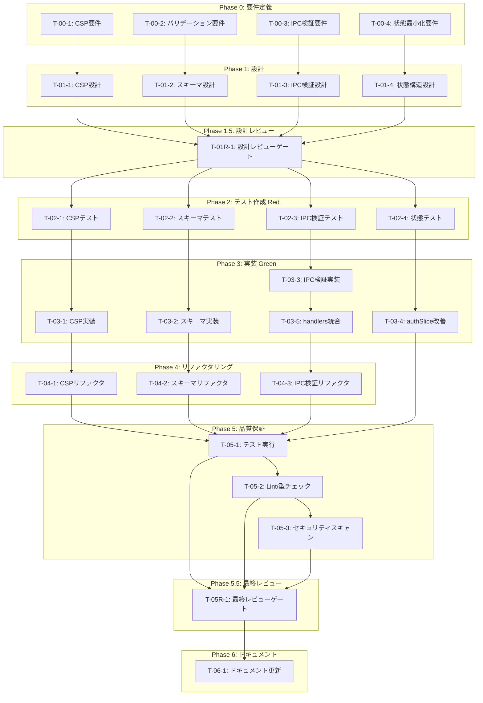

# login-only-auth セキュリティ強化 - タスク実行仕様書

## ユーザーからの元の指示

```
# セキュリティ改善タスク仕様書

## タスク概要

| 項目       | 内容                                             |
| ---------- | ------------------------------------------------ |
| タスク名   | login-only-auth セキュリティ強化                 |
| 対象機能   | 認証画面（AuthView/AuthGuard）のセキュリティ向上 |
| 優先度     | 高                                               |
| 見積もり   | 中規模                                           |
| ステータス | 未実施                                           |

## 背景と目的

Phase 5.5 Final Review Gate において、`@electron-security` エージェントによるセキュリティレビューで以下の改善点が指摘された：

1. **Content Security Policy (CSP) 未設定**
2. **入力値バリデーション不足**
3. **IPC sender検証未実装**
4. **Renderer側での機密情報保持リスク**

これらのセキュリティ強化を行い、Electronアプリケーションのセキュリティベストプラクティスに準拠する。
```

---

## タスク概要

### 目的

ElectronデスクトップアプリケーションのAuthView/AuthGuard機能に対して、セキュリティベストプラクティスに準拠したセキュリティ強化を実施する。具体的には、CSP設定の改善、入力値バリデーションのZodスキーマ化、IPC sender検証の実装、Renderer状態からの機密情報排除を行う。

### 背景

Phase 5.5 Final Review Gateにおいて、`@electron-security`エージェントによるセキュリティレビューで4項目の改善点が指摘された。現在のコードベースを確認した結果：

1. **CSP**: `main/index.ts`で基本実装済みだが、`connect-src`にSupabase URLの明示的な設定がなく、改善が必要
2. **入力バリデーション**: `isValidProvider`関数で部分的に実装だが、Zodスキーマ化による体系的なバリデーションが必要
3. **IPC sender検証**: 未実装。IpcMainInvokeEventのsender検証が行われていない
4. **Renderer状態最小化**: `authSlice.ts`の`session`プロパティにトークン情報（accessToken, refreshToken）が含まれており、セキュリティリスクが存在

### 最終ゴール

- CSPが本番環境で適切に設定され、XSSリスクが最小化されている
- すべての認証関連入力値がZodスキーマで検証されている
- IPC呼び出し元の検証が実装され、不正なウィンドウからのアクセスが拒否される
- Renderer側で機密トークンが保持されず、Main Processでのみ管理されている
- セキュリティテストがすべてパスし、`@electron-security`レビューでPASS評価を取得

### 成果物一覧

| 種別         | 成果物                   | 配置先                                                 |
| ------------ | ------------------------ | ------------------------------------------------------ |
| 機能（CSP）  | CSP設定モジュール        | `apps/desktop/src/main/security/csp.ts`                |
| 機能（検証） | Zod認証スキーマ          | `packages/shared/src/schemas/auth.ts`                  |
| 機能（IPC）  | IPC sender検証モジュール | `apps/desktop/src/main/security/ipc-validator.ts`      |
| 機能（状態） | 改善されたauthSlice      | `apps/desktop/src/renderer/store/slices/authSlice.ts`  |
| テスト       | CSPテスト                | `apps/desktop/src/main/security/csp.test.ts`           |
| テスト       | スキーマテスト           | `packages/shared/src/schemas/auth.test.ts`             |
| テスト       | IPC検証テスト            | `apps/desktop/src/main/security/ipc-validator.test.ts` |
| ドキュメント | セキュリティ改善完了報告 | `docs/30-workflows/login-only-auth/review-security.md` |

---

## 参照ファイル

本仕様書のコマンド・エージェント・スキル選定は以下を参照：

- `docs/00-requirements/master_system_design.md` - システム要件
- `.claude/commands/ai/command_list.md` - /ai:コマンド定義
- `.claude/agents/agent_list.md` - エージェント定義
- `.claude/skills/skill_list.md` - スキル定義

---

## タスク分解サマリー

| ID      | フェーズ  | サブタスク名                   | 責務                                  | 依存      |
| ------- | --------- | ------------------------------ | ------------------------------------- | --------- |
| T-00-1  | Phase 0   | CSP設定要件定義                | CSPディレクティブの要件を明文化       | -         |
| T-00-2  | Phase 0   | 入力バリデーション要件定義     | Zodスキーマ要件を明文化               | -         |
| T-00-3  | Phase 0   | IPC sender検証要件定義         | IPC検証要件を明文化                   | -         |
| T-00-4  | Phase 0   | Renderer状態最小化要件定義     | 状態最小化要件を明文化                | -         |
| T-01-1  | Phase 1   | CSP設計                        | CSPモジュールのインターフェース設計   | T-00-1    |
| T-01-2  | Phase 1   | Zodスキーマ設計                | 認証スキーマの型定義設計              | T-00-2    |
| T-01-3  | Phase 1   | IPC検証設計                    | IPC validator関数の設計               | T-00-3    |
| T-01-4  | Phase 1   | 状態構造設計                   | authSliceの状態構造再設計             | T-00-4    |
| T-01R-1 | Phase 1.5 | 設計レビューゲート             | 4設計の妥当性検証                     | T-01-1〜4 |
| T-02-1  | Phase 2   | CSPテスト作成                  | CSP生成関数のテスト作成（Red）        | T-01R-1   |
| T-02-2  | Phase 2   | Zodスキーマテスト作成          | 認証スキーマのテスト作成（Red）       | T-01R-1   |
| T-02-3  | Phase 2   | IPC検証テスト作成              | IPC validator関数のテスト作成（Red）  | T-01R-1   |
| T-02-4  | Phase 2   | 状態最小化テスト作成           | トークン非保持の確認テスト作成（Red） | T-01R-1   |
| T-03-1  | Phase 3   | CSP実装                        | CSP生成モジュール実装（Green）        | T-02-1    |
| T-03-2  | Phase 3   | Zodスキーマ実装                | 認証スキーマ実装（Green）             | T-02-2    |
| T-03-3  | Phase 3   | IPC検証実装                    | IPC validator実装（Green）            | T-02-3    |
| T-03-4  | Phase 3   | authSlice改善                  | Renderer状態からトークン除去（Green） | T-02-4    |
| T-03-5  | Phase 3   | IPC handlers統合               | 既存IPC handlersに検証追加            | T-03-3    |
| T-04-1  | Phase 4   | CSPリファクタリング            | CSPコードの品質改善                   | T-03-1    |
| T-04-2  | Phase 4   | スキーマリファクタリング       | スキーマコードの品質改善              | T-03-2    |
| T-04-3  | Phase 4   | IPC検証リファクタリング        | IPC検証コードの品質改善               | T-03-5    |
| T-05-1  | Phase 5   | 品質保証：テスト実行           | 全テスト実行・カバレッジ確認          | T-04-1〜3 |
| T-05-2  | Phase 5   | 品質保証：Lint/型チェック      | 静的解析実行                          | T-04-1〜3 |
| T-05-3  | Phase 5   | 品質保証：セキュリティスキャン | 脆弱性スキャン実行                    | T-04-1〜3 |
| T-05R-1 | Phase 5.5 | 最終レビューゲート             | セキュリティ専門レビュー              | T-05-1〜3 |
| T-06-1  | Phase 6   | ドキュメント更新               | セキュリティガイドライン更新          | T-05R-1   |

**総サブタスク数**: 24個

---

## 実行フロー図



---

## Phase 0: 要件定義

### T-00-1: CSP設定要件定義

#### 目的

Content Security Policyの設定要件を明文化し、XSS攻撃リスクを最小化するためのディレクティブ構成を定義する。

#### 背景

現在のCSP設定（`main/index.ts`）は基本的な構成だが、connect-srcにSupabase URLの明示的な設定がなく、また本番環境用のより厳格な設定が必要。

#### 責務（単一責務）

CSPディレクティブの要件を仕様として定義する。

#### 実行コマンド

```bash
/ai:write-spec csp-security-requirements
```

#### 使用エージェント

- **エージェント**: `@electron-security`
- **選定理由**: Electronアプリケーションのセキュリティ強化と脆弱性対策の専門エージェント
- **参照**: `.claude/agents/agent_list.md`

#### 活用スキル

| スキル名                        | 活用方法                             |
| ------------------------------- | ------------------------------------ |
| **electron-security-hardening** | CSP設定のベストプラクティス参照      |
| **security-headers**            | セキュリティヘッダー設定パターン参照 |

- **参照**: `.claude/skills/skill_list.md`

#### 成果物

| 成果物              | パス                                                         | 内容                            |
| ------------------- | ------------------------------------------------------------ | ------------------------------- |
| CSP要件ドキュメント | `docs/30-workflows/login-only-auth/spec-csp-requirements.md` | CSPディレクティブ要件と設定方針 |

#### 完了条件

- [ ] CSPディレクティブ一覧が定義されている
- [ ] 開発環境と本番環境の差分が明記されている
- [ ] Supabase接続に必要なconnect-src設定が定義されている
- [ ] frame-ancestors 'none' が要件に含まれている

#### 依存関係

- **前提**: なし
- **後続**: T-01-1

---

### T-00-2: 入力バリデーション要件定義

#### 目的

認証関連の入力値バリデーション要件を明文化し、Zodスキーマで検証すべき項目を特定する。

#### 背景

現在は`isValidProvider`関数で部分的な検証のみ。displayNameや他の入力値にZodスキーマによる体系的なバリデーションが必要。

#### 責務（単一責務）

認証関連入力値のバリデーション要件を仕様として定義する。

#### 実行コマンド

```bash
/ai:write-spec auth-validation-requirements
```

#### 使用エージェント

- **エージェント**: `@schema-def`
- **選定理由**: Zodによる入出力スキーマ定義と型ガード実装の専門エージェント
- **参照**: `.claude/agents/agent_list.md`

#### 活用スキル

| スキル名                 | 活用方法                       |
| ------------------------ | ------------------------------ |
| **zod-validation**       | Zodスキーマ設計パターン参照    |
| **type-safety-patterns** | TypeScript型安全性パターン参照 |
| **input-sanitization**   | 入力サニタイズパターン参照     |

- **参照**: `.claude/skills/skill_list.md`

#### 成果物

| 成果物             | パス                                                                | 内容                     |
| ------------------ | ------------------------------------------------------------------- | ------------------------ |
| バリデーション要件 | `docs/30-workflows/login-only-auth/spec-validation-requirements.md` | 入力値バリデーション要件 |

#### 完了条件

- [ ] OAuthプロバイダーのバリデーション要件が定義されている
- [ ] displayNameのバリデーション要件（文字数、許可文字）が定義されている
- [ ] IPC引数のバリデーション要件が定義されている
- [ ] エラーメッセージ形式が定義されている

#### 依存関係

- **前提**: なし
- **後続**: T-01-2

---

### T-00-3: IPC sender検証要件定義

#### 目的

IPC通信の呼び出し元検証要件を明文化し、不正なウィンドウからのアクセスを防止するための仕様を定義する。

#### 背景

現在のIPC handlersでは`event.sender`の検証が行われていない。不正なwebContentsからのIPC呼び出しを検出・拒否する仕組みが必要。

#### 責務（単一責務）

IPC sender検証の要件を仕様として定義する。

#### 実行コマンド

```bash
/ai:write-spec ipc-sender-validation-requirements
```

#### 使用エージェント

- **エージェント**: `@electron-security`
- **選定理由**: ElectronのIPC安全性に関する専門知識を持つエージェント
- **参照**: `.claude/agents/agent_list.md`

#### 活用スキル

| スキル名                        | 活用方法                       |
| ------------------------------- | ------------------------------ |
| **electron-security-hardening** | IPC安全性パターン参照          |
| **electron-architecture**       | Main/Renderer分離とIPC設計参照 |

- **参照**: `.claude/skills/skill_list.md`

#### 成果物

| 成果物      | パス                                                                    | 内容               |
| ----------- | ----------------------------------------------------------------------- | ------------------ |
| IPC検証要件 | `docs/30-workflows/login-only-auth/spec-ipc-validation-requirements.md` | IPC sender検証要件 |

#### 完了条件

- [ ] 検証すべきIPC channelsが特定されている
- [ ] 許可するwebContentsの条件が定義されている
- [ ] 不正アクセス時のエラーハンドリングが定義されている
- [ ] セキュリティログの出力仕様が定義されている

#### 依存関係

- **前提**: なし
- **後続**: T-01-3

---

### T-00-4: Renderer状態最小化要件定義

#### 目的

Renderer Process側で保持すべき認証状態の最小構成を定義し、機密情報（トークン）をMain Processでのみ管理する方針を明文化する。

#### 背景

現在の`authSlice.ts`では`session`プロパティに`accessToken`と`refreshToken`が含まれており、Renderer Process側での機密情報露出リスクがある。

#### 責務（単一責務）

Renderer状態の最小化要件を仕様として定義する。

#### 実行コマンド

```bash
/ai:write-spec renderer-state-minimization-requirements
```

#### 使用エージェント

- **エージェント**: `@electron-security`
- **選定理由**: Electron Main/Renderer間のセキュリティ分離の専門知識を持つエージェント
- **参照**: `.claude/agents/agent_list.md`

#### 活用スキル

| スキル名                        | 活用方法                       |
| ------------------------------- | ------------------------------ |
| **electron-security-hardening** | 状態分離パターン参照           |
| **electron-architecture**       | プロセス間データフロー設計参照 |

- **参照**: `.claude/skills/skill_list.md`

#### 成果物

| 成果物         | パス                                                           | 内容                   |
| -------------- | -------------------------------------------------------------- | ---------------------- |
| 状態最小化要件 | `docs/30-workflows/login-only-auth/spec-state-minimization.md` | Renderer状態最小化要件 |

#### 完了条件

- [ ] Rendererで保持すべき状態項目が明示されている
- [ ] 保持してはならない機密情報が明示されている
- [ ] Main Processでのトークン管理方針が定義されている
- [ ] 状態変更時のデータフローが定義されている

#### 依存関係

- **前提**: なし
- **後続**: T-01-4

---

## Phase 1: 設計

### T-01-1: CSP設計

#### 目的

CSP生成モジュールの詳細設計を行い、実装可能なインターフェースと構造を定義する。

#### 背景

要件定義（T-00-1）で定義されたCSP要件を基に、具体的なモジュール構造と関数シグネチャを設計する。

#### 責務（単一責務）

CSPモジュールの技術設計を行う。

#### 実行コマンド

```bash
/ai:design-architecture csp-module
```

#### 使用エージェント

- **エージェント**: `@electron-architect`
- **選定理由**: Electronアプリケーションのセキュアなアーキテクチャ設計の専門エージェント
- **参照**: `.claude/agents/agent_list.md`

#### 活用スキル

| スキル名                          | 活用方法                       |
| --------------------------------- | ------------------------------ |
| **electron-architecture**         | モジュール構造設計パターン参照 |
| **clean-architecture-principles** | 依存関係設計参照               |

- **参照**: `.claude/skills/skill_list.md`

#### 成果物

| 成果物    | パス                                                     | 内容                  |
| --------- | -------------------------------------------------------- | --------------------- |
| CSP設計書 | `docs/30-workflows/login-only-auth/design-csp-module.md` | CSPモジュール詳細設計 |

#### 完了条件

- [ ] モジュールのファイル構成が定義されている
- [ ] 関数シグネチャが定義されている
- [ ] 環境変数の取り扱いが設計されている
- [ ] エクスポート構造が設計されている

#### 依存関係

- **前提**: T-00-1
- **後続**: T-01R-1

---

### T-01-2: Zodスキーマ設計

#### 目的

認証関連のZodスキーマの詳細設計を行い、スキーマ構造と型エクスポートを定義する。

#### 背景

要件定義（T-00-2）で定義されたバリデーション要件を基に、具体的なZodスキーマ設計を行う。

#### 責務（単一責務）

認証Zodスキーマの技術設計を行う。

#### 実行コマンド

```bash
/ai:create-schema auth-validation
```

#### 使用エージェント

- **エージェント**: `@schema-def`
- **選定理由**: Zodスキーマ定義の専門エージェント
- **参照**: `.claude/agents/agent_list.md`

#### 活用スキル

| スキル名                 | 活用方法                 |
| ------------------------ | ------------------------ |
| **zod-validation**       | スキーマ設計パターン参照 |
| **type-safety-patterns** | 型推論設計参照           |

- **参照**: `.claude/skills/skill_list.md`

#### 成果物

| 成果物         | パス                                                      | 内容                |
| -------------- | --------------------------------------------------------- | ------------------- |
| スキーマ設計書 | `docs/30-workflows/login-only-auth/design-auth-schema.md` | Zodスキーマ詳細設計 |

#### 完了条件

- [ ] スキーマファイル構成が定義されている
- [ ] 各スキーマの定義が記述されている
- [ ] 型エクスポートが設計されている
- [ ] エラーメッセージのカスタマイズが設計されている

#### 依存関係

- **前提**: T-00-2
- **後続**: T-01R-1

---

### T-01-3: IPC検証設計

#### 目的

IPC sender検証モジュールの詳細設計を行い、検証ロジックとエラーハンドリングを定義する。

#### 背景

要件定義（T-00-3）で定義されたIPC検証要件を基に、具体的な検証関数と統合方法を設計する。

#### 責務（単一責務）

IPC検証モジュールの技術設計を行う。

#### 実行コマンド

```bash
/ai:design-architecture ipc-validator-module
```

#### 使用エージェント

- **エージェント**: `@electron-architect`
- **選定理由**: ElectronのMain Process設計の専門エージェント
- **参照**: `.claude/agents/agent_list.md`

#### 活用スキル

| スキル名                  | 活用方法                 |
| ------------------------- | ------------------------ |
| **electron-architecture** | IPC設計パターン参照      |
| **interface-segregation** | インターフェース設計参照 |

- **参照**: `.claude/skills/skill_list.md`

#### 成果物

| 成果物        | パス                                                        | 内容                      |
| ------------- | ----------------------------------------------------------- | ------------------------- |
| IPC検証設計書 | `docs/30-workflows/login-only-auth/design-ipc-validator.md` | IPC検証モジュール詳細設計 |

#### 完了条件

- [ ] 検証関数のシグネチャが定義されている
- [ ] 既存handlersへの統合方法が設計されている
- [ ] エラー時のレスポンス形式が設計されている
- [ ] ログ出力の形式が設計されている

#### 依存関係

- **前提**: T-00-3
- **後続**: T-01R-1

---

### T-01-4: 状態構造設計

#### 目的

authSliceの状態構造を再設計し、トークン情報を排除した最小構成を定義する。

#### 背景

要件定義（T-00-4）で定義された状態最小化要件を基に、具体的な状態構造とデータフローを設計する。

#### 責務（単一責務）

authSliceの状態構造再設計を行う。

#### 実行コマンド

```bash
/ai:setup-state-management auth-state-redesign
```

#### 使用エージェント

- **エージェント**: `@state-manager`
- **選定理由**: クライアント状態管理の専門エージェント
- **参照**: `.claude/agents/agent_list.md`

#### 活用スキル

| スキル名                  | 活用方法                 |
| ------------------------- | ------------------------ |
| **state-lifting**         | 状態設計パターン参照     |
| **custom-hooks-patterns** | ロジック分離パターン参照 |

- **参照**: `.claude/skills/skill_list.md`

#### 成果物

| 成果物     | パス                                                     | 内容                  |
| ---------- | -------------------------------------------------------- | --------------------- |
| 状態設計書 | `docs/30-workflows/login-only-auth/design-auth-state.md` | authSlice状態構造設計 |

#### 完了条件

- [ ] 新しいAuthState型が定義されている
- [ ] sessionプロパティからのトークン除去方法が設計されている
- [ ] Main Processとの連携フローが設計されている
- [ ] 後方互換性の考慮が記述されている

#### 依存関係

- **前提**: T-00-4
- **後続**: T-01R-1

---

## Phase 1.5: 設計レビューゲート

### T-01R-1: 設計レビューゲート

#### 目的

実装開始前に4つの設計（CSP、スキーマ、IPC検証、状態構造）の妥当性を検証し、問題を早期発見する。

#### 背景

設計ミスが実装後に発見されると修正コストが大幅に増加する。「Shift Left」原則に基づき、問題を可能な限り早期に検出する。

#### レビュー参加エージェント

| エージェント         | レビュー観点         | 選定理由                                       |
| -------------------- | -------------------- | ---------------------------------------------- |
| `@arch-police`       | アーキテクチャ整合性 | Clean Architecture原則違反の検出               |
| `@electron-security` | セキュリティ設計     | Electronセキュリティベストプラクティス準拠確認 |
| `@sec-auditor`       | 脆弱性リスク         | セキュリティ上の考慮漏れ検出                   |
| `@schema-def`        | スキーマ設計         | Zodスキーマ設計の妥当性確認                    |

- **参照**: `.claude/agents/agent_list.md`

#### レビューチェックリスト

**アーキテクチャ整合性** (`@arch-police`)

- [ ] CSPモジュールがMain Processの責務に適切に配置されている
- [ ] 状態設計がMain/Renderer分離原則に準拠している
- [ ] 依存関係が逆転していない

**セキュリティ設計** (`@electron-security`)

- [ ] CSPディレクティブが十分に厳格である
- [ ] IPC検証がすべての認証関連channelをカバーしている
- [ ] トークンがRenderer Processに露出しない設計である

**脆弱性リスク** (`@sec-auditor`)

- [ ] XSS攻撃ベクトルが適切に防御されている
- [ ] 入力バリデーションがすべてのユーザー入力をカバーしている
- [ ] エラーメッセージが機密情報を漏洩しない

**スキーマ設計** (`@schema-def`)

- [ ] Zodスキーマが型安全である
- [ ] エラーメッセージがユーザーフレンドリーである
- [ ] スキーマの再利用性が確保されている

#### レビュー結果

- **判定**: PASS / MINOR / MAJOR
- **指摘事項**: （レビュー時に記載）
- **対応方針**: （レビュー時に記載）

#### 戻り先決定（MAJORの場合）

| 問題の種類 | 戻り先              |
| ---------- | ------------------- |
| 要件の問題 | Phase 0（要件定義） |
| 設計の問題 | Phase 1（設計）     |
| 両方の問題 | Phase 0（要件定義） |

#### 完了条件

- [ ] 4つの設計すべてがレビューされている
- [ ] PASS または MINOR 判定を取得している
- [ ] MINOR指摘は対応完了している

#### 依存関係

- **前提**: T-01-1, T-01-2, T-01-3, T-01-4
- **後続**: T-02-1, T-02-2, T-02-3, T-02-4

---

## Phase 2: テスト作成 (TDD: Red)

### T-02-1: CSPテスト作成

#### 目的

CSP生成関数のテストを作成し、期待される動作を検証可能にする。

#### 背景

TDD原則に従い、実装前にテストを作成してRed状態を確認する。

#### 責務（単一責務）

CSPモジュールのユニットテストを作成する。

#### 実行コマンド

```bash
/ai:generate-unit-tests apps/desktop/src/main/security/csp.ts
```

#### 使用エージェント

- **エージェント**: `@unit-tester`
- **選定理由**: TDD原則に基づくユニットテスト作成の専門エージェント
- **参照**: `.claude/agents/agent_list.md`

#### 活用スキル

| スキル名                    | 活用方法                       |
| --------------------------- | ------------------------------ |
| **tdd-principles**          | Red-Green-Refactorサイクル適用 |
| **vitest-advanced**         | Vitestテスト構造参照           |
| **boundary-value-analysis** | 境界値テスト設計参照           |

- **参照**: `.claude/skills/skill_list.md`

#### 成果物

| 成果物    | パス                                         | 内容                |
| --------- | -------------------------------------------- | ------------------- |
| CSPテスト | `apps/desktop/src/main/security/csp.test.ts` | CSP生成関数のテスト |

#### TDD検証: Red状態確認

```bash
pnpm --filter @repo/desktop test:run -- csp.test.ts
```

- [ ] テストが失敗することを確認（Red状態）

#### 完了条件

- [ ] 本番環境CSP生成テストが作成されている
- [ ] 開発環境CSP生成テストが作成されている
- [ ] Supabase URL含有テストが作成されている
- [ ] frame-ancestors設定テストが作成されている
- [ ] テスト実行時にRed状態であることを確認

#### 依存関係

- **前提**: T-01R-1
- **後続**: T-03-1

---

### T-02-2: Zodスキーマテスト作成

#### 目的

認証関連Zodスキーマのテストを作成し、バリデーション動作を検証可能にする。

#### 背景

TDD原則に従い、実装前にテストを作成してRed状態を確認する。

#### 責務（単一責務）

認証スキーマのユニットテストを作成する。

#### 実行コマンド

```bash
/ai:generate-unit-tests packages/shared/src/schemas/auth.ts
```

#### 使用エージェント

- **エージェント**: `@unit-tester`
- **選定理由**: TDD原則に基づくユニットテスト作成の専門エージェント
- **参照**: `.claude/agents/agent_list.md`

#### 活用スキル

| スキル名                    | 活用方法                         |
| --------------------------- | -------------------------------- |
| **tdd-principles**          | Red-Green-Refactorサイクル適用   |
| **boundary-value-analysis** | 文字数境界テスト設計参照         |
| **test-doubles**            | バリデーションテストパターン参照 |

- **参照**: `.claude/skills/skill_list.md`

#### 成果物

| 成果物         | パス                                       | 内容                 |
| -------------- | ------------------------------------------ | -------------------- |
| スキーマテスト | `packages/shared/src/schemas/auth.test.ts` | 認証スキーマのテスト |

#### TDD検証: Red状態確認

```bash
pnpm --filter @repo/shared test:run -- auth.test.ts
```

- [ ] テストが失敗することを確認（Red状態）

#### 完了条件

- [ ] OAuthプロバイダーバリデーションテストが作成されている
- [ ] displayName有効値テストが作成されている
- [ ] displayName無効値（空、長すぎ、不正文字）テストが作成されている
- [ ] テスト実行時にRed状態であることを確認

#### 依存関係

- **前提**: T-01R-1
- **後続**: T-03-2

---

### T-02-3: IPC検証テスト作成

#### 目的

IPC sender検証関数のテストを作成し、検証動作を確認可能にする。

#### 背景

TDD原則に従い、実装前にテストを作成してRed状態を確認する。

#### 責務（単一責務）

IPC検証関数のユニットテストを作成する。

#### 実行コマンド

```bash
/ai:generate-unit-tests apps/desktop/src/main/security/ipc-validator.ts
```

#### 使用エージェント

- **エージェント**: `@unit-tester`
- **選定理由**: TDD原則に基づくユニットテスト作成の専門エージェント
- **参照**: `.claude/agents/agent_list.md`

#### 活用スキル

| スキル名            | 活用方法                       |
| ------------------- | ------------------------------ |
| **tdd-principles**  | Red-Green-Refactorサイクル適用 |
| **test-doubles**    | ElectronモックパターンJN参照   |
| **vitest-advanced** | モッキングパターン参照         |

- **参照**: `.claude/skills/skill_list.md`

#### 成果物

| 成果物        | パス                                                   | 内容                |
| ------------- | ------------------------------------------------------ | ------------------- |
| IPC検証テスト | `apps/desktop/src/main/security/ipc-validator.test.ts` | IPC検証関数のテスト |

#### TDD検証: Red状態確認

```bash
pnpm --filter @repo/desktop test:run -- ipc-validator.test.ts
```

- [ ] テストが失敗することを確認（Red状態）

#### 完了条件

- [ ] 有効なwebContentsからの呼び出し許可テストが作成されている
- [ ] 不明なwebContentsからの呼び出し拒否テストが作成されている
- [ ] ログ出力テストが作成されている
- [ ] テスト実行時にRed状態であることを確認

#### 依存関係

- **前提**: T-01R-1
- **後続**: T-03-3

---

### T-02-4: 状態最小化テスト作成

#### 目的

authSliceにトークン情報が含まれないことを確認するテストを作成する。

#### 背景

TDD原則に従い、実装前にテストを作成してRed状態を確認する。

#### 責務（単一責務）

状態最小化の検証テストを作成する。

#### 実行コマンド

```bash
/ai:generate-unit-tests apps/desktop/src/renderer/store/slices/authSlice.ts
```

#### 使用エージェント

- **エージェント**: `@unit-tester`
- **選定理由**: TDD原則に基づくユニットテスト作成の専門エージェント
- **参照**: `.claude/agents/agent_list.md`

#### 活用スキル

| スキル名           | 活用方法                       |
| ------------------ | ------------------------------ |
| **tdd-principles** | Red-Green-Refactorサイクル適用 |
| **test-doubles**   | ストアモックパターン参照       |

- **参照**: `.claude/skills/skill_list.md`

#### 成果物

| 成果物     | パス                                                       | 内容                 |
| ---------- | ---------------------------------------------------------- | -------------------- |
| 状態テスト | `apps/desktop/src/renderer/store/slices/authSlice.test.ts` | 状態最小化検証テスト |

#### TDD検証: Red状態確認

```bash
pnpm --filter @repo/desktop test:run -- authSlice.test.ts
```

- [ ] テストが失敗することを確認（Red状態）

#### 完了条件

- [ ] session状態にaccessTokenが含まれないテストが作成されている
- [ ] session状態にrefreshTokenが含まれないテストが作成されている
- [ ] テスト実行時にRed状態であることを確認

#### 依存関係

- **前提**: T-01R-1
- **後続**: T-03-4

---

## Phase 3: 実装 (TDD: Green)

### T-03-1: CSP実装

#### 目的

CSP生成モジュールを実装し、テストをGreen状態にする。

#### 背景

T-02-1で作成したテストを通過させるための最小限の実装を行う。

#### 責務（単一責務）

CSP生成関数を実装する。

#### 実行コマンド

```bash
/ai:secure-electron-app scope:csp
```

#### 使用エージェント

- **エージェント**: `@electron-security`
- **選定理由**: Electronアプリケーションのセキュリティ強化実装の専門エージェント
- **参照**: `.claude/agents/agent_list.md`

#### 活用スキル

| スキル名                        | 活用方法             |
| ------------------------------- | -------------------- |
| **electron-security-hardening** | CSP実装パターン参照  |
| **security-headers**            | ヘッダー設定実装参照 |

- **参照**: `.claude/skills/skill_list.md`

#### 成果物

| 成果物        | パス                                      | 内容            |
| ------------- | ----------------------------------------- | --------------- |
| CSPモジュール | `apps/desktop/src/main/security/csp.ts`   | CSP生成関数実装 |
| インデックス  | `apps/desktop/src/main/security/index.ts` | エクスポート    |

#### TDD検証: Green状態確認

```bash
pnpm --filter @repo/desktop test:run -- csp.test.ts
```

- [ ] テストが成功することを確認（Green状態）

#### 完了条件

- [ ] getContentSecurityPolicy関数が実装されている
- [ ] 開発/本番環境の分岐が実装されている
- [ ] Supabase URLがconnect-srcに含まれている
- [ ] テスト実行時にGreen状態であることを確認

#### 依存関係

- **前提**: T-02-1
- **後続**: T-04-1

---

### T-03-2: Zodスキーマ実装

#### 目的

認証関連Zodスキーマを実装し、テストをGreen状態にする。

#### 背景

T-02-2で作成したテストを通過させるための最小限の実装を行う。

#### 責務（単一責務）

認証Zodスキーマを実装する。

#### 実行コマンド

```bash
/ai:create-schema auth
```

#### 使用エージェント

- **エージェント**: `@schema-def`
- **選定理由**: Zodスキーマ定義実装の専門エージェント
- **参照**: `.claude/agents/agent_list.md`

#### 活用スキル

| スキル名                 | 活用方法                 |
| ------------------------ | ------------------------ |
| **zod-validation**       | スキーマ実装パターン参照 |
| **type-safety-patterns** | 型エクスポート実装参照   |

- **参照**: `.claude/skills/skill_list.md`

#### 成果物

| 成果物       | パス                                   | 内容            |
| ------------ | -------------------------------------- | --------------- |
| 認証スキーマ | `packages/shared/src/schemas/auth.ts`  | Zodスキーマ実装 |
| インデックス | `packages/shared/src/schemas/index.ts` | エクスポート    |

#### TDD検証: Green状態確認

```bash
pnpm --filter @repo/shared test:run -- auth.test.ts
```

- [ ] テストが成功することを確認（Green状態）

#### 完了条件

- [ ] oauthProviderSchemaが実装されている
- [ ] displayNameSchemaが実装されている
- [ ] updateProfileSchemaが実装されている
- [ ] 型がエクスポートされている
- [ ] テスト実行時にGreen状態であることを確認

#### 依存関係

- **前提**: T-02-2
- **後続**: T-04-2

---

### T-03-3: IPC検証実装

#### 目的

IPC sender検証関数を実装し、テストをGreen状態にする。

#### 背景

T-02-3で作成したテストを通過させるための最小限の実装を行う。

#### 責務（単一責務）

IPC sender検証関数を実装する。

#### 実行コマンド

```bash
/ai:secure-electron-app scope:ipc
```

#### 使用エージェント

- **エージェント**: `@electron-security`
- **選定理由**: ElectronのIPC安全性実装の専門エージェント
- **参照**: `.claude/agents/agent_list.md`

#### 活用スキル

| スキル名                        | 活用方法                     |
| ------------------------------- | ---------------------------- |
| **electron-security-hardening** | IPC検証実装パターン参照      |
| **electron-architecture**       | Main Process実装パターン参照 |

- **参照**: `.claude/skills/skill_list.md`

#### 成果物

| 成果物            | パス                                              | 内容            |
| ----------------- | ------------------------------------------------- | --------------- |
| IPC検証モジュール | `apps/desktop/src/main/security/ipc-validator.ts` | IPC検証関数実装 |

#### TDD検証: Green状態確認

```bash
pnpm --filter @repo/desktop test:run -- ipc-validator.test.ts
```

- [ ] テストが成功することを確認（Green状態）

#### 完了条件

- [ ] validateIpcSender関数が実装されている
- [ ] BrowserWindow検証ロジックが実装されている
- [ ] セキュリティログ出力が実装されている
- [ ] テスト実行時にGreen状態であることを確認

#### 依存関係

- **前提**: T-02-3
- **後続**: T-03-5

---

### T-03-4: authSlice改善

#### 目的

authSliceの状態からトークン情報を除去し、テストをGreen状態にする。

#### 背景

T-02-4で作成したテストを通過させるための最小限の実装を行う。

#### 責務（単一責務）

authSliceの状態構造を改善する。

#### 実行コマンド

```bash
/ai:refactor apps/desktop/src/renderer/store/slices/authSlice.ts
```

#### 使用エージェント

- **エージェント**: `@state-manager`
- **選定理由**: クライアント状態管理の専門エージェント
- **参照**: `.claude/agents/agent_list.md`

#### 活用スキル

| スキル名                   | 活用方法                   |
| -------------------------- | -------------------------- |
| **state-lifting**          | 状態構造改善パターン参照   |
| **refactoring-techniques** | 安全なリファクタリング参照 |

- **参照**: `.claude/skills/skill_list.md`

#### 成果物

| 成果物        | パス                                                  | 内容                     |
| ------------- | ----------------------------------------------------- | ------------------------ |
| 改善authSlice | `apps/desktop/src/renderer/store/slices/authSlice.ts` | トークン除去後の状態管理 |

#### TDD検証: Green状態確認

```bash
pnpm --filter @repo/desktop test:run -- authSlice.test.ts
```

- [ ] テストが成功することを確認（Green状態）

#### 完了条件

- [ ] sessionプロパティからaccessToken/refreshTokenが除去されている
- [ ] 必要なユーザー情報のみが保持されている
- [ ] 既存機能が壊れていない
- [ ] テスト実行時にGreen状態であることを確認

#### 依存関係

- **前提**: T-02-4
- **後続**: T-05-1

---

### T-03-5: IPC handlers統合

#### 目的

既存のIPC handlersにIPC sender検証を統合する。

#### 背景

T-03-3で実装したvalidateIpcSender関数を既存のauthHandlers等に適用する。

#### 責務（単一責務）

IPC handlersへの検証統合を行う。

#### 実行コマンド

```bash
/ai:refactor apps/desktop/src/main/ipc/authHandlers.ts
```

#### 使用エージェント

- **エージェント**: `@electron-security`
- **選定理由**: ElectronのIPC安全性実装の専門エージェント
- **参照**: `.claude/agents/agent_list.md`

#### 活用スキル

| スキル名                        | 活用方法                |
| ------------------------------- | ----------------------- |
| **electron-security-hardening** | IPC検証統合パターン参照 |
| **refactoring-techniques**      | 安全なコード修正参照    |

- **参照**: `.claude/skills/skill_list.md`

#### 成果物

| 成果物              | パス                                           | 内容                      |
| ------------------- | ---------------------------------------------- | ------------------------- |
| 更新authHandlers    | `apps/desktop/src/main/ipc/authHandlers.ts`    | IPC検証統合後のハンドラー |
| 更新profileHandlers | `apps/desktop/src/main/ipc/profileHandlers.ts` | IPC検証統合後のハンドラー |

#### 完了条件

- [ ] authHandlersにvalidateIpcSenderが統合されている
- [ ] profileHandlersにvalidateIpcSenderが統合されている
- [ ] 不正アクセス時に適切なエラーが返却される
- [ ] 既存テストが通過する

#### 依存関係

- **前提**: T-03-3
- **後続**: T-04-3

---

## Phase 4: リファクタリング (TDD: Refactor)

### T-04-1: CSPリファクタリング

#### 目的

CSPモジュールのコード品質を改善する。

#### 背景

Green状態を維持しながら、コードの可読性・保守性を向上させる。

#### 責務（単一責務）

CSPコードのリファクタリングを行う。

#### 実行コマンド

```bash
/ai:refactor apps/desktop/src/main/security/csp.ts
```

#### 使用エージェント

- **エージェント**: `@code-quality`
- **選定理由**: コードベースの統一性とバグ予防の専門エージェント
- **参照**: `.claude/agents/agent_list.md`

#### 活用スキル

| スキル名                   | 活用方法                   |
| -------------------------- | -------------------------- |
| **clean-code-practices**   | 可読性向上パターン参照     |
| **refactoring-techniques** | Extract Method等の技法参照 |

- **参照**: `.claude/skills/skill_list.md`

#### 成果物

| 成果物        | パス                                    | 内容                      |
| ------------- | --------------------------------------- | ------------------------- |
| リファクタCSP | `apps/desktop/src/main/security/csp.ts` | 品質改善後のCSPモジュール |

#### TDD検証: 継続Green確認

```bash
pnpm --filter @repo/desktop test:run -- csp.test.ts
```

- [ ] リファクタリング後もテストが成功することを確認

#### 完了条件

- [ ] 定数が適切に抽出されている
- [ ] 関数が適切な粒度に分割されている
- [ ] コメントが適切に付与されている
- [ ] テストが継続して成功する

#### 依存関係

- **前提**: T-03-1
- **後続**: T-05-1

---

### T-04-2: スキーマリファクタリング

#### 目的

認証スキーマのコード品質を改善する。

#### 背景

Green状態を維持しながら、コードの可読性・保守性を向上させる。

#### 責務（単一責務）

認証スキーマコードのリファクタリングを行う。

#### 実行コマンド

```bash
/ai:refactor packages/shared/src/schemas/auth.ts
```

#### 使用エージェント

- **エージェント**: `@code-quality`
- **選定理由**: コードベースの統一性とバグ予防の専門エージェント
- **参照**: `.claude/agents/agent_list.md`

#### 活用スキル

| スキル名                 | 活用方法               |
| ------------------------ | ---------------------- |
| **clean-code-practices** | 可読性向上パターン参照 |
| **type-safety-patterns** | 型定義最適化参照       |

- **参照**: `.claude/skills/skill_list.md`

#### 成果物

| 成果物             | パス                                  | 内容                 |
| ------------------ | ------------------------------------- | -------------------- |
| リファクタスキーマ | `packages/shared/src/schemas/auth.ts` | 品質改善後のスキーマ |

#### TDD検証: 継続Green確認

```bash
pnpm --filter @repo/shared test:run -- auth.test.ts
```

- [ ] リファクタリング後もテストが成功することを確認

#### 完了条件

- [ ] 共通パターンが適切に抽出されている
- [ ] エラーメッセージが一貫している
- [ ] 型定義が最適化されている
- [ ] テストが継続して成功する

#### 依存関係

- **前提**: T-03-2
- **後続**: T-05-1

---

### T-04-3: IPC検証リファクタリング

#### 目的

IPC検証モジュールと統合コードの品質を改善する。

#### 背景

Green状態を維持しながら、コードの可読性・保守性を向上させる。

#### 責務（単一責務）

IPC検証コードのリファクタリングを行う。

#### 実行コマンド

```bash
/ai:refactor apps/desktop/src/main/security/ipc-validator.ts
```

#### 使用エージェント

- **エージェント**: `@code-quality`
- **選定理由**: コードベースの統一性とバグ予防の専門エージェント
- **参照**: `.claude/agents/agent_list.md`

#### 活用スキル

| スキル名                   | 活用方法                     |
| -------------------------- | ---------------------------- |
| **clean-code-practices**   | 可読性向上パターン参照       |
| **refactoring-techniques** | Extract Function等の技法参照 |

- **参照**: `.claude/skills/skill_list.md`

#### 成果物

| 成果物            | パス                                              | 内容                |
| ----------------- | ------------------------------------------------- | ------------------- |
| リファクタIPC検証 | `apps/desktop/src/main/security/ipc-validator.ts` | 品質改善後のIPC検証 |

#### TDD検証: 継続Green確認

```bash
pnpm --filter @repo/desktop test:run -- ipc-validator.test.ts
```

- [ ] リファクタリング後もテストが成功することを確認

#### 完了条件

- [ ] 検証ロジックが明確に分離されている
- [ ] ログ出力が一貫している
- [ ] エラーハンドリングが適切である
- [ ] テストが継続して成功する

#### 依存関係

- **前提**: T-03-5
- **後続**: T-05-1

---

## Phase 5: 品質保証

### T-05-1: 品質保証：テスト実行

#### 目的

全テストを実行し、機能検証とカバレッジを確認する。

#### 背景

リファクタリング完了後、全体的な品質を確認する。

#### 責務（単一責務）

テスト実行と結果確認を行う。

#### 実行コマンド

```bash
/ai:run-all-tests --coverage
```

#### 使用エージェント

- **エージェント**: `@unit-tester`
- **選定理由**: テスト実行とカバレッジ分析の専門エージェント
- **参照**: `.claude/agents/agent_list.md`

#### 活用スキル

| スキル名            | 活用方法           |
| ------------------- | ------------------ |
| **vitest-advanced** | カバレッジ分析参照 |
| **tdd-principles**  | 品質基準参照       |

- **参照**: `.claude/skills/skill_list.md`

#### 成果物

| 成果物         | パス        | 内容               |
| -------------- | ----------- | ------------------ |
| テストレポート | `coverage/` | カバレッジレポート |

#### 完了条件

- [ ] 全ユニットテストが成功している
- [ ] セキュリティ関連コードのカバレッジが80%以上
- [ ] テスト実行結果が記録されている

#### 依存関係

- **前提**: T-04-1, T-04-2, T-04-3, T-03-4
- **後続**: T-05R-1

---

### T-05-2: 品質保証：Lint/型チェック

#### 目的

静的解析を実行し、コード品質を確認する。

#### 背景

Lint/型チェックにより潜在的な問題を検出する。

#### 責務（単一責務）

静的解析の実行と問題修正を行う。

#### 実行コマンド

```bash
/ai:lint --fix
```

#### 使用エージェント

- **エージェント**: `@code-quality`
- **選定理由**: コード品質管理の専門エージェント
- **参照**: `.claude/agents/agent_list.md`

#### 活用スキル

| スキル名                 | 活用方法             |
| ------------------------ | -------------------- |
| **eslint-configuration** | Lintルール確認参照   |
| **static-analysis**      | 静的解析パターン参照 |

- **参照**: `.claude/skills/skill_list.md`

#### 成果物

| 成果物   | パス           | 内容           |
| -------- | -------------- | -------------- |
| Lint修正 | 対象ファイル群 | Lint問題の修正 |

#### 完了条件

- [ ] Lintエラーがゼロである
- [ ] 型エラーがゼロである
- [ ] Prettierフォーマットが適用されている

#### 依存関係

- **前提**: T-04-1, T-04-2, T-04-3
- **後続**: T-05R-1

---

### T-05-3: 品質保証：セキュリティスキャン

#### 目的

脆弱性スキャンを実行し、セキュリティ問題がないことを確認する。

#### 背景

セキュリティ改善タスクの一環として、実装した変更に脆弱性がないことを検証する。

#### 責務（単一責務）

セキュリティスキャンの実行と結果確認を行う。

#### 実行コマンド

```bash
/ai:scan-vulnerabilities
```

#### 使用エージェント

- **エージェント**: `@sec-auditor`
- **選定理由**: セキュリティ監査の専門エージェント
- **参照**: `.claude/agents/agent_list.md`

#### 活用スキル

| スキル名                          | 活用方法                   |
| --------------------------------- | -------------------------- |
| **dependency-security-scanning**  | 依存関係脆弱性スキャン参照 |
| **code-static-analysis-security** | コード脆弱性検出参照       |

- **参照**: `.claude/skills/skill_list.md`

#### 成果物

| 成果物           | パス                                                 | 内容                     |
| ---------------- | ---------------------------------------------------- | ------------------------ |
| スキャンレポート | `docs/30-workflows/login-only-auth/security-scan.md` | セキュリティスキャン結果 |

#### 完了条件

- [ ] 高・致命的な脆弱性がゼロである
- [ ] 中程度の脆弱性に対応計画がある
- [ ] スキャン結果が記録されている

#### 依存関係

- **前提**: T-04-1, T-04-2, T-04-3
- **後続**: T-05R-1

---

## 品質ゲートチェックリスト

### 機能検証

- [ ] 全ユニットテスト成功
- [ ] CSPテスト成功
- [ ] スキーマテスト成功
- [ ] IPC検証テスト成功
- [ ] 状態最小化テスト成功

### コード品質

- [ ] Lintエラーなし
- [ ] 型エラーなし
- [ ] コードフォーマット適用済み

### テスト網羅性

- [ ] セキュリティ関連コードのカバレッジ80%以上

### セキュリティ

- [ ] 脆弱性スキャン完了
- [ ] 高・致命的な脆弱性なし

---

## Phase 5.5: 最終レビューゲート

### T-05R-1: 最終レビューゲート

#### 目的

実装完了後、セキュリティ専門の観点から全体的な品質・整合性を検証する。

#### 背景

Phase 5の自動検証だけでは検出できない設計判断やベストプラクティス違反を確認する。

#### レビュー参加エージェント

| エージェント         | レビュー観点         | 選定理由                                   |
| -------------------- | -------------------- | ------------------------------------------ |
| `@electron-security` | Electronセキュリティ | CSP、IPC、サンドボックス設定の専門家       |
| `@sec-auditor`       | セキュリティ全般     | OWASP、入力検証、機密情報管理の専門家      |
| `@code-quality`      | コード品質           | 可読性、保守性、エラーハンドリングの確認   |
| `@arch-police`       | アーキテクチャ       | Clean Architecture準拠、レイヤー違反の検出 |

- **参照**: `.claude/agents/agent_list.md`

#### 対象領域別追加レビュー（該当する場合のみ）

| 対象領域 | エージェント         | レビュー観点                           |
| -------- | -------------------- | -------------------------------------- |
| Electron | `@electron-security` | IPC通信のセキュリティ、CSP設定の適切性 |

#### レビューチェックリスト

**Electronセキュリティ** (`@electron-security`)

- [ ] CSPがXSS攻撃を効果的に防御している
- [ ] IPC sender検証がすべての認証channelに適用されている
- [ ] Rendererにトークン情報が露出していない
- [ ] サンドボックスとcontextIsolationが有効である

**セキュリティ全般** (`@sec-auditor`)

- [ ] 入力バリデーションがすべてのユーザー入力をカバーしている
- [ ] エラーメッセージが機密情報を漏洩していない
- [ ] ログ出力が適切にサニタイズされている
- [ ] OWASP Top 10の該当項目に対応している

**コード品質** (`@code-quality`)

- [ ] コーディング規約に準拠している
- [ ] 関数・変数の命名が適切である
- [ ] エラーハンドリングが一貫している
- [ ] コメントが適切に付与されている

**アーキテクチャ** (`@arch-police`)

- [ ] セキュリティモジュールの配置が適切である
- [ ] 依存関係が単方向である
- [ ] 責務が適切に分離されている

#### レビュー結果

- **判定**: PASS / MINOR / MAJOR / CRITICAL
- **指摘事項**: （レビュー時に記載）
- **対応方針**: （レビュー時に記載）

#### 戻り先決定（MAJOR/CRITICALの場合）

| 問題の種類       | 戻り先                      |
| ---------------- | --------------------------- |
| 要件の問題       | Phase 0（要件定義）         |
| 設計の問題       | Phase 1（設計）             |
| テスト設計の問題 | Phase 2（テスト作成）       |
| 実装の問題       | Phase 3（実装）             |
| コード品質の問題 | Phase 4（リファクタリング） |

#### エスカレーション条件

- 戻り先の判断が困難な場合
- 複数フェーズにまたがる問題の場合
- 要件自体の見直しが必要な場合

#### 完了条件

- [ ] 全レビュー観点でPASSまたはMINOR判定
- [ ] MINOR指摘は対応完了
- [ ] `@electron-security`からPASS評価取得

#### 依存関係

- **前提**: T-05-1, T-05-2, T-05-3
- **後続**: T-06-1

---

## Phase 6: ドキュメント更新

### T-06-1: ドキュメント更新

#### 目的

セキュリティ改善の完了を記録し、関連ドキュメントを更新する。

#### 前提条件

- [ ] Phase 5の品質ゲートをすべて通過
- [ ] Phase 5.5の最終レビューゲートを通過
- [ ] すべてのテストが成功

#### 更新対象ドキュメント

| ドキュメント                                           | 更新内容（概要のみ）                                     |
| ------------------------------------------------------ | -------------------------------------------------------- |
| `docs/00-requirements/17-security-guidelines.md`       | CSP設定、IPC検証、状態管理のセキュリティガイドライン追加 |
| `docs/30-workflows/login-only-auth/review-security.md` | セキュリティ改善完了報告                                 |

#### 実行コマンド

```bash
/ai:update-all-docs
```

#### 使用エージェント

- **エージェント**: `@spec-writer`
- **選定理由**: ドキュメント更新に特化したエージェント
- **参照**: `.claude/agents/agent_list.md`

#### 更新原則

- 概要のみ記載（詳細な実装説明は不要）
- システム構築に必要十分な情報のみ追記
- 既存ドキュメントの構造・フォーマットを維持
- Single Source of Truth原則を遵守

#### 完了条件

- [ ] セキュリティガイドラインが更新されている
- [ ] 更新内容が概要レベルである（詳細すぎない）
- [ ] 既存ドキュメントとの整合性が保たれている
- [ ] セキュリティ改善完了報告が作成されている

---

## リスクと対策

| リスク                                  | 影響度 | 発生確率 | 対策                                     | 対応サブタスク |
| --------------------------------------- | ------ | -------- | ---------------------------------------- | -------------- |
| CSP設定が厳しすぎてアプリが動作しない   | 高     | 中       | 開発環境での十分なテスト、段階的な厳格化 | T-03-1         |
| IPC検証追加により既存機能が壊れる       | 高     | 低       | 既存テストの実行、段階的な統合           | T-03-5         |
| authSlice変更による後方互換性問題       | 中     | 中       | 型定義の慎重な変更、移行期間の設定       | T-03-4         |
| Zodスキーマが既存のバリデーションと競合 | 低     | 低       | 既存バリデーションとの統合テスト         | T-03-2         |

---

## 前提条件

- Electron環境が構築済みである
- Supabase環境変数が設定済みである
- pnpmがインストール済みである
- Vitest/Playwrightがセットアップ済みである

---

## 備考

### 技術的制約

- CSPの`unsafe-inline`はTailwind CSSとの互換性のため開発/本番両方で必要
- ElectronのcontextIsolationは有効のまま維持（セキュリティ上必須）
- Main Processでのトークン管理にはSecureStorage（keytar）を使用

### 参考資料

- [Electron Security Checklist](https://www.electronjs.org/docs/latest/tutorial/security)
- [Content Security Policy (MDN)](https://developer.mozilla.org/en-US/docs/Web/HTTP/CSP)
- [Zod Documentation](https://zod.dev/)
- [OWASP Top 10](https://owasp.org/Top10/)
