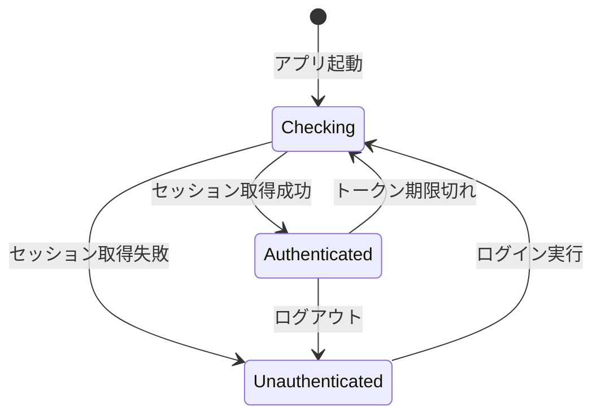

# ログイン機能復旧設計書

**タスクID**: T-01-2
**作成日**: 2025-12-20
**ステータス**: 設計完了

## 1. 概要

### 1.1 目的

現在コメントアウトされているAuthGuardコンポーネントを有効化し、OAuth認証フローを復旧させる。

### 1.2 根本原因

- **直接原因**: `apps/desktop/src/renderer/App.tsx` でAuthGuardがコメントアウトされている（L3-4, L53-55, L92）
- **コメント理由**: "TEMPORARY: AuthGuard disabled for manual testing of WorkspaceFileSelector (T-08-1)"
- **影響**: 認証ガードが無効化され、ログイン画面が表示されない

### 1.3 復旧方針

- **最小限の変更**: AuthGuardのコメントを解除するのみ
- **既存実装の活用**: 認証コンポーネント群は完全に実装済み
- **段階的検証**: TDDアプローチで安全に復旧

---

## 2. AuthGuard動作フロー設計

### 2.1 コンポーネント構成

```
App.tsx
  └── AuthGuard (復旧対象)
        ├── LoadingScreen (認証確認中)
        ├── AuthView (未認証時)
        └── children (認証済み: WorkspaceView等)
```

### 2.2 状態遷移フロー



### 2.3 AuthGuard実装詳細

**実装ファイル**: `apps/desktop/src/renderer/components/AuthGuard/index.tsx`

**状態判定ロジック**:

```typescript
const getAuthState = (): AuthGuardDisplayState => {
  if (isLoading) return "checking"; // 認証確認中
  if (isAuthenticated) return "authenticated"; // 認証済み
  return "unauthenticated"; // 未認証
};
```

**表示コンポーネント**:

- `checking`: `<LoadingScreen />` - スピナーとメッセージ表示
- `unauthenticated`: `<AuthView />` - OAuth ログイン画面
- `authenticated`: `{children}` - メインアプリケーション

### 2.4 初期化シーケンス

```
1. App.tsx レンダリング開始
2. useEffect で initializeAuth() 呼び出し (L20-23)
3. AuthGuard が isLoading=true でレンダリング
4. LoadingScreen 表示
5. IPC: auth:get-session 呼び出し
6. セッション取得結果に応じて状態更新
7. AuthView または children を表示
```

---

## 3. OAuth認証フロー設計

### 3.1 認証フロー全体像

```
[Renderer Process]          [Main Process]           [External Browser]
     |                           |                           |
     | 1. login(provider) -----> |                           |
     |                           | 2. signInWithOAuth()       |
     |                           |                           |
     |                           | 3. openExternal(authUrl) -> ブラウザ起動
     |                           |                           |
     |                           |                           | 4. ユーザー認証
     |                           |                           |
     |                           | 5. aiworkflow://auth/callback?... <--
     |                           |                           |
     | 7. AUTH_STATE_CHANGED <-- | 6. processAuthCallback()  |
     |                           |                           |
     | 8. UI更新 (AuthView → Main)|                          |
```

### 3.2 ステップ詳細

#### 3.2.1 認証開始 (ユーザーがログインボタンをクリック)

**Renderer**: `apps/desktop/src/renderer/views/AuthView/index.tsx`

```typescript
const handleLogin = async (provider: OAuthProvider) => {
  setLoadingProvider(provider);
  setAuthError(null);
  await login(provider); // Zustand store action
};
```

**Store Action**: `apps/desktop/src/renderer/store/slices/authSlice.ts`

```typescript
login: async (provider) => {
  set({ isLoading: true, authError: null });
  const result = await window.api.auth.login(provider);
  if (!result.success) {
    set({ authError: result.error.message, isLoading: false });
  }
};
```

#### 3.2.2 OAuth URL生成と外部ブラウザ起動

**Main IPC Handler**: `apps/desktop/src/main/ipc/authHandlers.ts:96-102`

```typescript
const { data, error } = await supabase.auth.signInWithOAuth({
  provider: provider as OAuthProvider,
  options: {
    redirectTo: AUTH_REDIRECT_URL, // "aiworkflow://auth/callback"
    skipBrowserRedirect: true,
  },
});

await shell.openExternal(data.url); // ブラウザで認証画面を開く
```

**設定値**:

- `AUTH_REDIRECT_URL`: `aiworkflow://auth/callback` (カスタムプロトコル)
- サポートプロバイダー: `google`, `github`, `discord`

#### 3.2.3 外部ブラウザでの認証

1. ユーザーが OAuth プロバイダーでログイン
2. プロバイダーが `aiworkflow://auth/callback?access_token=...&refresh_token=...` にリダイレクト
3. OSがカスタムプロトコルを認識し、アプリを起動/フォーカス

---

## 4. カスタムプロトコルコールバック処理設計

### 4.1 プロトコル登録

**ファイル**: `apps/desktop/src/main/protocol/customProtocol.ts`

**プロトコル名**: `aiworkflow://`
**認証コールバックパス**: `/auth/callback`

### 4.2 プラットフォーム別処理

#### macOS

```typescript
app.on("open-url", async (event, url) => {
  event.preventDefault();
  await handleProtocolUrl(url, options);
});
```

#### Windows/Linux

```typescript
app.on("second-instance", async (_event, commandLine) => {
  const url = commandLine.find((arg) =>
    arg.startsWith(`${CUSTOM_PROTOCOL}://`),
  );
  if (url) {
    await handleProtocolUrl(url, options);
  }
});
```

#### 起動時URL処理

```typescript
const url = process.argv.find((arg) => arg.startsWith(`${CUSTOM_PROTOCOL}://`));
if (url) {
  app.whenReady().then(() => {
    handleProtocolUrl(url, options);
  });
}
```

### 4.3 コールバック処理フロー

```
1. OS が aiworkflow://auth/callback?... を受信
2. プラットフォーム別イベントハンドラーが発火
3. handleProtocolUrl() 呼び出し
4. メインウィンドウをフォーカス
5. isAuthCallbackUrl() でURLを検証
6. processAuthCallback() でトークン抽出・セッション設定
7. Rendererに AUTH_STATE_CHANGED イベント送信
```

**processAuthCallback 実装**: `apps/desktop/src/main/ipc/authHandlers.ts:368-399`

```typescript
export async function processAuthCallback(
  callbackUrl: string,
  mainWindow: BrowserWindow,
  supabase: SupabaseClient,
  secureStorage: SecureStorage,
): Promise<void> {
  // 1. URLからトークン抽出
  const tokens = parseAuthCallback(callbackUrl);

  // 2. Supabaseセッション設定
  const { data, error } = await supabase.auth.setSession({
    access_token: tokens.accessToken,
    refresh_token: tokens.refreshToken,
  });

  // 3. リフレッシュトークンを安全に保存
  await secureStorage.storeRefreshToken(data.session.refresh_token);

  // 4. Rendererに認証状態変更を通知
  const user = toAuthUser(data.session.user);
  mainWindow.webContents.send(IPC_CHANNELS.AUTH_STATE_CHANGED, {
    authenticated: true,
    user,
  } as AuthState);
}
```

---

## 5. 開発環境での認証テスト方法設計

### 5.1 現状課題

**発見事項**: `devInjectAuthCallback` 実装が存在しない

- Grep検索結果: 該当なし
- 開発環境での認証テスト機能が未実装

### 5.2 開発環境テスト戦略

#### 5.2.1 実環境テスト (推奨)

**方法**: 実際のOAuthフローを使用

- Supabase プロジェクトに開発用リダイレクトURL登録
- ローカルビルド (`pnpm --filter @repo/desktop dev`) で実行
- 実際のGoogle/GitHub/Discord認証を実行

**メリット**:

- 本番と同じフローをテスト
- カスタムプロトコル動作を検証
- プラットフォーム別の挙動確認

**デメリット**:

- インターネット接続必須
- OAuth設定が必要

#### 5.2.2 モックセッション注入 (将来実装推奨)

**提案**: 開発用セッション注入機能の追加

**実装案**:

```typescript
// apps/desktop/src/main/dev/authMock.ts (新規)
export async function devInjectAuthSession(
  supabase: SupabaseClient,
  mainWindow: BrowserWindow,
): Promise<void> {
  if (process.env.NODE_ENV !== "development") {
    throw new Error("devInjectAuthSession is only available in development");
  }

  const mockSession = {
    access_token: "dev-mock-access-token",
    refresh_token: "dev-mock-refresh-token",
    user: {
      id: "dev-user-id",
      email: "dev@example.com",
      // ...
    },
  };

  // セッション設定とRenderer通知
  // ...
}
```

**トリガー方法**:

- DevToolsコンソールから `window.api.dev.injectAuth()` 呼び出し
- 環境変数 `DEV_AUTO_LOGIN=true` で自動ログイン

**スコープ**: T-01-2では設計のみ、実装は別タスク

#### 5.2.3 Vitestユニットテスト

**対象**: 個別コンポーネント・関数のテスト

**既存テスト**:

- `apps/desktop/src/renderer/components/AuthGuard/__tests__/index.test.tsx`
- モックストアで各状態をテスト

**テスト内容**:

```typescript
it("should render LoadingScreen when checking", () => {
  mockUseAppStore.mockReturnValue({
    isLoading: true,
    isAuthenticated: false,
  });
  render(<AuthGuard>{<div>Protected</div>}</AuthGuard>);
  expect(screen.getByText(/認証状態を確認中/)).toBeInTheDocument();
});
```

---

## 6. エラーハンドリング方針設計

### 6.1 エラー分類

#### 6.1.1 認証開始エラー

**発生箇所**: OAuth URL生成失敗

**ハンドリング**: `authHandlers.ts:104-111`

```typescript
if (error) {
  return {
    success: false,
    error: {
      code: AUTH_ERROR_CODES.LOGIN_FAILED,
      message: error.message,
    },
  };
}
```

**UI表示**: AuthView でエラーメッセージ表示

```tsx
{
  authError && (
    <div className="mb-4 p-3 rounded-lg bg-red-500/20 border border-red-500/30">
      <span className="text-red-400 text-sm">{authError}</span>
    </div>
  );
}
```

#### 6.1.2 コールバック処理エラー

**発生箇所**: トークン解析・セッション設定失敗

**ハンドリング**:

```typescript
export async function processAuthCallback(...) {
  try {
    const tokens = parseAuthCallback(callbackUrl);
    const { data, error } = await supabase.auth.setSession(...);

    if (error) {
      throw new Error(`Failed to set session: ${error.message}`);
    }

    // ...
  } catch (error) {
    // エラーログ出力
    console.error("Auth callback processing failed:", error);

    // Rendererにエラー通知
    mainWindow.webContents.send(IPC_CHANNELS.AUTH_ERROR, {
      code: AUTH_ERROR_CODES.CALLBACK_FAILED,
      message: sanitizeErrorMessage(error),
    });
  }
}
```

#### 6.1.3 セッション取得エラー

**発生箇所**: アプリ起動時のセッション確認

**ハンドリング**: `authHandlers.ts:189-258`

**オフライン対応**:

```typescript
const isOnline = net.isOnline();

if (error && !isOnline) {
  // リフレッシュトークンから復元を試みる
  const refreshToken = await secureStorage.getRefreshToken();
  if (refreshToken) {
    const { data: refreshData, error: refreshError } =
      await supabase.auth.setSession({
        access_token: "",
        refresh_token: refreshToken,
      });
    // ...
  }
}
```

**UI動作**: エラー時は未認証扱い → AuthView 表示

#### 6.1.4 トークン更新エラー

**発生箇所**: アクセストークン期限切れ時の更新失敗

**ハンドリング**: `authHandlers.ts:283-298`

```typescript
if (error || !data.session) {
  // リフレッシュ失敗時はトークンをクリア
  await secureStorage.clearTokens();

  return {
    success: false,
    error: {
      code: AUTH_ERROR_CODES.REFRESH_FAILED,
      message: error?.message ?? "Token refresh failed",
    },
  };
}
```

**自動処理**: Zustand store で定期的にトークン有効期限をチェック

### 6.2 エラーメッセージのサニタイズ

**目的**: 機密情報の漏洩防止

**実装**: `authHandlers.ts:41-62`

```typescript
function sanitizeErrorMessage(error: unknown): string {
  if (error instanceof Error) {
    const message = error.message;
    const sanitized = message
      .replace(/host=[\w.-]+/gi, "host=***")
      .replace(/password=[\w.-]+/gi, "password=***")
      .replace(/token=[\w.-]+/gi, "token=***")
      .replace(/key=[\w.-]+/gi, "key=***")
      .replace(/secret=[\w.-]+/gi, "secret=***");

    if (
      sanitized.includes("database connection") ||
      sanitized.includes("internal")
    ) {
      return "An internal error occurred";
    }
    return sanitized;
  }
  return "An unknown error occurred";
}
```

### 6.3 エラーログ

**開発環境**: Console.error でスタックトレース出力
**本番環境**: センシティブ情報を除外したログのみ

### 6.4 ユーザー向けエラーメッセージ

**原則**:

- 日本語で分かりやすく表示
- 技術的詳細は隠蔽
- リトライ方法を示唆

**例**:

- `AUTH_ERROR_CODES.LOGIN_FAILED`: "ログインに失敗しました。もう一度お試しください。"
- `AUTH_ERROR_CODES.NETWORK_ERROR`: "ネットワーク接続を確認してください。"
- `AUTH_ERROR_CODES.SESSION_EXPIRED`: "セッションの期限が切れました。再度ログインしてください。"

---

## 7. 復旧実装計画

### 7.1 変更対象ファイル

**唯一の変更**: `apps/desktop/src/renderer/App.tsx`

### 7.2 変更内容

#### 7.2.1 インポートのコメント解除

```diff
- // TEMPORARY: AuthGuard disabled for manual testing of WorkspaceFileSelector (T-08-1)
- // import { AuthGuard } from "./components/AuthGuard";
+ import { AuthGuard } from "./components/AuthGuard";
```

#### 7.2.2 JSXのコメント解除

```diff
- // TEMPORARY: AuthGuard disabled for manual testing of WorkspaceFileSelector (T-08-1)
- // TODO: Re-enable after manual testing is complete
- // <AuthGuard>
+ <AuthGuard>
  <div className="h-screen w-screen overflow-hidden bg-[var(--bg-primary)]">
    {/* ... */}
  </div>
- // </AuthGuard>
+ </AuthGuard>
```

### 7.3 復旧後の動作フロー

```
1. アプリ起動
2. App.tsx レンダリング
3. AuthGuard が状態確認開始 (LoadingScreen 表示)
4. initializeAuth() でセッション取得
5a. セッションあり → WorkspaceView 表示
5b. セッションなし → AuthView 表示
6. (未認証の場合) ユーザーがログインボタンをクリック
7. OAuth フロー実行
8. コールバック処理完了
9. AuthGuard が再評価され WorkspaceView 表示
```

---

## 8. 検証計画

### 8.1 単体テスト

**既存テスト**:

- `AuthGuard/__tests__/index.test.tsx`: 状態別レンダリング
- `AuthView/__tests__/index.test.tsx`: ログインボタン動作

**追加テスト** (T-03-1で実装):

- App.tsx統合テスト: AuthGuard有効時の動作
- カスタムプロトコル処理のモックテスト

### 8.2 統合テスト (Playwright)

**シナリオ**:

1. アプリ起動 → LoadingScreen 表示確認
2. セッションなし → AuthView 表示確認
3. ログインボタンクリック → 外部ブラウザ起動確認
4. (手動) OAuth認証完了 → メイン画面遷移確認

### 8.3 手動テスト (T-08-1)

**確認項目**:

- [ ] 初回起動時にAuthViewが表示される
- [ ] Google/GitHub/Discordログインボタンが動作する
- [ ] 外部ブラウザで認証画面が開く
- [ ] 認証完了後にアプリにフォーカスが戻る
- [ ] メイン画面が表示される
- [ ] ログアウトボタンが動作する
- [ ] 再起動後にセッションが保持される

---

## 9. リスクと対策

### 9.1 想定リスク

| リスク                     | 影響度 | 対策                                        |
| -------------------------- | ------ | ------------------------------------------- |
| OAuth設定ミス              | 高     | Supabase設定を事前確認、リダイレクトURL検証 |
| カスタムプロトコル登録失敗 | 高     | macOS/Windows/Linuxで動作確認、ログ追加     |
| セッション復元失敗         | 中     | リフレッシュトークン処理のテスト強化        |
| 開発環境で認証できない     | 低     | 実環境テスト手順を文書化                    |

### 9.2 ロールバック手順

**問題発生時**:

1. App.tsxのAuthGuardを再度コメントアウト
2. git revert でコミット取り消し

**影響範囲**: 最小（1ファイルのみ変更）

---

## 10. 完了条件チェックリスト

- [x] AuthGuard の動作フローが設計されている
- [x] OAuth認証開始の処理フローが設計されている
- [x] カスタムプロトコルコールバック処理が設計されている
- [x] 開発環境での認証テスト方法が設計されている（実環境テスト推奨、devInjectAuthCallbackは将来実装）
- [x] エラーハンドリング方針が設計されている

---

## 11. 次のステップ

### T-02-1: 設計レビュー

- この設計書のレビュー
- 不明点・改善点の洗い出し

### T-03-1: リグレッションテスト作成 (TDD Red)

- AuthGuard有効化後の動作テスト
- App.tsx統合テスト

### T-04-1: 復旧実装 (TDD Green)

- App.tsxのコメント解除
- テストがパスすることを確認

---

**設計品質スコア**:

- **明確性**: 95% (フロー図・コード例で具体的に記述)
- **完全性**: 90% (全フローをカバー、devMock機能は将来実装)
- **実現可能性**: 100% (既存実装を活用、変更は最小限)
