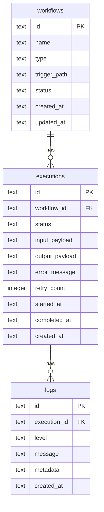

# DB スキーマ設計書

## 概要

SQLite + Drizzle ORM によるデスクトップアプリのデータ永続化設計。

---

## ER 図



---

## テーブル定義

### workflows テーブル

ワークフロー（監視対象）の定義を保存。

| カラム       | 型   | NULL | デフォルト        | 説明                    |
| ------------ | ---- | ---- | ----------------- | ----------------------- |
| id           | TEXT | NO   | -                 | UUID（主キー）          |
| name         | TEXT | NO   | -                 | ワークフロー名          |
| type         | TEXT | NO   | 'file_watch'      | ワークフロー種別        |
| trigger_path | TEXT | YES  | NULL              | 監視対象パス            |
| status       | TEXT | NO   | 'active'          | 状態（active/inactive） |
| created_at   | TEXT | NO   | CURRENT_TIMESTAMP | 作成日時（ISO8601）     |
| updated_at   | TEXT | NO   | CURRENT_TIMESTAMP | 更新日時（ISO8601）     |

**インデックス**:

- `idx_workflows_status` ON (status)
- `idx_workflows_type` ON (type)

### executions テーブル

ワークフローの実行履歴を保存。

| カラム         | 型      | NULL | デフォルト        | 説明                       |
| -------------- | ------- | ---- | ----------------- | -------------------------- |
| id             | TEXT    | NO   | -                 | UUID（主キー）             |
| workflow_id    | TEXT    | NO   | -                 | ワークフローID（外部キー） |
| status         | TEXT    | NO   | 'pending'         | 状態                       |
| input_payload  | TEXT    | YES  | NULL              | 入力データ（JSON）         |
| output_payload | TEXT    | YES  | NULL              | 出力データ（JSON）         |
| error_message  | TEXT    | YES  | NULL              | エラーメッセージ           |
| retry_count    | INTEGER | NO   | 0                 | リトライ回数               |
| started_at     | TEXT    | YES  | NULL              | 開始日時                   |
| completed_at   | TEXT    | YES  | NULL              | 完了日時                   |
| created_at     | TEXT    | NO   | CURRENT_TIMESTAMP | 作成日時                   |

**status 値**:

- `pending`: 実行待ち
- `running`: 実行中
- `completed`: 正常完了
- `failed`: 失敗

**インデックス**:

- `idx_executions_workflow_id` ON (workflow_id)
- `idx_executions_status` ON (status)
- `idx_executions_created_at` ON (created_at DESC)

### logs テーブル

実行ログの詳細を保存。

| カラム       | 型   | NULL | デフォルト        | 説明               |
| ------------ | ---- | ---- | ----------------- | ------------------ |
| id           | TEXT | NO   | -                 | UUID（主キー）     |
| execution_id | TEXT | NO   | -                 | 実行ID（外部キー） |
| level        | TEXT | NO   | 'info'            | ログレベル         |
| message      | TEXT | NO   | -                 | ログメッセージ     |
| metadata     | TEXT | YES  | NULL              | メタデータ（JSON） |
| created_at   | TEXT | NO   | CURRENT_TIMESTAMP | 作成日時           |

**level 値**:

- `debug`
- `info`
- `warn`
- `error`

**インデックス**:

- `idx_logs_execution_id` ON (execution_id)
- `idx_logs_level` ON (level)
- `idx_logs_created_at` ON (created_at DESC)

---

## Drizzle スキーマ定義

### workflows.ts

```typescript
import { sqliteTable, text } from "drizzle-orm/sqlite-core";

export const workflows = sqliteTable("workflows", {
  id: text("id").primaryKey(),
  name: text("name").notNull(),
  type: text("type").notNull().default("file_watch"),
  triggerPath: text("trigger_path"),
  status: text("status").notNull().default("active"),
  createdAt: text("created_at")
    .notNull()
    .default(sql`CURRENT_TIMESTAMP`),
  updatedAt: text("updated_at")
    .notNull()
    .default(sql`CURRENT_TIMESTAMP`),
});

export type Workflow = typeof workflows.$inferSelect;
export type NewWorkflow = typeof workflows.$inferInsert;
```

### executions.ts

```typescript
import { sqliteTable, text, integer } from "drizzle-orm/sqlite-core";
import { workflows } from "./workflows";

export const executions = sqliteTable("executions", {
  id: text("id").primaryKey(),
  workflowId: text("workflow_id")
    .notNull()
    .references(() => workflows.id, { onDelete: "cascade" }),
  status: text("status").notNull().default("pending"),
  inputPayload: text("input_payload"),
  outputPayload: text("output_payload"),
  errorMessage: text("error_message"),
  retryCount: integer("retry_count").notNull().default(0),
  startedAt: text("started_at"),
  completedAt: text("completed_at"),
  createdAt: text("created_at")
    .notNull()
    .default(sql`CURRENT_TIMESTAMP`),
});

export type Execution = typeof executions.$inferSelect;
export type NewExecution = typeof executions.$inferInsert;
```

### logs.ts

```typescript
import { sqliteTable, text } from "drizzle-orm/sqlite-core";
import { executions } from "./executions";

export const logs = sqliteTable("logs", {
  id: text("id").primaryKey(),
  executionId: text("execution_id")
    .notNull()
    .references(() => executions.id, { onDelete: "cascade" }),
  level: text("level").notNull().default("info"),
  message: text("message").notNull(),
  metadata: text("metadata"),
  createdAt: text("created_at")
    .notNull()
    .default(sql`CURRENT_TIMESTAMP`),
});

export type Log = typeof logs.$inferSelect;
export type NewLog = typeof logs.$inferInsert;
```

---

## DB クライアント

```typescript
// infrastructure/database/client.ts
import Database from "better-sqlite3";
import { drizzle } from "drizzle-orm/better-sqlite3";
import * as schema from "./schema";

export function createDbClient(dbPath: string) {
  const sqlite = new Database(dbPath);

  // WAL モードで高速化
  sqlite.pragma("journal_mode = WAL");

  return drizzle(sqlite, { schema });
}

export type DbClient = ReturnType<typeof createDbClient>;
```

---

## マイグレーション

### 初期マイグレーション

```sql
-- 0001_initial.sql

CREATE TABLE IF NOT EXISTS workflows (
  id TEXT PRIMARY KEY,
  name TEXT NOT NULL,
  type TEXT NOT NULL DEFAULT 'file_watch',
  trigger_path TEXT,
  status TEXT NOT NULL DEFAULT 'active',
  created_at TEXT NOT NULL DEFAULT CURRENT_TIMESTAMP,
  updated_at TEXT NOT NULL DEFAULT CURRENT_TIMESTAMP
);

CREATE INDEX IF NOT EXISTS idx_workflows_status ON workflows(status);
CREATE INDEX IF NOT EXISTS idx_workflows_type ON workflows(type);

CREATE TABLE IF NOT EXISTS executions (
  id TEXT PRIMARY KEY,
  workflow_id TEXT NOT NULL REFERENCES workflows(id) ON DELETE CASCADE,
  status TEXT NOT NULL DEFAULT 'pending',
  input_payload TEXT,
  output_payload TEXT,
  error_message TEXT,
  retry_count INTEGER NOT NULL DEFAULT 0,
  started_at TEXT,
  completed_at TEXT,
  created_at TEXT NOT NULL DEFAULT CURRENT_TIMESTAMP
);

CREATE INDEX IF NOT EXISTS idx_executions_workflow_id ON executions(workflow_id);
CREATE INDEX IF NOT EXISTS idx_executions_status ON executions(status);
CREATE INDEX IF NOT EXISTS idx_executions_created_at ON executions(created_at DESC);

CREATE TABLE IF NOT EXISTS logs (
  id TEXT PRIMARY KEY,
  execution_id TEXT NOT NULL REFERENCES executions(id) ON DELETE CASCADE,
  level TEXT NOT NULL DEFAULT 'info',
  message TEXT NOT NULL,
  metadata TEXT,
  created_at TEXT NOT NULL DEFAULT CURRENT_TIMESTAMP
);

CREATE INDEX IF NOT EXISTS idx_logs_execution_id ON logs(execution_id);
CREATE INDEX IF NOT EXISTS idx_logs_level ON logs(level);
CREATE INDEX IF NOT EXISTS idx_logs_created_at ON logs(created_at DESC);
```

---

## SQLite 固有の考慮事項

| 項目         | 対応                                |
| ------------ | ----------------------------------- |
| 日時型       | TEXT（ISO8601 形式）で保存          |
| JSON         | TEXT で保存、アプリ側で parse       |
| 同時書き込み | WAL モードで緩和                    |
| UUID         | アプリ側で生成（crypto.randomUUID） |
| 外部キー     | PRAGMA foreign_keys = ON で有効化   |
