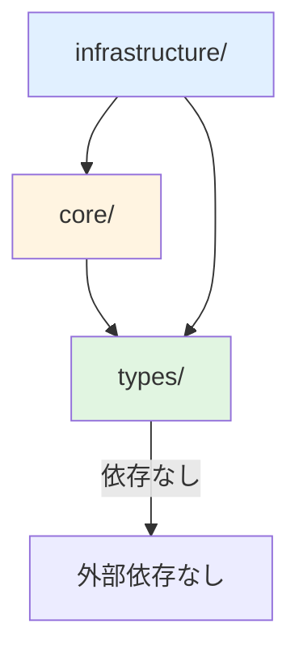

# 共通パッケージ設計書

## 概要

`packages/shared/` は Web/Desktop で共有するコードを格納するパッケージ。
クリーンアーキテクチャの依存関係ルールに従い、4 レイヤーで構成する。

---

## ディレクトリ構造

```
packages/shared/
├── package.json
├── tsconfig.json
├── index.ts                    # エクスポート
│
├── core/                       # ビジネスルール層（外部依存ゼロ）
│   ├── entities/               # エンティティ定義
│   │   ├── workflow.ts
│   │   ├── execution.ts
│   │   └── index.ts
│   ├── interfaces/             # インターフェース定義
│   │   ├── workflow-repository.ts
│   │   └── index.ts
│   └── index.ts
│
├── infrastructure/             # 外部サービス接続層
│   ├── database/
│   │   ├── schema/             # Drizzle スキーマ
│   │   │   ├── workflows.ts
│   │   │   ├── executions.ts
│   │   │   ├── logs.ts
│   │   │   └── index.ts
│   │   ├── repositories/       # Repository 実装
│   │   │   ├── workflow-repository.ts
│   │   │   ├── workflow-repository.test.ts
│   │   │   └── index.ts
│   │   ├── client.ts           # DB 接続クライアント
│   │   └── index.ts
│   └── index.ts
│
├── types/                      # 共通型定義
│   ├── workflow.ts
│   ├── common.ts
│   └── index.ts
│
└── utils/                      # ユーティリティ
    ├── date.ts
    └── index.ts
```

---

## 依存関係ルール



### 依存方向

| レイヤー        | 依存可能      | 依存不可        |
| --------------- | ------------- | --------------- |
| types/          | なし          | -               |
| core/           | types/        | infrastructure/ |
| infrastructure/ | core/, types/ | -               |

### 禁止パターン

```typescript
// ❌ 禁止: core が infrastructure に依存
// core/entities/workflow.ts
import { db } from "../infrastructure/database/client"; // NG

// ✅ 正解: core は types のみに依存
// core/entities/workflow.ts
import type { WorkflowStatus } from "../types"; // OK
```

---

## 各レイヤーの責務

### types/

純粋な TypeScript 型定義のみ。ランタイムコードなし。

```typescript
// types/workflow.ts
export type WorkflowStatus = "pending" | "running" | "completed" | "failed";

export interface WorkflowBase {
  id: string;
  name: string;
  status: WorkflowStatus;
  createdAt: Date;
  updatedAt: Date;
}
```

### core/

ビジネスルールとエンティティ。外部依存ゼロ。

```typescript
// core/entities/workflow.ts
import type { WorkflowBase, WorkflowStatus } from "../../types";

export class Workflow implements WorkflowBase {
  constructor(
    public readonly id: string,
    public name: string,
    public status: WorkflowStatus,
    public readonly createdAt: Date,
    public updatedAt: Date,
  ) {}

  start(): void {
    if (this.status !== "pending") {
      throw new Error("Workflow is not pending");
    }
    this.status = "running";
    this.updatedAt = new Date();
  }

  complete(): void {
    if (this.status !== "running") {
      throw new Error("Workflow is not running");
    }
    this.status = "completed";
    this.updatedAt = new Date();
  }
}
```

### infrastructure/

外部サービス（DB、API）との接続。

```typescript
// infrastructure/database/repositories/workflow-repository.ts
import { eq } from "drizzle-orm";
import type { IWorkflowRepository } from "../../../core/interfaces";
import { Workflow } from "../../../core/entities";
import { db } from "../client";
import { workflows } from "../schema";

export class WorkflowRepository implements IWorkflowRepository {
  async findById(id: string): Promise<Workflow | null> {
    const result = await db
      .select()
      .from(workflows)
      .where(eq(workflows.id, id));
    return result[0] ? this.toEntity(result[0]) : null;
  }

  async save(workflow: Workflow): Promise<void> {
    await db.insert(workflows).values(this.toRecord(workflow));
  }

  private toEntity(record: typeof workflows.$inferSelect): Workflow {
    return new Workflow(
      record.id,
      record.name,
      record.status,
      record.createdAt,
      record.updatedAt,
    );
  }

  private toRecord(entity: Workflow): typeof workflows.$inferInsert {
    return {
      id: entity.id,
      name: entity.name,
      status: entity.status,
      createdAt: entity.createdAt,
      updatedAt: entity.updatedAt,
    };
  }
}
```

---

## エクスポート設計

```typescript
// packages/shared/index.ts

// Types
export * from "./types";

// Core
export * from "./core/entities";
export * from "./core/interfaces";

// Infrastructure
export { WorkflowRepository } from "./infrastructure/database/repositories";
export { createDbClient } from "./infrastructure/database/client";
export * from "./infrastructure/database/schema";

// Utils
export * from "./utils";
```

---

## package.json

```json
{
  "name": "@repo/shared",
  "version": "1.0.0",
  "type": "module",
  "main": "./dist/index.js",
  "types": "./dist/index.d.ts",
  "exports": {
    ".": {
      "types": "./dist/index.d.ts",
      "import": "./dist/index.js"
    }
  },
  "scripts": {
    "build": "tsc",
    "test": "vitest",
    "typecheck": "tsc --noEmit"
  },
  "dependencies": {
    "drizzle-orm": "^0.39.0",
    "zod": "^3.23.8",
    "date-fns": "^4.1.0"
  },
  "devDependencies": {
    "better-sqlite3": "^12.5.0",
    "@types/better-sqlite3": "^7.6.13",
    "typescript": "^5.7.2",
    "vitest": "^2.1.8"
  },
  "peerDependencies": {
    "better-sqlite3": "^12.0.0"
  }
}
```

---

## ESLint boundaries 設定

```javascript
// eslint.config.js（抜粋）
{
  plugins: {
    boundaries: require('eslint-plugin-boundaries'),
  },
  settings: {
    'boundaries/elements': [
      { type: 'types', pattern: 'packages/shared/types/*' },
      { type: 'core', pattern: 'packages/shared/core/*' },
      { type: 'infrastructure', pattern: 'packages/shared/infrastructure/*' },
    ],
  },
  rules: {
    'boundaries/element-types': [
      'error',
      {
        default: 'disallow',
        rules: [
          { from: 'types', allow: [] },
          { from: 'core', allow: ['types'] },
          { from: 'infrastructure', allow: ['types', 'core'] },
        ],
      },
    ],
  },
}
```

---

## apps/desktop からの使用

```typescript
// apps/desktop/src/main/index.ts
import {
  WorkflowRepository,
  createDbClient,
  type WorkflowBase,
} from "@repo/shared";

const db = createDbClient("./data/app.db");
const workflowRepo = new WorkflowRepository(db);
```
