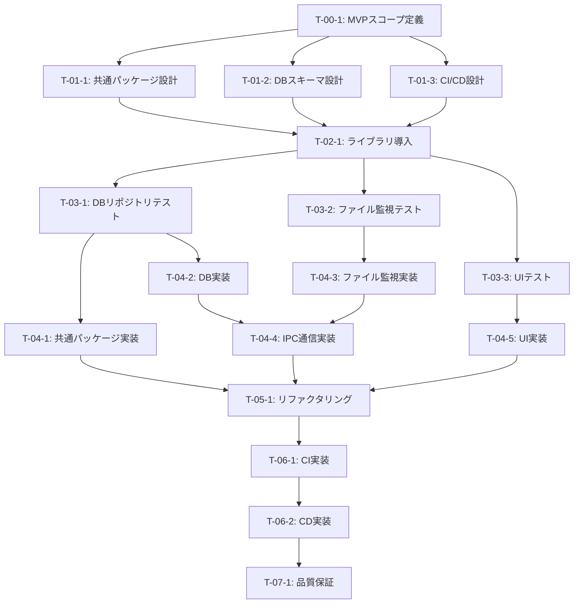

# MVP Desktop Foundation - タスク実行仕様書

## ユーザーからの元の指示

```
テストの自動化もしたいです。自動でデプロイもできるようにしておきたいです。
ただし、MVPで実装したいです。
これらの内容を踏まえてドキュメントを作成してください。
あとは必要なライブラリも全ても導入しておきたいです。
現状はお金をかけても意味がないので、お金をかけずにできる方法で進めるようにしておいてください。
```

---

## コスト方針

> **重要**: MVP段階では無料サービス・無料枠のみを使用する

| 項目         | 方針                                    | 理由                                           |
| ------------ | --------------------------------------- | ---------------------------------------------- |
| CI/CD        | GitHub Actions 無料枠                   | Public repo: 無制限 / Private repo: 2,000分/月 |
| コード署名   | **未署名**（スキップ）                  | 有料証明書（年間$99〜$299）が必要なため        |
| ビルド対象   | **macOS のみ**（開発機）                | クロスプラットフォームビルドは CI 時間を消費   |
| 自動更新     | **手動更新**（electron-updater 未使用） | 自動更新サーバーの運用コスト回避               |
| E2E テスト   | **ローカル実行のみ**                    | Playwright CI は時間を消費                     |
| 外部サービス | なし                                    | SaaS連携は将来検討                             |

---

## タスク概要

### 目的

デスクトップアプリケーション（Electron）の MVP（最小実行可能製品）を構築し、
以下の基盤を確立する：

1. **ライブラリ導入**: 技術スタックに基づく必要なライブラリの一括導入
2. **最小垂直スライス**: ファイル監視 → DB保存 → UI表示の End-to-End 動作
3. **テスト自動化**: CI による自動テスト実行
4. **自動デプロイ**: GitHub Releases への自動ビルド・リリース

### 背景

- Electron 開発環境は既に構築済み（動作確認済み）
- モノレポ構成（apps/desktop, packages/shared）が設計済み
- 技術スタックは `docs/00-requirements/03-technology-stack.md` で定義済み
- MVP として「動くものを早く」が優先

### 最終ゴール

1. 必要なライブラリがすべてインストールされている
2. ファイル監視 → ワークフロー実行 → ログ表示が動作する
3. `git push` で自動的にテストが実行される
4. タグ作成で自動的に Electron アプリがビルド・リリースされる

### 成果物一覧

| 種別              | 成果物                      | 配置先                                      |
| ----------------- | --------------------------- | ------------------------------------------- |
| ライブラリ        | package.json 更新           | `package.json`, `apps/desktop/package.json` |
| 共通コード        | shared パッケージ           | `packages/shared/`                          |
| DB スキーマ       | Drizzle スキーマ定義        | `packages/shared/infrastructure/database/`  |
| UI コンポーネント | 最小 UI                     | `apps/desktop/src/renderer/`                |
| ファイル監視      | Watcher サービス            | `apps/desktop/src/main/services/`           |
| テスト            | ユニットテスト・E2E テスト  | `**/*.test.ts`, `**/*.test.tsx`             |
| CI/CD             | GitHub Actions ワークフロー | `.github/workflows/`                        |

---

## 参照ファイル

本仕様書のコマンド・エージェント・スキル選定は以下を参照：

- `docs/00-requirements/master_system_design.md` - システム要件
- `docs/00-requirements/03-technology-stack.md` - 技術スタック
- `docs/00-requirements/04-directory-structure.md` - ディレクトリ構造
- `.claude/agents/agent_list.md` - エージェント定義

---

## タスク分解サマリー

| ID     | フェーズ            | サブタスク名                | 責務                            | 依存     |
| ------ | ------------------- | --------------------------- | ------------------------------- | -------- |
| T-00-1 | Phase 0: 要件定義   | MVP スコープ定義            | MVP 範囲の明確化                | なし     |
| T-01-1 | Phase 1: 設計       | 共通パッケージ設計          | packages/shared 構造設計        | T-00-1   |
| T-01-2 | Phase 1: 設計       | DB スキーマ設計             | SQLite テーブル設計             | T-00-1   |
| T-01-3 | Phase 1: 設計       | CI/CD 設計                  | GitHub Actions 設計             | T-00-1   |
| T-02-1 | Phase 2: ライブラリ | 依存ライブラリ導入          | 全ライブラリのインストール      | T-01-1   |
| T-03-1 | Phase 3: テスト作成 | DB リポジトリテスト         | Repository 層のテスト           | T-02-1   |
| T-03-2 | Phase 3: テスト作成 | ファイル監視テスト          | Watcher サービスのテスト        | T-02-1   |
| T-03-3 | Phase 3: テスト作成 | UI コンポーネントテスト     | React コンポーネントのテスト    | T-02-1   |
| T-04-1 | Phase 4: 実装       | 共通パッケージ実装          | shared パッケージ構築           | T-03-1   |
| T-04-2 | Phase 4: 実装       | DB スキーマ・リポジトリ実装 | Drizzle スキーマ実装            | T-03-1   |
| T-04-3 | Phase 4: 実装       | ファイル監視サービス実装    | chokidar による監視実装         | T-03-2   |
| T-04-4 | Phase 4: 実装       | IPC 通信実装                | Main ↔ Renderer 通信            | T-04-2,3 |
| T-04-5 | Phase 4: 実装       | UI 実装                     | ワークフロー一覧・ログ画面      | T-03-3   |
| T-05-1 | Phase 5: リファクタ | コード品質改善              | Lint/Format/型チェック          | T-04-5   |
| T-06-1 | Phase 6: CI/CD      | CI ワークフロー実装         | テスト自動化                    | T-05-1   |
| T-06-2 | Phase 6: CI/CD      | CD ワークフロー実装         | Electron ビルド・リリース自動化 | T-06-1   |
| T-07-1 | Phase 7: 品質保証   | 統合テスト・動作確認        | End-to-End 動作検証             | T-06-2   |

**総サブタスク数**: 17 個

---

## 実行フロー図



---

## Phase 0: 要件定義

### T-00-1: MVP スコープ定義

#### 目的

MVP として実装する機能範囲を明確に定義し、スコープクリープを防ぐ。

#### 背景

「動くものを早く」を優先するため、必要最小限の機能に絞る必要がある。

#### 責務（単一責務）

MVP の機能範囲を文書化する。

#### 使用エージェント

- **エージェント**: `@req-analyst`（仕様策定アナリスト）
- **選定理由**: 要件の明確化と優先順位付けが専門
- **参照**: `.claude/agents/req-analyst.md`

#### 活用スキル

| スキル名                    | 活用方法                   |
| --------------------------- | -------------------------- |
| requirements-engineering    | 要件のトリアージと範囲確定 |
| acceptance-criteria-writing | MVP 完了基準の明確化       |
| functional-non-functional   | 機能要件と非機能要件の分類 |

#### 成果物

| 成果物             | パス                                                    | 内容             |
| ------------------ | ------------------------------------------------------- | ---------------- |
| MVP スコープ定義書 | `docs/30-workflows/mvp-desktop-foundation/mvp-scope.md` | MVP 範囲の明文化 |

#### 完了条件

- [ ] MVP に含む機能が明確にリスト化されている
- [ ] MVP に含まない機能（将来実装）が明確にリスト化されている
- [ ] 受け入れ基準が Given-When-Then 形式で記述されている

#### 依存関係

- **前提**: なし
- **後続**: T-01-1, T-01-2, T-01-3

---

## Phase 1: 設計

### T-01-1: 共通パッケージ設計

#### 目的

`packages/shared/` の構造を設計し、Web/Desktop で共有するコードの配置を決定する。

#### 背景

モノレポ構成において、共通コードの適切な分離は保守性に直結する。

#### 責務（単一責務）

packages/shared の内部構造を設計する。

#### 使用エージェント

- **エージェント**: `@arch-police`（アーキテクチャ・ポリス）
- **選定理由**: クリーンアーキテクチャの依存関係ルール遵守が専門
- **参照**: `.claude/agents/arch-police.md`

#### 活用スキル

| スキル名                      | 活用方法                     |
| ----------------------------- | ---------------------------- |
| clean-architecture-principles | レイヤー構造と依存方向の定義 |
| solid-principles              | 単一責務の原則に基づく分割   |

#### 成果物

| 成果物           | パス                                                                | 内容             |
| ---------------- | ------------------------------------------------------------------- | ---------------- |
| パッケージ設計書 | `docs/30-workflows/mvp-desktop-foundation/shared-package-design.md` | 構造と依存ルール |

#### 完了条件

- [ ] core/infrastructure/ui/types の責務が定義されている
- [ ] 依存方向が図示されている
- [ ] eslint-plugin-boundaries の設定方針が記載されている

#### 依存関係

- **前提**: T-00-1
- **後続**: T-02-1

---

### T-01-2: DB スキーマ設計

#### 目的

SQLite のテーブル構造を設計し、Drizzle ORM のスキーマ定義方針を決定する。

#### 背景

MVP では workflows, executions, logs の 3 テーブルで最小限のデータ管理を行う。

#### 責務（単一責務）

SQLite のテーブル設計を行う。

#### 使用エージェント

- **エージェント**: `@db-architect`（DB スキーマ設計）
- **選定理由**: データベース設計と Drizzle ORM が専門
- **参照**: `.claude/agents/db-architect.md`

#### 活用スキル

| スキル名               | 活用方法               |
| ---------------------- | ---------------------- |
| database-normalization | 正規化レベルの決定     |
| indexing-strategies    | 検索パフォーマンス向上 |
| sql-anti-patterns      | アンチパターン回避     |

#### 成果物

| 成果物    | パス                                                           | 内容              |
| --------- | -------------------------------------------------------------- | ----------------- |
| DB 設計書 | `docs/30-workflows/mvp-desktop-foundation/db-schema-design.md` | ER 図とカラム定義 |

#### 完了条件

- [ ] workflows, executions, logs テーブルが定義されている
- [ ] インデックス設計が記載されている
- [ ] Drizzle スキーマの型定義方針が記載されている

#### 依存関係

- **前提**: T-00-1
- **後続**: T-02-1

---

### T-01-3: CI/CD 設計

#### 目的

GitHub Actions のワークフロー構成を設計し、テスト自動化とリリース自動化の方針を決定する。

#### 背景

MVP でも CI/CD を早期に導入することで、品質と開発速度を両立する。

#### 責務（単一責務）

CI/CD パイプラインを設計する。

#### 使用エージェント

- **エージェント**: `@devops-eng`（DevOps/CI エンジニア）
- **選定理由**: GitHub Actions と自動デプロイが専門
- **参照**: `.claude/agents/devops-eng.md`

#### 活用スキル

| スキル名              | 活用方法             |
| --------------------- | -------------------- |
| ci-cd-pipelines       | ワークフロー構成設計 |
| deployment-strategies | リリース戦略の決定   |

#### 成果物

| 成果物       | パス                                                      | 内容               |
| ------------ | --------------------------------------------------------- | ------------------ |
| CI/CD 設計書 | `docs/30-workflows/mvp-desktop-foundation/cicd-design.md` | ワークフロー構成図 |

#### 完了条件

- [ ] CI ワークフロー（テスト・lint・型チェック）が設計されている
- [ ] CD ワークフロー（Electron ビルド・リリース）が設計されている
- [ ] トリガー条件（push, PR, tag）が定義されている

#### 依存関係

- **前提**: T-00-1
- **後続**: T-02-1

---

## Phase 2: ライブラリ導入

### T-02-1: 依存ライブラリ導入

#### 目的

技術スタックに基づき、必要なすべてのライブラリを導入する。

#### 背景

`docs/00-requirements/03-technology-stack.md` で定義されたライブラリを一括導入する。

#### 責務（単一責務）

package.json の更新とライブラリインストール。

#### 使用エージェント

- **エージェント**: `@dep-mgr`（依存関係管理）
- **選定理由**: パッケージ管理と依存関係解決が専門
- **参照**: `.claude/agents/dep-mgr.md`

#### 活用スキル

| スキル名                       | 活用方法                   |
| ------------------------------ | -------------------------- |
| monorepo-dependency-management | ワークスペース間の依存管理 |
| semantic-versioning            | バージョン指定戦略         |

#### 導入ライブラリ一覧

**ルート（devDependencies）**:

```
@testing-library/react
@testing-library/user-event
@playwright/test
msw
eslint-plugin-boundaries
```

**packages/shared**:

```
drizzle-orm
zod
date-fns
```

**apps/desktop（dependencies）**:

```
chokidar
piscina
```

**apps/desktop（devDependencies）**:

```
@testing-library/react
vitest
```

#### 成果物

| 成果物                  | パス             | 内容               |
| ----------------------- | ---------------- | ------------------ |
| 更新された package.json | 各 package.json  | 依存関係追加       |
| pnpm-lock.yaml          | `pnpm-lock.yaml` | ロックファイル更新 |

#### 完了条件

- [ ] `pnpm install` が成功する
- [ ] 型エラーが発生しない
- [ ] ビルドが成功する

#### 依存関係

- **前提**: T-01-1, T-01-2, T-01-3
- **後続**: T-03-1, T-03-2, T-03-3

---

## Phase 3: テスト作成 (TDD: Red)

### T-03-1: DB リポジトリテスト

#### 目的

Repository 層の期待動作をテストとして先に記述する。

#### 背景

TDD により、実装前にインターフェースと期待動作を明確化する。

#### 責務（単一責務）

Repository 層のユニットテストを作成する。

#### 使用エージェント

- **エージェント**: `@unit-tester`（ユニットテスター）
- **選定理由**: TDD とユニットテストが専門
- **参照**: `.claude/agents/unit-tester.md`

#### 活用スキル

| スキル名       | 活用方法                    |
| -------------- | --------------------------- |
| tdd-principles | Red-Green-Refactor サイクル |
| test-doubles   | SQLite のインメモリ DB 活用 |

#### 成果物

| 成果物                     | パス                                                                               | 内容        |
| -------------------------- | ---------------------------------------------------------------------------------- | ----------- |
| Workflow Repository テスト | `packages/shared/infrastructure/database/repositories/workflow-repository.test.ts` | CRUD テスト |

#### TDD 検証: Red 状態確認

```bash
pnpm test packages/shared
```

- [ ] テストが失敗することを確認（Red 状態）

#### 完了条件

- [ ] create, read, update, delete のテストケースがある
- [ ] 異常系（not found 等）のテストケースがある
- [ ] テストが Red 状態で失敗する

#### 依存関係

- **前提**: T-02-1
- **後続**: T-04-1, T-04-2

---

### T-03-2: ファイル監視テスト

#### 目的

ファイル監視サービスの期待動作をテストとして先に記述する。

#### 背景

ファイル追加・変更・削除の各イベントを正しく検知できることを保証する。

#### 責務（単一責務）

Watcher サービスのユニットテストを作成する。

#### 使用エージェント

- **エージェント**: `@unit-tester`（ユニットテスター）
- **選定理由**: イベント駆動のテストが専門
- **参照**: `.claude/agents/unit-tester.md`

#### 活用スキル

| スキル名                   | 活用方法                 |
| -------------------------- | ------------------------ |
| event-driven-file-watching | イベント発火のテスト     |
| test-doubles               | ファイルシステムのモック |

#### 成果物

| 成果物         | パス                                                     | 内容               |
| -------------- | -------------------------------------------------------- | ------------------ |
| Watcher テスト | `apps/desktop/src/main/services/watcher/watcher.test.ts` | イベント検知テスト |

#### TDD 検証: Red 状態確認

```bash
pnpm test apps/desktop
```

- [ ] テストが失敗することを確認（Red 状態）

#### 完了条件

- [ ] ファイル追加イベントのテストケースがある
- [ ] ファイル変更イベントのテストケースがある
- [ ] 除外パターン（node_modules 等）のテストケースがある

#### 依存関係

- **前提**: T-02-1
- **後続**: T-04-3

---

### T-03-3: UI コンポーネントテスト

#### 目的

React コンポーネントの期待動作をテストとして先に記述する。

#### 背景

ユーザー視点でのコンポーネント動作をテストで保証する。

#### 責務（単一責務）

React コンポーネントのテストを作成する。

#### 使用エージェント

- **エージェント**: `@frontend-tester`（フロントエンドテスター）
- **選定理由**: React Testing Library が専門
- **参照**: `.claude/agents/frontend-tester.md`

#### 活用スキル

| スキル名              | 活用方法                 |
| --------------------- | ------------------------ |
| react-testing-library | ユーザー視点のテスト     |
| accessibility-testing | アクセシビリティのテスト |

#### 成果物

| 成果物              | パス                                                         | 内容           |
| ------------------- | ------------------------------------------------------------ | -------------- |
| WorkflowList テスト | `apps/desktop/src/renderer/components/WorkflowList.test.tsx` | 一覧表示テスト |
| ExecutionLog テスト | `apps/desktop/src/renderer/components/ExecutionLog.test.tsx` | ログ表示テスト |

#### TDD 検証: Red 状態確認

```bash
pnpm test apps/desktop
```

- [ ] テストが失敗することを確認（Red 状態）

#### 完了条件

- [ ] ワークフロー一覧の表示テストがある
- [ ] ログ一覧の表示テストがある
- [ ] ローディング状態のテストがある

#### 依存関係

- **前提**: T-02-1
- **後続**: T-04-5

---

## Phase 4: 実装 (TDD: Green)

### T-04-1: 共通パッケージ実装

#### 目的

`packages/shared/` の基本構造を実装する。

#### 背景

Web/Desktop 共通のコードベースを確立する。

#### 責務（単一責務）

shared パッケージの基本構造を構築する。

#### 使用エージェント

- **エージェント**: `@arch-police`（アーキテクチャ・ポリス）
- **選定理由**: レイヤー構造の実装が専門
- **参照**: `.claude/agents/arch-police.md`

#### 成果物

| 成果物        | パス                            | 内容            |
| ------------- | ------------------------------- | --------------- |
| package.json  | `packages/shared/package.json`  | パッケージ定義  |
| tsconfig.json | `packages/shared/tsconfig.json` | TypeScript 設定 |
| index.ts      | `packages/shared/index.ts`      | エクスポート    |

#### TDD 検証: Green 状態確認

```bash
pnpm build packages/shared
```

- [ ] ビルドが成功することを確認

#### 完了条件

- [ ] core, infrastructure, ui, types ディレクトリが作成されている
- [ ] 型エクスポートが正しく機能する
- [ ] apps/desktop から import 可能

#### 依存関係

- **前提**: T-03-1
- **後続**: T-05-1

---

### T-04-2: DB スキーマ・リポジトリ実装

#### 目的

Drizzle ORM によるスキーマ定義と Repository 実装を行う。

#### 背景

ファイル監視で検知したイベントを永続化するための基盤。

#### 責務（単一責務）

SQLite スキーマと Repository を実装する。

#### 使用エージェント

- **エージェント**: `@db-architect`（DB スキーマ設計）
- **選定理由**: Drizzle ORM と SQLite が専門
- **参照**: `.claude/agents/db-architect.md`

#### 成果物

| 成果物          | パス                                                    | 内容         |
| --------------- | ------------------------------------------------------- | ------------ |
| スキーマ定義    | `packages/shared/infrastructure/database/schema/`       | テーブル定義 |
| DB クライアント | `packages/shared/infrastructure/database/client.ts`     | 接続管理     |
| Repository      | `packages/shared/infrastructure/database/repositories/` | CRUD 実装    |

#### TDD 検証: Green 状態確認

```bash
pnpm test packages/shared
```

- [ ] テストが成功することを確認（Green 状態）

#### 完了条件

- [ ] workflows, executions, logs テーブルが定義されている
- [ ] WorkflowRepository の CRUD が動作する
- [ ] T-03-1 のテストが通る

#### 依存関係

- **前提**: T-03-1
- **後続**: T-04-4

---

### T-04-3: ファイル監視サービス実装

#### 目的

chokidar によるファイル監視サービスを実装する。

#### 背景

ローカルファイルの変更を検知し、ワークフローをトリガーする起点。

#### 責務（単一責務）

ファイル監視サービスを実装する。

#### 使用エージェント

- **エージェント**: `@local-watcher`（ファイル監視）
- **選定理由**: chokidar とイベント駆動が専門
- **参照**: `.claude/agents/local-watcher.md`

#### 成果物

| 成果物           | パス                                                | 内容     |
| ---------------- | --------------------------------------------------- | -------- |
| Watcher サービス | `apps/desktop/src/main/services/watcher/watcher.ts` | 監視実装 |
| 設定             | `apps/desktop/src/main/services/watcher/config.ts`  | 監視設定 |

#### TDD 検証: Green 状態確認

```bash
pnpm test apps/desktop
```

- [ ] テストが成功することを確認（Green 状態）

#### 完了条件

- [ ] ディレクトリ監視が動作する
- [ ] イベント（add, change, unlink）が発火する
- [ ] T-03-2 のテストが通る

#### 依存関係

- **前提**: T-03-2
- **後続**: T-04-4

---

### T-04-4: IPC 通信実装

#### 目的

Main プロセスと Renderer プロセス間の型安全な通信を実装する。

#### 背景

Electron のセキュリティモデルに従い、contextBridge 経由で通信する。

#### 責務（単一責務）

IPC チャネルとハンドラーを実装する。

#### 使用エージェント

- **エージェント**: `@electron-architect`（Electron アーキテクト）
- **選定理由**: Electron IPC とセキュリティが専門
- **参照**: `.claude/agents/electron-architect.md`

#### 成果物

| 成果物       | パス                                    | 内容         |
| ------------ | --------------------------------------- | ------------ |
| チャネル定義 | `apps/desktop/src/main/ipc/channels.ts` | 型定義       |
| ハンドラー   | `apps/desktop/src/main/ipc/handlers/`   | 各ハンドラー |
| Preload API  | `apps/desktop/src/preload/api.ts`       | 公開 API     |

#### 完了条件

- [ ] 型安全な IPC 通信が動作する
- [ ] Renderer から Workflow 一覧を取得できる
- [ ] Renderer から監視開始/停止を制御できる

#### 依存関係

- **前提**: T-04-2, T-04-3
- **後続**: T-05-1

---

### T-04-5: UI 実装

#### 目的

最小限の UI コンポーネントを実装する。

#### 背景

MVP として、ワークフロー一覧とログ表示の 2 画面を実装する。

#### 責務（単一責務）

React コンポーネントを実装する。

#### 使用エージェント

- **エージェント**: `@electron-ui-dev`（Electron UI 開発）
- **選定理由**: Electron Renderer と React が専門
- **参照**: `.claude/agents/electron-ui-dev.md`

#### 成果物

| 成果物       | パス                                                    | 内容     |
| ------------ | ------------------------------------------------------- | -------- |
| WorkflowList | `apps/desktop/src/renderer/components/WorkflowList.tsx` | 一覧表示 |
| ExecutionLog | `apps/desktop/src/renderer/components/ExecutionLog.tsx` | ログ表示 |
| App          | `apps/desktop/src/renderer/App.tsx`                     | ルート   |

#### TDD 検証: Green 状態確認

```bash
pnpm test apps/desktop
```

- [ ] テストが成功することを確認（Green 状態）

#### 完了条件

- [ ] ワークフロー一覧が表示される
- [ ] 実行ログが表示される
- [ ] T-03-3 のテストが通る

#### 依存関係

- **前提**: T-03-3
- **後続**: T-05-1

---

## Phase 5: リファクタリング (TDD: Refactor)

### T-05-1: コード品質改善

#### 目的

実装コードの品質を改善し、lint/format/型チェックをクリアする。

#### 背景

MVP でも最低限のコード品質を維持する。

#### 責務（単一責務）

コード品質の改善。

#### 使用エージェント

- **エージェント**: `@code-quality`（コード品質）
- **選定理由**: ESLint, Prettier, TypeScript が専門
- **参照**: `.claude/agents/code-quality.md`

#### 成果物

| 成果物          | パス               | 内容             |
| --------------- | ------------------ | ---------------- |
| ESLint 設定更新 | `eslint.config.js` | ルール追加       |
| Prettier 設定   | `.prettierrc`      | フォーマット設定 |

#### TDD 検証: 継続 Green 確認

```bash
pnpm lint && pnpm typecheck && pnpm test
```

- [ ] すべて成功することを確認

#### 完了条件

- [ ] ESLint エラーがない
- [ ] Prettier フォーマット済み
- [ ] TypeScript 型エラーがない
- [ ] すべてのテストが通る

#### 依存関係

- **前提**: T-04-1, T-04-4, T-04-5
- **後続**: T-06-1

---

## Phase 6: CI/CD

### T-06-1: CI ワークフロー実装

#### 目的

GitHub Actions で自動テストを実行する CI を構築する。

#### 背景

PR マージ前に品質を保証するゲートを設ける。

#### 責務（単一責務）

CI ワークフローを実装する。

#### 使用エージェント

- **エージェント**: `@gha-workflow-architect`（GitHub Actions アーキテクト）
- **選定理由**: GitHub Actions の設計が専門
- **参照**: `.claude/agents/gha-workflow-architect.md`

#### 成果物

| 成果物          | パス                       | 内容         |
| --------------- | -------------------------- | ------------ |
| CI ワークフロー | `.github/workflows/ci.yml` | テスト自動化 |

#### 完了条件

- [ ] push 時に自動実行される
- [ ] lint, typecheck, test が実行される
- [ ] 失敗時に PR がブロックされる

#### 依存関係

- **前提**: T-05-1
- **後続**: T-06-2

---

### T-06-2: CD ワークフロー実装

#### 目的

タグ作成時に自動で Electron アプリをビルド・リリースする。

#### 背景

手動リリースのミスを防ぎ、リリースプロセスを自動化する。

#### 責務（単一責務）

CD ワークフローを実装する。

#### 使用エージェント

- **エージェント**: `@electron-release`（Electron リリース）
- **選定理由**: electron-builder と GitHub Releases が専門
- **参照**: `.claude/agents/electron-release.md`

#### 成果物

| 成果物          | パス                                    | 内容             |
| --------------- | --------------------------------------- | ---------------- |
| CD ワークフロー | `.github/workflows/release-desktop.yml` | ビルド・リリース |

#### コスト最適化

> **無料運用のための制限事項**

| 項目           | MVP方針                    | 将来（有料化後）        |
| -------------- | -------------------------- | ----------------------- |
| ビルド対象     | macOS のみ                 | macOS + Windows + Linux |
| コード署名     | 未署名                     | Apple/Microsoft 証明書  |
| 自動更新       | なし（手動配布）           | electron-updater        |
| ビルドトリガー | 手動タグ or ローカルビルド | 自動タグ                |

#### 完了条件

- [ ] v\* タグで自動実行される（または手動 workflow_dispatch）
- [ ] **macOS 向けのみ**ビルドされる（コスト削減）
- [ ] GitHub Releases に自動アップロードされる
- [ ] **未署名**でビルドされる（Gatekeeper 警告は許容）

#### 依存関係

- **前提**: T-06-1
- **後続**: T-07-1

---

## Phase 7: 品質保証

### T-07-1: 統合テスト・動作確認

#### 目的

End-to-End でシステム全体が動作することを確認する。

#### 背景

個別テストでは検出できない統合時の問題を発見する。

#### 責務（単一責務）

統合動作の検証。

#### 使用エージェント

- **エージェント**: `@e2e-tester`（E2E テスター）
- **選定理由**: 統合テストと動作検証が専門
- **参照**: `.claude/agents/e2e-tester.md`

#### コスト最適化

> **E2E テストはローカル実行のみ**（CI での Playwright 実行はコスト消費が大きいため）

| テスト種別     | 実行環境             | 理由                        |
| -------------- | -------------------- | --------------------------- |
| ユニットテスト | CI（GitHub Actions） | 高速、低コスト              |
| E2E テスト     | **ローカルのみ**     | Playwright は CI 時間を消費 |

#### 成果物

| 成果物           | パス                                                              | 内容                         |
| ---------------- | ----------------------------------------------------------------- | ---------------------------- |
| E2E テスト       | `apps/desktop/e2e/`                                               | 統合テスト（ローカル実行用） |
| 動作確認レポート | `docs/30-workflows/mvp-desktop-foundation/verification-report.md` | 検証結果                     |

#### 完了条件

- [ ] アプリが正常に起動する
- [ ] ファイル追加 → DB 保存 → UI 表示が動作する
- [ ] CI/CD パイプラインが正常に動作する
- [ ] **E2E テストがローカルで実行可能**（CI では実行しない）

#### 依存関係

- **前提**: T-06-2
- **後続**: なし

---

## 品質ゲートチェックリスト

### 機能検証

- [ ] 全ユニットテスト成功
- [ ] 全統合テスト成功
- [ ] E2E テスト成功

### コード品質

- [ ] ESLint エラーなし
- [ ] TypeScript 型エラーなし
- [ ] Prettier フォーマット適用済み

### テスト網羅性

- [ ] Repository 層のテストカバレッジ 80% 以上
- [ ] コンポーネントのテストカバレッジ 70% 以上

### CI/CD

- [ ] CI パイプラインが動作する
- [ ] CD パイプラインが動作する
- [ ] GitHub Releases へのアップロードが成功する

---

## リスクと対策

| リスク                      | 影響度 | 発生確率 | 対策                      | 対応サブタスク |
| --------------------------- | ------ | -------- | ------------------------- | -------------- |
| Node.js バージョン不一致    | 高     | 高       | v22 への統一、CI での明示 | T-06-1         |
| Electron ビルド失敗         | 高     | 中       | ローカルでの事前検証      | T-06-2         |
| chokidar パフォーマンス問題 | 中     | 低       | 除外パターンの最適化      | T-04-3         |
| IPC 型安全性の欠如          | 中     | 中       | zod による実行時検証      | T-04-4         |

---

## 前提条件

- Node.js v22.x がインストールされていること
- pnpm v10.x がインストールされていること
- GitHub リポジトリへのプッシュ権限があること
- GitHub Actions が有効化されていること

---

## 備考

### 技術的制約

- SQLite はシングルファイル DB のため、同時書き込みに制限あり
- Electron のコード署名は有料証明書が必要（MVP では未署名）
- macOS/Windows 両対応には CI でのクロスプラットフォームビルドが必要

### コスト関連の制約と将来計画

| 制約               | MVP対応                                 | 将来対応（有料化後）             |
| ------------------ | --------------------------------------- | -------------------------------- |
| コード署名なし     | macOS Gatekeeper 警告を許容             | Apple Developer Program ($99/年) |
| Windows 未対応     | macOS 開発機のみ                        | GitHub Actions Windows ランナー  |
| 自動更新なし       | 手動で GitHub Releases からダウンロード | electron-updater + S3/GitHub     |
| E2E テスト CI なし | ローカル実行                            | Playwright CI ワークフロー       |

### GitHub Actions 無料枠の範囲

| リポジトリ種別 | 無料枠     | 備考                          |
| -------------- | ---------- | ----------------------------- |
| Public         | 無制限     | 推奨                          |
| Private        | 2,000分/月 | macOS は 10倍消費 (200分相当) |

**MVP推奨**: Public リポジトリで運用し、無制限の CI/CD を活用する

### 参考資料

- [Electron 公式ドキュメント](https://www.electronjs.org/docs)
- [Drizzle ORM ドキュメント](https://orm.drizzle.team/)
- [chokidar GitHub](https://github.com/paulmillr/chokidar)
- [electron-builder ドキュメント](https://www.electron.build/)
- [GitHub Actions 料金](https://docs.github.com/en/billing/managing-billing-for-github-actions/about-billing-for-github-actions)
