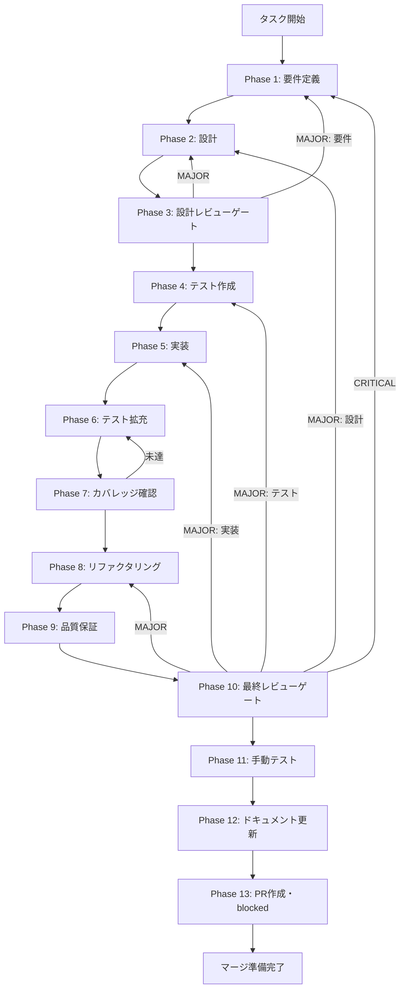

# TASK-SW-STREAM-001 - タスク実行仕様書

## ユーザーからの元の指示

```
SkillCreatorService.createSkill() にオプショナルコールバック引数を追加し、
処理の節目で sendSkillCreatorProgress() を呼び出せるようにする。
```

## メタ情報

| 項目         | 内容                                    |
| ------------ | --------------------------------------- |
| タスクID     | TASK-SW-STREAM-001                      |
| タスク名     | skill-creator-service-progress-callback |
| 分類         | バグ修正                                |
| 対象機能     | スキル作成フロー - Streaming進捗送信    |
| 優先度       | 高                                      |
| 見積もり規模 | 小規模                                  |
| ステータス   | 未実施                                  |
| 作成日       | 2026-04-15                              |

---

## タスク概要

### 目的

`SkillCreatorService.createSkill()` にオプショナルコールバック引数（`onProgress?`）を追加し、
処理の各段階（planning・generating-skill・generating-agents・validating・done）でコールバックを呼び出す。
これにより、メインプロセスからフロントエンドへ進捗通知を送信できる基盤を整備する。

### 背景

スキル作成フローの連動調査において、`sendSkillCreatorProgress()` が `skillCreatorHandlers.ts:692` に
エクスポートされているにもかかわらず、呼び出し元が存在しないことが判明した。
`SkillCreatorService.createSkill()` は処理を同期的に進めるだけで、進捗データをコールバック経由で
報告する仕組みを持っていない。フロント・Preload・メインの3層の接続設計は正しく定義されているが、
メインプロセス側からの実際の `send()` 呼び出しが欠落している。

現状では `GenerateStep.tsx` のプログレスバーは常に初期状態（`stage: "idle"`）のままとなり、
ユーザーはスキル生成中なのか停止しているのか判断できない。

### 最終ゴール

`SkillCreatorService.createSkill()` が第2引数として `onProgress?` コールバックを受け取り、
以下の5段階で進捗データを報告する状態を達成する:

1. `runCreateWorkflow` 開始時: `{ phase: "planning", percentage: 10, message: "構造を計画しています" }`
2. SKILL.md 生成開始時: `{ phase: "generating-skill", percentage: 40, message: "SKILL.md を生成しています" }`
3. エージェント定義生成時: `{ phase: "generating-agents", percentage: 70, message: "エージェント定義を生成しています" }`
4. 検証開始時: `{ phase: "validating", percentage: 90, message: "スキルを検証しています" }`
5. 完了時: `{ phase: "done", percentage: 100, message: "完了しました" }`

コールバック引数はオプショナル（`?:`）のため、既存のテストコードや呼び出し元への影響を最小化できる。

### 成果物一覧

| 種別         | 成果物                           | 配置先                                                                             |
| ------------ | -------------------------------- | ---------------------------------------------------------------------------------- |
| 機能         | createSkill コールバック引数追加 | `apps/desktop/src/main/services/skill/SkillCreatorService.ts`                      |
| テスト       | ユニットテスト更新               | `apps/desktop/src/main/ipc/__tests__/skillCreatorHandlers.validation.test.ts` など |
| ドキュメント | 各Phase成果物                    | `outputs/phase-*/`                                                                 |

---

## 参照ファイル

本仕様書のコマンド選定は以下を参照：

- `docs/30-workflows/skill-create-flow-gaps/00-task-spec-design-docs/phase-1-analysis.md` - 現状分析
- `docs/30-workflows/skill-create-flow-gaps/00-task-spec-design-docs/phase-2-solution.md` - 解決策設計
- `docs/30-workflows/skill-create-flow-gaps/00-task-spec-design-docs/phase-3-review.md` - 設計レビュー
- `apps/desktop/src/main/services/skill/SkillCreatorService.ts` - 修正対象ファイル
- `apps/desktop/src/main/ipc/skillCreatorHandlers.ts` - 参照ファイル（TASK-SW-STREAM-002 の修正対象）
- `apps/desktop/src/renderer/hooks/useStreamingProgress.ts` - フロント側接続確認用

---

## タスク分解サマリー

| ID     | フェーズ | サブタスク名       | 責務                                                       | 依存 |
| ------ | -------- | ------------------ | ---------------------------------------------------------- | ---- |
| T-01-1 | Phase 1  | 要件定義           | 修正対象コードの現状確認・AC定義                           | -    |
| T-02-1 | Phase 2  | 設計               | コールバック型定義・シグネチャ変更・進捗通知ポイント設計   | T-01 |
| T-03-1 | Phase 3  | 設計レビューゲート | 設計の整合性・AC充足・リスク確認                           | T-02 |
| T-04-1 | Phase 4  | テスト作成         | コールバック呼び出しのTDDテスト作成（Red）                 | T-03 |
| T-05-1 | Phase 5  | 実装               | createSkill にコールバック引数を追加・各段階で呼び出し実装 | T-04 |
| T-06-1 | Phase 6  | テスト拡充         | エッジケース・コールバック未指定ケースのテスト追加         | T-05 |
| T-07-1 | Phase 7  | カバレッジ確認     | テストカバレッジの確認・未達時はテスト追加                 | T-06 |
| T-08-1 | Phase 8  | リファクタリング   | コード品質改善・不要な複雑性の排除                         | T-07 |
| T-09-1 | Phase 9  | 品質保証           | lint・typecheck・全テスト通過確認                          | T-08 |
| T-10-1 | Phase 10 | 最終レビューゲート | 変更の網羅性・後方互換性・テスト結果の最終確認             | T-09 |
| T-11-1 | Phase 11 | 手動テスト         | 実際の動作確認（コールバックが呼ばれることの確認）         | T-10 |
| T-12-1 | Phase 12 | ドキュメント更新   | 実装ガイド・システム仕様更新・未タスク検出                 | T-11 |
| T-13-1 | Phase 13 | PR作成             | PR 情報整理（blocked）                                     | T-12 |

**総サブタスク数**: 13個

---

## 実行フロー図



---

## Phase一覧

| Phase | 名称               | 仕様書                                                       | ステータス                  |
| ----- | ------------------ | ------------------------------------------------------------ | --------------------------- |
| 1     | 要件定義           | [phase-1-requirements.md](phase-1-requirements.md)           | 完了                        |
| 2     | 設計               | [phase-2-design.md](phase-2-design.md)                       | 完了                        |
| 3     | 設計レビューゲート | [phase-3-design-review.md](phase-3-design-review.md)         | 完了                        |
| 4     | テスト作成         | [phase-4-test-creation.md](phase-4-test-creation.md)         | 完了                        |
| 5     | 実装               | [phase-5-implementation.md](phase-5-implementation.md)       | 完了                        |
| 6     | テスト拡充         | [phase-6-test-expansion.md](phase-6-test-expansion.md)       | 完了                        |
| 7     | カバレッジ確認     | [phase-7-coverage-check.md](phase-7-coverage-check.md)       | 完了                        |
| 8     | リファクタリング   | [phase-8-refactoring.md](phase-8-refactoring.md)             | 完了                        |
| 9     | 品質保証           | [phase-9-quality-assurance.md](phase-9-quality-assurance.md) | 完了                        |
| 10    | 最終レビューゲート | [phase-10-final-review.md](phase-10-final-review.md)         | 完了                        |
| 11    | 手動テスト検証     | [phase-11-manual-test.md](phase-11-manual-test.md)           | 完了                        |
| 12    | ドキュメント更新   | [phase-12-documentation.md](phase-12-documentation.md)       | 完了                        |
| 13    | PR作成             | [phase-13-pr-creation.md](phase-13-pr-creation.md)           | ユーザー指示待ち（blocked） |

---

## テストカバレッジ目標

### ユニットテスト

| 指標              | 最低基準 | 推奨基準 |
| ----------------- | -------- | -------- |
| Line Coverage     | 80%      | 90%      |
| Branch Coverage   | 60%      | 70%      |
| Function Coverage | 80%      | 90%      |

### 結合テスト

| 指標                         | 目標 |
| ---------------------------- | ---- |
| APIエンドポイント            | 100% |
| モジュール間インターフェース | 100% |
| 正常系シナリオ               | 100% |
| 異常系シナリオ               | 80%+ |
| 外部連携ポイント             | 100% |

---

## 統合テスト連携（Phase 1〜11で必須）

各Phaseで以下の統合テスト連携アクションを実施すること:

| Phase | 統合テスト連携アクション                                    |
| ----- | ----------------------------------------------------------- |
| 1     | 接続要件（IPC・コールバック・データフロー）を要件に明記     |
| 2     | 統合ポイント/契約（コールバック型・シグネチャ）を設計に反映 |
| 3     | 統合テスト観点のレビューゲートを実施                        |
| 4     | 統合テストシナリオを全カテゴリで作成                        |
| 5     | コールバック接続の実装とテスト支援コード整備                |
| 6     | 統合テストの拡充（全カテゴリのカバレッジ向上）              |
| 7     | 統合テストの再実行とゲート判定                              |
| 8     | リファクタ後の統合テスト継続成功を確認                      |
| 9     | 品質保証で統合テスト結果を確認                              |
| 10    | 最終レビューで統合テスト結果を確認                          |
| 11    | 手動統合テスト（コールバック呼び出し確認）                  |

---

## Phase完了時の必須アクション

**各Phase完了時に以下を必ず実行すること:**

1. **タスク100%実行**: Phase内で指定された全タスクを完全に実行
2. **成果物確認**: 全ての必須成果物が生成されていることを検証
3. **実行記録**: 実行タスクの結果を記録
4. **artifacts.json更新**: Phase完了ステータスを更新
5. **Phase末端の実行確認**: 各タスクを100%実行し、各タスクを完遂した旨を必ず明記

```bash
# Phase完了処理
node .claude/skills/task-specification-creator/scripts/complete-phase.js \
  --workflow docs/30-workflows/p01-par-STREAM-001 --phase {{N}} \
  --artifacts "outputs/phase-{{N}}/{{FILE}}.md:{{DESCRIPTION}}"
```

---

## 成果物

| Phase | 主要成果物                                                                                                                                                                                                                                                                              |
| ----- | --------------------------------------------------------------------------------------------------------------------------------------------------------------------------------------------------------------------------------------------------------------------------------------- |
| 1     | outputs/phase-1/requirements-definition.md, outputs/phase-1/acceptance-criteria.md                                                                                                                                                                                                      |
| 2     | outputs/phase-2/design.md                                                                                                                                                                                                                                                               |
| 3     | outputs/phase-3/gate-decision.md                                                                                                                                                                                                                                                        |
| 4     | apps/desktop/src/main/services/skill/**tests**/SkillCreatorService.progress.test.ts                                                                                                                                                                                                     |
| 5     | apps/desktop/src/main/services/skill/SkillCreatorService.ts                                                                                                                                                                                                                             |
| 6     | apps/desktop/src/main/services/skill/**tests**/SkillCreatorService.progress.test.ts                                                                                                                                                                                                     |
| 7     | outputs/phase-7/coverage-report.md                                                                                                                                                                                                                                                      |
| 8     | outputs/phase-8/refactoring-log.md                                                                                                                                                                                                                                                      |
| 9     | outputs/phase-9/quality-report.md                                                                                                                                                                                                                                                       |
| 10    | outputs/phase-10/final-review-result.md                                                                                                                                                                                                                                                 |
| 11    | outputs/phase-11/manual-test-result.md                                                                                                                                                                                                                                                  |
| 12    | outputs/phase-12/implementation-guide.md, outputs/phase-12/system-spec-update-summary.md, outputs/phase-12/documentation-changelog.md, outputs/phase-12/unassigned-task-detection.md, outputs/phase-12/skill-feedback-report.md, outputs/phase-12/phase12-task-spec-compliance-check.md |
| 13    | outputs/phase-13/pr-info.md                                                                                                                                                                                                                                                             |
