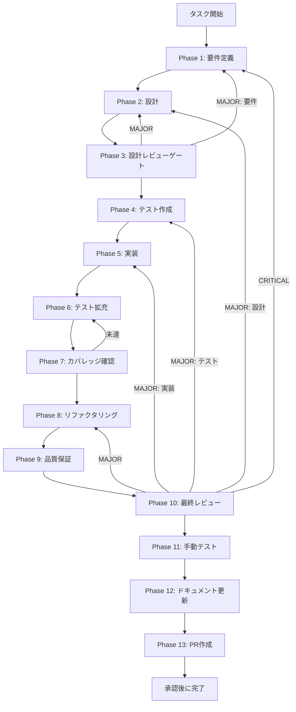

# TASK-SW-STRUCT-001 - タスク実行仕様書

## ユーザーからの元の指示

```
SkillCreatorService.runCreateWorkflow() の出力仕様を修正する。
現在 purpose フィールドにエージェントプロンプト本文が入っており意味的に誤り。
StructurePlanJson インターフェースの意図に合った正しい構造化データを返すよう修正する。
LLM統合（実際のAI生成処理との接続）は別タスクへ分離し、本タスクは出力仕様の修正のみを対象とする。
```

## メタ情報

| 項目         | 内容                                                 |
| ------------ | ---------------------------------------------------- |
| タスクID     | TASK-SW-STRUCT-001                                   |
| タスク名     | struct-001-fix-run-create-workflow-output            |
| 分類         | バグ修正                                             |
| 対象機能     | SkillCreatorService - runCreateWorkflow 出力仕様修正 |
| 優先度       | High                                                 |
| 見積もり規模 | 小規模                                               |
| ステータス   | 完了（Phase 13 blocked）                             |
| 作成日       | 2026-04-15                                           |
| depends_on   | なし                                                 |

---

## タスク概要

### 目的

`SkillCreatorService.runCreateWorkflow()` が返す `StructurePlanJson` の各フィールドに意味的に正しい値を設定する。
現状では `purpose` フィールドにスキル説明文を、そのまま意味的に正しい形で保持するように整理し、
`StructurePlanJson` インターフェースの意図と実装の乖離をなくしている。
また `features` は空配列、`agents` はエージェント名リストとして扱う前提で current facts を固定する。

### 背景

`TASK-SC-IMP-CREATE-WORKFLOW-001` で `runCreateWorkflow` の骨格が実装され、
`createSkill()` -> `runCreateWorkflow()` -> `init_skill.js` -> `generateSkillMd()` の current facts が確立した。
`purpose` は `options.description` を橋渡しし、`agents` はエージェント名リストとして扱う。
LLM 統合は別タスクとして分離し、本タスクでは出力仕様の整合だけを固定する。

### 最終ゴール

- `structurePlan.purpose` に `options.description` を使用する（エージェントプロンプト文字列を除去）
- `structurePlan.agents` にエージェント名文字列のリスト（`["extract-purpose", "plan-structure"]`）を設定する
- `structurePlan.features` は空配列のまま維持する（LLM統合は別タスク）
- `StructurePlanJson` インターフェースの型定義と実装の乖離が解消されている
- 既存の `collaborative` モードテストが全てパスし続ける

### 成果物一覧

| 種別         | 成果物                         | 配置先                                                                       |
| ------------ | ------------------------------ | ---------------------------------------------------------------------------- |
| 機能         | runCreateWorkflow 出力仕様修正 | `apps/desktop/src/main/services/skill/SkillCreatorService.ts`                |
| テスト       | 出力仕様修正のテスト           | `apps/desktop/src/main/services/skill/__tests__/SkillCreatorService.test.ts` |
| ドキュメント | Phase 1-13 仕様・実行成果物    | `outputs/phase-1/ 〜 phase-13/`                                              |

---

## 参照ファイル

- `apps/desktop/src/main/services/skill/SkillCreatorService.ts` - 実装対象（行 630-653）
- `apps/desktop/src/main/services/skill/__tests__/SkillCreatorService.test.ts` - テスト追加対象
- `docs/30-workflows/skill-create-flow-gaps/00-task-spec-design-docs/phase-1-analysis.md` - 問題3の現状分析
- `docs/30-workflows/skill-create-flow-gaps/00-task-spec-design-docs/phase-2-solution.md` - 解決策設計（問題3 解決アプローチA）
- `docs/30-workflows/skill-create-flow-gaps/00-task-spec-design-docs/phase-3-review.md` - タスク粒度確認

---

## 受入条件

| ID   | 条件                                                                                                       |
| ---- | ---------------------------------------------------------------------------------------------------------- |
| AC-1 | `structurePlan.purpose` に `options.description` が設定される（エージェントプロンプト文字列でない）        |
| AC-2 | `structurePlan.agents` に `["extract-purpose", "plan-structure"]` というエージェント名リストが設定される   |
| AC-3 | `structurePlan.features` が空配列で維持されている                                                          |
| AC-4 | `runCreateWorkflow` の内部エラーが発生した場合でも `createSkill()` は成功する（フォールバック：null 返却） |
| AC-5 | `collaborative` モードの既存テストが全てパスし続ける                                                       |

---

## タスク分解サマリー

| ID     | フェーズ | サブタスク名       | 責務                                                                  | 依存 |
| ------ | -------- | ------------------ | --------------------------------------------------------------------- | ---- |
| T-01-1 | Phase 1  | 要件定義           | 問題特定・受入条件策定・現状コード確認                                | -    |
| T-02-1 | Phase 2  | 設計               | runCreateWorkflow 出力仕様修正の詳細設計                              | T-01 |
| T-03-1 | Phase 3  | 設計レビューゲート | 設計の整合性・リスク検証                                              | T-02 |
| T-04-1 | Phase 4  | テスト作成         | TDD Red フェーズ用テストケース作成                                    | T-03 |
| T-05-1 | Phase 5  | 実装               | runCreateWorkflow 出力仕様を修正する実装                              | T-04 |
| T-06-1 | Phase 6  | テスト拡充         | 境界条件・フォールバック回帰の補強                                    | T-05 |
| T-07-1 | Phase 7  | カバレッジ確認     | concern coverage と branch coverage の確認                            | T-06 |
| T-08-1 | Phase 8  | リファクタリング   | 最小複雑性の再調整                                                    | T-07 |
| T-09-1 | Phase 9  | 品質保証           | lint / typecheck / test の品質ゲート確認                              | T-08 |
| T-10-1 | Phase 10 | 最終レビュー       | AC・依存関係・4条件の最終判定                                         | T-09 |
| T-11-1 | Phase 11 | 手動テスト         | create モード実フロー・structurePlan 内容確認                         | T-10 |
| T-12-1 | Phase 12 | ドキュメント更新   | 実装ガイド・system spec・未タスク・skill feedback・準拠チェックの固定 | T-11 |
| T-13-1 | Phase 13 | PR作成             | ユーザー承認後の変更要約と PR 作成                                    | T-12 |

**総サブタスク数**: 13個

---

## 実行フロー図



---

## Phase一覧

| Phase | 名称               | 仕様書                                                       | ステータス |
| ----- | ------------------ | ------------------------------------------------------------ | ---------- |
| 1     | 要件定義           | [phase-1-requirements.md](phase-1-requirements.md)           | completed  |
| 2     | 設計               | [phase-2-design.md](phase-2-design.md)                       | completed  |
| 3     | 設計レビューゲート | [phase-3-design-review.md](phase-3-design-review.md)         | completed  |
| 4     | テスト作成         | [phase-4-test-creation.md](phase-4-test-creation.md)         | completed  |
| 5     | 実装               | [phase-5-implementation.md](phase-5-implementation.md)       | completed  |
| 6     | テスト拡充         | [phase-6-test-expansion.md](phase-6-test-expansion.md)       | completed  |
| 7     | カバレッジ確認     | [phase-7-coverage-check.md](phase-7-coverage-check.md)       | completed  |
| 8     | リファクタリング   | [phase-8-refactoring.md](phase-8-refactoring.md)             | completed  |
| 9     | 品質保証           | [phase-9-quality-assurance.md](phase-9-quality-assurance.md) | completed  |
| 10    | 最終レビューゲート | [phase-10-final-review.md](phase-10-final-review.md)         | completed  |
| 11    | 手動テスト         | [phase-11-manual-test.md](phase-11-manual-test.md)           | completed  |
| 12    | ドキュメント更新   | [phase-12-documentation.md](phase-12-documentation.md)       | completed  |
| 13    | PR作成             | [phase-13-pr-creation.md](phase-13-pr-creation.md)           | blocked    |

---

## テストカバレッジ目標

### ユニットテスト

| 指標              | 最低基準 | 推奨基準 |
| ----------------- | -------- | -------- |
| Line Coverage     | 80%      | 90%      |
| Branch Coverage   | 60%      | 70%      |
| Function Coverage | 80%      | 90%      |

### 結合テスト

| 指標                         | 目標 |
| ---------------------------- | ---- |
| モジュール間インターフェース | 100% |
| 正常系シナリオ               | 100% |
| 異常系シナリオ               | 80%+ |

---

## 依存関係

- **depends_on**: なし（本タスクは独立して実施可能）
- **後続タスク**: current facts では追加の接続タスクはなし（PR は blocked のまま）

---

## Phase完了時の必須アクション

1. **タスク100%実行**: Phase内で指定された全タスクを完全に実行
2. **成果物確認**: 全ての必須成果物が生成されていることを検証
3. **artifacts.json更新**: Phase完了ステータスを更新
4. **完了条件チェック**: 各タスクを完遂した旨を必ず明記

```bash
# Phase完了処理
node .claude/skills/task-specification-creator/scripts/complete-phase.js \
  --workflow docs/30-workflows/p01-par-STRUCT-001 \
  --phase {{N}} \
  --artifacts "outputs/phase-{{N}}/{{FILE}}.md:{{DESCRIPTION}}"
```
