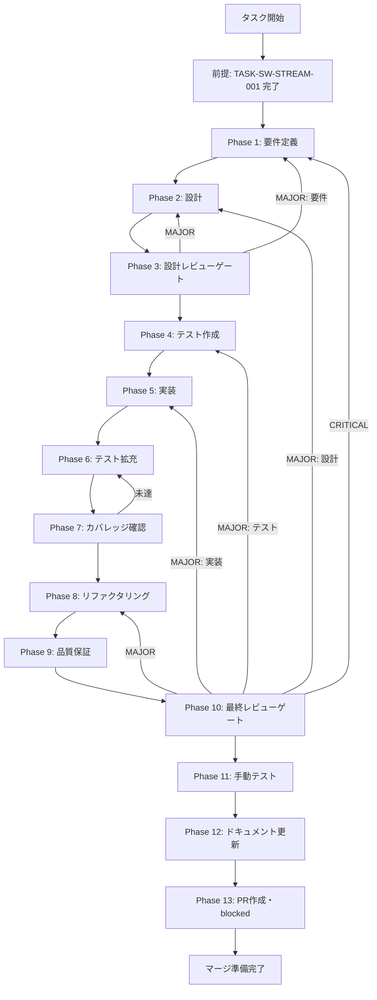

# TASK-SW-STREAM-002 - タスク実行仕様書

## ユーザーからの元の指示

```
skillCreatorHandlers.ts の SKILL_CREATOR_CREATE ハンドラーで createSkill() 呼び出しに
コールバックを接続し、sendSkillCreatorProgress() と配線する。
SkillCreateWizard.tsx で streaming.stage/percent/message が GenerateStep に渡されているかの確認も含める。
```

## メタ情報

| 項目         | 内容                                   |
| ------------ | -------------------------------------- |
| タスクID     | TASK-SW-STREAM-002                     |
| タスク名     | skill-creator-handlers-progress-wiring |
| 分類         | バグ修正                               |
| 対象機能     | スキル作成フロー - Streaming進捗送信   |
| 優先度       | 高                                     |
| 見積もり規模 | 小規模                                 |
| ステータス   | 完了                                   |
| 作成日       | 2026-04-15                             |

---

## タスク概要

### 目的

`skillCreatorHandlers.ts` の `SKILL_CREATOR_CREATE` ハンドラーで `createSkill()` 呼び出しに
`onProgress` コールバックを接続し、`sendSkillCreatorProgress(mainWindow, progress)` と配線する。
また `SkillCreateWizard.tsx` で `streaming.stage/percent/message` が `GenerateStep` に渡されているかを確認し、
未接続であれば接続する。

### 背景

TASK-SW-STREAM-001 で `SkillCreatorService.createSkill()` に `onProgress?` コールバック引数が追加された。
しかし `skillCreatorHandlers.ts` の `SKILL_CREATOR_CREATE` ハンドラー（:172-284）では
`skillCreatorService.createSkill(validatedArgs)` を引数1つで呼ぶだけで、
`onProgress` コールバックと `sendSkillCreatorProgress()` が接続されていない。

`sendSkillCreatorProgress()` は `:692` にエクスポートされているが呼び出し元が存在しない状態が続いており、
フロントの `GenerateStep.tsx` のプログレスバーは常に初期状態（`stage: "idle"`）のままである。

また `phase-3-review.md` の確認事項として、`SkillCreateWizard.tsx` で
`streaming.stage/percent/message` が `GenerateStep` に渡されているかの確認が必要とされている。

### 最終ゴール

1. `SKILL_CREATOR_CREATE` ハンドラーで `createSkill()` の第2引数にコールバックが接続され、
   `sendSkillCreatorProgress(mainWindow, progress)` が実際に呼び出される状態
2. `SkillCreateWizard.tsx` で `useStreamingProgress()` の戻り値が `GenerateStep` に正しく渡されている状態
3. スキル生成中に `GenerateStep.tsx` のプログレスバーが実際に更新される状態

### 成果物一覧

| 種別         | 成果物                           | 配置先                                                                                   |
| ------------ | -------------------------------- | ---------------------------------------------------------------------------------------- |
| 機能         | ハンドラーへのコールバック接続   | `apps/desktop/src/main/ipc/skillCreatorHandlers.ts`                                      |
| 機能（確認） | GenerateStep への props 接続確認 | `apps/desktop/src/renderer/components/skill/SkillCreateWizard.tsx`（必要な場合のみ変更） |
| テスト       | ハンドラー統合テスト更新         | `apps/desktop/src/main/ipc/__tests__/skillCreatorIpc.integration.test.ts` など           |
| ドキュメント | 各Phase成果物                    | `outputs/phase-*/`                                                                       |

---

## 参照ファイル

本仕様書のコマンド選定は以下を参照：

- `docs/30-workflows/skill-create-flow-gaps/00-task-spec-design-docs/phase-1-analysis.md` - 現状分析
- `docs/30-workflows/skill-create-flow-gaps/00-task-spec-design-docs/phase-2-solution.md` - 解決策設計
- `docs/30-workflows/skill-create-flow-gaps/00-task-spec-design-docs/phase-3-review.md` - 設計レビュー（3.5節参照）
- `docs/30-workflows/completed-tasks/p01-par-STREAM-001/` - 前提タスク仕様書（完了済み）
- `apps/desktop/src/main/ipc/skillCreatorHandlers.ts` - 修正対象ファイル
- `apps/desktop/src/renderer/components/skill/SkillCreateWizard.tsx` - 確認対象ファイル（必要時のみ変更）
- `apps/desktop/src/renderer/hooks/useStreamingProgress.ts` - フロント側接続確認用
- `apps/desktop/src/renderer/components/skill/wizard/GenerateStep.tsx` - props 確認用

---

## タスク分解サマリー

| ID     | フェーズ | サブタスク名       | 責務                                                            | 依存 |
| ------ | -------- | ------------------ | --------------------------------------------------------------- | ---- |
| T-01-1 | Phase 1  | 要件定義           | 修正対象コードの現状確認・SkillCreateWizard.tsx の props 確認   | -    |
| T-02-1 | Phase 2  | 設計               | コールバック接続設計・GenerateStep props 接続設計               | T-01 |
| T-03-1 | Phase 3  | 設計レビューゲート | 設計の整合性・AC充足・TASK-SW-STREAM-001 依存確認               | T-02 |
| T-04-1 | Phase 4  | テスト作成         | ハンドラー統合テストの TDD テスト作成（Red）                    | T-03 |
| T-05-1 | Phase 5  | 実装               | コールバック接続・SkillCreateWizard.tsx の props 修正（必要時） | T-04 |
| T-06-1 | Phase 6  | テスト拡充         | エッジケース・sendSkillCreatorProgress 呼び出し確認テスト追加   | T-05 |
| T-07-1 | Phase 7  | カバレッジ確認     | テストカバレッジの確認・未達時はテスト追加                      | T-06 |
| T-08-1 | Phase 8  | リファクタリング   | コード品質改善                                                  | T-07 |
| T-09-1 | Phase 9  | 品質保証           | lint・typecheck・全テスト通過確認                               | T-08 |
| T-10-1 | Phase 10 | 最終レビューゲート | エンドツーエンドの進捗通知フロー全体の最終確認                  | T-09 |
| T-11-1 | Phase 11 | 手動テスト         | 実際のスキル生成時にプログレスバーが更新されることの確認        | T-10 |
| T-12-1 | Phase 12 | ドキュメント更新   | 実装ガイド・システム仕様更新・未タスク検出                      | T-11 |
| T-13-1 | Phase 13 | PR作成             | PR 情報整理（blocked）                                          | T-12 |

**総サブタスク数**: 13個

---

## 実行フロー図



---

## Phase一覧

| Phase | 名称               | 仕様書                                                       | ステータス                  |
| ----- | ------------------ | ------------------------------------------------------------ | --------------------------- |
| 1     | 要件定義           | [phase-1-requirements.md](phase-1-requirements.md)           | 完了                        |
| 2     | 設計               | [phase-2-design.md](phase-2-design.md)                       | 完了                        |
| 3     | 設計レビューゲート | [phase-3-design-review.md](phase-3-design-review.md)         | 完了                        |
| 4     | テスト作成         | [phase-4-test-creation.md](phase-4-test-creation.md)         | 完了                        |
| 5     | 実装               | [phase-5-implementation.md](phase-5-implementation.md)       | 完了                        |
| 6     | テスト拡充         | [phase-6-test-expansion.md](phase-6-test-expansion.md)       | 完了                        |
| 7     | カバレッジ確認     | [phase-7-coverage-check.md](phase-7-coverage-check.md)       | 完了                        |
| 8     | リファクタリング   | [phase-8-refactoring.md](phase-8-refactoring.md)             | 完了                        |
| 9     | 品質保証           | [phase-9-quality-assurance.md](phase-9-quality-assurance.md) | 完了                        |
| 10    | 最終レビューゲート | [phase-10-final-review.md](phase-10-final-review.md)         | 完了                        |
| 11    | 手動テスト検証     | [phase-11-manual-test.md](phase-11-manual-test.md)           | 完了                        |
| 12    | ドキュメント更新   | [phase-12-documentation.md](phase-12-documentation.md)       | 完了                        |
| 13    | PR作成             | [phase-13-pr-creation.md](phase-13-pr-creation.md)           | ユーザー指示待ち（blocked） |

---

## テストカバレッジ目標

### ユニットテスト

| 指標              | 最低基準 | 推奨基準 |
| ----------------- | -------- | -------- |
| Line Coverage     | 80%      | 90%      |
| Branch Coverage   | 60%      | 70%      |
| Function Coverage | 80%      | 90%      |

### 結合テスト

| 指標                         | 目標 |
| ---------------------------- | ---- |
| APIエンドポイント            | 100% |
| モジュール間インターフェース | 100% |
| 正常系シナリオ               | 100% |
| 異常系シナリオ               | 80%+ |
| 外部連携ポイント             | 100% |

---

## 統合テスト連携（Phase 1〜11で必須）

各Phaseで以下の統合テスト連携アクションを実施すること:

| Phase | 統合テスト連携アクション                                                             |
| ----- | ------------------------------------------------------------------------------------ |
| 1     | IPC ハンドラーの接続要件（sendSkillCreatorProgress・GenerateStep props）を要件に明記 |
| 2     | コールバック配線の4層整合（定数・ホワイトリスト・ハンドラー・Preload）を設計に反映   |
| 3     | 統合テスト観点のレビューゲートを実施                                                 |
| 4     | ハンドラー統合テストシナリオを全カテゴリで作成                                       |
| 5     | コールバック接続の実装とテスト支援コード整備                                         |
| 6     | 統合テストの拡充（全カテゴリのカバレッジ向上）                                       |
| 7     | 統合テストの再実行とゲート判定                                                       |
| 8     | リファクタ後の統合テスト継続成功を確認                                               |
| 9     | 品質保証で統合テスト結果を確認                                                       |
| 10    | 最終レビューで統合テスト結果を確認（エンドツーエンドの進捗通知フロー確認）           |
| 11    | 手動統合テスト（実際のスキル生成でプログレスバーが更新されることの確認）             |

---

## Phase完了時の必須アクション

**各Phase完了時に以下を必ず実行すること:**

1. **タスク100%実行**: Phase内で指定された全タスクを完全に実行
2. **成果物確認**: 全ての必須成果物が生成されていることを検証
3. **実行記録**: 実行タスクの結果を記録
4. **artifacts.json更新**: Phase完了ステータスを更新
5. **Phase末端の実行確認**: 各タスクを100%実行し、各タスクを完遂した旨を必ず明記

```bash
# Phase完了処理
node .claude/skills/task-specification-creator/scripts/complete-phase.js \
  --workflow docs/30-workflows/skill-create-flow-gaps/TASK-SW-STREAM-002 --phase {{N}} \
  --artifacts "outputs/phase-{{N}}/{{FILE}}.md:{{DESCRIPTION}}"
```

---

## 成果物

| Phase | 主要成果物                                                                                                                                                                                                                                                                              |
| ----- | --------------------------------------------------------------------------------------------------------------------------------------------------------------------------------------------------------------------------------------------------------------------------------------- |
| 1     | outputs/phase-1/requirements-definition.md, outputs/phase-1/acceptance-criteria.md                                                                                                                                                                                                      |
| 2     | outputs/phase-2/design.md                                                                                                                                                                                                                                                               |
| 3     | outputs/phase-3/gate-decision.md                                                                                                                                                                                                                                                        |
| 4     | apps/desktop/src/main/ipc/**tests**/skillCreatorHandlers.progress.test.ts                                                                                                                                                                                                               |
| 5     | apps/desktop/src/main/ipc/skillCreatorHandlers.ts, apps/desktop/src/renderer/components/skill/SkillCreateWizard.tsx（必要な場合）                                                                                                                                                       |
| 6     | apps/desktop/src/main/ipc/**tests**/skillCreatorHandlers.progress.test.ts                                                                                                                                                                                                               |
| 7     | outputs/phase-7/coverage-report.md                                                                                                                                                                                                                                                      |
| 8     | outputs/phase-8/refactoring-log.md                                                                                                                                                                                                                                                      |
| 9     | outputs/phase-9/quality-report.md                                                                                                                                                                                                                                                       |
| 10    | outputs/phase-10/final-review-result.md                                                                                                                                                                                                                                                 |
| 11    | outputs/phase-11/manual-test-result.md                                                                                                                                                                                                                                                  |
| 12    | outputs/phase-12/implementation-guide.md, outputs/phase-12/system-spec-update-summary.md, outputs/phase-12/documentation-changelog.md, outputs/phase-12/unassigned-task-detection.md, outputs/phase-12/skill-feedback-report.md, outputs/phase-12/phase12-task-spec-compliance-check.md |
| 13    | outputs/phase-13/pr-info.md                                                                                                                                                                                                                                                             |
