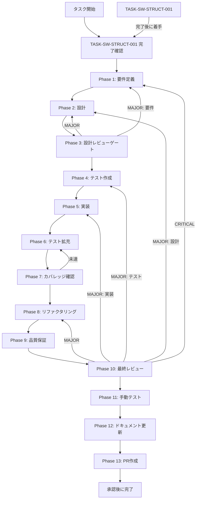

# TASK-SW-STRUCT-002 - タスク実行仕様書

## メタ情報

```yaml
issue_number: 2217
```

## ユーザーからの元の指示

```
SkillCreatorService.createSkill() の :126 の `void structurePlan` を削除し、
TASK-SW-STRUCT-001 で修正した structurePlan を generate_skill_md.js に渡す接続配線を行う。
LLM統合（実際のAI生成処理との接続）は別タスクへ分離し、本タスクは接続配線のみを対象とする。
```

## メタ情報

| 項目         | 内容                                                               |
| ------------ | ------------------------------------------------------------------ |
| タスクID     | TASK-SW-STRUCT-002                                                 |
| タスク名     | struct-002-connect-structure-plan-to-skill-md                      |
| 分類         | バグ修正                                                           |
| 対象機能     | SkillCreatorService - structurePlan を generate_skill_md.js に接続 |
| 優先度       | High                                                               |
| 見積もり規模 | 小規模                                                             |
| ステータス   | 未実施                                                             |
| 作成日       | 2026-04-15                                                         |
| depends_on   | **TASK-SW-STRUCT-001**（必須）                                     |

---

## タスク概要

### 目的

`SkillCreatorService.createSkill()` の `create` モードにおける `structurePlan` の接続状態を確認し、
TASK-SW-STRUCT-001 で整う `structurePlan` が `generate_skill_md.js` 呼び出しに正しく流れることを検証する。
LLM 統合（実際のAI生成処理との接続）は別タスクへ分離し、
本タスクは `create` / `collaborative` / `orchestrate` の分岐とフォールバックが崩れていないかを扱う。

### 背景

**【2026-04-16 upstream マージによる状態変化】**

当初 `SkillCreatorService.createSkill()` の行 105-126 で `void structurePlan` による
プレースホルダーが存在していたが、`origin/main` のマージ（コミット `26891ab1c`）により
すでに以下の実装が取り込まれた:

```typescript
// 現状のコード（実装済み）
if (structurePlan !== null) {
  await this.generateSkillMd(skillDir, structurePlan, operationSignal);
} else if (options.mode === "create") {
  this.logger.warn("structurePlan is null, falling back to ensureSkillMdExists", ...);
  await this.ensureSkillMdExists(skillDir, options.name, options.description);
} else {
  await this.ensureSkillMdExists(skillDir, options.name, options.description);
}
```

つまり AC-1（`void structurePlan` 削除）・AC-2（create モードで generateSkillMd 呼び出し）・
AC-3（create 以外はフォールバック）・AC-4（null 時フォールバック）は **コードレベルでは実装済み**。

ただし current branch では `runCreateWorkflow()` が返す `structurePlan.purpose` は
`options.description` ベースに更新済みであり、TASK-SW-STRUCT-001 の前提を満たしている。

本タスクでは、この current state を Phase 1 で固定し、以降の Phase では
差分の有無に応じて再実装か回帰確認かを選べるようにする。

### 最終ゴール

**【upstream 反映済みの current state を前提に進める】**

- 行 126 の `void structurePlan` と `create` モードの `generateSkillMd` 接続が current branch でも upstream と整合していることを確認する
- `create` 以外のモードは `ensureSkillMdExists` フォールバックを維持する
- `collaborative` モードの既存テストが全てパスし続けること（AC-5）を担保する
- `runCreateWorkflow()` の `purpose` が TASK-SW-STRUCT-001 完了後に正しい内容へ変わることを Phase 11 で検証する

### 成果物一覧

| 種別         | 成果物                       | 配置先                                                                       |
| ------------ | ---------------------------- | ---------------------------------------------------------------------------- |
| 機能         | structurePlan 接続状態の確認 | `apps/desktop/src/main/services/skill/SkillCreatorService.ts`                |
| テスト       | 接続状態の回帰確認           | `apps/desktop/src/main/services/skill/__tests__/SkillCreatorService.test.ts` |
| ドキュメント | Phase 1-13 仕様・実行成果物  | `outputs/phase-1/ 〜 phase-13/`                                              |

---

## 参照ファイル

- `apps/desktop/src/main/services/skill/SkillCreatorService.ts` - 実装対象（行 105-194）
- `apps/desktop/src/main/services/skill/__tests__/SkillCreatorService.test.ts` - テスト追加対象
- `docs/30-workflows/skill-create-flow-gaps/p01-par-STRUCT-001/` - 前提タスク
- `docs/30-workflows/skill-create-flow-gaps/00-task-spec-design-docs/phase-2-solution.md` - 解決アプローチB
- `docs/30-workflows/skill-create-flow-gaps/00-task-spec-design-docs/phase-3-review.md` - タスク粒度確認

---

## 受入条件

| ID   | 条件                                                                                                       |
| ---- | ---------------------------------------------------------------------------------------------------------- |
| AC-1 | 行 126 の `void structurePlan` が削除されている                                                            |
| AC-2 | `create` モード時は `structurePlan` の内容を `plan` オブジェクトに反映して `generate_skill_md.js` に渡す   |
| AC-3 | `create` 以外のモードは既存の固定値 `plan` でフォールバックする                                            |
| AC-4 | `structurePlan` が `null` の場合（`runCreateWorkflow` フォールバック時）もフォールバック `plan` を使用する |
| AC-5 | `collaborative` モードの既存テストが全てパスし続ける                                                       |

---

## タスク分解サマリー

| ID     | フェーズ | サブタスク名       | 責務                                            | 依存 |
| ------ | -------- | ------------------ | ----------------------------------------------- | ---- |
| T-01-1 | Phase 1  | 要件定義           | 問題特定・受入条件策定・現状コード確認          | -    |
| T-02-1 | Phase 2  | 設計               | structurePlan 接続配線の詳細設計・plan 分岐設計 | T-01 |
| T-03-1 | Phase 3  | 設計レビューゲート | 設計の整合性・リスク検証                        | T-02 |
| T-04-1 | Phase 4  | テスト作成         | TDD Red フェーズ用テストケース作成              | T-03 |
| T-05-1 | Phase 5  | 実装/回帰確認      | current state の差分実装・回帰確認              | T-04 |
| T-06-1 | Phase 6  | テスト拡充         | 境界条件・null フォールバック回帰の補強         | T-05 |
| T-07-1 | Phase 7  | カバレッジ確認     | concern coverage と branch coverage の確認      | T-06 |
| T-08-1 | Phase 8  | リファクタリング   | 最小複雑性の再調整                              | T-07 |
| T-09-1 | Phase 9  | 品質保証           | lint / typecheck / test の品質ゲート確認        | T-08 |
| T-10-1 | Phase 10 | 最終レビュー       | AC・依存関係・4条件の最終判定                   | T-09 |
| T-11-1 | Phase 11 | 手動テスト         | create モード実フロー・SKILL.md 生成内容確認    | T-10 |
| T-12-1 | Phase 12 | ドキュメント更新   | 実装ガイド・system spec・未タスクの固定         | T-11 |
| T-13-1 | Phase 13 | PR作成             | ユーザー承認後の変更要約と PR 作成              | T-12 |

**総サブタスク数**: 13個

---

## 実行フロー図



---

## Phase一覧

| Phase | 名称               | 仕様書                                                       | ステータス |
| ----- | ------------------ | ------------------------------------------------------------ | ---------- |
| 1     | 要件定義           | [phase-1-requirements.md](phase-1-requirements.md)           | 未実施     |
| 2     | 設計               | [phase-2-design.md](phase-2-design.md)                       | 未実施     |
| 3     | 設計レビューゲート | [phase-3-design-review.md](phase-3-design-review.md)         | 未実施     |
| 4     | テスト作成         | [phase-4-test-creation.md](phase-4-test-creation.md)         | 未実施     |
| 5     | 実装               | [phase-5-implementation.md](phase-5-implementation.md)       | 未実施     |
| 6     | テスト拡充         | [phase-6-test-expansion.md](phase-6-test-expansion.md)       | 未実施     |
| 7     | カバレッジ確認     | [phase-7-coverage-check.md](phase-7-coverage-check.md)       | 未実施     |
| 8     | リファクタリング   | [phase-8-refactoring.md](phase-8-refactoring.md)             | 未実施     |
| 9     | 品質保証           | [phase-9-quality-assurance.md](phase-9-quality-assurance.md) | 未実施     |
| 10    | 最終レビューゲート | [phase-10-final-review.md](phase-10-final-review.md)         | 未実施     |
| 11    | 手動テスト         | [phase-11-manual-test.md](phase-11-manual-test.md)           | 未実施     |
| 12    | ドキュメント更新   | [phase-12-documentation.md](phase-12-documentation.md)       | 未実施     |
| 13    | PR作成             | [phase-13-pr-creation.md](phase-13-pr-creation.md)           | blocked    |

---

## テストカバレッジ目標

### ユニットテスト

| 指標              | 最低基準 | 推奨基準 |
| ----------------- | -------- | -------- |
| Line Coverage     | 80%      | 90%      |
| Branch Coverage   | 60%      | 70%      |
| Function Coverage | 80%      | 90%      |

---

## 依存関係

- **depends_on**: TASK-SW-STRUCT-001（必須）
  - TASK-SW-STRUCT-001 で `runCreateWorkflow` が正しい `StructurePlanJson` を返すことが
    本タスクの接続配線の前提条件となる
  - TASK-SW-STRUCT-001 完了前に Phase 5（実装/回帰確認）へ進まないこと
  - Phase 1〜4（要件・設計・レビュー・テスト設計）は TASK-SW-STRUCT-001 完了前でも先行実施可能

---

## Phase完了時の必須アクション

1. **タスク100%実行**: Phase内で指定された全タスクを完全に実行
2. **成果物確認**: 全ての必須成果物が生成されていることを検証
3. **artifacts.json更新**: Phase完了ステータスを更新
4. **完了条件チェック**: 各タスクを完遂した旨を必ず明記

```bash
# Phase完了処理
node .claude/skills/task-specification-creator/scripts/complete-phase.js \
  --workflow docs/30-workflows/p02-par-STRUCT-002 \
  --phase {{N}} \
  --artifacts "outputs/phase-{{N}}/{{FILE}}.md:{{DESCRIPTION}}"
```
