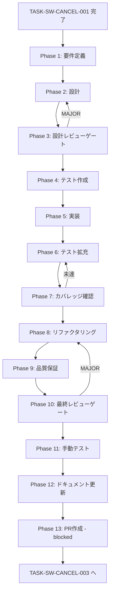

# TASK-SW-CANCEL-002: skill-creator-cancel-preload-api

## メタ情報

| 項目       | 内容                                     |
| ---------- | ---------------------------------------- |
| タスクID   | TASK-SW-CANCEL-002                       |
| タスク名   | skill-creator-cancel-preload-api         |
| 種別       | バグ修正                                 |
| 優先度     | High                                     |
| スケール   | 小規模                                   |
| 依存タスク | TASK-SW-CANCEL-001                       |
| 後続タスク | TASK-SW-CANCEL-003                       |
| 作成日     | 2026-04-15                               |
| ステータス | completed（current worktree で実装済み） |

## 概要

`apps/desktop/src/preload/skill-creator-api.ts` の `SkillCreatorAPI` インターフェースに `cancelGeneration: () => Promise<IpcResult<void>>` を追加し、`safeInvoke(IPC_CHANNELS.SKILL_CREATOR_CANCEL)` で実装する。さらに `apps/desktop/src/preload/channels.ts` の `ALLOWED_INVOKE_CHANNELS` に `SKILL_CREATOR_CANCEL` を追加する。これにより IPC 4層のうち層2（ホワイトリスト）と層4（Preload API）が完成する。

> **追記（2026-04-16）**: current worktree ではこの要件は実装済み。以下は当時のタスク仕様を記録として残している。

## 背景

TASK-SW-CANCEL-001 で `SKILL_CREATOR_CANCEL: "skill-creator:cancel"` チャンネル定数が shared パッケージに追加された。しかし Preload 層に `cancelGeneration` メソッドが存在しないため、Renderer から `window.skillCreatorAPI.cancelGeneration()` を呼び出すことができない。本タスクで Preload 層の API とホワイトリストを追加することで、Renderer → Preload → Main の invoke 経路が確立できる状態になる。

## 対象ファイル

| ファイル                                        | 操作 | 説明                                              |
| ----------------------------------------------- | ---- | ------------------------------------------------- |
| `apps/desktop/src/preload/skill-creator-api.ts` | 修正 | `cancelGeneration` インターフェース定義・実装追加 |
| `apps/desktop/src/preload/channels.ts`          | 修正 | `ALLOWED_INVOKE_CHANNELS` への登録                |

## 受け入れ基準

| ID   | 受け入れ基準                                                                                             |
| ---- | -------------------------------------------------------------------------------------------------------- |
| AC-1 | `SkillCreatorAPI` インターフェースに `cancelGeneration: () => Promise<IpcResult<void>>` が定義されている |
| AC-2 | 実装が `safeInvoke(IPC_CHANNELS.SKILL_CREATOR_CANCEL)` を呼び出している                                  |
| AC-3 | `ALLOWED_INVOKE_CHANNELS` に `IPC_CHANNELS.SKILL_CREATOR_CANCEL` が含まれている                          |
| AC-4 | `pnpm typecheck` が PASS する（型エラーなし）                                                            |

## スコープ

### 含む

- `SkillCreatorAPI` インターフェースへの `cancelGeneration` 追加
- `safeInvoke` による実装
- `ALLOWED_INVOKE_CHANNELS` への `SKILL_CREATOR_CANCEL` 追加

### 含まない

- Main プロセスのハンドラー追加（TASK-SW-CANCEL-003）
- `useCancelGeneration.ts` の修正（TASK-SW-CANCEL-004）

## Phaseリスト

| Phase | 名前         | 概要                                                                   |
| ----- | ------------ | ---------------------------------------------------------------------- |
| 1     | 要件定義     | 対象ファイルの現状確認・safeInvoke パターン確認・AC固定                |
| 2     | 設計         | インターフェース設計・実装設計・ホワイトリスト設計                     |
| 3     | 設計レビュー | 設計の矛盾・漏れチェック・IPC 4層整合性確認                            |
| 4     | テスト作成   | TDD Red段階: cancelGeneration API・ホワイトリストテスト                |
| 5     | 実装         | skill-creator-api.ts 修正・channels.ts 修正                            |
| 6     | テスト拡充   | エラーハンドリング・型安全性テスト追加                                 |
| 7     | カバレッジ   | カバレッジ計測・未到達分析                                             |
| 8     | リファクタ   | コード品質改善                                                         |
| 9     | 品質保証     | 静的解析・リスク評価                                                   |
| 10    | 最終レビュー | Phase 1-9 の成果物統合レビュー                                         |
| 11    | 手動テスト   | ビルド確認・型チェック・DevTools での動作確認                          |
| 12    | ドキュメント | 実装ガイド・仕様更新・更新履歴・未タスク・フィードバック・準拠チェック |
| 13    | PR作成       | blocked（本タスクでは実行しない）                                      |

## タスク分解サマリー

| ID     | フェーズ | サブタスク名              | 責務                                              | 依存   |
| ------ | -------- | ------------------------- | ------------------------------------------------- | ------ |
| T-01-1 | Phase 1  | 対象ファイル現状確認      | skill-creator-api.ts・channels.ts 構造確認        | -      |
| T-01-2 | Phase 1  | safeInvoke パターン確認   | 既存の safeInvoke 使用例を確認                    | -      |
| T-02-1 | Phase 2  | インターフェース設計      | cancelGeneration の型定義設計                     | T-01   |
| T-02-2 | Phase 2  | ホワイトリスト設計        | ALLOWED_INVOKE_CHANNELS への追加設計              | T-01   |
| T-03-1 | Phase 3  | 設計レビュー              | IPC 4層整合性・型安全性チェック                   | T-02   |
| T-04-1 | Phase 4  | テスト作成                | cancelGeneration API・ホワイトリストテスト（RED） | T-03   |
| T-05-1 | Phase 5  | skill-creator-api.ts 修正 | cancelGeneration 追加                             | T-04   |
| T-05-2 | Phase 5  | channels.ts 修正          | ALLOWED_INVOKE_CHANNELS 更新                      | T-05-1 |
| T-06-1 | Phase 6  | テスト拡充                | エラーハンドリング・型安全性テスト追加            | T-05   |
| T-07-1 | Phase 7  | カバレッジ確認            | カバレッジ計測・ゲート判定                        | T-06   |
| T-08-1 | Phase 8  | リファクタリング          | コード品質改善                                    | T-07   |
| T-09-1 | Phase 9  | 品質保証                  | 静的解析・リスク評価                              | T-08   |
| T-10-1 | Phase 10 | 最終レビュー              | Phase 1-9 成果物統合レビュー                      | T-09   |
| T-11-1 | Phase 11 | 手動テスト                | ビルド・型チェック・DevTools 確認                 | T-10   |
| T-12-1 | Phase 12 | ドキュメント更新          | 実装ガイド・仕様更新                              | T-11   |
| T-13-1 | Phase 13 | PR作成                    | blocked                                           | T-12   |

**総サブタスク数**: 16個

## 実行フロー図

## Phase一覧

| Phase | 名称               | 仕様書                                                       | ステータス |
| ----- | ------------------ | ------------------------------------------------------------ | ---------- |
| 1     | 要件定義           | [phase-1-requirements.md](phase-1-requirements.md)           | pending    |
| 2     | 設計               | [phase-2-design.md](phase-2-design.md)                       | pending    |
| 3     | 設計レビューゲート | [phase-3-design-review.md](phase-3-design-review.md)         | pending    |
| 4     | テスト作成         | [phase-4-test-creation.md](phase-4-test-creation.md)         | pending    |
| 5     | 実装               | [phase-5-implementation.md](phase-5-implementation.md)       | pending    |
| 6     | テスト拡充         | [phase-6-test-expansion.md](phase-6-test-expansion.md)       | pending    |
| 7     | カバレッジ確認     | [phase-7-coverage-check.md](phase-7-coverage-check.md)       | pending    |
| 8     | リファクタリング   | [phase-8-refactoring.md](phase-8-refactoring.md)             | pending    |
| 9     | 品質保証           | [phase-9-quality-assurance.md](phase-9-quality-assurance.md) | pending    |
| 10    | 最終レビューゲート | [phase-10-final-review.md](phase-10-final-review.md)         | pending    |
| 11    | 手動テスト         | [phase-11-manual-test.md](phase-11-manual-test.md)           | pending    |
| 12    | ドキュメント更新   | [phase-12-documentation.md](phase-12-documentation.md)       | pending    |
| 13    | PR作成             | [phase-13-pr-creation.md](phase-13-pr-creation.md)           | blocked    |

## テストカバレッジ目標

| 指標              | 最低基準 | 推奨基準 |
| ----------------- | -------- | -------- |
| Line Coverage     | 80%      | 90%      |
| Branch Coverage   | 60%      | 70%      |
| Function Coverage | 80%      | 90%      |

## IPC 4層完全接続における本タスクの役割

| 層  | 担当                               | タスク             | 本タスク                                 |
| --- | ---------------------------------- | ------------------ | ---------------------------------------- |
| 1   | 定数定義（shared channels.ts）     | TASK-SW-CANCEL-001 | 実装済み（ワークツリー変更・未コミット） |
| 2   | ホワイトリスト（preload channels） | TASK-SW-CANCEL-002 | **本タスク**                             |
| 3   | ハンドラー登録（main ipcMain）     | TASK-SW-CANCEL-003 | -                                        |
| 4   | Preload API（contextBridge）       | TASK-SW-CANCEL-002 | **本タスク**                             |
| 5   | Renderer 呼び出し（フック修正）    | TASK-SW-CANCEL-004 | -                                        |

## 関連

- 前提タスク: `docs/30-workflows/completed-tasks/p01-seq-CANCEL-001/index.md`
- 後続タスク: `docs/30-workflows/skill-create-flow-gaps/p03-seq-CANCEL-003/index.md`
- 設計根拠: `docs/30-workflows/skill-create-flow-gaps/00-task-spec-design-docs/phase-2-solution.md`（問題2 解決策B）
- 設計レビュー: `docs/30-workflows/skill-create-flow-gaps/00-task-spec-design-docs/phase-3-review.md`（3.4節）
