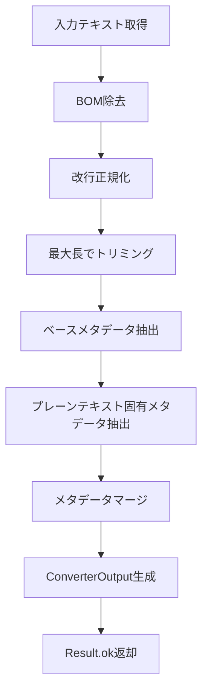

# PlainTextConverter 設計書

## メタ情報

| 項目           | 内容                         |
| -------------- | ---------------------------- |
| タスクID       | QUALITY-02 / T-01-1          |
| ドキュメント名 | PlainTextConverterクラス設計 |
| 作成日         | 2025-12-25                   |
| ステータス     | 完了                         |
| Phase          | Phase 1: 設計                |
| 参照要件       | task-step00-requirements.md  |

---

## 1. 設計概要

### 1.1 設計パターン

**Template Method パターン**

```
BaseConverter (抽象クラス)
    └── PlainTextConverter (具象クラス)
```

BaseConverterが変換フローのテンプレートを提供し、PlainTextConverterがdoConvert()メソッドで具体的な変換処理を実装する。

### 1.2 クラス責務

**単一責務**: プレーンテキストファイルの変換処理のみを担当

| 責務           | 説明                         |
| -------------- | ---------------------------- |
| BOM除去        | UTF-8/UTF-16 BOMを検出・除去 |
| 改行正規化     | CRLF/CRをLFに統一            |
| メタデータ抽出 | 行数・単語数・文字数を計算   |

---

## 2. クラス設計

### 2.1 クラス図

```
┌─────────────────────────────────────────────────────────────┐
│ BaseConverter (abstract)                                     │
├─────────────────────────────────────────────────────────────┤
│ + id: string                                                 │
│ + name: string                                               │
│ + supportedMimeTypes: readonly string[]                      │
│ + priority: number                                           │
├─────────────────────────────────────────────────────────────┤
│ + convert(input, options): Promise<Result<ConverterOutput>>  │
│ + canConvert(input): boolean                                 │
│ + estimateProcessingTime(input): number                      │
│ # doConvert(input, options): Promise<Result<ConverterOutput>>│
│ # getTextContent(input): string                              │
│ # trimContent(content, maxLength): string                    │
└───────────────────────────────────────────────────┬─────────┘
                                                    │ extends
┌───────────────────────────────────────────────────▼─────────┐
│ PlainTextConverter                                           │
├─────────────────────────────────────────────────────────────┤
│ + id = "plain-text-converter"                                │
│ + name = "Plain Text Converter"                              │
│ + supportedMimeTypes = ["text/plain"]                        │
│ + priority = 0                                               │
├─────────────────────────────────────────────────────────────┤
│ # doConvert(input, options): Promise<Result<ConverterOutput>>│
│ - removeBOM(text: string): string                            │
│ - normalizeLineEndings(text: string): string                 │
│ - extractPlainTextMetadata(text: string): PlainTextMetadata  │
│ # getDescription(): string                                   │
└─────────────────────────────────────────────────────────────┘
```

### 2.2 プロパティ定義

```typescript
export class PlainTextConverter extends BaseConverter {
  /**
   * コンバーターID
   * @description レジストリ内で一意の識別子
   */
  readonly id = "plain-text-converter";

  /**
   * コンバーター表示名
   */
  readonly name = "Plain Text Converter";

  /**
   * サポートするMIMEタイプ
   */
  readonly supportedMimeTypes = ["text/plain"] as const;

  /**
   * 優先度（フォールバック用途のため最低）
   * @description 他のコンバーターで変換できない場合に使用
   */
  readonly priority = 0;
}
```

---

## 3. メソッド設計

### 3.1 doConvert (protected, async)

**シグネチャ**:

```typescript
protected async doConvert(
  input: ConverterInput,
  options: ConverterOptions
): Promise<Result<ConverterOutput, RAGError>>
```

**責務**: メイン変換処理のオーケストレーション

**処理フロー**:



**擬似コード**:

```typescript
protected async doConvert(
  input: ConverterInput,
  options: ConverterOptions
): Promise<Result<ConverterOutput, RAGError>> {
  try {
    // 1. テキスト取得
    let text = this.getTextContent(input);

    // 2. BOM除去
    text = this.removeBOM(text);

    // 3. 改行正規化
    text = this.normalizeLineEndings(text);

    // 4. 最大長でトリミング
    text = this.trimContent(text, options.maxContentLength);

    // 5. ベースメタデータ抽出
    const baseMetadata = MetadataExtractor.extractFromText(text, options);

    // 6. プレーンテキスト固有メタデータ抽出
    const plainTextMetadata = this.extractPlainTextMetadata(text);

    // 7. メタデータマージ
    const extractedMetadata = {
      ...baseMetadata,
      custom: {
        ...baseMetadata.custom,
        ...plainTextMetadata
      }
    };

    // 8. 結果返却
    return ok({
      convertedContent: text,
      extractedMetadata,
      processingTime: 0  // BaseConverterが自動設定
    });
  } catch (error) {
    return err(createRAGError(
      ErrorCodes.CONVERSION_FAILED,
      `Failed to convert plain text: ${error instanceof Error ? error.message : String(error)}`,
      { converterId: this.id, fileId: input.fileId, mimeType: input.mimeType },
      error as Error
    ));
  }
}
```

---

### 3.2 removeBOM (private)

**シグネチャ**:

```typescript
private removeBOM(text: string): string
```

**責務**: BOM（Byte Order Mark）の除去

**実装方針**:

```typescript
/**
 * BOMを除去
 *
 * UTF-8 BOM (U+FEFF) を検出・除去する。
 * 文字列として取得された時点で、UTF-16/32 BOMも
 * U+FEFFとして表現されるため、同じロジックで対応可能。
 *
 * @param text - 入力テキスト
 * @returns BOM除去後のテキスト
 */
private removeBOM(text: string): string {
  // UTF-8 BOM (U+FEFF) の除去
  if (text.charCodeAt(0) === 0xFEFF) {
    return text.substring(1);
  }
  return text;
}
```

**BOM検出ロジック**:
| 条件 | 処理 |
|------|------|
| `text.charCodeAt(0) === 0xFEFF` | 先頭1文字を除去 |
| それ以外 | そのまま返却 |

---

### 3.3 normalizeLineEndings (private)

**シグネチャ**:

```typescript
private normalizeLineEndings(text: string): string
```

**責務**: 改行コードをLF (`\n`) に統一

**実装方針**:

```typescript
/**
 * 改行コードをLFに統一
 *
 * CRLF (Windows) と CR (Classic Mac) を LF (Unix) に変換。
 * 処理順序が重要: CRLF → CR の順で置換しないと、
 * CRLFがLFLFになる可能性がある。
 *
 * @param text - 入力テキスト
 * @returns 正規化後のテキスト
 */
private normalizeLineEndings(text: string): string {
  return text
    .replace(/\r\n/g, '\n')  // CRLF → LF (先に処理)
    .replace(/\r/g, '\n');   // CR → LF
}
```

**処理順序の重要性**:

```
入力: "A\r\nB\rC"
Step 1 (CRLF→LF): "A\nB\rC"
Step 2 (CR→LF):   "A\nB\nC"
```

---

### 3.4 extractPlainTextMetadata (private)

**シグネチャ**:

```typescript
private extractPlainTextMetadata(text: string): PlainTextMetadata
```

**責務**: プレーンテキスト固有のメタデータ抽出

**型定義**:

```typescript
/**
 * プレーンテキスト固有のメタデータ
 *
 * ExtractedMetadata.customに格納される。
 */
interface PlainTextMetadata {
  /** 処理前の元の改行タイプ */
  originalLineEnding: "LF" | "CRLF" | "CR" | "MIXED" | "NONE";
  /** BOMが存在したか */
  hadBOM: boolean;
}
```

**実装方針**:

```typescript
/**
 * プレーンテキスト固有のメタデータを抽出
 *
 * @param text - 正規化後のテキスト
 * @returns プレーンテキスト固有のメタデータ
 */
private extractPlainTextMetadata(text: string): PlainTextMetadata {
  return {
    originalLineEnding: this.detectOriginalLineEnding(originalText),
    hadBOM: this.hadBOM
  };
}
```

**注記**: 元テキストの改行タイプやBOM有無を記録するには、変換前の状態を保持する必要がある。実装の簡略化のため、Phase 1では基本的なメタデータのみを返し、拡張は将来検討とする。

**簡略化版実装**:

```typescript
private extractPlainTextMetadata(_text: string): Record<string, unknown> {
  // Phase 1では基本的なメタデータのみ
  // MetadataExtractor.extractFromText()がlineCount, wordCount, charCountを提供
  return {
    converterType: 'plain-text'
  };
}
```

---

### 3.5 getDescription (protected, override)

**シグネチャ**:

```typescript
protected getDescription(): string
```

**責務**: コンバーターの説明文を返す

**実装**:

```typescript
/**
 * コンバーターの説明を取得
 *
 * @returns 説明文
 */
protected getDescription(): string {
  return "Converts plain text files with BOM removal and line ending normalization";
}
```

---

## 4. 依存関係

### 4.1 インポート

```typescript
// 親クラス
import { BaseConverter } from "../base-converter";

// メタデータ抽出
import { MetadataExtractor } from "../metadata-extractor";

// 型定義
import type {
  ConverterInput,
  ConverterOutput,
  ConverterOptions,
  ExtractedMetadata,
} from "../types";

// Result型とエラー
import type { Result, RAGError } from "../../../types/rag";
import { ok, err, createRAGError, ErrorCodes } from "../../../types/rag";
```

### 4.2 依存関係図

```
PlainTextConverter
    │
    ├── BaseConverter (継承)
    │       └── types.ts (ConverterInput, ConverterOutput, etc.)
    │
    ├── MetadataExtractor (使用)
    │       └── types.ts (ExtractedMetadata)
    │
    └── types/rag (使用)
            ├── result.ts (Result, ok, err)
            └── errors.ts (RAGError, createRAGError, ErrorCodes)
```

---

## 5. エラーハンドリング設計

### 5.1 エラーパターン

| エラー種別           | 発生条件          | ErrorCode         | 対応                |
| -------------------- | ----------------- | ----------------- | ------------------- |
| 変換失敗             | doConvert内の例外 | CONVERSION_FAILED | try-catchでラップ   |
| バリデーションエラー | 入力が不正        | VALIDATION_ERROR  | BaseConverterが処理 |

### 5.2 エラー生成パターン

```typescript
return err(
  createRAGError(
    ErrorCodes.CONVERSION_FAILED,
    `Failed to convert plain text: ${errorMessage}`,
    {
      converterId: this.id,
      fileId: input.fileId,
      mimeType: input.mimeType,
    },
    originalError,
  ),
);
```

### 5.3 例外をスローしない原則

- すべてのエラーはResult型でラップして返す
- 例外はtry-catchでキャッチし、Result.errに変換
- 呼び出し元はResult.successで成功/失敗を判定

---

## 6. パフォーマンス設計

### 6.1 時間計算量

| 操作           | 計算量 | 備考                    |
| -------------- | ------ | ----------------------- |
| BOM除去        | O(1)   | charCodeAt(0)の比較のみ |
| 改行正規化     | O(n)   | 全文字をスキャン        |
| メタデータ抽出 | O(n)   | 全文字をスキャン        |
| **合計**       | O(n)   | nはテキスト長           |

### 6.2 パフォーマンス目標

| ファイルサイズ | 目標処理時間 |
| -------------- | ------------ |
| 1KB            | < 1ms        |
| 1MB            | < 100ms      |
| 10MB           | < 1000ms     |

### 6.3 最適化ポイント

1. **正規表現の事前コンパイル**: 改行正規化の正規表現はリテラルで記述（V8が最適化）
2. **文字列の不変性活用**: 変換結果を直接返却（コピーを最小化）
3. **早期リターン**: BOMがない場合は即座に返却

---

## 7. テスト設計指針

### 7.1 テストカテゴリ

| カテゴリ     | テスト数目安 | 内容                                       |
| ------------ | ------------ | ------------------------------------------ |
| プロパティ   | 4            | id, name, supportedMimeTypes, priority     |
| BOM除去      | 4            | UTF-8 BOM, BOMなし, 空文字列, BOMのみ      |
| 改行正規化   | 5            | CRLF, CR, LF, 混在, 連続改行               |
| メタデータ   | 5            | 行数, 単語数, 文字数, 空文字列, 日本語     |
| エッジケース | 4            | 空ファイル, 長い行, 特殊文字, 巨大ファイル |
| 統合         | 3            | 正常フロー, エラーフロー, オプション適用   |
| **合計**     | ≥25          |                                            |

### 7.2 テストファイル構成

```
packages/shared/src/services/conversion/converters/
├── plain-text-converter.ts
└── __tests__/
    └── plain-text-converter.test.ts
```

---

## 8. ファイル構成

### 8.1 実装ファイル

```
packages/shared/src/services/conversion/converters/
├── index.ts                    # エクスポート・レジストリ登録
├── html-converter.ts           # 参考実装
├── csv-converter.ts
├── json-converter.ts
└── plain-text-converter.ts     # 新規作成
```

### 8.2 更新が必要なファイル

| ファイル                  | 変更内容                                  |
| ------------------------- | ----------------------------------------- |
| `plain-text-converter.ts` | 新規作成                                  |
| `index.ts`                | export追加、registerDefaultConverters更新 |

---

## 9. 完了条件チェックリスト

- [x] クラス構造が定義されている
- [x] 各メソッドのシグネチャが定義されている
- [x] BaseConverterとの関係が明確
- [x] エラーハンドリング方針が定義されている
- [x] パフォーマンス要件が定義されている（1MB < 100ms）
- [x] 依存関係が明確
- [x] テスト設計指針が定義されている

---

## 10. 次フェーズへの引き継ぎ

### Phase 2: 設計レビューへ

本設計書をレビューし、以下の観点で検証を行う：

1. **要件適合性**: 要件定義書の全要件が設計に反映されているか
2. **設計品質**: Template Methodパターンが正しく適用されているか
3. **パフォーマンス**: パフォーマンス要件を満たす設計か

### Phase 3: テスト作成へ

本設計書を基に、以下のテストを作成：

1. プロパティテスト
2. BOM除去テスト
3. 改行正規化テスト
4. メタデータ抽出テスト
5. エッジケーステスト
6. 統合テスト

---

**作成日**: 2025-12-25
**作成者**: Architecture Design Agent
**レビュー状態**: 未レビュー
