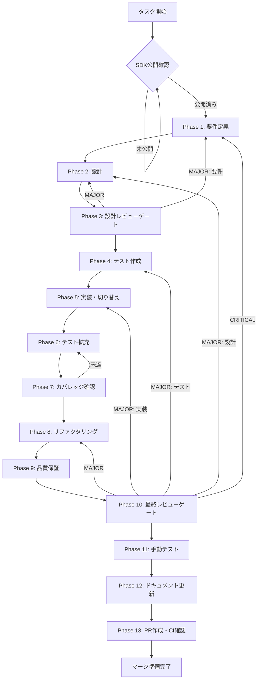

# postrelease-sdk-testing - タスク実行仕様書

## ユーザーからの元の指示

```
AGENT-005のClaude Agent SDK統合が完了した後、実SDKがpnpmに公開されたタイミングで、
モック実装から実SDK呼び出しに切り替え、E2Eテスト・パフォーマンス計測・長時間実行テスト・
ネットワーク障害テストを実施し、本番品質を保証する。
```

## メタ情報

| 項目         | 内容                      |
| ------------ | ------------------------- |
| タスクID     | AGENT-005-POSTRELEASE     |
| タスク名     | postrelease-sdk-testing   |
| 分類         | 品質保証                  |
| 対象機能     | エージェント機能          |
| 優先度       | 中                        |
| 見積もり規模 | 中規模                    |
| ステータス   | 待機中（SDKリリース待ち） |
| 作成日       | 2026-01-12                |

---

## タスク概要

### 目的

`@anthropic-ai/claude-agent-sdk`がpnpmに公開された後、AGENT-005で構築したモック実装を実SDK呼び出しに切り替え、E2Eテスト、パフォーマンス計測、長時間実行テスト、ネットワーク障害テストを実施して本番環境での品質を保証する。

### 背景

AGENT-005ではClaude Agent SDKがpnpm未公開のため、モック実装によるテストのみを完了した。実SDKの動作、パフォーマンス特性、長時間実行時の安定性は実環境でのテストが必要である。以下の課題が未検証のまま残っている：

- 実SDKのストリーミング遅延が未計測
- 長時間実行時のメモリリーク有無が未確認
- ネットワーク障害時の動作が未検証
- 実SDKのHooks/Permission Controlとの互換性が未確認

### 最終ゴール

- 実SDKでE2Eテストがすべてパスする
- ストリーミング初回応答: 500ms以下達成
- メッセージ間遅延: 100ms以下達成
- 1時間以上の連続実行でメモリリークがない（増加100MB以下）
- ネットワーク障害時に適切にエラーハンドリングされる
- 全テスト結果がレポートとして記録される

### 成果物一覧

| 種別         | 成果物                         | 配置先                                             |
| ------------ | ------------------------------ | -------------------------------------------------- |
| テスト       | E2Eテストスイート              | `apps/desktop/e2e/agent-sdk-integration.spec.ts`   |
| ドキュメント | パフォーマンス計測レポート     | `outputs/postrelease/performance-report.md`        |
| ドキュメント | 長時間実行テストレポート       | `outputs/postrelease/stability-report.md`          |
| ドキュメント | ネットワーク障害テストレポート | `outputs/postrelease/network-resilience-report.md` |
| PR           | GitHub Pull Request            | GitHub UI                                          |

---

## 依存関係

| 依存タイプ   | 内容                                          |
| ------------ | --------------------------------------------- |
| ブロッキング | `@anthropic-ai/claude-agent-sdk` pnpmリリース |
| 前提タスク   | AGENT-005（Claude Agent SDK統合）完了済み     |
| 並行可能     | なし（SDK公開後に実施）                       |

---

## 参照ファイル

本仕様書のコマンド選定は以下を参照：

- `docs/00-requirements/master_system_design.md` - システム要件
- `.claude/skills/aiworkflow-requirements/references/` - システム仕様

### システム仕様（aiworkflow-requirements）

> 実装前に必ず以下のシステム仕様を確認し、既存設計との整合性を確保してください。

| 参照資料                    | パス                                                                           | 内容                       |
| --------------------------- | ------------------------------------------------------------------------------ | -------------------------- |
| Agent SDKインターフェース   | `.claude/skills/aiworkflow-requirements/references/interfaces-agent-sdk.md`    | SDK統合の型定義・API仕様   |
| 非機能要件                  | `.claude/skills/aiworkflow-requirements/references/quality-requirements.md`    | パフォーマンス・テスト基準 |
| Claude Codeエージェント仕様 | `.claude/skills/aiworkflow-requirements/references/claude-code-agents-spec.md` | エージェント実装仕様       |

---

## タスク分解サマリー

| ID     | フェーズ | サブタスク名                 | 責務                        | 依存 |
| ------ | -------- | ---------------------------- | --------------------------- | ---- |
| T-01-1 | Phase 1  | テスト要件定義               | E2E/性能/安定性要件の明文化 | -    |
| T-02-1 | Phase 2  | テスト設計                   | テストアーキテクチャ設計    | T-01 |
| T-03-1 | Phase 3  | 設計レビュー                 | テスト設計の妥当性検証      | T-02 |
| T-04-1 | Phase 4  | E2Eテストスイート作成        | 実SDK用テストコード作成     | T-03 |
| T-05-1 | Phase 5  | SDK切り替え・テスト実行      | モック→実SDK切り替え・検証  | T-04 |
| T-06-1 | Phase 6  | パフォーマンス・安定性テスト | 性能計測・長時間テスト実施  | T-05 |
| T-07-1 | Phase 7  | テスト結果確認               | 全テスト結果のゲート判定    | T-06 |
| T-08-1 | Phase 8  | 問題修正・最適化             | 発見された問題の修正        | T-07 |
| T-09-1 | Phase 9  | 品質保証                     | 総合品質検証                | T-08 |
| T-10-1 | Phase 10 | 最終レビュー                 | 全体品質・整合性検証        | T-09 |
| T-11-1 | Phase 11 | 手動テスト                   | 実環境での手動確認          | T-10 |
| T-12-1 | Phase 12 | ドキュメント更新             | レポート作成・仕様更新      | T-11 |
| T-13-1 | Phase 13 | PR作成                       | 変更のPR作成・CI確認        | T-12 |

**総サブタスク数**: 13個

---

## 実行フロー図



---

## Phase一覧

| Phase | 名称               | 仕様書                                                 | ステータス |
| ----- | ------------------ | ------------------------------------------------------ | ---------- |
| 1     | 要件定義           | [phase-1-requirements.md](phase-1-requirements.md)     | 未実施     |
| 2     | 設計               | [phase-2-design.md](phase-2-design.md)                 | 未実施     |
| 3     | 設計レビューゲート | [phase-3-design-review.md](phase-3-design-review.md)   | 未実施     |
| 4     | テスト作成         | [phase-4-test-creation.md](phase-4-test-creation.md)   | 未実施     |
| 5     | 実装               | [phase-5-implementation.md](phase-5-implementation.md) | 未実施     |
| 6     | テスト拡充         | [phase-6-test-expansion.md](phase-6-test-expansion.md) | 未実施     |
| 7     | カバレッジ確認     | [phase-7-coverage-check.md](phase-7-coverage-check.md) | 未実施     |
| 8     | リファクタリング   | [phase-8-refactoring.md](phase-8-refactoring.md)       | 未実施     |
| 9     | 品質保証           | [phase-9-quality.md](phase-9-quality.md)               | 未実施     |
| 10    | 最終レビューゲート | [phase-10-final-review.md](phase-10-final-review.md)   | 未実施     |
| 11    | 手動テスト         | [phase-11-manual-test.md](phase-11-manual-test.md)     | 未実施     |
| 12    | ドキュメント更新   | [phase-12-documentation.md](phase-12-documentation.md) | 未実施     |
| 13    | PR作成             | [phase-13-pr-creation.md](phase-13-pr-creation.md)     | 未実施     |

---

## パフォーマンス目標

### ストリーミング性能

| 指標               | 目標値    | 測定方法                       |
| ------------------ | --------- | ------------------------------ |
| 初回応答時間       | 500ms以下 | query()呼び出しから最初のchunk |
| メッセージ間遅延   | 100ms以下 | 連続するchunk間の時間差        |
| セッション作成時間 | 200ms以下 | createSession()の完了時間      |

### 安定性指標

| 指標                      | 目標値    | 測定方法                       |
| ------------------------- | --------- | ------------------------------ |
| 1時間連続実行後メモリ増加 | 100MB以下 | process.memoryUsage()の差分    |
| クラッシュ回数            | 0回       | 1時間テスト中の異常終了回数    |
| エラーリカバリ成功率      | 100%      | ネットワーク復旧後の再実行成功 |

---

## 統合テスト連携（Phase 1〜11で必須）

各Phaseで以下の統合テスト連携アクションを実施すること:

| Phase | 統合テスト連携アクション                         |
| ----- | ------------------------------------------------ |
| 1     | 実SDK接続要件（認証/ストリーミング）を要件に明記 |
| 2     | SDK統合ポイント/契約を設計に反映                 |
| 3     | SDK統合テスト観点のレビューゲートを実施          |
| 4     | E2Eテストシナリオを全カテゴリで作成              |
| 5     | モック→実SDK切り替え実装とテスト支援コード整備   |
| 6     | パフォーマンス/安定性テストの拡充                |
| 7     | 全テストの再実行とゲート判定                     |
| 8     | 問題修正後のテスト継続成功を確認                 |
| 9     | 品質保証で全テスト結果を確認                     |
| 10    | 最終レビューで全テスト結果を確認                 |
| 11    | 実環境での手動テストを確認                       |

---

## Phase完了時の必須アクション

**各Phase完了時に以下を必ず実行すること:**

1. **タスク100%実行**: Phase内で指定された全タスクを完全に実行
2. **成果物確認**: 全ての必須成果物が生成されていることを検証
3. **実行記録**: 実行タスクの結果を記録
4. **artifacts.json更新**: Phase完了ステータスを更新
5. **Phase末端の実行確認**: 各タスクを100%実行し、各タスクを完遂した旨を必ず明記

```bash
# Phase完了時の検証コマンド
node .claude/skills/task-specification-creator/scripts/validate-phase-output.mjs docs/30-workflows/postrelease-sdk-testing --phase {{PHASE_NUMBER}}

# Phase完了・成果物登録
node .claude/skills/task-specification-creator/scripts/complete-phase.mjs \
  --workflow docs/30-workflows/postrelease-sdk-testing --phase {{PHASE_NUMBER}} --artifacts "..."
```

---

## 開始トリガー

`@anthropic-ai/claude-agent-sdk`がpnpmに公開され次第、本タスクを開始する。

### SDK公開確認方法

```bash
# SDKの公開確認
pnpm view @anthropic-ai/claude-agent-sdk version

# 公開が確認でき次第、ステータスを「未実施」に変更して実行を開始する
```

---

## リスクと対策

| リスク                         | 影響度 | 発生確率 | 対策                        |
| ------------------------------ | ------ | -------- | --------------------------- |
| SDK APIの仕様変更              | 高     | 中       | SDK更新時の型チェック実施   |
| パフォーマンス要件未達         | 中     | 低       | ボトルネック分析と最適化    |
| メモリリーク発見               | 高     | 低       | リソース解放箇所の見直し    |
| ネットワーク障害時の動作不具合 | 中     | 中       | エラーハンドリングの強化    |
| SDK認証の問題                  | 高     | 低       | Claude Code認証フローの確認 |

---

## 前提条件

- `@anthropic-ai/claude-agent-sdk`がpnpmに公開されている
- AGENT-005が完了している
- Claude Code（ローカル認証済み）がインストールされている
- 有効なClaude Code契約（Pro/Team/Enterprise）がある

---

## 関連タスク

| タスク    | 関係       | 説明                             |
| --------- | ---------- | -------------------------------- |
| AGENT-005 | 前提タスク | Claude Agent SDK統合（完了済み） |
| AGENT-004 | 関連タスク | エージェント実行UI               |
| AGENT-003 | 関連タスク | スキル管理バックエンド           |

---

## 関連ドキュメント

### AGENT-005成果物

- 実装ガイド: `docs/30-workflows/claude-code-integration/outputs/phase-12/implementation-guide.md`
- 型定義: `packages/shared/src/types/agent-execution.ts`
- 実装コード: `apps/desktop/src/main/services/agent/`

### システム仕様

- Agent SDKインターフェース: `.claude/skills/aiworkflow-requirements/references/interfaces-agent-sdk.md`
- 品質要件: `.claude/skills/aiworkflow-requirements/references/quality-requirements.md`
