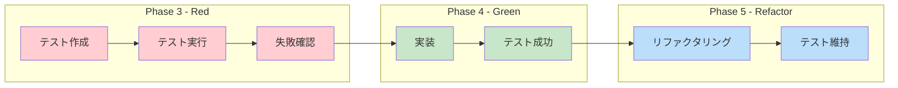

# RAG基本型・共通インターフェース - テスト作成（TDD: Red）

**タスクID**: CONV-03-01
**作成日**: 2025-12-16
**Phase**: 3（テスト作成 - TDD Red）
**サブタスク**: T-03-1, T-03-2, T-03-3

---

## 1. 概要

### 1.1 TDDワークフロー



### 1.2 Phase 3 目標

- 実装前にテストを作成し、要件の理解を深める
- テストが失敗することを確認（Red状態）
- 実装のゴールを明確にする

---

## 2. T-03-1: Result型テスト作成

### 2.1 テストファイル情報

| 項目                 | 値                                                       |
| -------------------- | -------------------------------------------------------- |
| ファイルパス         | `packages/shared/src/types/rag/__tests__/result.test.ts` |
| 作成日               | 2025-12-16                                               |
| テストフレームワーク | Vitest                                                   |
| テスト数             | 50+                                                      |

### 2.2 テストカバレッジ

#### 2.2.1 型定義テスト

| テストカテゴリ | テスト数 | カバー項目                                                                 |
| -------------- | -------- | -------------------------------------------------------------------------- |
| Success<T>     | 6        | successフィールド、dataフィールド、オブジェクト・配列・null・undefined対応 |
| Failure<E>     | 4        | successフィールド、errorフィールド、カスタムエラー型、文字列エラー         |
| Result<T, E>   | 3        | Success/Failure両方の型、デフォルトエラー型                                |

#### 2.2.2 コンストラクタ関数テスト

| 関数    | テスト数 | カバー項目                                                                            |
| ------- | -------- | ------------------------------------------------------------------------------------- |
| `ok()`  | 10       | 数値、文字列、オブジェクト、配列、null、undefined、空オブジェクト、0、空文字列、false |
| `err()` | 5        | Error、文字列、カスタムエラー型、null、数値                                           |

#### 2.2.3 型ガード関数テスト

| 関数      | テスト数 | カバー項目                                                      |
| --------- | -------- | --------------------------------------------------------------- |
| `isOk()`  | 5        | Success判定、Failure判定、型絞り込み、null data、undefined data |
| `isErr()` | 4        | Failure判定、Success判定、型絞り込み、null error                |

#### 2.2.4 モナド的操作テスト

| 関数        | テスト数 | カバー項目                                                              |
| ----------- | -------- | ----------------------------------------------------------------------- |
| `map()`     | 6        | 値変換、Failure透過、型変更、オブジェクト返却、null返却、連鎖変換       |
| `flatMap()` | 6        | Result返却、エラー返却、Failure透過、ネスト平坦化、連鎖使用、エラー伝播 |
| `mapErr()`  | 4        | エラー変換、Success透過、エラーコード追加、エラーラップ                 |

#### 2.2.5 all関数テスト

| テスト数 | カバー項目                                                                                |
| -------- | ----------------------------------------------------------------------------------------- |
| 9        | 全Success、Failure混在、空配列、単一要素、単一Failure、Union型、最初/最後エラー、null含む |

#### 2.2.6 エッジケース・統合テスト

| カテゴリ           | テスト数 | カバー項目                                      |
| ------------------ | -------- | ----------------------------------------------- |
| 複雑な型           | 3        | ネストオブジェクト、関数値、Promise値           |
| イミュータビリティ | 2        | readonly確認、map/flatMap非破壊                 |
| パイプライン処理   | 2        | Railway Oriented Programming、flatMapエラー伝播 |
| all+map組み合わせ  | 2        | 変換成功、エラースキップ                        |
| 型推論             | 5        | ok/err/map/flatMap/all の型推論                 |

### 2.3 TDD Red状態確認

```bash
$ vitest run packages/shared/src/types/rag/__tests__/result.test.ts

FAIL  packages/shared/src/types/rag/__tests__/result.test.ts
Error: Failed to load url ../result
       (resolved id: ../result). Does the file exist?
```

**Red状態**: ✅ 確認済み

- 実装ファイル `result.ts` が存在しないためインポートエラー
- 期待通りの失敗状態

### 2.4 テスト設計の特徴

#### 2.4.1 テスト構造

```
result.test.ts
├── 1. 型定義のテスト
│   ├── Success<T>
│   ├── Failure<E>
│   └── Result<T, E>
├── 2. コンストラクタ関数のテスト
│   ├── ok()
│   └── err()
├── 3. 型ガード関数のテスト
│   ├── isOk()
│   └── isErr()
├── 4. モナド的操作のテスト
│   ├── map()
│   ├── flatMap()
│   └── mapErr()
├── 5. all関数のテスト
├── 6. エッジケースと統合テスト
│   ├── 複雑な型での使用
│   ├── イミュータビリティ
│   ├── パイプライン処理パターン
│   └── allとmapの組み合わせ
└── 7. 型推論のテスト
```

#### 2.4.2 テストパターン

1. **Arrange-Act-Assert (AAA)パターン**

   ```typescript
   it("Successの値を変換すること", () => {
     // Arrange
     const result = ok(2);
     // Act
     const mapped = map(result, (x) => x * 3);
     // Assert
     expect(isOk(mapped)).toBe(true);
     if (isOk(mapped)) {
       expect(mapped.data).toBe(6);
     }
   });
   ```

2. **型絞り込みパターン**

   ```typescript
   if (isOk(result)) {
     // result.data にアクセス可能
     expect(result.data).toBe(expected);
   }
   ```

3. **エラーケース網羅**
   - 境界値（0, 空文字列, 空配列）
   - 特殊値（null, undefined）
   - 失敗パス（エラー伝播）

---

## 3. T-03-2: Branded Typesテスト

### 3.1 テストファイル情報

| 項目                 | 値                                                        |
| -------------------- | --------------------------------------------------------- |
| ファイルパス         | `packages/shared/src/types/rag/__tests__/branded.test.ts` |
| 作成日               | 2025-12-16                                                |
| テストフレームワーク | Vitest                                                    |
| テスト数             | 50+                                                       |

### 3.2 テストカバレッジ

#### 3.2.1 Brand型基盤テスト

| テストカテゴリ | テスト数 | カバー項目                                         |
| -------------- | -------- | -------------------------------------------------- |
| Brand<T, B>    | 3        | 文字列ベース、数値ベース、異なるブランドの非互換性 |

#### 3.2.2 ID型定義テスト

| テストカテゴリ | テスト数 | カバー項目                                                                    |
| -------------- | -------- | ----------------------------------------------------------------------------- |
| 各ID型         | 7        | FileId, ChunkId, ConversionId, EntityId, RelationId, CommunityId, EmbeddingId |

#### 3.2.3 型キャスト関数テスト

| 関数              | テスト数 | カバー項目                               |
| ----------------- | -------- | ---------------------------------------- |
| `createFileId()`  | 4        | 文字列変換、UUID変換、空文字列、特殊文字 |
| `createChunkId()` | 2        | 文字列変換、べき等性                     |
| その他create関数  | 5        | 各ID型の生成関数                         |

#### 3.2.4 UUID生成関数テスト

| 関数               | テスト数 | カバー項目                          |
| ------------------ | -------- | ----------------------------------- |
| `generateUUID()`   | 4        | UUID v4形式、一意性、36文字、小文字 |
| `generateFileId()` | 3        | UUID形式、一意性、文字列型          |
| その他generate関数 | 12       | 各ID型の生成とユニーク性            |

#### 3.2.5 型安全性テスト

| テストカテゴリ   | テスト数 | カバー項目                       |
| ---------------- | -------- | -------------------------------- |
| ID型の区別       | 2        | 型レベルの区別、生成関数の区別   |
| コレクション操作 | 3        | 配列、Set、Mapでの使用           |
| ID型の比較       | 3        | 同一性、非同一性、文字列との比較 |

#### 3.2.6 エッジケーステスト

| テストカテゴリ | テスト数 | カバー項目                           |
| -------------- | -------- | ------------------------------------ |
| 特殊な入力値   | 4        | 長い文字列、Unicode、空白、改行      |
| パフォーマンス | 2        | 大量生成、ブロッキングなし           |
| 型変換の一貫性 | 3        | toString、JSON.stringify、JSON.parse |

#### 3.2.7 モック/スパイテスト

| テストカテゴリ    | テスト数 | カバー項目                                   |
| ----------------- | -------- | -------------------------------------------- |
| crypto.randomUUID | 2        | generateUUIDの依存確認、各generate関数の連携 |

### 3.3 TDD Red状態確認

```bash
$ vitest run packages/shared/src/types/rag/__tests__/branded.test.ts

FAIL  packages/shared/src/types/rag/__tests__/branded.test.ts
Error: Failed to load url ../branded
       (resolved id: ../branded). Does the file exist?
```

**Red状態**: ✅ 確認済み

---

## 4. T-03-3: エラー型・インターフェーステスト

### 4.1 errors.test.ts

| 項目                 | 値                                                       |
| -------------------- | -------------------------------------------------------- |
| ファイルパス         | `packages/shared/src/types/rag/__tests__/errors.test.ts` |
| 作成日               | 2025-12-16                                               |
| テストフレームワーク | Vitest                                                   |
| テスト数             | 50+                                                      |

#### 4.1.1 テストカバレッジ

| テストカテゴリ         | テスト数 | カバー項目                                                     |
| ---------------------- | -------- | -------------------------------------------------------------- |
| ファイル関連コード     | 4        | FILE_NOT_FOUND, FILE_READ_ERROR, FILE_WRITE_ERROR, UNSUPPORTED |
| 変換関連コード         | 2        | CONVERSION_FAILED, CONVERTER_NOT_FOUND                         |
| データベース関連コード | 4        | DB_CONNECTION_ERROR, DB_QUERY_ERROR, DB_TRANSACTION_ERROR等    |
| 埋め込み関連コード     | 2        | EMBEDDING_GENERATION_ERROR, EMBEDDING_PROVIDER_ERROR           |
| 検索関連コード         | 2        | SEARCH_ERROR, QUERY_PARSE_ERROR                                |
| グラフ関連コード       | 3        | ENTITY_EXTRACTION, RELATION_EXTRACTION, COMMUNITY_DETECTION    |
| 汎用コード             | 2        | VALIDATION_ERROR, INTERNAL_ERROR                               |
| 網羅性テスト           | 3        | 18個定義、UPPER_SNAKE_CASE、キー値一致                         |
| BaseError型            | 3        | 必須フィールド、オプショナルcontext、任意の値型                |
| RAGError型             | 5        | BaseError拡張、ErrorCode型、cause、スタックトレース            |
| createRAGError関数     | 12       | 基本使用、timestamp、全エラーコード、イミュータビリティ        |
| エラーハンドリング     | 5        | エラーチェーン、コンテキスト活用、エラー識別                   |
| エッジケース           | 5        | 空値、特殊文字、大きなデータ                                   |

#### 4.1.2 TDD Red状態確認

```bash
$ vitest run errors.test.ts

FAIL  packages/shared/src/types/rag/__tests__/errors.test.ts
Error: Failed to load url ../errors. Does the file exist?
```

**Red状態**: ✅ 確認済み

---

### 4.2 interfaces.test.ts

| 項目                 | 値                                                           |
| -------------------- | ------------------------------------------------------------ |
| ファイルパス         | `packages/shared/src/types/rag/__tests__/interfaces.test.ts` |
| 作成日               | 2025-12-16                                                   |
| テストフレームワーク | Vitest                                                       |
| テスト数             | 50+                                                          |

#### 4.2.1 テストカバレッジ

| テストカテゴリ           | テスト数 | カバー項目                                              |
| ------------------------ | -------- | ------------------------------------------------------- |
| Timestamped              | 3        | 基本フィールド、異なる値、組み合わせ使用                |
| WithMetadata             | 4        | metadata保持、空metadata、任意型、Timestampedとの組合せ |
| PaginationParams         | 4        | 基本、最小値、最大値、ページ計算                        |
| PaginatedResult          | 5        | 基本、空結果、最終ページ、hasMore計算、複雑な型         |
| AsyncStatus              | 6        | 各ステータス、遷移、条件分岐                            |
| Repository（モック）     | 10       | findById、findAll、create、update、delete               |
| Converter（モック）      | 5        | supportedTypes、canConvert、convert                     |
| SearchStrategy（モック） | 5        | name、search、空結果、エラー、limit                     |
| インターフェース組合せ   | 2        | Repository+Converter、SearchStrategy+PaginatedResult    |
| 型推論                   | 3        | ジェネリック型、union型、Repository型                   |

#### 4.2.2 TDD Red状態確認

```bash
$ vitest run interfaces.test.ts

FAIL  packages/shared/src/types/rag/__tests__/interfaces.test.ts
Error: Failed to load url ../result. Does the file exist?
```

**Red状態**: ✅ 確認済み

---

## 5. Phase 3 進捗サマリー

### 5.1 サブタスク進捗

| サブタスク                               | ステータス | 完了日     |
| ---------------------------------------- | ---------- | ---------- |
| T-03-1: Result型テスト                   | ✅ 完了    | 2025-12-16 |
| T-03-2: Branded Typesテスト              | ✅ 完了    | 2025-12-16 |
| T-03-3: エラー型・インターフェーステスト | ✅ 完了    | 2025-12-16 |

### 5.2 TDD Red状態サマリー

| テストファイル     | Red状態 | 理由               |
| ------------------ | ------- | ------------------ |
| result.test.ts     | ✅      | 実装ファイル未存在 |
| branded.test.ts    | ✅      | 実装ファイル未存在 |
| errors.test.ts     | ✅      | 実装ファイル未存在 |
| interfaces.test.ts | ✅      | 実装ファイル未存在 |

---

## 6. 次のステップ

### 6.1 Phase 3 完了条件

- [x] T-03-1: Result型テスト作成
- [x] T-03-2: Branded Typesテスト作成
- [x] T-03-3: エラー型・インターフェーステスト作成

### 6.2 Phase 4 への移行条件

Phase 3のすべてのサブタスクが完了し、すべてのテストがRed状態であることを確認後、Phase 4（実装 - TDD Green）に移行。

---

**作成者**: @unit-tester
**レビュー**: 実装完了後に@code-qualityによるレビュー予定
