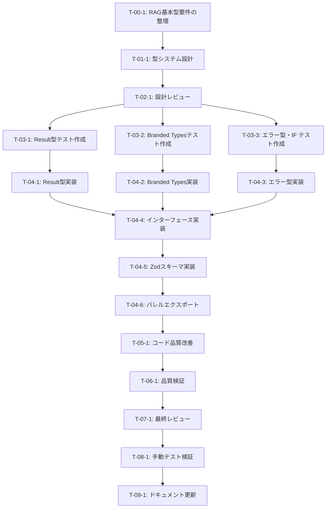

# RAG基本型・共通インターフェース定義 - タスク実行仕様書

## ユーザーからの元の指示

```
@docs/30-workflows/unassigned-task/task-03-01-base-types.md を実装するためにタスク仕様書をまず作成してください。
```

## メタ情報

| 項目             | 内容                                |
| ---------------- | ----------------------------------- |
| タスクID         | CONV-03-01                          |
| タスク名         | RAG基本型・共通インターフェース定義 |
| 分類             | 新規機能                            |
| 対象機能         | HybridRAGパイプライン基盤型定義     |
| 優先度           | 高（他のCONVタスクの前提）          |
| 見積もり規模     | 小規模                              |
| ステータス       | 未実施                              |
| 発見元           | タスク指示書                        |
| 発見日           | 2025-12-16                          |
| 発見エージェント | -                                   |

---

## タスク概要

### 目的

HybridRAGパイプライン全体で使用する基本型、共通インターフェース、ユーティリティ型を定義する。
すべてのサブタスク（CONV-03-02〜05）の基盤となる型システムを構築する。

### 背景

RAG（Retrieval-Augmented Generation）パイプラインを型安全に実装するためには、
統一された型システムが必要。本タスクで定義する型は以下の特徴を持つ：

- **Result型**: Railway Oriented Programmingパターンによるエラーハンドリング
- **Branded Types**: ID混同を防ぐ型安全なID定義
- **共通インターフェース**: Repository、Converter、SearchStrategyの抽象化
- **Zodスキーマ**: ランタイム検証と型推論の統合

### 最終ゴール

`packages/shared/src/types/rag/` 配下に以下のファイルが作成され、
全てのエクスポートが `index.ts` でまとめられている状態：

- `result.ts` - Result型とモナド的操作
- `branded.ts` - Branded Types（ID型）
- `errors.ts` - 共通エラー型
- `interfaces.ts` - 共通インターフェース
- `schemas.ts` - Zodスキーマ基盤

### 成果物一覧

| 種別         | 成果物               | 配置先                                        |
| ------------ | -------------------- | --------------------------------------------- |
| 機能         | Result型定義         | `packages/shared/src/types/rag/result.ts`     |
| 機能         | Branded Types        | `packages/shared/src/types/rag/branded.ts`    |
| 機能         | エラー型定義         | `packages/shared/src/types/rag/errors.ts`     |
| 機能         | インターフェース定義 | `packages/shared/src/types/rag/interfaces.ts` |
| 機能         | Zodスキーマ          | `packages/shared/src/types/rag/schemas.ts`    |
| 機能         | バレルエクスポート   | `packages/shared/src/types/rag/index.ts`      |
| テスト       | ユニットテスト       | `packages/shared/src/types/rag/__tests__/`    |
| ドキュメント | 設計ドキュメント     | `docs/30-workflows/rag-base-types/`           |

---

## 参照ファイル

本仕様書のコマンド・エージェント・スキル選定は以下を参照：

- `docs/00-requirements/master_system_design.md` - システム要件
- `.claude/commands/ai/command_list.md` - /ai:コマンド定義
- `.claude/agents/agent_list.md` - エージェント定義
- `.claude/skills/skill_list.md` - スキル定義

---

## タスク分解サマリー

| ID     | フェーズ | サブタスク名                         | 責務                               | 依存   |
| ------ | -------- | ------------------------------------ | ---------------------------------- | ------ |
| T-00-1 | Phase 0  | RAG基本型要件の整理                  | 要件を明確化・文書化               | なし   |
| T-01-1 | Phase 1  | 型システム設計                       | 型の構造・関係を設計               | T-00-1 |
| T-02-1 | Phase 2  | 設計レビュー                         | 設計の妥当性検証                   | T-01-1 |
| T-03-1 | Phase 3  | Result型テスト作成                   | Result型のテストケース作成         | T-02-1 |
| T-03-2 | Phase 3  | Branded Typesテスト作成              | ID型のテストケース作成             | T-02-1 |
| T-03-3 | Phase 3  | エラー型・インターフェーステスト作成 | エラー型とインターフェースのテスト | T-02-1 |
| T-04-1 | Phase 4  | Result型実装                         | Result型とユーティリティ実装       | T-03-1 |
| T-04-2 | Phase 4  | Branded Types実装                    | ID型と生成関数実装                 | T-03-2 |
| T-04-3 | Phase 4  | エラー型実装                         | エラーコードと型実装               | T-03-3 |
| T-04-4 | Phase 4  | インターフェース実装                 | 共通インターフェース実装           | T-04-3 |
| T-04-5 | Phase 4  | Zodスキーマ実装                      | Zodスキーマ定義                    | T-04-4 |
| T-04-6 | Phase 4  | バレルエクスポート実装               | index.tsでエクスポート統合         | T-04-5 |
| T-05-1 | Phase 5  | コード品質改善                       | リファクタリング                   | T-04-6 |
| T-06-1 | Phase 6  | 品質検証                             | Lint・型チェック・カバレッジ       | T-05-1 |
| T-07-1 | Phase 7  | 最終レビュー                         | 総合的な品質確認                   | T-06-1 |
| T-08-1 | Phase 8  | 手動テスト検証                       | 実際の使用感確認                   | T-07-1 |
| T-09-1 | Phase 9  | ドキュメント更新                     | システムドキュメント反映           | T-08-1 |

**総サブタスク数**: 17個

---

## 実行フロー図



---

## Phase 0: 要件定義

### T-00-1: RAG基本型要件の整理

#### 目的

HybridRAGパイプラインで使用する基本型の要件を明確化し、受け入れ基準を定義する。

#### 背景

型定義の実装前に、各型の目的・制約・使用パターンを明文化することで、
実装時の迷いを排除し、レビュー基準を明確にする。

#### 責務（単一責務）

RAG基本型の要件を文書化する

#### Claude Code スラッシュコマンド

> ⚠️ 以下はターミナルコマンドではなく、Claude Code内で実行するスラッシュコマンドです

```
/ai:write-spec rag-base-types
```

- **参照**: `.claude/commands/ai/command_list.md`

#### 使用エージェント

- **エージェント**: `@schema-def`
- **選定理由**: Zodスキーマ定義・型安全性の専門家であり、TypeScript型設計に精通
- **代替候補**: `@domain-modeler`（ドメイン観点での型設計）
- **参照**: `.claude/agents/agent_list.md`

#### 活用スキル

| スキル名                 | 活用方法                         |
| ------------------------ | -------------------------------- |
| **zod-validation**       | Zodスキーマの設計パターン参照    |
| **type-safety-patterns** | TypeScript型安全性パターンの適用 |

- **参照**: `.claude/skills/skill_list.md`

#### 成果物

| 成果物     | パス                                                      | 内容                           |
| ---------- | --------------------------------------------------------- | ------------------------------ |
| 要件定義書 | `docs/30-workflows/rag-base-types/step00-requirements.md` | 各型の要件・制約・使用パターン |

#### 完了条件

- [ ] Result型の要件（モナド的操作、コンストラクタ関数）が定義されている
- [ ] Branded Typesの要件（ID型一覧、生成関数）が定義されている
- [ ] エラー型の要件（エラーコード体系、エラー生成関数）が定義されている
- [ ] インターフェースの要件（Repository、Converter、SearchStrategy）が定義されている
- [ ] Zodスキーマの要件（バリデーションルール）が定義されている
- [ ] 受け入れ基準が検証可能な形式で記述されている

#### 依存関係

- **前提**: なし
- **後続**: T-01-1

---

## Phase 1: 設計詳細

### T-01-1: 型システム設計

#### 目的

RAG基本型の構造・関係・依存を設計し、実装可能な詳細設計を作成する。

#### 背景

要件定義に基づき、TypeScriptの型システムを最大限活用した設計を行う。
特に、型安全性・再利用性・拡張性を考慮した設計が必要。

#### 責務（単一責務）

型システムの詳細設計を作成する

#### Claude Code スラッシュコマンド

> ⚠️ 以下はターミナルコマンドではなく、Claude Code内で実行するスラッシュコマンドです

```
/ai:design-domain-model rag-types
```

- **参照**: `.claude/commands/ai/command_list.md`

#### 使用エージェント

- **エージェント**: `@domain-modeler`
- **選定理由**: DDD原則に基づくドメインモデル設計の専門家であり、型の境界設計に精通
- **代替候補**: `@schema-def`（スキーマ観点での設計）
- **参照**: `.claude/agents/agent_list.md`

#### 活用スキル

| スキル名                  | 活用方法                                  |
| ------------------------- | ----------------------------------------- |
| **domain-driven-design**  | Entity、Value Objectの設計原則適用        |
| **value-object-patterns** | 不変性・型安全性パターンの適用            |
| **type-safety-patterns**  | Discriminated Unions、Branded Typesの設計 |

- **参照**: `.claude/skills/skill_list.md`

#### 成果物

| 成果物 | パス                                                | 内容                     |
| ------ | --------------------------------------------------- | ------------------------ |
| 設計書 | `docs/30-workflows/rag-base-types/step01-design.md` | 型構造・関係図・実装方針 |

#### 完了条件

- [ ] Result型の設計（Success/Failure判別、モナド操作）が完了
- [ ] Branded Types設計（unique symbol使用、ID型階層）が完了
- [ ] エラー型設計（エラーコード体系、型階層）が完了
- [ ] インターフェース設計（ジェネリック型パラメータ）が完了
- [ ] Zodスキーマ設計（型推論との連携）が完了
- [ ] ファイル間の依存関係が明確化されている

#### 依存関係

- **前提**: T-00-1
- **後続**: T-02-1

---

## Phase 2: 設計レビューゲート

### T-02-1: 設計レビュー

#### 目的

実装開始前に型システム設計の妥当性を検証し、問題を早期発見する。

#### 背景

型定義は他のすべてのCONVタスクの基盤となるため、設計段階での問題検出が重要。

#### レビュー参加エージェント

| エージェント      | レビュー観点         | 選定理由                             |
| ----------------- | -------------------- | ------------------------------------ |
| `@arch-police`    | アーキテクチャ整合性 | Clean Architecture原則との整合性確認 |
| `@schema-def`     | スキーマ設計妥当性   | Zod設計パターンの検証                |
| `@domain-modeler` | ドメインモデル妥当性 | DDD原則との整合性確認                |

- **参照**: `.claude/agents/agent_list.md`

#### レビューチェックリスト

**アーキテクチャ整合性** (`@arch-police`)

- [ ] 型定義が`packages/shared`に適切に配置されているか
- [ ] 依存関係逆転の原則(DIP)が守られているか
- [ ] 他パッケージからの利用を想定した設計か

**スキーマ設計妥当性** (`@schema-def`)

- [ ] Zodスキーマと TypeScript型の整合性があるか
- [ ] バリデーションルールが適切か
- [ ] エラーメッセージが適切か

**ドメインモデル妥当性** (`@domain-modeler`)

- [ ] ユビキタス言語が適切に使用されているか
- [ ] Value Object設計が適切か（不変性）
- [ ] 型の境界が適切に定義されているか

#### レビュー結果

- **判定**: （実行時に記入）
- **指摘事項**: （実行時に記入）
- **対応方針**: （実行時に記入）

#### 戻り先決定（MAJORの場合）

| 問題の種類 | 戻り先                    |
| ---------- | ------------------------- |
| 要件の問題 | Phase 0（要件定義）へ戻る |
| 設計の問題 | Phase 1（設計）へ戻る     |

#### 完了条件

- [ ] 全レビュー観点でPASSまたはMINOR判定
- [ ] 指摘事項への対応方針が決定

#### 依存関係

- **前提**: T-01-1
- **後続**: T-03-1, T-03-2, T-03-3

---

## Phase 3: テスト作成 (TDD: Red)

### T-03-1: Result型テスト作成

#### 目的

Result型の期待動作を検証するテストを実装より先に作成する。

#### 背景

TDDに従い、テストを先に作成することで要件の理解を深め、
実装のゴールを明確にする。

#### 責務（単一責務）

Result型のテストケースを作成する

#### Claude Code スラッシュコマンド

> ⚠️ 以下はターミナルコマンドではなく、Claude Code内で実行するスラッシュコマンドです

```
/ai:generate-unit-tests packages/shared/src/types/rag/result.ts
```

- **参照**: `.claude/commands/ai/command_list.md`

#### 使用エージェント

- **エージェント**: `@unit-tester`
- **選定理由**: TDD原則に基づくユニットテスト作成の専門家
- **参照**: `.claude/agents/agent_list.md`

#### 活用スキル

| スキル名                    | 活用方法                             |
| --------------------------- | ------------------------------------ |
| **tdd-principles**          | Red-Green-Refactorサイクルの適用     |
| **vitest-advanced**         | Vitestテスト構造・モッキングパターン |
| **boundary-value-analysis** | 境界値テストケースの設計             |

- **参照**: `.claude/skills/skill_list.md`

#### 成果物

| 成果物         | パス                                                     | 内容                     |
| -------------- | -------------------------------------------------------- | ------------------------ |
| テストファイル | `packages/shared/src/types/rag/__tests__/result.test.ts` | Result型のユニットテスト |

#### TDD検証: Red状態確認

```bash
pnpm --filter @repo/shared test:run -- result.test.ts
```

- [ ] テストが失敗することを確認（Red状態）

#### 完了条件

- [ ] `ok`/`err`コンストラクタのテストが作成されている
- [ ] `isOk`/`isErr`型ガードのテストが作成されている
- [ ] `map`/`flatMap`/`mapErr`のテストが作成されている
- [ ] `all`関数のテストが作成されている
- [ ] エッジケース（空配列、null値等）のテストが含まれている

#### 依存関係

- **前提**: T-02-1
- **後続**: T-04-1

---

### T-03-2: Branded Typesテスト作成

#### 目的

Branded Types（ID型）の期待動作を検証するテストを作成する。

#### 背景

ID型の混同を防ぐBranded Typesパターンの動作を確認するテストが必要。

#### 責務（単一責務）

Branded Typesのテストケースを作成する

#### Claude Code スラッシュコマンド

> ⚠️ 以下はターミナルコマンドではなく、Claude Code内で実行するスラッシュコマンドです

```
/ai:generate-unit-tests packages/shared/src/types/rag/branded.ts
```

- **参照**: `.claude/commands/ai/command_list.md`

#### 使用エージェント

- **エージェント**: `@unit-tester`
- **選定理由**: TDD原則に基づくユニットテスト作成の専門家
- **参照**: `.claude/agents/agent_list.md`

#### 活用スキル

| スキル名                 | 活用方法                         |
| ------------------------ | -------------------------------- |
| **tdd-principles**       | Red-Green-Refactorサイクルの適用 |
| **type-safety-patterns** | Branded Types型安全性の検証方法  |

- **参照**: `.claude/skills/skill_list.md`

#### 成果物

| 成果物         | パス                                                      | 内容                          |
| -------------- | --------------------------------------------------------- | ----------------------------- |
| テストファイル | `packages/shared/src/types/rag/__tests__/branded.test.ts` | Branded Typesのユニットテスト |

#### TDD検証: Red状態確認

```bash
pnpm --filter @repo/shared test:run -- branded.test.ts
```

- [ ] テストが失敗することを確認（Red状態）

#### 完了条件

- [ ] 各ID型（FileId, ChunkId等）の生成関数テストが作成されている
- [ ] UUID生成関数（generateXXXId）のテストが作成されている
- [ ] 型の区別が正しく機能することのテストが作成されている

#### 依存関係

- **前提**: T-02-1
- **後続**: T-04-2

---

### T-03-3: エラー型・インターフェーステスト作成

#### 目的

エラー型と共通インターフェースの期待動作を検証するテストを作成する。

#### 背景

エラーハンドリングの一貫性と、インターフェースの型制約を検証する。

#### 責務（単一責務）

エラー型とインターフェースのテストケースを作成する

#### Claude Code スラッシュコマンド

> ⚠️ 以下はターミナルコマンドではなく、Claude Code内で実行するスラッシュコマンドです

```
/ai:generate-unit-tests packages/shared/src/types/rag/errors.ts
```

- **参照**: `.claude/commands/ai/command_list.md`

#### 使用エージェント

- **エージェント**: `@unit-tester`
- **選定理由**: TDD原則に基づくユニットテスト作成の専門家
- **参照**: `.claude/agents/agent_list.md`

#### 活用スキル

| スキル名           | 活用方法                         |
| ------------------ | -------------------------------- |
| **tdd-principles** | Red-Green-Refactorサイクルの適用 |
| **test-doubles**   | インターフェース実装のモック作成 |

- **参照**: `.claude/skills/skill_list.md`

#### 成果物

| 成果物                 | パス                                                         | 内容                             |
| ---------------------- | ------------------------------------------------------------ | -------------------------------- |
| エラー型テスト         | `packages/shared/src/types/rag/__tests__/errors.test.ts`     | エラー型のユニットテスト         |
| インターフェーステスト | `packages/shared/src/types/rag/__tests__/interfaces.test.ts` | インターフェースのユニットテスト |

#### TDD検証: Red状態確認

```bash
pnpm --filter @repo/shared test:run -- errors.test.ts interfaces.test.ts
```

- [ ] テストが失敗することを確認（Red状態）

#### 完了条件

- [ ] `createRAGError`関数のテストが作成されている
- [ ] 全エラーコードが正しく定義されていることのテストがある
- [ ] インターフェース型制約のテストが作成されている

#### 依存関係

- **前提**: T-02-1
- **後続**: T-04-3

---

## Phase 4: 実装 (TDD: Green)

### T-04-1: Result型実装

#### 目的

テストを通すためのResult型の最小限の実装を行う。

#### 背景

Railway Oriented Programmingパターンを実装し、
エラーハンドリングを型安全に行えるようにする。

#### 責務（単一責務）

Result型とユーティリティ関数を実装する

#### Claude Code スラッシュコマンド

> ⚠️ 以下はターミナルコマンドではなく、Claude Code内で実行するスラッシュコマンドです

```
/ai:create-schema result
```

- **参照**: `.claude/commands/ai/command_list.md`

#### 使用エージェント

- **エージェント**: `@schema-def`
- **選定理由**: 型定義とスキーマ設計の専門家
- **参照**: `.claude/agents/agent_list.md`

#### 活用スキル

| スキル名                   | 活用方法                             |
| -------------------------- | ------------------------------------ |
| **type-safety-patterns**   | Discriminated Unions、型ガードの実装 |
| **functional-programming** | モナド的操作（map, flatMap）の実装   |

- **参照**: `.claude/skills/skill_list.md`

#### 成果物

| 成果物       | パス                                      | 内容         |
| ------------ | ----------------------------------------- | ------------ |
| 実装ファイル | `packages/shared/src/types/rag/result.ts` | Result型定義 |

#### TDD検証: Green状態確認

```bash
pnpm --filter @repo/shared test:run -- result.test.ts
```

- [ ] テストが成功することを確認（Green状態）

#### 完了条件

- [ ] `Result<T, E>` 型が定義されている
- [ ] `Success<T>` / `Failure<E>` 型が定義されている
- [ ] `ok` / `err` コンストラクタが実装されている
- [ ] `isOk` / `isErr` 型ガードが実装されている
- [ ] `map` / `flatMap` / `mapErr` が実装されている
- [ ] `all` 関数が実装されている
- [ ] 全てのテストがパス

#### 依存関係

- **前提**: T-03-1
- **後続**: T-04-4

---

### T-04-2: Branded Types実装

#### 目的

テストを通すためのBranded Types（ID型）の最小限の実装を行う。

#### 背景

異なるIDの誤用をコンパイル時に検出可能にする型システムを構築する。

#### 責務（単一責務）

Branded TypesとID生成関数を実装する

#### Claude Code スラッシュコマンド

> ⚠️ 以下はターミナルコマンドではなく、Claude Code内で実行するスラッシュコマンドです

```
/ai:create-schema branded
```

- **参照**: `.claude/commands/ai/command_list.md`

#### 使用エージェント

- **エージェント**: `@schema-def`
- **選定理由**: 型定義とスキーマ設計の専門家
- **参照**: `.claude/agents/agent_list.md`

#### 活用スキル

| スキル名                 | 活用方法                             |
| ------------------------ | ------------------------------------ |
| **type-safety-patterns** | Branded Types（unique symbol）の実装 |

- **参照**: `.claude/skills/skill_list.md`

#### 成果物

| 成果物       | パス                                       | 内容              |
| ------------ | ------------------------------------------ | ----------------- |
| 実装ファイル | `packages/shared/src/types/rag/branded.ts` | Branded Types定義 |

#### TDD検証: Green状態確認

```bash
pnpm --filter @repo/shared test:run -- branded.test.ts
```

- [ ] テストが成功することを確認（Green状態）

#### 完了条件

- [ ] `Brand<T, B>` 型が定義されている
- [ ] FileId, ChunkId, ConversionId, EntityId, RelationId, CommunityId, EmbeddingId が定義されている
- [ ] 各ID型の `createXXXId` 関数が実装されている
- [ ] `generateUUID` / `generateXXXId` 関数が実装されている
- [ ] 全てのテストがパス

#### 依存関係

- **前提**: T-03-2
- **後続**: T-04-4

---

### T-04-3: エラー型実装

#### 目的

テストを通すためのエラー型の最小限の実装を行う。

#### 背景

一貫したエラーハンドリングのための共通エラー型を定義する。

#### 責務（単一責務）

エラーコードとエラー型を実装する

#### Claude Code スラッシュコマンド

> ⚠️ 以下はターミナルコマンドではなく、Claude Code内で実行するスラッシュコマンドです

```
/ai:create-schema errors
```

- **参照**: `.claude/commands/ai/command_list.md`

#### 使用エージェント

- **エージェント**: `@schema-def`
- **選定理由**: 型定義とスキーマ設計の専門家
- **参照**: `.claude/agents/agent_list.md`

#### 活用スキル

| スキル名                 | 活用方法                                   |
| ------------------------ | ------------------------------------------ |
| **error-message-design** | ユーザーフレンドリーなエラーメッセージ設計 |
| **type-safety-patterns** | const assertionによるエラーコード型安全性  |

- **参照**: `.claude/skills/skill_list.md`

#### 成果物

| 成果物       | パス                                      | 内容         |
| ------------ | ----------------------------------------- | ------------ |
| 実装ファイル | `packages/shared/src/types/rag/errors.ts` | エラー型定義 |

#### TDD検証: Green状態確認

```bash
pnpm --filter @repo/shared test:run -- errors.test.ts
```

- [ ] テストが成功することを確認（Green状態）

#### 完了条件

- [ ] `BaseError` インターフェースが定義されている
- [ ] `ErrorCodes` 定数オブジェクトが定義されている
- [ ] `ErrorCode` 型が定義されている
- [ ] `RAGError` インターフェースが定義されている
- [ ] `createRAGError` 関数が実装されている
- [ ] 全てのテストがパス

#### 依存関係

- **前提**: T-03-3
- **後続**: T-04-4

---

### T-04-4: インターフェース実装

#### 目的

共通インターフェース（Repository、Converter、SearchStrategy等）を実装する。

#### 背景

RAGパイプラインの各コンポーネントが実装すべき共通インターフェースを定義する。

#### 責務（単一責務）

共通インターフェースを実装する

#### Claude Code スラッシュコマンド

> ⚠️ 以下はターミナルコマンドではなく、Claude Code内で実行するスラッシュコマンドです

```
/ai:create-schema interfaces
```

- **参照**: `.claude/commands/ai/command_list.md`

#### 使用エージェント

- **エージェント**: `@domain-modeler`
- **選定理由**: DDDに基づくインターフェース設計の専門家
- **参照**: `.claude/agents/agent_list.md`

#### 活用スキル

| スキル名                  | 活用方法                         |
| ------------------------- | -------------------------------- |
| **repository-pattern**    | Repositoryインターフェースの設計 |
| **interface-segregation** | インターフェース分離原則の適用   |

- **参照**: `.claude/skills/skill_list.md`

#### 成果物

| 成果物       | パス                                          | 内容                 |
| ------------ | --------------------------------------------- | -------------------- |
| 実装ファイル | `packages/shared/src/types/rag/interfaces.ts` | インターフェース定義 |

#### TDD検証: Green状態確認

```bash
pnpm --filter @repo/shared test:run -- interfaces.test.ts
```

- [ ] テストが成功することを確認（Green状態）

#### 完了条件

- [ ] `Timestamped` インターフェースが定義されている
- [ ] `WithMetadata` インターフェースが定義されている
- [ ] `PaginationParams` / `PaginatedResult<T>` が定義されている
- [ ] `AsyncStatus` 型が定義されている
- [ ] `Repository<T, ID>` インターフェースが定義されている
- [ ] `Converter<TInput, TOutput>` インターフェースが定義されている
- [ ] `SearchStrategy<TQuery, TResult>` インターフェースが定義されている
- [ ] 全てのテストがパス

#### 依存関係

- **前提**: T-04-1, T-04-2, T-04-3
- **後続**: T-04-5

---

### T-04-5: Zodスキーマ実装

#### 目的

共通Zodスキーマを実装し、ランタイム検証と型推論を統合する。

#### 背景

TypeScript型定義とZodスキーマを連携させ、
コンパイル時とランタイムの両方で型安全性を確保する。

#### 責務（単一責務）

共通Zodスキーマを実装する

#### Claude Code スラッシュコマンド

> ⚠️ 以下はターミナルコマンドではなく、Claude Code内で実行するスラッシュコマンドです

```
/ai:create-schema schemas
```

- **参照**: `.claude/commands/ai/command_list.md`

#### 使用エージェント

- **エージェント**: `@schema-def`
- **選定理由**: Zodスキーマ定義の専門家
- **参照**: `.claude/agents/agent_list.md`

#### 活用スキル

| スキル名                 | 活用方法                |
| ------------------------ | ----------------------- |
| **zod-validation**       | Zodスキーマ定義パターン |
| **type-safety-patterns** | 型推論との連携          |

- **参照**: `.claude/skills/skill_list.md`

#### 成果物

| 成果物       | パス                                       | 内容            |
| ------------ | ------------------------------------------ | --------------- |
| 実装ファイル | `packages/shared/src/types/rag/schemas.ts` | Zodスキーマ定義 |

#### TDD検証: Green状態確認

```bash
pnpm --filter @repo/shared test:run -- schemas.test.ts
```

- [ ] テストが成功することを確認（Green状態）

#### 完了条件

- [ ] `uuidSchema` が定義されている
- [ ] `timestampedSchema` が定義されている
- [ ] `metadataSchema` が定義されている
- [ ] `paginationParamsSchema` が定義されている
- [ ] `asyncStatusSchema` が定義されている
- [ ] `errorCodeSchema` が定義されている
- [ ] `ragErrorSchema` が定義されている

#### 依存関係

- **前提**: T-04-4
- **後続**: T-04-6

---

### T-04-6: バレルエクスポート実装

#### 目的

全ての型定義を `index.ts` でまとめてエクスポートする。

#### 背景

利用者が単一のインポートパスで全ての型にアクセスできるようにする。

#### 責務（単一責務）

バレルエクスポートファイルを作成する

#### Claude Code スラッシュコマンド

> ⚠️ 以下はターミナルコマンドではなく、Claude Code内で実行するスラッシュコマンドです

```
/ai:refactor packages/shared/src/types/rag/index.ts
```

- **参照**: `.claude/commands/ai/command_list.md`

#### 使用エージェント

- **エージェント**: `@logic-dev`
- **選定理由**: コード構造化の専門家
- **参照**: `.claude/agents/agent_list.md`

#### 成果物

| 成果物       | パス                                     | 内容               |
| ------------ | ---------------------------------------- | ------------------ |
| 実装ファイル | `packages/shared/src/types/rag/index.ts` | バレルエクスポート |

#### TDD検証: Green状態確認

```bash
pnpm --filter @repo/shared test:run
```

- [ ] テストが成功することを確認（Green状態）

#### 完了条件

- [ ] `result.ts` の全エクスポートが含まれている
- [ ] `branded.ts` の全エクスポートが含まれている
- [ ] `errors.ts` の全エクスポートが含まれている
- [ ] `interfaces.ts` の全エクスポートが含まれている
- [ ] `schemas.ts` の全エクスポートが含まれている
- [ ] 外部から `@repo/shared/types/rag` でインポート可能

#### 依存関係

- **前提**: T-04-5
- **後続**: T-05-1

---

## Phase 5: リファクタリング (TDD: Refactor)

### T-05-1: コード品質改善

#### 目的

動作を変えずにコード品質を改善する。

#### 背景

TDDのRefactorフェーズとして、コードの可読性・保守性を向上させる。

#### 責務（単一責務）

コード品質を改善する

#### Claude Code スラッシュコマンド

> ⚠️ 以下はターミナルコマンドではなく、Claude Code内で実行するスラッシュコマンドです

```
/ai:refactor packages/shared/src/types/rag/
```

- **参照**: `.claude/commands/ai/command_list.md`

#### 使用エージェント

- **エージェント**: `@code-quality`
- **選定理由**: コード品質管理の専門家
- **参照**: `.claude/agents/agent_list.md`

#### 活用スキル

| スキル名                   | 活用方法                                   |
| -------------------------- | ------------------------------------------ |
| **clean-code-practices**   | 意味のある命名、小さな関数、DRY原則        |
| **refactoring-techniques** | Extract Method、Introduce Parameter Object |

- **参照**: `.claude/skills/skill_list.md`

#### 成果物

| 成果物                     | パス                             | 内容                 |
| -------------------------- | -------------------------------- | -------------------- |
| リファクタリング済みコード | `packages/shared/src/types/rag/` | 品質改善されたコード |

#### TDD検証: 継続Green確認

```bash
pnpm --filter @repo/shared test:run
```

- [ ] リファクタリング後もテストが成功することを確認

#### 完了条件

- [ ] コードフォーマットが統一されている
- [ ] 命名規則が一貫している
- [ ] 不要なコメントが削除されている
- [ ] JSDocコメントが適切に付与されている
- [ ] 全てのテストが継続してパス

#### 依存関係

- **前提**: T-04-6
- **後続**: T-06-1

---

## Phase 6: 品質保証

### T-06-1: 品質検証

#### 目的

定義された品質基準をすべて満たすことを検証する。

#### 背景

コード品質・テスト網羅性・セキュリティの観点から品質を担保する。

#### 責務（単一責務）

品質基準の達成を検証する

#### Claude Code スラッシュコマンド

> ⚠️ 以下はターミナルコマンドではなく、Claude Code内で実行するスラッシュコマンドです

```
/ai:run-all-tests --coverage
```

- **参照**: `.claude/commands/ai/command_list.md`

#### 使用エージェント

- **エージェント**: `@code-quality`
- **選定理由**: コード品質検証の専門家
- **参照**: `.claude/agents/agent_list.md`

#### 活用スキル

| スキル名            | 活用方法                           |
| ------------------- | ---------------------------------- |
| **static-analysis** | 複雑度メトリクス、保守性指標の検証 |
| **vitest-advanced** | カバレッジレポートの分析           |

- **参照**: `.claude/skills/skill_list.md`

#### 成果物

| 成果物       | パス                                                        | 内容         |
| ------------ | ----------------------------------------------------------- | ------------ |
| 品質レポート | `docs/30-workflows/rag-base-types/step06-quality-report.md` | 品質検証結果 |

#### 完了条件

- [ ] 全ユニットテスト成功
- [ ] Lintエラーなし
- [ ] 型エラーなし
- [ ] コードフォーマット適用済み
- [ ] テストカバレッジ80%以上

#### 依存関係

- **前提**: T-05-1
- **後続**: T-07-1

---

## 品質ゲートチェックリスト

### 機能検証

- [ ] 全ユニットテスト成功
- [ ] Result型のモナド操作が正常動作
- [ ] Branded Typesが型安全に機能
- [ ] エラー生成・判定が正常動作

### コード品質

- [ ] Lintエラーなし
- [ ] 型エラーなし
- [ ] コードフォーマット適用済み
- [ ] JSDocコメント完備

### テスト網羅性

- [ ] カバレッジ80%以上達成

### セキュリティ

- [ ] 脆弱性スキャン完了
- [ ] 重大な脆弱性なし

---

## Phase 7: 最終レビューゲート

### T-07-1: 最終レビュー

#### 目的

実装完了後の総合的な品質・整合性を検証する。

#### 背景

自動検証だけでは検出できない設計判断やベストプラクティス違反を確認する。

#### レビュー参加エージェント

| エージェント    | レビュー観点       | 選定理由                       |
| --------------- | ------------------ | ------------------------------ |
| `@code-quality` | コード品質         | コーディング規約・可読性の検証 |
| `@arch-police`  | アーキテクチャ遵守 | 設計原則との整合性確認         |
| `@unit-tester`  | テスト品質         | テストケースの網羅性確認       |

- **参照**: `.claude/agents/agent_list.md`

#### レビューチェックリスト

**コード品質** (`@code-quality`)

- [ ] コーディング規約への準拠
- [ ] 可読性・保守性の確保
- [ ] 適切なエラーハンドリング
- [ ] 過度な複雑性の有無

**アーキテクチャ遵守** (`@arch-police`)

- [ ] 実装が設計に従っているか
- [ ] レイヤー間の依存関係が適切か
- [ ] SOLID原則への準拠

**テスト品質** (`@unit-tester`)

- [ ] テストカバレッジが十分か
- [ ] テストケースが適切に設計されているか
- [ ] 境界値・異常系のテストがあるか

#### レビュー結果

- **判定**: （実行時に記入）
- **指摘事項**: （実行時に記入）
- **対応方針**: （実行時に記入）
- **未完了タスク数**: 0件（予定）

#### 戻り先決定（MAJOR/CRITICALの場合）

| 問題の種類       | 戻り先                            |
| ---------------- | --------------------------------- |
| 要件の問題       | Phase 0（要件定義）へ戻る         |
| 設計の問題       | Phase 1（設計）へ戻る             |
| テスト設計の問題 | Phase 3（テスト作成）へ戻る       |
| 実装の問題       | Phase 4（実装）へ戻る             |
| コード品質の問題 | Phase 5（リファクタリング）へ戻る |

#### エスカレーション条件

- 戻り先の判断が困難な場合
- 複数フェーズにまたがる問題の場合
- 要件自体の見直しが必要な場合

#### 完了条件

- [ ] 全レビュー観点でPASSまたはMINOR判定
- [ ] 指摘事項への対応完了

#### 依存関係

- **前提**: T-06-1
- **後続**: T-08-1

---

## Phase 8: 手動テスト検証

### T-08-1: 手動テスト検証

#### 目的

自動テストでは検証できない実際の使用感を確認する。スクリーンショット撮って検証を行う。

#### 背景

型定義の使いやすさ、インポートの容易さ、エラーメッセージの分かりやすさを
実際に使用して確認する。

#### テスト分類

機能テスト / 統合テスト

#### 使用エージェント

- **エージェント**: `@unit-tester`
- **選定理由**: テスト設計・実行の専門家
- **参照**: `.claude/agents/agent_list.md`

#### 手動テストケース

| No  | カテゴリ      | テスト項目                         | 前提条件                    | 操作手順                                                          | 期待結果                       | 実行結果 | 備考 |
| --- | ------------- | ---------------------------------- | --------------------------- | ----------------------------------------------------------------- | ------------------------------ | -------- | ---- |
| 1   | インポート    | バレルエクスポートからのインポート | shared パッケージビルド完了 | `import { ok, err, Result } from '@repo/shared/types/rag'` を記述 | 型エラーなくインポート可能     | -        |      |
| 2   | Result型      | ok/err使用                         | インポート完了              | `const success = ok(42)` を実行                                   | `Success<number>` 型として認識 | -        |      |
| 3   | Result型      | map操作                            | Result値作成済み            | `map(success, x => x * 2)` を実行                                 | `Success<number>` 型、値は84   | -        |      |
| 4   | Branded Types | ID型の区別                         | インポート完了              | FileIdをChunkIdに代入しようとする                                 | TypeScriptコンパイルエラー発生 | -        |      |
| 5   | エラー型      | createRAGError使用                 | インポート完了              | `createRAGError('FILE_NOT_FOUND', 'message')`                     | RAGError型のオブジェクト生成   | -        |      |

#### テスト実行手順

1. `packages/shared` をビルド (`pnpm --filter @repo/shared build`)
2. テスト用の`.ts`ファイルを作成
3. 各テストケースを順番に実行
4. 結果を記録

#### 成果物

| 成果物         | パス                                                     | 内容           |
| -------------- | -------------------------------------------------------- | -------------- |
| 手動テスト結果 | `docs/30-workflows/rag-base-types/step08-manual-test.md` | テスト実行結果 |

#### 完了条件

- [ ] すべての手動テストケースが実行済み
- [ ] すべてのテストケースがPASS
- [ ] 発見された不具合が修正済みまたは記録済み

#### 依存関係

- **前提**: T-07-1
- **後続**: T-09-1

---

## Phase 9: ドキュメント更新・未完了タスク記録

### T-09-1: ドキュメント更新

#### 目的

1. 実装した内容をシステム要件ドキュメントに反映する
2. 未完了タスクがあれば記録する

#### 前提条件

- [ ] Phase 6の品質ゲートをすべて通過
- [ ] Phase 7の最終レビューゲートを通過
- [ ] Phase 8の手動テストが完了
- [ ] すべてのテストが成功

---

#### サブタスク 9.1: システムドキュメント更新

##### 更新対象ドキュメント

- `docs/00-requirements/06-core-interfaces.md` - 新規インターフェース追加
- `docs/00-requirements/07-error-handling.md` - エラーコード追加

##### Claude Code スラッシュコマンド

> ⚠️ 以下はターミナルコマンドではなく、Claude Code内で実行するスラッシュコマンドです

```
/ai:update-all-docs
```

- **参照**: `.claude/commands/ai/command_list.md`

##### 使用エージェント

- **エージェント**: `@spec-writer`
- **選定理由**: ドキュメント作成・更新の専門家
- **参照**: `.claude/agents/agent_list.md`

##### 更新原則

- 概要のみ記載（詳細な実装説明は不要）
- システム構築に必要十分な情報のみ追記
- 既存ドキュメントの構造・フォーマットを維持
- Single Source of Truth原則を遵守

---

#### サブタスク 9.2: 未完了タスク・追加タスク記録

##### 出力先

`docs/30-workflows/unassigned-task/`

##### 記録対象タスク一覧

（レビューで発見された場合に記録）

##### ファイル命名規則

- 要件系: `requirements-{{機能領域}}.md`
- 改善系: `task-{{改善領域}}-improvements.md`

---

#### 完了条件

- [ ] 関連ドキュメントが更新されている
- [ ] 未完了タスクが記録されている（該当する場合）
- [ ] 変更がコミットされている

---

## リスクと対策

| リスク                    | 影響度 | 発生確率 | 対策                                   | 対応サブタスク |
| ------------------------- | ------ | -------- | -------------------------------------- | -------------- |
| Zodスキーマと型の不整合   | 高     | 中       | 型推論テストの徹底、z.infer活用        | T-04-5         |
| Branded Types実装の複雑化 | 中     | 低       | シンプルなunique symbolパターン採用    | T-04-2         |
| Result型のモナド操作誤用  | 中     | 中       | JSDocコメントでの使用例提示            | T-04-1         |
| 他CONVタスクとの型不整合  | 高     | 中       | CONV-03-02実装前のインターフェース固定 | T-07-1         |

---

## 前提条件

- `packages/shared` パッケージが存在すること
- TypeScript 5.x が設定されていること
- Vitest がテストランナーとして設定されていること
- Zod がインストールされていること
- `pnpm` がパッケージマネージャーとして使用されていること

---

## 備考

### 技術的制約

- すべての型は `readonly` 修飾子を使用し、イミュータブル設計を徹底
- Result型はモナド的操作をサポートし、関数型プログラミングスタイルを可能にする
- Branded Typesにより、異なるIDの誤用をコンパイル時に検出可能
- Zodスキーマは型推論と統合され、DRYな型定義を実現

### 参考資料

- [Railway Oriented Programming](https://fsharpforfunandprofit.com/rop/)
- [TypeScript Branded Types](https://egghead.io/blog/using-branded-types-in-typescript)
- [Zod Documentation](https://zod.dev/)
