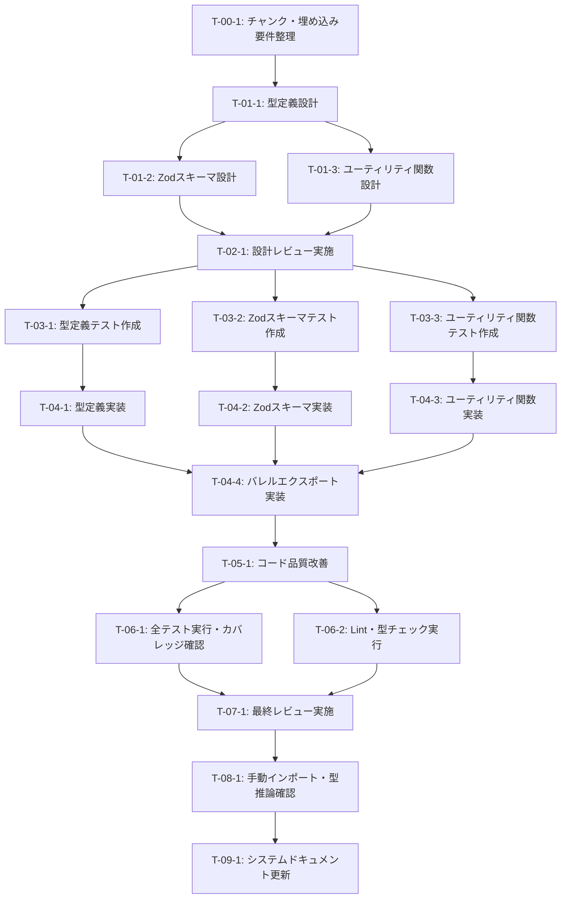

# チャンク・埋め込みスキーマ定義 - タスク実行仕様書

## ユーザーからの元の指示

```markdown
# CONV-03-03: チャンク・埋め込みスキーマ定義

テキストチャンキングと埋め込みベクトル生成に関する型とZodスキーマを定義する。
CONV-06（埋め込み生成パイプライン）の基盤となる。

出力場所: packages/shared/src/types/rag/chunk/
依存: CONV-03-01（基本型・共通インターフェース定義）
```

---

## メタ情報

| 項目             | 内容                                              |
| ---------------- | ------------------------------------------------- |
| タスクID         | CONV-03-03                                        |
| タスク名         | チャンク・埋め込みスキーマ定義                    |
| 分類             | 要件/設計/実装                                    |
| 対象機能         | Hybrid RAGパイプライン - チャンク・埋め込み型定義 |
| 優先度           | 高                                                |
| 見積もり規模     | 小規模                                            |
| ステータス       | 未実施                                            |
| 発見元           | RAGシステム設計フェーズ                           |
| 発見日           | 2025-12-18                                        |
| 発見エージェント | システム設計                                      |

---

## タスク概要

### 目的

HybridRAGパイプラインにおけるテキストチャンキング（分割）と埋め込みベクトル生成に関する型定義とZodスキーマを作成する。これにより：

1. **型安全性の保証**: チャンク・埋め込み操作が厳密な型チェックのもとで実行される
2. **データ整合性**: Zodスキーマによるランタイムバリデーションで不正なデータを排除
3. **保守性向上**: 明確な型定義により、将来の機能拡張が容易になる
4. **CONV-06への基盤提供**: 埋め込み生成パイプライン実装の土台となる

### 背景

- CONV-03-01で基本型（Result型、Branded Types、共通インターフェース）が完成済み
- チャンキング戦略（固定サイズ、意味的境界、再帰的分割等）の違いを型レベルで表現する必要がある
- 複数の埋め込みプロバイダー（OpenAI、Cohere、Voyage、ローカル）への対応
- ベクトル操作（正規化、類似度計算等）のユーティリティが必要
- Contextual Retrieval（文脈付き検索）対応のためのcontextualContent管理

### 最終ゴール

以下の成果物が`packages/shared/src/types/rag/chunk/`配下に作成され、単体テストも完備された状態：

1. **types.ts**: チャンキング戦略、チャンクエンティティ、埋め込みエンティティ、設定型
2. **schemas.ts**: 全型に対応するZodスキーマ
3. **utils.ts**: ベクトル操作・Base64変換・トークン推定ユーティリティ
4. **index.ts**: バレルエクスポート

### 成果物一覧

| 種別         | 成果物                                    | 配置先                                              |
| ------------ | ----------------------------------------- | --------------------------------------------------- |
| 機能         | types.ts（型定義）                        | packages/shared/src/types/rag/chunk/types.ts        |
| 機能         | schemas.ts（Zodスキーマ）                 | packages/shared/src/types/rag/chunk/schemas.ts      |
| 機能         | utils.ts（ユーティリティ関数）            | packages/shared/src/types/rag/chunk/utils.ts        |
| 機能         | index.ts（バレルエクスポート）            | packages/shared/src/types/rag/chunk/index.ts        |
| 品質         | types.test.ts（型定義テスト）             | packages/shared/src/types/rag/chunk/types.test.ts   |
| 品質         | schemas.test.ts（Zodスキーマテスト）      | packages/shared/src/types/rag/chunk/schemas.test.ts |
| 品質         | utils.test.ts（ユーティリティ関数テスト） | packages/shared/src/types/rag/chunk/utils.test.ts   |
| ドキュメント | テストカバレッジレポート                  | 自動生成                                            |

---

## 参照ファイル

本仕様書のコマンド・エージェント・スキル選定は以下を参照：

- `docs/00-requirements/master_system_design.md` - システム要件
- `.claude/commands/ai/command_list.md` - /ai:コマンド定義
- `.claude/agents/agent_list.md` - エージェント定義
- `.claude/skills/skill_list.md` - スキル定義
- `docs/30-workflows/completed-tasks/task-03-01-base-types.md` - 依存タスク

---

## タスク分解サマリー

| ID     | フェーズ                    | サブタスク名                 | 責務                                      | 依存   |
| ------ | --------------------------- | ---------------------------- | ----------------------------------------- | ------ |
| T-00-1 | Phase 0: 要件定義           | チャンク・埋め込み要件整理   | チャンキング戦略・埋め込み要件の明確化    | なし   |
| T-01-1 | Phase 1: 設計               | 型定義設計                   | チャンク・埋め込み型の設計                | T-00-1 |
| T-01-2 | Phase 1: 設計               | Zodスキーマ設計              | バリデーション仕様の設計                  | T-01-1 |
| T-01-3 | Phase 1: 設計               | ユーティリティ関数設計       | ベクトル操作・変換関数の設計              | T-01-1 |
| T-02-1 | Phase 2: 設計レビューゲート | 設計レビュー実施             | 型安全性・アーキテクチャ整合性の検証      | T-01-3 |
| T-03-1 | Phase 3: テスト作成         | 型定義テスト作成             | types.tsの単体テスト作成（Red）           | T-02-1 |
| T-03-2 | Phase 3: テスト作成         | Zodスキーマテスト作成        | schemas.tsの単体テスト作成（Red）         | T-02-1 |
| T-03-3 | Phase 3: テスト作成         | ユーティリティ関数テスト作成 | utils.tsの単体テスト作成（Red）           | T-02-1 |
| T-04-1 | Phase 4: 実装               | 型定義実装                   | types.tsの実装（Green）                   | T-03-1 |
| T-04-2 | Phase 4: 実装               | Zodスキーマ実装              | schemas.tsの実装（Green）                 | T-03-2 |
| T-04-3 | Phase 4: 実装               | ユーティリティ関数実装       | utils.tsの実装（Green）                   | T-03-3 |
| T-04-4 | Phase 4: 実装               | バレルエクスポート実装       | index.tsの実装                            | T-04-3 |
| T-05-1 | Phase 5: リファクタリング   | コード品質改善               | 型の再利用性向上・命名の明確化            | T-04-4 |
| T-06-1 | Phase 6: 品質保証           | 全テスト実行・カバレッジ確認 | テストスイート実行・カバレッジ80%以上確認 | T-05-1 |
| T-06-2 | Phase 6: 品質保証           | Lint・型チェック実行         | ESLint・TypeScript型チェック実行          | T-05-1 |
| T-07-1 | Phase 7: 最終レビューゲート | 最終レビュー実施             | コード品質・テスト品質の最終確認          | T-06-2 |
| T-08-1 | Phase 8: 手動テスト検証     | 手動インポート・型推論確認   | 型定義・スキーマの手動動作確認            | T-07-1 |
| T-09-1 | Phase 9: ドキュメント更新   | システムドキュメント更新     | docs/00-requirements/配下の更新           | T-08-1 |

**総サブタスク数**: 18個

---

## 実行フロー図



---

## Phase 0: 要件定義

### T-00-1: チャンク・埋め込み要件整理

#### 目的

チャンキング戦略、埋め込みプロバイダー、Contextual Retrieval対応等の要件を明確化し、設計の基盤を確立する。

#### 背景

- 複数のチャンキング戦略（固定サイズ、意味的境界、再帰的分割、文単位、段落単位、Markdownヘッダー、コードブロック）をサポートする必要がある
- 複数の埋め込みプロバイダー（OpenAI、Cohere、Voyage、ローカル）に対応するため、抽象化が必要
- Contextual Retrieval（Anthropicの手法）のための文脈付きコンテンツ管理が必要

#### 責務（単一責務）

チャンク・埋め込み機能の要件を網羅的に整理し、設計フェーズへのインプットを作成する。

#### Claude Code スラッシュコマンド

> ⚠️ 以下はターミナルコマンドではなく、Claude Code内で実行するスラッシュコマンドです

```
/ai:gather-requirements チャンク・埋め込み
```

- **参照**: `.claude/commands/ai/command_list.md`

#### 使用エージェント

- **エージェント**: .claude/agents/req-analyst.md
- **選定理由**: 要求工学の専門家として、チャンキング戦略やプロバイダー要件を体系的に整理できる
- **参照**: `.claude/agents/agent_list.md`

#### 活用スキル

| スキル名                                   | 活用方法                                                     |
| ------------------------------------------ | ------------------------------------------------------------ |
| **.claude/skills/requirements-engineering/SKILL.md**               | Karl Wiegers方法論に基づく要件分類・優先順位付け             |
| **.claude/skills/functional-non-functional-requirements/SKILL.md** | 機能要件（チャンク分割）と非機能要件（パフォーマンス）の分離 |
| **.claude/skills/acceptance-criteria-writing/SKILL.md**            | Given-When-Then形式での受け入れ基準定義                      |

- **参照**: `.claude/skills/skill_list.md`

#### 成果物

| 成果物             | パス                                                                        | 内容                                             |
| ------------------ | --------------------------------------------------------------------------- | ------------------------------------------------ |
| 要件ドキュメント   | docs/30-workflows/rag-chunk-embedding/task-step00-01-requirements.md        | チャンキング戦略・埋め込みプロバイダー要件の整理 |
| 受け入れ基準リスト | docs/30-workflows/rag-chunk-embedding/task-step00-01-acceptance-criteria.md | Given-When-Then形式の受け入れ基準                |

#### 完了条件

- [ ] チャンキング戦略（7種類）の要件が明確化されている
- [ ] 埋め込みプロバイダー（4種類）の要件が明確化されている
- [ ] Contextual Retrieval対応の要件が定義されている
- [ ] ベクトル操作（正規化、類似度計算）の要件が明確化されている
- [ ] Base64変換・トークン推定の要件が定義されている
- [ ] 受け入れ基準が検証可能な形で記載されている

#### 依存関係

- **前提**: CONV-03-01（基本型・共通インターフェース定義）が完了済み
- **後続**: T-01-1（型定義設計）

---

## Phase 1: 設計

### T-01-1: 型定義設計

#### 目的

チャンキング戦略、チャンクエンティティ、埋め込みエンティティ、設定型等のTypeScript型定義を設計する。

#### 背景

- CONV-03-01で定義した基本型（Branded Types、Timestamped、WithMetadata）を活用
- 複数のチャンキング戦略を列挙型で表現
- チャンクエンティティにはContextual Retrieval用のcontextualContentを含める
- 埋め込みプロバイダーごとの設定（dimensions、maxTokens、batchSize）を型で表現
- Float32Array型のベクトルを扱うため、型安全性を確保

#### 責務（単一責務）

チャンク・埋め込み関連の全型定義を設計し、types.tsの仕様を確定する。

#### Claude Code スラッシュコマンド

> ⚠️ 以下はターミナルコマンドではなく、Claude Code内で実行するスラッシュコマンドです

```
/ai:design-architecture clean
```

- **参照**: `.claude/commands/ai/command_list.md`

#### 使用エージェント

- **エージェント**: .claude/agents/schema-def.md
- **選定理由**: 型定義・スキーマ設計のスペシャリストとして、型安全性を確保した設計ができる
- **参照**: `.claude/agents/agent_list.md`

#### 活用スキル

| スキル名                 | 活用方法                                    |
| ------------------------ | ------------------------------------------- |
| **.claude/skills/type-safety-patterns/SKILL.md** | Branded Types活用、Discriminated Unions設計 |
| **.claude/skills/clean-code-practices/SKILL.md** | 意味のある命名、型の再利用性確保            |
| **.claude/skills/domain-driven-design/SKILL.md** | ドメインモデル設計、ユビキタス言語の適用    |

- **参照**: `.claude/skills/skill_list.md`

#### 成果物

| 成果物       | パス                                                                 | 内容                                           |
| ------------ | -------------------------------------------------------------------- | ---------------------------------------------- |
| 型定義設計書 | docs/30-workflows/rag-chunk-embedding/task-step01-01-types-design.md | types.tsの詳細設計（型定義、インターフェース） |

#### 完了条件

- [ ] ChunkingStrategy列挙型が設計されている（7種類）
- [ ] ChunkEntity、ChunkPosition、ChunkOverlap型が設計されている
- [ ] EmbeddingProvider列挙型が設計されている（4種類）
- [ ] EmbeddingModelConfig、EmbeddingEntity型が設計されている
- [ ] ChunkingConfig、ChunkingResult、EmbeddingGenerationResult型が設計されている
- [ ] 全型がreadonly修飾子を使用しイミュータブルである
- [ ] Branded Types（ChunkId、EmbeddingId）を活用している

#### 依存関係

- **前提**: T-00-1（チャンク・埋め込み要件整理）
- **後続**: T-01-2（Zodスキーマ設計）、T-01-3（ユーティリティ関数設計）

---

### T-01-2: Zodスキーマ設計

#### 目的

types.tsで定義した全型に対応するZodスキーマを設計し、ランタイムバリデーションを可能にする。

#### 背景

- Zod v3.xの機能を活用して厳密なバリデーションを実現
- 列挙型はz.enum、数値範囲はmin/max、文字列長はlengthで制約
- refine関数を使用してminSize <= targetSize <= maxSizeのような複合条件を検証
- Float32Arrayは配列として扱い、要素数チェックで次元数を検証

#### 責務（単一責務）

Zodスキーマの設計と仕様を確定する。

#### Claude Code スラッシュコマンド

> ⚠️ 以下はターミナルコマンドではなく、Claude Code内で実行するスラッシュコマンドです

```
/ai:create-schema chunk-embedding
```

- **参照**: `.claude/commands/ai/command_list.md`

#### 使用エージェント

- **エージェント**: .claude/agents/schema-def.md
- **選定理由**: Zod・型安全性のスペシャリストとして、厳密なスキーマ設計ができる
- **参照**: `.claude/agents/agent_list.md`

#### 活用スキル

| スキル名                 | 活用方法                                    |
| ------------------------ | ------------------------------------------- |
| **.claude/skills/zod-validation/SKILL.md**       | Zod 3.xスキーマ定義、カスタムバリデーション |
| **.claude/skills/type-safety-patterns/SKILL.md** | 型推論、型ガード、Discriminated Unions      |
| **.claude/skills/input-sanitization/SKILL.md**   | エスケープ処理、XSS対策（文字列フィールド） |

- **参照**: `.claude/skills/skill_list.md`

#### 成果物

| 成果物            | パス                                                                   | 内容                                    |
| ----------------- | ---------------------------------------------------------------------- | --------------------------------------- |
| Zodスキーマ設計書 | docs/30-workflows/rag-chunk-embedding/task-step01-02-schemas-design.md | schemas.tsの詳細設計（Zodスキーマ仕様） |

#### 完了条件

- [ ] chunkingStrategySchema、chunkPositionSchema、chunkEntitySchema等の設計完了
- [ ] embeddingProviderSchema、embeddingModelConfigSchema、embeddingEntitySchema等の設計完了
- [ ] chunkingConfigSchemaにrefineによる複合条件バリデーションが含まれる
- [ ] 全スキーマがデフォルト値を適切に設定している
- [ ] エラーメッセージがユーザーフレンドリーである

#### 依存関係

- **前提**: T-01-1（型定義設計）
- **後続**: T-02-1（設計レビュー実施）

---

### T-01-3: ユーティリティ関数設計

#### 目的

ベクトル操作（正規化、類似度計算、内積計算）、Base64変換、トークン推定等のユーティリティ関数を設計する。

#### 背景

- ベクトル正規化: L2正規化によりベクトルの大きさを1に統一
- コサイン類似度: ドットプロダクトと大きさから計算
- ユークリッド距離: ベクトル間の距離を計算
- Base64変換: Float32Arrayをバイナリとしてエンコード/デコード（DBストレージ用）
- トークン推定: 英語と日本語で異なる推定ロジック（簡易版）

#### 責務（単一責務）

ベクトル操作・変換関数の設計と仕様を確定する。

#### Claude Code スラッシュコマンド

> ⚠️ 以下はターミナルコマンドではなく、Claude Code内で実行するスラッシュコマンドです

```
/ai:create-custom-hook ベクトル操作ユーティリティ
```

- **参照**: `.claude/commands/ai/command_list.md`

#### 使用エージェント

- **エージェント**: .claude/agents/logic-dev.md
- **選定理由**: ビジネスロジック実装の専門家として、数値演算ロジックを正確に設計できる
- **参照**: `.claude/agents/agent_list.md`

#### 活用スキル

| スキル名                   | 活用方法                                |
| -------------------------- | --------------------------------------- |
| **.claude/skills/clean-code-practices/SKILL.md**   | 小さな関数、意味のある命名、DRY原則     |
| **.claude/skills/refactoring-techniques/SKILL.md** | Extract Method、Replace Temp with Query |
| **.claude/skills/test-doubles/SKILL.md**           | Mock/Stub設計（外部依存のモック化）     |

- **参照**: `.claude/skills/skill_list.md`

#### 成果物

| 成果物                   | パス                                                                 | 内容                                               |
| ------------------------ | -------------------------------------------------------------------- | -------------------------------------------------- |
| ユーティリティ関数設計書 | docs/30-workflows/rag-chunk-embedding/task-step01-03-utils-design.md | utils.tsの詳細設計（関数シグネチャ、ロジック仕様） |

#### 完了条件

- [ ] normalizeVector、vectorMagnitude関数の設計完了
- [ ] cosineSimilarity、euclideanDistance、dotProduct関数の設計完了
- [ ] vectorToBase64、base64ToVector関数の設計完了
- [ ] estimateTokenCount関数の設計完了（英語・日本語対応）
- [ ] defaultChunkingConfig、defaultEmbeddingModelConfigs定義の設計完了
- [ ] ゼロ除算等のエッジケース処理が考慮されている

#### 依存関係

- **前提**: T-01-1（型定義設計）
- **後続**: T-02-1（設計レビュー実施）

---

## Phase 2: 設計レビューゲート

### T-02-1: 設計レビュー実施

#### 目的

実装開始前に、型定義・Zodスキーマ・ユーティリティ関数の設計を複数エージェントで多角的にレビューし、問題を早期発見する。

#### 背景

Shift Left原則に基づき、設計段階で問題を検出することで、実装後の手戻りコストを最小化する。

#### レビュー参加エージェント

| エージェント | レビュー観点          | 選定理由                                       |
| ------------ | --------------------- | ---------------------------------------------- |
| .claude/agents/arch-police.md | アーキテクチャ整合性  | Clean Architecture遵守、依存関係逆転の原則確認 |
| .claude/agents/schema-def.md  | 型安全性・Zodスキーマ | 型の一貫性、Zodスキーマの厳密性確認            |
| .claude/agents/logic-dev.md   | ロジック正確性        | ベクトル操作ロジックの数学的正確性確認         |

- **参照**: `.claude/agents/agent_list.md`

#### レビューチェックリスト

**アーキテクチャ整合性** (.claude/agents/arch-police.md)

- [ ] Branded Typesの適切な活用（ChunkId、EmbeddingId）
- [ ] CONV-03-01の基本型（Result、Timestamped、WithMetadata）との整合性
- [ ] レイヤー違反の不在（外部依存がない）
- [ ] 依存関係逆転の原則（DIP）の遵守

**型安全性・Zodスキーマ** (.claude/agents/schema-def.md)

- [ ] 全型にreadonly修飾子が適用されている
- [ ] 列挙型が適切に定義されている（ChunkingStrategy、EmbeddingProvider）
- [ ] Zodスキーマが全型をカバーしている
- [ ] refineによる複合条件バリデーションが適切
- [ ] エラーメッセージがユーザーフレンドリー

**ロジック正確性** (.claude/agents/logic-dev.md)

- [ ] ベクトル正規化ロジックが数学的に正しい（L2正規化）
- [ ] コサイン類似度・ユークリッド距離の計算式が正確
- [ ] ゼロ除算・空配列等のエッジケースが考慮されている
- [ ] Base64変換ロジックがバイナリとして正しく動作する
- [ ] トークン推定ロジックが英語・日本語で適切

#### レビュー結果

- **判定**: PASS / MINOR / MAJOR
- **指摘事項**: （レビュー実施時に記載）
- **対応方針**: （レビュー実施時に記載）

#### 戻り先決定（MAJORの場合）

| 問題の種類     | 戻り先                  |
| -------------- | ----------------------- |
| 要件の問題     | Phase 0（T-00-1）へ戻る |
| 型設計の問題   | Phase 1（T-01-1）へ戻る |
| スキーマの問題 | Phase 1（T-01-2）へ戻る |
| ロジックの問題 | Phase 1（T-01-3）へ戻る |

#### 完了条件

- [ ] 全レビュー観点でチェックリストが完了している
- [ ] PASS判定またはMINOR対応完了でPhase 3へ進行可能
- [ ] MAJOR判定の場合は影響範囲に応じた適切なフェーズへ戻る

#### 依存関係

- **前提**: T-01-2（Zodスキーマ設計）、T-01-3（ユーティリティ関数設計）
- **後続**: T-03-1（型定義テスト作成）、T-03-2（Zodスキーマテスト作成）、T-03-3（ユーティリティ関数テスト作成）

---

## Phase 3: テスト作成 (TDD: Red)

### T-03-1: 型定義テスト作成

#### 目的

types.tsの型定義が正しく機能することを検証するテストを作成し、Red（失敗）状態を確認する。

#### 背景

TDD原則に従い、実装前にテストを書くことで、期待する仕様を明確化し、実装の正確性を保証する。

#### 責務（単一責務）

types.tsに対する単体テストを作成する。

#### Claude Code スラッシュコマンド

> ⚠️ 以下はターミナルコマンドではなく、Claude Code内で実行するスラッシュコマンドです

```
/ai:generate-unit-tests packages/shared/src/types/rag/chunk/types.ts
```

- **参照**: `.claude/commands/ai/command_list.md`

#### 使用エージェント

- **エージェント**: .claude/agents/unit-tester.md
- **選定理由**: TDD・単体テストの専門家として、境界値分析・等価分割に基づくテストを作成できる
- **参照**: `.claude/agents/agent_list.md`

#### 活用スキル

| スキル名                    | 活用方法                                        |
| --------------------------- | ----------------------------------------------- |
| **.claude/skills/tdd-principles/SKILL.md**          | Red-Green-Refactorサイクル、テストファースト    |
| **.claude/skills/boundary-value-analysis/SKILL.md** | 境界値テスト（min/max値）、エッジケース網羅     |
| **.claude/skills/test-naming-conventions/SKILL.md** | Should形式、Given-When-Then、Arrange-Act-Assert |

- **参照**: `.claude/skills/skill_list.md`

#### 成果物

| 成果物               | パス                                              | 内容                 |
| -------------------- | ------------------------------------------------- | -------------------- |
| 型定義テストファイル | packages/shared/src/types/rag/chunk/types.test.ts | types.tsの単体テスト |

#### TDD検証: Red状態確認

```bash
pnpm --filter @repo/shared test:run types.test.ts
```

- [ ] テストが失敗することを確認（Red状態）

#### 完了条件

- [ ] Branded Types（ChunkId、EmbeddingId）の型推論テストが作成されている
- [ ] チャンキング戦略列挙型のテストが作成されている
- [ ] 埋め込みプロバイダー列挙型のテストが作成されている
- [ ] ChunkEntity、EmbeddingEntityのインターフェーステストが作成されている
- [ ] デフォルト設定（defaultChunkingConfig、defaultEmbeddingModelConfigs）のテストが作成されている
- [ ] テストが全てRed（失敗）状態である

#### 依存関係

- **前提**: T-02-1（設計レビュー実施）
- **後続**: T-04-1（型定義実装）

---

### T-03-2: Zodスキーマテスト作成

#### 目的

schemas.tsのZodスキーマが正しくバリデーションを行うことを検証するテストを作成し、Red状態を確認する。

#### 背景

Zodスキーマはランタイムバリデーションの要であり、正常系・異常系・境界値を網羅的にテストする必要がある。

#### 責務（単一責務）

schemas.tsに対する単体テストを作成する。

#### Claude Code スラッシュコマンド

> ⚠️ 以下はターミナルコマンドではなく、Claude Code内で実行するスラッシュコマンドです

```
/ai:generate-unit-tests packages/shared/src/types/rag/chunk/schemas.ts
```

- **参照**: `.claude/commands/ai/command_list.md`

#### 使用エージェント

- **エージェント**: .claude/agents/unit-tester.md
- **選定理由**: TDD・境界値分析の専門家として、Zodスキーマの網羅的なテストを作成できる
- **参照**: `.claude/agents/agent_list.md`

#### 活用スキーム

| スキル名                    | 活用方法                                        |
| --------------------------- | ----------------------------------------------- |
| **.claude/skills/tdd-principles/SKILL.md**          | Red-Green-Refactorサイクル                      |
| **.claude/skills/boundary-value-analysis/SKILL.md** | 境界値テスト（min/max値、文字列長、配列要素数） |
| **.claude/skills/test-doubles/SKILL.md**            | モック不要（純粋なバリデーションテスト）        |

- **参照**: `.claude/skills/skill_list.md`

#### 成果物

| 成果物                    | パス                                                | 内容                   |
| ------------------------- | --------------------------------------------------- | ---------------------- |
| Zodスキーマテストファイル | packages/shared/src/types/rag/chunk/schemas.test.ts | schemas.tsの単体テスト |

#### TDD検証: Red状態確認

```bash
pnpm --filter @repo/shared test:run schemas.test.ts
```

- [ ] テストが失敗することを確認（Red状態）

#### 完了条件

- [ ] chunkingStrategySchemaの正常系・異常系テストが作成されている
- [ ] chunkPositionSchemaの境界値テスト（startLine >= 1等）が作成されている
- [ ] chunkEntitySchemaの全フィールドバリデーションテストが作成されている
- [ ] embeddingProviderSchema、embeddingModelConfigSchemaのテストが作成されている
- [ ] chunkingConfigSchemaのrefineロジック（minSize <= targetSize <= maxSize）テストが作成されている
- [ ] エラーメッセージの正確性テストが作成されている
- [ ] テストが全てRed（失敗）状態である

#### 依存関係

- **前提**: T-02-1（設計レビュー実施）
- **後続**: T-04-2（Zodスキーマ実装）

---

### T-03-3: ユーティリティ関数テスト作成

#### 目的

utils.tsのユーティリティ関数（ベクトル操作、Base64変換、トークン推定）が正しく動作することを検証するテストを作成し、Red状態を確認する。

#### 背景

ベクトル操作は数値計算であり、浮動小数点演算の誤差を考慮したテストが必要。

#### 責務（単一責務）

utils.tsに対する単体テストを作成する。

#### Claude Code スラッシュコマンド

> ⚠️ 以下はターミナルコマンドではなく、Claude Code内で実行するスラッシュコマンドです

```
/ai:generate-unit-tests packages/shared/src/types/rag/chunk/utils.ts
```

- **参照**: `.claude/commands/ai/command_list.md`

#### 使用エージェント

- **エージェント**: .claude/agents/unit-tester.md
- **選定理由**: 数値計算ロジックの境界値・エッジケーステストを作成できる
- **参照**: `.claude/agents/agent_list.md`

#### 活用スキル

| スキル名                    | 活用方法                                         |
| --------------------------- | ------------------------------------------------ |
| **.claude/skills/tdd-principles/SKILL.md**          | Red-Green-Refactorサイクル                       |
| **.claude/skills/boundary-value-analysis/SKILL.md** | ゼロベクトル、正規化済みベクトル等のエッジケース |
| **.claude/skills/test-doubles/SKILL.md**            | Buffer等のNodeJS API依存のモック化               |

- **参照**: `.claude/skills/skill_list.md`

#### 成果物

| 成果物                           | パス                                              | 内容                 |
| -------------------------------- | ------------------------------------------------- | -------------------- |
| ユーティリティ関数テストファイル | packages/shared/src/types/rag/chunk/utils.test.ts | utils.tsの単体テスト |

#### TDD検証: Red状態確認

```bash
pnpm --filter @repo/shared test:run utils.test.ts
```

- [ ] テストが失敗することを確認（Red状態）

#### 完了条件

- [ ] normalizeVectorのテスト（ゼロベクトル、既に正規化済み等）が作成されている
- [ ] vectorMagnitudeのテスト（境界値）が作成されている
- [ ] cosineSimilarityのテスト（同一ベクトル、直交ベクトル等）が作成されている
- [ ] euclideanDistanceのテスト（同一ベクトル、距離計算精度）が作成されている
- [ ] dotProductのテスト（正規化済みベクトル）が作成されている
- [ ] vectorToBase64、base64ToVectorの往復変換テストが作成されている
- [ ] estimateTokenCountのテスト（英語、日本語、混在）が作成されている
- [ ] 浮動小数点演算の誤差を考慮したアサーション（toBeCloseTo等）が使用されている
- [ ] テストが全てRed（失敗）状態である

#### 依存関係

- **前提**: T-02-1（設計レビュー実施）
- **後続**: T-04-3（ユーティリティ関数実装）

---

## Phase 4: 実装 (TDD: Green)

### T-04-1: 型定義実装

#### 目的

types.tsを実装し、T-03-1で作成したテストをGreen（成功）にする。

#### 背景

TDD原則に従い、テストを通すための最小限の実装を行う。

#### 責務（単一責務）

types.tsの実装。

#### Claude Code スラッシュコマンド

> ⚠️ 以下はターミナルコマンドではなく、Claude Code内で実行するスラッシュコマンドです

```
/ai:implement-business-logic チャンク・埋め込み型定義
```

- **参照**: `.claude/commands/ai/command_list.md`

#### 使用エージェント

- **エージェント**: .claude/agents/schema-def.md
- **選定理由**: 型定義のスペシャリストとして、型安全性を確保した実装ができる
- **参照**: `.claude/agents/agent_list.md`

#### 活用スキル

| スキル名                   | 活用方法                            |
| -------------------------- | ----------------------------------- |
| **.claude/skills/type-safety-patterns/SKILL.md**   | Branded Types、Discriminated Unions |
| **.claude/skills/clean-code-practices/SKILL.md**   | 意味のある命名、型の再利用性        |
| **.claude/skills/tdd-red-green-refactor/SKILL.md** | テスト駆動開発サイクル              |

- **参照**: `.claude/skills/skill_list.md`

#### 成果物

| 成果物   | パス                                         | 内容       |
| -------- | -------------------------------------------- | ---------- |
| types.ts | packages/shared/src/types/rag/chunk/types.ts | 型定義実装 |

#### TDD検証: Green状態確認

```bash
pnpm --filter @repo/shared test:run types.test.ts
```

- [ ] テストが成功することを確認（Green状態）

#### 完了条件

- [ ] ChunkingStrategies列挙型が実装されている（7種類）
- [ ] EmbeddingProviders列挙型が実装されている（4種類）
- [ ] ChunkEntity、ChunkPosition、ChunkOverlapインターフェースが実装されている
- [ ] EmbeddingModelConfig、EmbeddingEntityインターフェースが実装されている
- [ ] ChunkingConfig、ChunkingResult、EmbeddingGenerationResultインターフェースが実装されている
- [ ] defaultChunkingConfig、defaultEmbeddingModelConfigsが実装されている
- [ ] 全型にreadonly修飾子が適用されている
- [ ] T-03-1のテストが全てGreen（成功）状態である

#### 依存関係

- **前提**: T-03-1（型定義テスト作成）
- **後続**: T-04-4（バレルエクスポート実装）

---

### T-04-2: Zodスキーマ実装

#### 目的

schemas.tsを実装し、T-03-2で作成したテストをGreen（成功）にする。

#### 背景

Zod 3.xの機能を活用して厳密なバリデーションを実装する。

#### 責務（単一責務）

schemas.tsの実装。

#### Claude Code スラッシュコマンド

> ⚠️ 以下はターミナルコマンドではなく、Claude Code内で実行するスラッシュコマンドです

```
/ai:create-schema chunk-embedding
```

- **参照**: `.claude/commands/ai/command_list.md`

#### 使用エージェント

- **エージェント**: .claude/agents/schema-def.md
- **選定理由**: Zodスキーマ実装のスペシャリスト
- **参照**: `.claude/agents/agent_list.md`

#### 活用スキル

| スキル名                   | 活用方法                                    |
| -------------------------- | ------------------------------------------- |
| **.claude/skills/zod-validation/SKILL.md**         | Zod 3.xスキーマ定義、カスタムバリデーション |
| **.claude/skills/type-safety-patterns/SKILL.md**   | 型推論、型ガード                            |
| **.claude/skills/tdd-red-green-refactor/SKILL.md** | テスト駆動開発サイクル                      |

- **参照**: `.claude/skills/skill_list.md`

#### 成果物

| 成果物     | パス                                           | 内容            |
| ---------- | ---------------------------------------------- | --------------- |
| schemas.ts | packages/shared/src/types/rag/chunk/schemas.ts | Zodスキーマ実装 |

#### TDD検証: Green状態確認

```bash
pnpm --filter @repo/shared test:run schemas.test.ts
```

- [ ] テストが成功することを確認（Green状態）

#### 完了条件

- [ ] chunkingStrategySchema、chunkPositionSchema、chunkEntitySchema等が実装されている
- [ ] embeddingProviderSchema、embeddingModelConfigSchema、embeddingEntitySchema等が実装されている
- [ ] chunkingConfigSchemaのrefineロジック（minSize <= targetSize <= maxSize）が実装されている
- [ ] 全スキーマにデフォルト値が適切に設定されている
- [ ] エラーメッセージがユーザーフレンドリーである
- [ ] T-03-2のテストが全てGreen（成功）状態である

#### 依存関係

- **前提**: T-03-2（Zodスキーマテスト作成）
- **後続**: T-04-4（バレルエクスポート実装）

---

### T-04-3: ユーティリティ関数実装

#### 目的

utils.tsを実装し、T-03-3で作成したテストをGreen（成功）にする。

#### 背景

ベクトル操作・Base64変換・トークン推定のロジックを数学的に正確に実装する。

#### 責務（単一責務）

utils.tsの実装。

#### Claude Code スラッシュコマンド

> ⚠️ 以下はターミナルコマンドではなく、Claude Code内で実行するスラッシュコマンドです

```
/ai:implement-business-logic ベクトル操作ユーティリティ
```

- **参照**: `.claude/commands/ai/command_list.md`

#### 使用エージェント

- **エージェント**: .claude/agents/logic-dev.md
- **選定理由**: ビジネスロジック実装の専門家として、数値演算ロジックを正確に実装できる
- **参照**: `.claude/agents/agent_list.md`

#### 活用スキル

| スキル名                   | 活用方法                            |
| -------------------------- | ----------------------------------- |
| **.claude/skills/clean-code-practices/SKILL.md**   | 小さな関数、意味のある命名、DRY原則 |
| **.claude/skills/refactoring-techniques/SKILL.md** | Extract Method                      |
| **.claude/skills/tdd-red-green-refactor/SKILL.md** | テスト駆動開発サイクル              |

- **参照**: `.claude/skills/skill_list.md`

#### 成果物

| 成果物   | パス                                         | 内容                   |
| -------- | -------------------------------------------- | ---------------------- |
| utils.ts | packages/shared/src/types/rag/chunk/utils.ts | ユーティリティ関数実装 |

#### TDD検証: Green状態確認

```bash
pnpm --filter @repo/shared test:run utils.test.ts
```

- [ ] テストが成功することを確認（Green状態）

#### 完了条件

- [ ] normalizeVector、vectorMagnitude関数が実装されている
- [ ] cosineSimilarity、euclideanDistance、dotProduct関数が実装されている
- [ ] vectorToBase64、base64ToVector関数が実装されている
- [ ] estimateTokenCount関数が実装されている（英語・日本語対応）
- [ ] defaultChunkingConfig、defaultEmbeddingModelConfigsが実装されている
- [ ] ゼロ除算・空配列等のエッジケース処理が実装されている
- [ ] T-03-3のテストが全てGreen（成功）状態である

#### 依存関係

- **前提**: T-03-3（ユーティリティ関数テスト作成）
- **後続**: T-04-4（バレルエクスポート実装）

---

### T-04-4: バレルエクスポート実装

#### 目的

index.tsを実装し、types.ts、schemas.ts、utils.tsの全エクスポートをまとめる。

#### 背景

バレルエクスポートにより、インポート文をシンプルにし、利用側のコードをクリーンに保つ。

#### 責務（単一責務）

index.tsの実装。

#### Claude Code スラッシュコマンド

> ⚠️ 以下はターミナルコマンドではなく、Claude Code内で実行するスラッシュコマンドです

```
/ai:implement-business-logic バレルエクスポート
```

- **参照**: `.claude/commands/ai/command_list.md`

#### 使用エージェント

- **エージェント**: .claude/agents/schema-def.md
- **選定理由**: 型・スキーマのエクスポート構成を理解している
- **参照**: `.claude/agents/agent_list.md`

#### 活用スキル

| スキル名                 | 活用方法                |
| ------------------------ | ----------------------- |
| **.claude/skills/clean-code-practices/SKILL.md** | 明確な責務分離、DRY原則 |

- **参照**: `.claude/skills/skill_list.md`

#### 成果物

| 成果物   | パス                                         | 内容               |
| -------- | -------------------------------------------- | ------------------ |
| index.ts | packages/shared/src/types/rag/chunk/index.ts | バレルエクスポート |

#### TDD検証: Green状態確認

```bash
pnpm --filter @repo/shared test:run
```

- [ ] 全テストが成功することを確認（Green状態）

#### 完了条件

- [ ] types.ts、schemas.ts、utils.tsの全エクスポートがindex.tsでまとめられている
- [ ] 外部から`import { ... } from '@repo/shared/types/rag/chunk'`の形式でインポート可能
- [ ] 全テストがGreen（成功）状態である

#### 依存関係

- **前提**: T-04-1（型定義実装）、T-04-2（Zodスキーマ実装）、T-04-3（ユーティリティ関数実装）
- **後続**: T-05-1（コード品質改善）

---

## Phase 5: リファクタリング (TDD: Refactor)

### T-05-1: コード品質改善

#### 目的

動作を変えずにコード品質を改善し、可読性・保守性・再利用性を向上させる。

#### 背景

TDDサイクルの最後のステップであり、テストが全てGreenであることを確認しながらリファクタリングを行う。

#### 責務（単一責務）

types.ts、schemas.ts、utils.tsのリファクタリング。

#### Claude Code スラッシュコマンド

> ⚠️ 以下はターミナルコマンドではなく、Claude Code内で実行するスラッシュコマンドです

```
/ai:refactor packages/shared/src/types/rag/chunk/
```

- **参照**: `.claude/commands/ai/command_list.md`

#### 使用エージェント

- **エージェント**: .claude/agents/code-quality.md
- **選定理由**: リファクタリング・Clean Code原則の専門家
- **参照**: `.claude/agents/agent_list.md`

#### 活用スキル

| スキル名                   | 活用方法                                   |
| -------------------------- | ------------------------------------------ |
| **.claude/skills/refactoring-techniques/SKILL.md** | Extract Method、Replace Temp with Query    |
| **.claude/skills/clean-code-practices/SKILL.md**   | 意味のある命名、小さな関数、DRY原則        |
| **.claude/skills/tdd-red-green-refactor/SKILL.md** | リファクタリング後もテストが継続成功を確認 |

- **参照**: `.claude/skills/skill_list.md`

#### 成果物

| 成果物                   | パス                                      | 内容               |
| ------------------------ | ----------------------------------------- | ------------------ |
| リファクタリング後コード | packages/shared/src/types/rag/chunk/\*.ts | 品質改善後のコード |

#### TDD検証: 継続Green確認

```bash
pnpm --filter @repo/shared test:run
```

- [ ] リファクタリング後もテストが成功することを確認

#### 完了条件

- [ ] 型の命名が明確でユビキタス言語に従っている
- [ ] 重複コードが排除されている（DRY原則）
- [ ] 関数が小さく単一責務である
- [ ] コメントが必要最小限で、コード自体が自己文書化されている
- [ ] readonly修飾子が適切に使用されている
- [ ] リファクタリング後もテストが全てGreen（成功）状態である

#### 依存関係

- **前提**: T-04-4（バレルエクスポート実装）
- **後続**: T-06-1（全テスト実行・カバレッジ確認）、T-06-2（Lint・型チェック実行）

---

## Phase 6: 品質保証

### T-06-1: 全テスト実行・カバレッジ確認

#### 目的

全テストスイートを実行し、カバレッジが基準（80%以上）を満たすことを確認する。

#### 背景

品質ゲートとして、テストカバレッジの基準を満たさなければ次のフェーズに進めない。

#### 責務（単一責務）

テスト実行とカバレッジ確認。

#### Claude Code スラッシュコマンド

> ⚠️ 以下はターミナルコマンドではなく、Claude Code内で実行するスラッシュコマンドです

```
/ai:run-all-tests --coverage
```

- **参照**: `.claude/commands/ai/command_list.md`

#### 使用エージェント

- **エージェント**: .claude/agents/unit-tester.md
- **選定理由**: テスト実行・カバレッジ分析の専門家
- **参照**: `.claude/agents/agent_list.md`

#### 活用スキル

| スキル名            | 活用方法                               |
| ------------------- | -------------------------------------- |
| **.claude/skills/vitest-advanced/SKILL.md** | カバレッジ設定、カバレッジレポート分析 |
| **.claude/skills/tdd-principles/SKILL.md**  | テスト駆動開発のベストプラクティス     |

- **参照**: `.claude/skills/skill_list.md`

#### 成果物

| 成果物             | パス                | 内容                     |
| ------------------ | ------------------- | ------------------------ |
| カバレッジレポート | coverage/index.html | テストカバレッジレポート |

#### 完了条件

- [ ] 全ユニットテストが成功している
- [ ] カバレッジが80%以上である（Statements、Branches、Functions、Lines）
- [ ] カバレッジレポートがHTMLで出力されている
- [ ] 未カバー箇所の理由が明確である（意図的な除外等）

#### 依存関係

- **前提**: T-05-1（コード品質改善）
- **後続**: T-07-1（最終レビュー実施）

---

### T-06-2: Lint・型チェック実行

#### 目的

ESLintとTypeScriptの型チェックを実行し、コード品質とコーディング規約の遵守を確認する。

#### 背景

品質ゲートとして、Lint・型エラーがゼロでなければ次のフェーズに進めない。

#### 責務（単一責務）

Lint・型チェックの実行。

#### Claude Code スラッシュコマンド

> ⚠️ 以下はターミナルコマンドではなく、Claude Code内で実行するスラッシュコマンドです

```
/ai:lint --fix
```

- **参照**: `.claude/commands/ai/command_list.md`

#### 使用エージェント

- **エージェント**: .claude/agents/code-quality.md
- **選定理由**: ESLint・型チェックの専門家
- **参照**: `.claude/agents/agent_list.md`

#### 活用スキル

| スキル名                 | 活用方法                         |
| ------------------------ | -------------------------------- |
| **.claude/skills/eslint-configuration/SKILL.md** | ESLintルール適用、自動修正       |
| **.claude/skills/prettier-integration/SKILL.md** | Prettier統合、コードフォーマット |
| **.claude/skills/type-safety-patterns/SKILL.md** | TypeScript厳格モード、型推論     |

- **参照**: `.claude/skills/skill_list.md`

#### 成果物

| 成果物             | パス           | 内容                     |
| ------------------ | -------------- | ------------------------ |
| Lintレポート       | コンソール出力 | ESLint実行結果           |
| 型チェックレポート | コンソール出力 | TypeScript型チェック結果 |

#### 完了条件

- [ ] ESLintエラーがゼロである
- [ ] TypeScript型エラーがゼロである
- [ ] Prettierフォーマットが適用されている
- [ ] コーディング規約が遵守されている

#### 依存関係

- **前提**: T-05-1（コード品質改善）
- **後続**: T-07-1（最終レビュー実施）

---

## 品質ゲートチェックリスト

### 機能検証

- [ ] 全ユニットテスト成功

### コード品質

- [ ] Lintエラーなし
- [ ] 型エラーなし
- [ ] コードフォーマット適用済み

### テスト網羅性

- [ ] カバレッジ80%以上達成

### セキュリティ

- [ ] 重大な脆弱性なし（該当なし - 型定義のみのため）

---

## Phase 7: 最終レビューゲート

### T-07-1: 最終レビュー実施

#### 目的

実装完了後、最終的なコード品質・テスト品質・アーキテクチャ整合性を多角的にレビューする。

#### 背景

Phase 6の自動検証だけでは検出できない設計判断やベストプラクティス違反を人間的視点で確認する。

#### レビュー参加エージェント

| エージェント  | レビュー観点       | 選定理由                                 |
| ------------- | ------------------ | ---------------------------------------- |
| .claude/agents/code-quality.md | コード品質         | コーディング規約、可読性、保守性の確認   |
| .claude/agents/arch-police.md  | アーキテクチャ遵守 | Clean Architecture遵守、SOLID原則準拠    |
| .claude/agents/unit-tester.md  | テスト品質         | テストカバレッジ、テストケース設計の確認 |

- **参照**: `.claude/agents/agent_list.md`

#### レビューチェックリスト

**コード品質** (.claude/agents/code-quality.md)

- [ ] コーディング規約への準拠
- [ ] 可読性・保守性の確保
- [ ] 適切なエラーハンドリング（該当なし - 型定義のため）
- [ ] 過度な複雑性の有無

**アーキテクチャ遵守** (.claude/agents/arch-police.md)

- [ ] 実装がアーキテクチャ設計に従っているか
- [ ] CONV-03-01との整合性
- [ ] SOLID原則への準拠（特にSRP、OCP）
- [ ] Branded Types・readonly修飾子の適切な使用

**テスト品質** (.claude/agents/unit-tester.md)

- [ ] テストカバレッジが十分か（80%以上）
- [ ] テストケースが適切に設計されているか
- [ ] 境界値・エッジケースのテストがあるか
- [ ] テストの可読性・保守性

#### 未完了タスク指示書作成（該当する場合）

該当なし - 型定義タスクのため、未完了タスクは想定されない

#### レビュー結果

- **判定**: PASS / MINOR / MAJOR / CRITICAL
- **指摘事項**: （レビュー実施時に記載）
- **対応方針**: （レビュー実施時に記載）
- **未完了タスク数**: 0件

#### 戻り先決定（MAJOR/CRITICALの場合）

| 問題の種類       | 戻り先                     |
| ---------------- | -------------------------- |
| 要件の問題       | Phase 0（T-00-1）へ戻る    |
| 設計の問題       | Phase 1（T-01-1〜3）へ戻る |
| テスト設計の問題 | Phase 3（T-03-1〜3）へ戻る |
| 実装の問題       | Phase 4（T-04-1〜4）へ戻る |
| コード品質の問題 | Phase 5（T-05-1）へ戻る    |

#### エスカレーション条件

- 戻り先の判断が困難な場合
- 複数フェーズにまたがる問題の場合
- 要件自体の見直しが必要な場合

#### 完了条件

- [ ] 全レビュー観点でチェックリストが完了している
- [ ] PASS判定またはMINOR対応完了でPhase 8へ進行可能
- [ ] MAJOR/CRITICAL判定の場合は影響範囲に応じた適切なフェーズへ戻る

#### 依存関係

- **前提**: T-06-1（全テスト実行・カバレッジ確認）、T-06-2（Lint・型チェック実行）
- **後続**: T-08-1（手動インポート・型推論確認）

---

## Phase 8: 手動テスト検証

### T-08-1: 手動インポート・型推論確認

#### 目的

実際に型定義・スキーマをインポートし、TypeScriptの型推論が正しく動作することを手動で確認する。

#### 背景

自動テストでは検証できない、実際の使用感や型推論の挙動を確認する。

#### テスト分類

機能テスト - 型推論・スキーマバリデーションの動作確認

#### 使用エージェント

- **エージェント**: .claude/agents/unit-tester.md
- **選定理由**: 手動テスト実施・検証の専門家
- **参照**: `.claude/agents/agent_list.md`

#### 手動テストケース

| No  | カテゴリ           | テスト項目                           | 前提条件             | 操作手順                                                     | 期待結果                                 | 実行結果 | 備考 |
| --- | ------------------ | ------------------------------------ | -------------------- | ------------------------------------------------------------ | ---------------------------------------- | -------- | ---- |
| 1   | 型推論             | ChunkId型の推論                      | types.tsが実装済み   | VSCodeで`const id: ChunkId =`と入力し、補完を確認            | 型推論が正しく動作し、stringと互換性なし |          |      |
| 2   | 型推論             | ChunkEntity型の推論                  | types.tsが実装済み   | ChunkEntityのフィールドを補完で確認                          | 全フィールドが補完され、readonlyである   |          |      |
| 3   | スキーマ           | chunkingConfigSchemaのバリデーション | schemas.tsが実装済み | 正常値・異常値でparse実行                                    | 正常値はOK、異常値はエラー               |          |      |
| 4   | スキーマ           | refineロジックの動作確認             | schemas.tsが実装済み | minSize > targetSizeでparse実行                              | バリデーションエラーが発生               |          |      |
| 5   | ユーティリティ     | normalizeVectorの動作確認            | utils.tsが実装済み   | ベクトル[3, 4]を正規化                                       | [0.6, 0.8]が返る                         |          |      |
| 6   | ユーティリティ     | cosineSimilarityの動作確認           | utils.tsが実装済み   | 同一ベクトルで類似度計算                                     | 1.0が返る                                |          |      |
| 7   | バレルエクスポート | index.tsからのインポート             | index.tsが実装済み   | `import { ChunkEntity } from '@repo/shared/types/rag/chunk'` | インポートが成功し、型推論が動作         |          |      |

#### テスト実行手順

1. VSCodeで新規TypeScriptファイルを作成
2. `import { ... } from '@repo/shared/types/rag/chunk'`で型・スキーマをインポート
3. 各テストケースの操作手順を実行
4. 期待結果と一致することを確認
5. 実行結果を記録

#### 成果物

| 成果物                 | パス                                                                | 内容                 |
| ---------------------- | ------------------------------------------------------------------- | -------------------- |
| 手動テスト結果レポート | docs/30-workflows/rag-chunk-embedding/task-step08-01-manual-test.md | 手動テスト結果の記録 |

#### 完了条件

- [ ] すべての手動テストケースが実行済み
- [ ] すべてのテストケースがPASS
- [ ] 発見された不具合が修正済み

#### 依存関係

- **前提**: T-07-1（最終レビュー実施）
- **後続**: T-09-1（システムドキュメント更新）

---

## Phase 9: ドキュメント更新・未完了タスク記録

### T-09-1: システムドキュメント更新

#### 目的

タスク完了後、実装した型定義・スキーマをシステム要件ドキュメントに反映する。

#### 前提条件

- [ ] Phase 6の品質ゲートをすべて通過
- [ ] Phase 7の最終レビューゲートを通過
- [ ] Phase 8の手動テストが完了
- [ ] すべてのテストが成功

---

#### サブタスク 9.1: システムドキュメント更新

##### 更新対象ドキュメント

| ドキュメント                                 | 更新内容                                                     |
| -------------------------------------------- | ------------------------------------------------------------ |
| `docs/00-requirements/05-architecture.md`    | 型定義構造の概要追加（packages/shared/src/types/rag/chunk/） |
| `docs/00-requirements/06-core-interfaces.md` | ChunkEntity、EmbeddingEntity等の型定義追加                   |
| `docs/00-requirements/99-glossary.md`        | チャンキング戦略、埋め込みプロバイダー等の用語定義追加       |

##### Claude Code スラッシュコマンド

> ⚠️ 以下はターミナルコマンドではなく、Claude Code内で実行するスラッシュコマンドです

```
/ai:update-all-docs
```

- **参照**: `.claude/commands/ai/command_list.md`

##### 使用エージェント

- **エージェント**: .claude/agents/spec-writer.md
- **選定理由**: ドキュメント更新・保守の専門家
- **参照**: `.claude/agents/agent_list.md`

##### 更新原則

- 概要のみ記載（詳細な実装説明は不要）
- システム構築に必要十分な情報のみ追記
- 既存ドキュメントの構造・フォーマットを維持
- Single Source of Truth原則を遵守

---

#### サブタスク 9.2: 未完了タスク・追加タスク記録

##### 出力先

`docs/30-workflows/unassigned-task/`

##### 記録対象タスク一覧

該当なし - 型定義タスクのため、未完了タスクは想定されない

##### 完了条件

- [ ] 該当ドキュメントが更新済み
- [ ] Single Source of Truth原則が守られている
- [ ] 既存ドキュメントの構造が維持されている

---

## リスクと対策

| リスク                           | 影響度 | 発生確率 | 対策                                                           | 対応サブタスク |
| -------------------------------- | ------ | -------- | -------------------------------------------------------------- | -------------- |
| Zod refineロジックが複雑化       | 中     | 低       | refineロジックを関数として分離し、テストを充実させる           | T-04-2         |
| Float32Array型の扱いがZodで困難  | 中     | 低       | 配列として扱い、要素数チェックで次元数を検証                   | T-04-2         |
| ベクトル操作の浮動小数点演算誤差 | 中     | 中       | テストでtoBeCloseTo等の許容範囲付きアサーションを使用          | T-03-3         |
| Base64変換のエンディアン問題     | 低     | 低       | Node.js Buffer APIを使用し、クロスプラットフォーム互換性を確保 | T-04-3         |

---

## 前提条件

- Node.js 20.x以上がインストールされている
- pnpmがインストールされている
- CONV-03-01（基本型・共通インターフェース定義）が完了している
- packages/sharedパッケージが存在する
- Vitest、TypeScript、ESLint、Prettierが設定済み

---

## 備考

### 技術的制約

- Zod v3.xの機能範囲内でバリデーションを実装
- Float32Array型はZodで直接サポートされないため、配列として扱う
- トークン推定は簡易版であり、正確なカウントにはtiktokenなどの外部ライブラリが必要
- Base64変換はNode.js環境でのみ動作（ブラウザ環境では別実装が必要）

### 参考資料

- [Zod公式ドキュメント](https://zod.dev/)
- [TypeScript公式ドキュメント - Advanced Types](https://www.typescriptlang.org/docs/handbook/advanced-types.html)
- [Anthropic Contextual Retrieval](https://www.anthropic.com/news/contextual-retrieval)
- [OpenAI Embeddings](https://platform.openai.com/docs/guides/embeddings)
