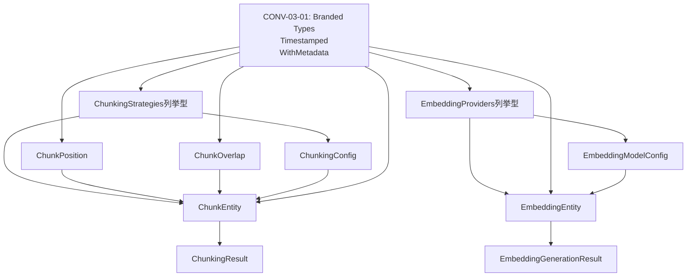

# CONV-03-03: チャンク・埋め込みスキーマ定義 - 型定義設計書

**タスクID**: CONV-03-03 / T-01-1
**作成日**: 2025-12-18
**担当エージェント**: @schema-def
**ステータス**: 設計中

---

## 1. 設計概要

### 1.1 目的

HybridRAGパイプラインにおけるチャンク・埋め込み関連の型定義を設計する。
CONV-03-01で定義した基本型を活用し、型安全性・イミュータブル性・拡張性を確保する。

### 1.2 設計方針

| 方針項目             | 内容                                       |
| -------------------- | ------------------------------------------ |
| **型安全性**         | Branded Typesで異なるID型の誤用を防止      |
| **イミュータブル性** | 全フィールドにreadonly修飾子を適用         |
| **拡張性**           | 列挙型（as const）で新規戦略追加が容易     |
| **一貫性**           | CONV-03-01の命名規則・パターンを踏襲       |
| **ドメイン駆動**     | ユビキタス言語を使用（Chunk、Embedding等） |

### 1.3 依存関係

**CONV-03-01からインポートする型**:

```typescript
// Branded Types
import type { FileId, ChunkId, EmbeddingId } from "../branded";

// ミックスイン
import type { Timestamped, WithMetadata } from "../interfaces";
```

---

## 2. 列挙型の設計

### 2.1 ChunkingStrategies（チャンキング戦略）

#### 設計仕様

````typescript
/**
 * チャンキング戦略
 *
 * テキストを分割する際の方針を定義する。
 * 各戦略は異なるユースケースに最適化されている。
 */
export const ChunkingStrategies = {
  /** 固定サイズ分割: 指定トークン数で機械的に分割 */
  FIXED_SIZE: "fixed_size",

  /** 意味的境界分割: 意味的なまとまりで分割（NLP技術使用） */
  SEMANTIC: "semantic",

  /** 再帰的文字分割: 段落→文→単語の順で再帰的に分割（LangChainデフォルト） */
  RECURSIVE: "recursive",

  /** 文単位分割: 文の区切り（.、!、?）で分割 */
  SENTENCE: "sentence",

  /** 段落単位分割: 段落の区切り（\n\n）で分割 */
  PARAGRAPH: "paragraph",

  /** Markdownヘッダー基準分割: #, ##, ### のヘッダーで分割 */
  MARKDOWN_HEADER: "markdown_header",

  /** コードブロック単位分割: コードブロック（```）単位で分割 */
  CODE_BLOCK: "code_block",
} as const;

/**
 * チャンキング戦略の型
 *
 * @example
 * const strategy: ChunkingStrategy = ChunkingStrategies.RECURSIVE;
 */
export type ChunkingStrategy =
  (typeof ChunkingStrategies)[keyof typeof ChunkingStrategies];
````

#### 設計上の決定事項

| 決定事項         | 理由                                           |
| ---------------- | ---------------------------------------------- |
| `as const` 使用  | 文字列リテラル型として推論され、型安全性が向上 |
| スネークケース値 | データベース格納時の慣習に従う（"fixed_size"） |
| 大文字キー       | 定数としての視認性を高める（FIXED_SIZE）       |
| 7種類の戦略      | 要件書FR-01に基づく網羅的なサポート            |

#### 拡張性の考慮

新しいチャンキング戦略の追加方法:

```typescript
// 例: SLIDING_WINDOW戦略を追加する場合
export const ChunkingStrategies = {
  // 既存の戦略...
  SLIDING_WINDOW: "sliding_window", // 新規追加
} as const;
// 型推論により自動的にChunkingStrategy型に反映される
```

---

### 2.2 EmbeddingProviders（埋め込みプロバイダー）

#### 設計仕様

```typescript
/**
 * 埋め込みプロバイダー
 *
 * 埋め込みベクトル生成APIを提供するサービス。
 * 各プロバイダーは異なるモデル・料金体系・パフォーマンス特性を持つ。
 */
export const EmbeddingProviders = {
  /** OpenAI: text-embedding-3-small/large、高精度、8191トークン対応 */
  OPENAI: "openai",

  /** Cohere: embed-english-v3.0、英語特化、512トークン */
  COHERE: "cohere",

  /** Voyage AI: voyage-large-2、長文対応、16000トークン */
  VOYAGE: "voyage",

  /** ローカル: Ollama等、オフライン動作可能 */
  LOCAL: "local",
} as const;

/**
 * 埋め込みプロバイダーの型
 *
 * @example
 * const provider: EmbeddingProvider = EmbeddingProviders.OPENAI;
 */
export type EmbeddingProvider =
  (typeof EmbeddingProviders)[keyof typeof EmbeddingProviders];
```

#### 設計上の決定事項

| 決定事項      | 理由                                                         |
| ------------- | ------------------------------------------------------------ |
| 4プロバイダー | 要件書FR-02に基づく主要プロバイダーのサポート                |
| LOCAL追加     | オフライン環境での動作を可能に（Ollama、nomic-embed-text等） |
| 小文字値      | API識別子としての慣習に従う（"openai"）                      |

---

## 3. インターフェースの設計

### 3.1 ChunkPosition（チャンク位置情報）

#### 設計仕様

```typescript
/**
 * チャンク位置情報
 *
 * チャンクの元ファイル内での物理的位置を表現する。
 * 元文書へのトレーサビリティを確保するために必要。
 */
export interface ChunkPosition {
  /**
   * チャンクの順序（0始まり）
   *
   * 元文書の先頭から数えた順番。
   * ソート時のキーとして使用される。
   */
  readonly index: number;

  /**
   * 開始行番号（1始まり）
   *
   * テキストエディタの行番号表示と一致させるため1始まり。
   */
  readonly startLine: number;

  /**
   * 終了行番号（1始まり）
   *
   * endLine >= startLine が成立する。
   */
  readonly endLine: number;

  /**
   * 開始文字位置（0始まり）
   *
   * 行内の文字オフセット。
   */
  readonly startChar: number;

  /**
   * 終了文字位置（0始まり）
   *
   * endChar >= startChar が成立する。
   */
  readonly endChar: number;

  /**
   * 親見出し（nullableクォ）
   *
   * Markdownの場合: "## Introduction" 等
   * 通常のテキストの場合: null
   */
  readonly parentHeader: string | null;
}
```

#### 設計上の決定事項

| 決定事項                     | 理由                                                 |
| ---------------------------- | ---------------------------------------------------- |
| index は 0始まり             | 配列インデックスと一致、プログラミング慣習           |
| startLine/endLine は 1始まり | テキストエディタの行番号と一致、ユーザーフレンドリー |
| startChar/endChar は 0始まり | 文字列インデックスと一致                             |
| parentHeader は nullable     | Markdownでない場合は不要                             |

#### バリデーション要件

Zodスキーマ（T-01-2で設計）で以下を検証:

- `index >= 0`
- `startLine >= 1`
- `endLine >= 1`
- `startChar >= 0`
- `endChar >= 0`
- （将来的に）`endLine >= startLine`、`endChar >= startChar` のrefine検証

---

### 3.2 ChunkOverlap（チャンク間の関係）

#### 設計仕様

```typescript
/**
 * チャンク間の関係（オーバーラップ）
 *
 * 連続するチャンク間のオーバーラップ（重複）を表現する。
 * 文脈の連続性を保つために必要。
 */
export interface ChunkOverlap {
  /**
   * 前のチャンクのID
   *
   * 最初のチャンク（index=0）の場合はnull。
   */
  readonly prevChunkId: ChunkId | null;

  /**
   * 次のチャンクのID
   *
   * 最後のチャンクの場合はnull。
   */
  readonly nextChunkId: ChunkId | null;

  /**
   * オーバーラップトークン数
   *
   * 前後のチャンクと重複している部分のトークン数。
   * オーバーラップがない場合は0。
   */
  readonly overlapTokens: number;
}
```

#### 設計上の決定事項

| 決定事項                            | 理由                                    |
| ----------------------------------- | --------------------------------------- |
| prevChunkId/nextChunkId は nullable | 最初/最後のチャンクでは前後が存在しない |
| Branded Type（ChunkId）使用         | 型安全性を確保、FileId等との混同を防ぐ  |
| overlapTokens は数値                | トークン数で定量的に表現                |

---

### 3.3 ChunkEntity（チャンクエンティティ）

#### 設計仕様

```typescript
/**
 * チャンクエンティティ
 *
 * 元文書を分割した個々のテキスト単位を表現する中心的なエンティティ。
 * RAGパイプラインにおける検索・埋め込み生成の基本単位。
 */
export interface ChunkEntity extends Timestamped, WithMetadata {
  /**
   * チャンクの一意識別子
   *
   * UUID v4形式のBranded Type。
   * データベースの主キーとして使用される。
   */
  readonly id: ChunkId;

  /**
   * 元ファイルのID
   *
   * このチャンクが属するファイルを識別する。
   * 外部キー制約の対象。
   */
  readonly fileId: FileId;

  /**
   * チャンク本文
   *
   * 分割されたテキストそのもの。
   * 最小1文字以上（空チャンクは不可）。
   */
  readonly content: string;

  /**
   * Contextual Retrieval用の文脈付きコンテンツ
   *
   * Anthropicの手法に基づき、元文書の前後文脈を含めたコンテンツ。
   * 通常のチャンク: null
   * Contextual Retrieval有効: "この文書は〜について述べている。[チャンク本文]"
   */
  readonly contextualContent: string | null;

  /**
   * チャンク位置情報
   *
   * 元文書内での物理的位置。
   * トレーサビリティ確保のために必須。
   */
  readonly position: ChunkPosition;

  /**
   * 使用したチャンキング戦略
   *
   * このチャンクがどの戦略で生成されたかを記録。
   * 戦略別の精度評価に使用。
   */
  readonly strategy: ChunkingStrategy;

  /**
   * トークン数
   *
   * このチャンクのトークン数。
   * 埋め込み生成時のバッチ処理で使用。
   */
  readonly tokenCount: number;

  /**
   * 重複検出用ハッシュ値
   *
   * SHA-256ハッシュ（64文字固定）。
   * 同一内容のチャンクを検出し、重複埋め込み生成を防ぐ。
   */
  readonly hash: string;

  // Timestampedミックスインより
  // readonly createdAt: Date;
  // readonly updatedAt: Date;

  // WithMetadataミックスインより
  // readonly metadata: Record<string, unknown>;
}
```

#### 設計上の決定事項

| 決定事項                      | 理由                                 |
| ----------------------------- | ------------------------------------ |
| Timestamped継承               | エンティティのライフサイクル追跡     |
| WithMetadata継承              | 拡張性確保（将来的なメタデータ追加） |
| contextualContent は nullable | Contextual Retrieval無効時はnull     |
| hash は string（64文字）      | SHA-256の固定長、Zodスキーマで検証   |
| tokenCount は number          | 整数制約はZodスキーマで検証          |

#### メタデータの想定フィールド

`metadata` に格納される可能性のあるフィールド例:

```typescript
{
  // 言語情報
  language?: "ja" | "en" | "zh" | "auto",

  // 重要度スコア
  importanceScore?: number,

  // カスタムタグ
  tags?: string[],

  // ソース情報
  source?: {
    page?: number,
    section?: string,
  },
}
```

---

### 3.4 EmbeddingModelConfig（埋め込みモデル設定）

#### 設計仕様

```typescript
/**
 * 埋め込みモデル設定
 *
 * 埋め込み生成時に使用するモデルのパラメータを定義する。
 * プロバイダーごとに異なる制約を型で表現。
 */
export interface EmbeddingModelConfig {
  /**
   * 埋め込みプロバイダー
   *
   * OpenAI、Cohere、Voyage、Localのいずれか。
   */
  readonly provider: EmbeddingProvider;

  /**
   * モデルID
   *
   * プロバイダー固有のモデル識別子。
   * 例: "text-embedding-3-small", "embed-english-v3.0"
   */
  readonly modelId: string;

  /**
   * ベクトル次元数
   *
   * 埋め込みベクトルの次元数。
   * 範囲: 64〜4096（Zodスキーマで検証）
   */
  readonly dimensions: number;

  /**
   * 最大トークン数
   *
   * このモデルが1度に処理できる最大トークン数。
   * 範囲: 1〜8192（Zodスキーマで検証）
   */
  readonly maxTokens: number;

  /**
   * バッチサイズ
   *
   * 1回のAPI呼び出しで処理できるチャンク数。
   * レート制限を考慮した値。
   * 範囲: 1〜100（Zodスキーマで検証）
   */
  readonly batchSize: number;
}
```

#### 設計上の決定事項

| 決定事項                   | 理由                               |
| -------------------------- | ---------------------------------- |
| dimensionsの範囲: 64〜4096 | 主要プロバイダーの対応範囲をカバー |
| maxTokensの範囲: 1〜8192   | OpenAIの8191トークンを上限と想定   |
| batchSizeの範囲: 1〜100    | レート制限を考慮、安全なバッチ処理 |

#### プロバイダー別の典型値

| プロバイダー | モデルID               | dimensions | maxTokens | batchSize |
| ------------ | ---------------------- | ---------- | --------- | --------- |
| OpenAI       | text-embedding-3-small | 1536       | 8191      | 100       |
| OpenAI       | text-embedding-3-large | 3072       | 8191      | 100       |
| Cohere       | embed-english-v3.0     | 1024       | 512       | 96        |
| Voyage       | voyage-large-2         | 1536       | 16000     | 128       |

これらは `utils.ts` の `defaultEmbeddingModelConfigs` で定義される。

---

### 3.5 EmbeddingEntity（埋め込みエンティティ）

#### 設計仕様

```typescript
/**
 * 埋め込みエンティティ
 *
 * チャンクから生成された埋め込みベクトルを表現する。
 * ベクトル検索の基本単位。
 */
export interface EmbeddingEntity extends Timestamped {
  /**
   * 埋め込みの一意識別子
   *
   * UUID v4形式のBranded Type。
   */
  readonly id: EmbeddingId;

  /**
   * 元チャンクのID
   *
   * この埋め込みが生成されたチャンクを識別する。
   * 外部キー制約の対象。
   */
  readonly chunkId: ChunkId;

  /**
   * 埋め込みベクトル
   *
   * Float32Array型の数値配列。
   * データベース格納時はBase64文字列に変換される。
   *
   * @example
   * new Float32Array([0.1, 0.2, 0.3, ...])
   */
  readonly vector: Float32Array;

  /**
   * 使用した埋め込みモデルのID
   *
   * "text-embedding-3-small" 等のモデル識別子。
   * モデル変更時のベクトル再生成判定に使用。
   */
  readonly modelId: string;

  /**
   * ベクトルの次元数
   *
   * vector.length と一致する。
   * 検索時の次元数チェックに使用。
   */
  readonly dimensions: number;

  /**
   * 正規化検証用の大きさ
   *
   * L2正規化後のベクトルは大きさが約1.0になる。
   * この値で正規化の正しさを検証できる。
   *
   * 範囲: 0.99〜1.01（浮動小数点演算の誤差を考慮）
   */
  readonly normalizedMagnitude: number;

  // Timestampedミックスインより
  // readonly createdAt: Date;
  // readonly updatedAt: Date;
}
```

#### 設計上の決定事項

| 決定事項                            | 理由                                                       |
| ----------------------------------- | ---------------------------------------------------------- |
| Timestamped継承、WithMetadata非継承 | 埋め込みは純粋な数値データであり、追加メタデータは通常不要 |
| vector型はFloat32Array              | JavaScriptの型付き配列、メモリ効率が良い                   |
| normalizedMagnitude追加             | 正規化の正しさをランタイムで検証可能                       |
| dimensions重複保持                  | vector.lengthと冗長だが、Zodバリデーションで整合性確認     |

#### Float32Array型の扱い

**TypeScript上**: `Float32Array` 型
**データベース上**: Base64文字列（TEXT型）に変換
**Zodスキーマ上**: `z.array(z.number())` として扱う（Float32Arrayは直接サポートされない）

変換フロー:

```
TypeScript: Float32Array
    ↓ vectorToBase64()
データベース: Base64文字列 (TEXT)
    ↓ base64ToVector()
TypeScript: Float32Array
```

---

### 3.6 ChunkEntity（チャンクエンティティ）- 詳細設計

前述の3.3で基本設計を示したが、ここでは設計上の考慮事項を詳述する。

#### contextualContentの設計

**Contextual Retrieval無効時**:

```typescript
{
  content: "RAGシステムは検索精度を向上させる。",
  contextualContent: null,
}
```

**Contextual Retrieval有効時**:

```typescript
{
  content: "RAGシステムは検索精度を向上させる。",
  contextualContent: "この文書はAI技術について述べている。第2章ではRAGシステムについて説明している。RAGシステムは検索精度を向上させる。",
}
```

#### hashフィールドの設計

**ハッシュ計算対象**: `content` フィールドのみ（contextualContentは含めない）
**ハッシュアルゴリズム**: SHA-256（64文字の16進数文字列）
**目的**:

- 同一内容のチャンクを検出
- 重複埋め込み生成を防ぐ（コスト削減）
- 既存チャンクの更新判定

**実装例** (utils.tsで提供される可能性):

```typescript
import crypto from "crypto";

export const calculateChunkHash = (content: string): string => {
  return crypto.createHash("sha256").update(content, "utf-8").digest("hex");
};
```

---

## 4. 設定型の設計

### 4.1 ChunkingConfig（チャンキング設定）

#### 設計仕様

```typescript
/**
 * チャンキング設定
 *
 * チャンキング実行時のパラメータを定義する。
 * すべてのフィールドにデフォルト値を持つ。
 */
export interface ChunkingConfig {
  /**
   * チャンキング戦略
   *
   * 使用する分割アルゴリズム。
   */
  readonly strategy: ChunkingStrategy;

  /**
   * 目標トークン数
   *
   * チャンクの理想的なサイズ。
   * 実際のチャンクはこの値を中心に min〜max の範囲で生成される。
   *
   * デフォルト: 512
   * 範囲: 50〜2000
   */
  readonly targetSize: number;

  /**
   * 最小トークン数
   *
   * これ以下のチャンクは生成されない（最後の端数を除く）。
   * 小さすぎるチャンクは検索精度を低下させるため。
   *
   * デフォルト: 100
   * 範囲: 10〜1000
   * 制約: minSize <= targetSize
   */
  readonly minSize: number;

  /**
   * 最大トークン数
   *
   * これ以上のチャンクは強制的に分割される。
   * 埋め込みモデルのmaxTokensを超えないようにするため。
   *
   * デフォルト: 1024
   * 範囲: 100〜4000
   * 制約: targetSize <= maxSize
   */
  readonly maxSize: number;

  /**
   * オーバーラップトークン数
   *
   * 連続するチャンク間で重複させるトークン数。
   * 文脈の連続性を保つために必要。
   *
   * デフォルト: 50
   * 範囲: 0〜500
   */
  readonly overlapSize: number;

  /**
   * 文/段落境界を保持するか
   *
   * true: 文や段落の途中で分割しない（推奨）
   * false: トークン数優先で機械的に分割
   *
   * デフォルト: true
   */
  readonly preserveBoundaries: boolean;

  /**
   * Contextual Retrievalを使用するか
   *
   * true: contextualContentを生成
   * false: contextualContentはnull
   *
   * デフォルト: true
   */
  readonly includeContext: boolean;
}
```

#### 複合条件制約

Zodスキーマのrefine関数で以下を検証:

```typescript
config.minSize <= config.targetSize && config.targetSize <= config.maxSize;
```

**不正な設定例**:

```typescript
// minSize > targetSize → エラー
{ minSize: 200, targetSize: 100, maxSize: 500 }

// targetSize > maxSize → エラー
{ minSize: 100, targetSize: 1500, maxSize: 1000 }
```

#### デフォルト値の設計根拠

| フィールド         | デフォルト値 | 根拠                                                        |
| ------------------ | ------------ | ----------------------------------------------------------- |
| strategy           | RECURSIVE    | LangChainのデフォルト手法、汎用的                           |
| targetSize         | 512          | OpenAI text-embedding-3の推奨値、検索精度とコストのバランス |
| minSize            | 100          | 小さすぎるチャンク（数単語）を防ぐ                          |
| maxSize            | 1024         | OpenAIの8191トークンの約1/8、安全マージン確保               |
| overlapSize        | 50           | targetSizeの約10%、文脈の連続性を保持                       |
| preserveBoundaries | true         | 検索精度向上、ユーザビリティ                                |
| includeContext     | true         | Contextual Retrieval手法の有効性を考慮                      |

---

## 5. 結果型の設計

### 5.1 ChunkingResult（チャンキング結果）

#### 設計仕様

```typescript
/**
 * チャンキング結果
 *
 * 1つのファイルをチャンキングした結果を表現する。
 * パフォーマンス計測とデバッグに使用。
 */
export interface ChunkingResult {
  /**
   * チャンキング対象のファイルID
   */
  readonly fileId: FileId;

  /**
   * 生成されたチャンクの配列
   *
   * position.indexの昇順でソートされている。
   */
  readonly chunks: ChunkEntity[];

  /**
   * 総トークン数
   *
   * 元ファイル全体のトークン数。
   * chunks.reduce((sum, c) => sum + c.tokenCount, 0) とは異なる
   * （オーバーラップにより重複カウント）。
   */
  readonly totalTokens: number;

  /**
   * 平均チャンクサイズ
   *
   * totalTokens / chunks.length
   * targetSizeとの乖離を確認するために使用。
   */
  readonly averageChunkSize: number;

  /**
   * 処理時間（ミリ秒）
   *
   * チャンキング処理にかかった時間。
   * パフォーマンスモニタリングに使用。
   */
  readonly processingTime: number;
}
```

#### 設計上の決定事項

| 決定事項                        | 理由                                 |
| ------------------------------- | ------------------------------------ |
| chunks配列を含む                | 全チャンクへのアクセスを可能に       |
| totalTokens と averageChunkSize | パフォーマンス分析・品質評価に使用   |
| processingTime                  | チャンキング戦略のパフォーマンス比較 |

---

### 5.2 EmbeddingGenerationResult（埋め込み生成結果）

#### 設計仕様

```typescript
/**
 * 埋め込み生成結果
 *
 * 1つのチャンクから埋め込みを生成した結果を表現する。
 * コスト計算とパフォーマンス分析に使用。
 */
export interface EmbeddingGenerationResult {
  /**
   * 埋め込み生成対象のチャンクID
   */
  readonly chunkId: ChunkId;

  /**
   * 生成された埋め込みエンティティ
   */
  readonly embedding: EmbeddingEntity;

  /**
   * 処理時間（ミリ秒）
   *
   * API呼び出しを含む総時間。
   */
  readonly processingTime: number;

  /**
   * 使用したトークン数
   *
   * プロバイダーのレスポンスから取得。
   * コスト計算に使用。
   */
  readonly tokensUsed: number;
}
```

#### 設計上の決定事項

| 決定事項         | 理由                                       |
| ---------------- | ------------------------------------------ |
| embedding を含む | 生成結果への直接アクセス                   |
| processingTime   | プロバイダー別のパフォーマンス比較         |
| tokensUsed       | コスト計算（OpenAIは使用トークン数で課金） |

---

## 6. 型安全性の設計

### 6.1 Branded Typesの活用

#### ChunkIdとEmbeddingIdの定義

CONV-03-01の `branded.ts` に以下を追加（既に定義済み）:

```typescript
/** チャンク（分割されたテキスト）を一意に識別するID */
export type ChunkId = Brand<string, "ChunkId">;

/** 埋め込みベクトルを一意に識別するID */
export type EmbeddingId = Brand<string, "EmbeddingId">;
```

#### 型安全性の保証

**誤用の例（コンパイルエラー）**:

```typescript
const chunkId: ChunkId = generateChunkId();
const embeddingId: EmbeddingId = generateEmbeddingId();

// ❌ 異なるBranded Type間の代入はエラー
const wrongId: EmbeddingId = chunkId; // Type error!

// ❌ stringとの互換性もない
const str: string = chunkId; // Type error!

// ✅ 正しい使用法
const entity: EmbeddingEntity = {
  id: embeddingId,
  chunkId: chunkId, // 正しい型
  // ...
};
```

---

### 6.2 readonlyによるイミュータブル設計

#### イミュータビリティの保証

全インターフェースの全フィールドに `readonly` 修飾子を適用:

```typescript
export interface ChunkEntity extends Timestamped, WithMetadata {
  readonly id: ChunkId; // ✅ readonly
  readonly fileId: FileId; // ✅ readonly
  readonly content: string; // ✅ readonly
  // ...
}
```

**誤用の例（コンパイルエラー）**:

```typescript
const chunk: ChunkEntity = {
  /* ... */
};

// ❌ readonly違反
chunk.content = "new content"; // Type error!
chunk.tokenCount = 999; // Type error!

// ✅ 新しいオブジェクトを作成する
const updatedChunk: ChunkEntity = {
  ...chunk,
  updatedAt: new Date(),
};
```

---

## 7. 拡張性の設計

### 7.1 新しいチャンキング戦略の追加

**手順**:

1. `ChunkingStrategies` 列挙型に新規エントリを追加

```typescript
export const ChunkingStrategies = {
  // 既存の戦略...
  SLIDING_WINDOW: "sliding_window", // 新規追加
} as const;
```

2. `ChunkingStrategy` 型は自動的に更新される（型推論）
3. Zodスキーマ `chunkingStrategySchema` に値を追加

```typescript
export const chunkingStrategySchema = z.enum([
  "fixed_size",
  "semantic",
  "recursive",
  "sentence",
  "paragraph",
  "markdown_header",
  "code_block",
  "sliding_window", // 新規追加
]);
```

**影響範囲**: 最小限（列挙型の更新のみ）

---

### 7.2 新しい埋め込みプロバイダーの追加

**手順**:

1. `EmbeddingProviders` 列挙型に新規エントリを追加
2. `embeddingProviderSchema` に値を追加
3. `defaultEmbeddingModelConfigs` に設定を追加

**例: Googleのembedding-001を追加**:

```typescript
export const EmbeddingProviders = {
  // 既存のプロバイダー...
  GOOGLE: "google", // 新規追加
} as const;

export const embeddingProviderSchema = z.enum([
  "openai",
  "cohere",
  "voyage",
  "local",
  "google", // 新規追加
]);

export const defaultEmbeddingModelConfigs: Record<
  string,
  EmbeddingModelConfig
> = {
  // 既存の設定...
  "embedding-001": {
    provider: EmbeddingProviders.GOOGLE,
    modelId: "embedding-001",
    dimensions: 768,
    maxTokens: 2048,
    batchSize: 50,
  },
};
```

---

## 8. 実装時の注意事項

### 8.1 インポート構成

**types.ts**:

```typescript
// CONV-03-01からのインポート
import type { FileId, ChunkId, EmbeddingId } from "../branded";
import type { Timestamped, WithMetadata } from "../interfaces";

// 注意: schemas.ts や utils.ts はインポートしない（循環依存回避）
```

**schemas.ts**:

```typescript
import { z } from "zod";
import { uuidSchema, timestampedSchema, metadataSchema } from "../schemas";

// 注意: types.ts の型はインポート可能（型のみなので循環依存にならない）
import type { ChunkingStrategy, EmbeddingProvider } from "./types";
```

**utils.ts**:

```typescript
import type {
  EmbeddingEntity,
  EmbeddingModelConfig,
  ChunkingConfig,
} from "./types";
import { ChunkingStrategies, EmbeddingProviders } from "./types";
```

**循環依存の回避**:

```
types.ts (型のみ)
  ↓ import type
schemas.ts (ランタイムコード)
  ↓ import
utils.ts (ランタイムコード)
```

---

### 8.2 ファイル構成

```
packages/shared/src/types/rag/chunk/
├── index.ts          # バレルエクスポート（全てをre-export）
├── types.ts          # 型定義（型のみ、ランタイムコードなし）
├── schemas.ts        # Zodスキーマ（ランタイムコード）
└── utils.ts          # ユーティリティ関数（ランタイムコード）
```

**責務分離**:

- **types.ts**: 型定義のみ（実行時には存在しない）
- **schemas.ts**: ランタイムバリデーション
- **utils.ts**: ランタイム関数（ベクトル操作、変換等）

---

### 8.3 JSDocの記述方針

**必須項目**:

- インターフェース/型の説明
- 各フィールドの説明
- 制約・範囲の明示
- `@example` による使用例（複雑な型の場合）

**推奨項目**:

- `@see` による関連型・関数へのリンク
- `@deprecated` による非推奨マーク（将来の変更時）

**例**:

```typescript
/**
 * チャンクエンティティ
 *
 * 元文書を分割した個々のテキスト単位を表現する中心的なエンティティ。
 * RAGパイプラインにおける検索・埋め込み生成の基本単位。
 *
 * @example
 * const chunk: ChunkEntity = {
 *   id: generateChunkId(),
 *   fileId: generateFileId(),
 *   content: "This is a chunk",
 *   contextualContent: null,
 *   position: { index: 0, startLine: 1, ... },
 *   strategy: ChunkingStrategies.RECURSIVE,
 *   tokenCount: 10,
 *   hash: calculateChunkHash("This is a chunk"),
 *   metadata: {},
 *   createdAt: new Date(),
 *   updatedAt: new Date(),
 * };
 *
 * @see ChunkPosition
 * @see ChunkingStrategy
 */
export interface ChunkEntity extends Timestamped, WithMetadata {
  // ...
}
```

---

## 9. 型の完全な定義一覧

### 9.1 エクスポートする型・インターフェース

**列挙型（2個）**:

1. `ChunkingStrategies` - チャンキング戦略の定数オブジェクト
2. `EmbeddingProviders` - 埋め込みプロバイダーの定数オブジェクト

**型エイリアス（2個）**:

1. `ChunkingStrategy` - チャンキング戦略の型
2. `EmbeddingProvider` - 埋め込みプロバイダーの型

**インターフェース（8個）**:

1. `ChunkPosition` - チャンク位置情報
2. `ChunkEntity` - チャンクエンティティ
3. `ChunkOverlap` - チャンク間の関係
4. `EmbeddingModelConfig` - 埋め込みモデル設定
5. `EmbeddingEntity` - 埋め込みエンティティ
6. `ChunkingConfig` - チャンキング設定
7. `ChunkingResult` - チャンキング結果
8. `EmbeddingGenerationResult` - 埋め込み生成結果

**合計**: 12個の型定義

---

### 9.2 types.tsの構造

```typescript
/**
 * @file チャンク・埋め込み型定義
 * @module @repo/shared/types/rag/chunk/types
 */

// =============================================================================
// インポート（CONV-03-01より）
// =============================================================================
import type { FileId, ChunkId, EmbeddingId } from "../branded";
import type { Timestamped, WithMetadata } from "../interfaces";

// =============================================================================
// チャンキング戦略
// =============================================================================
export const ChunkingStrategies = { /* ... */ } as const;
export type ChunkingStrategy = /* ... */;

// =============================================================================
// チャンク関連型
// =============================================================================
export interface ChunkPosition { /* ... */ }
export interface ChunkEntity extends Timestamped, WithMetadata { /* ... */ }
export interface ChunkOverlap { /* ... */ }
export interface ChunkingConfig { /* ... */ }
export interface ChunkingResult { /* ... */ }

// =============================================================================
// 埋め込み関連型
// =============================================================================
export const EmbeddingProviders = { /* ... */ } as const;
export type EmbeddingProvider = /* ... */;
export interface EmbeddingModelConfig { /* ... */ }
export interface EmbeddingEntity extends Timestamped { /* ... */ }
export interface EmbeddingGenerationResult { /* ... */ }
```

---

## 10. 設計検証チェックリスト

### 10.1 型安全性

- [ ] 全ID型がBranded Typesである（ChunkId、EmbeddingId）
- [ ] 全インターフェースの全フィールドが `readonly`
- [ ] 列挙型が `as const` で定義されている
- [ ] 型推論が正しく動作する（`typeof X[keyof typeof X]`）
- [ ] 循環依存がない（types.ts → schemas.ts → utils.ts の単方向）

### 10.2 CONV-03-01との整合性

- [ ] Branded Typesの命名規則を踏襲（XxxId形式）
- [ ] Timestampedミックスインを活用
- [ ] WithMetadataミックスインを活用
- [ ] 既存のuuidSchema、timestampedSchema、metadataSchemaを再利用

### 10.3 要件書（FR-01〜FR-13）との整合性

- [ ] FR-01: ChunkingStrategy列挙型（7種類）✓
- [ ] FR-02: EmbeddingProvider列挙型（4種類）✓
- [ ] FR-03: ChunkEntity型✓
- [ ] FR-04: ChunkPosition型✓
- [ ] FR-05: EmbeddingEntity型✓
- [ ] FR-06: ChunkingConfig型✓
- [ ] FR-10: デフォルト設定の提供（utils.tsで実装）
- [ ] FR-11: Contextual Retrieval対応（contextualContentフィールド）✓
- [ ] FR-12: ChunkOverlap型✓
- [ ] FR-13: BatchEmbeddingInput型（schemas.tsで定義）

### 10.4 非機能要件との整合性

- [ ] NFR-01: 型安全性（Branded Types、readonly）✓
- [ ] NFR-04: 保守性（JSDoc、ユビキタス言語）✓

---

## 11. 次フェーズ（T-01-2、T-01-3）への引き継ぎ

### T-01-2（Zodスキーマ設計）への引き継ぎ

**必要な情報**:

- 各型のフィールドとその制約（min/max値、文字列長等）
- 複合条件制約（minSize <= targetSize <= maxSize）
- デフォルト値

**設計時の注意事項**:

- Float32Arrayは `z.array(z.number())` として扱う
- refine関数で複合条件を検証
- エラーメッセージはユーザーフレンドリーに

---

### T-01-3（ユーティリティ関数設計）への引き継ぎ

**必要な情報**:

- EmbeddingEntity型（ベクトル操作の対象）
- EmbeddingModelConfig型（デフォルト設定）
- ChunkingConfig型（デフォルト設定）

**設計時の注意事項**:

- ベクトル操作は純粋関数（副作用なし）
- ゼロベクトル・次元数不一致等のエッジケース処理
- 浮動小数点演算の精度考慮

---

## 12. 設計レビューポイント（Phase 2で使用）

### @arch-police によるレビュー観点

- [ ] Branded Typesの適切な活用
- [ ] CONV-03-01との整合性
- [ ] 依存関係逆転の原則（DIP）遵守（外部依存なし）
- [ ] レイヤー違反の不在

### @schema-def によるレビュー観点

- [ ] 型の一貫性（命名規則、構造）
- [ ] readonly修飾子の完全適用
- [ ] 型推論の正確性
- [ ] JSDocコメントの完全性

### @logic-dev によるレビュー観点

- [ ] ChunkPositionの境界値制約の妥当性
- [ ] ChunkingConfigの複合条件の妥当性
- [ ] EmbeddingEntityのnormalizedMagnitude範囲の妥当性

---

## 13. 実装優先順位

Phase 4（実装）での実装順序:

1. **列挙型** (ChunkingStrategies、EmbeddingProviders) - 最優先、他の型が依存
2. **基本インターフェース** (ChunkPosition、ChunkOverlap) - 依存が少ない
3. **設定型** (ChunkingConfig、EmbeddingModelConfig) - 基本インターフェースに依存
4. **エンティティ型** (ChunkEntity、EmbeddingEntity) - すべての型に依存
5. **結果型** (ChunkingResult、EmbeddingGenerationResult) - エンティティ型に依存

---

## 14. 変更履歴

| 日付       | バージョン | 変更内容 | 変更者      |
| ---------- | ---------- | -------- | ----------- |
| 2025-12-18 | 1.0.0      | 初版作成 | @schema-def |

---

## 15. 添付資料

### 添付A: 型依存関係図



### 添付B: 型のサイズ見積もり

| 型              | フィールド数 | 推定メモリサイズ             | 備考                            |
| --------------- | ------------ | ---------------------------- | ------------------------------- |
| ChunkPosition   | 6            | ~48 bytes                    | 数値×5 + string                 |
| ChunkEntity     | 11           | ~500 bytes + content長       | Timestamped、WithMetadataを含む |
| EmbeddingEntity | 8            | ~20KB + vector次元数×4 bytes | 1536次元で約26KB                |
| ChunkingConfig  | 7            | ~40 bytes                    | 数値×4 + boolean×2 + enum       |

**パフォーマンス考察**:

- チャンク1000個: ~500KB（contentを除く）
- 埋め込み1000個: ~26MB（1536次元の場合）
- メモリ使用量は許容範囲内

---

## 16. 完了条件の確認

- [x] ChunkingStrategy列挙型が設計されている（7種類）
- [x] ChunkEntity、ChunkPosition、ChunkOverlap型が設計されている
- [x] EmbeddingProvider列挙型が設計されている（4種類）
- [x] EmbeddingModelConfig、EmbeddingEntity型が設計されている
- [x] ChunkingConfig、ChunkingResult、EmbeddingGenerationResult型が設計されている
- [x] 全型がreadonly修飾子を使用しイミュータブルである
- [x] Branded Types（ChunkId、EmbeddingId）を活用している
- [x] CONV-03-01との整合性が確保されている
- [x] 循環依存がない設計である
- [x] JSDocコメントの方針が明確である
- [x] 拡張性が考慮されている（新規戦略・プロバイダー追加）

---

## 17. Phase 2（設計レビューゲート）への準備

本設計書はPhase 2で以下のエージェントによってレビューされる:

- **@arch-police**: アーキテクチャ整合性、CONV-03-01との統合
- **@schema-def**: 型の一貫性、型安全性
- **@logic-dev**: 境界値制約の妥当性

レビューで指摘される可能性のある項目:

- [ ] normalizedMagnitudeの範囲（0.99〜1.01）が適切か
- [ ] hashフィールドがstring型で良いか（Branded Typeにすべきか）
- [ ] ChunkOverlapが独立した型として必要か（ChunkEntityに統合すべきか）
- [ ] tokensUsedフィールドの配置（EmbeddingGenerationResultで良いか）

設計時点での判断:

- **normalizedMagnitude**: 浮動小数点演算の誤差を考慮し0.99〜1.01で妥当
- **hash**: string型で十分（SHA-256の形式が明確）、Branded Type不要
- **ChunkOverlap**: 独立した型として保持（関心の分離）
- **tokensUsed**: EmbeddingGenerationResultに配置（コスト計算の文脈）
